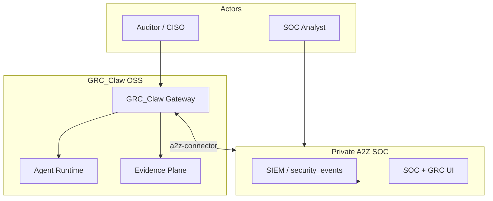

# GRC_Claw Architecture

GRC_Claw implements the **netsec-grc-architecture-engineering** skill: architecture-first, OpenClaw-style supervised daemons, three planes (control / data / evidence).

## C4 Context

## Planes

| Plane | Packages | Responsibility |
|-------|----------|----------------|
| **Control** | `gateway`, `agent-runtime` | Auth, routing, jobs, agent policy |
| **Evidence** | `evidence`, `frameworks` | Controls, tests, hashed artifacts |
| **Data** (via bridge) | `a2z-connector` | SIEM events, org/tenant sync |

## Gateway daemon

- Bind: `127.0.0.1:18791` (default; avoids OpenClaw `18789`, A2Z SOC `18790`)
- Single instance per cell (lock file)
- WebSocket `connect` + bearer token
- Idempotency cache for `evidence.attach`, `control.test`, `agent.tool`

Supervisor: `deploy/systemd/grc-claw-gateway.service` or Docker Compose.

## Module boundaries (OSS marketing)

Each package is publishable independently:

- Demos can ship **gateway + frameworks** only (no A2Z URL).
- Enterprise adds **`a2z-connector`** via private `.env` only.
- No proprietary A2Z SOC source in this repository.

## A2Z SOC integration points

| GRC_Claw action | A2Z SOC target |
|-----------------|----------------|
| Pull high/critical events | `security_events` (planned `GET /api/events`) |
| Push compliance alert | `compliance_alerts` / notifications |
| Map event → control | `event_data.compliance_impact` |
| Schedule tests | `background_jobs` (`compliance_check`) |
| Org context | `organization_members`, `compliance_frameworks` |

## ADRs

- [001 Modular monorepo](docs/adr/001-modular-monorepo.md)
- [002 Agentic AI exec policy](docs/adr/002-agentic-exec-policy.md)
