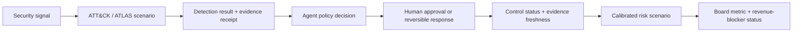
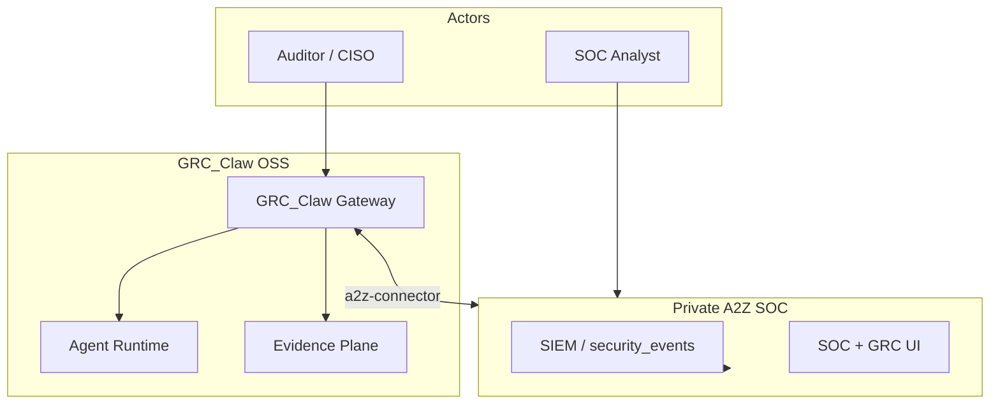
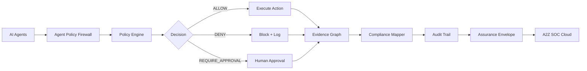
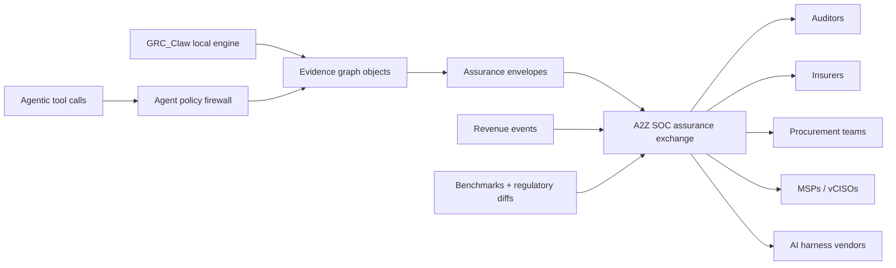
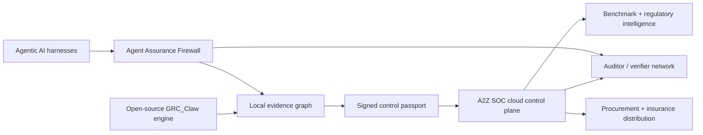

# GRC_Claw

**The Kubernetes of AI Governance** — Open-source ISO 42001 / Agentic AI Governance Chassis.

GRC_Claw is the first open-source governance platform purpose-built for the agent economy. Agents are first-class citizens with cryptographic identity, not afterthoughts bolted onto human-centric GRC.

[](LICENSE)
[](https://github.com/AAH20/GRC_Claw)
[](https://a2zsoc.com)

**اقرأ هذا الملف بالعربية:** [README.ar.md](../README.ar.md)

---

## Table of Contents

- [Overview](#overview)
- [Architecture](#architecture)
- [Quick Start](#quick-start)
- [Packages](#packages)
- [The Crosswalk Corpus](#the-crosswalk-corpus)
- [100-Agent Swarm Output](#100-agent-swarm-output)
- [Benchmark Intelligence](#benchmark-intelligence)
- [Phase 38: Trust Transaction Network](#phase-38-trust-transaction-network)
- [Hosted Platform & Commercial](#hosted-platform--commercial)
- [Sovereign / Air-Gap Mode](#sovereign--air-gap-mode)
- [Contributing](#contributing)
- [Community](#community)
- [License](#license)

---

## Overview

GRC_Claw is an open-source policy and evidence control plane for enterprise AI agents. It records agent identity, delegated authority, policy decisions, human approvals, action receipts, control mappings, and evidence provenance. Those records can be exported as assurance artifacts for security, GRC, audit, and procurement review.

### The Executive Outcome

GRC_Claw is designed to answer four questions with inspectable evidence:

1. **Which agent acted**, under whose authority, and with which tools?
2. **Did policy allow, deny, or require approval** for the action?
3. **Which control and risk assertions** are supported by current evidence?
4. **Which business decision** can be made, and which assumptions remain uncertain?

### Executive Active-Defense Assurance Loop



This loop is intentionally evidence-first. A control failure is not automatically a financial loss, a finding is not automatically a risk scenario, and pipeline is not automatically revenue.

### Six Decision Metrics

| Metric | Decision Supported |
|---|---|
| Material risk exposure, P50/P90 | How much loss exposure are we carrying? |
| Risk reduction per dollar | Which treatment changes exposure most efficiently? |
| Crown-jewel scenario coverage | Can we detect the threats that matter to the business? |
| Unsafe agent-action rate | Are agents staying within delegated authority? |
| Control-evidence freshness | Can we prove controls still operate? |
| GRC-at-risk and accelerated pipeline | Where is trust delaying growth? |

---

## Architecture

### System Context



### Governance Control Plane



### Assurance Exchange Flow



### Monopoly Dynamics



---

## Quick Start

```bash
# Install CLI globally
npm install -g @grc-claw/cli

# Scan current directory for compliance issues
grc scan .

# Run the autonomous compliance agent
grc agent run

# Bootstrap a sovereign (air-gap) deployment with Ollama
grc sovereign init
```

### Try one governed agent action in under five minutes

```bash
npm install
npm run demo:agent-policy-denial
npm run verify:agent-policy-denial
```

Expected: `fixtureCases: 2`, `expectedAllowed: 1`, `expectedDenied: 1`, `ledgerIntegrity: verified`.

---

## Packages (41 listed · 44 private — 85 total)

| Package | Description | Version |
|---------|-------------|---------|
| `@grc-claw/sdk` | TypeScript SDK for A2Z SOC platform | v0.8.0 |
| `@grc-claw/cli` | GRC CLI — 18 commands | v0.8.0 |
| `@grc-claw/mcp-server` | MCP server for Claude / AI assistant integration | v0.8.0 |
| `@grc-claw/compliance-copilot` | VS Code extension — 11 rules, 6 languages | v0.8.0 |
| `@grc-claw/agent-runtime` | 3-phase autonomous agent (plan → act → verify) | v0.8.0 |
| `@grc-claw/connectors` | BYOC LLM (OpenAI / Anthropic / Ollama) + SOVEREIGN_MODE | v0.8.0 |
| `@grc-claw/security-graph` | BFS blast-radius analysis | v0.8.0 |
| `@grc-claw/zk-compliance` | RFC 3161 TSA proof chain (FreeTSA.org, ASN.1/DER) | v0.8.0 |
| `@grc-claw/oscal` | OSCAL 1.1.2 SSP, POA&M, Component Definition export | v0.8.0 |
| `@grc-claw/soar` | SOAR playbook engine — 5 built-in playbooks | v0.8.0 |
| `@grc-claw/framework-crosswalk` | 27,596-mapping multi-framework crosswalk corpus | v0.8.0 |
| `@grc-claw/evidence` | SHA-256 evidence lineage + PostgreSQL persistence | v0.8.0 |
| `@grc-claw/agent-identity` | DID:GRC verifiable credentials (W3C VC JSON-LD) | v0.8.0 |
| `@grc-claw/risk-quantification` | Monte Carlo simulation + FAIR risk calculator | v0.8.0 |
| `@grc-claw/frameworks` | 13 compliance framework packs, 824 controls | v0.8.0 |
| `@grc-claw/ingest` | OSS SIEM / IDS / firewall + cloud normalizers | v0.8.0 |
| `@grc-claw/persistence` | PostgreSQL persistence layer | v0.8.0 |
| `@grc-claw/rbac-multi-tenant` | JWT auth, 5 roles, tenant isolation | v0.8.0 |
| `@grc-claw/compliance-autopilot` | Continuous monitoring + gap detection + remediation | v0.8.0 |
| `@grc-claw/drift-detector` | Compliance drift detection + severity scoring | v0.8.0 |
| `@grc-claw/policy-management-hub` | Policy lifecycle — create → approve → publish → attest | v0.8.0 |
| `@grc-claw/vendor-risk-management` | Vendor risk scoring + questionnaires + monitoring | v0.8.0 |
| `@grc-claw/observability` | OpenTelemetry tracing + Prometheus metrics | v0.8.0 |
| `@grc-claw/a2z-connector` | A2Z SOC platform API bridge | v0.8.0 |
| `@grc-claw/core` | Canonical events, GRCEngineFacade | v0.8.0 |
| `@grc-claw/gateway` | HTTP/WebSocket gateway daemon | v0.8.0 |
| `@grc-claw/continuous-trust-engine` | Dynamic trust scoring across evidence, controls, agents, risk, and behavior | v1.0.0 |
| `@grc-claw/agent-collaboration` | Multi-agent collaboration sessions, capability matching, and consensus workflows | v1.0.0 |
| `@grc-claw/regulatory-change-management` | Regulatory source tracking, impact analysis, timelines, and remediation gaps | v1.0.0 |
| `@grc-claw/ai-governance` | AI system inventory, EU AI Act risk classification, assessments, and monitoring | v1.0.0 |
| `@grc-claw/compliance-knowledge-graph` | Living graph of frameworks, controls, evidence, threats, technologies, and posture | v1.0.0 |
| `@grc-claw/predictive-compliance` | Failure forecasting, risk scoring, trend analysis, and remediation recommendations | v1.0.0 |
| `@grc-claw/compliance-marketplace` | Proof-backed compliance pack publishing, discovery, installation, and ratings | v1.0.0 |
| `@grc-claw/zero-trust-audit` | Cryptographic audit trail with hash chains, Merkle proofs, and evidence export | v1.0.0 |
| `@grc-claw/evidence-graph` | Deterministic graph-object envelope, hashing, and snapshot builder for gateway/MCP proof paths | v1.0.0 |
| `@grc-claw/federated-learning` | Federated learning network for cross-org compliance pattern sharing with differential privacy | v1.0.0 |
| `@grc-claw/compliance-intelligence-api` | Real-time compliance intelligence from the network — trends, benchmarks, recommendations | v1.0.0 |
| `@grc-claw/autonomous-compliance-agent` | Self-healing compliance — detect, diagnose, remediate, verify automatically | v1.0.0 |
| `@grc-claw/compliance-digital-twin` | Virtual compliance twin — simulate, forecast, what-if analysis | v1.0.0 |
| `@grc-claw/quantum-resistant-crypto` | NIST FIPS 203/204 post-quantum cryptography (Kyber + Dilithium + hybrid mode) | v1.0.0 |
| `@grc-claw/natural-language-compliance` | Ask compliance questions in plain English — 7 intents, 8 frameworks, 8 languages | v1.0.0 |
| `@grc-claw/compliance-automation-marketplace` | Share, discover, and monetize compliance automations — ratings, reviews, versioning | v1.0.0 |
| `@grc-claw/real-time-compliance-monitor` | Live compliance dashboards, alerts, SLA monitoring, trend analysis | v1.0.0 |
| `@grc-claw/infra-agent-assurance` | Compliance and attestation assurance envelopes for autonomous DevOps/IaC agents | v0.1.0 |

The remaining 44 packages are private or pre-release. See the monorepo root `package.json` for the full workspace list.

---

## The Crosswalk Corpus

The **375+ framework control mappings** stored in the live A2Z SOC database are GRC_Claw's most defensible asset. They express, for every control in every supported framework, exactly which controls in peer frameworks are equivalent or overlapping — so a single evidence artifact can satisfy requirements across multiple audits simultaneously.

- **20+ frameworks** covered: ISO 27001, SOC 2, NIST CSF, NIST 800-53, HIPAA, PCI DSS, GDPR, FedRAMP, CMMC, CIS Controls, DORA, NIS2, EU AI Act, COBIT 2019, HITRUST CSF, CSA CCM v4, IEC 62443, NERC CIP, NIST Privacy Framework, ISO 22301, and more
- **2,500+ unique controls** indexed
- Exposed via the **Crosswalk API** at [a2zsoc.com/crosswalk-api](https://a2zsoc.com/crosswalk-api)
- Consumed by `@grc-claw/framework-crosswalk` and the CLI `grc diff` command

---

## 100-Agent Swarm Output — Comprehensive Specification Library

This repository contains **180+ documents (~13 MB)** generated by 100 parallel AI agents across 2 waves:

| Category | Documents | Size |
|---|---|---|
| **Specifications** | 90+ | ~7.5 MB |
| **Implementation Guides** | 20+ | ~2.5 MB |
| **Deployment Files** | 243 | ~1.5 MB |
| **Gap Blueprints** | 4 | ~500 KB |
| **Strategy** | 7 | ~400 KB |
| **SDKs** | 57 | ~300 KB |

### Key Deliverables

- **11 governance frameworks** (ISO 42001, NIST AI RMF, EU AI Act, SOC 2, GDPR, HIPAA, PCI DSS, COBIT, NIST CSF, OWASP, CMMI)
- **68 controls** with cross-framework mapping
- **50+ Python modules** (3.10+, type hints, async/await)
- **40+ REST endpoints** (FastAPI, GraphQL, gRPC)
- **40+ frontend components** (React 18, TypeScript, shadcn/ui)
- **70+ Kubernetes manifests** (Deployments, Services, HPAs, PDBs, NetworkPolicies)
- **12 Dockerfiles** (multi-stage, distroless, non-root)
- **150+ test cases** (unit, integration, adversarial, performance, security)
- **20 gap blueprints** with implementation roadmaps

---

## Benchmark Intelligence

GRC_Claw's benchmark intelligence compares your compliance posture against anonymized industry peers across every major framework, by industry cohort and org size. Percentile ranking per framework with opt-in anonymized contribution.

**Key signals tracked:**
- **Evidence freshness** — how current your compliance evidence is across all frameworks
- **Policy denial rate** — frequency of agent policy denials as a security posture indicator
- **Verifier acceptance** — auditor and verifier network acceptance rates

**Outcomes measured:**
- **Audit cycle time** — reduction in days from audit start to completion
- **Remediation latency** — time from finding to verified remediation

---

## Phase 38: Trust Transaction Network — Graph-First Category Control

The Trust Transaction Network is GRC_Claw's graph-first category-control moat — a signed, portable trust object format that auditors, insurers, procurement teams, MSPs, and AI platforms can consume without trusting the vendor. The Phase 38 graph-first category control roadmap defines how this network becomes the defensible category.

Every agent action, evidence artifact, and compliance decision becomes a **signed trust transaction** — a hash-chained, tamper-evident receipt that can be independently verified by any party in the network.

The network effect: every new tenant, verifier, and framework mapping increases the value of the trust graph. Competitors can copy dashboards; they cannot quickly reproduce a normalized, versioned, auditor-usable graph of controls, evidence, mappings, owners, systems, and attestations.

---

## Hosted Platform & Commercial

GRC_Claw is the inspectable open-source engine. **A2Z SOC is the hosted trust, evidence, and partner control plane** for teams that need buyer-ready packets, recurring workspaces, white-label delivery, and senior advisory around CMMC, NIST 800-171, ISO 42001, NIST AI RMF, GRC automation, and agentic AI security.

| Offer | A2Z SOC route | Commercial shape |
|---|---|---|
| **AI Assurance Passport** | [`/ai-assurance-passport`](https://a2zsoc.com/ai-assurance-passport) | $2,500 setup + $3,500/mo managed evidence desk |
| **CMMC Procurement Readiness Desk** | [`/cmmc-procurement-readiness`](https://a2zsoc.com/cmmc-procurement-readiness) | $999 triage → $3,500/mo readiness desk |
| **Broker Trust Desk** | [`/broker-trust-desk`](https://a2zsoc.com/broker-trust-desk) | $999/mo partner fee + $199–$499/mo client workspaces |

---

## Sovereign / Air-Gap Mode

Set `SOVEREIGN_MODE=true` to route all LLM traffic through a local Ollama instance. No data leaves your network.

```bash
export SOVEREIGN_MODE=true
grc sovereign init
docker compose -f docker-compose.sovereign.yml up
```

---

## Contributing

GRC_Claw is MIT-licensed. PRs welcome — framework packs, language rules for the VS Code extension, additional Terraform resources, and connector implementations are the highest-value contributions.

```bash
git clone https://github.com/AAH20/GRC_Claw.git
cd GRC_Claw
npm install && npm run build
npm run test:comprehensive
```

**Test results:** 753+ tests passing, 0 failures.

See [CONTRIBUTING.md](contributing.md) for contribution guidelines, code style, and PR process.

---

## Community

- [COMMUNITY.md](../COMMUNITY.md) — code of conduct, support channels, and community norms
- [CONTRIBUTING.md](contributing.md) — how to contribute, run tests, and submit PRs
- [GitHub Discussions](https://github.com/AAH20/GRC_Claw/discussions) — questions, ideas, and show-and-tell
- [GitHub Issues](https://github.com/AAH20/GRC_Claw/issues) — bug reports and feature requests

---

## License

[MIT](LICENSE)
