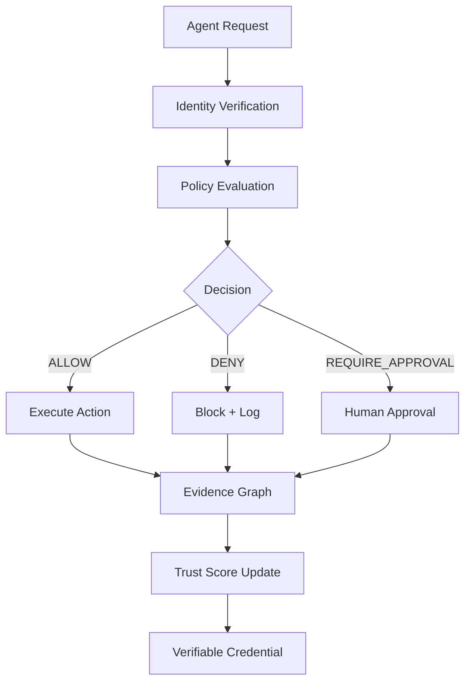
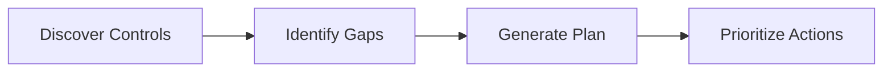
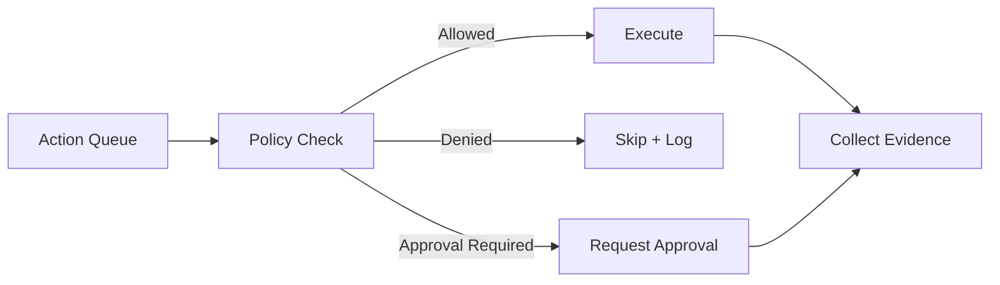
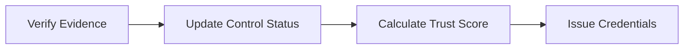
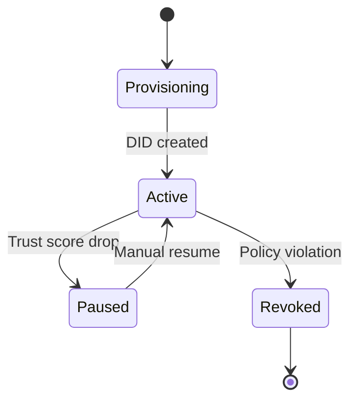
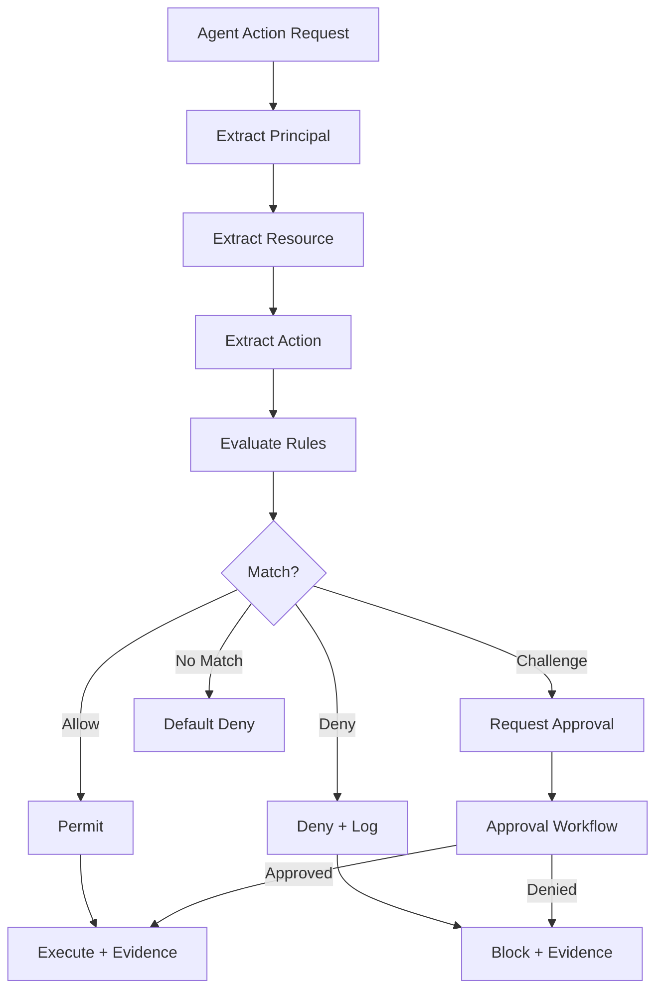
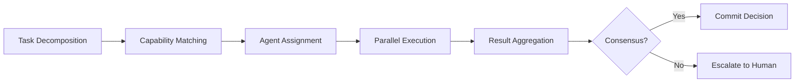

# GRC_Claw Agent Framework

> Last updated: 2026-10-01

GRC_Claw's agent framework provides a 3-phase autonomous agent runtime (plan → act → verify) with cryptographic identity, policy enforcement, and evidence collection.

---

## Table of Contents

- [Overview](#overview)
- [Agent Runtime](#agent-runtime)
- [3-Phase Execution Model](#3-phase-execution-model)
- [Agent Identity](#agent-identity)
- [Policy Framework](#policy-framework)
- [Trust Scoring](#trust-scoring)
- [Multi-Agent Collaboration](#multi-agent-collaboration)
- [Custom Agents](#custom-agents)
- [Agent API](#agent-api)

---

## Overview

GRC_Claw agents are first-class citizens with cryptographic identity, delegated authority, and policy-enforced action boundaries. Every agent action is recorded as a signed trust transaction in the evidence graph.



---

## Agent Runtime

The agent runtime is implemented in `@grc-claw/agent-runtime` and provides:

- **3-phase execution**: plan → act → verify
- **Policy enforcement**: per-action policy evaluation
- **Evidence collection**: automatic evidence graph mutation
- **Trust scoring**: dynamic trust score based on behavior
- **Auto-pause**: automatic pause when trust score drops below threshold

### Runtime Configuration

```typescript
interface AgentRuntimeConfig {
  agentId: string;
  tenantId: string;
  phases: ('plan' | 'act' | 'verify')[];
  maxActions: number;
  trustThreshold: number;
  autoPause: boolean;
  approvalRequired: string[];
  evidenceDir: string;
  llmProvider: 'openai' | 'anthropic' | 'ollama';
  llmModel?: string;
}
```

---

## 3-Phase Execution Model

### Phase 1: PLAN

The agent discovers controls, identifies gaps, and generates a remediation plan.



**Output:**
- Controls discovered count
- Gaps identified
- Remediation actions with priority

### Phase 2: ACT

The agent executes remediations within policy constraints.



**Output:**
- Actions executed
- Actions skipped (policy denied)
- Actions pending approval
- Evidence artifacts collected

### Phase 3: VERIFY

The agent verifies remediations and updates trust scores.



**Output:**
- Controls verified
- Trust score
- Verifiable credentials issued

---

## Agent Identity

### DID:GRC Verifiable Credentials

Each agent has a decentralized identifier (DID) with verifiable credentials (W3C VC JSON-LD).

```typescript
interface AgentIdentity {
  did: string;                      // did:grc:agent:tenant:uuid
  name: string;
  type: 'autonomous' | 'supervised' | 'human-in-the-loop';
  capabilities: string[];
  delegatedAuthority: {
    scope: string[];
    constraints: Record<string, unknown>;
    expiresAt: string;
  };
  credentials: VerifiableCredential[];
  trustScore: number;
  status: 'active' | 'paused' | 'revoked';
}
```

### Identity Lifecycle



---

## Policy Framework

### ExecPolicy

```typescript
interface ExecPolicy {
  policyId: string;
  tenantId: string;
  rules: ExecPolicyRule[];
  enforcement: 'enforce' | 'audit' | 'disabled';
  metadata: {
    version: number;
    effectiveFrom: string;     // ISO 8601
    effectiveTo: string;       // ISO 8601
    approvedBy: string;        // User ID
  };
}

interface ExecPolicyRule {
  ruleId: string;
  action: 'allow' | 'deny' | 'challenge';
  targets: {
    principal?: string;        // User or service account
    resource?: string;         // API endpoint or resource pattern
    action?: string;           // HTTP method or operation
    conditions?: Record<string, unknown>;  // Context-dependent
  };
  priority: number;            // Higher = evaluated first
  effect: 'permit' | 'deny';
}
```

### 3-Phase Exec Policy

```
Phase 1: Allowlist → Known good actions allowed
Phase 2: Approval → Unknown actions require human approval
Phase 3: Sandbox → Unrecognized actions blocked
```

### Policy Evaluation Flow



---

## Trust Scoring

### Five Weighted Factors

| Factor | Weight | Description |
|--------|--------|-------------|
| Evidence Freshness | 25% | How current compliance evidence is |
| Vulnerability Exposure | 25% | Known vulnerabilities and exposure |
| Control Test Pass Rate | 20% | Percentage of controls passing |
| Training Completion | 15% | Security training completion |
| Incident Transparency | 15% | Incident reporting and transparency |

### Trust Score Calculation

```typescript
interface TrustScore {
  overallScore: number;           // 0-100
  grade: 'A' | 'B' | 'C' | 'D' | 'F';
  factors: {
    evidenceFreshness: { score: number; max: number };
    vulnerabilityExposure: { score: number; max: number };
    controlTestPassRate: { score: number; max: number };
    trainingCompletion: { score: number; max: number };
    incidentTransparency: { score: number; max: number };
  };
  trend: string;                   // "+3 points since last assessment"
  lastAssessed: string;           // ISO 8601
}
```

### Trust Score Thresholds

| Threshold | Action |
|-----------|--------|
| ≥ 80 | Full autonomy |
| 60-79 | Supervised mode |
| 40-59 | Human-in-the-loop |
| < 40 | Auto-paused |

---

## Multi-Agent Collaboration

### Collaboration Sessions

```typescript
interface CollaborationSession {
  sessionId: string;
  participants: AgentIdentity[];
  task: string;
  consensusThreshold: number;     // Percentage required for consensus
  status: 'active' | 'completed' | 'failed';
  decisions: ConsensusDecision[];
}
```

### Capability Matching

Agents are matched to tasks based on their declared capabilities:

```typescript
interface CapabilityMatch {
  agentId: string;
  capability: string;
  proficiency: number;            // 0-100
  availability: boolean;
}
```

### Consensus Workflows



---

## Custom Agents

### Creating a Custom Agent

1. **Define agent configuration:**

```typescript
const myAgent: AgentConfig = {
  name: 'custom-compliance-agent',
  type: 'supervised',
  capabilities: ['code-review', 'secret-detection'],
  delegatedAuthority: {
    scope: ['src/', 'config/'],
    constraints: {
      maxFileBatchSize: 10,
      allowedActions: ['read', 'scan', 'report']
    },
    expiresAt: '2026-12-31T23:59:59Z'
  },
  policy: {
    enforcement: 'enforce',
    rules: [
      {
        ruleId: 'allow-read',
        action: 'allow',
        targets: { action: 'read' },
        priority: 1,
        effect: 'permit'
      },
      {
        ruleId: 'deny-delete',
        action: 'deny',
        targets: { action: 'delete' },
        priority: 100,
        effect: 'deny'
      }
    ]
  }
};
```

2. **Register the agent:**

```bash
grc agent register --config my-agent.json
```

3. **Run the agent:**

```bash
grc agent run --agent custom-compliance-agent --phases plan,act,verify
```

### Agent SDK

```typescript
import { AgentRuntime } from '@grc-claw/agent-runtime';

const runtime = new AgentRuntime({
  agentId: 'my-agent',
  tenantId: 'my-tenant',
  phases: ['plan', 'act', 'verify'],
  maxActions: 50,
  trustThreshold: 80,
  autoPause: true
});

const result = await runtime.execute({
  task: 'Scan codebase for compliance violations',
  context: { framework: 'soc2' }
});

console.log(result.evidence);
console.log(result.trustScore);
```

---

## Agent API

### Register Agent

```
POST /api/v1/agent/register
```

### Run Agent

```
POST /api/v1/agent/run
```

### Get Agent Status

```
GET /api/v1/agent/status/{run_id}
```

### List Agent Actions

```
GET /api/v1/agent/actions
```

### Get Trust Score

```
GET /api/v1/agent/trust-score
```

### Pause Agent

```
POST /api/v1/agent/{agent_id}/pause
```

### Resume Agent

```
POST /api/v1/agent/{agent_id}/resume
```

### Revoke Agent

```
POST /api/v1/agent/{agent_id}/revoke
```
