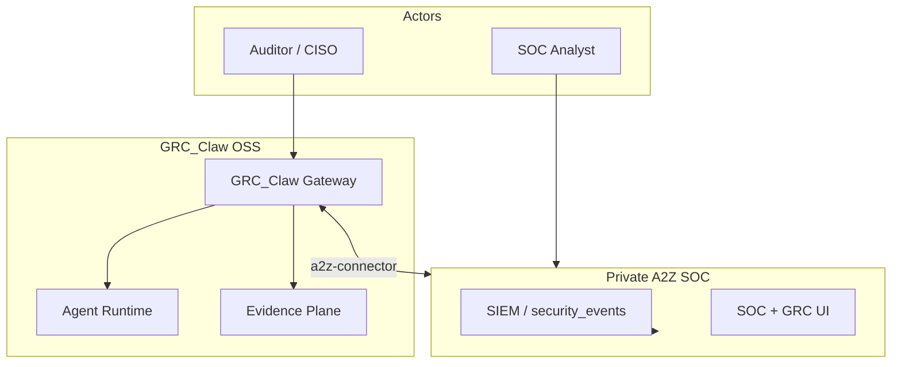

# GRC_Claw Architecture

> Last updated: 2026-10-01 | Status: Living Document

GRC_Claw implements the **netsec-grc-architecture-engineering** skill: architecture-first, OpenClaw-style supervised daemons, three planes (control / data / evidence).

---

## Table of Contents

- [C4 Context](#c4-context)
- [Planes](#planes)
- [Gateway Daemon](#gateway-daemon)
- [Module Boundaries](#module-boundaries)
- [A2Z SOC Integration Points](#a2z-soc-integration-points)
- [Gateway Modularization Plan](#gateway-modularization-plan)
- [Daemon Patterns for SOC Operations](#daemon-patterns-for-soc-operations)
- [Trust Zone Architecture](#trust-zone-architecture)
- [Data Flow Diagrams](#data-flow-diagrams)
- [API Contract Standards](#api-contract-standards)
- [ADRs](#adrs)

---

## C4 Context



---

## Planes

| Plane | Packages | Responsibility |
|-------|----------|----------------|
| **Control** | `gateway`, `agent-runtime` | Auth, routing, jobs, agent policy |
| **Evidence** | `evidence`, `frameworks` | Controls, tests, hashed artifacts |
| **Data** (via bridge) | `a2z-connector` | SIEM events, org/tenant sync |

---

## Gateway daemon

- Bind: `127.0.0.1:18791` (default; avoids OpenClaw `18789`, A2Z SOC `18790`)
- Single instance per cell (lock file)
- WebSocket `connect` + bearer token
- Idempotency cache for `evidence.attach`, `control.test`, `agent.tool`

Supervisor: `deploy/systemd/grc-claw-gateway.service` or Docker Compose.

---

## Module Boundaries

Each package is publishable independently:

- Demos can ship **gateway + frameworks** only (no A2Z URL).
- Enterprise adds **`a2z-connector`** via private `.env` only.
- No proprietary A2Z SOC source in this repository.

---

## A2Z SOC Integration Points

| GRC_Claw action | A2Z SOC target |
|-----------------|----------------|
| Pull high/critical events | `security_events` (planned `GET /api/events`) |
| Push compliance alert | `compliance_alerts` / notifications |
| Map event → control | `event_data.compliance_impact` |
| Schedule tests | `background_jobs` (`compliance_check`) |
| Org context | `organization_members`, `compliance_frameworks` |

---

## Gateway Modularization Plan

### Current State

The monolithic `server.ts` has grown to 4,200+ lines handling HTTP routing, policy evaluation, evidence persistence, export orchestration, marketplace logic, connector management, and agent dispatching.

### Target: Modular Gateway Core

Split into seven focused modules under `src/gateway/`:

| Module | Responsibility | Key Exports |
|--------|---------------|-------------|
| `route-registry/` | Typed route definitions, OpenAPI generation, versioned endpoints | `registerRoute()`, `buildOpenAPISpec()` |
| `policy-firewall/` | Per-request policy evaluation, OPA/Wasm integration, allow/deny/audit gates | `evaluatePolicy()`, `PolicyContext` |
| `evidence-graph-writer/` | Append-only evidence graph mutations, hash-chain verification, Supabase persistence | `writeEvidenceNode()`, `verifyChain()` |
| `verifier-export/` | Cross-tenant verifier runs, report assembly, PDF/CSV/JSON export | `runVerifier()`, `ExportResult` |
| `marketplace-execution/` | Marketplace plugin sandbox, billing hooks, metered usage tracking | `executePlugin()`, `UsageRecord` |
| `connector-lifecycle/` | Connector CRUD, health probes, credential rotation, TLS mutual auth | `registerConnector()`, `HealthStatus` |
| `agent-dispatch/` | OpenClaw daemon orchestration, task fan-out, result aggregation | `dispatchTask()`, `AgentHandle` |

### Migration Strategy

```
Phase 1: Extract route-registry (zero behavioral change)
Phase 2: Extract policy-firewall (pass-through wrapper in server.ts)
Phase 3: Extract evidence-graph-writer (same DB, new module boundary)
Phase 4: Extract remaining modules in dependency order
Phase 5: Remove server.ts, replace with thin composition root
```

Each phase ships behind a feature flag (`GATEWAY_MODULAR_V15=<module>`), with shadow-mode logging comparing old vs. new paths for 14 days before cutover.

### Inter-Module Contracts

All modules communicate via typed `GatewayEvent` payloads:

```typescript
interface GatewayEvent<T = unknown> {
  eventId: string;          // ULID
  tenantId: string;         // Tenant scoping
  source: ModuleId;         // Originating module
  timestamp: number;        // epoch-ms
  correlationId: string;    // Distributed tracing
  payload: T;
}
```

Events flow through an in-process `EventBus` (module-level pub/sub) during Phase 1–3, migrating to NATS/Kafka for distributed deployments in Phase 5.

---

## Daemon Patterns for SOC Operations

### OpenClaw-Style Cell Architecture

```
┌─────────────────────────────────────────────────────┐
│                   CONTROL PLANE                     │
│  ┌──────────┐  ┌──────────┐  ┌──────────────────┐  │
│  │ Gateway  │  │ Scheduler│  │ Policy Arbiter   │  │
│  │ (HTTP)   │  │ (Cron)   │  │ (OPA/Wasm)      │  │
│  └────┬─────┘  └────┬─────┘  └──────┬───────────┘  │
│       │              │               │               │
│  ┌────┴──────────────┴───────────────┴───────────┐  │
│  │           Event Bus (NATS / Kafka)             │  │
│  └────┬──────────────┬───────────────┬───────────┘  │
│       │              │               │               │
│  ┌────┴─────┐  ┌────┴─────┐  ┌─────┴────────┐     │
│  │ Worker 1 │  │ Worker 2 │  │ Worker N     │     │
│  │ (Daemon) │  │ (Daemon) │  │ (Daemon)     │     │
│  └──────────┘  └──────────┘  └──────────────┘     │
│                                                     │
│                   CELL BOUNDARY                     │
└─────────────────────────────────────────────────────┘
```

### Daemon Supervision Model

Each cell runs a **Supervisor** process (Node.js cluster or systemd-managed) that:

- Spawns worker daemons (one per CPU core, configurable)
- Implements exponential backoff restart on crash (1s → 2s → 4s → ... → 60s cap)
- Enforces watchdog timeouts (health ping every 30s, kill after 3 missed pings)
- Emits `daemon.liveness` and `daemon.health` events to the event bus
- Supports graceful shutdown via `SIGTERM` with 30s drain window

### Worker Daemon Responsibilities

| Daemon Type | Description | Concurrency Model |
|-------------|-------------|-------------------|
| `ingest-daemon` | Parses incoming alerts from connectors, normalizes to `security_events` | Worker pool (4–16) |
| `enrichment-daemon` | Enriches events with threat intel, asset context, user identity | Worker pool (2–8) |
| `detection-daemon` | Runs rule-based and ML-based detection logic | Single-threaded, batch |
| `response-daemon` | Executes playbook actions (isolate host, block IP, notify) | Worker pool (2–4) |
| `export-daemon` | Generates compliance reports, evidence bundles | Single-threaded |
| `sync-daemon` | Bidirectional sync with external SIEM/SOAR/ITSM | Worker pool (2–4) |

### Deployment Topology

```
Production (Kubernetes):
  - 1 control-plane pod (gateway + scheduler + arbiter)
  - N worker pods (autoscaled: 2–32 based on queue depth)
  - 1 event bus (NATS cluster, 3 nodes)

Development (Docker Compose):
  - Single process: gateway + all daemons (feature-flagged)
  - In-memory event bus
  - SQLite evidence store
```

---

## Trust Zone Architecture

### Network Segmentation

```
                        ┌─────────────────────┐
                        │   INTERNET / DMZ     │
                        │  (Untrusted Zone)    │
                        └──────────┬──────────┘
                                   │
                          ┌────────▼────────┐
                          │   WAF / CDN     │
                          │  (Cloudflare)   │
                          └────────┬────────┘
                                   │
                    ┌──────────────▼──────────────┐
                    │      DMZ (10.0.1.0/24)      │
                    │  ┌────────┐  ┌──────────┐   │
                    │  │ Reverse│  │ API      │   │
                    │  │ Proxy  │  │ Gateway  │   │
                    │  └────────┘  └──────────┘   │
                    └──────────────┬──────────────┘
                                   │
                    ┌──────────────▼──────────────┐
                    │  CORPORATE (10.0.2.0/24)    │
                    │  ┌────────┐  ┌──────────┐   │
                    │  │ Auth   │  │ Admin    │   │
                    │  │ Service│  │ Console  │   │
                    │  └────────┘  └──────────┘   │
                    └──────────────┬──────────────┘
                                   │
                    ┌──────────────▼──────────────┐
                    │  SOC MANAGEMENT (10.0.3.0/24)│
                    │  ┌────────┐  ┌──────────┐   │
                    │  │Evidence│  │ Policy   │   │
                    │  │ Graph  │  │ Arbiter  │   │
                    │  └────────┘  └──────────┘   │
                    └──────────────┬──────────────┘
                                   │
                    ┌──────────────▼──────────────┐
                    │  SENSOR/MONITOR (10.0.4.0/24)│
                    │  ┌────────┐  ┌──────────┐   │
                    │  │ Sensor │  │ Telemetry│   │
                    │  │ Agents │  │ Collector│   │
                    │  └────────┘  └──────────┘   │
                    └─────────────────────────────┘
```

### Trust Zone Rules

| Source → Destination | Allowed | Protocol | Authentication |
|---------------------|---------|----------|---------------|
| DMZ → Corporate | Read-only API | HTTPS/mTLS | OAuth2 + mTLS |
| DMZ → SOC Management | Write evidence, read policies | HTTPS/mTLS | Service account + mTLS |
| Corporate → SOC Management | Full access | HTTPS/mTLS | OAuth2 + RBAC |
| SOC Management → Sensor | Deploy agents, pull telemetry | gRPC/mTLS | Service account |
| Sensor → DMZ | Health pings only | HTTPS | Agent token |
| Sensor → Corporate | Denied | — | — |
| Sensor → Sensor | Denied (east-west isolation) | — | — |

### Data Classification

| Zone | Data Classification | Encryption at Rest | Encryption in Transit |
|------|-------------------|-------------------|---------------------|
| DMZ | Public / Internal | AES-256-GCM | TLS 1.3 |
| Corporate | Confidential | AES-256-GCM | TLS 1.3 |
| SOC Management | Restricted | AES-256-GCM + HSM | TLS 1.3 + mTLS |
| Sensor/Monitor | Internal / Confidential | AES-256-GCM | mTLS (gRPC) |

---

## Data Flow Diagrams

### North-South Traffic (External → Internal)

```
External Connector (e.g., SIEM, Cloud API)
       │
       │  HTTPS POST /api/v1/events/ingest
       │  Headers: Authorization: Bearer ***
       │           X-Tenant-Id: tenant-abc
       │           X-Idempotency-Key: <ulid>
       ▼
┌─────────────────────────────────────────┐
│ 1. WAF / Rate Limiter                  │
│    - IP reputation check               │
│    - Rate limit (1000 req/min/tenant)  │
│    - Payload size validation (≤10MB)   │
└────────────────┬────────────────────────┘
                 │
┌────────────────▼────────────────────────┐
│ 2. API Gateway (route-registry)         │
│    - JWT validation                     │
│    - Tenant context extraction          │
│    - Request logging (correlationId)    │
└────────────────┬────────────────────────┘
                 │
┌────────────────▼────────────────────────┐
│ 3. Policy Firewall                      │
│    - OPA evaluation                     │
│    - RBAC check                         │
│    - Data scope validation              │
└────────────────┬────────────────────────┘
                 │
┌────────────────▼────────────────────────┐
│ 4. Business Logic Module                │
│    - Validation, transformation         │
│    - Idempotency key check (Redis)      │
└────────────────┬────────────────────────┘
                 │
┌────────────────▼────────────────────────┐
│ 5. Evidence Graph Writer                │
│    - Append node to evidence chain      │
│    - Hash verification                  │
│    - Persist to Supabase               │
└────────────────┬────────────────────────┘
                 │
┌────────────────▼────────────────────────┐
│ 6. Event Bus → Daemons                  │
│    - ingest-daemon: normalize           │
│    - enrichment-daemon: enrich          │
│    - detection-daemon: detect           │
│    - response-daemon: act               │
└─────────────────────────────────────────┘
```

### East-West Traffic (Internal ↔ Internal)

```
┌──────────────┐         ┌──────────────┐
│  Worker A    │◄───────►│  Worker B    │
│  (Ingest)    │  gRPC   │  (Enrichment)│
└──────┬───────┘  mTLS   └──────┬───────┘
       │                        │
       │    ┌──────────────┐    │
       └───►│  Event Bus   │◄───┘
            │  (NATS)      │
            └──────┬───────┘
                   │
            ┌──────▼───────┐
            │  Evidence    │
            │  Graph       │
            │  Writer      │
            └──────┬───────┘
                   │
            ┌──────▼───────┐
            │  PostgreSQL  │
            │  (Supabase)  │
            └──────────────┘
```

### Data Flow Rules

1. All east-west communication uses mTLS with service mesh (Istio/Linkerd)
2. Event bus messages are signed with HMAC-SHA256 per-tenant
3. Evidence graph writes are append-only; reads are eventually consistent (≤5s lag)
4. Connector credentials stored in HashiCorp Vault, never in env vars or config files

---

## API Contract Standards

### Request Structure

```typescript
// All POST/PUT/PATCH requests require:
interface StandardRequest {
  headers: {
    'Authorization': 'Bearer <jwt>';
    'X-Tenant-Id': string;           // Tenant scoping
    'X-Idempotency-Key': string;     // ULID, mandatory for mutations
    'X-Correlation-Id'?: string;     // Distributed tracing
    'X-Schema-Version'?: number;     // API version pinning
  };
  body: unknown;                     // Validated against JSON Schema
}
```

### Idempotency

- All `POST`, `PUT`, `PATCH`, `DELETE` endpoints require `X-Idempotency-Key`
- Server stores key → response mapping for 72 hours (Redis TTL)
- Duplicate requests return cached response with `X-Idempotent-Replay: true`
- Keys are ULID-based (time-sortable, globally unique)

### Tenant Scoping

```
Every query, mutation, and event is scoped to a tenant:
  - JWT contains tenant claim
  - Database queries include WHERE tenant_id = ?
  - Evidence graph nodes carry tenant_id
  - Cross-tenant access is prohibited by policy firewall
```

### Error Model

```typescript
interface ApiError {
  error: {
    code: string;                    // Machine-readable (e.g., EVIDENCE_CHAIN_BROKEN)
    message: string;                 // Human-readable
    details?: Record<string, unknown>;
    correlationId: string;
    timestamp: string;               // ISO 8601
    retryable: boolean;
  };
}

// Standard HTTP status codes:
// 200 - Success
// 201 - Created
// 204 - No Content (delete success)
// 400 - Validation Error
// 401 - Authentication Required
// 403 - Authorization Denied
// 404 - Resource Not Found
// 409 - Conflict (e.g., idempotency key replay with different payload)
// 422 - Unprocessable Entity (business logic error)
// 429 - Rate Limited (includes Retry-After header)
// 500 - Internal Server Error
// 503 - Service Unavailable (includes Retry-After header)
```

### Pagination

```typescript
interface PaginatedResponse<T> {
  data: T[];
  pagination: {
    cursor: string | null;          // Cursor-based pagination
    hasMore: boolean;
    totalCount: number;             // Cached, ±1% accuracy
  };
}

// Usage:
// GET /api/v1/events?limit=50&cursor=***
// Response includes cursor for next page
```

---

## ADRs

- [001 Modular monorepo](adr/001-modular-monorepo.md)
- [002 Agentic AI exec policy](adr/002-agentic-exec-policy.md)
