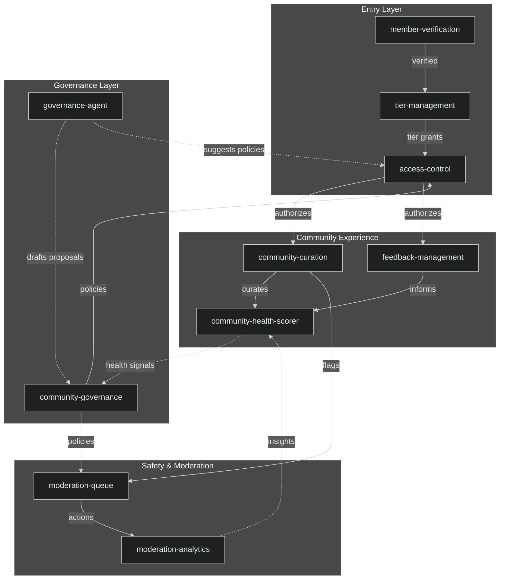

# Gated Communities

## Overview

The Gated Communities domain encompasses 10 integrated projects that power exclusive, membership-based digital communities. From access control and member verification to governance, moderation, and tiered benefits, these projects provide the full infrastructure for operating gated community platforms.

### Projects

| # | Project | Description |
|---|---------|-------------|
| 1 | `access-control` | Granular permission and access control engine for community resources |
| 2 | `community-curation` | Content and member curation tools for maintaining community quality |
| 3 | `community-governance` | Decentralized governance with proposals, voting, and delegation |
| 4 | `community-health-scorer` | Community health metrics and scoring for growth and retention analysis |
| 5 | `member-verification` | Identity verification and KYC-style member onboarding |
| 6 | `moderation-analytics` | Analytics for moderation actions, trends, and moderator performance |
| 7 | `moderation-queue` | Human moderation queue with escalation workflows and audit trails |
| 8 | `tier-management` | Membership tier creation, management, and benefit enforcement |
| 9 | `feedback-management` | Community feedback collection, routing, and resolution tracking |
| 10 | `governance-agent` | AI-assisted governance agent for proposal drafting and policy suggestions |

## Architecture



## Quick Start

### Prerequisites

- Node.js 20+ or Python 3.11+
- Docker & Docker Compose
- PostgreSQL 16+
- Redis 7+
- Ceramic/IDX (optional, for decentralized identity)

### Installation

```bash
# Clone the repository
git clone https://github.com/ahmedhassan/GRC_Claw.git
cd GRC_Claw

# Install dependencies
npm install

# Set up environment
cp .env.example .env
# Edit .env with your database and Redis credentials

# Start infrastructure
docker compose up -d postgres redis

# Run migrations
npm run migrate

# Seed sample data
npm run seed
```

### Running Gated Community Services

```bash
# Start all gated community domain services
npm run dev -- --domain=gated-communities

# Or start individually
npm run dev -- --project=access-control
npm run dev -- --project=community-governance
npm run dev -- --project=member-verification
```

### Verify

```bash
curl http://localhost:3000/api/v1/health
# Expected: {"status":"ok","domain":"gated-communities","services":10}
```

## API Reference Summary

### access-control

| Method | Endpoint | Description |
|--------|----------|-------------|
| POST | `/api/v1/permissions` | Create permission rule |
| GET | `/api/v1/permissions/:resource` | List permissions for resource |
| POST | `/api/v1/check` | Check access for user + resource |
| DELETE | `/api/v1/permissions/:id` | Remove permission rule |

### community-curation

| Method | Endpoint | Description |
|--------|----------|-------------|
| POST | `/api/v1/curate` | Curate content or members |
| GET | `/api/v1/curation/queue` | List items pending curation |
| PUT | `/api/v1/curation/:id` | Update curation decision |
| GET | `/api/v1/curation/highlights` | Get highlighted content |

### community-governance

| Method | Endpoint | Description |
|--------|----------|-------------|
| POST | `/api/v1/proposals` | Create governance proposal |
| GET | `/api/v1/proposals/:id` | Get proposal details |
| POST | `/api/v1/proposals/:id/vote` | Cast vote on proposal |
| GET | `/api/v1/proposals` | List active proposals |
| POST | `/api/v1/delegate` | Delegate voting power |

### community-health-scorer

| Method | Endpoint | Description |
|--------|----------|-------------|
| GET | `/api/v1/health/:communityId` | Get community health score |
| GET | `/api/v1/health/:communityId/trends` | Health score trends over time |
| GET | `/api/v1/health/leaderboard` | Healthiest communities leaderboard |

### member-verification

| Method | Endpoint | Description |
|--------|----------|-------------|
| POST | `/api/v1/verify` | Start verification process |
| GET | `/api/v1/verify/:id` | Get verification status |
| POST | `/api/v1/verify/:id/callback` | Verification provider callback |
| GET | `/api/v1/verifications` | List verifications |

### moderation-queue

| Method | Endpoint | Description |
|--------|----------|-------------|
| GET | `/api/v1/moderation/queue` | List items in moderation queue |
| POST | `/api/v1/moderation/:id/action` | Take moderation action |
| POST | `/api/v1/moderation/:id/escalate` | Escalate to senior moderator |
| GET | `/api/v1/moderation/history` | Moderation action history |

### moderation-analytics

| Method | Endpoint | Description |
|--------|----------|-------------|
| GET | `/api/v1/moderation/analytics/overview` | Moderation overview metrics |
| GET | `/api/v1/moderation/analytics/trends` | Moderation trend analysis |
| GET | `/api/v1/moderation/analytics/moderators` | Moderator performance stats |

### tier-management

| Method | Endpoint | Description |
|--------|----------|-------------|
| POST | `/api/v1/tiers` | Create membership tier |
| GET | `/api/v1/tiers/:id` | Get tier details |
| PUT | `/api/v1/tiers/:id` | Update tier |
| DELETE | `/api/v1/tiers/:id` | Delete tier |
| POST | `/api/v1/tiers/:id/assign` | Assign member to tier |

### feedback-management

| Method | Endpoint | Description |
|--------|----------|-------------|
| POST | `/api/v1/feedback` | Submit community feedback |
| GET | `/api/v1/feedback/:id` | Get feedback details |
| PUT | `/api/v1/feedback/:id/status` | Update feedback status |
| GET | `/api/v1/feedback` | List feedback items |

### governance-agent

| Method | Endpoint | Description |
|--------|----------|-------------|
| POST | `/api/v1/agent/draft-proposal` | AI-draft a governance proposal |
| GET | `/api/v1/agent/suggestions` | Get policy suggestions |
| POST | `/api/v1/agent/analyze` | Analyze governance data |

## Configuration

Each project reads from environment variables prefixed with `GATED_`:

```env
GATED_DATABASE_URL=postgresql://localhost:5432/gated_communities
GATED_REDIS_URL=redis://localhost:6379/2
GATED_OPENAI_API_KEY=sk-...
GATED_VERIFICATION_PROVIDER=onfido
GATED_MODERATION_ESCALATION_THRESHOLD=3
GATED_GOVERNANCE_MIN_QUORUM=0.2
GATED_CERAMIC_NODE=http://localhost:7007
```

## Monitoring

All gated community services expose Prometheus metrics at `/metrics` and health checks at `/health`. Governance events are emitted to a dedicated event bus (`gated.governance.events`) for transparency and auditability. Moderation actions are logged to an immutable audit trail.

## Contributing

See [CONTRIBUTING.md](../CONTRIBUTING.md) for guidelines. When adding new gated community projects, register them in `projects/gated-communities.yaml` and ensure they implement the shared `GatedCommunityService` interface.
