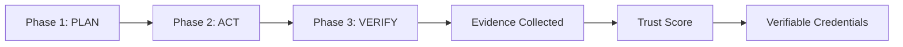

# Getting Started with GRC_Claw

> Last updated: 2026-10-01

This guide walks you through installing GRC_Claw, running your first compliance scan, and launching the autonomous compliance agent.

---

## Table of Contents

- [Prerequisites](#prerequisites)
- [Installation](#installation)
- [Quick Start](#quick-start)
- [Your First Scan](#your-first-scan)
- [Running the Autonomous Agent](#running-the-autonomous-agent)
- [Sovereign Deployment](#sovereign-deployment)
- [Next Steps](#next-steps)

---

## Prerequisites

| Requirement | Version | Notes |
|-------------|---------|-------|
| Node.js | >= 20 | LTS recommended |
| npm | >= 10 | Bundled with Node.js |
| Docker | >= 24 | For containerized deployments |
| PostgreSQL | >= 14 | For evidence persistence |
| Ollama | Latest | For sovereign/air-gap mode |

---

## Installation

### npm (recommended)

```bash
npm install -g @grc-claw/cli
```

### Homebrew (macOS / Linux)

```bash
brew tap a2zsoc/grc https://github.com/AAH20/GRC_Claw
brew install grc-claw
```

### From source

```bash
git clone https://github.com/AAH20/GRC_Claw.git
cd GRC_Claw
npm install && npm run build
```

### Verify installation

```bash
grc version
```

---

## Quick Start

### 1. Initialize your project

```bash
grc init
```

This scaffolds a `grcfile.yaml` configuration file and a GitHub Actions compliance workflow (`.github/workflows/grc-scan.yml`) in the current directory.

### 2. Scan your codebase

```bash
grc scan .
```

Produces a posture score (0-100) and maps findings to framework control IDs (SOC 2, ISO 27001, NIST CSF, etc.).

### 3. Generate a remediation plan

```bash
grc plan
```

### 4. Apply remediations

```bash
grc apply
```

### 5. Run a full audit

```bash
grc audit
```

---

## Your First Scan

### Basic scan

```bash
grc scan .
```

### Scan with specific framework

```bash
grc scan ./src --framework soc2
```

### Scan with JSON output

```bash
grc scan . --json --severity high
```

### Scan rules (12 built-in)

| # | Rule | Maps to |
|---|------|---------|
| 1 | Hardcoded secrets detection | SOC 2 CC6.1 |
| 2 | Logging compliance | SOC 2 CC7.2 |
| 3 | Encryption at rest | SOC 2 CC6.7, ISO 27001 A.10.1 |
| 4 | Access control patterns | SOC 2 CC6.1, ISO 27001 A.9 |
| 5 | Audit trail integrity | SOC 2 CC7.2, ISO 27001 A.12.4 |
| 6 | Error handling patterns | SOC 2 CC7.3 |
| 7 | Input validation | ISO 27001 A.14.2 |
| 8 | Transport security (TLS) | SOC 2 CC6.1, NIST SC-8 |
| 9 | Dependency vulnerability patterns | SOC 2 CC6.1 |
| 10 | Configuration file exposure | SOC 2 CC6.1 |
| 11 | Race condition patterns | ISO 27001 A.14.2 |
| 12 | Hardcoded credentials in config | SOC 2 CC6.1 |

---

## Running the Autonomous Agent

### Full agent cycle

```bash
grc agent run
```

### Dry run (plan only)

```bash
grc agent run --dry-run
```

### Run with organization context

```bash
grc agent run --org acme-corp --max-actions 10
```

### Run specific phases

```bash
grc agent run --phases plan,verify
```

### Agent phases



---

## Sovereign Deployment

For air-gapped or sovereign deployments, set `SOVEREIGN_MODE=true` to route all LLM traffic through a local Ollama instance. No data leaves your network.

```bash
export SOVEREIGN_MODE=true
grc sovereign init
docker compose -f docker-compose.sovereign.yml up
```

### Sovereign stack services

| Service | Description |
|---------|-------------|
| `ollama` | Local LLM backend |
| `grc-claw-gateway` | GRC_Claw gateway daemon |
| `supabase` | PostgreSQL persistence |
| `nginx` | Reverse proxy |

---

## Next Steps

- [Architecture](architecture.md) — Understand the system design
- [API Reference](api-reference.md) — Explore the REST API
- [Agent Framework](agent-framework.md) — Build custom agents
- [Governance](governance.md) — Configure policies and controls
- [Security](security.md) — Harden your deployment
- [Deployment](deployment.md) — Deploy to production
- [Monitoring](monitoring.md) — Set up observability
- [Tutorials](tutorials/campaign-optimizer.md) — Hands-on tutorials
