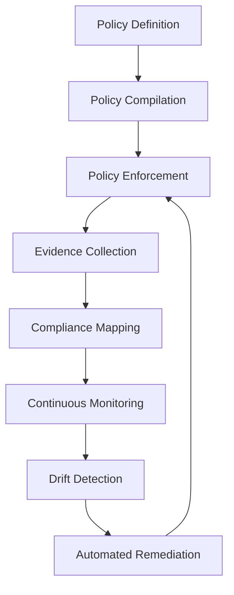
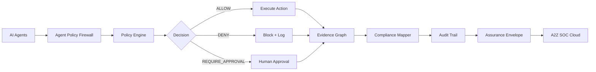
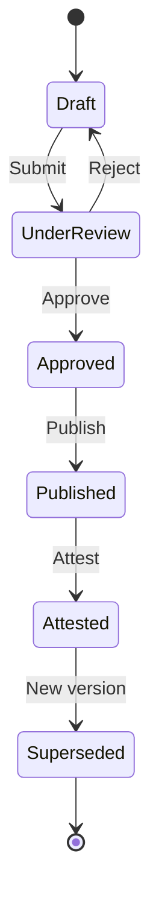
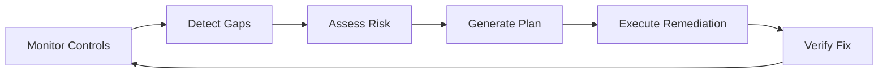
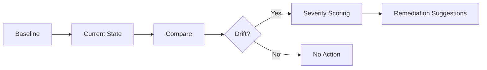
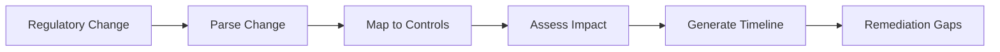
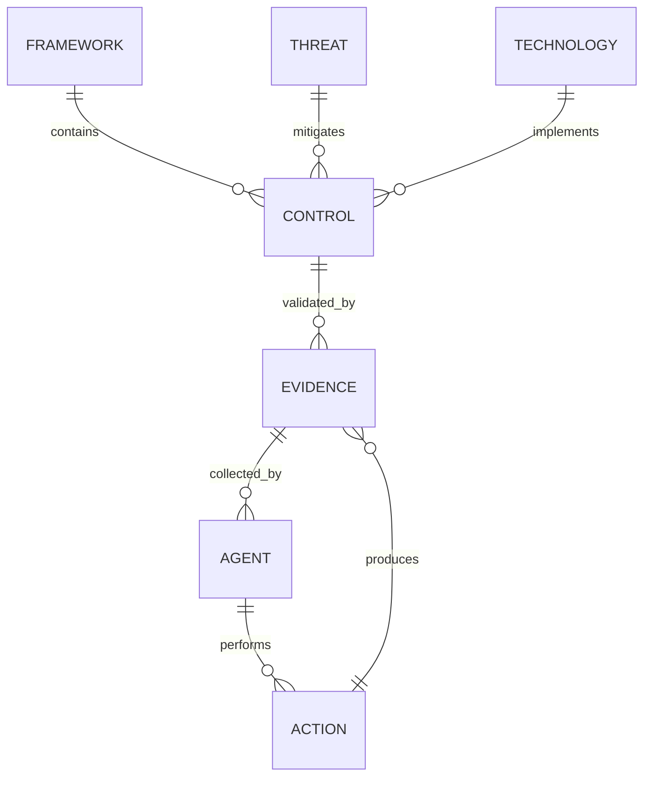

# GRC_Claw Governance

> Last updated: 2026-10-01

GRC_Claw's governance framework provides policy lifecycle management, compliance mapping, continuous monitoring, and automated remediation across 20+ compliance frameworks.

---

## Table of Contents

- [Overview](#overview)
- [Governance Control Plane](#governance-control-plane)
- [Policy Lifecycle](#policy-lifecycle)
- [Compliance Frameworks](#compliance-frameworks)
- [Continuous Compliance](#continuous-compliance)
- [Drift Detection](#drift-detection)
- [Risk Quantification](#risk-quantification)
- [Regulatory Change Management](#regulatory-change-management)
- [AI Governance](#ai-governance)
- [Compliance Knowledge Graph](#compliance-knowledge-graph)

---

## Overview

GRC_Claw's governance framework is built on three pillars:

1. **Policy as Code** — Policies are versioned, testable, and enforceable
2. **Evidence Graph** — Every compliance decision is backed by cryptographic evidence
3. **Continuous Monitoring** — Real-time compliance posture with automated remediation



---

## Governance Control Plane

### Architecture



### Policy Engine

The policy engine evaluates every agent action against configured policies:

- **OPA/Wasm** — Open Policy Agent for complex policy evaluation
- **RBAC** — Role-based access control
- **ABAC** — Attribute-based access control
- **ReBAC** — Relationship-based access control

---

## Policy Lifecycle

### Create → Approve → Publish → Attest



### Policy Definition

```yaml
# policy.yaml
apiVersion: grc/v1
kind: Policy
metadata:
  name: agent-exec-policy
  namespace: production
spec:
  enforcement: enforce
  rules:
    - name: allow-read
      action: allow
      targets:
        principal: "agent:compliance-scanner"
        resource: "src/**"
        action: "read"
      priority: 1
    - name: deny-delete
      action: deny
      targets:
        principal: "*"
        resource: "**"
        action: "delete"
      priority: 100
    - name: require-approval-deploy
      action: challenge
      targets:
        principal: "*"
        resource: "production/**"
        action: "deploy"
      priority: 50
```

### Policy Versioning

- Every policy change creates a new version
- Previous versions are retained for audit
- Rollback to any previous version is supported
- Policy diff shows changes between versions

---

## Compliance Frameworks

### Supported Frameworks (20+)

| Framework | Controls | Mappings | Status |
|-----------|----------|----------|--------|
| SOC 2 | 42 | 375 | ✅ Installed |
| ISO 27001 | 93 | 412 | ✅ Installed |
| NIST CSF | 106 | 389 | ✅ Installed |
| NIST 800-53 | 245 | 356 | ✅ Installed |
| HIPAA | 184 | 298 | Available |
| PCI DSS | 264 | 312 | Available |
| GDPR | 118 | 287 | Available |
| FedRAMP | 325 | 345 | Available |
| CMMC | 130 | 276 | Available |
| ISO 42001 | 27 | 198 | ✅ Installed |
| EU AI Act | 82 | 167 | Available |
| DORA | 156 | 234 | Available |
| NIS2 | 102 | 218 | Available |
| COBIT 2019 | — | — | Available |
| HITRUST CSF | — | — | Available |
| CSA CCM v4 | — | — | Available |
| IEC 62443 | — | — | Available |
| NERC CIP | — | — | Available |
| NIST Privacy Framework | — | — | Available |
| ISO 22301 | — | — | Available |

### Cross-Framework Mapping

The crosswalk corpus maps controls across frameworks so a single evidence artifact can satisfy requirements across multiple audits:

```
SOC 2 CC6.1 ↔ ISO 27001 A.9.4.2 ↔ NIST AC-2
SOC 2 CC7.2 ↔ ISO 27001 A.12.4.1 ↔ NIST AU-6
```

### Installing a Framework

```bash
grc marketplace install iso42001-starter
```

---

## Continuous Compliance

### Compliance Autopilot

The `@grc-claw/compliance-autopilot` package provides continuous monitoring with gap detection and remediation.



### Monitoring Loop

1. **Collect** — Gather evidence from all connected sources
2. **Evaluate** — Test controls against current evidence
3. **Detect** — Identify gaps and compliance drift
4. **Remediate** — Auto-fix or generate remediation plan
5. **Verify** — Confirm remediation effectiveness
6. **Report** — Update compliance posture

### Scheduled Tests

```yaml
# scheduled-tests.yaml
tests:
  - control: CC6.1
    schedule: "0 2 * * *"  # Daily at 2 AM
    evidence_sources:
      - github
      - aws-config
  - control: A.12.4
    schedule: "0 0 * * 0"  # Weekly on Sunday
    evidence_sources:
      - cloudtrail
      - splunk
```

---

## Drift Detection

### Compliance Drift

Drift detection compares current control state against the last established baseline:



### Drift Severity

| Severity | Description | Response |
|----------|-------------|----------|
| Critical | Security control disabled | Immediate alert + auto-remediation |
| High | Configuration changed | Alert + remediation plan |
| Medium | Policy deviation | Alert + review required |
| Low | Documentation gap | Log + scheduled review |

### Running Drift Detection

```bash
# Check drift from latest baseline
grc drift

# Drift against a specific git commit
grc drift --baseline abc1234

# Drift with severity filter
grc drift --severity high --fix
```

---

## Risk Quantification

### Monte Carlo Simulation

The `@grc-claw/risk-quantification` package provides Monte Carlo simulation for risk scenarios:

```typescript
interface RiskScenario {
  id: string;
  name: string;
  threat: string;
  assets: string[];
  controls: string[];
  simulations: number;            // Number of Monte Carlo iterations
  timeHorizon: string;            // ISO 8601 duration
}
```

### FAIR Risk Calculator

Factor Analysis of Information Risk (FAIR) methodology:

```typescript
interface FAIRAssessment {
  threatEventFrequency: number;   // Expected occurrences per year
  vulnerability: number;           // Probability of action (0-1)
  lossMagnitude: {
    primary: number;              // Direct loss
    secondary: number;            // Indirect loss
  };
  contactFrequency: number;
  probabilityOfAction: number;
  threatCapability: number;
  resistanceStrength: number;
}
```

### Risk Output

```json
{
  "scenario_id": "risk-001",
  "annual_loss_exposure": {
    "p50": 125000,
    "p90": 450000,
    "p99": 1200000
  },
  "risk_reduction": {
    "current": 0.35,
    "with_remediation": 0.72
  },
  "recommendations": [
    {
      "control": "CC6.1",
      "impact": 0.15,
      "effort": "quick-win"
    }
  ]
}
```

---

## Regulatory Change Management

### Regulatory Source Tracking

The `@grc-claw/regulatory-change-management` package tracks 10+ regulatory sources:

- NIST publications
- ISO standards
- EU regulations
- US federal regulations
- State regulations
- Industry-specific regulations

### Impact Analysis



### Change Alert Digest

```bash
# Get regulatory change digest
grc regulatory digest --frameworks soc2,iso27001

# Get impact analysis
grc regulatory impact --change-id reg-2026-001
```

---

## AI Governance

### AI System Inventory

The `@grc-claw/ai-governance` package maintains an inventory of all AI systems:

```typescript
interface AISystem {
  id: string;
  name: string;
  type: 'llm_assistant' | 'autonomous_agent' | 'ml_model' | 'ai_tool';
  model: string;
  provider: string;
  riskTier: 'minimal' | 'limited' | 'high' | 'unacceptable';
  frameworks: string[];
  controls: string[];
  assessments: Assessment[];
  monitoring: MonitoringConfig;
}
```

### EU AI Act Risk Classification

| Risk Tier | Requirements |
|-----------|-------------|
| Minimal | Transparency obligations |
| Limited | Transparency + record-keeping |
| High | Risk management + human oversight + conformity assessment |
| Unacceptable | Prohibited |

### AI BOM (Bill of Materials)

```bash
# Generate AI BOM
grc ai-bom generate

# Publish AI BOM
grc ai-bom publish
```

---

## Compliance Knowledge Graph

### Living Knowledge Graph

The `@grc-claw/compliance-knowledge-graph` package maintains a living graph of:

- Frameworks and controls
- Evidence artifacts
- Threat intelligence
- Technology inventory
- Compliance posture

### Graph Schema



### Query Interface

```bash
# Query the knowledge graph
grc knowledge query "Show all SOC 2 controls with failing evidence"

# Natural language compliance questions
grc knowledge ask "What are the requirements for ISO 42001 A.6.2?"
```
