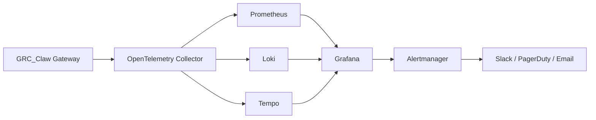

# GRC_Claw Monitoring Guide

> Last updated: 2026-10-01

GRC_Claw's monitoring stack provides observability across metrics, logs, traces, and alerts using Prometheus, Grafana, Loki, Tempo, and OpenTelemetry.

---

## Table of Contents

- [Overview](#overview)
- [Monitoring Stack](#monitoring-stack)
- [Metrics](#metrics)
- [Logs](#logs)
- [Traces](#traces)
- [Alerts](#alerts)
- [Dashboards](#dashboards)
- [Health Checks](#health-checks)
- [Compliance Monitoring](#compliance-monitoring)

---

## Overview



---

## Monitoring Stack

### Components

| Component | Purpose | Port |
|-----------|---------|------|
| Prometheus | Metrics collection and alerting | 9090 |
| Grafana | Visualization and dashboards | 3000 |
| Loki | Log aggregation | 3100 |
| Tempo | Distributed tracing | 3200 |
| OpenTelemetry Collector | Telemetry collection | 4318 |
| Alertmanager | Alert routing and notification | 9093 |

### Docker Compose

```yaml
version: "3.8"
services:
  prometheus:
    image: prom/prometheus:latest
    ports:
      - "9090:9090"
    volumes:
      - ./monitoring/prometheus/prometheus.yml:/etc/prometheus/prometheus.yml
      - prometheus-data:/prometheus

  grafana:
    image: grafana/grafana:latest
    ports:
      - "3000:3000"
    environment:
      - GF_SECURITY_ADMIN_PASSWORD=admin
    volumes:
      - ./monitoring/grafana/dashboards:/etc/grafana/provisioning/dashboards
      - ./monitoring/grafana/datasources:/etc/grafana/provisioning/datasources
      - grafana-data:/var/lib/grafana

  loki:
    image: grafana/loki:latest
    ports:
      - "3100:3100"
    volumes:
      - ./monitoring/loki/loki-config.yml:/etc/loki/local-config.yaml
      - loki-data:/loki

  tempo:
    image: grafana/tempo:latest
    ports:
      - "3200:3200"
    volumes:
      - ./monitoring/tempo/tempo-config.yml:/etc/tempo/local-config.yaml
      - tempo-data:/tmp/tempo

  opentelemetry-collector:
    image: otel/opentelemetry-collector:latest
    ports:
      - "4318:4318"
    volumes:
      - ./monitoring/opentelemetry-collector/otel-config.yml:/etc/otel-collector-config.yaml

  alertmanager:
    image: prom/alertmanager:latest
    ports:
      - "9093:9093"
    volumes:
      - ./monitoring/alertmanager/alertmanager.yml:/etc/alertmanager/alertmanager.yml

volumes:
  prometheus-data:
  grafana-data:
  loki-data:
  tempo-data:
```

---

## Metrics

### Prometheus Configuration

```yaml
# prometheus.yml
global:
  scrape_interval: 15s
  evaluation_interval: 15s

scrape_configs:
  - job_name: 'grc-claw-gateway'
    static_configs:
      - targets: ['gateway:3000']
    metrics_path: /metrics

  - job_name: 'grc-claw-agent'
    static_configs:
      - targets: ['agent:3001']
    metrics_path: /metrics

  - job_name: 'postgresql'
    static_configs:
      - targets: ['supabase-db:5432']
    metrics_path: /metrics
```

### Key Metrics

| Metric | Type | Description |
|--------|------|-------------|
| `grc_agent_actions_total` | Counter | Total agent actions executed |
| `grc_agent_action_duration_seconds` | Histogram | Agent action latency |
| `grc_policy_decisions_total` | Counter | Policy decisions by outcome |
| `grc_evidence_artifacts_total` | Counter | Evidence artifacts collected |
| `grc_control_tests_pass_total` | Counter | Control tests passed |
| `grc_control_tests_fail_total` | Counter | Control tests failed |
| `grc_trust_score` | Gauge | Current trust score |
| `grc_compliance_posture_score` | Gauge | Overall compliance posture |
| `grc_api_requests_total` | Counter | API requests by endpoint |
| `grc_api_request_duration_seconds` | Histogram | API request latency |
| `grc_websocket_connections` | Gauge | Active WebSocket connections |
| `grc_daemon_queue_depth` | Gauge | Daemon queue depth |

### Custom Metrics

```typescript
import { Counter, Histogram, Gauge } from 'prom-client';

// Agent action counter
const agentActionsTotal = new Counter({
  name: 'grc_agent_actions_total',
  help: 'Total agent actions executed',
  labelNames: ['agent_id', 'action_type', 'status']
});

// Policy decision counter
const policyDecisionsTotal = new Counter({
  name: 'grc_policy_decisions_total',
  help: 'Policy decisions by outcome',
  labelNames: ['decision', 'policy_id']
});

// Trust score gauge
const trustScore = new Gauge({
  name: 'grc_trust_score',
  help: 'Current trust score',
  labelNames: ['agent_id', 'tenant_id']
});
```

---

## Logs

### Loki Configuration

```yaml
# loki-config.yml
auth_enabled: false

server:
  http_listen_port: 3100

common:
  instance_addr: 127.0.0.1
  path_prefix: /loki
  storage:
    filesystem:
      chunks_directory: /loki/chunks
      rules_directory: /loki/rules
  replication_factor: 1
  ring:
    kvstore:
      store: inmemory

schema_config:
  configs:
    - from: 2024-01-01
      store: tsdb
      object_store: filesystem
      schema: v13
      index:
        prefix: index_
        period: 24h

ruler:
  alertmanager_url: http://alertmanager:9093
```

### Log Labels

| Label | Description |
|-------|-------------|
| `service` | Service name (gateway, agent, daemon) |
| `environment` | Environment (development, staging, production) |
| `tenant_id` | Tenant identifier |
| `agent_id` | Agent identifier |
| `level` | Log level (debug, info, warn, error) |
| `trace_id` | Distributed trace ID |

### Log Queries

```logql
# All errors in gateway
{service="gateway", level="error"}

# Agent actions for specific tenant
{service="agent", tenant_id="tenant-abc"}

# Policy denials
{service="gateway"} |= "policy_decision=deny"

# Slow API requests (>1s)
{service="gateway"} | json | duration > 1000
```

---

## Traces

### Tempo Configuration

```yaml
# tempo-config.yml
server:
  http_listen_port: 3200

distributor:
  receivers:
    otlp:
      protocols:
        grpc:
          endpoint: 0.0.0.0:4317
        http:
          endpoint: 0.0.0.0:4318

ingester:
  trace_idle_period: 10s
  max_block_bytes: 1_000_000
  max_block_duration: 5m

compactor:
  compaction:
    block_retention: 24h

storage:
  trace:
    backend: local
    local:
      path: /tmp/tempo/traces
```

### OpenTelemetry Instrumentation

```typescript
import { NodeSDK } from '@opentelemetry/sdk-node';
import { OTLPTraceExporter } from '@opentelemetry/exporter-trace-otlp-grpc';
import { getNodeAutoInstrumentations } from '@opentelemetry/auto-instrumentations-node';

const sdk = new NodeSDK({
  traceExporter: new OTLPTraceExporter({
    url: 'http://opentelemetry-collector:4317'
  }),
  instrumentations: [
    getNodeAutoInstrumentations({
      '@opentelemetry/instrumentation-http': { enabled: true },
      '@opentelemetry/instrumentation-pg': { enabled: true },
      '@opentelemetry/instrumentation-redis': { enabled: true }
    })
  ]
});

sdk.start();
```

### Trace Spans

| Span | Description |
|------|-------------|
| `agent.run` | Full agent execution |
| `agent.plan` | Planning phase |
| `agent.act` | Action execution phase |
| `agent.verify` | Verification phase |
| `policy.evaluate` | Policy evaluation |
| `evidence.write` | Evidence graph write |
| `control.test` | Control test execution |
| `api.request` | API request handling |

---

## Alerts

### Alertmanager Configuration

```yaml
# alertmanager.yml
global:
  smtp_smarthost: localhost:587
  smtp_from: alerts@grc-claw.com

route:
  receiver: default
  group_by: ['alertname', 'severity']
  group_wait: 30s
  group_interval: 5m
  repeat_interval: 4h
  routes:
  - match:
      severity: critical
    receiver: pagerduty
    repeat_interval: 1h
  - match:
      severity: high
    receiver: slack
    repeat_interval: 2h

receivers:
  - name: default
    email_configs:
      - to: ops@grc-claw.com

  - name: slack
    slack_configs:
      - api_url: https://hooks.slack.com/services/...
        channel: '#grc-claw-alerts'

  - name: pagerduty
    pagerduty_configs:
      - service_key: <pagerduty-key>
```

### Alert Rules

```yaml
# alert-rules.yml
groups:
  - name: grc-claw-alerts
    rules:
    - alert: HighErrorRate
      expr: rate(grc_api_requests_total{status="5xx"}[5m]) > 0.1
      for: 5m
      labels:
        severity: high
      annotations:
        summary: "High error rate on GRC_Claw API"
        description: "Error rate is {{ $value }} errors/sec"

    - alert: AgentTrustScoreDrop
      expr: grc_trust_score < 40
      for: 1m
      labels:
        severity: critical
      annotations:
        summary: "Agent trust score dropped below threshold"
        description: "Agent {{ $labels.agent_id }} trust score is {{ $value }}"

    - alert: EvidenceChainBroken
      expr: grc_evidence_chain_integrity == 0
      for: 0m
      labels:
        severity: critical
      annotations:
        summary: "Evidence chain integrity failure"
        description: "Evidence chain verification failed"

    - alert: CompliancePostureDrop
      expr: grc_compliance_posture_score < 60
      for: 10m
      labels:
        severity: high
      annotations:
        summary: "Compliance posture dropped below 60"
        description: "Current posture: {{ $value }}"

    - alert: DaemonQueueBacklog
      expr: grc_daemon_queue_depth > 1000
      for: 5m
      labels:
        severity: medium
      annotations:
        summary: "Daemon queue backlog detected"
        description: "Queue depth: {{ $value }}"
```

---

## Dashboards

### Grafana Dashboard JSON

```json
{
  "dashboard": {
    "title": "GRC_Claw Overview",
    "panels": [
      {
        "title": "Compliance Posture",
        "type": "gauge",
        "targets": [{
          "expr": "grc_compliance_posture_score"
        }]
      },
      {
        "title": "Agent Actions",
        "type": "graph",
        "targets": [{
          "expr": "rate(grc_agent_actions_total[5m])"
        }]
      },
      {
        "title": "Trust Score",
        "type": "graph",
        "targets": [{
          "expr": "grc_trust_score"
        }]
      },
      {
        "title": "API Request Rate",
        "type": "graph",
        "targets": [{
          "expr": "rate(grc_api_requests_total[5m])"
        }]
      },
      {
        "title": "Policy Decisions",
        "type": "pie",
        "targets": [{
          "expr": "grc_policy_decisions_total"
        }]
      },
      {
        "title": "Evidence Artifacts",
        "type": "stat",
        "targets": [{
          "expr": "grc_evidence_artifacts_total"
        }]
      }
    ]
  }
}
```

### Dashboard Panels

| Panel | Metrics | Visualization |
|-------|---------|---------------|
| Compliance Posture | `grc_compliance_posture_score` | Gauge |
| Agent Actions | `grc_agent_actions_total` | Graph |
| Trust Score | `grc_trust_score` | Graph |
| API Requests | `grc_api_requests_total` | Graph |
| Policy Decisions | `grc_policy_decisions_total` | Pie |
| Evidence Artifacts | `grc_evidence_artifacts_total` | Stat |
| Control Tests | `grc_control_tests_pass_total / fail_total` | Bar |
| Daemon Queue | `grc_daemon_queue_depth` | Graph |
| Error Rate | `grc_api_requests_total{status="5xx"}` | Graph |

---

## Health Checks

### Gateway Health

```bash
# Health endpoint
curl http://localhost:3000/health

# Readiness endpoint
curl http://localhost:3000/ready

# Liveness endpoint
curl http://localhost:3000/live
```

### Kubernetes Probes

```yaml
livenessProbe:
  httpGet:
    path: /live
    port: 3000
  initialDelaySeconds: 30
  periodSeconds: 10
  failureThreshold: 3

readinessProbe:
  httpGet:
    path: /ready
    port: 3000
  initialDelaySeconds: 5
  periodSeconds: 5
  failureThreshold: 3
```

---

## Compliance Monitoring

### Real-Time Compliance Monitor

The `@grc-claw/real-time-compliance-monitor` package provides:

- **Live dashboards** — Real-time compliance posture
- **Alerts** — Threshold-based compliance alerts
- **SLA monitoring** — Evidence freshness SLAs
- **Trend analysis** — Compliance trend over time

### Compliance SLA

| Metric | SLA | Alert Threshold |
|--------|-----|-----------------|
| Evidence freshness | 24 hours | 48 hours |
| Control test frequency | Daily | 7 days |
| Audit report generation | On demand | — |
| Incident response | 1 hour | 4 hours |
| Remediation verification | 24 hours | 72 hours |

### Compliance Dashboard

```bash
# View compliance dashboard
grc status

# View specific framework
grc status --framework soc2

# Compact status for CI
grc status --compact
```

### Automated Compliance Checks

```yaml
# compliance-checks.yaml
checks:
  - name: evidence-freshness
    control: CC7.2
    query: |
      SELECT MAX(created_at) FROM evidence_artifacts
      WHERE control_id = 'CC7.2'
    threshold: 24h
    severity: high

  - name: control-test-pass-rate
    control: CC6.1
    query: |
      SELECT COUNT(*) FILTER (WHERE status = 'pass') * 100.0 / COUNT(*)
      FROM control_tests
      WHERE control_id = 'CC6.1'
    threshold: 80
    severity: critical

  - name: agent-trust-score
    control: ISO42001-A.6.2
    query: |
      SELECT MIN(trust_score) FROM agents
    threshold: 60
    severity: high
```
