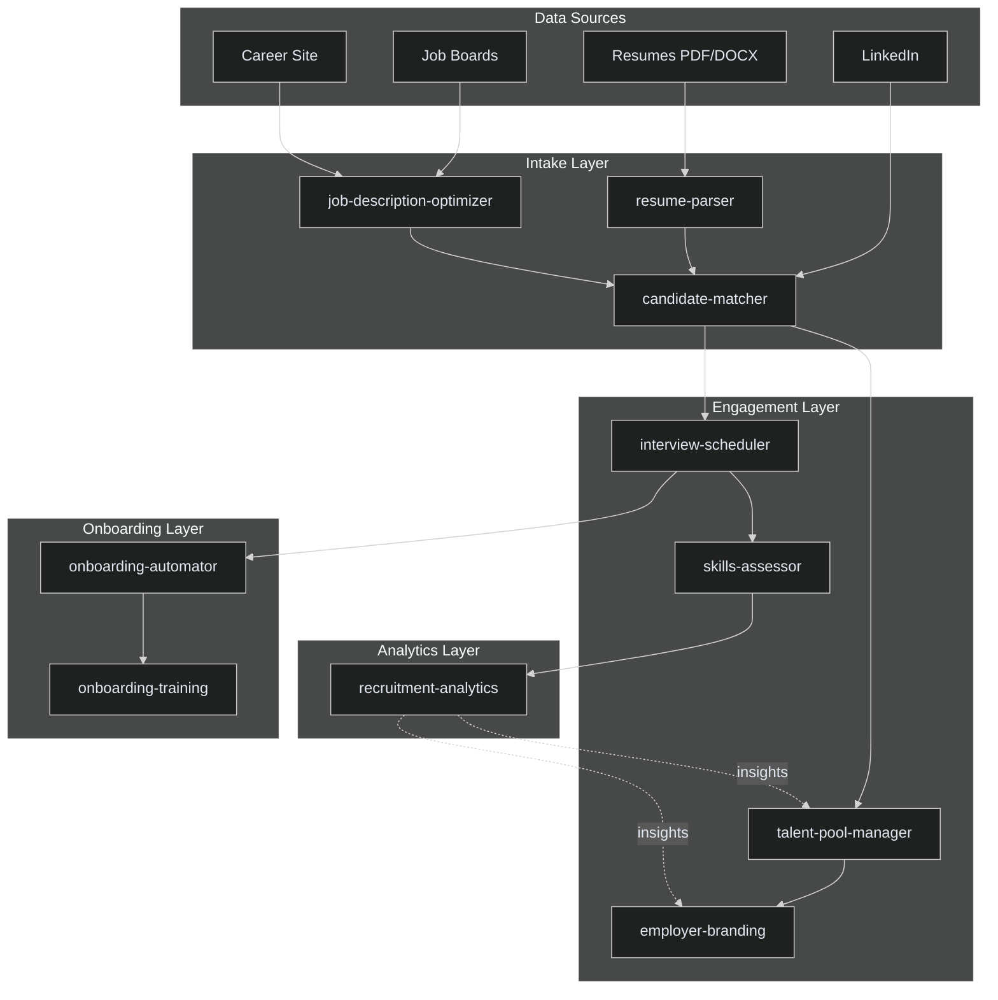

# Recruitment Platforms

## Overview

The Recruitment Platforms domain encompasses 10 integrated projects that collectively form an end-to-end talent acquisition and management ecosystem. From sourcing and parsing resumes to onboarding and skills assessment, these projects streamline the entire recruitment lifecycle.

### Projects

| # | Project | Description |
|---|---------|-------------|
| 1 | `candidate-matcher` | AI-powered matching engine that pairs candidates with open roles using semantic similarity and skill-gap analysis |
| 2 | `employer-branding` | Automated employer brand management across job boards, social media, and career sites |
| 3 | `interview-scheduler` | Intelligent scheduling system coordinating interviewers, candidates, and rooms across time zones |
| 4 | `job-description-optimizer` | NLP-driven job posting optimizer that improves quality, inclusivity, and search visibility |
| 5 | `recruitment-analytics` | Real-time dashboards and predictive analytics for recruitment funnel performance |
| 6 | `resume-parser` | Multi-format resume parser extracting structured data from PDF, DOCX, and plain text |
| 7 | `talent-pool-manager` | CRM-style talent pool segmentation, nurturing, and re-engagement automation |
| 8 | `skills-assessor` | Automated technical and soft-skills assessment with anti-cheating safeguards |
| 9 | `onboarding-automator` | Workflow-driven onboarding orchestration from offer acceptance to day-one readiness |
| 10 | `onboarding-training` | Personalized training path generator and progress tracker for new hires |

## Architecture



## Quick Start

### Prerequisites

- Node.js 20+ or Python 3.11+
- Docker & Docker Compose
- PostgreSQL 16+
- Redis 7+

### Installation

```bash
# Clone the repository
git clone https://github.com/ahmedhassan/GRC_Claw.git
cd GRC_Claw

# Install dependencies
npm install

# Set up environment
cp .env.example .env
# Edit .env with your database and API credentials

# Start infrastructure
docker compose up -d postgres redis

# Run migrations
npm run migrate

# Seed sample data
npm run seed
```

### Running Recruitment Services

```bash
# Start all recruitment domain services
npm run dev -- --domain=recruitment

# Or start individually
npm run dev -- --project=resume-parser
npm run dev -- --project=candidate-matcher
npm run dev -- --project=interview-scheduler
```

### Verify

```bash
curl http://localhost:3000/api/v1/health
# Expected: {"status":"ok","domain":"recruitment","services":10}
```

## API Reference Summary

### resume-parser

| Method | Endpoint | Description |
|--------|----------|-------------|
| POST | `/api/v1/parse` | Upload and parse a resume file |
| GET | `/api/v1/parse/:id` | Retrieve parsed resume by ID |
| POST | `/api/v1/parse/batch` | Batch parse multiple resumes |

### candidate-matcher

| Method | Endpoint | Description |
|--------|----------|-------------|
| POST | `/api/v1/match` | Match candidates to a job description |
| GET | `/api/v1/match/:jobId` | Get top matches for a job |
| POST | `/api/v1/match/feedback` | Submit match quality feedback |

### interview-scheduler

| Method | Endpoint | Description |
|--------|----------|-------------|
| POST | `/api/v1/schedule` | Create interview schedule |
| GET | `/api/v1/schedule/:id` | Get schedule details |
| PUT | `/api/v1/schedule/:id/reschedule` | Reschedule interview |
| DELETE | `/api/v1/schedule/:id` | Cancel interview |

### job-description-optimizer

| Method | Endpoint | Description |
|--------|----------|-------------|
| POST | `/api/v1/optimize` | Optimize a job description |
| GET | `/api/v1/optimize/:id` | Get optimization results |
| POST | `/api/v1/optimize/suggest` | Get improvement suggestions |

### recruitment-analytics

| Method | Endpoint | Description |
|--------|----------|-------------|
| GET | `/api/v1/analytics/funnel` | Recruitment funnel metrics |
| GET | `/api/v1/analytics/predictive` | Time-to-hire predictions |
| GET | `/api/v1/analytics/diversity` | Diversity pipeline metrics |

### talent-pool-manager

| Method | Endpoint | Description |
|--------|----------|-------------|
| POST | `/api/v1/pools` | Create talent pool |
| GET | `/api/v1/pools/:id` | Get pool details |
| POST | `/api/v1/pools/:id/nurture` | Trigger nurture campaign |

### skills-assessor

| Method | Endpoint | Description |
|--------|----------|-------------|
| POST | `/api/v1/assessments` | Create assessment |
| GET | `/api/v1/assessments/:id` | Get assessment results |
| POST | `/api/v1/assessments/:id/grade` | Submit grading |

### onboarding-automator

| Method | Endpoint | Description |
|--------|----------|-------------|
| POST | `/api/v1/onboarding` | Start onboarding workflow |
| GET | `/api/v1/onboarding/:id` | Get onboarding status |
| PUT | `/api/v1/onboarding/:id/step` | Update step completion |

### onboarding-training

| Method | Endpoint | Description |
|--------|----------|-------------|
| POST | `/api/v1/training-paths` | Generate training path |
| GET | `/api/v1/training-paths/:id` | Get training progress |
| PUT | `/api/v1/training-paths/:id/complete` | Mark module complete |

### employer-branding

| Method | Endpoint | Description |
|--------|----------|-------------|
| POST | `/api/v1/brand-assets` | Upload brand asset |
| GET | `/api/v1/brand-assets` | List brand assets |
| POST | `/api/v1/publish` | Publish to channels |

## Configuration

Each project reads from environment variables prefixed with `RECRUITMENT_`:

```env
RECRUITMENT_DATABASE_URL=postgresql://localhost:5432/recruitment
RECRUITMENT_REDIS_URL=redis://localhost:6379/0
RECRUITMENT_OPENAI_API_KEY=sk-...
RECRUITMENT_PARSER_MODEL=llama3.1
RECRUITMENT_MATCH_THRESHOLD=0.75
```

## Monitoring

All recruitment services expose Prometheus metrics at `/metrics` and health checks at `/health`. Structured logs are emitted in JSON format compatible with ELK and Datadog pipelines.

## Contributing

See [CONTRIBUTING.md](../CONTRIBUTING.md) for guidelines. When adding new recruitment projects, register them in `projects/recruitment-platforms.yaml` and ensure they implement the shared `RecruitmentService` interface.
