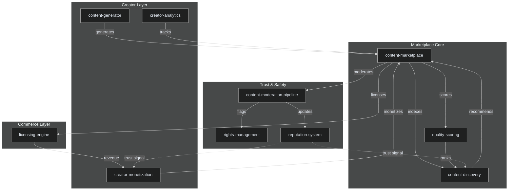

# UGC Marketplaces

## Overview

The UGC Marketplaces domain encompasses 10 integrated projects that power user-generated content ecosystems — from content creation and discovery to monetization, rights management, and quality enforcement. These projects form a complete marketplace infrastructure for creator economies.

### Projects

| # | Project | Description |
|---|---------|-------------|
| 1 | `content-marketplace` | Core marketplace engine for listing, discovering, and transacting user-generated content |
| 2 | `content-generator` | AI-assisted content generation tools for creators (text, image, video, audio) |
| 3 | `content-discovery` | Recommendation and search engine powering content discovery at scale |
| 4 | `content-moderation-pipeline` | Multi-stage moderation pipeline with AI + human review for UGC safety |
| 5 | `creator-analytics` | Analytics dashboard for creators tracking views, engagement, and revenue |
| 6 | `creator-monetization` | Monetization engine handling subscriptions, tips, licensing, and revenue share |
| 7 | `licensing-engine` | Automated content licensing with smart-contract-style terms and enforcement |
| 8 | `rights-management` | Digital rights management including takedowns, disputes, and ownership verification |
| 9 | `quality-scoring` | Content quality scoring algorithm for ranking, curation, and marketplace incentives |
| 10 | `reputation-system` | Cross-platform creator and buyer reputation with trust scoring |

## Architecture



## Quick Start

### Prerequisites

- Node.js 20+ or Python 3.11+
- Docker & Docker Compose
- PostgreSQL 16+
- Redis 7+
- Elasticsearch 8+ (for content-discovery)
- IPFS node (optional, for content-addressed storage)

### Installation

```bash
# Clone the repository
git clone https://github.com/ahmedhassan/GRC_Claw.git
cd GRC_Claw

# Install dependencies
npm install

# Set up environment
cp .env.example .env
# Edit .env with your database, Redis, and Elasticsearch credentials

# Start infrastructure
docker compose up -d postgres redis elasticsearch

# Run migrations
npm run migrate

# Seed sample data
npm run seed
```

### Running UGC Marketplace Services

```bash
# Start all UGC marketplace domain services
npm run dev -- --domain=ugc-marketplaces

# Or start individually
npm run dev -- --project=content-marketplace
npm run dev -- --project=content-moderation-pipeline
npm run dev -- --project=creator-monetization
```

### Verify

```bash
curl http://localhost:3000/api/v1/health
# Expected: {"status":"ok","domain":"ugc-marketplaces","services":10}
```

## API Reference Summary

### content-marketplace

| Method | Endpoint | Description |
|--------|----------|-------------|
| POST | `/api/v1/listings` | Create a new content listing |
| GET | `/api/v1/listings/:id` | Get listing details |
| PUT | `/api/v1/listings/:id` | Update listing |
| DELETE | `/api/v1/listings/:id` | Remove listing |
| GET | `/api/v1/listings` | Search/filter listings |

### content-generator

| Method | Endpoint | Description |
|--------|----------|-------------|
| POST | `/api/v1/generate/text` | Generate text content |
| POST | `/api/v1/generate/image` | Generate image content |
| POST | `/api/v1/generate/video` | Generate video content |
| GET | `/api/v1/generate/:id/status` | Check generation status |

### content-discovery

| Method | Endpoint | Description |
|--------|----------|-------------|
| GET | `/api/v1/search` | Full-text content search |
| GET | `/api/v1/recommendations` | Personalized recommendations |
| GET | `/api/v1/trending` | Trending content |
| POST | `/api/v1/feedback` | Submit discovery feedback |

### content-moderation-pipeline

| Method | Endpoint | Description |
|--------|----------|-------------|
| POST | `/api/v1/moderate` | Submit content for moderation |
| GET | `/api/v1/moderate/:id` | Get moderation result |
| POST | `/api/v1/moderate/:id/appeal` | Appeal moderation decision |
| GET | `/api/v1/moderation/queue` | List pending review items |

### creator-analytics

| Method | Endpoint | Description |
|--------|----------|-------------|
| GET | `/api/v1/analytics/overview` | Creator dashboard overview |
| GET | `/api/v1/analytics/content/:id` | Per-content analytics |
| GET | `/api/v1/analytics/audience` | Audience demographics |
| GET | `/api/v1/analytics/revenue` | Revenue analytics |

### creator-monetization

| Method | Endpoint | Description |
|--------|----------|-------------|
| POST | `/api/v1/subscriptions` | Create subscription tier |
| POST | `/api/v1/tips` | Send tip to creator |
| GET | `/api/v1/payouts` | List payout history |
| POST | `/api/v1/payouts/request` | Request payout |

### licensing-engine

| Method | Endpoint | Description |
|--------|----------|-------------|
| POST | `/api/v1/licenses` | Create license offer |
| GET | `/api/v1/licenses/:id` | Get license details |
| POST | `/api/v1/licenses/:id/purchase` | Purchase a license |
| GET | `/api/v1/licenses/verify/:token` | Verify license validity |

### rights-management

| Method | Endpoint | Description |
|--------|----------|-------------|
| POST | `/api/v1/claims` | File a rights claim |
| GET | `/api/v1/claims/:id` | Get claim status |
| POST | `/api/v1/takedowns` | Submit takedown request |
| GET | `/api/v1/ownership/:contentId` | Verify content ownership |

### quality-scoring

| Method | Endpoint | Description |
|--------|----------|-------------|
| GET | `/api/v1/scores/:contentId` | Get quality score for content |
| POST | `/api/v1/scores/recalculate` | Trigger score recalculation |
| GET | `/api/v1/scores/leaderboard` | Top-quality content leaderboard |

### reputation-system

| Method | Endpoint | Description |
|--------|----------|-------------|
| GET | `/api/v1/reputation/:userId` | Get user reputation score |
| GET | `/api/v1/reputation/:userId/history` | Reputation history |
| POST | `/api/v1/reputation/endorse` | Endorse a user |

## Configuration

Each project reads from environment variables prefixed with `UGC_`:

```env
UGC_DATABASE_URL=postgresql://localhost:5432/ugc_marketplace
UGC_REDIS_URL=redis://localhost:6379/1
UGC_ELASTICSEARCH_URL=http://localhost:9200
UGC_OPENAI_API_KEY=sk-...
UGC_MODERATION_THRESHOLD=0.85
UGC_QUALITY_MIN_SCORE=0.6
UGC_IPFS_NODE=/ip4/127.0.0.1/tcp/5001
```

## Monitoring

All UGC marketplace services expose Prometheus metrics at `/metrics` and health checks at `/health`. Content moderation events are streamed to a dedicated Kafka topic (`ugc.moderation.events`) for audit and real-time alerting.

## Contributing

See [CONTRIBUTING.md](../CONTRIBUTING.md) for guidelines. When adding new UGC marketplace projects, register them in `projects/ugc-marketplaces.yaml` and ensure they implement the shared `MarketplaceService` interface.
