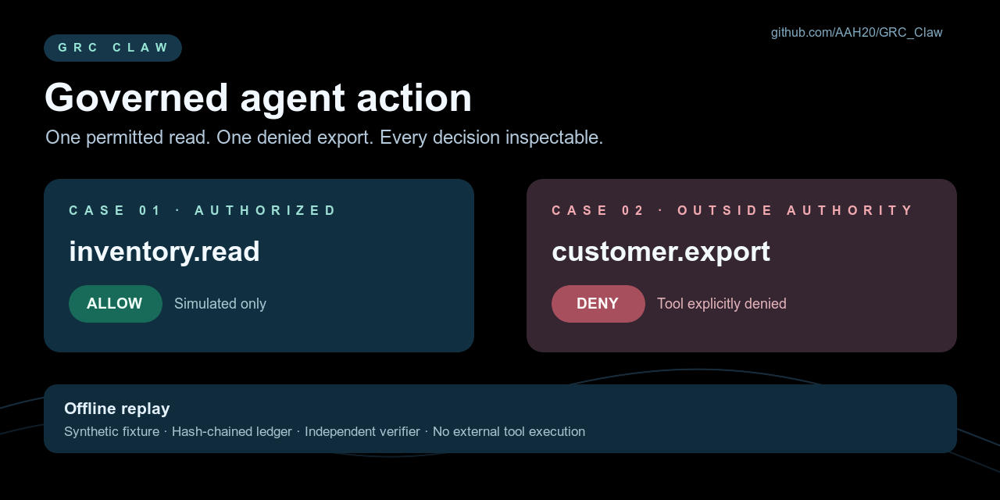

# Agent policy denial: reproducible offline example

An agent is permitted to read a fictional inventory item, then attempts a fictional customer export outside its tool authority. The existing `AgentPolicyFirewall` denies `customer.export`; `ActionLedger` records the intent and decision without raw argument values. No tool or external service is called.

From the repository root, with dependencies installed:

```bash
npm run demo:agent-policy-denial
npm run verify:agent-policy-denial
```

The first command writes `out/actions.ndjson` and `out/report.json` here. The second command independently checks the ledger hash chain, case order, decision reasons, simulated result, unexpected events, and absence of raw fixture argument values. Change a ledger line and verification fails. To rerun, remove `out/` or pass a fresh output directory to `demo.mjs`.

The frozen fixture has **two synthetic cases**: one allowed read and one denied export. A pass on this fixture establishes only that this specific offline decision path and evidence check work. It does not measure prompt-injection detection, runtime interception of third-party agents, tenant isolation, production reliability, or certification. The permitted action is recorded as `simulated`; the denied action is never executed.

The ledger hash chain detects changes relative to the frozen fixture, but it is not an authenticated signature or a trusted external timestamp. Anyone who controls both the file and verifier inputs can regenerate a new chain; this demo does not establish evidence custody.


