# AI-Powered Analytics & Attribution System — Architecture Document

**Version:** 1.0  
**Date:** 2026-10-01  
**Status:** Architecture-Ready  
**Author:** Ahmed Hassan  
**Parent System:** GRC_Claw Governance Chassis  
**References:** ARCHITECTURE.md, grc-claw-reporting-implementation-guide.md, grc-claw-integration-implementation-guide.md

---

## Table of Contents

1. [Executive Summary](#1-executive-summary)
2. [System Context & Design Principles](#2-system-context--design-principles)
3. [High-Level Architecture](#3-high-level-architecture)
4. [Component 1: Data Collection Agent](#4-component-1-data-collection-agent)
5. [Component 2: Attribution Engine](#5-component-2-attribution-engine)
6. [Component 3: Predictive Analytics Agent](#6-component-3-predictive-analytics-agent)
7. [Component 4: Reporting Agent](#7-component-4-reporting-agent)
8. [Component 5: Real-Time Dashboards](#8-component-5-real-time-dashboards)
9. [Component 6: Ad Platform & CRM Integration](#9-component-6-ad-platform--crm-integration)
10. [Component 7: GRC_Claw Governance Integration](#10-component-7-grc-claw-governance-integration)
11. [Data Flow Diagrams](#11-data-flow-diagrams)
12. [Data Model & Storage](#12-data-model--storage)
13. [API Design](#13-api-design)
14. [Security, Privacy & Compliance](#14-security-privacy--compliance)
15. [Technology Stack](#15-technology-stack)
16. [Implementation Roadmap](#16-implementation-roadmap)
17. [Deployment Architecture](#17-deployment-architecture)
18. [Monitoring & Observability](#18-monitoring--observability)
19. [Risks & Mitigations](#19-risks--mitigations)
20. [Appendices](#20-appendices)

---

## 1. Executive Summary

This document defines the complete architecture for an **AI-powered analytics and attribution system** that enables marketing teams to measure, understand, and optimize the customer journey across all touchpoints. The system ingests data from ad platforms, CRM, and web analytics; applies multi-touch attribution models (Markov chains, Shapley value, deep learning); generates predictive insights; and delivers real-time dashboards and automated reports.

The system is designed to integrate natively with the **GRC_Claw governance chassis**, ensuring that all AI/ML models, data pipelines, and automated decisions are governed, auditable, and compliant with frameworks such as ISO 42001, NIST AI RMF, and GDPR.

### Key Capabilities

| Capability | Description |
|---|---|
| **Multi-Source Data Ingestion** | Automated collection from Google Ads, Meta Ads, LinkedIn Ads, Salesforce, HubSpot, GA4, and custom APIs |
| **Multi-Touch Attribution** | Markov chain, Shapley value, and deep learning attribution models with model comparison |
| **Predictive Analytics** | Conversion forecasting, churn prediction, LTV estimation, budget optimization |
| **Automated Reporting** | Scheduled and on-demand report generation with natural language summaries |
| **Real-Time Dashboards** | Live campaign performance, attribution breakdown, and anomaly detection |
| **Governance Integration** | Full audit trail, model versioning, bias detection, and compliance reporting via GRC_Claw |

---

## 2. System Context & Design Principles

### 2.1 System Context Diagram

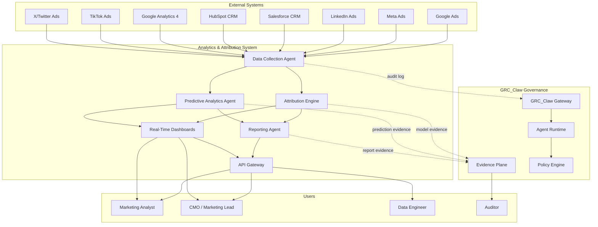

### 2.2 Design Principles

| Principle | Rationale |
|---|---|
| **Governance-First** | Every data pipeline, model, and automated decision is registered with GRC_Claw's evidence plane. No model runs without a signed control passport. |
| **Modularity** | Each component (collection, attribution, prediction, reporting) is independently deployable and replaceable. |
| **Event-Driven** | All data flows through an event backbone (Kafka) for real-time processing and auditability. |
| **Multi-Tenancy** | Data isolation per tenant with row-level security, consistent with GRC_Claw's RBAC model. |
| **Explainability** | Every attribution result and prediction includes SHAP/LIME explanations and confidence intervals. |
| **Privacy by Design** | PII is tokenized at ingestion; GDPR/CCPA compliance enforced via policy engine. |
| **Open Standards** | REST APIs, OpenAPI 3.1, JSON-LD for evidence objects, W3C VC for model identity. |

---

## 3. High-Level Architecture

### 3.1 Architecture Layers

```
┌─────────────────────────────────────────────────────────────────────────────┐
│                        PRESENTATION LAYER                                   │
│  ┌──────────────┐  ┌──────────────┐  ┌──────────────┐  ┌────────────┐     │
│  │  Real-Time   │  │  Reporting   │  │  Self-Serve  │  │  Mobile    │     │
│  │  Dashboards  │  │  Portal      │  │  Analytics   │  │  Alerts    │     │
│  └──────────────┘  └──────────────┘  └──────────────┘  └────────────┘     │
├─────────────────────────────────────────────────────────────────────────────┤
│                         API GATEWAY LAYER                                   │
│  ┌──────────────┐  ┌──────────────┐  ┌──────────────┐  ┌────────────┐     │
│  │  REST API    │  │  GraphQL     │  │  WebSocket   │  │  Webhook   │     │
│  │  (FastAPI)   │  │  (Strawberry)│  │  (Socket.io) │  │  Endpoints │     │
│  └──────────────┘  └──────────────┘  └──────────────┘  └────────────┘     │
├─────────────────────────────────────────────────────────────────────────────┤
│                      INTELLIGENCE LAYER                                     │
│  ┌──────────────┐  ┌──────────────┐  ┌──────────────┐  ┌────────────┐     │
│  │  Attribution │  │  Predictive  │  │  Reporting   │  │  Anomaly   │     │
│  │  Engine      │  │  Analytics   │  │  Agent       │  │  Detection │     │
│  │  (Markov/    │  │  Agent       │  │  (NLG +      │  │  (Isolation│     │
│  │  Shapley/DL) │  │  (LSTM/Prophet│  │  Templates)  │  │  Forest)   │     │
│  └──────────────┘  └──────────────┘  └──────────────┘  └────────────┘     │
├─────────────────────────────────────────────────────────────────────────────┤
│                      DATA PLATFORM LAYER                                   │
│  ┌──────────────┐  ┌──────────────┐  ┌──────────────┐  ┌────────────┐     │
│  │  Data        │  │  Feature     │  │  Model       │  │  Event     │     │
│  │  Collection  │  │  Store       │  │  Registry    │  │  Backbone  │     │
│  │  Agent       │  │  (Feast)     │  │  (MLflow)    │  │  (Kafka)   │     │
│  └──────────────┘  └──────────────┘  └──────────────┘  └────────────┘     │
├─────────────────────────────────────────────────────────────────────────────┤
│                      STORAGE LAYER                                         │
│  ┌──────────────┐  ┌──────────────┐  ┌──────────────┐  ┌────────────┐     │
│  │  Data Lake   │  │  Data        │  │  Time-Series │  │  Graph     │     │
│  │  (S3/MinIO)  │  │  Warehouse   │  │  DB          │  │  DB        │     │
│  │              │  │  (ClickHouse)│  │  (TimescaleDB)│  │  (Neo4j)   │     │
│  └──────────────┘  └──────────────┘  └──────────────┘  └────────────┘     │
├─────────────────────────────────────────────────────────────────────────────┤
│                      GOVERNANCE LAYER (GRC_Claw)                           │
│  ┌──────────────┐  ┌──────────────┐  ┌──────────────┐  ┌────────────┐     │
│  │  Evidence    │  │  Policy      │  │  Agent       │  │  Audit     │     │
│  │  Plane       │  │  Engine      │  │  Runtime     │  │  Trail     │     │
│  └──────────────┘  └──────────────┘  └──────────────┘  └────────────┘     │
└─────────────────────────────────────────────────────────────────────────────┘
```

### 3.2 Component Interaction Summary

| Source | Target | Data/Protocol | Frequency |
|---|---|---|---|
| Ad Platforms | Data Collection Agent | REST API + Webhook | Near real-time (5-min polling) |
| CRM Systems | Data Collection Agent | REST API + CDC | Near real-time (event-driven) |
| Data Collection Agent | Kafka | Avro/Protobuf events | Real-time |
| Kafka | Data Warehouse | Stream ingestion | Real-time |
| Data Warehouse | Attribution Engine | SQL + Feature Store | Batch (hourly/daily) |
| Attribution Engine | Model Registry | MLflow API | Per model run |
| Attribution Engine | Kafka | Attribution results | Real-time |
| Predictive Analytics Agent | Kafka | Predictions + confidence | Real-time |
| Reporting Agent | API Gateway | REST | On-demand + scheduled |
| All components | GRC_Claw Evidence Plane | gRPC + signed envelopes | Per operation |

---

## 4. Component 1: Data Collection Agent

### 4.1 Purpose

The Data Collection Agent (DCA) is the ingestion backbone. It connects to ad platforms, CRM systems, web analytics, and custom data sources; normalizes the data into a canonical event schema; enriches it with identity resolution; and publishes it to the event backbone for downstream consumption.

### 4.2 Architecture

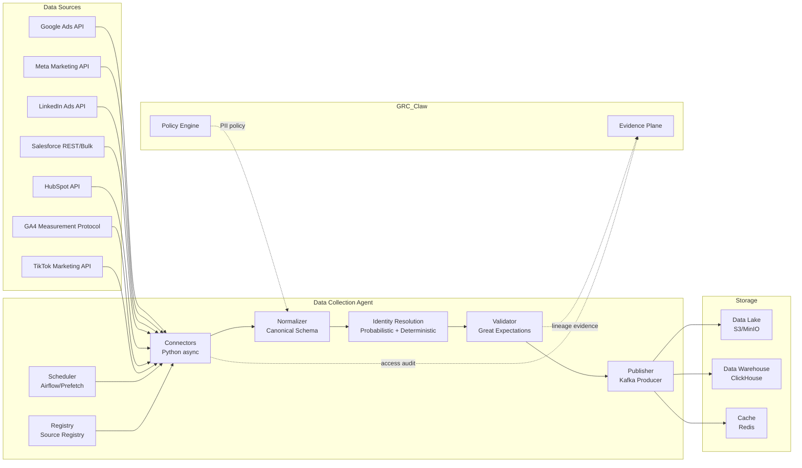

### 4.3 Connector Framework

Each connector implements a common interface:

```python
from abc import ABC, abstractmethod
from typing import AsyncIterator, Dict, Any
from datetime import datetime

class BaseConnector(ABC):
    """Abstract base for all data source connectors."""

    @abstractmethod
    async def authenticate(self) -> AuthToken:
        """OAuth2 / API key authentication with token refresh."""
        ...

    @abstractmethod
    async def fetch_campaigns(self, since: datetime) -> AsyncIterator[Dict[str, Any]]:
        """Fetch campaign metadata."""
        ...

    @abstractmethod
    async def fetch_performance(self, since: datetime, until: datetime) -> AsyncIterator[Dict[str, Any]]:
        """Fetch performance metrics (impressions, clicks, spend, conversions)."""
        ...

    @abstractmethod
    async def fetch_conversions(self, since: datetime, until: datetime) -> AsyncIterator[Dict[str, Any]]:
        """Fetch conversion events with attribution metadata."""
        ...

    @abstractmethod
    async def fetch_audiences(self) -> AsyncIterator[Dict[str, Any]]:
        """Fetch audience/segment definitions."""
        ...

    @abstractmethod
    def get_source_name(self) str:
        """Return canonical source identifier."""
        ...
```

### 4.4 Canonical Event Schema

All data is normalized into a unified schema before entering the event backbone:

```json
{
  "event_id": "uuid-v7",
  "event_type": "campaign_performance | conversion | audience_snapshot | spend",
  "timestamp": "2026-10-01T12:00:00Z",
  "tenant_id": "tenant-uuid",
  "source": {
    "platform": "google_ads | meta_ads | linkedin_ads | salesforce | hubspot | ga4",
    "account_id": "string",
    "campaign_id": "string",
    "ad_group_id": "string",
    "ad_id": "string"
  },
  "user": {
    "anonymous_id": "hash",
    "email_hash": "sha256",
    "crm_id": "string | null",
    "identity_confidence": 0.0-1.0
  },
  "metrics": {
    "impressions": 0,
    "clicks": 0,
    "spend": 0.00,
    "conversions": 0,
    "conversion_value": 0.00,
    "view_through_conversions": 0,
    "click_through_conversions": 0
  },
  "attribution": {
    "touchpoint_position": "first | middle | last | linear",
    "time_since_touch_seconds": 0,
    "campaign_metadata": {}
  },
  "metadata": {
    "ingestion_timestamp": "2026-10-01T12:00:05Z",
    "schema_version": "1.0",
    "data_quality_score": 0.95,
    "pii_detected": false,
    "pii_fields_redacted": []
  }
}
```

### 4.5 Identity Resolution

The DCA performs deterministic and probabilistic identity resolution to stitch user journeys across devices and sessions:

| Method | Description | Confidence |
|---|---|---|
| **Deterministic** | Exact match on email hash, phone hash, CRM ID | 1.0 |
| **Probabilistic** | Fuzzy matching on device fingerprint, IP + user-agent, behavioral patterns | 0.7-0.95 |
| **Graph-based** | Connected components on identity graph (Neo4j) | 0.8-0.99 |

### 4.6 Data Quality Validation

Every batch passes through Great Expectations validation:

- **Schema validation** — field presence, type checking
- **Range validation** — impressions >= 0, spend >= 0, timestamps in valid range
- **Referential integrity** — campaign IDs exist in source registry
- **Freshness check** — data no older than expected SLA
- **Anomaly detection** — statistical outliers flagged for review
- **PII detection** — regex + NER-based PII scanning with automatic redaction

### 4.7 Source Registry

A metadata registry tracks all connected sources:

```python
class SourceRegistry:
    """Manages connector lifecycle and configuration."""

    sources: Dict[str, SourceConfig]

    # SourceConfig fields:
    # - source_id, platform, auth_type, credentials_ref (Vault)
    # - sync_schedule, rate_limit, retry_policy
    # - schema_mapping, field_transforms
    # - pii_policy, retention_policy
    # - owner, status, health_check_endpoint
```

---

## 5. Component 2: Attribution Engine

### 5.1 Purpose

The Attribution Engine calculates the contribution of each marketing touchpoint to conversions. It supports three model families — Markov chains, Shapley value, and deep learning — and provides model comparison, confidence intervals, and explainability.

### 5.2 Architecture

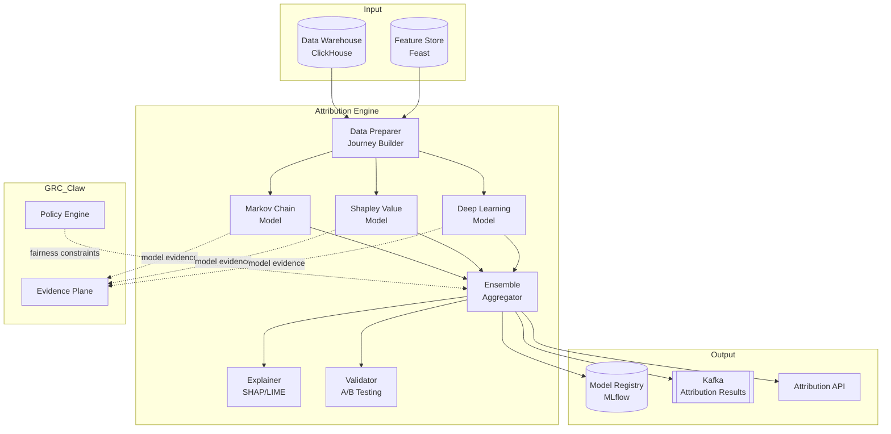

### 5.3 Journey Builder

The Data Preparer constructs user journeys from the event stream:

```python
class JourneyBuilder:
    """Builds user journeys from touchpoint events."""

    def build_journeys(
        self,
        events: List[TouchpointEvent],
        conversion_window: timedelta = timedelta(days=30),
        session_gap: timedelta = timedelta(minutes=30)
    ) -> List[Journey]:
        """
        1. Group events by resolved user identity
        2. Sort by timestamp
        3. Split into sessions based on session_gap
        4. Identify conversion events within conversion_window
        5. Label journeys as converting or non-converting
        6. Return list of Journey objects
        """

    def _create_features(self, journey: Journey) -> JourneyFeatures:
        """Extract features for ML models:
        - Channel sequence
        - Time between touchpoints
        - Campaign metadata
        - User demographics (anonymized)
        - Device/category info
        """
```

### 5.4 Markov Chain Attribution

**Principle:** Models the customer journey as a Markov chain where each touchpoint is a state. The removal effect measures how much conversion probability drops when a channel is removed.

**Algorithm:**

```python
class MarkovAttribution:
    """Markov chain-based multi-touch attribution."""

    def __init__(self, order: int = 1, max_path_length: int = 10):
        self.order = order  # Markov order (1 = first-order)
        self.max_path_length = max_path_length
        self.transition_matrix = None
        self.removal_effects = None

    def fit(self, journeys: List[Journey]):
        """
        1. Build transition count matrix from all journeys
        2. Convert to probability matrix (row-normalized)
        3. Add 'Start' and 'Conversion' / 'Null' absorbing states
        4. Compute conversion probability via matrix exponentiation
        """

    def compute_removal_effect(self, channel: str) -> float:
        """
        1. Remove channel from transition matrix
        2. Recompute conversion probability
        3. Removal effect = (original_prob - new_prob) / original_prob
        """

    def attribute(self, journeys: List[Journey]) -> AttributionResult:
        """
        1. For each channel, compute removal effect
        2. Normalize removal effects to sum to 1.0
        3. Distribute conversion value proportionally
        4. Return per-channel attribution with confidence intervals
        """
```

**Key Parameters:**

| Parameter | Default | Description |
|---|---|---|
| `order` | 1 | Markov chain order (1 = memoryless) |
| `max_path_length` | 10 | Maximum journey length to consider |
| `conversion_window` | 30 days | Days after last touchpoint to wait for conversion |
| `null_probability` | 0.01 | Probability of converting without any touchpoint |

**Output:**

```json
{
  "model": "markov_chain",
  "model_version": "1.2.0",
  "attribution": {
    "google_ads": {"credit": 0.35, "confidence": [0.30, 0.40]},
    "meta_ads": {"credit": 0.28, "confidence": [0.23, 0.33]},
    "linkedin_ads": {"credit": 0.15, "confidence": [0.10, 0.20]},
    "organic_search": {"credit": 0.12, "confidence": [0.08, 0.16]},
    "direct": {"credit": 0.10, "confidence": [0.05, 0.15]}
  },
  "model_diagnostics": {
    "log_likelihood": -12345.67,
    "aic": 24711.34,
    "bic": 24789.01,
    "conversion_rate": 0.034
  }
}
```

### 5.5 Shapley Value Attribution

**Principle:** Cooperative game theory applied to attribution. Each channel is a "player" in a coalition, and the Shapley value computes the marginal contribution of each channel across all possible orderings.

**Algorithm:**

```python
class ShapleyAttribution:
    """Shapley value-based multi-touch attribution."""

    def __init__(self, sample_size: int = 10000):
        self.sample_size = sample_size  # Monte Carlo sample size

    def fit(self, journeys: List[Journey]):
        """
        1. Define characteristic function v(S) = conversion rate
           when only channels in set S are present
        2. For efficiency, use sampled Shapley approximation
        """

    def _characteristic_function(self, channel_subset: Set[str], journeys: List[Journey]) -> float:
        """
        Compute conversion rate for journeys that only
        contain channels from the given subset.
        """

    def compute_shapley_values(self, channels: List[str]) -> Dict[str, float]:
        """
        Monte Carlo approximation of Shapley values:
        1. For each permutation sample:
           a. Iterate through channels in order
           b. Compute marginal contribution of each channel
        2. Average marginal contributions across all samples
        3. Return Shapley values (guaranteed to sum to 1.0)
        """
```

**Key Properties:**

| Property | Guarantee |
|---|---|
| **Efficiency** | Sum of Shapley values = total conversion value |
| **Symmetry** | Channels with identical contributions receive equal credit |
| **Null Player** | Channels with zero marginal contribution receive zero |
| **Additivity** | Attribution is additive across multiple conversions |

### 5.6 Deep Learning Attribution

**Principle:** Uses a transformer-based sequence model to learn complex, non-linear interactions between touchpoints in a customer journey.

**Architecture:**

```python
class DeepAttributionModel(nn.Module):
    """Transformer-based deep learning attribution model."""

    def __init__(
        self,
        num_channels: int,
        d_model: int = 128,
        nhead: int = 8,
        num_layers: int = 4,
        dim_feedforward: int = 512,
        dropout: float = 0.1,
        max_seq_length: int = 50
    ):
        # Channel embedding
        self.channel_embedding = nn.Embedding(num_channels, d_model)
        # Positional encoding
        self.pos_encoding = PositionalEncoding(d_model, max_seq_length)
        # Transformer encoder
        encoder_layer = nn.TransformerEncoderLayer(
            d_model=d_model, nhead=nhead,
            dim_feedforward=dim_feedforward, dropout=dropout
        )
        self.transformer = nn.TransformerEncoder(encoder_layer, num_layers)
        # Attention pooling for attribution weights
        self.attention_pool = nn.MultiheadAttention(d_model, nhead)
        # Output heads
        self.conversion_head = nn.Linear(d_model, 1)  # Conversion probability
        self.attribution_head = nn.Linear(d_model, num_channels)  # Channel attribution

    def forward(self, channel_ids: torch.Tensor, mask: torch.Tensor):
        """
        1. Embed channel IDs
        2. Add positional encoding
        3. Pass through transformer encoder
        4. Attention pooling to get journey representation
        5. Output conversion probability and per-channel attention weights
        """
```

**Training Configuration:**

| Parameter | Value | Description |
|---|---|---|
| `optimizer` | AdamW | Weight decay 0.01 |
| `learning_rate` | 1e-4 | With cosine annealing |
| `batch_size` | 256 | |
| `epochs` | 50 | With early stopping (patience=5) |
| `loss_function` | BCE + Attribution regularization | Conversion loss + attribution sparsity |
| `class_weight` | Computed | Handle conversion class imbalance |
| `validation_split` | 0.2 | Temporal split (most recent 20%) |

**Explainability:** The attention weights from the transformer serve as inherent explainability. Additionally, SHAP values are computed for feature-level explanations.

### 5.7 Model Comparison & Selection

The system automatically compares models and selects the best performer:

```python
class ModelComparator:
    """Compares attribution models and selects the best."""

    def compare(self, models: List[AttributionModel], test_journeys: List[Journey]) -> ComparisonResult:
        """
        Evaluation metrics:
        1. Log-loss on conversion prediction
        2. AUC-ROC for conversion classification
        3. Attribution stability (variance across bootstrap samples)
        4. Calibration (predicted vs actual conversion rates)
        5. Business metrics: ROI correlation, budget reallocation impact
        """
```

### 5.8 Ensemble Attribution

The ensemble aggregator combines all three models:

```python
class EnsembleAggregator:
    """Combines multiple attribution models."""

    def __init__(self, weights: Dict[str, float] = None):
        # Default: equal weights, or learned from validation performance
        self.weights = weights or {"markov": 0.3, "shapley": 0.3, "deep": 0.4}

    def aggregate(self, results: Dict[str, AttributionResult]) -> AttributionResult:
        """
        1. Weighted average of attribution percentages
        2. Compute ensemble confidence intervals
        3. Flag disagreements between models for review
        """
```

---

## 6. Component 3: Predictive Analytics Agent

### 6.1 Purpose

The Predictive Analytics Agent (PAA) uses machine learning to forecast future outcomes — conversions, revenue, churn, and optimal budget allocation — and provides actionable recommendations.

### 6.2 Architecture

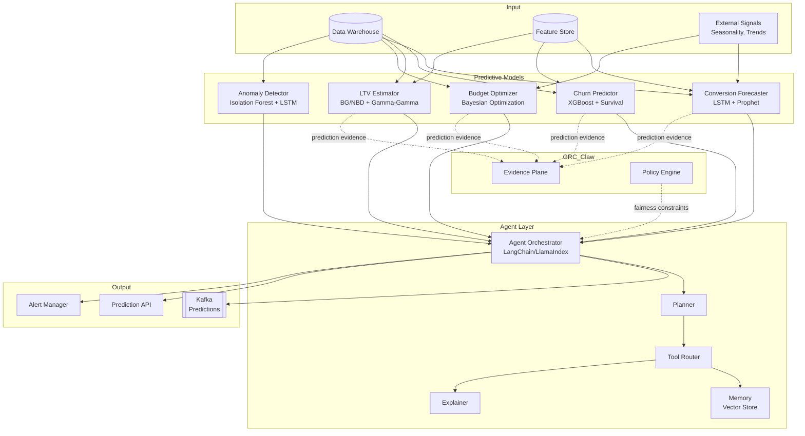

### 6.3 Conversion Forecaster

```python
class ConversionForecaster:
    """Forecasts conversions and revenue for future periods."""

    def __init__(self):
        self.lstm_model = None  # LSTM for sequence forecasting
        self.prophet_model = None  # Prophet for trend/seasonality

    def fit(self, historical_data: pd.DataFrame):
        """
        Features:
        - Historical conversions (daily/weekly)
        - Spend by channel
        - Seasonality indicators
        - Campaign calendar
        - External events (holidays, promotions)
        """

    def forecast(
        self,
        horizon: int = 30,
        confidence_level: float = 0.95
    ) -> ForecastResult:
        """
        Returns:
        - Point forecast for each day
        - Confidence intervals
        - Channel-level breakdown
        - Scenario analysis (optimistic/pessimistic)
        """
```

### 6.4 Churn Predictor

```python
class ChurnPredictor:
    """Predicts customer churn probability."""

    def __init__(self):
        self.xgb_model = None  # XGBoost classifier
        self.survival_model = None  # Cox proportional hazards

    def fit(self, customer_features: pd.DataFrame, churn_labels: pd.Series):
        """
        Features:
        - Recency, Frequency, Monetary (RFM)
        - Engagement metrics
        - Support ticket history
        - Product usage patterns
        """

    def predict_churn_risk(self, customer_id: str) -> ChurnRisk:
        """
        Returns:
        - Churn probability (0-1)
        - Risk tier (low/medium/high/critical)
        - Top contributing factors (SHAP)
        - Recommended retention actions
        """
```

### 6.5 LTV Estimator

```python
class LTVEstimator:
    """Estimates customer lifetime value using probabilistic models."""

    def __init__(self):
        self.bgnbd_model = None  # Beta-Geometric/NBD for purchase frequency
        self.gamma_gamma_model = None  # Gamma-Gamma for monetary value

    def fit(self, transactions: pd.DataFrame):
        """
        BG/NBD models purchase frequency and dropout probability.
        Gamma-Gamma models monetary value per transaction.
        """

    def estimate_ltv(
        self,
        customer_id: str,
        horizon_months: int = 12
    ) -> LTVEstimate:
        """
        Returns:
        - Expected LTV with confidence interval
        - Purchase frequency forecast
        - Monetary value forecast
        - Retention probability curve
        """
```

### 6.6 Budget Optimizer

```python
class BudgetOptimizer:
    """Optimizes budget allocation across channels using Bayesian optimization."""

    def __init__(self):
        self.surrogate_model = None  # Gaussian Process
        self.acquisition_function = None  # Expected Improvement

    def optimize(
        self,
        total_budget: float,
        channels: List[str],
        constraints: BudgetConstraints,
        objective: str = "maximize_conversions"
    ) -> BudgetAllocation:
        """
        Uses Bayesian optimization to find optimal budget allocation
        that maximizes the objective function subject to constraints.

        Constraints:
        - Min/max spend per channel
        - ROAS threshold
        - CAC ceiling
        - Channel diversity requirements
        """
```

### 6.7 Anomaly Detection

```python
class AnomalyDetector:
    """Detects anomalies in campaign performance and attribution data."""

    def __init__(self):
        self.isolation_forest = None  # For multivariate anomalies
        self.lstm_autoencoder = None  # For time-series anomalies

    def detect(self, metrics: pd.DataFrame) -> List[Anomaly]:
        """
        Detects:
        - Sudden spikes/drops in conversions
        - Unusual spend patterns
        - Attribution model drift
        - Data quality anomalies
        - Bot traffic patterns
        """
```

### 6.8 Agent Orchestrator

The PAA uses an LLM-based agent to coordinate predictions and generate natural-language insights:

```python
class PredictiveAgentOrchestrator:
    """LLM-powered agent that coordinates predictive analytics."""

    def __init__(self, llm: BaseLLM):
        self.llm = llm
        self.tools = {
            "forecast_conversions": self.conversion_forecaster,
            "predict_churn": self.churn_predictor,
            "estimate_ltv": self.ltv_estimator,
            "optimize_budget": self.budget_optimizer,
            "detect_anomalies": self.anomaly_detector,
            "query_warehouse": self.warehouse_query,
        }
        self.memory = VectorStoreMemory()

    def run(self, query: str) -> AgentResponse:
        """
        1. Parse user query
        2. Plan which tools to invoke
        3. Execute tools in sequence/parallel
        4. Synthesize results into natural language
        5. Include confidence intervals and caveats
        6. Log all actions to GRC_Claw evidence plane
        """
```

---

## 7. Component 4: Reporting Agent

### 7.1 Purpose

The Reporting Agent (RA) automates the creation, scheduling, and distribution of analytics reports. It combines data from the attribution engine and predictive analytics agent with natural language generation to produce executive-ready reports.

### 7.2 Architecture

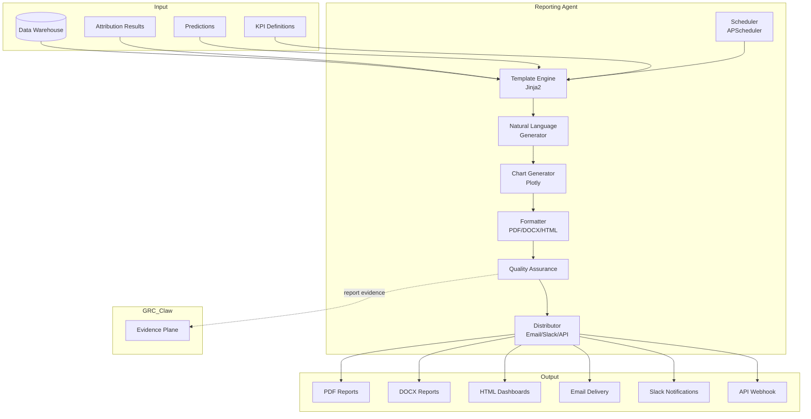

### 7.3 Report Types

| Report | Frequency | Audience | Content |
|---|---|---|---|
| **Executive Summary** | Weekly | CMO, VP Marketing | High-level KPIs, trends, recommendations |
| **Attribution Report** | Daily | Marketing Analysts | Channel attribution breakdown, model comparison |
| **Campaign Performance** | Daily | Campaign Managers | Per-campaign metrics, ROI, anomalies |
| **Predictive Forecast** | Weekly | Marketing Leads | Conversion forecasts, budget recommendations |
| **Churn Analysis** | Monthly | Customer Success | Churn risk segments, retention recommendations |
| **LTV Analysis** | Monthly | Finance + Marketing | LTV by cohort, CAC:LTV ratios |
| **Budget Optimization** | Bi-weekly | CMO + Finance | Optimal allocation, scenario analysis |
| **Compliance Report** | Monthly | Auditors | Data lineage, model governance, bias audit |

### 7.4 Natural Language Generation

```python
class ReportNLG:
    """Generates natural language summaries from data."""

    def __init__(self, llm: BaseLLM):
        self.llm = llm

    def generate_executive_summary(
        self,
        kpis: Dict[str, float],
        trends: Dict[str, Trend],
        anomalies: List[Anomaly],
        recommendations: List[Recommendation]
    ) -> str:
        """
        Uses LLM to generate:
        1. Narrative summary of key metrics
        2. Explanation of significant trends
        3. Flagging of anomalies with context
        4. Actionable recommendations with expected impact
        """

    def generate_attribution_summary(
        self,
        attribution: AttributionResult,
        model_comparison: ComparisonResult
    ) -> str:
        """
        Explains attribution results in plain language:
        1. Which channels are driving conversions
        2. How attribution changed vs. last period
        3. Model agreement/disagreement
        4. Confidence level assessment
        """
```

### 7.5 Report Template System

```python
class ReportTemplate:
    """Jinja2-based report template with dynamic sections."""

    template_structure = {
        "metadata": {
            "title": "string",
            "period": "date_range",
            "generated_at": "timestamp",
            "author": "string",
            "version": "string"
        },
        "sections": [
            {"type": "executive_summary", "source": "nlg"},
            {"type": "kpi_dashboard", "source": "charts"},
            {"type": "attribution_breakdown", "source": "attribution_data"},
            {"type": "predictive_insights", "source": "predictions"},
            {"type": "anomalies", "source": "anomaly_detector"},
            {"type": "recommendations", "source": "recommendation_engine"},
            {"type": "appendix", "source": "raw_data_tables"}
        ]
    }
```

### 7.6 Distribution & Scheduling

```python
class ReportScheduler:
    """Manages report scheduling and distribution."""

    schedules = {
        "executive_summary": {"cron": "0 8 * * 1", "recipients": ["cmo@company.com"]},
        "attribution_report": {"cron": "0 6 * * *", "recipients": ["analytics@company.com"]},
        "campaign_performance": {"cron": "0 7 * * *", "recipients": ["campaign-managers@company.com"]},
        "predictive_forecast": {"cron": "0 9 * * 1", "recipients": ["marketing-leads@company.com"]},
        "compliance_report": {"cron": "0 10 1 * *", "recipients": ["auditors@company.com"]},
    }

    def distribute(self, report: Report, channels: List[str]):
        """
        Distribution channels:
        - Email (SMTP with attachment)
        - Slack (webhook with summary + link)
        - API webhook (JSON payload)
        - Shared drive (S3/GCS upload)
        - GRC_Claw evidence plane (signed report artifact)
        """
```

---

## 8. Component 5: Real-Time Dashboards

### 8.1 Purpose

Real-time dashboards provide live visibility into campaign performance, attribution breakdowns, predictive insights, and anomaly alerts. They are the primary interface for marketing analysts and executives.

### 8.2 Architecture

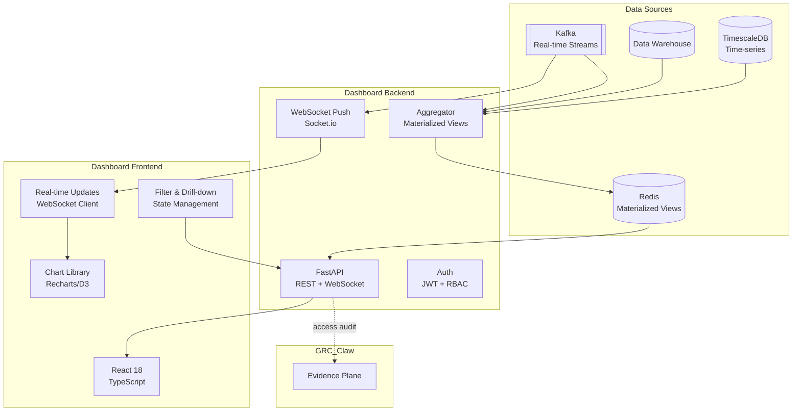

### 8.3 Dashboard Pages

| Page | Widgets | Data Source | Refresh |
|---|---|---|---|
| **Executive Overview** | KPI cards, trend charts, forecast overlay | Redis cache | 1 min |
| **Attribution Explorer** | Sankey diagram, channel comparison, model selector | ClickHouse | 5 min |
| **Campaign Performance** | Table with sorting/filtering, sparklines, anomaly flags | ClickHouse | 1 min |
| **Predictive Insights** | Forecast charts, confidence bands, scenario toggles | Redis + API | 15 min |
| **Budget Optimizer** | Allocation pie, efficiency curves, what-if simulator | API | On-demand |
| **Anomaly Center** | Anomaly list, severity heatmap, investigation workflow | Kafka stream | Real-time |
| **Data Quality** | Quality scores, freshness indicators, PII audit log | PostgreSQL | 5 min |

### 8.4 Real-Time Data Pipeline

```python
class RealTimeAggregator:
    """Aggregates real-time data for dashboard consumption."""

    def __init__(self):
        self.kafka_consumer = KafkaConsumer(
            "attribution-results",
            "predictions",
            "anomalies",
            "campaign-metrics"
        )
        self.redis = RedisClient()
        self.materialized_views = {}

    async def run(self):
        """
        1. Consume events from Kafka
        2. Update materialized views in Redis
        3. Push updates to connected WebSocket clients
        4. Maintain sliding window aggregations
        """

    def get_dashboard_data(self, dashboard_id: str, filters: Dict) -> DashboardData:
        """
        1. Check Redis cache for pre-aggregated data
        2. If stale, query ClickHouse/TimescaleDB
        3. Apply row-level security based on user role
        4. Return formatted dashboard payload
        """
```

### 8.5 WebSocket Protocol

```json
{
  "type": "subscription",
  "dashboard_id": "executive-overview",
  "filters": {"date_range": "last_7_days", "channels": ["google_ads", "meta_ads"]},
  "client_id": "websocket-session-uuid"
}
```

Server pushes updates:

```json
{
  "type": "data_update",
  "dashboard_id": "executive-overview",
  "timestamp": "2026-10-01T12:05:00Z",
  "data": {
    "kpis": {"conversions": 1234, "spend": 5678.90, "roas": 2.17},
    "trend": {"direction": "up", "change_percent": 5.2},
    "anomalies": []
  }
}
```

---

## 9. Component 6: Ad Platform & CRM Integration

### 9.1 Ad Platform Connectors

#### 9.1.1 Google Ads

```python
class GoogleAdsConnector(BaseConnector):
    """Google Ads API connector using Google Ads API v14."""

    def __init__(self, developer_token: str, client_id: str, client_secret: str, refresh_token: str):
        self.client = GoogleAdsClient.load_from_dict({
            "developer_token": developer_token,
            "client_id": client_id,
            "client_secret": client_secret,
            "refresh_token": refresh_token,
            "use_proto_plus": True
        })

    async def fetch_performance(self, since: datetime, until: datetime):
        """
        GAQL queries for:
        - Campaign performance (impressions, clicks, cost, conversions)
        - Ad group performance
        - Ad-level performance
        - Keyword performance
        - Audience performance
        """
        query = """
            SELECT
                campaign.id, campaign.name, campaign.status,
                ad_group.id, ad_group.name,
                metrics.impressions, metrics.clicks, metrics.cost_micros,
                metrics.conversions, metrics.conversions_value,
                metrics.view_through_conversions,
                segments.date
            FROM campaign
            WHERE segments.date BETWEEN '{start}' AND '{end}'
        """
```

#### 9.1.2 Meta Ads

```python
class MetaAdsConnector(BaseConnector):
    """Meta Marketing API connector."""

    async def fetch_performance(self, since: datetime, until: datetime):
        """
        Graph API calls for:
        - Campaign insights (impressions, spend, clicks, conversions)
        - Ad set insights
        - Ad insights
        - Custom conversions
        - Audience insights
        """
```

#### 9.1.3 LinkedIn Ads

```python
class LinkedInAdsConnector(BaseConnector):
    """LinkedIn Marketing API connector."""

    async def fetch_performance(self, since: datetime, until: datetime):
        """
        REST API calls for:
        - Campaign analytics
        - Ad analytics
        - Audience analytics
        - Conversion tracking
        """
```

#### 9.1.4 TikTok Ads

```python
class TikTokAdsConnector(BaseConnector):
    """TikTok Marketing API connector."""

    async def fetch_performance(self, since: datetime, until: datetime):
        """
        API calls for:
        - Campaign metrics
        - Ad group metrics
        - Ad metrics
        - Audience metrics
        """
```

### 9.2 CRM Connectors

#### 9.2.1 Salesforce

```python
class SalesforceConnector(BaseConnector):
    """Salesforce REST/Bulk API connector."""

    def __init__(self, username: str, password: str, security_token: str, domain: str):
        self.sf = Salesforce(
            username=username,
            password=password,
            security_token=security_token,
            domain=domain
        )

    async def fetch_conversions(self, since: datetime, until: datetime):
        """
        SOQL queries for:
        - Opportunities (stage, amount, close date)
        - Leads (status, source, conversion date)
        - Campaign members (response, status)
        - Activities (calls, emails, meetings)
        - Custom objects (if configured)
        """

    async def fetch_contacts(self):
        """
        Contact/Account data for:
        - Demographic enrichment
        - Firmographic segmentation
        - Identity resolution
        """
```

#### 9.2.2 HubSpot

```python
class HubSpotConnector(BaseConnector):
    """HubSpot API connector."""

    async def fetch_conversions(self, since: datetime, until: datetime):
        """
        API calls for:
        - Deals (pipeline, stage, amount, close date)
        - Contacts (lifecycle stage, lead status)
        - Companies (industry, size, revenue)
        - Engagements (emails, calls, meetings)
        - Custom events
        """
```

### 9.3 Integration Configuration

```yaml
# config/integrations.yaml
integrations:
  google_ads:
    enabled: true
    auth_type: oauth2
    credentials_ref: vault://google-ads/prod
    sync_schedule: "*/5 * * * *"  # Every 5 minutes
    rate_limit: 1000  # requests per day
    retry_policy:
      max_retries: 3
      backoff: exponential
    pii_policy:
      fields: ["email", "phone"]
      action: hash
    field_mapping:
      campaign_id: "campaign.id"
      campaign_name: "campaign.name"
      impressions: "metrics.impressions"
      spend: "metrics.cost_micros"
      conversions: "metrics.conversions"

  salesforce:
    enabled: true
    auth_type: oauth2
    credentials_ref: vault://salesforce/prod
    sync_schedule: "*/15 * * * *"  # Every 15 minutes
    rate_limit: 10000
    pii_policy:
      fields: ["email", "phone", "name", "address"]
      action: tokenize
    field_mapping:
      opportunity_id: "Id"
      amount: "Amount"
      stage: "StageName"
      close_date: "CloseDate"
```

### 9.4 Data Sync Modes

| Mode | Description | Use Case |
|---|---|---|
| **Full Sync** | Complete data pull on schedule | Initial load, small datasets |
| **Incremental Sync** | Only new/changed records since last sync | Regular operation |
| **CDC (Change Data Capture)** | Real-time change events | Near real-time requirements |
| **Streaming** | Continuous event stream | Real-time dashboards |

---

## 10. Component 7: GRC_Claw Governance Integration

### 10.1 Purpose

The analytics and attribution system integrates deeply with GRC_Claw's governance chassis to ensure that every data pipeline, ML model, and automated decision is governed, auditable, and compliant.

### 10.2 Integration Architecture

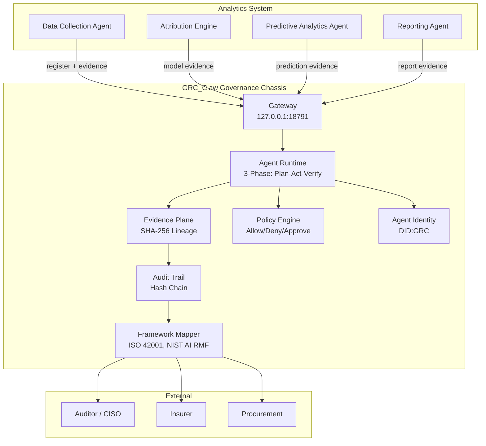

### 10.3 Evidence Registration

Every component registers its operations with the GRC_Claw evidence plane:

```python
class EvidenceRegistrar:
    """Registers analytics operations with GRC_Claw evidence plane."""

    def __init__(self, gateway_endpoint: str = "127.0.0.1:18791"):
        self.gateway = GRClawGatewayClient(gateway_endpoint)

    async def register_data_ingestion(
        self,
        source: str,
        records_count: int,
        schema_version: str,
        pii_fields: List[str],
        data_quality_score: float
    ) -> EvidenceEnvelope:
        """
        Creates a signed evidence envelope for data ingestion:
        - Source identity (DID)
        - Record count and schema version
        - PII handling attestation
        - Data quality score
        - Timestamp and hash chain
        """

    async def register_model_run(
        self,
        model_name: str,
        model_version: str,
        training_data_hash: str,
        hyperparameters: Dict,
        metrics: Dict,
        fairness_metrics: Dict,
        feature_importance: Dict
    ) -> EvidenceEnvelope:
        """
        Creates a signed evidence envelope for model training:
        - Model identity and version
        - Training data lineage (hash)
        - Hyperparameters and configuration
        - Performance metrics
        - Fairness/bias metrics
        - Feature importance for explainability
        """

    async def register_prediction(
        self,
        model_id: str,
        input_hash: str,
        prediction: float,
        confidence_interval: Tuple[float, float],
        explanation: Dict
    ) -> EvidenceEnvelope:
        """
        Creates a signed evidence envelope for each prediction:
        - Model reference
        - Input data hash (not raw data)
        - Prediction value and confidence
        - SHAP/LIME explanation
        - Timestamp
        """

    async def register_report(
        self,
        report_type: str,
        report_period: str,
        data_sources: List[str],
        models_used: List[str],
        content_hash: str
    ) -> EvidenceEnvelope:
        """
        Creates a signed evidence envelope for generated reports:
        - Report metadata
        - Data source lineage
        - Model lineage
        - Content hash for integrity verification
        """
```

### 10.4 Policy Engine Integration

The GRC_Claw policy engine enforces governance rules on all analytics operations:

```python
class AnalyticsPolicyEnforcer:
    """Enforces GRC_Claw policies on analytics operations."""

    def __init__(self, policy_engine: GRClawPolicyEngine):
        self.policy_engine = policy_engine

    def check_data_access(self, user: User, data_source: str, fields: List[str]) -> PolicyDecision:
        """
        Policies:
        - Role-based access to data sources
        - PII field access restrictions
        - Cross-tenant data isolation
        - Data retention compliance
        """

    def check_model_deployment(self, model: Model, environment: str) -> PolicyDecision:
        """
        Policies:
        - Model must have current fairness audit
        - Model must pass bias thresholds
        - Model must have explainability report
        - Approved for target environment
        """

    def check_prediction_usage(self, prediction: Prediction, use_case: str) -> PolicyDecision:
        """
        Policies:
        - Prediction use case is approved
        - Confidence threshold met
        - Human-in-the-loop required for high-impact decisions
        - GDPR right-to-explanation satisfied
        """

    def check_report_distribution(self, report: Report, recipients: List[str]) -> PolicyDecision:
        """
        Policies:
        - Recipients authorized for report classification
        - PII redaction verified
        - Data residency requirements met
        """
```

### 10.5 Model Governance

```python
class ModelGovernance:
    """Manages ML model lifecycle governance."""

    def __init__(self, evidence_plane: EvidencePlane, model_registry: MLflowClient):
        self.evidence_plane = evidence_plane
        self.model_registry = model_registry

    def register_model(self, model: Model, training_run: TrainingRun) -> GovernanceDecision:
        """
        1. Validate model artifact integrity
        2. Check training data lineage
        3. Run fairness audit
        4. Generate explainability report
        5. Create evidence envelope
        6. Register in model registry with governance metadata
        """

    def approve_model(self, model_id: str, approver: User) -> GovernanceDecision:
        """
        1. Verify approver authorization
        2. Check all governance requirements met
        3. Sign model control passport
        4. Update model registry status
        5. Log approval in audit trail
        """

    def monitor_drift(self, model_id: str, current_data: pd.DataFrame) -> DriftReport:
        """
        1. Compare current data distribution to training distribution
        2. Compute PSI (Population Stability Index)
        3. Monitor prediction distribution drift
        4. Alert if drift exceeds threshold
        5. Trigger retraining workflow if needed
        """
```

### 10.6 Audit Trail

All operations are logged to GRC_Claw's hash-chained audit trail:

```json
{
  "audit_entry": {
    "sequence": 1234567,
    "timestamp": "2026-10-01T12:00:00Z",
    "actor": {
      "type": "agent | user",
      "id": "did:grc:agent:attribution-engine:001",
      "name": "Attribution Engine"
    },
    "action": "model_inference",
    "resource": {
      "type": "prediction",
      "id": "pred-uuid"
    },
    "details": {
      "model_id": "markov-chain-v1.2.0",
      "input_hash": "sha256:abc123...",
      "output_hash": "sha256:def456...",
      "confidence": 0.92
    },
    "previous_hash": "sha256:prev...",
    "entry_hash": "sha256:current..."
  }
}
```

### 10.7 Compliance Mapping

| GRC_Claw Framework | Analytics System Mapping |
|---|---|
| **ISO 42001** | AI management system for analytics agents; model lifecycle governance |
| **NIST AI RMF** | Govern, Map, Measure, Manage functions applied to ML models |
| **GDPR** | PII tokenization, right-to-explanation, data minimization, consent management |
| **SOC 2** | Access controls, audit trails, change management, monitoring |
| **EU AI Act** | Risk classification for predictive models, transparency requirements |

---

## 11. Data Flow Diagrams

### 11.1 End-to-End Data Flow

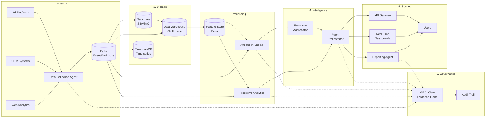

### 11.2 Attribution Data Flow

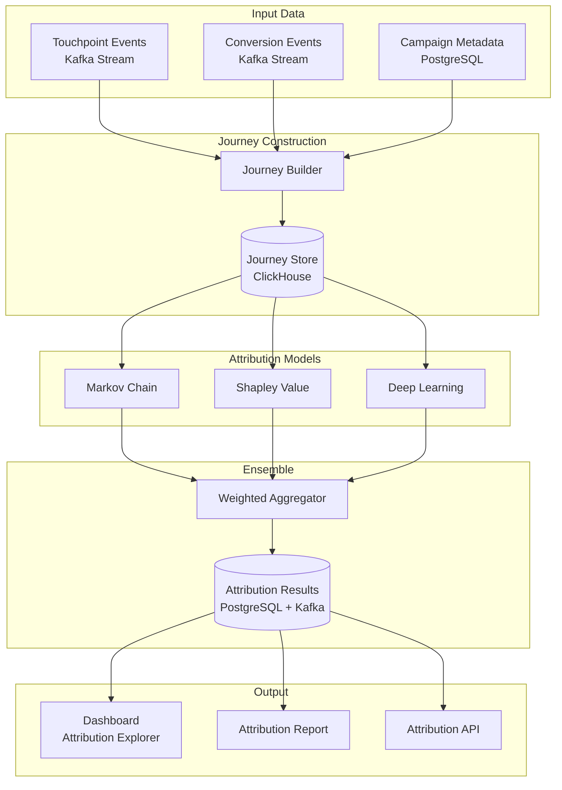

### 11.3 Predictive Analytics Data Flow

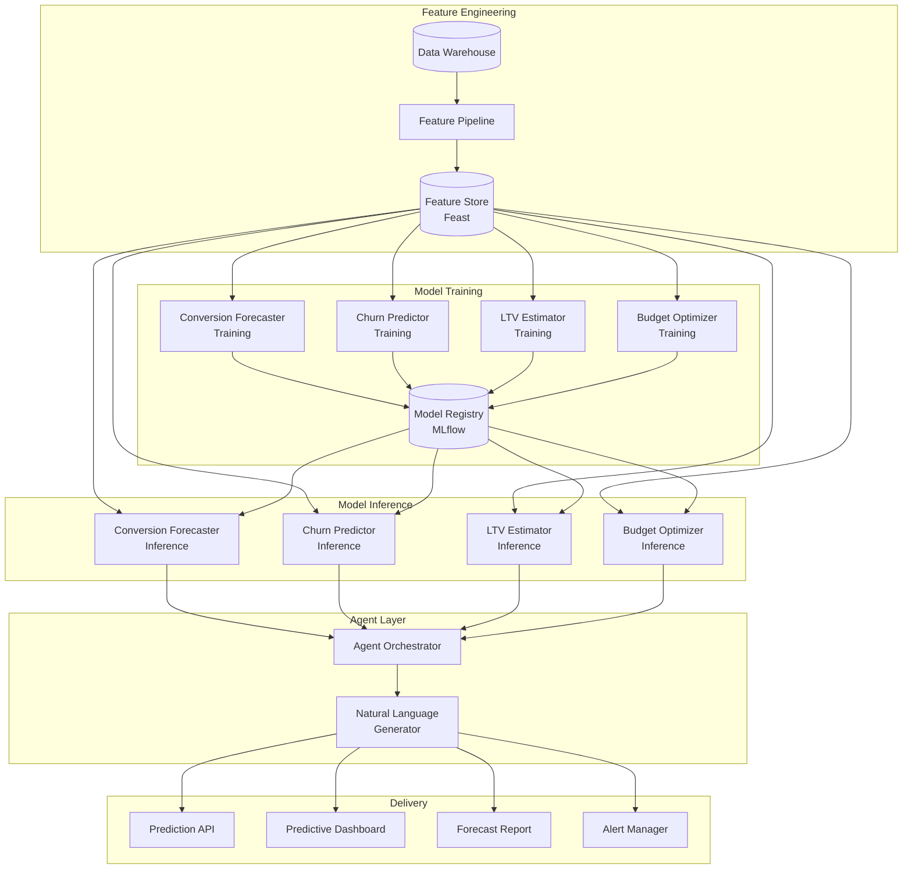

### 11.4 Real-Time Dashboard Data Flow

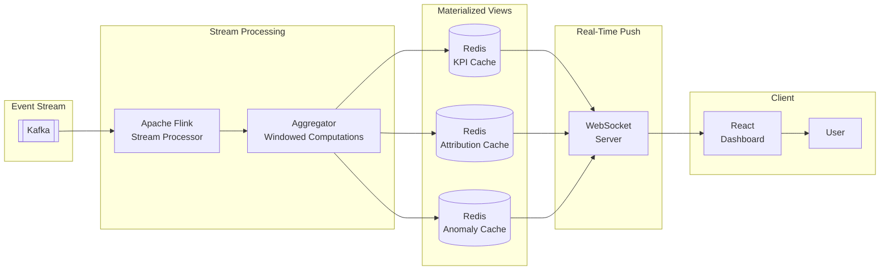

### 11.5 GRC_Claw Governance Data Flow

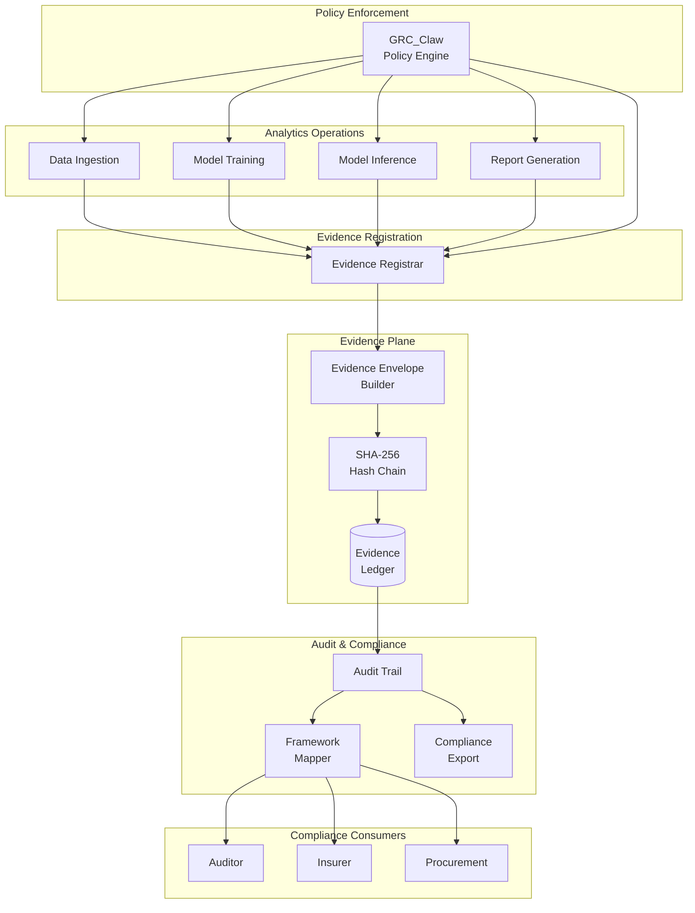

---

## 12. Data Model & Storage

### 12.1 Storage Architecture

| Store | Technology | Purpose | Retention |
|---|---|---|---|
| **Data Lake** | S3 / MinIO | Raw event storage, model artifacts | 7 years (configurable) |
| **Data Warehouse** | ClickHouse | Aggregated analytics, ad-hoc queries | 3 years |
| **Time-Series DB** | TimescaleDB | Real-time metrics, dashboard data | 1 year |
| **Feature Store** | Feast + Redis | ML feature serving | Current version |
| **Model Registry** | MLflow + S3 | Model versioning, artifacts | All versions |
| **Graph DB** | Neo4j | Identity resolution, relationship mapping | Current state |
| **Cache** | Redis | Materialized views, session data | 24 hours |
| **Operational DB** | PostgreSQL | Config, metadata, audit logs | 7 years |

### 12.2 Core Data Tables

#### 12.2.1 Events Table (ClickHouse)

```sql
CREATE TABLE events (
    event_id UUID,
    event_type LowCardinality(String),
    timestamp DateTime64(3),
    tenant_id UUID,
    source LowCardinality(String),
    account_id String,
    campaign_id String,
    ad_group_id String,
    ad_id String,
    anonymous_id String,
    email_hash String,
    crm_id Nullable(String),
    identity_confidence Float32,
    impressions UInt32,
    clicks UInt32,
    spend Decimal(18, 4),
    conversions UInt32,
    conversion_value Decimal(18, 4),
    view_through_conversions UInt32,
    click_through_conversions UInt32,
    touchpoint_position LowCardinality(String),
    time_since_touch_seconds UInt32,
    data_quality_score Float32,
    pii_detected UInt8,
    pii_fields_redacted Array(String),
    ingestion_timestamp DateTime64(3),
    schema_version LowCardinality(String),

    INDEX idx_tenant TYPE bloom_filter GRANULARITY 3,
    INDEX idx_campaign TYPE bloom_filter GRANULARITY 3,
    INDEX idx_timestamp TYPE minmax GRANULARITY 3
)
ENGINE = MergeTree()
PARTITION BY toYYYYMM(timestamp)
ORDER BY (tenant_id, source, timestamp)
TTL timestamp + INTERVAL 3 YEAR;
```

#### 12.2.2 Attribution Results Table (PostgreSQL)

```sql
CREATE TABLE attribution_results (
    id UUID PRIMARY KEY DEFAULT gen_random_uuid(),
    tenant_id UUID NOT NULL,
    model_type VARCHAR(50) NOT NULL,  -- markov, shapley, deep, ensemble
    model_version VARCHAR(50) NOT NULL,
    period_start TIMESTAMP WITH TIME ZONE NOT NULL,
    period_end TIMESTAMP WITH TIME ZONE NOT NULL,
    channel VARCHAR(100) NOT NULL,
    credit_percentage DECIMAL(5, 4) NOT NULL,
    credit_value DECIMAL(18, 4) NOT NULL,
    confidence_lower DECIMAL(5, 4),
    confidence_upper DECIMAL(5, 4),
    model_diagnostics JSONB,
    created_at TIMESTAMP WITH TIME ZONE DEFAULT NOW(),
    evidence_hash VARCHAR(64),  -- GRC_Claw evidence reference

    UNIQUE(tenant_id, model_type, model_version, period_start, period_end, channel)
);

CREATE INDEX idx_attribution_tenant_period ON attribution_results(tenant_id, period_start, period_end);
CREATE INDEX idx_attribution_model ON attribution_results(model_type, model_version);
```

#### 12.2.3 Predictions Table (PostgreSQL)

```sql
CREATE TABLE predictions (
    id UUID PRIMARY KEY DEFAULT gen_random_uuid(),
    tenant_id UUID NOT NULL,
    model_id VARCHAR(100) NOT NULL,
    model_version VARCHAR(50) NOT NULL,
    prediction_type VARCHAR(50) NOT NULL,  -- conversion, churn, ltv, budget
    entity_id VARCHAR(200) NOT NULL,  -- customer_id, campaign_id, etc.
    prediction_value DECIMAL(18, 6) NOT NULL,
    confidence_lower DECIMAL(18, 6),
    confidence_upper DECIMAL(18, 6),
    confidence_level DECIMAL(3, 2),
    explanation JSONB,  -- SHAP/LIME values
    feature_values JSONB,
    created_at TIMESTAMP WITH TIME ZONE DEFAULT NOW(),
    evidence_hash VARCHAR(64),

    UNIQUE(tenant_id, model_id, model_version, entity_id, created_at)
);

CREATE INDEX idx_predictions_tenant_type ON predictions(tenant_id, prediction_type, created_at);
CREATE INDEX idx_predictions_entity ON predictions(entity_id, prediction_type);
```

#### 12.2.4 Model Registry Table (PostgreSQL)

```sql
CREATE TABLE model_registry (
    id UUID PRIMARY KEY DEFAULT gen_random_uuid(),
    tenant_id UUID NOT NULL,
    model_name VARCHAR(100) NOT NULL,
    model_version VARCHAR(50) NOT NULL,
    model_type VARCHAR(50) NOT NULL,
    status VARCHAR(20) NOT NULL,  -- training, staging, production, archived
    training_data_hash VARCHAR(64),
    hyperparameters JSONB,
    metrics JSONB,
    fairness_metrics JSONB,
    feature_importance JSONB,
    artifact_path VARCHAR(500),
    deployed_at TIMESTAMP WITH TIME ZONE,
    created_at TIMESTAMP WITH TIME ZONE DEFAULT NOW(),
    evidence_hash VARCHAR(64),

    UNIQUE(tenant_id, model_name, model_version)
);
```

---

## 13. API Design

### 13.1 REST API Endpoints

#### Attribution API

```
POST   /api/v1/attribution/run              # Run attribution analysis
GET    /api/v1/attribution/results          # Get attribution results
GET    /api/v1/attribution/models           # List available models
GET    /api/v1/attribution/compare          # Compare models
POST   /api/v1/attribution/validate         # Validate attribution config
```

#### Predictive Analytics API

```
POST   /api/v1/predictions/forecast         # Generate conversion forecast
POST   /api/v1/predictions/churn            # Predict churn risk
POST   /api/v1/predictions/ltv              # Estimate customer LTV
POST   /api/v1/predictions/budget-optimize  # Optimize budget allocation
POST   /api/v1/predictions/anomalies         # Detect anomalies
GET    /api/v1/predictions/{id}             # Get prediction by ID
```

#### Reporting API

```
POST   /api/v1/reports/generate             # Generate a report
GET    /api/v1/reports                      # List reports
GET    /api/v1/reports/{id}                 # Get report by ID
POST   /api/v1/reports/schedule             # Schedule a report
GET    /api/v1/reports/schedules            # List schedules
DELETE /api/v1/reports/schedules/{id}       # Delete schedule
```

#### Dashboard API

```
GET    /api/v1/dashboards                   # List dashboards
GET    /api/v1/dashboards/{id}              # Get dashboard config
GET    /api/v1/dashboards/{id}/data         # Get dashboard data
POST   /api/v1/dashboards/{id}/subscribe    # Subscribe to real-time updates
```

#### Data Collection API

```
POST   /api/v1/ingestion/sources            # Register a data source
GET    /api/v1/ingestion/sources            # List sources
POST   /api/v1/ingestion/sync               # Trigger manual sync
GET    /api/v1/ingestion/sync/{id}/status   # Get sync status
GET    /api/v1/ingestion/health             # Health check
```

### 13.2 API Request/Response Examples

#### Run Attribution

**Request:**
```json
POST /api/v1/attribution/run
{
  "tenant_id": "tenant-uuid",
  "period": {"start": "2026-09-01", "end": "2026-09-30"},
  "models": ["markov", "shapley", "deep"],
  "channels": ["google_ads", "meta_ads", "linkedin_ads", "organic_search"],
  "conversion_window_days": 30,
  "ensemble_weights": {"markov": 0.3, "shapley": 0.3, "deep": 0.4}
}
```

**Response:**
```json
{
  "run_id": "uuid",
  "status": "completed",
  "results": {
    "ensemble": {
      "google_ads": {"credit": 0.35, "confidence": [0.30, 0.40]},
      "meta_ads": {"credit": 0.28, "confidence": [0.23, 0.33]},
      "linkedin_ads": {"credit": 0.15, "confidence": [0.10, 0.20]},
      "organic_search": {"credit": 0.12, "confidence": [0.08, 0.16]},
      "direct": {"credit": 0.10, "confidence": [0.05, 0.15]}
    },
    "model_comparison": {
      "best_model": "deep",
      "agreement_score": 0.85,
      "disagreements": []
    }
  },
  "evidence_hash": "sha256:abc123...",
  "processing_time_ms": 12345
}
```

#### Generate Forecast

**Request:**
```json
POST /api/v1/predictions/forecast
{
  "tenant_id": "tenant-uuid",
  "horizon_days": 30,
  "channels": ["google_ads", "meta_ads"],
  "confidence_level": 0.95,
  "scenarios": ["optimistic", "expected", "pessimistic"]
}
```

**Response:**
```json
{
  "forecast_id": "uuid",
  "model": "lstm_prophet_ensemble",
  "model_version": "2.1.0",
  "forecast": [
    {
      "date": "2026-10-01",
      "conversions": {"point": 45, "lower": 38, "upper": 52},
      "revenue": {"point": 12500.00, "lower": 10500.00, "upper": 14500.00},
      "by_channel": {
        "google_ads": {"conversions": 20, "revenue": 5500.00},
        "meta_ads": {"conversions": 15, "revenue": 4200.00}
      }
    }
  ],
  "model_diagnostics": {
    "mape": 0.08,
    "rmse": 4.2,
    "coverage": 0.94
  },
  "evidence_hash": "sha256:def456..."
}
```

---

## 14. Security, Privacy & Compliance

### 14.1 Security Architecture

```
┌─────────────────────────────────────────────────────────────┐
│                    SECURITY LAYERS                           │
├─────────────────────────────────────────────────────────────┤
│  Layer 1: Network                                           │
│  - VPC isolation, private subnets                           │
│  - WAF (AWS WAF / Cloudflare)                               │
│  - DDoS protection                                          │
│  - mTLS between services                                    │
├─────────────────────────────────────────────────────────────┤
│  Layer 2: Authentication & Authorization                    │
│  - OAuth 2.0 / OIDC (Auth0 / Keycloak)                      │
│  - JWT tokens with short expiry                             │
│  - RBAC with 5 roles (admin, analyst, viewer, auditor, api) │
│  - API key management for service-to-service                │
├─────────────────────────────────────────────────────────────┤
│  Layer 3: Data Protection                                   │
│  - AES-256 encryption at rest                               │
│  - TLS 1.3 in transit                                       │
│  - Field-level encryption for PII                           │
│  - Tokenization via Vault                                   │
│  - Key rotation every 90 days                               │
├─────────────────────────────────────────────────────────────┤
│  Layer 4: Application Security                              │
│  - Input validation (Pydantic)                              │
│  - SQL injection prevention (parameterized queries)          │
│  - XSS/CSRF protection                                      │
│  - Rate limiting per tenant                                 │
│  - Dependency scanning (Snyk)                               │
├─────────────────────────────────────────────────────────────┤
│  Layer 5: Audit & Monitoring                                │
│  - Centralized logging (ELK)                                │
│  - SIEM integration                                         │
│  - Anomaly detection on access patterns                     │
│  - GRC_Claw hash-chained audit trail                        │
└─────────────────────────────────────────────────────────────┘
```

### 14.2 PII Handling

| Stage | Action | Technology |
|---|---|---|
| **Ingestion** | Detect PII via regex + NER | Presidio / AWS Macie |
| **Storage** | Tokenize PII fields | HashiCorp Vault |
| **Processing** | Use tokenized IDs for joins | Deterministic tokenization |
| **Analytics** | Aggregate to prevent re-identification | k-anonymity (k>=5) |
| **Export** | Redact PII in reports | Field-level redaction |
| **Deletion** | Right-to-erasure workflow | Crypto-shredding |

### 14.3 GDPR Compliance

| Requirement | Implementation |
|---|---|
| **Lawful Basis** | Consent management platform integration |
| **Data Minimization** | Only collect fields needed for attribution |
| **Purpose Limitation** | Policy engine enforces approved use cases |
| **Storage Limitation** | TTL policies per data type |
| **Accuracy** | Data quality scoring + validation |
| **Integrity/Confidentiality** | Encryption, access controls, audit trail |
| **Accountability** | GRC_Claw evidence plane + DPO dashboard |
| **Right to Access** | Self-service data export API |
| **Right to Erasure** | Crypto-shredding workflow |
| **Data Portability** | Standardized JSON/CSV export |
| **Right to Explanation** | SHAP/LIME explanations for all predictions |

---

## 15. Technology Stack

### 15.1 Complete Stack

| Layer | Technology | Version | Purpose |
|---|---|---|---|
| **Language** | Python | 3.11+ | Core development |
| **API Framework** | FastAPI | 0.100+ | REST API |
| **GraphQL** | Strawberry | 0.200+ | GraphQL API |
| **Task Queue** | Celery | 5.3+ | Async task processing |
| **Scheduler** | APScheduler | 3.10+ | Cron-like scheduling |
| **Stream Processing** | Apache Flink | 1.18+ | Real-time stream processing |
| **Event Backbone** | Apache Kafka | 3.5+ | Event streaming |
| **Data Warehouse** | ClickHouse | 23+ | OLAP analytics |
| **Time-Series DB** | TimescaleDB | 2.11+ | Time-series metrics |
| **Operational DB** | PostgreSQL | 15+ | Metadata, config, audit |
| **Cache** | Redis | 7+ | Caching, materialized views |
| **Data Lake** | MinIO / S3 | Latest | Object storage |
| **Feature Store** | Feast | 0.30+ | ML feature management |
| **Model Registry** | MLflow | 2.0+ | Model versioning |
| **ML Framework** | PyTorch | 2.0+ | Deep learning |
| **ML Framework** | scikit-learn | 1.3+ | Classical ML |
| **ML Framework** | XGBoost | 2.0+ | Gradient boosting |
| **ML Framework** | Prophet | 1.1+ | Time-series forecasting |
| **ML Framework** | Lifelines | 0.27+ | Survival analysis |
| **ML Framework** | PyMC | 5.0+ | Bayesian optimization |
| **Explainability** | SHAP | 0.42+ | Model explanations |
| **Explainability** | LIME | 0.2+ | Local explanations |
| **Data Validation** | Great Expectations | 0.17+ | Data quality |
| **Identity Resolution** | recordlinkage | 0.15+ | Record linkage |
| **Graph DB** | Neo4j | 5+ | Identity graph |
| **Frontend** | React | 18+ | Dashboard UI |
| **Charts** | Recharts / D3.js | Latest | Data visualization |
| **Real-time** | Socket.io | 4+ | WebSocket communication |
| **NLG** | LangChain / LlamaIndex | Latest | Report generation |
| **LLM** | OpenAI / Anthropic / Ollama | Latest | NLG + agent orchestration |
| **Container** | Docker | 24+ | Containerization |
| **Orchestration** | Kubernetes | 1.28+ | Container orchestration |
| **IaC** | Terraform | 1.5+ | Infrastructure as code |
| **CI/CD** | GitHub Actions | Latest | Continuous integration/deployment |
| **Monitoring** | Prometheus + Grafana | Latest | Metrics and dashboards |
| **Tracing** | OpenTelemetry | 1.20+ | Distributed tracing |
| **Logging** | ELK Stack | 8+ | Centralized logging |
| **Secrets** | HashiCorp Vault | 1.15+ | Secret management |
| **Governance** | GRC_Claw | v24.0 | AI governance chassis |

---

## 16. Implementation Roadmap

### 16.1 Phase Overview

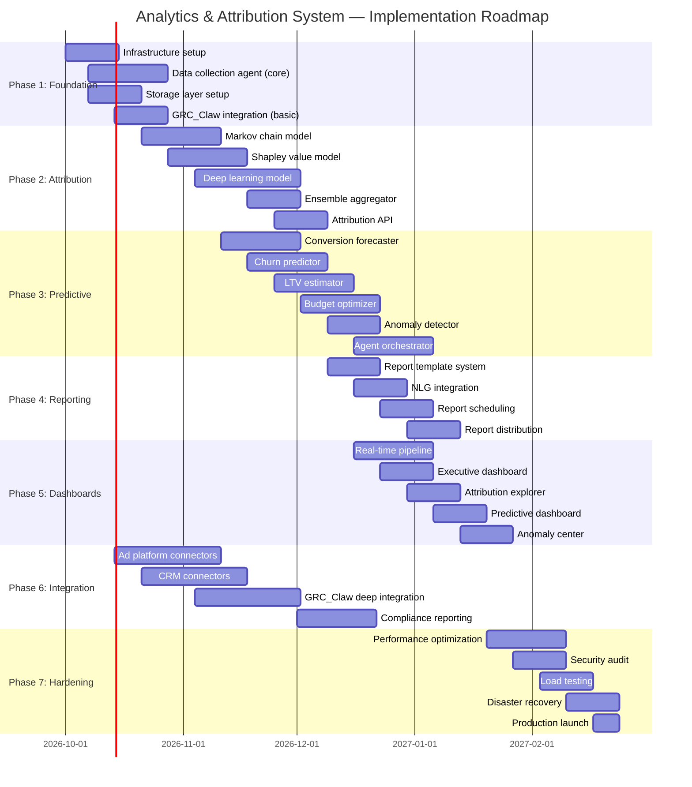

### 16.2 Phase 1: Foundation (Weeks 1-4)

| Week | Deliverable | Success Criteria |
|---|---|---|
| 1 | Infrastructure provisioning (K8s, Kafka, ClickHouse, PostgreSQL) | All services healthy, monitoring active |
| 2 | Data collection agent — core framework + Google Ads connector | Successfully ingesting Google Ads data |
| 3 | Storage layer — data lake, warehouse, cache | Data flowing from Kafka to all stores |
| 4 | GRC_Claw integration — evidence registration, basic audit | All operations logged to evidence plane |

### 16.3 Phase 2: Attribution Engine (Weeks 5-8)

| Week | Deliverable | Success Criteria |
|---|---|---|
| 5 | Markov chain attribution model | Attribution results within 5% of Shapley baseline |
| 6 | Shapley value attribution model | Shapley values sum to 1.0, efficiency property verified |
| 7 | Deep learning attribution model | AUC > 0.75 on conversion prediction |
| 8 | Ensemble aggregator + Attribution API | API returning results < 200ms p95 |

### 16.4 Phase 3: Predictive Analytics (Weeks 7-12)

| Week | Deliverable | Success Criteria |
|---|---|---|
| 7 | Conversion forecaster | MAPE < 15% on 30-day forecast |
| 8 | Churn predictor | AUC > 0.80 on churn classification |
| 9 | LTV estimator | LTV predictions within 20% of actuals |
| 10 | Budget optimizer | Finds allocation improving conversions by >10% |
| 11 | Anomaly detector | Detects injected anomalies with >90% recall |
| 12 | Agent orchestrator | Successfully coordinates tools for complex queries |

### 16.5 Phase 4: Reporting (Weeks 11-14)

| Week | Deliverable | Success Criteria |
|---|---|---|
| 11 | Report template system | All 8 report types templated |
| 12 | NLG integration | Executive summaries rated >4/5 by analysts |
| 13 | Report scheduling | Scheduled reports generated and delivered on time |
| 14 | Report distribution | Reports delivered via email, Slack, API |

### 16.6 Phase 5: Dashboards (Weeks 12-16)

| Week | Deliverable | Success Criteria |
|---|---|---|
| 12 | Real-time pipeline | Dashboard updates < 5 seconds from event |
| 13 | Executive dashboard | All KPIs displaying correctly |
| 14 | Attribution explorer | Sankey diagram + model comparison working |
| 15 | Predictive dashboard | Forecast charts with confidence bands |
| 16 | Anomaly center | Real-time anomaly alerts functional |

### 16.7 Phase 6: Integration (Weeks 3-10, parallel)

| Week | Deliverable | Success Criteria |
|---|---|---|
| 3-4 | Ad platform connectors (Google, Meta, LinkedIn, TikTok) | All connectors syncing data |
| 4-5 | CRM connectors (Salesforce, HubSpot) | CRM data flowing into journeys |
| 5-7 | GRC_Claw deep integration | Model governance, policy enforcement, compliance mapping |
| 8-9 | Compliance reporting | Automated compliance reports generated |

### 16.8 Phase 7: Hardening (Weeks 17-20)

| Week | Deliverable | Success Criteria |
|---|---|---|
| 17 | Performance optimization | API p95 < 200ms, dashboard load < 2s |
| 18 | Security audit | Zero critical vulnerabilities |
| 19 | Load testing | 1000 concurrent users, 10K events/sec |
| 20 | Disaster recovery + Production launch | RPO < 5 min, RTO < 30 min |

---

## 17. Deployment Architecture

### 17.1 Kubernetes Deployment

```yaml
# analytics-attribution-deployment.yaml
apiVersion: apps/v1
kind: Deployment
metadata:
  name: attribution-engine
  namespace: analytics
spec:
  replicas: 3
  selector:
    matchLabels:
      app: attribution-engine
  template:
    metadata:
      labels:
        app: attribution-engine
    spec:
      containers:
      - name: attribution-engine
        image: grc-claw/analytics-attribution:v1.0.0
        ports:
        - containerPort: 8000
        env:
        - name: KAFKA_BROKERS
          value: "kafka:9092"
        - name: CLICKHOUSE_HOST
          value: "clickhouse"
        - name: POSTGRES_HOST
          value: "postgres"
        - name: REDIS_HOST
          value: "redis"
        - name: GRC_CLAW_GATEWAY
          value: "grc-claw-gateway:18791"
        - name: MLFLOW_TRACKING_URI
          value: "http://mlflow:5000"
        resources:
          requests:
            memory: "2Gi"
            cpu: "1000m"
          limits:
            memory: "4Gi"
            cpu: "2000m"
        livenessProbe:
          httpGet:
            path: /health
            port: 8000
          initialDelaySeconds: 30
          periodSeconds: 10
        readinessProbe:
          httpGet:
            path: /ready
            port: 8000
          initialDelaySeconds: 10
          periodSeconds: 5
---
apiVersion: v1
kind: Service
metadata:
  name: attribution-engine
  namespace: analytics
spec:
  selector:
    app: attribution-engine
  ports:
  - port: 80
    targetPort: 8000
  type: ClusterIP
```

### 17.2 Environment Topology

| Environment | Purpose | Scale | Data |
|---|---|---|---|
| **Development** | Feature development | 1 replica per service | Synthetic data |
| **Staging** | Integration testing | 2 replicas per service | Anonymized production data |
| **Production** | Live system | 3+ replicas per service | Real data |
| **DR** | Disaster recovery | 2 replicas per service | Replicated from production |

---

## 18. Monitoring & Observability

### 18.1 Metrics

| Category | Metrics | Alert Threshold |
|---|---|---|
| **Ingestion** | Events/sec, lag, error rate | Lag > 1000, errors > 1% |
| **Attribution** | Model latency, prediction distribution | Latency > 5s, distribution shift > 20% |
| **Predictions** | Forecast accuracy, drift | MAPE > 20%, PSI > 0.2 |
| **API** | Request rate, latency, error rate | p95 > 500ms, errors > 0.1% |
| **Infrastructure** | CPU, memory, disk, network | CPU > 80%, memory > 85% |
| **Governance** | Evidence registration failures, policy denials | Any failure |

### 18.2 Dashboards

| Dashboard | Metrics | Audience |
|---|---|---|
| **System Health** | All infrastructure + application metrics | DevOps, SRE |
| **Data Pipeline** | Ingestion rates, quality scores, lineage | Data Engineers |
| **Model Performance** | Accuracy, drift, fairness metrics | ML Engineers, Auditors |
| **Business KPIs** | Conversions, revenue, ROAS, CAC | Marketing, CMO |
| **Governance** | Evidence coverage, policy compliance, audit status | Auditors, CISO |

### 18.3 Alerting

```yaml
# alerting-rules.yaml
groups:
  - name: analytics-system
    rules:
      - alert: HighIngestionLag
        expr: kafka_consumer_lag_sum > 1000
        for: 5m
        labels:
          severity: warning
        annotations:
          summary: "Kafka consumer lag is high"

      - alert: AttributionModelDrift
        expr: psi_score > 0.2
        for: 15m
        labels:
          severity: critical
        annotations:
          summary: "Attribution model drift detected"

      - alert: EvidenceRegistrationFailure
        expr: rate(evidence_registration_failures[5m]) > 0
        for: 1m
        labels:
          severity: critical
        annotations:
          summary: "GRC_Claw evidence registration failing"

      - alert: HighAPIErrorRate
        expr: rate(http_requests_total{status=~"5.."}[5m]) > 0.01
        for: 2m
        labels:
          severity: warning
        annotations:
          summary: "High API error rate"
```

---

## 19. Risks & Mitigations

| Risk | Likelihood | Impact | Mitigation |
|---|---|---|---|
| **Data quality issues from ad platforms** | Medium | High | Great Expectations validation, anomaly detection, manual review queue |
| **Model bias in attribution** | Medium | High | Fairness audits, SHAP explanations, diverse training data, GRC_Claw policy enforcement |
| **API rate limits from ad platforms** | High | Medium | Exponential backoff, caching, request prioritization |
| **PII leakage** | Low | Critical | Tokenization, field-level encryption, PII scanning, policy engine |
| **Model drift over time** | High | Medium | Automated drift detection, scheduled retraining, monitoring |
| **Scalability bottlenecks** | Medium | High | Horizontal scaling, caching, async processing, load testing |
| **GRC_Claw integration failures** | Low | High | Circuit breakers, fallback to local audit queue, retry logic |
| **Regulatory changes** | Medium | High | Modular policy engine, compliance monitoring, legal review process |
| **Vendor lock-in (ad platforms)** | Medium | Medium | Abstraction layer, multi-platform support, open standards |
| **Key person dependency** | Medium | High | Documentation, cross-training, runbooks, pair programming |

---

## 20. Appendices

### 20.1 Glossary

| Term | Definition |
|---|---|
| **Attribution** | The process of assigning credit to marketing touchpoints for conversions |
| **Markov Chain** | A stochastic model describing sequences of events where probability depends only on current state |
| **Shapley Value** | A cooperative game theory concept for fair distribution of gains among players |
| **Journey** | The sequence of touchpoints a customer interacts with before converting |
| **Touchpoint** | Any interaction between a customer and a marketing channel |
| **Conversion** | A desired action (purchase, signup, etc.) attributed to marketing efforts |
| **Feature Store** | A centralized repository for storing and serving ML features |
| **Model Registry** | A versioned repository for ML model artifacts and metadata |
| **CDC** | Change Data Capture — tracking data changes in real-time |
| **PSI** | Population Stability Index — measures distribution shift |
| **SHAP** | SHapley Additive exPlanations — model explainability method |
| **LIME** | Local Interpretable Model-agnostic Explanations |
| **BG/NBD** | Beta-Geometric/Negative Binomial Distribution — customer purchase model |
| **DID** | Decentralized Identifier — W3C standard for verifiable identity |
| **VC** | Verifiable Credential — W3C standard for cryptographically verifiable claims |

### 20.2 References

| Document | Location |
|---|---|
| GRC_Claw Architecture | `ARCHITECTURE.md` |
| GRC_Claw README | `README.md` |
| Reporting Implementation Guide | `implementations/grc-claw-reporting-implementation-guide.md` |
| Integration Implementation Guide | `implementations/grc-claw-integration-implementation-guide.md` |
| GRC_Claw Packages | `packages/` directory |
| GRC_Claw Specs | `specs/` directory |
| GRC_Claw Strategy | `strategy/` directory |

### 20.3 Document History

| Version | Date | Author | Changes |
|---|---|---|---|
| 1.0 | 2026-10-01 | Ahmed Hassan | Initial architecture document |

---

*This document is a living artifact. It should be updated as the system evolves, new requirements emerge, or the GRC_Claw governance framework is extended.*
