# Autonomous Campaign Optimization System — Architecture Document

**Version:** 1.0  
**Date:** 2026-10-01  
**Status:** Architecture Reference  
**Owner:** GRC_Claw Architecture Team  
**References:** GRC_Claw ARCHITECTURE.md, grc-claw-agent-governance-spec.md v1.1, grc-claw-automation-engine-proposal.md, grc-claw-integration-specification.md v2.0

---

## Table of Contents

1. [Executive Summary](#1-executive-summary)
2. [System Context](#2-system-context)
3. [Architecture Overview](#3-architecture-overview)
4. [Agent Design Principles](#4-agent-design-principles)
5. [Component Architecture](#5-component-architecture)
   - 5.1 [Campaign Management Agent](#51-campaign-management-agent)
   - 5.2 [Budget Optimization Agent](#52-budget-optimization-agent)
   - 5.3 [Creative Generation Agent](#53-creative-generation-agent)
   - 5.4 [A/B Testing Agent](#54-ab-testing-agent)
   - 5.5 [Performance Analytics Agent](#55-performance-analytics-agent)
6. [Real-Time Optimization Loops](#6-real-time-optimization-loops)
7. [Ad Platform Integrations](#7-ad-platform-integrations)
8. [GRC_Claw Governance Integration](#8-grc-claw-governance-integration)
9. [Data Flow Diagrams](#9-data-flow-diagrams)
10. [Implementation Roadmap](#10-implementation-roadmap)
11. [Security and Compliance](#11-security-and-compliance)
12. [Appendices](#12-appendices)

---

## 1. Executive Summary

The Autonomous Campaign Optimization System (ACOS) is a multi-agent platform that autonomously manages, optimizes, and governs digital advertising campaigns across Meta, Google, and LinkedIn. Built on GRC_Claw's governance-first architecture, ACOS combines five specialized AI agents with real-time feedback loops to deliver continuous campaign improvement while maintaining full auditability, policy compliance, and human oversight.

### Key Capabilities

- **Autonomous campaign lifecycle management** — creation, activation, monitoring, and sunset
- **Real-time budget optimization** — cross-platform budget allocation with ROAS/CPA targets
- **AI-powered creative generation** — dynamic ad creative production with brand-safety guardrails
- **Statistical A/B testing** — automated experiment design, execution, and winner selection
- **Performance analytics** — unified cross-platform reporting with anomaly detection
- **Governance-integrated operations** — every action policy-checked, evidence-logged, and auditable

### Design Goals

| Goal | Target |
|------|--------|
| Campaign setup time | < 5 minutes (vs. 2-4 hours manual) |
| Budget reallocation latency | < 15 minutes |
| Creative generation throughput | 50+ variants/hour |
| A/B test statistical significance | 95% confidence, automated detection |
| Governance coverage | 100% of agent actions policy-checked |
| Audit evidence completeness | Every decision traceable to raw data |

---

## 2. System Context

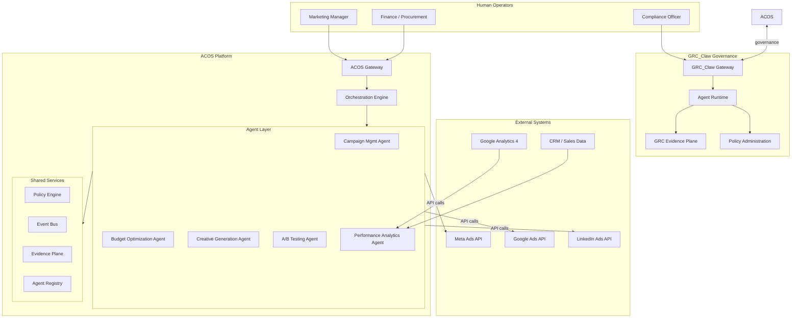

---

## 3. Architecture Overview

### 3.1 High-Level Architecture

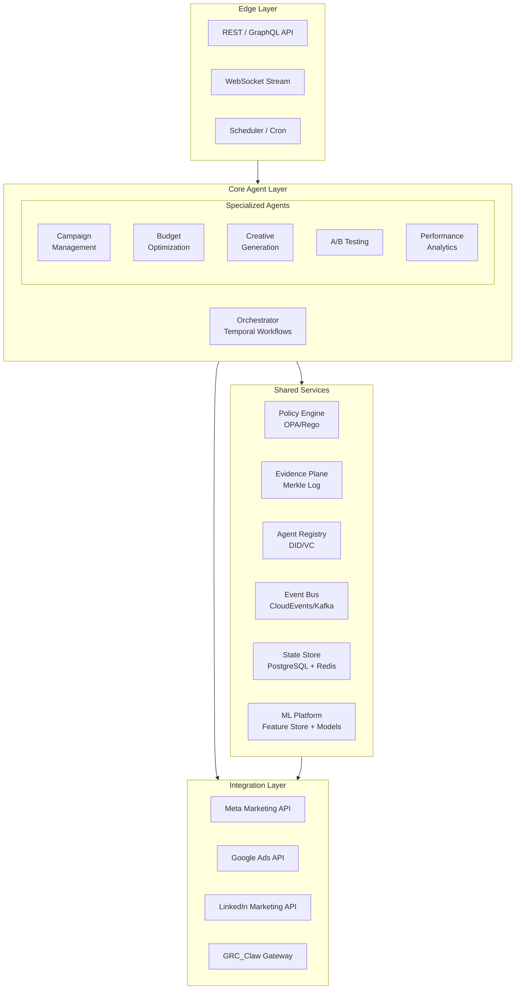

### 3.2 Technology Stack

| Layer | Technology | Rationale |
|-------|-----------|-----------|
| API Gateway | FastAPI + Uvicorn | Async-native, OpenAPI, WebSocket support |
| Orchestration | Temporal | Durable execution, saga patterns, human-in-the-loop |
| Event Bus | Apache Kafka (CloudEvents) | Loose coupling, replay, schema registry |
| State Store | PostgreSQL 16 + Redis 7 | ACID transactions + sub-ms cache |
| ML Platform | MLflow + Feast | Model versioning, feature serving |
| Agent Runtime | GRC_Claw agent-runtime | Governance, policy enforcement, audit |
| Policy Engine | OPA (Open Policy Agent) | Decoupled, Rego-based, deterministic |
| Evidence | GRC_Claw evidence plane | Merkle-chained, tamper-evident logs |
| Container Orchestration | Kubernetes (EKS/GKE) | Auto-scaling, rolling deploys |
| Observability | OpenTelemetry + Grafana | Distributed tracing, metrics, dashboards |

---

## 4. Agent Design Principles

All ACOS agents follow GRC_Claw's governance-first design principles:

### 4.1 Zero-Trust by Default
- Every agent action requires cryptographic verification via DID/VC
- No implicit trust between agents; all inter-agent calls authenticated
- Capability tokens (ZCAP-LD) scoped to specific operations

### 4.2 Deterministic Enforcement
- Policy decisions made by OPA/Rego, not LLM judgment
- LLM used for generation/recommendation only; enforcement is rule-based
- All policy decisions reproducible from input + policy version

### 4.3 Fail-Closed Behavior
- Any governance system failure results in action denial
- Graceful degradation: agents pause rather than proceed without oversight
- Circuit breakers on all external API calls

### 4.4 Tamper-Evident Audit
- Every action logged to Merkle-chained evidence plane
- Evidence includes: agent identity, policy decision, input data hash, output, timestamp
- Audit trail queryable by compliance officers in real-time

### 4.5 Least Privilege
- Agents receive minimum capabilities for their task
- Capability tokens expire and are scope-limited
- Human approval required for high-impact actions (budget > $10K, campaign sunset)

### 4.6 Composability
- Agents communicate via CloudEvents on shared event bus
- New agents can be added without modifying existing ones
- Governance primitives compose across all agents uniformly

---

## 5. Component Architecture

### 5.1 Campaign Management Agent (CMA)

#### 5.1.1 Responsibility
End-to-end lifecycle management of advertising campaigns across all connected platforms. CMA is the primary orchestrator that translates high-level marketing objectives into platform-specific campaign structures.

#### 5.1.2 Core Functions

| Function | Description |
|----------|-------------|
| **Campaign Creation** | Provision campaigns on Meta, Google, LinkedIn from unified campaign spec |
| **Audience Management** | Create and sync custom audiences, lookalike segments, remarketing lists |
| **Ad Set Configuration** | Configure targeting, placements, scheduling, and bidding strategies |
| **Campaign Activation** | Multi-platform coordinated launch with dependency management |
| **Campaign Monitoring** | Real-time status tracking, anomaly flagging, health scoring |
| **Campaign Sunset** | Automated or manual campaign teardown with evidence capture |
| **Cross-Platform Sync** | Ensure consistent naming, UTM parameters, and metadata across platforms |

#### 5.1.3 Agent Specification

```yaml
agent_id: acos-campaign-management
version: 1.0.0
type: orchestrator
capabilities:
  - campaign.create
  - campaign.update
  - campaign.activate
  - campaign.pause
  - campaign.sunset
  - audience.sync
  - adset.configure
  - metadata.sync
dependencies:
  - policy-engine
  - evidence-plane
  - agent-registry
  - event-bus
  - meta-ads-api
  - google-ads-api
  - linkedin-ads-api
human_approval_required:
  - campaign.create (budget > $10,000)
  - campaign.sunset (active spend > $5,000)
  - audience.sync (PII-containing segments)
policy_constraints:
  - max_campaigns_per_advertiser: 100
  - required_utm_parameters: [utm_source, utm_medium, utm_campaign]
  - forbidden_targeting: [race, religion, sexual_orientation, political_affiliation]
  - brand_safety_min_score: 0.85
```

#### 5.1.4 State Machine

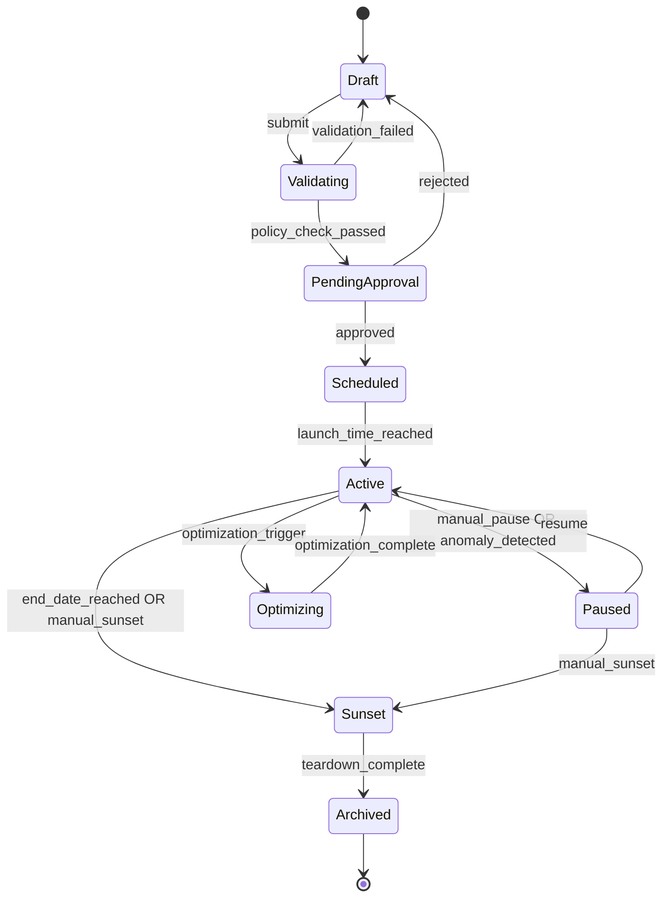

#### 5.1.5 API Interface

```protobuf
service CampaignManagement {
  rpc CreateCampaign(CreateCampaignRequest) returns (Campaign);
  rpc UpdateCampaign(UpdateCampaignRequest) returns (Campaign);
  rpc GetCampaign(GetCampaignRequest) returns (Campaign);
  rpc ListCampaigns(ListCampaignsRequest) returns (stream Campaign);
  rpc ActivateCampaign(ActivateCampaignRequest) returns (CampaignStatus);
  rpc PauseCampaign(PauseCampaignRequest) returns (CampaignStatus);
  rpc SunsetCampaign(SunsetCampaignRequest) returns (CampaignStatus);
  rpc SyncAudiences(SyncAudiencesRequest) returns (AudienceSyncStatus);
  rpc StreamCampaignEvents(StreamEventsRequest) returns (stream CampaignEvent);
}
```

---

### 5.2 Budget Optimization Agent (BOA)

#### 5.2.1 Responsibility
Autonomous cross-platform budget allocation and pacing to maximize campaign performance against defined KPIs (ROAS, CPA, CPC, CPM, conversion rate).

#### 5.2.2 Core Functions

| Function | Description |
|----------|-------------|
| **Budget Allocation** | Distribute budget across campaigns, ad sets, and platforms based on performance signals |
| **Pacing Control** | Ensure even spend distribution across flight period; prevent early exhaustion |
| **Bid Management** | Automated bid adjustments based on real-time auction dynamics |
| **Dayparting** | Time-of-day budget weighting based on conversion patterns |
| **Frequency Capping** | Cross-platform frequency management to prevent ad fatigue |
| **Budget Rebalancing** | Shift budget from underperforming to high-performing segments |
| **Forecasting** | Predict end-of-flight performance and recommend budget adjustments |

#### 5.2.3 Optimization Algorithm

```
Input:  performance_metrics[], budget_constraints, kpi_targets, time_horizon
Output: budget_allocation[], bid_adjustments[], pacing_curve

1. Ingest real-time performance data (15-min windows)
2. Compute efficiency scores per campaign/ad_set/platform
3. Apply constrained optimization:
   - Maximize: Σ(conversion_value) across all campaigns
   - Subject to:
     - Σ(spend) ≤ total_budget
     - spend_per_campaign ≥ min_spend_threshold
     - spend_per_campaign ≤ max_spend_threshold
     - ROAS ≥ target_ROAS (soft constraint with penalty)
     - CPA ≤ target_CPA (hard constraint)
4. Generate allocation recommendations
5. Policy-check recommendations (OPA)
6. If approved: execute via platform APIs
7. Log evidence: input metrics, optimization params, output allocation, policy decision
8. Monitor results; feed back into next optimization cycle
```

#### 5.2.4 Agent Specification

```yaml
agent_id: acos-budget-optimization
version: 1.0.0
type: optimizer
capabilities:
  - budget.allocate
  - budget.rebalance
  - bid.adjust
  - pacing.configure
  - frequency.cap
  - forecast.spend
dependencies:
  - policy-engine
  - evidence-plane
  - event-bus
  - performance-analytics-agent
  - meta-ads-api
  - google-ads-api
  - linkedin-ads-api
optimization:
  algorithm: constrained_gradient_descent_with_penalties
  reallocation_frequency: 15min
  min_allocation_window: 1h
  max_single_reallocation_pct: 0.25
  confidence_threshold: 0.95
human_approval_required:
  - budget.rebalance (change > $5,000 per cycle)
  - bid.adjust (change > 50% of current bid)
policy_constraints:
  - max_daily_budget: configurable_per_advertiser
  - max_budget_change_per_cycle_pct: 25
  - min_campaign_budget: $50/day
  - roas_floor: 1.5
  - cpa_ceiling: configurable_per_campaign
  - forbidden_bidding_strategies: [maximize_clicks_without_roas_guardrail]
```

#### 5.2.5 Optimization Loop

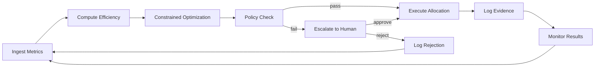

---

### 5.3 Creative Generation Agent (CGA)

#### 5.3.1 Responsibility
AI-powered generation of ad creatives (images, video, copy, headlines, descriptions) with brand-safety guardrails, platform-spec compliance, and performance-informed iteration.

#### 5.3.2 Core Functions

| Function | Description |
|----------|-------------|
| **Copy Generation** | Headlines, descriptions, CTAs tailored to platform and audience |
| **Image Generation** | Static ad creatives via diffusion models with brand guidelines |
| **Video Generation** | Short-form video ads (15s, 30s) from templates + AI |
| **Creative Variation** | Systematic A/B variants (messaging, visual, format) |
| **Brand Compliance** | Automated brand-safety scoring before publication |
| **Platform Adaptation** | Auto-resize and reformat creatives per platform specs |
| **Performance Iteration** | Generate new variants based on A/B test learnings |

#### 5.3.3 Generation Pipeline

```
Input:  campaign_brief, brand_guidelines, platform_specs, performance_history
Output: creative_package (images, videos, copy, metadata)

1. Parse campaign brief → extract key messages, value props, audience
2. Retrieve brand guidelines from governance registry
3. Generate copy variants:
   - Headlines (5-10 variants per message angle)
   - Descriptions (3-5 variants)
   - CTAs (platform-appropriate)
4. Generate visual variants:
   - Primary image (diffusion model, brand-safe prompt)
   - Crops/resizes per platform spec
   - Video storyboard → rendered video (if applicable)
5. Brand-safety scoring:
   - Automated visual audit (logo placement, text legibility, content policy)
   - Copy audit (claims, superlatives, compliance keywords)
   - Combined brand-safety score must exceed threshold (0.85)
6. Platform compliance check:
   - Image dimensions, file size, format
   - Video length, resolution, aspect ratio
   - Text overlay limits (Meta: 20% rule)
7. Policy check via OPA (brand safety, claims substantiation)
8. If approved: package and publish to creative library
9. Log evidence: prompts, model versions, outputs, scores, policy decisions
```

#### 5.3.4 Agent Specification

```yaml
agent_id: acos-creative-generation
version: 1.0.0
type: generator
capabilities:
  - creative.copy.generate
  - creative.image.generate
  - creative.video.generate
  - creative.variate
  - creative.brand_check
  - creative.platform_adapt
dependencies:
  - policy-engine
  - evidence-plane
  - event-bus
  - ab-testing-agent
  - brand-guidelines-registry
  - image-generation-model
  - video-generation-model
generation:
  models:
    image: stable-diffusion-xl / dalle-3 (configurable)
    video: runway-gen-2 / pika (configurable)
    copy: gpt-4 / claude (configurable)
  variants_per_cycle: 10
  brand_safety_threshold: 0.85
  max_generation_time_s: 120
human_approval_required:
  - creative.image.generate (new brand asset, not from approved template)
  - creative.copy.generate (health/financial claims)
policy_constraints:
  - forbidden_content: [competitor_trademarks, unsubstantiated_claims, misleading_pricing]
  - required_disclaimers: [configurable_per_industry]
  - max_text_overlay_pct: 20
  - brand_color_palette: enforced
  - logo_min_size_pct: 5
```

---

### 5.4 A/B Testing Agent (ABA)

#### 5.4.1 Responsibility
Design, execute, monitor, and conclude A/B tests (and multivariate tests) across ad creative, audience segments, bidding strategies, and landing pages with rigorous statistical methodology.

#### 5.4.2 Core Functions

| Function | Description |
|----------|-------------|
| **Experiment Design** | Define hypothesis, variables, sample size, duration, success metrics |
| **Traffic Splitting** | Randomized assignment with stratification; ensure statistical power |
| **Test Execution** | Coordinate variant deployment across platforms |
| **Monitoring** | Real-time tracking of sample accumulation and metric divergence |
| **Significance Testing** | Sequential testing with early stopping (mSPRT or Bayesian) |
| **Winner Selection** | Automated winner declaration with confidence intervals |
| **Learning Extraction** | Post-test analysis: segment-level insights, interaction effects |
| **Guardrail Metrics** | Ensure no significant degradation on secondary metrics |

#### 5.4.3 Statistical Framework

```
Experiment Design:
  - Hypothesis: H0: μ_A = μ_B, H1: μ_A ≠ μ_B (or one-sided)
  - Primary metric: conversion_rate / ROAS / CPA (configurable)
  - Guardrail metrics: bounce_rate, page_load_time, unsubscribe_rate
  - Power analysis: α=0.05, β=0.20 (80% power), MDE=10% relative
  - Sample size: n = f(α, β, MDE, baseline_rate)
  - Duration: max(2 weeks, time_to_reach_sample_size)
  - Randomization: user-level, stratified by platform/device/geo

Monitoring:
  - Sequential probability ratio test (mSPRT) for early stopping
  - Bayesian posterior updating for probability of superiority
  - Futility stopping: P(superiority) < 0.05 → stop for futility
  - Efficacy stopping: P(superiority) > 0.95 → stop for efficacy

Winner Selection:
  - Primary metric: significant improvement (p < 0.05, CI excludes 0)
  - Guardrails: no significant degradation (p > 0.10 for harm)
  - Practical significance: effect size > MDE
  - If all pass: declare winner, auto-promote
  - If guardrails violated: escalate to human
```

#### 5.4.4 Agent Specification

```yaml
agent_id: acos-ab-testing
version: 1.0.0
type: experimenter
capabilities:
  - experiment.design
  - experiment.launch
  - experiment.monitor
  - experiment.conclude
  - experiment.extract_learnings
dependencies:
  - policy-engine
  - evidence-plane
  - event-bus
  - performance-analytics-agent
  - creative-generation-agent
  - campaign-management-agent
statistics:
  framework: sequential_bayesian_hybrid
  alpha: 0.05
  power: 0.80
  mde_relative: 0.10
  min_duration_days: 14
  max_duration_days: 45
  early_stopping: true
  futility_stopping: true
  multiple_comparison_correction: bonferroni
human_approval_required:
  - experiment.conclude (winner promotion with > 20% metric change)
  - experiment.launch (test involving pricing or offers)
policy_constraints:
  - min_sample_size: 1000_per_variant
  - max_simultaneous_tests: 5_per_campaign
  - forbidden_test_variables: [race, religion, health_status, financial_status]
  - required_guardrail_metrics: [bounce_rate, page_load_time]
```

---

### 5.5 Performance Analytics Agent (PAA)

#### 5.5.1 Responsibility
Unified cross-platform performance ingestion, normalization, attribution, anomaly detection, and reporting. PAA is the single source of truth for campaign performance data.

#### 5.5.2 Core Functions

| Function | Description |
|----------|-------------|
| **Data Ingestion** | Real-time and batch ingestion from Meta, Google, LinkedIn, GA4, CRM |
| **Data Normalization** | Unified schema across platforms (metrics, dimensions, currency) |
| **Attribution Modeling** | Multi-touch attribution (data-driven, position-based, linear) |
| **Anomaly Detection** | Statistical and ML-based anomaly detection on key metrics |
| **Reporting** | Automated dashboard generation, scheduled reports, ad-hoc queries |
| **Forecasting** | Time-series forecasting for spend, conversions, revenue |
| **Segmentation Analysis** | Performance breakdown by audience, creative, placement, geo |
| **Competitive Benchmarking** | Industry benchmark comparison (where data available) |

#### 5.5.3 Data Pipeline

```
┌─────────────┐   ┌──────────────┐   ┌──────────────┐   ┌──────────────┐
│  Ingestion  │──▶│ Normalization│──▶│ Attribution  │──▶│  Serving     │
│             │   │              │   │              │   │              │
│ Meta API    │   │ Schema Map   │   │ MTA Model    │   │ Feature Store│
│ Google API  │   │ Currency     │   │ DDA          │   │ Dashboard    │
│ LinkedIn API│   │ UTM Parse    │   │ Position     │   │ API          │
│ GA4         │   │ Dedup        │   │ Linear       │   │ Alerting     │
│ CRM         │   │ Enrichment   │   │ Custom       │   │ Reporting    │
└─────────────┘   └──────────────┘   └──────────────┘   └──────────────┘
```

#### 5.5.4 Agent Specification

```yaml
agent_id: acos-performance-analytics
version: 1.0.0
type: analyzer
capabilities:
  - metrics.ingest
  - metrics.normalize
  - attribution.compute
  - anomaly.detect
  - report.generate
  - forecast.predict
  - segment.analyze
dependencies:
  - policy-engine
  - evidence-plane
  - event-bus
  - data-warehouse
  - feature-store
  - meta-ads-api
  - google-ads-api
  - linkedin-ads-api
  - ga4-api
  - crm-api
analytics:
  attribution_model: data_driven_mta
  attribution_lookback_days: 30
  anomaly_detection:
    algorithm: isolation_forest + prophet
    sensitivity: 0.95
    min_data_points: 100
  forecasting:
    algorithm: prophet + arizon
    horizon_days: 30
    confidence_interval: 0.90
  reporting:
    refresh_frequency: real_time
    scheduled_reports: [daily_8am, weekly_monday, monthly_1st]
policy_constraints:
  - data_retention_days: 730
  - pii_redaction: required
  - currency_conversion: daily_rate
  - min_data_freshness_minutes: 15
```

---

## 6. Real-Time Optimization Loops

### 6.1 Loop Architecture

ACOS operates three nested optimization loops, each with different time horizons and decision scopes:

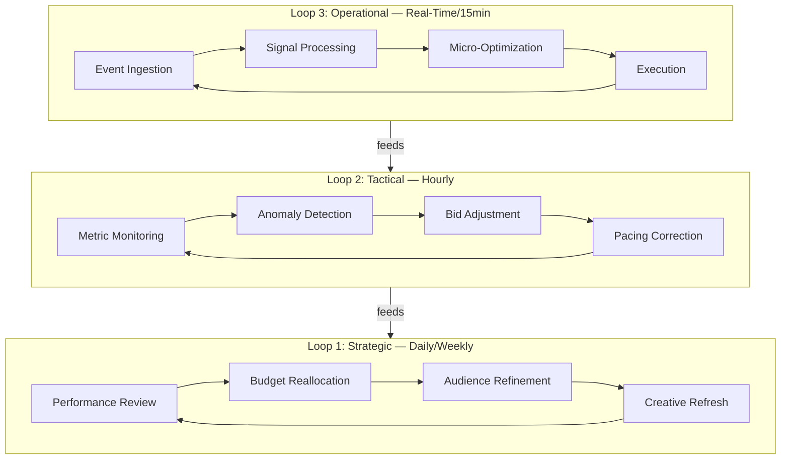

### 6.2 Loop 1: Strategic Optimization (Daily/Weekly)

| Aspect | Detail |
|--------|--------|
| **Frequency** | Daily review, weekly deep analysis |
| **Scope** | Cross-campaign, cross-platform |
| **Decisions** | Budget reallocation, audience expansion, creative refresh, campaign sunset |
| **Agent** | BOA + CMA + CGA |
| **Human Oversight** | Marketing manager reviews weekly summary; approves major changes |
| **Evidence** | Weekly optimization report with before/after metrics |

### 6.3 Loop 2: Tactical Optimization (Hourly)

| Aspect | Detail |
|--------|--------|
| **Frequency** | Every 1-4 hours |
| **Scope** | Per-campaign, per-ad-set |
| **Decisions** | Bid adjustments, pacing corrections, frequency cap changes, dayparting |
| **Agent** | BOA |
| **Human Oversight** | Automated within policy bounds; escalation for exceptions |
| **Evidence** | Hourly optimization log with metric deltas |

### 6.4 Loop 3: Operational Optimization (Real-Time/15min)

| Aspect | Detail |
|--------|--------|
| **Frequency** | Every 15 minutes |
| **Scope** | Per-ad, per-placement |
| **Decisions** | Micro-bid adjustments, budget pacing, creative rotation |
| **Agent** | BOA + PAA |
| **Human Oversight** | Fully automated within guardrails; circuit breaker on anomalies |
| **Evidence** | Real-time event stream with decision audit trail |

### 6.5 Feedback Loop Governance

Every optimization loop is governed by:

1. **Pre-action policy check** — OPA validates the proposed action against policy
2. **Human approval gate** — High-impact actions require human sign-off
3. **Post-action evidence logging** — All actions recorded with full context
4. **Outcome tracking** — Results measured and fed back into next cycle
5. **Drift detection** — Model performance monitored; retraining triggered on drift

---

## 7. Ad Platform Integrations

### 7.1 Integration Architecture

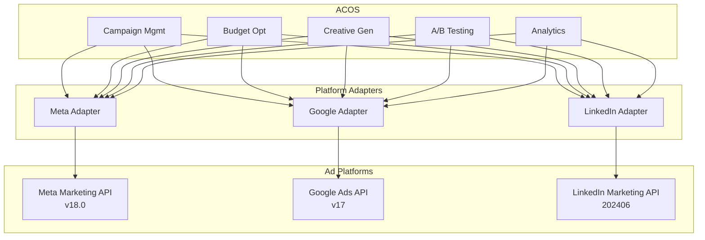

### 7.2 Meta Ads Integration

| Aspect | Detail |
|--------|--------|
| **API** | Meta Marketing API v18.0 |
| **Auth** | OAuth 2.0 with system user token; token refresh automation |
| **Rate Limits** | 200 calls/hour (ad account level); exponential backoff with jitter |
| **Key Endpoints** | `/act_{ad_account_id}/campaigns`, `/adsets`, `/ads`, `/adcreatives`, `/insights` |
| **Webhooks** | Real-time updates via Webhooks (feed, mentions, messaging) |
| **Data Granularity** | Hourly insights; 15-min via async report jobs |
| **Special Handling** | iOS 14.5+ attribution window (7-day click, 1-day view); Aggregated Event Measurement |

### 7.3 Google Ads Integration

| Aspect | Detail |
|--------|--------|
| **API** | Google Ads API v17 |
| **Auth** | OAuth 2.0 with developer token; service account for batch operations |
| **Rate Limits** | 15,000 requests/day (standard access); quota per method |
| **Key Endpoints** | `CampaignService`, `AdGroupService`, `AdService`, `KeywordPlanIdeaService`, `GoogleAdsStreamService` |
| **Real-Time** | Streaming gRPC for real-time metrics |
| **Data Granularity** | Hourly via `GoogleAdsService.SearchStream` |
| **Special Handling** | Smart Bidding compatibility; Local Services Ads; Performance Max |

### 7.4 LinkedIn Ads Integration

| Aspect | Detail |
|--------|--------|
| **API** | LinkedIn Marketing API (2024-06) |
| **Auth** | OAuth 2.0 with member/organization token; 3-legged OAuth for org access |
| **Rate Limits** | 500 calls/day (application), 500 calls/day (member); tiered by partnership level |
| **Key Endpoints** | `/adCampaigns`, `/adCreatives`, `/adInsights`, `/adAccountUsers`, `/dmpSegments` |
| **Data Granularity** | Daily insights; real-time via webhook notifications |
| **Special Handling** | B2B audience targeting; matched audiences; conversion tracking via Insight Tag |

### 7.5 Unified Adapter Pattern

All platform adapters implement a common interface:

```python
class AdPlatformAdapter(ABC):
    @abstractmethod
    async def create_campaign(self, spec: CampaignSpec) -> PlatformCampaign: ...
    
    @abstractmethod
    async def update_budget(self, campaign_id: str, budget: Budget) -> bool: ...
    
    @abstractmethod
    async def update_bid(self, campaign_id: str, bid: Bid) -> bool: ...
    
    @abstractmethod
    async def create_creative(self, creative: Creative) -> PlatformCreative: ...
    
    @abstractmethod
    async def get_insights(self, query: InsightsQuery) -> InsightsResult: ...
    
    @abstractmethod
    async def pause_campaign(self, campaign_id: str) -> bool: ...
    
    @abstractmethod
    async def activate_campaign(self, campaign_id: str) -> bool: ...
    
    @abstractmethod
    async def get_campaign_status(self, campaign_id: str) -> CampaignStatus: ...
```

---

## 8. GRC_Claw Governance Integration

### 8.1 Integration Architecture

ACOS is a governed agent system that plugs into GRC_Claw's existing governance infrastructure:

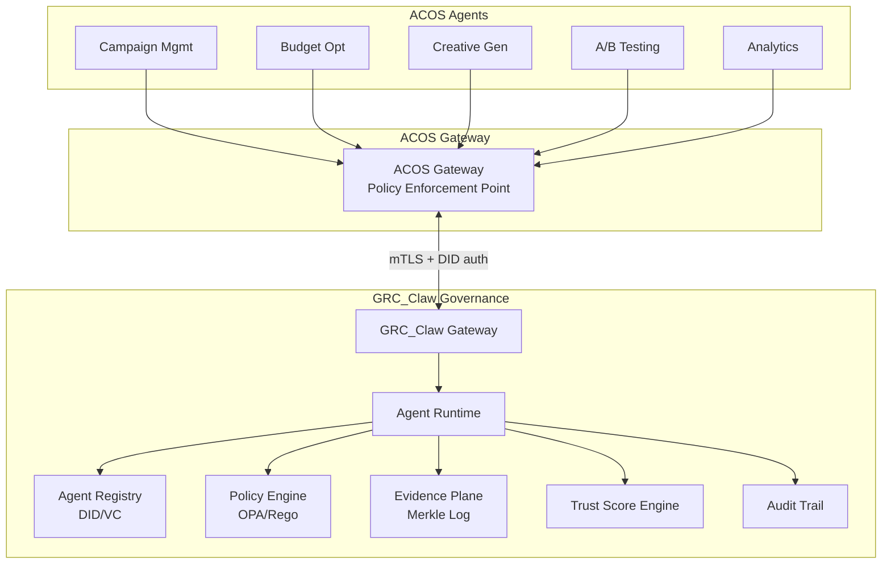

### 8.2 Governance Touchpoints

| Touchpoint | GRC_Claw Service | Purpose |
|------------|-----------------|---------|
| Agent Registration | Agent Registry (DID) | Each ACOS agent has a DID; capabilities and ownership cryptographically bound |
| Policy Enforcement | Policy Engine (OPA) | Every agent action checked against Rego policies before execution |
| Evidence Logging | Evidence Plane | All actions, decisions, and outcomes logged with Merkle-chain integrity |
| Trust Scoring | Trust Score Engine | Continuous trust scoring based on behavior, policy compliance, and outcomes |
| Audit Trail | Audit Management | Compliance officers can query all agent activities in real-time |
| Capability Tokens | ZCAP-LD Service | Fine-grained, expiring, scope-limited authorization tokens |
| Human Approval | Workflow Engine | High-impact actions routed to human approvers with full context |

### 8.3 Policy-as-Code Examples

#### Budget Change Policy (Rego)

```rego
package acos.budget

import future.keywords.if
import future.keywords.in

# Deny budget changes exceeding 25% without human approval
deny[reason] if {
    input.action == "budget.rebalance"
    input.change_percent > 25
    not input.human_approved
    reason := "Budget change exceeds 25% threshold; human approval required"
}

# Deny budget changes that would exceed daily cap
deny[reason] if {
    input.action == "budget.rebalance"
    input.new_daily_budget > input.max_daily_budget
    reason := sprintf("New daily budget %d exceeds cap %d", [input.new_daily_budget, input.max_daily_budget])
}

# Deny ROAS floor violation
deny[reason] if {
    input.action == "budget.rebalance"
    input.projected_roas < data.roas_floor
    reason := sprintf("Projected ROAS %.2f below floor %.2f", [input.projected_roas, data.roas_floor])
}
```

#### Creative Safety Policy (Rego)

```rego
package acos.creative

import future.keywords.if

# Deny creatives with brand safety score below threshold
deny[reason] if {
    input.action == "creative.publish"
    input.brand_safety_score < 0.85
    reason := sprintf("Brand safety score %.2f below threshold 0.85", [input.brand_safety_score])
}

# Deny creatives with forbidden content
deny[reason] if {
    input.action == "creative.publish"
    some tag in input.content_tags
    tag in data.forbidden_content_tags
    reason := sprintf("Creative contains forbidden content tag: %s", [tag])
}

# Require disclaimer for regulated industries
deny[reason] if {
    input.action == "creative.publish"
    input.industry in data.regulated_industries
    not input.has_required_disclaimer
    reason := "Regulated industry creative missing required disclaimer"
}
```

#### A/B Test Policy (Rego)

```rego
package acos.experiment

import future.keywords.if

# Deny tests with insufficient sample size
deny[reason] if {
    input.action == "experiment.launch"
    input.sample_size_per_variant < 1000
    reason := "Sample size per variant below minimum of 1000"
}

# Deny tests on forbidden variables
deny[reason] if {
    input.action == "experiment.launch"
    input.test_variable in ["race", "religion", "health_status", "financial_status"]
    reason := sprintf("Test on forbidden variable: %s", [input.test_variable])
}

# Require guardrail metrics
deny[reason] if {
    input.action == "experiment.launch"
    not input.guardrail_metrics
    reason := "Experiment must define guardrail metrics"
}
```

### 8.4 Evidence Schema

Every ACOS action produces evidence in the following format:

```json
{
  "evidence_id": "evt_20261001_001",
  "timestamp": "2026-10-01T08:15:00Z",
  "agent": {
    "did": "did:grc:acos-budget-optimization",
    "version": "1.0.0",
    "capability_token": "zcap_abc123..."
  },
  "action": {
    "type": "budget.rebalance",
    "input_hash": "sha256:def456...",
    "output_hash": "sha256:ghi789...",
    "policy_decision": "allow",
    "policy_version": "2026.10.01-001"
  },
  "context": {
    "campaign_id": "cmp_123",
    "platform": "meta",
    "previous_budget": 1000,
    "new_budget": 1200,
    "reason": "ROAS outperformance; reallocation from underperforming campaign"
  },
  "outcome": {
    "status": "success",
    "metrics_before": {"roas": 3.2, "cpa": 45},
    "metrics_after": {"roas": 3.5, "cpa": 42},
    "measured_at": "2026-10-01T12:00:00Z"
  },
  "merkle_root": "sha256:jkl012...",
  "previous_evidence_hash": "sha256:mno345..."
}
```

---

## 9. Data Flow Diagrams

### 9.1 Campaign Creation Flow

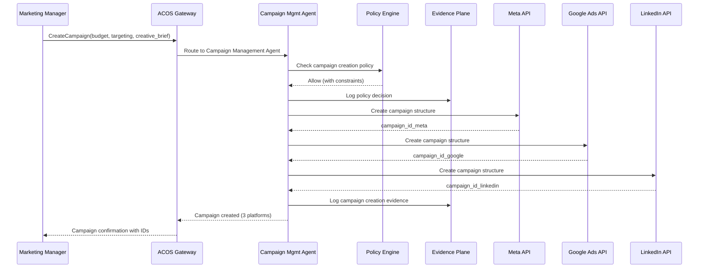

### 9.2 Budget Optimization Flow

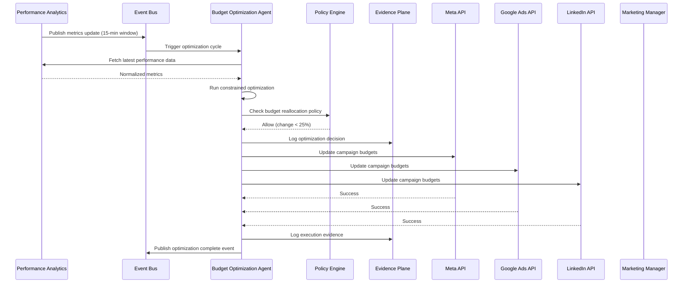

### 9.3 A/B Testing Flow

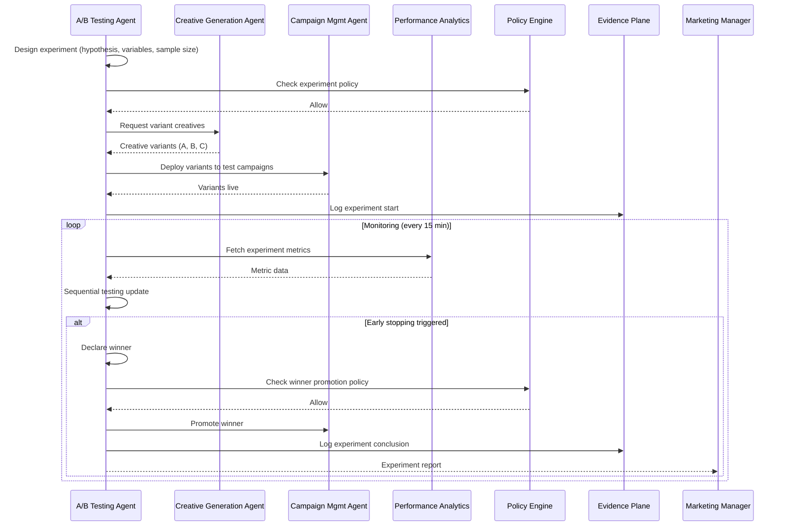

### 9.4 Creative Generation Flow

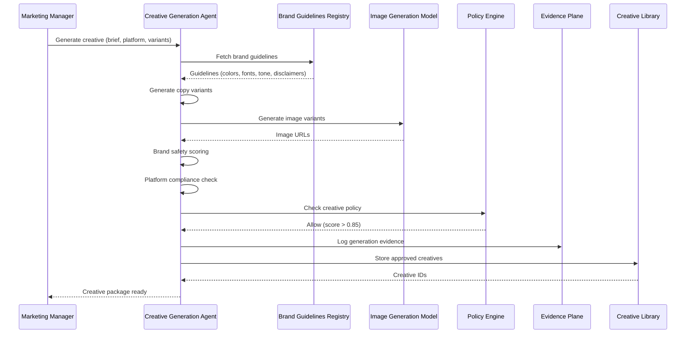

### 9.5 Cross-Agent Event Flow

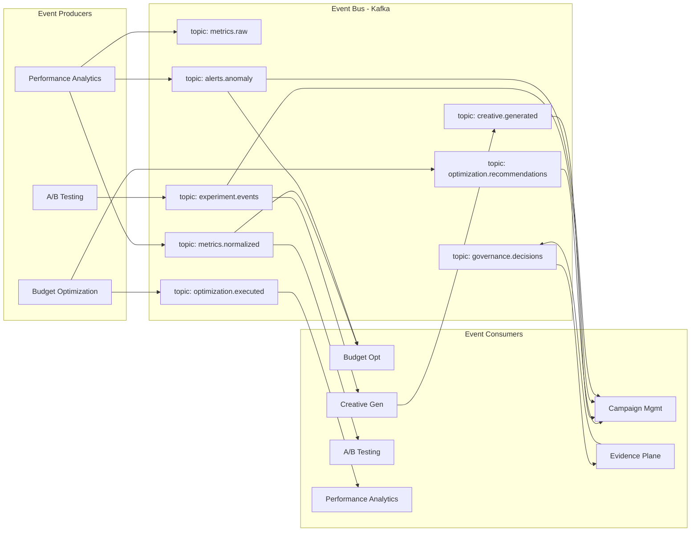

---

## 10. Implementation Roadmap

### Phase 1: Foundation (Weeks 1-4)

| Week | Deliverable | Dependencies |
|------|-------------|--------------|
| 1 | GRC_Claw governance integration; Agent registry setup; DID/VC for all agents | GRC_Claw gateway |
| 1 | Event bus (Kafka) setup; CloudEvents schema registry | Infrastructure |
| 2 | Policy engine (OPA) deployment; Initial policy library | GRC_Claw policy service |
| 2 | Evidence plane integration; Merkle log setup | GRC_Claw evidence service |
| 3 | ACOS Gateway; Authentication; API scaffolding | All governance services |
| 3 | PostgreSQL + Redis state store; Schema design | Infrastructure |
| 4 | Platform adapter framework; Meta Ads API integration | Meta developer account |
| 4 | Basic CMA: campaign CRUD; Single-platform (Meta) | Adapter framework |

**Exit Criteria:** CMA can create/read/update/pause campaigns on Meta with full governance and evidence logging.

### Phase 2: Core Agents (Weeks 5-8)

| Week | Deliverable | Dependencies |
|------|-------------|--------------|
| 5 | Google Ads API integration; LinkedIn Ads API integration | Platform credentials |
| 5 | CMA: Multi-platform campaign management | All adapters |
| 6 | PAA: Data ingestion pipeline; Normalization layer | Event bus, state store |
| 6 | PAA: Basic reporting; Dashboard scaffolding | Data pipeline |
| 7 | BOA: Budget allocation algorithm; Single-platform optimization | PAA metrics |
| 7 | BOA: Cross-platform budget reallocation | Multi-platform data |
| 8 | BOA: Pacing control; Bid management | Optimization algorithm |
| 8 | Real-time optimization loop (Loop 3: 15-min) | All above |

**Exit Criteria:** BOA autonomously reallocates budget across Meta + Google + LinkedIn with policy enforcement and evidence logging.

### Phase 3: Creative & Testing (Weeks 9-12)

| Week | Deliverable | Dependencies |
|------|-------------|--------------|
| 9 | CGA: Copy generation pipeline; Brand guidelines registry | LLM provider |
| 9 | CGA: Image generation; Brand safety scoring | Image model provider |
| 10 | CGA: Video generation; Platform adaptation | Video model provider |
| 10 | CGA: Creative library; Version management | Storage |
| 11 | ABA: Experiment design; Traffic splitting | CMA, CGA |
| 11 | ABA: Sequential testing; Early stopping | PAA metrics |
| 12 | ABA: Winner selection; Auto-promotion | Policy engine |
| 12 | Strategic optimization loop (Loop 1: daily/weekly) | All agents |

**Exit Criteria:** CGA generates brand-safe creatives; ABA runs statistically rigorous A/B tests with automated winner promotion.

### Phase 4: Advanced Analytics & Optimization (Weeks 13-16)

| Week | Deliverable | Dependencies |
|------|-------------|--------------|
| 13 | PAA: Multi-touch attribution; Data-driven model | Data warehouse |
| 13 | PAA: Anomaly detection; Alerting | ML platform |
| 14 | PAA: Forecasting; Predictive analytics | Historical data |
| 14 | BOA: Dayparting; Frequency capping | PAA insights |
| 15 | BOA: Forecasting; Predictive budget allocation | PAA forecasting |
| 15 | CGA: Performance-informed creative iteration | ABA learnings |
| 16 | Tactical optimization loop (Loop 2: hourly) | All agents |
| 16 | End-to-end integration testing; Performance benchmarking | All above |

**Exit Criteria:** All three optimization loops operational; system meets performance targets (Section 1).

### Phase 5: Hardening & Production (Weeks 17-20)

| Week | Deliverable | Dependencies |
|------|-------------|--------------|
| 17 | Security audit; Penetration testing; Vulnerability remediation | Security team |
| 17 | Load testing; Chaos engineering; Circuit breaker validation | Infrastructure |
| 18 | Disaster recovery; Backup/restore; Multi-region failover | Infrastructure |
| 18 | Compliance review; SOC 2 evidence; GDPR compliance | Compliance team |
| 19 | Documentation; Runbooks; Operator training | Technical writing |
| 19 | Production deployment; Monitoring; Alerting | DevOps |
| 20 | Pilot launch; Limited production traffic; Feedback iteration | All stakeholders |
| 20 | Performance tuning; Cost optimization; Scale planning | Production metrics |

**Exit Criteria:** Production-ready system with full observability, disaster recovery, and compliance documentation.

### Phase 6: Scale & Maturity (Weeks 21-24)

| Week | Deliverable | Dependencies |
|------|-------------|--------------|
| 21 | Multi-tenant support; Tenant isolation | Architecture evolution |
| 21 | Self-service onboarding; Campaign templates | Product team |
| 22 | Advanced ML models; Reinforcement learning for optimization | ML platform |
| 22 | Cross-channel attribution; Offline conversion import | Data partnerships |
| 23 | Marketplace for pre-built optimization strategies | Community |
| 23 | API for third-party integrations; Developer portal | SDK |
| 24 | Continuous improvement; Model retraining automation | MLOps pipeline |
| 24 | Full production launch; All features GA | All above |

**Exit Criteria:** GA release with multi-tenant support, advanced ML, and third-party integration capabilities.

---

## 11. Security and Compliance

### 11.1 Security Controls

| Control | Implementation |
|---------|---------------|
| Authentication | OAuth 2.0 + DID-based agent identity |
| Authorization | ZCAP-LD capability tokens; OPA policy enforcement |
| Encryption | TLS 1.3 in transit; AES-256 at rest |
| Secrets Management | HashiCorp Vault; automatic rotation |
| Network Security | Private subnets; security groups; WAF |
| API Security | Rate limiting; input validation; CORS |
| Audit Logging | Immutable Merkle-chained evidence |
| PII Handling | Tokenization; field-level encryption; GDPR deletion |

### 11.2 Compliance Framework

| Framework | Scope | Evidence |
|-----------|-------|----------|
| GDPR | EU user data; consent management; right to deletion | Consent logs; deletion audit trail |
| CCPA | California consumer data; opt-out | Opt-out records; data inventory |
| SOC 2 Type II | Security, availability, confidentiality | Control evidence; audit reports |
| ISO 27001 | Information security management | ISMS documentation; risk register |
| Ad Platform Policies | Meta, Google, LinkedIn advertising policies | Policy compliance logs; rejection history |

---

## 12. Appendices

### Appendix A: Glossary

| Term | Definition |
|------|-----------|
| ACOS | Autonomous Campaign Optimization System |
| BOA | Budget Optimization Agent |
| CGA | Creative Generation Agent |
| CMA | Campaign Management Agent |
| PAA | Performance Analytics Agent |
| ABA | A/B Testing Agent |
| DID | Decentralized Identifier |
| VC | Verifiable Credential |
| ZCAP-LD | Authorization Capability for Linked Data |
| OPA | Open Policy Agent |
| MTA | Multi-Touch Attribution |
| DDA | Data-Driven Attribution |
| mSPRT | Mixture Sequential Probability Ratio Test |
| ROAS | Return on Ad Spend |
| CPA | Cost Per Acquisition |
| CPC | Cost Per Click |
| CPM | Cost Per Mille (thousand impressions) |

### Appendix B: Configuration Reference

```yaml
# acos-config.yaml
system:
  name: acos
  version: 1.0.0
  environment: production

governance:
  grc_claw_gateway: https://grc-claw.internal:18791
  policy_engine: opa://opa.internal:8181
  evidence_plane: https://evidence.internal:8080
  agent_registry: https://registry.internal:8080
  trust_score_threshold: 0.7

agents:
  campaign_management:
    enabled: true
    platforms: [meta, google, linkedin]
    max_campaigns: 100
  budget_optimization:
    enabled: true
    reallocation_frequency: 15min
    max_change_per_cycle_pct: 25
  creative_generation:
    enabled: true
    models:
      image: stable-diffusion-xl
      video: runway-gen-2
      copy: gpt-4
    brand_safety_threshold: 0.85
  ab_testing:
    enabled: true
    alpha: 0.05
    power: 0.80
    min_duration_days: 14
  performance_analytics:
    enabled: true
    attribution_model: data_driven_mta
    anomaly_detection: true

integrations:
  meta:
    api_version: v18.0
    rate_limit: 200
  google:
    api_version: v17
    rate_limit: 15000
  linkedin:
    api_version: 2024-06
    rate_limit: 500

observability:
  tracing: opentelemetry
  metrics: prometheus
  logging: structured_json
  dashboards: grafana
```

### Appendix C: Monitoring and Alerting

| Metric | Threshold | Alert | Action |
|--------|-----------|-------|--------|
| Agent error rate | > 1% | PagerDuty | Investigate; circuit breaker |
| Policy denial rate | > 10% | Slack | Review policy; adjust thresholds |
| Evidence log lag | > 5 min | PagerDuty | Investigate evidence plane |
| Budget optimization latency | > 30 min | Slack | Check BOA; fallback to manual |
| A/B test sample accumulation | < 50% expected at 50% duration | Slack | Extend duration or increase traffic |
| Creative generation failure | > 5% | Slack | Check model provider; fallback templates |
| API rate limit utilization | > 80% | Slack | Throttle; request quota increase |
| Cross-platform sync failure | Any | PagerDuty | Investigate adapter; retry with backoff |

---

**Document Control**

| Version | Date | Author | Changes |
|---------|------|--------|---------|
| 1.0 | 2026-10-01 | GRC_Claw Architecture Team | Initial release |
