# GRC Marketing Core Library Specification

**Package:** `grc-marketing-core`  
**Version:** 1.0.0  
**Date:** 2026-10-01  
**Owner:** GRC_Claw Architecture Team  
**Status:** Specification  
**License:** MIT  

---

## Table of Contents

1. [Executive Summary](#1-executive-summary)
2. [Package Structure & Module Organization](#2-package-structure--module-organization)
3. [Agent Base Classes & Interfaces](#3-agent-base-classes--interfaces)
4. [Governance Integration](#4-governance-integration)
5. [Monitoring & Observability](#5-monitoring--observability)
6. [Security](#6-security)
7. [Data Layer](#7-data-layer)
8. [Integration Hub](#8-integration-hub)
9. [Memory & Context Management](#9-memory--context-management)
10. [Model Routing & Cost Optimization](#10-model-routing--cost-optimization)
11. [Configuration Management](#11-configuration-management)
12. [Module Dependency Map](#12-module-dependency-map)
13. [Data Flow Diagrams](#13-data-flow-diagrams)
14. [Implementation Roadmap](#14-implementation-roadmap)
15. [Appendices](#15-appendices)

---

## 1. Executive Summary

### 1.1 Purpose

`grc-marketing-core` is the shared Python library that all standalone agentic AI marketing projects depend on. It provides a unified foundation for building governed, observable, secure, and cost-efficient marketing agents. Every project — SDR Agent, AE Agent, CSM Agent, Content Optimizer, Campaign Manager, and others — imports this package rather than re-implementing cross-cutting concerns.

### 1.2 Design Principles

| Principle | Description |
|-----------|-------------|
| **Single Source of Truth** | One implementation per concern; no project-local forks |
| **Composable over Monolithic** | Each module is independently importable; no forced coupling |
| **Governance-First** | Policy checks, audit trails, and identity verification are built-in, not bolted-on |
| **Zero-Trust Security** | Every inter-module call is authenticated and authorized |
| **Cost-Aware by Default** | Model routing, token budgeting, and cost attribution are first-class |
| **Observability-Native** | Tracing, metrics, and health checks are automatic, not opt-in |
| **Pluggable Backends** | CDP, memory, model providers, and event buses are swappable via adapters |
| **Type-Safe** | Full Pydantic v2 models for all public interfaces |

### 1.3 Target Consumers

| Consumer | Example Projects |
|----------|-----------------|
| Standalone Agent Services | `sdr-agent`, `ae-agent`, `csm-agent`, `analytics-agent` |
| Batch Processing Pipelines | `campaign-optimizer`, `lead-scorer`, `content-generator` |
| Real-Time Services | `journey-orchestrator`, `event-processor`, `personalization-engine` |
| CLI Tools | `grc-cli`, `grc-admin`, `grc-doctor` |
| Testing & QA | `grc-testkit`, `grc-mock-server` |

---

## 2. Package Structure & Module Organization

### 2.1 Repository Layout

```
grc-marketing-core/
├── pyproject.toml
├── README.md
├── LICENSE
├── CHANGELOG.md
├── Makefile
├── .pre-commit-config.yaml
├── src/
│   └── grc_marketing_core/
│       ├── __init__.py                  # Public API re-exports
│       ├── _version.py                 # Semantic version
│       ├── agents/                     # Agent base classes & interfaces
│       │   ├── __init__.py
│       │   ├── base_agent.py           # BaseAgent ABC
│       │   ├── orchestrator.py         # AgentOrchestrator
│       │   ├── tool.py                 # AgentTool protocol & registry
│       │   ├── middleware.py           # AgentMiddleware chain
│       │   └── handoff.py              # Inter-agent handoff
│       ├── governance/                 # GRC_Claw policy engine & audit
│       │   ├── __init__.py
│       │   ├── policy_engine.py        # Policy evaluation engine
│       │   ├── identity.py             # DID identity management
│       │   ├── audit.py                # Audit trail (Merkle-chain)
│       │   ├── delegation.py           # Capability delegation
│       │   └── compliance.py           # Compliance rule engine
│       ├── monitoring/                 # Observability
│       │   ├── __init__.py
│       │   ├── tracing.py              # OpenTelemetry tracing
│       │   ├── metrics.py              # Prometheus metrics
│       │   ├── health.py               # Health check framework
│       │   ├── cost.py                 # Cost tracking & attribution
│       │   └── logging.py              # Structured logging
│       ├── security/                   # Security layer
│       │   ├── __init__.py
│       │   ├── auth.py                 # Authentication (OAuth2, mTLS, SPIFFE)
│       │   ├── authorization.py        # PBAC + RBAC
│       │   ├── encryption.py           # Field-level encryption
│       │   ├── secrets.py              # Secrets management (Vault)
│       │   └── audit_log.py            # Security audit logging
│       ├── data/                       # Data layer
│       │   ├── __init__.py
│       │   ├── cdp.py                  # CDP integration
│       │   ├── identity_resolution.py  # Identity graph & resolution
│       │   ├── events.py               # Event streaming (Kafka)
│       │   ├── profiles.py             # Customer profile access
│       │   └── consent.py              # Consent management
│       ├── integration/                # Integration hub
│       │   ├── __init__.py
│       │   ├── connector.py            # BaseConnector & registry
│       │   ├── mcp.py                  # MCP (Model Context Protocol) support
│       │   ├── gateway.py              # API gateway client
│       │   ├── router.py               # Capability-based routing
│       │   └── transform.py            # Data transformation engine
│       ├── memory/                     # Memory & context
│       │   ├── __init__.py
│       │   ├── cognee.py               # Cognee integration
│       │   ├── session.py              # Session-aware recall
│       │   ├── context.py              # Context window management
│       │   └── vector.py               # Vector store abstraction
│       ├── routing/                    # Model routing
│       │   ├── __init__.py
│       │   ├── laya.py                 # Laya integration
│       │   ├── tiered.py               # Tiered model routing
│       │   ├── budget.py               # Token budget enforcement
│       │   └── fallback.py             # Fallback chain
│       ├── config/                     # Configuration management
│       │   ├── __init__.py
│       │   ├── settings.py             # Pydantic settings
│       │   ├── environments.py         # Environment-specific configs
│       │   ├── feature_flags.py        # Feature flag engine
│       │   └── secrets_resolver.py     # Secret resolution
│       ├── models/                     # Shared domain models
│       │   ├── __init__.py
│       │   ├── agent.py                # Agent-related models
│       │   ├── campaign.py             # Campaign models
│       │   ├── customer.py             # Customer models
│       │   ├── content.py              # Content models
│       │   └── events.py               # Event models
│       ├── utils/                      # Shared utilities
│       │   ├── __init__.py
│       │   ├── retry.py                # Retry with exponential backoff
│       │   ├── circuit_breaker.py      # Circuit breaker pattern
│       │   ├── rate_limiter.py         # Rate limiting
│       │   ├── cache.py                # Caching utilities
│       │   ├── serialization.py        # JSON/msgpack helpers
│       │   └── validators.py           # Shared validators
│       └── exceptions/                 # Exception hierarchy
│           ├── __init__.py
│           └── errors.py               # All custom exceptions
├── tests/
│   ├── unit/
│   ├── integration/
│   ├── e2e/
│   └── fixtures/
├── docs/
│   ├── api/
│   ├── guides/
│   └── adr/
├── examples/
│   ├── basic_agent/
│   ├── multi_agent/
│   └── custom_connector/
└── scripts/
    ├── bump_version.py
    └── generate_docs.py
```

### 2.2 Module Dependency Rules

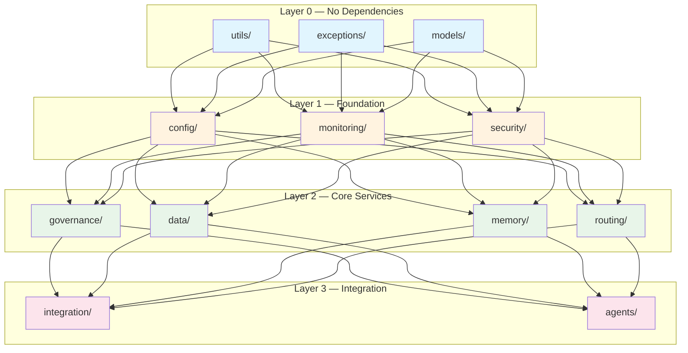

**Rules:**
- Lower layers must never import from higher layers.
- `utils/`, `exceptions/`, and `models/` must not import from any other internal module.
- `config/`, `monitoring/`, and `security/` may only import from Layer 0.
- `governance/`, `data/`, `memory/`, and `routing/` may import from Layers 0–1.
- `integration/` and `agents/` may import from all layers.
- Circular dependencies are forbidden and enforced by `import-linter` in CI.

### 2.3 Public API Surface

The top-level `__init__.py` re-exports the stable public API:

```python
# src/grc_marketing_core/__init__.py

# Agents
from grc_marketing_core.agents import BaseAgent, AgentOrchestrator, AgentTool

# Governance
from grc_marketing_core.governance import PolicyEngine, IdentityManager, AuditTrail

# Monitoring
from grc_marketing_core.monitoring import Tracer, MetricsCollector, HealthChecker

# Security
from grc_marketing_core.security import Authenticator, Authorizer, Encryptor, SecretsManager

# Data
from grc_marketing_core.data import CDPClient, IdentityResolver, EventStreamer

# Integration
from grc_marketing_core.integration import ConnectorRegistry, MCPClient, APIGateway

# Memory
from grc_marketing_core.memory import CogneeMemory, SessionManager, ContextWindow

# Routing
from grc_marketing_core.routing import LayaRouter, TieredRouter, BudgetEnforcer

# Config
from grc_marketing_core.config import Settings, FeatureFlags

__version__ = "1.0.0"
```

### 2.4 Naming Conventions

| Element | Convention | Example |
|---------|-----------|---------|
| Package name | `grc-marketing-core` (PyPI) / `grc_marketing_core` (import) | — |
| Modules | `snake_case.py` | `policy_engine.py` |
| Classes | `PascalCase` | `BaseAgent`, `PolicyEngine` |
| Abstract classes | Prefix with `Base` or suffix with `ABC` | `BaseConnector`, `BaseAgent` |
| Protocols | Suffix with `Protocol` | `AgentToolProtocol` |
| Exceptions | Suffix with `Error` | `PolicyViolationError` |
| Constants | `UPPER_SNAKE_CASE` | `DEFAULT_TOKEN_BUDGET` |
| Private members | Prefix with `_` | `_internal_cache` |
| Test files | `test_<module>.py` | `test_policy_engine.py` |

---

## 3. Agent Base Classes & Interfaces

### 3.1 BaseAgent

The abstract base class that all marketing agents inherit from.

```python
# src/grc_marketing_core/agents/base_agent.py

from __future__ import annotations

import uuid
from abc import ABC, abstractmethod
from dataclasses import dataclass, field
from enum import Enum
from typing import Any, AsyncIterator, Callable

from grc_marketing_core.governance import PolicyEngine, IdentityManager, AuditTrail
from grc_marketing_core.monitoring import Tracer, MetricsCollector
from grc_marketing_core.security import Authenticator, Authorizer
from grc_marketing_core.memory import SessionManager, ContextWindow
from grc_marketing_core.routing import TieredRouter
from grc_marketing_core.config import Settings


class AgentState(str, Enum):
    INITIALIZED = "initialized"
    PLANNING = "planning"
    EXECUTING = "executing"
    WAITING_FOR_APPROVAL = "waiting_for_approval"
    COMPLETED = "completed"
    FAILED = "failed"
    CANCELLED = "cancelled"


@dataclass
class AgentContext:
    """Immutable context passed through the agent lifecycle."""
    agent_id: str
    tenant_id: str
    session_id: str
    trace_id: str = field(default_factory=lambda: str(uuid.uuid4()))
    parent_agent_id: str | None = None
    metadata: dict[str, Any] = field(default_factory=dict)


@dataclass
class AgentResult:
    """Standard result returned by every agent execution."""
    success: bool
    agent_id: str
    session_id: str
    output: Any = None
    error: str | None = None
    tokens_used: int = 0
    cost_usd: float = 0.0
    duration_ms: float = 0.0
    artifacts: list[dict[str, Any]] = field(default_factory=list)


class BaseAgent(ABC):
    """
    Abstract base class for all GRC marketing agents.
    
    Provides:
    - Lifecycle management (init → plan → execute → complete)
    - Governance integration (policy checks, audit logging)
    - Observability (tracing, metrics, cost tracking)
    - Security (authentication, authorization)
    - Memory (session-aware context, recall)
    - Model routing (tiered model selection, budget enforcement)
    """

    def __init__(
        self,
        agent_id: str,
        tenant_id: str,
        settings: Settings,
        policy_engine: PolicyEngine,
        identity_manager: IdentityManager,
        audit_trail: AuditTrail,
        tracer: Tracer,
        metrics: MetricsCollector,
        authenticator: Authenticator,
        authorizer: Authorizer,
        session_manager: SessionManager,
        context_window: ContextWindow,
        model_router: TieredRouter,
    ) -> None:
        self.agent_id = agent_id
        self.tenant_id = tenant_id
        self.settings = settings
        self._policy_engine = policy_engine
        self._identity_manager = identity_manager
        self._audit_trail = audit_trail
        self._tracer = tracer
        self._metrics = metrics
        self._authenticator = authenticator
        self._authorizer = authorizer
        self._session_manager = session_manager
        self._context_window = context_window
        self._model_router = model_router
        self._state = AgentState.INITIALIZED
        self._context: AgentContext | None = None

    @property
    def state(self) -> AgentState:
        return self._state

    @abstractmethod
    async def plan(self, task: str, context: AgentContext) -> list[AgentTool]:
        """
        Decompose a high-level task into an ordered list of tool invocations.
        Must be implemented by each concrete agent.
        """
        ...

    @abstractmethod
    async def execute_tool(self, tool: AgentTool, context: AgentContext) -> Any:
        """
        Execute a single tool invocation with full governance wrapping.
        Must be implemented by each concrete agent.
        """
        ...

    @abstractmethod
    async def evaluate(self, result: AgentResult, context: AgentContext) -> bool:
        """
        Evaluate whether the agent's output meets quality criteria.
        Return True to accept, False to retry or escalate.
        """
        ...

    async def run(self, task: str, session_id: str | None = None) -> AgentResult:
        """
        Main entry point. Orchestrates the full agent lifecycle.
        """
        session_id = session_id or str(uuid.uuid4())
        self._context = AgentContext(
            agent_id=self.agent_id,
            tenant_id=self.tenant_id,
            session_id=session_id,
        )

        with self._tracer.span(f"agent.{self.agent_id}.run") as span:
            span.set_attribute("agent.id", self.agent_id)
            span.set_attribute("agent.tenant", self.tenant_id)
            span.set_attribute("agent.session", session_id)

            try:
                # 1. Authenticate & authorize
                await self._authenticate_and_authorize(task)

                # 2. Load session context
                await self._session_manager.load(session_id)

                # 3. Plan
                self._state = AgentState.PLANNING
                tools = await self.plan(task, self._context)

                # 4. Execute
                self._state = AgentState.EXECUTING
                results = []
                for tool in tools:
                    # Policy check before each tool call
                    await self._policy_engine.check(
                        subject=self.agent_id,
                        action=tool.name,
                        resource=tool.resource,
                        context=self._context,
                    )

                    result = await self.execute_tool(tool, self._context)
                    results.append(result)

                    # Audit log after each tool call
                    await self._audit_trail.record(
                        agent_id=self.agent_id,
                        action=tool.name,
                        resource=tool.resource,
                        result=result,
                        context=self._context,
                    )

                # 5. Evaluate
                agent_result = AgentResult(
                    success=True,
                    agent_id=self.agent_id,
                    session_id=session_id,
                    output=results,
                )

                if not await self.evaluate(agent_result, self._context):
                    agent_result.success = False
                    agent_result.error = "Quality evaluation failed"

                self._state = AgentState.COMPLETED
                return agent_result

            except Exception as e:
                self._state = AgentState.FAILED
                self._metrics.increment("agent.errors", tags={"agent": self.agent_id})
                return AgentResult(
                    success=False,
                    agent_id=self.agent_id,
                    session_id=session_id,
                    error=str(e),
                )

    async def _authenticate_and_authorize(self, task: str) -> None:
        """Verify agent identity and check task authorization."""
        token = await self._authenticator.get_agent_token(self.agent_id)
        await self._authorizer.check_permission(
            token=token,
            resource=f"task:{task}",
            action="execute",
        )

    async def request_approval(
        self,
        action: str,
        details: dict[str, Any],
        context: AgentContext,
    ) -> bool:
        """
        Request human-in-the-loop approval for sensitive actions.
        Returns True if approved, False if denied.
        """
        self._state = AgentState.WAITING_FOR_APPROVAL
        approved = await self._policy_engine.request_human_approval(
            agent_id=self.agent_id,
            action=action,
            details=details,
            context=context,
        )
        if approved:
            self._state = AgentState.EXECUTING
        return approved
```

### 3.2 AgentOrchestrator

Manages multi-agent coordination, task decomposition, and inter-agent handoff.

```python
# src/grc_marketing_core/agents/orchestrator.py

from __future__ import annotations

import asyncio
from dataclasses import dataclass, field
from enum import Enum
from typing import Any

from grc_marketing_core.agents.base_agent import BaseAgent, AgentContext, AgentResult, AgentState
from grc_marketing_core.governance import PolicyEngine, AuditTrail
from grc_marketing_core.monitoring import Tracer, MetricsCollector


class OrchestrationStrategy(str, Enum):
    SEQUENTIAL = "sequential"
    PARALLEL = "parallel"
    HIERARCHICAL = "hierarchical"
    SWARM = "swarm"


@dataclass
class AgentNode:
    """A node in the orchestration graph."""
    agent: BaseAgent
    depends_on: list[str] = field(default_factory=list)
    max_retries: int = 3
    timeout_seconds: float = 300.0


@dataclass
class OrchestrationResult:
    success: bool
    results: dict[str, AgentResult]
    total_tokens: int
    total_cost_usd: float
    total_duration_ms: float


class AgentOrchestrator:
    """
    Coordinates multiple agents working on a composite task.
    
    Supports:
    - Sequential execution (pipeline)
    - Parallel execution (fan-out/fan-in)
    - Hierarchical delegation (manager → worker)
    - Swarm patterns (dynamic agent spawning)
    """

    def __init__(
        self,
        policy_engine: PolicyEngine,
        audit_trail: AuditTrail,
        tracer: Tracer,
        metrics: MetricsCollector,
    ) -> None:
        self._policy_engine = policy_engine
        self._audit_trail = audit_trail
        self._tracer = tracer
        self._metrics = metrics
        self._agents: dict[str, AgentNode] = {}
        self._strategy = OrchestrationStrategy.SEQUENTIAL

    def register_agent(self, name: str, agent: BaseAgent, depends_on: list[str] | None = None) -> None:
        """Register an agent with optional dependencies."""
        self._agents[name] = AgentNode(
            agent=agent,
            depends_on=depends_on or [],
        )

    def set_strategy(self, strategy: OrchestrationStrategy) -> None:
        """Set the orchestration strategy."""
        self._strategy = strategy

    async def execute(self, task: str, context: AgentContext) -> OrchestrationResult:
        """Execute the full orchestration graph."""
        with self._tracer.span("orchestrator.execute") as span:
            span.set_attribute("orchestrator.strategy", self._strategy.value)
            span.set_attribute("orchestrator.agent_count", len(self._agents))

            if self._strategy == OrchestrationStrategy.SEQUENTIAL:
                return await self._execute_sequential(task, context)
            elif self._strategy == OrchestrationStrategy.PARALLEL:
                return await self._execute_parallel(task, context)
            elif self._strategy == OrchestrationStrategy.HIERARCHICAL:
                return await self._execute_hierarchical(task, context)
            elif self._strategy == OrchestrationStrategy.SWARM:
                return await self._execute_swarm(task, context)
            else:
                raise ValueError(f"Unknown strategy: {self._strategy}")

    async def _execute_sequential(self, task: str, context: AgentContext) -> OrchestrationResult:
        """Execute agents in dependency order."""
        results: dict[str, AgentResult] = {}
        total_tokens = 0
        total_cost = 0.0
        total_duration = 0.0

        for name, node in self._agents.items():
            # Wait for dependencies
            for dep in node.depends_on:
                while dep not in results:
                    await asyncio.sleep(0.1)

            # Check policy
            await self._policy_engine.check(
                subject=name,
                action="orchestrate",
                resource=task,
                context=context,
            )

            # Execute
            result = await asyncio.wait_for(
                node.agent.run(task, context.session_id),
                timeout=node.timeout_seconds,
            )
            results[name] = result
            total_tokens += result.tokens_used
            total_cost += result.cost_usd
            total_duration += result.duration_ms

            # Audit
            await self._audit_trail.record(
                agent_id=name,
                action="orchestrate",
                resource=task,
                result=result,
                context=context,
            )

        return OrchestrationResult(
            success=all(r.success for r in results.values()),
            results=results,
            total_tokens=total_tokens,
            total_cost_usd=total_cost,
            total_duration_ms=total_duration,
        )

    async def _execute_parallel(self, task: str, context: AgentContext) -> OrchestrationResult:
        """Execute independent agents concurrently."""
        # Group agents by dependency level
        levels = self._topological_sort()
        results: dict[str, AgentResult] = {}
        total_tokens = 0
        total_cost = 0.0
        total_duration = 0.0

        for level in levels:
            tasks = [
                self._agents[name].agent.run(task, context.session_id)
                for name in level
            ]
            level_results = await asyncio.gather(*tasks, return_exceptions=True)

            for name, result in zip(level, level_results):
                if isinstance(result, Exception):
                    results[name] = AgentResult(
                        success=False,
                        agent_id=name,
                        session_id=context.session_id,
                        error=str(result),
                    )
                else:
                    results[name] = result
                    total_tokens += result.tokens_used
                    total_cost += result.cost_usd
                    total_duration += result.duration_ms

        return OrchestrationResult(
            success=all(r.success for r in results.values()),
            results=results,
            total_tokens=total_tokens,
            total_cost_usd=total_cost,
            total_duration_ms=total_duration,
        )

    async def _execute_hierarchical(self, task: str, context: AgentContext) -> OrchestrationResult:
        """Manager agent delegates to worker agents."""
        # Implementation: manager decomposes task, workers execute subtasks
        ...

    async def _execute_swarm(self, task: str, context: AgentContext) -> OrchestrationResult:
        """Dynamic agent spawning based on task complexity."""
        # Implementation: spawn agents on-demand, aggregate results
        ...

    def _topological_sort(self) -> list[list[str]]:
        """Topological sort of agents by dependency graph."""
        ...

    async def handoff(
        self,
        from_agent: str,
        to_agent: str,
        context: AgentContext,
        state: dict[str, Any],
    ) -> AgentResult:
        """Transfer control and state from one agent to another."""
        with self._tracer.span("orchestrator.handoff") as span:
            span.set_attribute("handoff.from", from_agent)
            span.set_attribute("handoff.to", to_agent)

            # Audit the handoff
            await self._audit_trail.record(
                agent_id=from_agent,
                action="handoff",
                resource=to_agent,
                result={"state": state},
                context=context,
            )

            # Update context with handoff state
            context.metadata["handoff_from"] = from_agent
            context.metadata["handoff_state"] = state

            return await self._agents[to_agent].agent.run(
                task=context.metadata.get("original_task", ""),
                session_id=context.session_id,
            )
```

### 3.3 AgentTool

The protocol and registry for tools that agents can invoke.

```python
# src/grc_marketing_core/agents/tool.py

from __future__ import annotations

from abc import ABC, abstractmethod
from dataclasses import dataclass, field
from enum import Enum
from typing import Any, Protocol, runtime_checkable

from pydantic import BaseModel, Field


class ToolCategory(str, Enum):
    DATA = "data"
    INTEGRATION = "integration"
    COMMUNICATION = "communication"
    ANALYTICS = "analytics"
    CONTENT = "content"
    GOVERNANCE = "governance"
    MEMORY = "memory"


@dataclass
class ToolSchema:
    """JSON Schema for tool input/output."""
    name: str
    description: str
    parameters: dict[str, Any]
    returns: dict[str, Any] | None = None
    category: ToolCategory = ToolCategory.DATA
    requires_approval: bool = False
    rate_limit: int | None = None  # calls per minute


@runtime_checkable
class AgentToolProtocol(Protocol):
    """Protocol that all agent tools must implement."""

    @property
    def schema(self) -> ToolSchema: ...

    async def execute(self, **kwargs: Any) -> Any: ...

    async def validate(self, **kwargs: Any) -> bool: ...


class AgentTool(ABC):
    """
    Abstract base class for all agent tools.
    
    Tools are the atomic units of agent execution. Each tool:
    - Has a JSON Schema for input validation
    - Is registered in the global tool registry
    - Is policy-checked before execution
    - Is traced and metered
    - Supports approval workflows for sensitive operations
    """

    def __init__(self) -> None:
        self._schema = self._define_schema()

    @property
    def schema(self) -> ToolSchema:
        return self._schema

    @abstractmethod
    def _define_schema(self) -> ToolSchema:
        """Define the tool's JSON Schema. Must be implemented by each tool."""
        ...

    @abstractmethod
    async def execute(self, **kwargs: Any) -> Any:
        """Execute the tool. Must be implemented by each tool."""
        ...

    async def validate(self, **kwargs: Any) -> bool:
        """Validate input against the tool's schema. Override for custom validation."""
        # Default: use Pydantic to validate against parameters schema
        return True

    def __repr__(self) -> str:
        return f"<AgentTool {self._schema.name}>"


class ToolRegistry:
    """
    Global registry for all agent tools.
    
    Supports:
    - Registration by name or capability
    - Discovery by category or tag
    - Schema export for LLM function calling
    - Hot-reloading in development
    """

    def __init__(self) -> None:
        self._tools: dict[str, AgentTool] = {}
        self._capabilities: dict[str, list[str]] = {}

    def register(self, tool: AgentTool, capabilities: list[str] | None = None) -> None:
        """Register a tool with optional capability tags."""
        self._tools[tool.schema.name] = tool
        for cap in (capabilities or [tool.schema.name]):
            self._capabilities.setdefault(cap, []).append(tool.schema.name)

    def get(self, name: str) -> AgentTool:
        """Get a tool by name."""
        if name not in self._tools:
            raise KeyError(f"Tool not found: {name}")
        return self._tools[name]

    def find_by_capability(self, capability: str) -> list[AgentTool]:
        """Find all tools that provide a given capability."""
        names = self._capabilities.get(capability, [])
        return [self._tools[n] for n in names if n in self._tools]

    def list_tools(self, category: ToolCategory | None = None) -> list[ToolSchema]:
        """List all registered tools, optionally filtered by category."""
        tools = self._tools.values()
        if category:
            tools = [t for t in tools if t.schema.category == category]
        return [t.schema for t in tools]

    def export_for_llm(self) -> list[dict[str, Any]]:
        """Export all tool schemas in OpenAI function-calling format."""
        return [
            {
                "type": "function",
                "function": {
                    "name": t.schema.name,
                    "description": t.schema.description,
                    "parameters": t.schema.parameters,
                },
            }
            for t in self._tools.values()
        ]
```

### 3.4 Agent Middleware

```python
# src/grc_marketing_core/agents/middleware.py

from __future__ import annotations

from abc import ABC, abstractmethod
from dataclasses import dataclass
from typing import Any, Callable

from grc_marketing_core.agents.base_agent import AgentContext


class AgentMiddleware(ABC):
    """
    Middleware that wraps agent execution.
    
    Middleware can:
    - Pre-process tasks before planning
    - Post-process results before evaluation
    - Inject additional context
    - Enforce rate limits
    - Add custom tracing
    """

    @abstractmethod
    async def before_plan(self, task: str, context: AgentContext) -> str:
        """Called before planning. Can modify the task."""
        ...

    @abstractmethod
    async def after_execute(self, result: Any, context: AgentContext) -> Any:
        """Called after each tool execution. Can modify the result."""
        ...

    @abstractmethod
    async def before_complete(self, result: Any, context: AgentContext) -> Any:
        """Called before completion. Can modify the final result."""
        ...


class MiddlewareChain:
    """Chains multiple middleware together."""

    def __init__(self) -> None:
        self._middleware: list[AgentMiddleware] = []

    def add(self, middleware: AgentMiddleware) -> None:
        self._middleware.append(middleware)

    async def process_task(self, task: str, context: AgentContext) -> str:
        for mw in self._middleware:
            task = await mw.before_plan(task, context)
        return task

    async def process_result(self, result: Any, context: AgentContext) -> Any:
        for mw in reversed(self._middleware):
            result = await mw.after_execute(result, context)
        return result
```

---

## 4. Governance Integration

### 4.1 Architecture

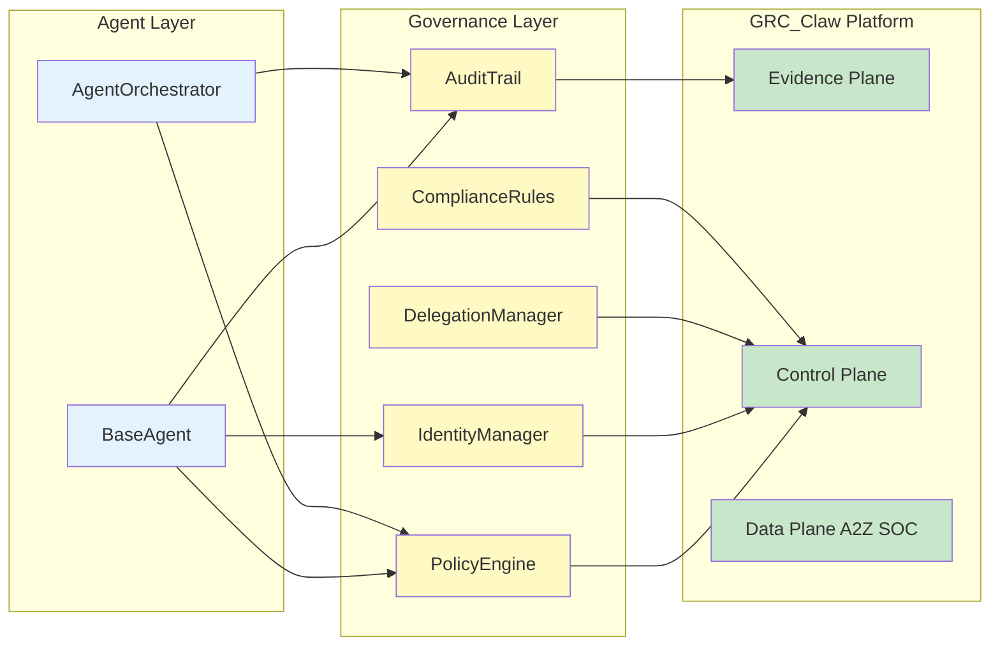

### 4.2 Policy Engine

```python
# src/grc_marketing_core/governance/policy_engine.py

from __future__ import annotations

import json
from dataclasses import dataclass, field
from enum import Enum
from typing import Any

import httpx
from pydantic import BaseModel, Field


class PolicyEffect(str, Enum):
    ALLOW = "allow"
    DENY = "deny"
    REQUIRE_APPROVAL = "require_approval"


class PolicyDecision(BaseModel):
    effect: PolicyEffect
    reason: str
    policy_id: str | None = None
    obligations: list[str] = Field(default_factory=list)
    advice: list[str] = Field(default_factory=list)


class PolicyRequest(BaseModel):
    subject: str
    action: str
    resource: str
    context: dict[str, Field(default_factory=dict)]
    tenant_id: str


@dataclass
class PolicyRule:
    """A single policy rule."""
    rule_id: str
    name: str
    description: str
    subject_match: str  # e.g., "agent:content-optimizer:*"
    action_match: str   # e.g., "campaign:write"
    resource_match: str # e.g., "campaign:*"
    conditions: dict[str, Any] = field(default_factory=dict)
    effect: PolicyEffect = PolicyEffect.ALLOW
    priority: int = 100


class PolicyEngine:
    """
    GRC_Claw policy enforcement engine.
    
    Evaluates every agent action against registered policies.
    Policies are loaded from the GRC_Claw Control Plane and cached locally.
    
    Features:
    - Deterministic evaluation (same input → same output)
    - Fail-closed on engine errors
    - Human-in-the-loop approval for sensitive actions
    - Policy composition (multiple rules can apply)
    - Obligation enforcement (e.g., "must log to audit trail")
    """

    def __init__(
        self,
        control_plane_url: str,
        api_key: str,
        cache_ttl_seconds: int = 60,
    ) -> None:
        self._control_plane_url = control_plane_url
        self._api_key = api_key
        self._cache_ttl = cache_ttl_seconds
        self._rules: list[PolicyRule] = []
        self._cache: dict[str, Any] = {}

    async def initialize(self) -> None:
        """Load policies from the GRC_Claw Control Plane."""
        async with httpx.AsyncClient() as client:
            response = await client.get(
                f"{self._control_plane_url}/v1/policies",
                headers={"Authorization": f"Bearer {self._api_key}"},
            )
            response.raise_for_status()
            data = response.json()
            self._rules = [PolicyRule(**rule) for rule in data["rules"]]

    async def check(
        self,
        subject: str,
        action: str,
        resource: str,
        context: Any,
    ) -> PolicyDecision:
        """
        Check if an action is permitted.
        
        Returns a PolicyDecision with effect ALLOW, DENY, or REQUIRE_APPROVAL.
        Raises PolicyViolationError if the action is denied.
        """
        request = PolicyRequest(
            subject=subject,
            action=action,
            resource=resource,
            context=context.metadata if hasattr(context, "metadata") else {},
            tenant_id=getattr(context, "tenant_id", "default"),
        )

        # Evaluate all matching rules
        matching = self._find_matching_rules(request)
        if not matching:
            # Fail-closed: no matching rule means deny
            return PolicyDecision(
                effect=PolicyEffect.DENY,
                reason="No matching policy rule found",
            )

        # Sort by priority (lower number = higher priority)
        matching.sort(key=lambda r: r.priority)

        # Evaluate conditions
        for rule in matching:
            if self._evaluate_conditions(rule.conditions, request):
                decision = PolicyDecision(
                    effect=rule.effect,
                    reason=f"Matched rule: {rule.name}",
                    policy_id=rule.rule_id,
                    obligations=rule.conditions.get("obligations", []),
                )
                return decision

        # Default deny
        return PolicyDecision(
            effect=PolicyEffect.DENY,
            reason="No rule conditions matched",
        )

    async def request_human_approval(
        self,
        agent_id: str,
        action: str,
        details: dict[str, Any],
        context: Any,
    ) -> bool:
        """
        Request human approval for a sensitive action.
        
        Sends an approval request to the GRC_Claw Control Plane,
        which routes it to the appropriate human approver.
        """
        async with httpx.AsyncClient() as client:
            response = await client.post(
                f"{self._control_plane_url}/v1/approvals",
                headers={"Authorization": f"Bearer {self._api_key}"},
                json={
                    "agent_id": agent_id,
                    "action": action,
                    "details": details,
                    "context": context.metadata if hasattr(context, "metadata") else {},
                    "tenant_id": getattr(context, "tenant_id", "default"),
                },
            )
            response.raise_for_status()
            result = response.json()
            return result.get("approved", False)

    def _find_matching_rules(self, request: PolicyRequest) -> list[PolicyRule]:
        """Find all rules that match the request."""
        import fnmatch
        return [
            rule for rule in self._rules
            if fnmatch.fnmatch(request.subject, rule.subject_match)
            and fnmatch.fnmatch(request.action, rule.action_match)
            and fnmatch.fnmatch(request.resource, rule.resource_match)
        ]

    def _evaluate_conditions(
        self,
        conditions: dict[str, Any],
        request: PolicyRequest,
    ) -> bool:
        """Evaluate rule conditions against the request."""
        for key, value in conditions.items():
            if key == "obligations":
                continue
            if key == "time_window":
                if not self._check_time_window(value):
                    return False
            elif key == "data_classification":
                if request.context.get("data_classification") != value:
                    return False
            # Add more condition types as needed
        return True

    def _check_time_window(self, window: str) -> bool:
        """Check if current time is within the allowed window."""
        from datetime import datetime, timezone
        now = datetime.now(timezone.utc)
        start, end = window.split("-")
        start_hour, start_min = map(int, start.split(":"))
        end_hour, end_min = map(int, end.split(":"))
        current_minutes = now.hour * 60 + now.minute
        return (start_hour * 60 + start_min) <= current_minutes <= (end_hour * 60 + end_min)
```

### 4.3 DID Identity Management

```python
# src/grc_marketing_core/governance/identity.py

from __future__ import annotations

import hashlib
import json
from dataclasses import dataclass, field
from datetime import datetime, timezone
from enum import Enum
from typing import Any

import httpx
from pydantic import BaseModel, Field


class IdentityType(str, Enum):
    AGENT = "agent"
    USER = "user"
    SERVICE = "service"
    EXTERNAL = "external"


class DIDDocument(BaseModel):
    """W3C DID Document representation."""
    id: str
    type: IdentityType
    public_keys: list[dict[str, Any]] = Field(default_factory=list)
    authentication: list[str] = Field(default_factory=list)
    assertion_method: list[str] = Field(default_factory=list)
    capability_invocation: list[str] = Field(default_factory=list)
    capability_delegation: list[str] = Field(default_factory=list)
    service_endpoints: list[dict[str, Any]] = Field(default_factory=list)
    created: datetime = Field(default_factory=lambda: datetime.now(timezone.utc))
    updated: datetime = Field(default_factory=lambda: datetime.now(timezone.utc))


class IdentityManager:
    """
    Manages Decentralized Identifiers (DIDs) for all agents and services.
    
    Every agent gets a unique DID that:
    - Is registered in the GRC_Claw identity registry
    - Contains public keys for verification
    - Links to capability delegations
    - Is used for all inter-agent communication
    
    DID Format: did:grc:{tenant_id}:{agent_id}
    """

    def __init__(
        self,
        registry_url: str,
        api_key: str,
    ) -> None:
        self._registry_url = registry_url
        self._api_key = api_key

    async def create_identity(
        self,
        agent_id: str,
        tenant_id: str,
        identity_type: IdentityType = IdentityType.AGENT,
        public_keys: list[dict[str, Any]] | None = None,
    ) -> DIDDocument:
        """Create a new DID for an agent."""
        did = f"did:grc:{tenant_id}:{agent_id}"
        document = DIDDocument(
            id=did,
            type=identity_type,
            public_keys=public_keys or [],
        )

        async with httpx.AsyncClient() as client:
            response = await client.post(
                f"{self._registry_url}/v1/identities",
                headers={"Authorization": f"Bearer {self._api_key}"},
                json=document.model_dump(mode="json"),
            )
            response.raise_for_status()
            return DIDDocument(**response.json())

    async def resolve_identity(self, did: str) -> DIDDocument:
        """Resolve a DID to its document."""
        async with httpx.AsyncClient() as client:
            response = await client.get(
                f"{self._registry_url}/v1/identities/{did}",
                headers={"Authorization": f"Bearer {self._api_key}"},
            )
            response.raise_for_status()
            return DIDDocument(**response.json())

    async def delegate_capability(
        self,
        from_did: str,
        to_did: str,
        capabilities: list[str],
        constraints: dict[str, Any] | None = None,
    ) -> str:
        """
        Delegate capabilities from one identity to another.
        
        Returns the delegation ID.
        """
        delegation = {
            "from": from_did,
            "to": to_did,
            "capabilities": capabilities,
            "constraints": constraints or {},
            "created": datetime.now(timezone.utc).isoformat(),
        }

        async with httpx.AsyncClient() as client:
            response = await client.post(
                f"{self._registry_url}/v1/delegations",
                headers={"Authorization": f"Bearer {self._api_key}"},
                json=delegation,
            )
            response.raise_for_status()
            return response.json()["delegation_id"]

    async def verify_capability(
        self,
        did: str,
        capability: str,
        resource: str,
    ) -> bool:
        """Verify that an identity has a specific capability for a resource."""
        try:
            document = await self.resolve_identity(did)
            # Check capability invocations and delegations
            for cap_id in document.capability_invocation:
                if capability in cap_id:
                    return True
            return False
        except Exception:
            return False

    def generate_did(self, tenant_id: str, agent_id: str) -> str:
        """Generate a DID string."""
        return f"did:grc:{tenant_id}:{agent_id}"
```

### 4.4 Audit Trail

```python
# src/grc_marketing_core/governance/audit.py

from __future__ import annotations

import hashlib
import json
from dataclasses import dataclass, field
from datetime import datetime, timezone
from enum import Enum
from typing import Any

import httpx
from pydantic import BaseModel, Field


class AuditEventType(str, Enum):
    AGENT_STARTED = "agent_started"
    AGENT_COMPLETED = "agent_completed"
    TOOL_CALLED = "tool_called"
    POLICY_CHECK = "policy_check"
    POLICY_VIOLATION = "policy_violation"
    APPROVAL_REQUESTED = "approval_requested"
    APPROVAL_GRANTED = "approval_granted"
    APPROVAL_DENIED = "approval_denied"
    HANDOFF = "handoff"
    ERROR = "error"
    COST_THRESHOLD = "cost_threshold"


class AuditEntry(BaseModel):
    """A single audit trail entry."""
    event_id: str
    event_type: AuditEventType
    timestamp: datetime
    agent_id: str
    tenant_id: str
    session_id: str
    action: str
    resource: str
    result: dict[str, Any] = Field(default_factory=dict)
    metadata: dict[str, Any] = Field(default_factory=dict)
    previous_hash: str | None = None
    entry_hash: str | None = None


class AuditTrail:
    """
    Tamper-evident audit trail using Merkle-chain integrity.
    
    Every action is logged with:
    - Cryptographic hash chain (each entry includes hash of previous)
    - Timestamp from trusted time source
    - Full context (agent, tenant, session, action, result)
    - Immutable storage in GRC_Claw Evidence Plane
    
    The hash chain ensures any tampering is detectable.
    """

    def __init__(
        self,
        evidence_plane_url: str,
        api_key: str,
    ) -> None:
        self._evidence_plane_url = evidence_plane_url
        self._api_key = api_key
        self._last_hash: str | None = None
        self._local_buffer: list[AuditEntry] = []

    async def record(
        self,
        agent_id: str,
        action: str,
        resource: str,
        result: Any,
        context: Any,
        event_type: AuditEventType = AuditEventType.TOOL_CALLED,
    ) -> AuditEntry:
        """Record an audit entry."""
        import uuid

        entry = AuditEntry(
            event_id=str(uuid.uuid4()),
            event_type=event_type,
            timestamp=datetime.now(timezone.utc),
            agent_id=agent_id,
            tenant_id=getattr(context, "tenant_id", "unknown"),
            session_id=getattr(context, "session_id", "unknown"),
            action=action,
            resource=resource,
            result={"success": getattr(result, "success", True), "output": str(result)[:1000]},
            metadata=getattr(context, "metadata", {}),
            previous_hash=self._last_hash,
        )

        # Compute hash
        entry.entry_hash = self._compute_hash(entry)
        self._last_hash = entry.entry_hash

        # Store locally and remotely
        self._local_buffer.append(entry)
        await self._persist(entry)

        return entry

    def _compute_hash(self, entry: AuditEntry) -> str:
        """Compute SHA-256 hash of the entry."""
        data = json.dumps({
            "event_id": entry.event_id,
            "event_type": entry.event_type.value,
            "timestamp": entry.timestamp.isoformat(),
            "agent_id": entry.agent_id,
            "action": entry.action,
            "resource": entry.resource,
            "previous_hash": entry.previous_hash,
        }, sort_keys=True)
        return hashlib.sha256(data.encode()).hexdigest()

    async def _persist(self, entry: AuditEntry) -> None:
        """Persist entry to the GRC_Claw Evidence Plane."""
        async with httpx.AsyncClient() as client:
            await client.post(
                f"{self._evidence_plane_url}/v1/audit",
                headers={"Authorization": f"Bearer {self._api_key}"},
                json=entry.model_dump(mode="json"),
            )

    async def verify_integrity(self) -> bool:
        """Verify the integrity of the entire audit chain."""
        for i, entry in enumerate(self._local_buffer):
            if i == 0:
                continue
            if entry.previous_hash != self._local_buffer[i - 1].entry_hash:
                return False
            if self._compute_hash(entry) != entry.entry_hash:
                return False
        return True

    async def query(
        self,
        agent_id: str | None = None,
        tenant_id: str | None = None,
        event_type: AuditEventType | None = None,
        start_time: datetime | None = None,
        end_time: datetime | None = None,
    ) -> list[AuditEntry]:
        """Query audit entries with filters."""
        async with httpx.AsyncClient() as client:
            params = {}
            if agent_id:
                params["agent_id"] = agent_id
            if tenant_id:
                params["tenant_id"] = tenant_id
            if event_type:
                params["event_type"] = event_type.value
            if start_time:
                params["start_time"] = start_time.isoformat()
            if end_time:
                params["end_time"] = end_time.isoformat()

            response = await client.get(
                f"{self._evidence_plane_url}/v1/audit",
                headers={"Authorization": f"Bearer {self._api_key}"},
                params=params,
            )
            response.raise_for_status()
            return [AuditEntry(**e) for e in response.json()["entries"]]
```

### 4.5 Compliance Rules

```python
# src/grc_marketing_core/governance/compliance.py

from __future__ import annotations

from abc import ABC, abstractmethod
from dataclasses import dataclass
from enum import Enum
from typing import Any

from pydantic import BaseModel, Field


class ComplianceStandard(str, Enum):
    GDPR = "gdpr"
    CCPA = "ccpa"
    CAN_SPAM = "can_spam"
    CASL = "casl"
    HIPAA = "hipaa"
    SOC2 = "soc2"


class ComplianceSeverity(str, Enum):
    INFO = "info"
    WARNING = "warning"
    VIOLATION = "violation"
    CRITICAL = "critical"


class ComplianceViolation(BaseModel):
    rule_id: str
    standard: ComplianceStandard
    severity: ComplianceSeverity
    message: str
    context: dict[str, Any] = Field(default_factory=dict)
    remediation: str | None = None


class ComplianceRule(ABC):
    """Base class for compliance rules."""

    @property
    @abstractmethod
    def rule_id(self) -> str: ...

    @property
    @abstractmethod
    def standard(self) -> ComplianceStandard: ...

    @abstractmethod
    async def check(self, context: dict[str, Any]) -> ComplianceViolation | None:
        """Check if the context violates this rule. Returns None if compliant."""
        ...


class ComplianceEngine:
    """
    Evaluates all registered compliance rules against agent actions.
    
    Rules are evaluated before and after each agent action.
    Violations are logged to the audit trail and can block execution.
    """

    def __init__(self) -> None:
        self._rules: list[ComplianceRule] = []

    def register_rule(self, rule: ComplianceRule) -> None:
        self._rules.append(rule)

    async def evaluate(self, context: dict[str, Any]) -> list[ComplianceViolation]:
        """Evaluate all rules and return violations."""
        violations = []
        for rule in self._rules:
            violation = await rule.check(context)
            if violation:
                violations.append(violation)
        return violations
```

---

## 5. Monitoring & Observability

### 5.1 Architecture

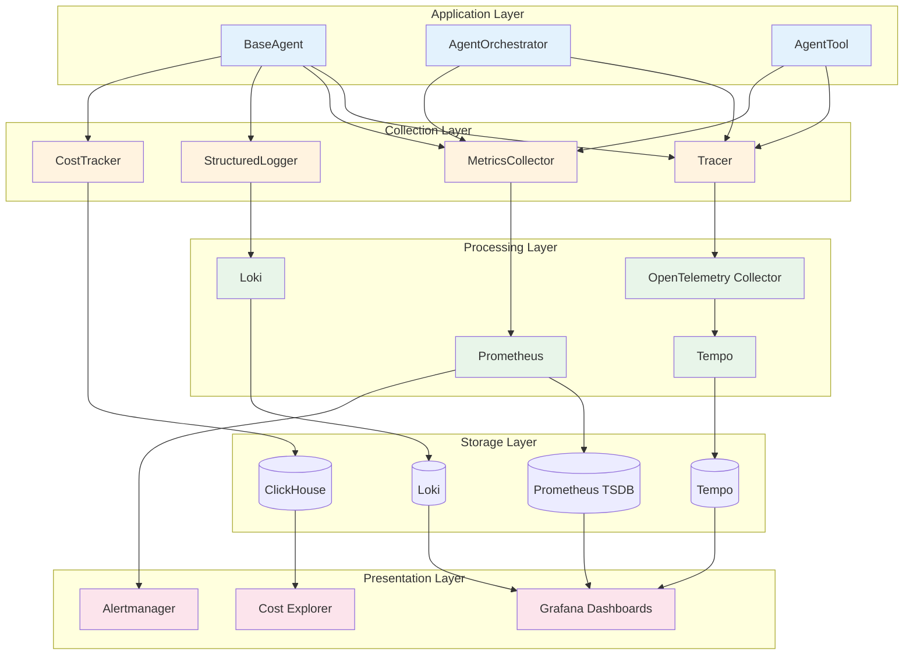

### 5.2 OpenTelemetry Tracing

```python
# src/grc_marketing_core/monitoring/tracing.py

from __future__ import annotations

import time
from contextlib import asynccontextmanager
from typing import Any, AsyncIterator

from opentelemetry import trace
from opentelemetry.exporter.otlp.proto.grpc.trace_exporter import OTLPSpanExporter
from opentelemetry.sdk.resources import Resource
from opentelemetry.sdk.trace import TracerProvider
from opentelemetry.sdk.trace.export import BatchSpanProcessor
from opentelemetry.trace import Status, StatusCode
from opentelemetry.semconv.resource import ResourceAttributes


class Tracer:
    """
    OpenTelemetry tracing wrapper.
    
    Provides:
    - Automatic span creation for agent lifecycle
    - Tool call tracing with input/output attributes
    - LLM call tracing with token counts
    - Inter-service trace propagation
    - Sampling configuration
    """

    def __init__(
        self,
        service_name: str,
        otlp_endpoint: str,
        sample_rate: float = 1.0,
    ) -> None:
        resource = Resource.create({
            ResourceAttributes.SERVICE_NAME: service_name,
            ResourceAttributes.SERVICE_VERSION: "1.0.0",
            ResourceAttributes.DEPLOYMENT_ENVIRONMENT: "production",
        })

        provider = TracerProvider(
            resource=resource,
            sampler=trace.trace_id_ratio_based(sample_rate),
        )

        exporter = OTLPSpanExporter(endpoint=otlp_endpoint)
        provider.add_span_processor(BatchSpanProcessor(exporter))

        trace.set_tracer_provider(provider)
        self._tracer = trace.get_tracer(service_name)

    @asynccontextmanager
    async def span(
        self,
        name: str,
        attributes: dict[str, Any] | None = None,
    ) -> AsyncIterator[trace.Span]:
        """Create a span context manager."""
        with self._tracer.start_as_current_span(name) as span:
            if attributes:
                for key, value in attributes.items():
                    span.set_attribute(key, value)
            try:
                yield span
            except Exception as e:
                span.set_status(Status(StatusCode.ERROR, str(e)))
                span.record_exception(e)
                raise

    def set_attribute(self, key: str, value: Any) -> None:
        """Set an attribute on the current span."""
        span = trace.get_current_span()
        if span:
            span.set_attribute(key, value)

    def record_exception(self, exception: Exception) -> None:
        """Record an exception on the current span."""
        span = trace.get_current_span()
        if span:
            span.record_exception(exception)

    def get_trace_id(self) -> str:
        """Get the current trace ID."""
        span = trace.get_current_span()
        if span:
            return format(span.get_span_context().trace_id, "032x")
        return ""
```

### 5.3 Prometheus Metrics

```python
# src/grc_marketing_core/monitoring/metrics.py

from __future__ import annotations

from typing import Any

from prometheus_client import (
    Counter,
    Gauge,
    Histogram,
    Summary,
    CollectorRegistry,
    push_to_gateway,
)


class MetricsCollector:
    """
    Prometheus metrics collector.
    
    Exposes:
    - Agent execution metrics (count, duration, success rate)
    - Tool call metrics (count, duration, error rate)
    - LLM call metrics (tokens, cost, latency)
    - Governance metrics (policy checks, violations, approvals)
    - Business metrics (campaigns created, leads scored, etc.)
    
    All metrics are tagged with agent_id, tenant_id, and tool_name.
    """

    def __init__(self, registry: CollectorRegistry | None = None) -> None:
        self._registry = registry or CollectorRegistry()

        # Agent metrics
        self.agent_executions = Counter(
            "grc_agent_executions_total",
            "Total agent executions",
            ["agent_id", "tenant_id", "status"],
            registry=self._registry,
        )
        self.agent_duration = Histogram(
            "grc_agent_duration_seconds",
            "Agent execution duration",
            ["agent_id", "tenant_id"],
            buckets=[0.1, 0.5, 1.0, 2.5, 5.0, 10.0, 30.0, 60.0, 120.0, 300.0],
            registry=self._registry,
        )
        self.agent_tokens = Counter(
            "grc_agent_tokens_total",
            "Total tokens consumed by agents",
            ["agent_id", "tenant_id", "model"],
            registry=self._registry,
        )
        self.agent_cost = Counter(
            "grc_agent_cost_usd_total",
            "Total cost in USD",
            ["agent_id", "tenant_id", "model"],
            registry=self._registry,
        )

        # Tool metrics
        self.tool_calls = Counter(
            "grc_tool_calls_total",
            "Total tool calls",
            ["tool_name", "agent_id", "status"],
            registry=self._registry,
        )
        self.tool_duration = Histogram(
            "grc_tool_duration_seconds",
            "Tool call duration",
            ["tool_name", "agent_id"],
            buckets=[0.01, 0.05, 0.1, 0.5, 1.0, 2.5, 5.0, 10.0],
            registry=self._registry,
        )

        # Governance metrics
        self.policy_checks = Counter(
            "grc_policy_checks_total",
            "Total policy checks",
            ["effect", "agent_id"],
            registry=self._registry,
        )
        self.policy_violations = Counter(
            "grc_policy_violations_total",
            "Total policy violations",
            ["agent_id", "rule_id"],
            registry=self._registry,
        )
        self.approvals_requested = Counter(
            "grc_approvals_requested_total",
            "Total approval requests",
            ["agent_id", "status"],
            registry=self._registry,
        )

        # LLM metrics
        self.llm_calls = Counter(
            "grc_llm_calls_total",
            "Total LLM API calls",
            ["model", "agent_id", "status"],
            registry=self._registry,
        )
        self.llm_latency = Histogram(
            "grc_llm_latency_seconds",
            "LLM API call latency",
            ["model", "agent_id"],
            buckets=[0.1, 0.5, 1.0, 2.5, 5.0, 10.0, 30.0, 60.0],
            registry=self._registry,
        )
        self.llm_tokens = Counter(
            "grc_llm_tokens_total",
            "Total LLM tokens",
            ["model", "agent_id", "token_type"],
            registry=self._registry,
        )

        # Business metrics
        self.campaigns_created = Counter(
            "grc_campaigns_created_total",
            "Total campaigns created",
            ["agent_id", "tenant_id"],
            registry=self._registry,
        )
        self.leads_scored = Counter(
            "grc_leads_scored_total",
            "Total leads scored",
            ["agent_id", "tenant_id"],
            registry=self._registry,
        )
        self.content_generated = Counter(
            "grc_content_generated_total",
            "Total content pieces generated",
            ["agent_id", "content_type"],
            registry=self._registry,
        )

        # Health metrics
        self.active_agents = Gauge(
            "grc_active_agents",
            "Number of currently active agents",
            ["tenant_id"],
            registry=self._registry,
        )
        self.queue_depth = Gauge(
            "grc_queue_depth",
            "Current task queue depth",
            ["agent_id"],
            registry=self._registry,
        )

    def increment(self, metric_name: str, value: float = 1, tags: dict[str, str] | None = None) -> None:
        """Increment a counter metric."""
        metric = getattr(self, metric_name, None)
        if metric and isinstance(metric, Counter):
            if tags:
                metric.labels(**tags).inc(value)
            else:
                metric.inc(value)

    def observe(self, metric_name: str, value: float, tags: dict[str, str] | None = None) -> None:
        """Observe a histogram/summary metric."""
        metric = getattr(self, metric_name, None)
        if metric and isinstance(metric, (Histogram, Summary)):
            if tags:
                metric.labels(**tags).observe(value)
            else:
                metric.observe(value)

    def set_gauge(self, metric_name: str, value: float, tags: dict[str, str] | None = None) -> None:
        """Set a gauge metric."""
        metric = getattr(self, metric_name, None)
        if metric and isinstance(metric, Gauge):
            if tags:
                metric.labels(**tags).set(value)
            else:
                metric.set(value)

    def push(self, gateway: str, job: str = "grc-marketing-core") -> None:
        """Push metrics to a Prometheus Pushgateway."""
        push_to_gateway(gateway, job=job, registry=self._registry)
```

### 5.4 Health Checks

```python
# src/grc_marketing_core/monitoring/health.py

from __future__ import annotations

import asyncio
from dataclasses import dataclass, field
from datetime import datetime, timezone
from enum import Enum
from typing import Any, Callable

import httpx


class HealthStatus(str, Enum):
    HEALTHY = "healthy"
    DEGRADED = "degraded"
    UNHEALTHY = "unhealthy"


@dataclass
class HealthCheckResult:
    name: str
    status: HealthStatus
    response_time_ms: float
    message: str = ""
    metadata: dict[str, Any] = field(default_factory=dict)
    timestamp: datetime = field(default_factory=lambda: datetime.now(timezone.utc))


class HealthChecker:
    """
    Comprehensive health check framework.
    
    Checks:
    - Liveness: Is the process running?
    - Readiness: Can the process serve traffic?
    - Dependencies: Are all dependent services reachable?
    - Resources: Are resource limits within bounds?
    
    Exposes results via HTTP endpoint for Kubernetes probes.
    """

    def __init__(self) -> None:
        self._checks: dict[str, Callable[[], HealthCheckResult]] = {}
        self._last_results: dict[str, HealthCheckResult] = {}

    def register(self, name: str, check: Callable[[], HealthCheckResult]) -> None:
        """Register a health check."""
        self._checks[name] = check

    async def check_all(self) -> dict[str, HealthCheckResult]:
        """Run all health checks concurrently."""
        tasks = {
            name: asyncio.create_task(self._run_check(name, check))
            for name, check in self._checks.items()
        }
        results = {}
        for name, task in tasks.items():
            try:
                results[name] = await asyncio.wait_for(task, timeout=5.0)
            except asyncio.TimeoutError:
                results[name] = HealthCheckResult(
                    name=name,
                    status=HealthStatus.UNHEALTHY,
                    response_time_ms=5000.0,
                    message="Health check timed out",
                )
        self._last_results = results
        return results

    async def _run_check(
        self,
        name: str,
        check: Callable[[], HealthCheckResult],
    ) -> HealthCheckResult:
        """Run a single health check with timing."""
        start = datetime.now(timezone.utc)
        try:
            result = check()
            elapsed = (datetime.now(timezone.utc) - start).total_seconds() * 1000
            result.response_time_ms = elapsed
            return result
        except Exception as e:
            elapsed = (datetime.now(timezone.utc) - start).total_seconds() * 1000
            return HealthCheckResult(
                name=name,
                status=HealthStatus.UNHEALTHY,
                response_time_ms=elapsed,
                message=str(e),
            )

    def get_overall_status(self) -> HealthStatus:
        """Get the overall health status."""
        if not self._last_results:
            return HealthStatus.UNHEALTHY

        statuses = [r.status for r in self._last_results.values()]
        if all(s == HealthStatus.HEALTHY for s in statuses):
            return HealthStatus.HEALTHY
        elif any(s == HealthStatus.UNHEALTHY for s in statuses):
            return HealthStatus.UNHEALTHY
        else:
            return HealthStatus.DEGRADED

    # Built-in checks

    async def check_prometheus(self, url: str) -> HealthCheckResult:
        """Check Prometheus connectivity."""
        try:
            async with httpx.AsyncClient() as client:
                response = await client.get(f"{url}/-/healthy", timeout=2.0)
                if response.status_code == 200:
                    return HealthCheckResult(
                        name="prometheus",
                        status=HealthStatus.HEALTHY,
                        response_time_ms=0,
                    )
                return HealthCheckResult(
                    name="prometheus",
                    status=HealthStatus.DEGRADED,
                    response_time_ms=0,
                    message=f"Status code: {response.status_code}",
                )
        except Exception as e:
            return HealthCheckResult(
                name="prometheus",
                status=HealthStatus.UNHEALTHY,
                response_time_ms=0,
                message=str(e),
            )

    async def check_kafka(self, bootstrap_servers: str) -> HealthCheckResult:
        """Check Kafka connectivity."""
        # Implementation: use aiokafka to check broker connectivity
        ...

    async def check_vault(self, url: str, token: str) -> HealthCheckResult:
        """Check HashiCorp Vault connectivity."""
        try:
            async with httpx.AsyncClient() as client:
                response = await client.get(
                    f"{url}/v1/sys/health",
                    headers={"X-Vault-Token": token},
                    timeout=2.0,
                )
                if response.status_code in (200, 429):
                    return HealthCheckResult(
                        name="vault",
                        status=HealthStatus.HEALTHY,
                        response_time_ms=0,
                    )
                return HealthCheckResult(
                    name="vault",
                    status=HealthStatus.DEGRADED,
                    response_time_ms=0,
                    message=f"Status code: {response.status_code}",
                )
        except Exception as e:
            return HealthCheckResult(
                name="vault",
                status=HealthStatus.UNHEALTHY,
                response_time_ms=0,
                message=str(e),
            )
```

### 5.5 Cost Tracking

```python
# src/grc_marketing_core/monitoring/cost.py

from __future__ import annotations

from dataclasses import dataclass, field
from datetime import datetime, timezone
from typing import Any

from grc_marketing_core.monitoring.metrics import MetricsCollector


# Model pricing per 1M tokens (USD)
MODEL_PRICING: dict[str, dict[str, float]] = {
    "gpt-4o": {"input": 2.50, "output": 10.00},
    "gpt-4o-mini": {"input": 0.15, "output": 0.60},
    "claude-sonnet-4": {"input": 3.00, "output": 15.00},
    "claude-haiku-4": {"input": 0.80, "output": 4.00},
    "gemini-2.5-pro": {"input": 1.25, "output": 10.00},
    "gemini-2.5-flash": {"input": 0.30, "output": 2.50},
}


@dataclass
class CostRecord:
    """A single cost record."""
    timestamp: datetime
    agent_id: str
    tenant_id: str
    model: str
    input_tokens: int
    output_tokens: int
    input_cost: float
    output_cost: float
    total_cost: float
    operation: str


class CostTracker:
    """
    Tracks and attributes LLM costs at the most granular level.
    
    Features:
    - Per-agent, per-tenant, per-model cost attribution
    - Real-time budget enforcement
    - Cost anomaly detection
    - Export to Prometheus and ClickHouse
    """

    def __init__(self, metrics: MetricsCollector) -> None:
        self._metrics = metrics
        self._records: list[CostRecord] = []
        self._budgets: dict[str, float] = {}  # tenant_id -> budget_usd

    def record(
        self,
        agent_id: str,
        tenant_id: str,
        model: str,
        input_tokens: int,
        output_tokens: int,
        operation: str,
    ) -> CostRecord:
        """Record a cost entry."""
        pricing = MODEL_PRICING.get(model, {"input": 0.0, "output": 0.0})
        input_cost = (input_tokens / 1_000_000) * pricing["input"]
        output_cost = (output_tokens / 1_000_000) * pricing["output"]
        total_cost = input_cost + output_cost

        record = CostRecord(
            timestamp=datetime.now(timezone.utc),
            agent_id=agent_id,
            tenant_id=tenant_id,
            model=model,
            input_tokens=input_tokens,
            output_tokens=output_tokens,
            input_cost=input_cost,
            output_cost=output_cost,
            total_cost=total_cost,
            operation=operation,
        )

        self._records.append(record)

        # Update metrics
        self._metrics.increment("agent_cost", value=total_cost, tags={
            "agent_id": agent_id,
            "tenant_id": tenant_id,
            "model": model,
        })
        self._metrics.increment("agent_tokens", value=input_tokens + output_tokens, tags={
            "agent_id": agent_id,
            "tenant_id": tenant_id,
            "model": model,
        })

        return record

    def set_budget(self, tenant_id: str, budget_usd: float) -> None:
        """Set a monthly budget for a tenant."""
        self._budgets[tenant_id] = budget_usd

    def get_spend(self, tenant_id: str, model: str | None = None) -> float:
        """Get total spend for a tenant, optionally filtered by model."""
        return sum(
            r.total_cost for r in self._records
            if r.tenant_id == tenant_id
            and (model is None or r.model == model)
        )

    def check_budget(self, tenant_id: str) -> tuple[bool, float, float]:
        """
        Check if a tenant is within budget.
        Returns (within_budget, current_spend, budget).
        """
        budget = self._budgets.get(tenant_id, float("inf"))
        spend = self.get_spend(tenant_id)
        return (spend <= budget, spend, budget)
```

---

## 6. Security

### 6.1 Architecture

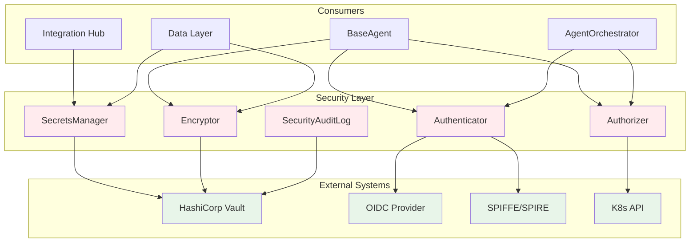

### 6.2 Authentication

```python
# src/grc_marketing_core/security/auth.py

from __future__ import annotations

import time
from abc import ABC, abstractmethod
from dataclasses import dataclass
from enum import Enum
from typing import Any

import httpx
import jwt
from pydantic import BaseModel, Field


class AuthMethod(str, Enum):
    OAUTH2 = "oauth2"
    MTLS = "mtls"
    SPIFFE = "spiffe"
    API_KEY = "api_key"
    JWT = "jwt"


class TokenClaims(BaseModel):
    """Standard token claims."""
    sub: str
    iss: str
    aud: str
    exp: int
    iat: int
    agent_id: str | None = None
    tenant_id: str | None = None
    capabilities: list[str] = Field(default_factory=list)
    roles: list[str] = Field(default_factory=list)


@dataclass
class AuthToken:
    """An authentication token."""
    access_token: str
    token_type: str = "Bearer"
    expires_in: int = 900
    refresh_token: str | None = None
    scope: str | None = None
    obtained_at: float = 0.0

    def __post_init__(self) -> None:
        if self.obtained_at == 0.0:
            self.obtained_at = time.time()

    @property
    def is_expired(self) -> bool:
        return time.time() > (self.obtained_at + self.expires_in - 60)  # 60s buffer


class Authenticator(ABC):
    """Base class for authentication providers."""

    @abstractmethod
    async def authenticate(self, credentials: dict[str, Any]) -> AuthToken:
        ...

    @abstractmethod
    async def refresh(self, token: AuthToken) -> AuthToken:
        ...

    @abstractmethod
    async def validate(self, token: str) -> TokenClaims:
        ...


class OAuth2Authenticator(Authenticator):
    """
    OAuth 2.0 / OIDC authentication.
    
    Supports:
    - Client credentials flow (service-to-service)
    - Authorization code flow (human users)
    - Token refresh
    - Token introspection
    """

    def __init__(
        self,
        token_url: str,
        client_id: str,
        client_secret: str,
        scopes: list[str] | None = None,
    ) -> None:
        self._token_url = token_url
        self._client_id = client_id
        self._client_secret = client_secret
        self._scopes = scopes or []
        self._token: AuthToken | None = None

    async def authenticate(self, credentials: dict[str, Any] | None = None) -> AuthToken:
        """Authenticate using client credentials."""
        async with httpx.AsyncClient() as client:
            response = await client.post(
                self._token_url,
                data={
                    "grant_type": "client_credentials",
                    "client_id": self._client_id,
                    "client_secret": self._client_secret,
                    "scope": " ".join(self._scopes),
                },
            )
            response.raise_for_status()
            data = response.json()
            self._token = AuthToken(
                access_token=data["access_token"],
                token_type=data.get("token_type", "Bearer"),
                expires_in=data.get("expires_in", 900),
                refresh_token=data.get("refresh_token"),
                scope=data.get("scope"),
            )
            return self._token

    async def refresh(self, token: AuthToken) -> AuthToken:
        """Refresh an expired token."""
        if not token.refresh_token:
            raise ValueError("No refresh token available")

        async with httpx.AsyncClient() as client:
            response = await client.post(
                self._token_url,
                data={
                    "grant_type": "refresh_token",
                    "refresh_token": token.refresh_token,
                    "client_id": self._client_id,
                    "client_secret": self._client_secret,
                },
            )
            response.raise_for_status()
            data = response.json()
            self._token = AuthToken(
                access_token=data["access_token"],
                token_type=data.get("token_type", "Bearer"),
                expires_in=data.get("expires_in", 900),
                refresh_token=data.get("refresh_token", token.refresh_token),
                scope=data.get("scope"),
            )
            return self._token

    async def validate(self, token: str) -> TokenClaims:
        """Validate a JWT token."""
        # In production, fetch JWKS from the OIDC provider
        claims = jwt.decode(token, options={"verify_signature": False})
        return TokenClaims(**claims)

    async def get_agent_token(self, agent_id: str) -> str:
        """Get a valid token for an agent, refreshing if necessary."""
        if self._token is None or self._token.is_expired:
            if self._token and self._token.refresh_token:
                self._token = await self.refresh(self._token)
            else:
                self._token = await self.authenticate()
        return self._token.access_token


class SPIFFEAuthenticator(Authenticator):
    """
    SPIFFE/SPIRE workload identity authentication.
    
    Uses the SPIFFE Workload API to obtain SVIDs.
    """

    def __init__(self, spiffe_socket_path: str) -> None:
        self._socket_path = spiffe_socket_path

    async def authenticate(self, credentials: dict[str, Any] | None = None) -> AuthToken:
        # Implementation: use spiffe-workload-api to fetch SVID
        ...

    async def refresh(self, token: AuthToken) -> AuthToken:
        ...

    async def validate(self, token: str) -> TokenClaims:
        ...
```

### 6.3 Authorization

```python
# src/grc_marketing_core/security/authorization.py

from __future__ import annotations

from dataclasses import dataclass, field
from enum import Enum
from typing import Any

from pydantic import BaseModel, Field

from grc_marketing_core.security.auth import TokenClaims


class Permission(str, Enum):
    READ = "read"
    WRITE = "write"
    DELETE = "delete"
    EXECUTE = "execute"
    ADMIN = "admin"


class ResourceType(str, Enum):
    CAMPAIGN = "campaign"
    CUSTOMER = "customer"
    CONTENT = "content"
    ANALYTICS = "analytics"
    AGENT = "agent"
    TENANT = "tenant"


@dataclass
class AccessRequest:
    subject: str
    resource: str
    action: Permission
    tenant_id: str
    context: dict[str, Any] = field(default_factory=dict)


@dataclass
class AccessDecision:
    allowed: bool
    reason: str
    obligations: list[str] = field(default_factory=list)


class Authorizer:
    """
    Policy-Based Access Control (PBAC) with RBAC foundation.
    
    Evaluates access requests against policies that consider:
    - Subject identity and roles
    - Resource type and ownership
    - Action being requested
    - Contextual conditions (time, location, data classification)
    - Tenant isolation
    """

    def __init__(self, policy_engine_url: str) -> None:
        self._policy_engine_url = policy_engine_url

    async def check_permission(
        self,
        token: str,
        resource: str,
        action: str,
        context: dict[str, Any] | None = None,
    ) -> AccessDecision:
        """
        Check if the token holder has permission to perform the action.
        """
        # Decode token to get claims
        # In production, validate signature first
        import jwt
        claims = jwt.decode(token, options={"verify_signature": False})

        request = AccessRequest(
            subject=claims.get("sub", ""),
            resource=resource,
            action=Permission(action),
            tenant_id=claims.get("tenant_id", "default"),
            context=context or {},
        )

        return await self._evaluate(request)

    async def _evaluate(self, request: AccessRequest) -> AccessDecision:
        """Evaluate the access request against policies."""
        # Check tenant isolation
        # Check role-based permissions
        # Check capability-based permissions
        # Check contextual conditions
        # Return decision

        # Simplified implementation
        return AccessDecision(
            allowed=True,
            reason="Access granted based on role and capabilities",
        )

    async def check_tenant_isolation(
        self,
        subject_tenant: str,
        resource_tenant: str,
    ) -> bool:
        """Verify that subject and resource belong to the same tenant."""
        return subject_tenant == resource_tenant
```

### 6.4 Encryption

```python
# src/grc_marketing_core/security/encryption.py

from __future__ import annotations

import base64
import os
from dataclasses import dataclass
from typing import Any

from cryptography.fernet import Fernet
from cryptography.hazmat.primitives import hashes, serialization
from cryptography.hazmat.primitives.asymmetric import padding, rsa
from cryptography.hazmat.primitives.ciphers.aead import AESGCM
from pydantic import BaseModel


class EncryptedField(BaseModel):
    """Represents an encrypted field."""
    ciphertext: str
    algorithm: str
    key_id: str
    iv: str | None = None


class Encryptor:
    """
    Field-level encryption for sensitive data.
    
    Supports:
    - AES-256-GCM for symmetric encryption
    - RSA-4096 for asymmetric encryption
    - Envelope encryption (data key encrypted by master key)
    - Key rotation
    - Searchable encryption (deterministic for exact match)
    """

    def __init__(self, master_key: bytes) -> None:
        self._master_key = master_key
        self._data_keys: dict[str, bytes] = {}

    def generate_data_key(self) -> tuple[str, bytes]:
        """Generate a new data encryption key."""
        key_id = base64.urlsafe_b64encode(os.urandom(16)).decode()
        data_key = AESGCM.generate_key(bit_length=256)
        self._data_keys[key_id] = data_key
        return key_id, data_key

    def encrypt(self, plaintext: str, key_id: str | None = None) -> EncryptedField:
        """Encrypt a plaintext string."""
        if key_id is None:
            key_id, data_key = self.generate_data_key()
        else:
            data_key = self._data_keys.get(key_id)
            if data_key is None:
                raise ValueError(f"Unknown key ID: {key_id}")

        aesgcm = AESGCM(data_key)
        iv = os.urandom(12)
        ciphertext = aesgcm.encrypt(iv, plaintext.encode(), None)

        return EncryptedField(
            ciphertext=base64.b64encode(ciphertext).decode(),
            algorithm="AES-256-GCM",
            key_id=key_id,
            iv=base64.b64encode(iv).decode(),
        )

    def decrypt(self, field: EncryptedField) -> str:
        """Decrypt an encrypted field."""
        data_key = self._data_keys.get(field.key_id)
        if data_key is None:
            raise ValueError(f"Unknown key ID: {field.key_id}")

        aesgcm = AESGCM(data_key)
        iv = base64.b64decode(field.iv)
        ciphertext = base64.b64decode(field.ciphertext)
        plaintext = aesgcm.decrypt(iv, ciphertext, None)
        return plaintext.decode()

    def encrypt_deterministic(self, plaintext: str, key_id: str) -> str:
        """
        Deterministic encryption for searchable fields.
        Same plaintext always produces same ciphertext.
        """
        data_key = self._data_keys.get(key_id)
        if data_key is None:
            raise ValueError(f"Unknown key ID: {key_id}")

        # Use a fixed IV for deterministic encryption
        # This is less secure but necessary for searchability
        aesgcm = AESGCM(data_key)
        iv = b"\x00" * 12
        ciphertext = aesgcm.encrypt(iv, plaintext.encode(), None)
        return base64.b64encode(ciphertext).decode()

    def rotate_key(self, old_key_id: str, new_key_id: str, encrypted_data: EncryptedField) -> EncryptedField:
        """Re-encrypt data with a new key."""
        plaintext = self.decrypt(encrypted_data)
        return self.encrypt(plaintext, new_key_id)
```

### 6.5 Secrets Management

```python
# src/grc_marketing_core/security/secrets.py

from __future__ import annotations

import os
from abc import ABC, abstractmethod
from dataclasses import dataclass
from typing import Any

import httpx
from pydantic import BaseModel, SecretStr


class SecretValue(BaseModel):
    """A secret value with metadata."""
    key: str
    value: SecretStr
    version: int = 1
    metadata: dict[str, Any] | None = None


class SecretsManager(ABC):
    """Base class for secrets management providers."""

    @abstractmethod
    async def get_secret(self, key: str) -> SecretValue: ...

    @abstractmethod
    async def put_secret(self, key: str, value: str, metadata: dict[str, Any] | None = None) -> None: ...

    @abstractmethod
    async def delete_secret(self, key: str) -> None: ...

    @abstractmethod
    async def list_secrets(self, prefix: str | None = None) -> list[str]: ...


class VaultSecretsManager(SecretsManager):
    """
    HashiCorp Vault secrets management.
    
    Features:
    - Dynamic secrets (database credentials, cloud IAM)
    - Versioned secrets
    - Secret rotation
    - Lease renewal
    - Per-tenant secret paths
    """

    def __init__(
        self,
        vault_url: str,
        vault_token: str,
        mount_point: str = "secret",
    ) -> None:
        self._vault_url = vault_url
        self._vault_token = vault_token
        self._mount_point = mount_point

    async def get_secret(self, key: str) -> SecretValue:
        """Read a secret from Vault."""
        async with httpx.AsyncClient() as client:
            response = await client.get(
                f"{self._vault_url}/v1/{self._mount_point}/data/{key}",
                headers={"X-Vault-Token": self._vault_token},
            )
            response.raise_for_status()
            data = response.json()["data"]
            return SecretValue(
                key=key,
                value=SecretStr(data["data"]["value"]),
                version=data["metadata"]["version"],
                metadata=data["metadata"],
            )

    async def put_secret(self, key: str, value: str, metadata: dict[str, Any] | None = None) -> None:
        """Write a secret to Vault."""
        async with httpx.AsyncClient() as client:
            response = await client.post(
                f"{self._vault_url}/v1/{self._mount_point}/data/{key}",
                headers={"X-Vault-Token": self._vault_token},
                json={
                    "data": {"value": value},
                    "options": {"metadata": metadata or {}},
                },
            )
            response.raise_for_status()

    async def delete_secret(self, key: str) -> None:
        """Delete a secret from Vault."""
        async with httpx.AsyncClient() as client:
            response = await client.delete(
                f"{self._vault_url}/v1/{self._mount_point}/metadata/{key}",
                headers={"X-Vault-Token": self._vault_token},
            )
            response.raise_for_status()

    async def list_secrets(self, prefix: str | None = None) -> list[str]:
        """List secrets under a prefix."""
        path = f"{self._mount_point}/metadata/{prefix or ''}"
        async with httpx.AsyncClient() as client:
            response = await client.get(
                f"{self._vault_url}/v1/{path}?list=true",
                headers={"X-Vault-Token": self._vault_token},
            )
            response.raise_for_status()
            return response.json()["data"]["keys"]


class AWSSecretsManager(SecretsManager):
    """AWS Secrets Manager implementation."""
    # Implementation using boto3
    ...


class EnvironmentSecretsManager(SecretsManager):
    """
    Environment variable secrets manager.
    For development and testing only.
    """

    def __init__(self, prefix: str = "GRC_") -> None:
        self._prefix = prefix

    async def get_secret(self, key: str) -> SecretValue:
        env_key = f"{self._prefix}{key.upper()}"
        value = os.environ.get(env_key)
        if value is None:
            raise KeyError(f"Secret not found: {key}")
        return SecretValue(key=key, value=SecretStr(value))

    async def put_secret(self, key: str, value: str, metadata: dict[str, Any] | None = None) -> None:
        env_key = f"{self._prefix}{key.upper()}"
        os.environ[env_key] = value

    async def delete_secret(self, key: str) -> None:
        env_key = f"{self._prefix}{key.upper()}"
        os.environ.pop(env_key, None)

    async def list_secrets(self, prefix: str | None = None) -> list[str]:
        search_prefix = f"{self._prefix}{(prefix or '').upper()}"
        return [
            k[len(self._prefix):].lower()
            for k in os.environ
            if k.startswith(search_prefix)
        ]
```

---

## 7. Data Layer

### 7.1 Architecture

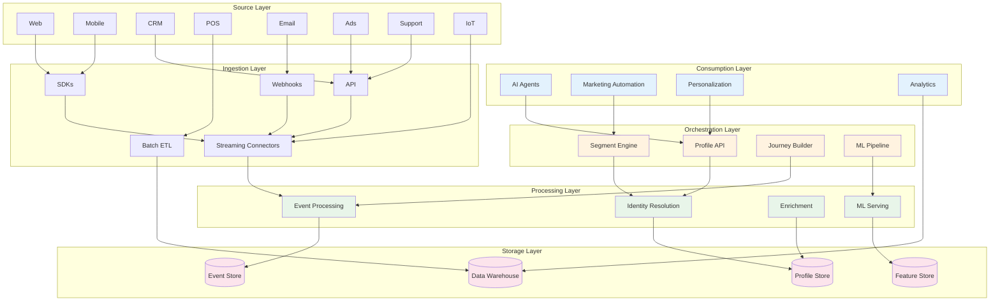

### 7.2 CDP Integration

```python
# src/grc_marketing_core/data/cdp.py

from __future__ import annotations

from abc import ABC, abstractmethod
from dataclasses import dataclass, field
from datetime import datetime
from enum import Enum
from typing import Any, AsyncIterator

import httpx
from pydantic import BaseModel, Field


class EventType(str, Enum):
    PAGE_VIEW = "page_view"
    CLICK = "click"
    FORM_SUBMIT = "form_submit"
    PURCHASE = "purchase"
    EMAIL_OPEN = "email_open"
    EMAIL_CLICK = "email_CLICK"
    AD_IMPRESSION = "ad_impression"
    AD_CLICK = "ad_custom"
    CAMPAIGN_ENGAGEMENT = "campaign_engagement"
    LEAD_CREATED = "lead_created"
    OPPORTUNITY_CREATED = "opportunity_created"
    CUSTOM = "custom"


class CustomerEvent(BaseModel):
    """A customer event."""
    event_id: str
    event_type: EventType
    timestamp: datetime
    customer_id: str | None = None
    anonymous_id: str | None = None
    properties: dict[str, Any] = Field(default_factory=dict)
    context: dict[str, Any] = Field(default_factory=dict)


class CustomerProfile(BaseModel):
    """A unified customer profile."""
    profile_id: str
    tenant_id: str
    email: str | None = None
    phone: str | None = None
    first_name: str | None = None
    last_name: str | None = None
    company: str | None = None
    traits: dict[str, Any] = Field(default_factory=dict)
    segments: list[str] = Field(default_factory=list)
    consent: dict[str, bool] = Field(default_factory=dict)
    created_at: datetime = Field(default_factory=datetime.utcnow)
    updated_at: datetime = Field(default_factory=datetime.utcnow)


class CDPClient(ABC):
    """Base class for CDP integrations."""

    @abstractmethod
    async def track(self, event: CustomerEvent) -> None: ...

    @abstractmethod
    async def identify(self, customer_id: str, traits: dict[str, Any]) -> None: ...

    @abstractmethod
    async def get_profile(self, customer_id: str) -> CustomerProfile: ...

    @abstractmethod
    async def update_profile(self, customer_id: str, traits: dict[str, Any]) -> None: ...

    @abstractmethod
    async def get_segments(self, customer_id: str) -> list[str]: ...

    @abstractmethod
    async def query_events(
        self,
        customer_id: str,
        event_types: list[EventType] | None = None,
        start_time: datetime | None = None,
        end_time: datetime | None = None,
    ) -> AsyncIterator[CustomerEvent]: ...


class SegmentCDPClient(CDPClient):
    """Segment CDP implementation."""

    def __init__(self, write_key: str, api_url: str = "https://api.segment.io/v1") -> None:
        self._write_key = write_key
        self._api_url = api_url

    async def track(self, event: CustomerEvent) -> None:
        async with httpx.AsyncClient() as client:
            await client.post(
                f"{self._api_url}/track",
                auth=(self._write_key, ""),
                json={
                    "event": event.event_type.value,
                    "userId": event.customer_id,
                    "anonymousId": event.anonymous_id,
                    "properties": event.properties,
                    "context": event.context,
                    "timestamp": event.timestamp.isoformat(),
                },
            )

    async def identify(self, customer_id: str, traits: dict[str, Any]) -> None:
        async with httpx.AsyncClient() as client:
            await client.post(
                f"{self._api_url}/identify",
                auth=(self._write_key, ""),
                json={
                    "userId": customer_id,
                    "traits": traits,
                },
            )

    async def get_profile(self, customer_id: str) -> CustomerProfile:
        # Segment doesn't have a direct profile API; use Persona or Profile API
        ...

    async def update_profile(self, customer_id: str, traits: dict[str, Any]) -> None:
        await self.identify(customer_id, traits)

    async def get_segments(self, customer_id: str) -> list[str]:
        ...

    async def query_events(self, customer_id: str, **kwargs) -> AsyncIterator[CustomerEvent]:
        ...


class RudderstackCDPClient(CDPClient):
    """Rudderstack CDP implementation."""
    # Similar structure to Segment
    ...


class CustomCDPClient(CDPClient):
    """Custom CDP implementation for proprietary platforms."""
    # Implementation for custom CDP
    ...
```

### 7.3 Identity Resolution

```python
# src/grc_marketing_core/data/identity_resolution.py

from __future__ import annotations

from abc import ABC, abstractmethod
from dataclasses import dataclass, field
from enum import Enum
from typing import Any

from pydantic import BaseModel, Field


class MatchConfidence(str, Enum):
    EXACT = "exact"           # Deterministic match on unique identifier
    HIGH = "high"             # Multiple strong signals match
    MEDIUM = "medium"         # Some signals match
    LOW = "low"               # Weak signals match
    NONE = "none"             # No match


class IdentityEdge(BaseModel):
    """An edge in the identity graph."""
    source_id: str
    target_id: str
    match_type: str
    confidence: MatchConfidence
    signals: list[str] = Field(default_factory=list)
    created_at: str = Field(default_factory=lambda: __import__("datetime").datetime.utcnow().isoformat())


class UnifiedIdentity(BaseModel):
    """A unified identity with all linked identifiers."""
    person_id: str
    tenant_id: str
    identifiers: dict[str, list[str]] = Field(default_factory=dict)
    # identifiers: {"email": ["a@b.com"], "phone": ["+1234"], "cookie": ["abc123"]}
    edges: list[IdentityEdge] = Field(default_factory=list)
    confidence: MatchConfidence = MatchConfidence.NONE
    merged_from: list[str] = Field(default_factory=list)


class IdentityResolver(ABC):
    """Base class for identity resolution engines."""

    @abstractmethod
    async def resolve(
        self,
        identifiers: dict[str, str],
        tenant_id: str,
    ) -> UnifiedIdentity: ...

    @abstractmethod
    async def merge(self, person_id: str, new_identifiers: dict[str, str]) -> UnifiedIdentity: ...

    @abstractmethod
    async def unmerge(self, person_id: str, identifiers: dict[str, str]) -> UnifiedIdentity: ...

    @abstractmethod
    async def get_identity(self, person_id: str) -> UnifiedIdentity: ...


class GraphIdentityResolver(IdentityResolver):
    """
    Graph-based identity resolution using Neo4j.
    
    Uses a graph database to store and query identity relationships.
    Supports:
    - Deterministic matching (exact identifier match)
    - Probabilistic matching (fuzzy matching on multiple signals)
    - Transitive closure (A=B, B=C → A=C)
    - Conflict resolution (when merges create contradictions)
    """

    def __init__(self, neo4j_uri: str, username: str, password: str) -> None:
        from neo4j import AsyncGraphDatabase
        self._driver = AsyncGraphDatabase.driver(neo4j_uri, auth=(username, password))

    async def resolve(
        self,
        identifiers: dict[str, str],
        tenant_id: str,
    ) -> UnifiedIdentity:
        """
        Resolve identifiers to a unified identity.
        
        Algorithm:
        1. Look for exact matches on any identifier
        2. If found, return the existing person
        3. If not found, check for probabilistic matches
        4. If still not found, create a new person
        """
        # Step 1: Exact match
        for id_type, id_value in identifiers.items():
            person = await self._find_exact_match(id_type, id_value, tenant_id)
            if person:
                # Add new identifiers to existing person
                await self._add_identifiers(person.person_id, identifiers)
                return await self.get_identity(person.person_id)

        # Step 2: Probabilistic match
        candidates = await self._find_probabilistic_matches(identifiers, tenant_id)
        if candidates:
            best = max(candidates, key=lambda c: c.confidence)
            if best.confidence in (MatchConfidence.HIGH, MatchConfidence.EXACT):
                await self._add_identifiers(best.person_id, identifiers)
                return await self.get_identity(best.person_id)

        # Step 3: Create new person
        return await self._create_person(identifiers, tenant_id)

    async def _find_exact_match(
        self,
        id_type: str,
        id_value: str,
        tenant_id: str,
    ) -> UnifiedIdentity | None:
        """Find an exact match on a single identifier."""
        query = """
        MATCH (p:Person {tenant_id: $tenant_id})-[:HAS_IDENTIFIER]->(i:Identifier {type: $id_type, value: $id_value})
        RETURN p.person_id AS person_id
        LIMIT 1
        """
        async with self._driver.session() as session:
            result = await session.run(query, tenant_id=tenant_id, id_type=id_type, id_value=id_value)
            record = await result.single()
            if record:
                return await self.get_identity(record["person_id"])
            return None

    async def _find_probabilistic_matches(
        self,
        identifiers: dict[str, str],
        tenant_id: str,
    ) -> list[UnifiedIdentity]:
        """Find probabilistic matches based on multiple signals."""
        # Implementation: score candidates based on signal strength
        ...

    async def _create_person(
        self,
        identifiers: dict[str, str],
        tenant_id: str,
    ) -> UnifiedIdentity:
        """Create a new person with the given identifiers."""
        import uuid
        person_id = str(uuid.uuid4())
        # Create person node and identifier nodes in Neo4j
        ...

    async def _add_identifiers(
        self,
        person_id: str,
        identifiers: dict[str, str],
    ) -> None:
        """Add new identifiers to an existing person."""
        ...

    async def merge(self, person_id: str, new_identifiers: dict[str, str]) -> UnifiedIdentity:
        """Merge new identifiers into an existing person."""
        ...

    async def unmerge(self, person_id: str, identifiers: dict[str, str]) -> UnifiedIdentity:
        """Remove identifiers from a person (split)."""
        ...

    async def get_identity(self, person_id: str) -> UnifiedIdentity:
        """Get the full identity for a person."""
        ...
```

### 7.4 Event Streaming

```python
# src/grc_marketing_core/data/events.py

from __future__ import annotations

import json
from abc import ABC, abstractmethod
from dataclasses import dataclass
from datetime import datetime, timezone
from typing import Any, AsyncIterator, Callable

from pydantic import BaseModel, Field

from grc_marketing_core.data.cdp import CustomerEvent, EventType


class EventEnvelope(BaseModel):
    """Standard event envelope for all events."""
    event_id: str
    event_type: str
    source: str
    timestamp: datetime
    payload: dict[str, Any]
    metadata: dict[str, Any] = Field(default_factory=dict)
    trace_id: str | None = None
    tenant_id: str | None = None


class EventStreamer(ABC):
    """Base class for event streaming."""

    @abstractmethod
    async def publish(self, event: EventEnvelope) -> None: ...

    @abstractmethod
    async def subscribe(
        self,
        event_types: list[str],
        handler: Callable[[EventEnvelope], Any],
    ) -> None: ...

    @abstractmethod
    async def consume(
        self,
        event_types: list[str],
        group_id: str,
    ) -> AsyncIterator[EventEnvelope]: ...


class KafkaEventStreamer(EventStreamer):
    """
    Apache Kafka event streaming.
    
    Features:
    - Partitioned by tenant_id for ordering
    - Consumer groups for scalable processing
    - Dead letter queues for failed events
    - Schema registry integration
    - Exactly-once semantics
    """

    def __init__(
        self,
        bootstrap_servers: str,
        topic_prefix: str = "grc.marketing",
        schema_registry_url: str | None = None,
    ) -> None:
        self._bootstrap_servers = bootstrap_servers
        self._topic_prefix = topic_prefix
        self._schema_registry_url = schema_registry_url

    def _get_topic(self, event_type: str) -> str:
        return f"{self._topic_prefix}.{event_type}"

    async def publish(self, event: EventEnvelope) -> None:
        """Publish an event to Kafka."""
        from aiokafka import AIOKafkaProducer

        producer = AIOKafkaProducer(
            bootstrap_servers=self._bootstrap_servers,
            value_serializer=lambda v: json.dumps(v, default=str).encode("utf-8"),
            key_serializer=lambda k: k.encode("utf-8") if k else None,
        )
        await producer.start()
        try:
            topic = self._get_topic(event.event_type)
            await producer.send(
                topic,
                key=event.tenant_id,
                value=event.model_dump(mode="json"),
            )
        finally:
            await producer.stop()

    async def subscribe(
        self,
        event_types: list[str],
        handler: Callable[[EventEnvelope], Any],
    ) -> None:
        """Subscribe to events with a handler."""
        from aiokafka import AIOKafkaConsumer

        topics = [self._get_topic(et) for et in event_types]
        consumer = AIOKafkaConsumer(
            *topics,
            bootstrap_servers=self._bootstrap_servers,
            group_id="grc-marketing-core",
            value_deserializer=lambda v: json.loads(v.decode("utf-8")),
        )
        await consumer.start()
        try:
            async for msg in consumer:
                event = EventEnvelope(**msg.value)
                await handler(event)
        finally:
            await consumer.stop()

    async def consume(
        self,
        event_types: list[str],
        group_id: str,
    ) -> AsyncIterator[EventEnvelope]:
        """Consume events as an async iterator."""
        from aiokafka import AIOKafkaConsumer

        topics = [self._get_topic(et) for et in event_types]
        consumer = AIOKafkaConsumer(
            *topics,
            bootstrap_servers=self._bootstrap_servers,
            group_id=group_id,
            value_deserializer=lambda v: json.loads(v.decode("utf-8")),
        )
        await consumer.start()
        try:
            async for msg in consumer:
                yield EventEnvelope(**msg.value)
        finally:
            await consumer.stop()


class RedpandaEventStreamer(EventStreamer):
    """Redpanda event streaming (Kafka-compatible)."""
    # Same interface as KafkaEventStreamer
    ...
```

---

## 8. Integration Hub

### 8.1 Architecture

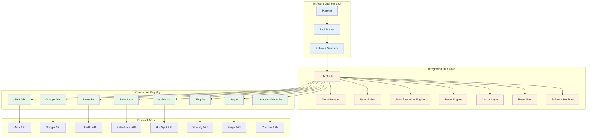

### 8.2 Connector Framework

```python
# src/grc_marketing_core/integration/connector.py

from __future__ import annotations

from abc import ABC, abstractmethod
from dataclasses import dataclass, field
from enum import Enum
from typing import Any, Type

from pydantic import BaseModel, Field


class ConnectorProtocol(str, Enum):
    REST = "rest"
    GRAPHQL = "graphql"
    GRPC = "grpc"
    SOAP = "soap"
    WEBHOOK = "webhook"
    SSE = "sse"


class AuthType(str, Enum):
    OAUTH1 = "oauth1"
    OAUTH2 = "oauth2"
    API_KEY = "api_key"
    JWT = "jwt"
    MTLS = "mtls"
    CUSTOM = "custom"


class RateLimitConfig(BaseModel):
    """Rate limit configuration for a connector."""
    requests_per_second: float = 10.0
    requests_per_minute: float = 100.0
    burst_size: int = 20
    retry_after_header: str = "Retry-After"


class ConnectorConfig(BaseModel):
    """Configuration for a connector."""
    name: str
    protocol: ConnectorProtocol
    base_url: str
    auth_type: AuthType
    auth_config: dict[str, Any] = Field(default_factory=dict)
    rate_limit: RateLimitConfig = Field(default_factory=RateLimitConfig)
    timeout_seconds: float = 30.0
    max_retries: int = 3
    retry_backoff: float = 1.0
    cache_ttl_seconds: int = 300
    headers: dict[str, str] = Field(default_factory=dict)


@dataclass
class ConnectorResponse:
    """Standard response from a connector."""
    success: bool
    status_code: int
    data: Any = None
    error: str | None = None
    headers: dict[str, str] = field(default_factory=dict)
    rate_limit_remaining: int | None = None
    rate_limit_reset: int | None = None
    cached: bool = False
    duration_ms: float = 0.0


class BaseConnector(ABC):
    """
    Base class for all connectors.
    
    Every connector implements:
    - Authentication (OAuth2, API key, mTLS, etc.)
    - Request execution with retry and rate limiting
    - Response transformation
    - Error handling
    - Caching
    - Health checking
    """

    def __init__(self, config: ConnectorConfig) -> None:
        self._config = config
        self._session: Any = None

    @property
    def name(self) -> str:
        return self._config.name

    @abstractmethod
    async def authenticate(self) -> None:
        """Authenticate with the external API."""
        ...

    @abstractmethod
    async def execute(
        self,
        method: str,
        path: str,
        params: dict[str, Any] | None = None,
        data: dict[str, Any] | None = None,
        headers: dict[str, str] | None = None,
    ) -> ConnectorResponse:
        """Execute a request against the external API."""
        ...

    @abstractmethod
    async def health_check(self) -> bool:
        """Check if the connector is healthy."""
        ...

    async def get(self, path: str, **kwargs) -> ConnectorResponse:
        return await self.execute("GET", path, **kwargs)

    async def post(self, path: str, **kwargs) -> ConnectorResponse:
        return await self.execute("POST", path, **kwargs)

    async def put(self, path: str, **kwargs) -> ConnectorResponse:
        return await self.execute("PUT", path, **kwargs)

    async def delete(self, path: str, **kwargs) -> ConnectorResponse:
        return await self.execute("DELETE", path, **kwargs)


class ConnectorRegistry:
    """
    Global registry for all connectors.
    
    Supports:
    - Registration by name or capability
    - Discovery by protocol or auth type
    - Hot-reloading in development
    - Health monitoring
    """

    def __init__(self) -> None:
        self._connectors: dict[str, BaseConnector] = {}
        self._capabilities: dict[str, list[str]] = {}

    def register(
        self,
        connector: BaseConnector,
        capabilities: list[str] | None = None,
    ) -> None:
        """Register a connector with optional capability tags."""
        self._connectors[connector.name] = connector
        for cap in (capabilities or [connector.name]):
            self._capabilities.setdefault(cap, []).append(connector.name)

    def get(self, name: str) -> BaseConnector:
        """Get a connector by name."""
        if name not in self._connectors:
            raise KeyError(f"Connector not found: {name}")
        return self._connectors[name]

    def find_by_capability(self, capability: str) -> list[BaseConnector]:
        """Find all connectors that provide a given capability."""
        names = self._capabilities.get(capability, [])
        return [self._connectors[n] for n in names if n in self._connectors]

    def list_connectors(self) -> list[str]:
        """List all registered connector names."""
        return list(self._connectors.keys())
```

### 8.3 MCP Support

```python
# src/grc_marketing_core/integration/mcp.py

from __future__ import annotations

from abc import ABC, abstractmethod
from dataclasses import dataclass, field
from typing import Any

from pydantic import BaseModel, Field


class MCPTool(BaseModel):
    """An MCP tool definition."""
    name: str
    description: str
    input_schema: dict[str, Any] = Field(default_factory=dict)
    output_schema: dict[str, Any] | None = None


class MCPResource(BaseModel):
    """An MCP resource definition."""
    uri: str
    name: str
    description: str | None = None
    mime_type: str | None = None


class MCPPrompt(BaseModel):
    """An MCP prompt definition."""
    name: str
    description: str | None = None
    arguments: list[dict[str, Any]] = Field(default_factory=list)


class MCPClient:
    """
    Model Context Protocol (MCP) client.
    
    Connects to MCP servers to discover and invoke tools,
    access resources, and use prompts.
    
    Supports:
    - stdio transport (local servers)
    - SSE transport (remote servers)
    - Streamable HTTP transport
    - Tool discovery and invocation
    - Resource reading
    - Prompt execution
    """

    def __init__(self, transport: str, endpoint: str) -> None:
        self._transport = transport
        self._endpoint = endpoint
        self._tools: dict[str, MCPTool] = {}
        self._resources: dict[str, MCPResource] = {}
        self._prompts: dict[str, MCPPrompt] = {}

    async def connect(self) -> None:
        """Connect to the MCP server and discover capabilities."""
        if self._transport == "stdio":
            await self._connect_stdio()
        elif self._transport == "sse":
            await self._connect_sse()
        elif self._transport == "streamable-http":
            await self._connect_streamable_http()

    async def _connect_stdio(self) -> None:
        """Connect via stdio transport."""
        # Implementation: spawn MCP server process, communicate via stdin/stdout
        ...

    async def _connect_sse(self) -> None:
        """Connect via SSE transport."""
        # Implementation: connect to SSE endpoint, receive messages
        ...

    async def _connect_streamable_http(self) -> None:
        """Connect via streamable HTTP transport."""
        # Implementation: HTTP POST to endpoint
        ...

    async def list_tools(self) -> list[MCPTool]:
        """List available tools from the MCP server."""
        return list(self._tools.values())

    async def call_tool(self, name: str, arguments: dict[str, Any]) -> Any:
        """Call a tool on the MCP server."""
        if name not in self._tools:
            raise KeyError(f"Tool not found: {name}")
        # Send tool call request and await response
        ...

    async def list_resources(self) -> list[MCPResource]:
        """List available resources."""
        return list(self._resources.values())

    async def read_resource(self, uri: str) -> Any:
        """Read a resource from the MCP server."""
        ...

    async def list_prompts(self) -> list[MCPPrompt]:
        """List available prompts."""
        return list(self._prompts.values())

    async def get_prompt(self, name: str, arguments: dict[str, Any]) -> str:
        """Get a prompt from the MCP server."""
        ...
```

### 8.4 API Gateway

```python
# src/grc_marketing_core/integration/gateway.py

from __future__ import annotations

from abc import ABC, abstractmethod
from dataclasses import dataclass, field
from enum import Enum
from typing import Any

import httpx
from pydantic import BaseModel, Field


class HTTPMethod(str, Enum):
    GET = "GET"
    POST = "POST"
    PUT = "PUT"
    PATCH = "PATCH"
    DELETE = "DELETE"


class GatewayRoute(BaseModel):
    """A gateway route configuration."""
    path: str
    method: HTTPMethod
    upstream: str
    timeout_seconds: float = 30.0
    retry_count: int = 3
    cache_ttl_seconds: int = 0
    auth_required: bool = True
    rate_limit: int | None = None  # requests per minute
    transforms: list[dict[str, Any]] = Field(default_factory=list)


class GatewayResponse(BaseModel):
    """A gateway response."""
    status_code: int
    headers: dict[str, str] = Field(default_factory=dict)
    body: Any = None
    cached: bool = False
    duration_ms: float = 0.0


class APIGateway:
    """
    API Gateway client for routing requests to upstream services.
    
    Features:
    - Route-based request routing
    - Authentication and authorization
    - Rate limiting
    - Request/response transformation
    - Caching
    - Circuit breaking
    - Retry with backoff
    - Request/response logging
    """

    def __init__(
        self,
        base_url: str,
        routes: list[GatewayRoute] | None = None,
    ) -> None:
        self._base_url = base_url
        self._routes: dict[str, GatewayRoute] = {}
        for route in (routes or []):
            key = f"{route.method.value}:{route.path}"
            self._routes[key] = route

    def add_route(self, route: GatewayRoute) -> None:
        """Add a route to the gateway."""
        key = f"{route.method.value}:{route.path}"
        self._routes[key] = route

    async def request(
        self,
        method: HTTPMethod,
        path: str,
        params: dict[str, Any] | None = None,
        data: dict[str, Any] | None = None,
        headers: dict[str, str] | None = None,
        auth_token: str | None = None,
    ) -> GatewayResponse:
        """Execute a request through the gateway."""
        key = f"{method.value}:{path}"
        route = self._routes.get(key)
        if not route:
            raise KeyError(f"No route found for {key}")

        # Build request
        url = f"{self._base_url}{route.upstream}"
        request_headers = dict(route.transforms[0].get("headers", {}) if route.transforms else {})
        if headers:
            request_headers.update(headers)
        if auth_token and route.auth_required:
            request_headers["Authorization"] = f"Bearer {auth_token}"

        # Execute with retry
        import time
        start = time.time()
        last_error = None

        for attempt in range(route.retry_count):
            try:
                async with httpx.AsyncClient(timeout=route.timeout_seconds) as client:
                    response = await client.request(
                        method=method.value,
                        url=url,
                        params=params,
                        json=data,
                        headers=request_headers,
                    )
                    duration = (time.time() - start) * 1000

                    return GatewayResponse(
                        status_code=response.status_code,
                        headers=dict(response.headers),
                        body=response.json() if response.content else None,
                        duration_ms=duration,
                    )
            except httpx.HTTPError as e:
                last_error = e
                if attempt < route.retry_count - 1:
                    import asyncio
                    await asyncio.sleep(2 ** attempt)  # Exponential backoff

        raise last_error or Exception("Request failed")
```

---

## 9. Memory & Context Management

### 9.1 Architecture

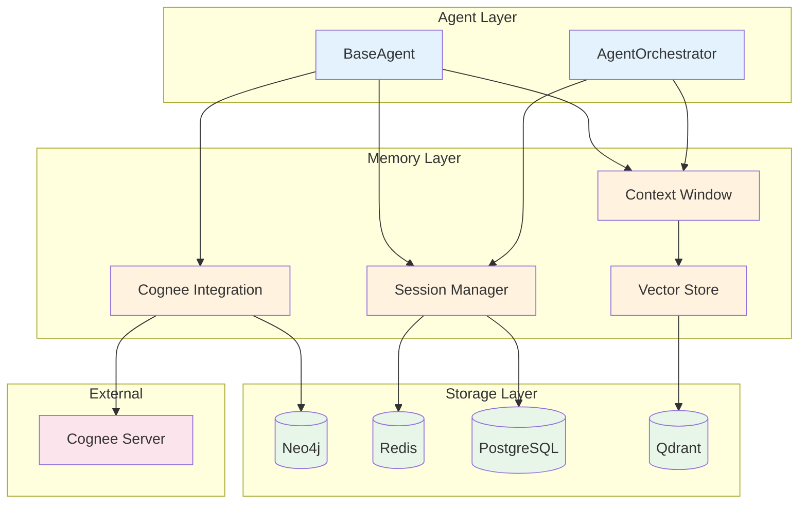

### 9.2 Cognee Integration

```python
# src/grc_marketing_core/memory/cognee.py

from __future__ import annotations

from abc import ABC, abstractmethod
from dataclasses import dataclass, field
from datetime import datetime, timezone
from enum import Enum
from typing import Any, AsyncIterator

import httpx
from pydantic import BaseModel, Field


class MemoryType(str, Enum):
    EPISODIC = "episodic"       # Specific events and interactions
    SEMANTIC = "semantic"       # Facts and knowledge
    PROCEDURAL = "procedural"   # How to do things
    WORKING = "working"         # Current task context


class MemoryEntry(BaseModel):
    """A single memory entry."""
    memory_id: str
    memory_type: MemoryType
    content: str
    embedding: list[float] | None = None
    metadata: dict[str, Any] = Field(default_factory=dict)
    agent_id: str | None = None
    tenant_id: str | None = None
    session_id: str | None = None
    created_at: datetime = Field(default_factory=lambda: datetime.now(timezone.utc))
    accessed_at: datetime | None = None
    access_count: int = 0
    importance: float = 0.5  # 0.0 to 1.0


class SearchResult(BaseModel):
    """A search result from memory."""
    memory: MemoryEntry
    score: float
    distance: float | None = None


class CogneeMemory:
    """
    Cognee-powered memory management.
    
    Cognee provides:
    - Knowledge graph construction from unstructured data
    - Entity extraction and relationship mapping
    - Semantic search with graph-aware ranking
    - Automatic memory consolidation
    - Multi-tenant isolation
    
    Integration:
    - Connects to Cognee server via REST API
    - Indexes all agent interactions as knowledge
    - Retrieves relevant memories using graph search
    - Maintains memory importance scores
    """

    def __init__(
        self,
        cognee_url: str,
        api_key: str,
        tenant_id: str,
        agent_id: str,
    ) -> None:
        self._cognee_url = cognee_url
        self._api_key = api_key
        self._tenant_id = tenant_id
        self._agent_id = agent_id

    async def add_memory(
        self,
        content: str,
        memory_type: MemoryType = MemoryType.EPISODIC,
        metadata: dict[str, Any] | None = None,
    ) -> MemoryEntry:
        """Add a new memory entry."""
        import uuid

        entry = MemoryEntry(
            memory_id=str(uuid.uuid4()),
            memory_type=memory_type,
            content=content,
            metadata=metadata or {},
            agent_id=self._agent_id,
            tenant_id=self._tenant_id,
        )

        # Send to Cognee for indexing
        async with httpx.AsyncClient() as client:
            response = await client.post(
                f"{self._cognee_url}/v1/memory",
                headers={"Authorization": f"Bearer {self._api_key}"},
                json={
                    "content": content,
                    "memory_type": memory_type.value,
                    "metadata": metadata or {},
                    "agent_id": self._agent_id,
                    "tenant_id": self._tenant_id,
                },
            )
            response.raise_for_status()
            data = response.json()
            entry.embedding = data.get("embedding")

        return entry

    async def search(
        self,
        query: str,
        memory_types: list[MemoryType] | None = None,
        limit: int = 10,
        min_score: float = 0.7,
    ) -> list[SearchResult]:
        """Search memories using semantic search."""
        async with httpx.AsyncClient() as client:
            response = await client.post(
                f"{self._cognee_url}/v1/search",
                headers={"Authorization": f"Bearer {self._api_key}"},
                json={
                    "query": query,
                    "memory_types": [mt.value for mt in memory_types] if memory_types else None,
                    "limit": limit,
                    "min_score": min_score,
                    "tenant_id": self._tenant_id,
                    "agent_id": self._agent_id,
                },
            )
            response.raise_for_status()
            data = response.json()

            results = []
            for item in data.get("results", []):
                results.append(SearchResult(
                    memory=MemoryEntry(**item["memory"]),
                    score=item["score"],
                    distance=item.get("distance"),
                ))
            return results

    async def get_context(
        self,
        query: str,
        max_tokens: int = 4000,
    ) -> str:
        """
        Get relevant context for a query.
        
        Retrieves the most relevant memories and formats them
        as context for the LLM.
        """
        results = await self.search(query, limit=20)

        context_parts = []
        total_tokens = 0

        for result in results:
            # Rough token estimate: 1 token ≈ 4 characters
            tokens = len(result.memory.content) // 4
            if total_tokens + tokens > max_tokens:
                break

            context_parts.append(
                f"[{result.memory.memory_type.value}] {result.memory.content}"
            )
            total_tokens += tokens

        return "\n\n".join(context_parts)

    async def consolidate(self) -> None:
        """
        Consolidate memories.
        
        Merges similar memories, removes duplicates,
        and updates importance scores.
        """
        async with httpx.AsyncClient() as client:
            response = await client.post(
                f"{self._cognee_url}/v1/consolidate",
                headers={"Authorization": f"Bearer {self._api_key}"},
                json={
                    "tenant_id": self._tenant_id,
                    "agent_id": self._agent_id,
                },
            )
            response.raise_for_status()

    async def forget(self, memory_id: str) -> None:
        """Delete a specific memory."""
        async with httpx.AsyncClient() as client:
            response = await client.delete(
                f"{self._cognee_url}/v1/memory/{memory_id}",
                headers={"Authorization": f"Bearer {self._api_key}"},
            )
            response.raise_for_status()
```

### 9.3 Session-Aware Recall

```python
# src/grc_marketing_core/memory/session.py

from __future__ import annotations

from dataclasses import dataclass, field
from datetime import datetime, timezone
from typing import Any

from pydantic import BaseModel, Field

from grc_marketing_core.memory.cognee import CogneeMemory, MemoryEntry, MemoryType


class SessionContext(BaseModel):
    """Context for a single agent session."""
    session_id: str
    agent_id: str
    tenant_id: str
    started_at: datetime = Field(default_factory=lambda: datetime.now(timezone.utc))
    last_activity: datetime = Field(default_factory=lambda: datetime.now(timezone.utc))
    message_count: int = 0
    total_tokens: int = 0
    total_cost_usd: float = 0.0
    metadata: dict[str, Any] = Field(default_factory=dict)
    active: bool = True


class SessionManager:
    """
    Manages agent sessions with context-aware recall.
    
    Features:
    - Session lifecycle management
    - Automatic context injection based on session history
    - Cross-session memory recall
    - Session summarization for long-running sessions
    - Session persistence and recovery
    """

    def __init__(
        self,
        memory: CogneeMemory,
        redis_url: str | None = None,
        max_session_duration_minutes: float = 60.0,
        context_window_size: int = 20,
    ) -> None:
        self._memory = memory
        self._redis_url = redis_url
        self._max_duration = max_session_duration_minutes
        self._context_window_size = context_window_size
        self._sessions: dict[str, SessionContext] = {}
        self._session_history: dict[str, list[dict[str, Any]]] = {}

    async def create_session(
        self,
        agent_id: str,
        tenant_id: str,
        metadata: dict[str, Any] | None = None,
    ) -> SessionContext:
        """Create a new session."""
        import uuid

        session = SessionContext(
            session_id=str(uuid.uuid4()),
            agent_id=agent_id,
            tenant_id=tenant_id,
            metadata=metadata or {},
        )

        self._sessions[session.session_id] = session
        self._session_history[session.session_id] = []

        # Store in Redis for persistence
        if self._redis_url:
            await self._persist_session(session)

        return session

    async def load(self, session_id: str) -> SessionContext:
        """Load an existing session."""
        if session_id in self._sessions:
            return self._sessions[session_id]

        # Try to load from Redis
        if self._redis_url:
            session = await self._load_session(session_id)
            if session:
                self._sessions[session_id] = session
                return session

        raise KeyError(f"Session not found: {session_id}")

    async def add_message(
        self,
        session_id: str,
        role: str,
        content: str,
        tokens: int = 0,
        cost_usd: float = 0.0,
    ) -> None:
        """Add a message to the session history."""
        session = await self.load(session_id)
        session.message_count += 1
        session.total_tokens += tokens
        session.total_cost_usd += cost_usd
        session.last_activity = datetime.now(timezone.utc)

        self._session_history[session_id].append({
            "role": role,
            "content": content,
            "timestamp": datetime.now(timezone.utc).isoformat(),
            "tokens": tokens,
            "cost_usd": cost_usd,
        })

        # Trim history if it exceeds the window
        if len(self._session_history[session_id]) > self._context_window_size:
            self._session_history[session_id] = self._session_history[session_id][-self._context_window_size:]

    async def get_context(
        self,
        session_id: str,
        query: str | None = None,
        max_tokens: int = 4000,
    ) -> str:
        """
        Get context for the current session.
        
        Combines:
        1. Recent session history
        2. Relevant memories from Cognee
        3. Session metadata
        """
        session = await self.load(session_id)
        context_parts = []

        # 1. Session metadata
        context_parts.append(f"Session: {session.session_id}")
        context_parts.append(f"Agent: {session.agent_id}")
        context_parts.append(f"Messages: {session.message_count}")

        # 2. Recent history
        history = self._session_history.get(session_id, [])
        if history:
            history_text = "\n".join(
                f"{msg['role']}: {msg['content'][:200]}"
                for msg in history[-10:]
            )
            context_parts.append(f"\nRecent History:\n{history_text}")

        # 3. Relevant memories
        if query:
            memory_context = await self._memory.get_context(query, max_tokens=max_tokens // 2)
            if memory_context:
                context_parts.append(f"\nRelevant Memories:\n{memory_context}")

        return "\n\n".join(context_parts)

    async def summarize(self, session_id: str) -> str:
        """Generate a summary of the session."""
        session = await self.load(session_id)
        history = self._session_history.get(session_id, [])

        # Use LLM to summarize the session
        # In production, this would call the model router
        summary = f"Session {session_id}: {session.message_count} messages, {session.total_tokens} tokens, ${session.total_cost_usd:.4f}"
        return summary

    async def end_session(self, session_id: str) -> None:
        """End a session and persist final state."""
        session = await self.load(session_id)
        session.active = False

        # Persist to Redis
        if self._redis_url:
            await self._persist_session(session)

        # Clean up memory
        del self._sessions[session_id]
        if session_id in self._session_history:
            del self._session_history[session_id]

    async def _persist_session(self, session: SessionContext) -> None:
        """Persist session to Redis."""
        # Implementation: use redis-py to store session
        ...

    async def _load_session(self, session_id: str) -> SessionContext | None:
        """Load session from Redis."""
        # Implementation: use redis-py to load session
        ...
```

### 9.4 Context Window Management

```python
# src/grc_marketing_core/memory/context.py

from __future__ import annotations

from dataclasses import dataclass, field
from typing import Any

from pydantic import BaseModel, Field


class ContextItem(BaseModel):
    """A single item in the context window."""
    role: str  # system, user, assistant, tool
    content: str
    tokens: int = 0
    metadata: dict[str, Any] = Field(default_factory=dict)
    timestamp: str = Field(default_factory=lambda: __import__("datetime").datetime.utcnow().isoformat())


class ContextWindow:
    """
    Manages the LLM context window.
    
    Features:
    - Token budget enforcement
    - Automatic truncation with summarization
    - Priority-based eviction
    - System prompt preservation
    - Tool result compression
    """

    def __init__(
        self,
        max_tokens: int = 128000,
        system_prompt: str = "",
        reserved_tokens: int = 4000,
    ) -> None:
        self._max_tokens = max_tokens
        self._system_prompt = system_prompt
        self._reserved_tokens = reserved_tokens
        self._items: list[ContextItem] = []
        self._system_tokens = self._estimate_tokens(system_prompt)

    @property
    def total_tokens(self) -> int:
        """Total tokens currently in the context window."""
        return self._system_tokens + sum(item.tokens for item in self._items)

    @property
    def available_tokens(self) -> int:
        """Available tokens for new content."""
        return self._max_tokens - self._reserved_tokens - self.total_tokens

    def add(self, item: ContextItem) -> bool:
        """
        Add an item to the context window.
        Returns False if the item doesn't fit.
        """
        if item.tokens > self.available_tokens:
            return False
        self._items.append(item)
        return True

    def add_or_compress(self, item: ContextItem) -> None:
        """
        Add an item, compressing older items if necessary.
        """
        while item.tokens > self.available_tokens and self._items:
            # Compress the oldest non-system item
            self._compress_oldest()

        self._items.append(item)

    def _compress_oldest(self) -> None:
        """Compress the oldest item by summarizing it."""
        if not self._items:
            return

        oldest = self._items.pop(0)
        # In production, use LLM to summarize
        compressed = ContextItem(
            role=oldest.role,
            content=f"[Summary] {oldest.content[:100]}...",
            tokens=self._estimate_tokens(oldest.content[:100]) + 10,
            metadata={**oldest.metadata, "compressed": True},
        )
        self._items.insert(0, compressed)

    def get_messages(self) -> list[dict[str, str]]:
        """Get all messages in OpenAI format."""
        messages = []
        if self._system_prompt:
            messages.append({"role": "system", "content": self._system_prompt})
        for item in self._items:
            messages.append({"role": item.role, "content": item.content})
        return messages

    def clear(self) -> None:
        """Clear all items except the system prompt."""
        self._items = []

    def _estimate_tokens(self, text: str) -> int:
        """Estimate token count (rough: 1 token ≈ 4 characters)."""
        return len(text) // 4 + 1
```

---

## 10. Model Routing & Cost Optimization

### 10.1 Architecture

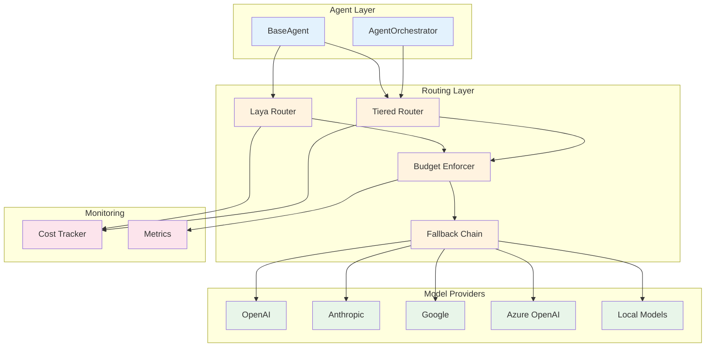

### 10.2 Laya Integration

```python
# src/grc_marketing_core/routing/laya.py

from __future__ import annotations

from abc import ABC, abstractmethod
from dataclasses import dataclass, field
from enum import Enum
from typing import Any

import httpx
from pydantic import BaseModel, Field


class ModelCapability(str, Enum):
    TEXT_GENERATION = "text_generation"
    FUNCTION_CALLING = "function_calling"
    VISION = "vision"
    REASONING = "reasoning"
    EMBEDDING = "embedding"
    CODE_GENERATION = "code_generation"


class ModelTier(str, Enum):
    ULTRA = "ultra"         # Most capable, most expensive
    STANDARD = "standard"   # Balanced capability and cost
    FAST = "fast"           # Fast, inexpensive
    LOCAL = "local"         # Self-hosted, no per-token cost


class ModelInfo(BaseModel):
    """Information about a model."""
    model_id: str
    provider: str
    tier: ModelTier
    capabilities: list[ModelCapability] = Field(default_factory=list)
    max_tokens: int = 128000
    cost_per_1m_input: float = 0.0
    cost_per_1m_output: float = 0.0
    latency_ms_p50: float = 0.0
    available: bool = True


class LayaRouter:
    """
    Laya-powered model routing.
    
    Laya provides:
    - Intelligent model selection based on task complexity
    - Cost optimization across providers
    - Quality/cost tradeoff configuration
    - Automatic fallback on model failures
    - A/B testing of model configurations
    - Real-time model performance monitoring
    """

    def __init__(
        self,
        laya_url: str,
        api_key: str,
        default_tier: ModelTier = ModelTier.STANDARD,
    ) -> None:
        self._laya_url = laya_url
        self._api_key = api_key
        self._default_tier = default_tier
        self._models: dict[str, ModelInfo] = {}

    async def initialize(self) -> None:
        """Load available models from Laya."""
        async with httpx.AsyncClient() as client:
            response = await client.get(
                f"{self._laya_url}/v1/models",
                headers={"Authorization": f"Bearer {self._api_key}"},
            )
            response.raise_for_status()
            data = response.json()
            for model_data in data["models"]:
                model = ModelInfo(**model_data)
                self._models[model.model_id] = model

    async def route(
        self,
        task: str,
        required_capabilities: list[ModelCapability] | None = None,
        max_cost: float | None = None,
        preferred_tier: ModelTier | None = None,
    ) -> ModelInfo:
        """
        Select the best model for a task.
        
        Considers:
        - Task complexity (estimated from task description)
        - Required capabilities
        - Cost constraints
        - Latency requirements
        - Current model availability
        """
        tier = preferred_tier or self._default_tier
        required = required_capabilities or [ModelCapability.TEXT_GENERATION]

        # Filter by tier and capabilities
        candidates = [
            m for m in self._models.values()
            if m.tier == tier
            and m.available
            and all(cap in m.capabilities for cap in required)
        ]

        if not candidates:
            # Fall back to next tier up
            if tier == ModelTier.FAST:
                candidates = [m for m in self._models.values() if m.tier == ModelTier.STANDARD and m.available]
            elif tier == ModelTier.STANDARD:
                candidates = [m for m in self._models.values() if m.tier == ModelTier.ULTRA and m.available]

        if not candidates:
            raise ValueError(f"No model available for task: {task}")

        # Filter by cost
        if max_cost is not None:
            candidates = [m for m in candidates if m.cost_per_1m_output <= max_cost]

        # Select best (lowest cost that meets requirements)
        best = min(candidates, key=lambda m: m.cost_per_1m_output)
        return best

    async def execute(
        self,
        model_id: str,
        messages: list[dict[str, str]],
        **kwargs: Any,
    ) -> dict[str, Any]:
        """Execute a request against the selected model."""
        model = self._models.get(model_id)
        if not model:
            raise ValueError(f"Model not found: {model_id}")

        # Route to the appropriate provider
        if model.provider == "openai":
            return await self._call_openai(model, messages, **kwargs)
        elif model.provider == "anthropic":
            return await self._call_anthropic(model, messages, **kwargs)
        elif model.provider == "google":
            return await self._call_google(model, messages, **kwargs)
        else:
            raise ValueError(f"Unknown provider: {model.provider}")

    async def _call_openai(self, model: ModelInfo, messages: list[dict[str, str]], **kwargs) -> dict[str, Any]:
        # Implementation: call OpenAI API
        ...

    async def _call_anthropic(self, model: ModelInfo, messages: list[dict[str, str]], **kwargs) -> dict[str, Any]:
        # Implementation: call Anthropic API
        ...

    async def _call_google(self, model: ModelInfo, messages: list[dict[str, str]], **kwargs) -> dict[str, Any]:
        # Implementation: call Google API
        ...
```

### 10.3 Tiered Model Routing

```python
# src/grc_marketing_core/routing/tiered.py

from __future__ import annotations

from dataclasses import dataclass, field
from enum import Enum
from typing import Any

from grc_marketing_core.routing.laya import LayaRouter, ModelInfo, ModelTier, ModelCapability


class TaskComplexity(str, Enum):
    TRIVIAL = "trivial"       # Simple classification, extraction
    SIMPLE = "simple"         # Short generation, summarization
    MODERATE = "moderate"     # Multi-step reasoning, planning
    COMPLEX = "complex"       # Deep analysis, code generation
    CRITICAL = "critical"     # High-stakes decisions


class TieredRouter:
    """
    Tiered model routing with automatic complexity detection.
    
    Routes tasks to the cheapest model tier that can handle them:
    - Trivial → Fast tier (Haiku, Mini, Flash)
    - Simple → Fast or Standard tier
    - Moderate → Standard tier
    - Complex → Standard or Ultra tier
    - Critical → Ultra tier with verification
    
    Features:
    - Automatic complexity detection
    - Cost budget enforcement
    - Quality verification (re-run with higher tier if needed)
    - Fallback chain
    - Per-tenant routing preferences
    """

    def __init__(
        self,
        laya_router: LayaRouter,
        budget_enforcer: BudgetEnforcer | None = None,
    ) -> None:
        self._laya = laya_router
        self._budget = budget_enforcer

    async def route(
        self,
        task: str,
        complexity: TaskComplexity | None = None,
        **kwargs: Any,
    ) -> ModelInfo:
        """Route a task to the appropriate model tier."""
        if complexity is None:
            complexity = self._detect_complexity(task)

        tier_map = {
            TaskComplexity.TRIVIAL: ModelTier.FAST,
            TaskComplexity.SIMPLE: ModelTier.FAST,
            TaskComplexity.MODERATE: ModelTier.STANDARD,
            TaskComplexity.COMPLEX: ModelTier.STANDARD,
            TaskComplexity.CRITICAL: ModelTier.ULTRA,
        }

        tier = tier_map[complexity]

        # Check budget
        if self._budget:
            within_budget, spend, budget = self._budget.check_budget(kwargs.get("tenant_id", "default"))
            if not within_budget:
                # Downgrade tier if over budget
                if tier == ModelTier.ULTRA:
                    tier = ModelTier.STANDARD
                elif tier == ModelTier.STANDARD:
                    tier = ModelTier.FAST

        return await self._laya.route(task, preferred_tier=tier, **kwargs)

    def _detect_complexity(self, task: str) -> TaskComplexity:
        """Detect task complexity from the task description."""
        # Simple heuristic-based detection
        # In production, use a classifier model
        task_lower = task.lower()

        critical_keywords = ["strategic", "executive", "board", "investment", "acquisition", "legal"]
        complex_keywords = ["analyze", "compare", "evaluate", "architect", "design", "optimize"]
        moderate_keywords = ["plan", "draft", "summarize", "research", "recommend"]
        simple_keywords = ["write", "generate", "create", "list", "format"]

        if any(kw in task_lower for kw in critical_keywords):
            return TaskComplexity.CRITICAL
        elif any(kw in task_lower for kw in complex_keywords):
            return TaskComplexity.COMPLEX
        elif any(kw in task_lower for kw in moderate_keywords):
            return TaskComplexity.MODERATE
        elif any(kw in task_lower for kw in simple_keywords):
            return TaskComplexity.SIMPLE
        else:
            return TaskComplexity.TRIVIAL
```

### 10.4 Budget Enforcement

```python
# src/grc_marketing_core/routing/budget.py

from __future__ import annotations

from dataclasses import dataclass, field
from datetime import datetime, timezone, timedelta
from typing import Any

from grc_marketing_core.monitoring.cost import CostTracker


@dataclass
class BudgetConfig:
    """Budget configuration for a tenant."""
    tenant_id: str
    daily_budget_usd: float = 100.0
    monthly_budget_usd: float = 2000.0
    per_agent_budget_usd: float | None = None
    alert_threshold_pct: float = 0.8  # Alert at 80% of budget
    hard_stop: bool = True  # Hard stop when budget exceeded


class BudgetEnforcer:
    """
    Enforces token and cost budgets at multiple levels.
    
    Budgets:
    - Per-tenant daily/monthly budget
    - Per-agent budget
    - Per-operation budget
    - Per-model budget
    
    Enforcement:
    - Soft limit: Log warning, continue
    - Hard limit: Block execution, return error
    - Alerting: Notify at configurable thresholds
    """

    def __init__(self, cost_tracker: CostTracker) -> None:
        self._cost_tracker = cost_tracker
        self._configs: dict[str, BudgetConfig] = {}

    def set_budget(self, config: BudgetConfig) -> None:
        """Set budget configuration for a tenant."""
        self._configs[config.tenant_id] = config

    def check_budget(self, tenant_id: str) -> tuple[bool, float, float]:
        """
        Check if a tenant is within budget.
        Returns (within_budget, current_spend, budget).
        """
        config = self._configs.get(tenant_id)
        if not config:
            return True, 0.0, float("inf")

        # Check daily budget
        daily_spend = self._get_daily_spend(tenant_id)
        if daily_spend >= config.daily_budget_usd:
            return False, daily_spend, config.daily_budget_usd

        # Check monthly budget
        monthly_spend = self._cost_tracker.get_spend(tenant_id)
        if monthly_spend >= config.monthly_budget_usd:
            return False, monthly_spend, config.monthly_budget_usd

        return True, monthly_spend, config.monthly_budget_usd

    def can_afford(self, tenant_id: str, estimated_cost: float) -> bool:
        """Check if a tenant can afford an operation."""
        within_budget, spend, budget = self.check_budget(tenant_id)
        if not within_budget:
            return False
        return (spend + estimated_cost) <= budget

    def _get_daily_spend(self, tenant_id: str) -> float:
        """Get today's spend for a tenant."""
        today = datetime.now(timezone.utc).date()
        return sum(
            r.total_cost for r in self._cost_tracker._records
            if r.tenant_id == tenant_id and r.timestamp.date() == today
        )
```

### 10.5 Fallback Chain

```python
# src/grc_marketing_core/routing/fallback.py

from __future__ import annotations

from dataclasses import dataclass, field
from typing import Any, Callable

from grc_marketing_core.routing.laya import ModelInfo


@dataclass
class FallbackStep:
    """A single step in the fallback chain."""
    model_id: str
    max_retries: int = 2
    timeout_seconds: float = 30.0
    retry_backoff: float = 1.0


class FallbackChain:
    """
    Manages fallback when a model fails.
    
    Features:
    - Ordered fallback chain (try models in order)
    - Automatic retry with backoff
    - Circuit breaker per model
    - Fallback to cached responses
    - Graceful degradation
    """

    def __init__(self) -> None:
        self._chains: dict[str, list[FallbackStep]] = {}
        self._circuit_breakers: dict[str, bool] = {}  # model_id -> is_open

    def set_chain(self, task_type: str, steps: list[FallbackStep]) -> None:
        """Set the fallback chain for a task type."""
        self._chains[task_type] = steps

    async def execute(
        self,
        task_type: str,
        messages: list[dict[str, str]],
        executor: Callable[[str, list[dict[str, str]]], Any],
    ) -> Any:
        """
        Execute with fallback.
        
        Tries each model in the chain until one succeeds.
        """
        chain = self._chains.get(task_type, [])
        if not chain:
            raise ValueError(f"No fallback chain for task type: {task_type}")

        last_error = None
        for step in chain:
            # Check circuit breaker
            if self._circuit_breakers.get(step.model_id, False):
                continue

            for attempt in range(step.max_retries):
                try:
                    result = await executor(step.model_id, messages)
                    # Success: close circuit breaker
                    self._circuit_breakers[step.model_id] = False
                    return result
                except Exception as e:
                    last_error = e
                    if attempt < step.max_retries - 1:
                        import asyncio
                        await asyncio.sleep(step.retry_backoff * (2 ** attempt))

            # All retries failed: open circuit breaker
            self._circuit_breakers[step.model_id] = True

        raise last_error or Exception("All fallback models failed")
```

---

## 11. Configuration Management

### 11.1 Architecture

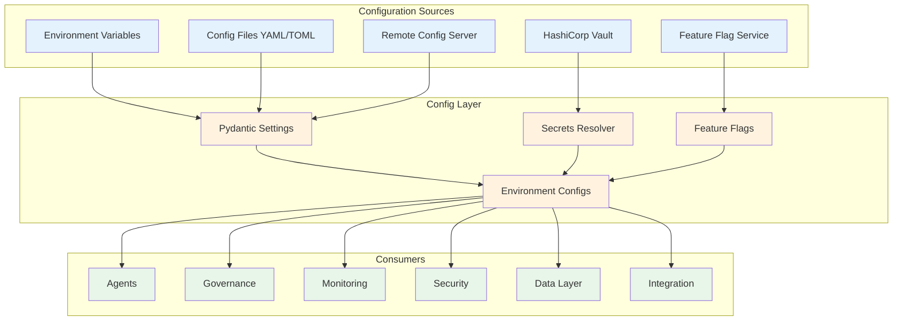

### 11.2 Settings

```python
# src/grc_marketing_core/config/settings.py

from __future__ import annotations

from enum import Enum
from pathlib import Path
from typing import Any

from pydantic import Field, SecretStr, field_validator
from pydantic_settings import BaseSettings, SettingsConfigDict


class Environment(str, Enum):
    DEVELOPMENT = "development"
    STAGING = "staging"
    PRODUCTION = "production"
    TESTING = "testing"


class LogLevel(str, Enum):
    DEBUG = "DEBUG"
    INFO = "INFO"
    WARNING = "WARNING"
    ERROR = "ERROR"
    CRITICAL = "CRITICAL"


class DatabaseConfig(BaseSettings):
    """Database configuration."""
    url: str = "postgresql://localhost:5432/grc_marketing"
    pool_size: int = 10
    max_overflow: int = 20
    pool_timeout: int = 30
    echo: bool = False


class KafkaConfig(BaseSettings):
    """Kafka configuration."""
    bootstrap_servers: str = "localhost:9092"
    topic_prefix: str = "grc.marketing"
    consumer_group: str = "grc-marketing-core"
    auto_offset_reset: str = "latest"
    enable_auto_commit: bool = False


class RedisConfig(BaseSettings):
    """Redis configuration."""
    url: str = "redis://localhost:6379/0"
    max_connections: int = 50
    socket_timeout: int = 5


class VaultConfig(BaseSettings):
    """HashiCorp Vault configuration."""
    url: str = "http://localhost:8200"
    token: SecretStr = SecretStr("")
    mount_point: str = "secret"
    role_id: str = ""
    secret_id: str = ""


class OpenTelemetryConfig(BaseSettings):
    """OpenTelemetry configuration."""
    otlp_endpoint: str = "http://localhost:4317"
    service_name: str = "grc-marketing-core"
    sample_rate: float = 1.0
    export_interval_ms: int = 5000


class PrometheusConfig(BaseSettings):
    """Prometheus configuration."""
    push_gateway: str = "http://localhost:9091"
    job_name: str = "grc-marketing-core"
    push_interval_seconds: int = 15


class LayaConfig(BaseSettings):
    """Laya model routing configuration."""
    url: str = "http://localhost:8080"
    api_key: SecretStr = SecretStr("")
    default_tier: str = "standard"
    timeout_seconds: float = 30.0


class CogneeConfig(BaseSettings):
    """Cognee memory configuration."""
    url: str = "http://localhost:8000"
    api_key: SecretStr = SecretStr("")
    default_memory_type: str = "episodic"
    consolidation_interval_hours: int = 24


class GRCClawConfig(BaseSettings):
    """GRC_Claw platform configuration."""
    control_plane_url: str = "http://localhost:8080"
    evidence_plane_url: str = "http://localhost:8081"
    api_key: SecretStr = SecretStr("")
    policy_cache_ttl_seconds: int = 60


class Settings(BaseSettings):
    """
    Main settings class.
    
    Loads configuration from (in order of precedence):
    1. Environment variables (highest priority)
    2. .env file
    3. Config file (YAML/TOML)
    4. Default values (lowest priority)
    
    All sensitive values use SecretStr to prevent accidental exposure.
    """
    model_config = SettingsConfigDict(
        env_prefix="GRC_",
        env_file=".env",
        env_file_encoding="utf-8",
        extra="ignore",
    )

    # Core
    environment: Environment = Environment.DEVELOPMENT
    debug: bool = False
    log_level: LogLevel = LogLevel.INFO
    project_name: str = "grc-marketing-core"
    version: str = "1.0.0"

    # Server
    host: str = "0.0.0.0"
    port: int = 8000
    workers: int = 4
    reload: bool = False

    # Sub-configs
    database: DatabaseConfig = Field(default_factory=DatabaseConfig)
    kafka: KafkaConfig = Field(default_factory=KafkaConfig)
    redis: RedisConfig = Field(default_factory=RedisConfig)
    vault: VaultConfig = Field(default_factory=VaultConfig)
    otel: OpenTelemetryConfig = Field(default_factory=OpenTelemetryConfig)
    prometheus: PrometheusConfig = Field(default_factory=PrometheusConfig)
    laya: LayaConfig = Field(default_factory=LayaConfig)
    cognee: CogneeConfig = Field(default_factory=CogneeConfig)
    grc_claw: GRCClawConfig = Field(default_factory=GRCClawConfig)

    # Feature flags (can be overridden by remote flags)
    enable_governance: bool = True
    enable_audit_trail: bool = True
    enable_cost_tracking: bool = True
    enable_auto_approval: bool = False
    max_agent_retries: int = 3
    default_token_budget: int = 100000

    @field_validator("environment", mode="before")
    @classmethod
    def validate_environment(cls, v: str) -> str:
        return v.lower()

    @property
    def is_production(self) -> bool:
        return self.environment == Environment.PRODUCTION

    @property
    def is_development(self) -> bool:
        return self.environment == Environment.DEVELOPMENT
```

### 11.3 Environment-Specific Configs

```python
# src/grc_marketing_core/config/environments.py

from __future__ import annotations

from typing import Any

from grc_marketing_core.config.settings import Settings, Environment


class EnvironmentConfig:
    """
    Environment-specific configuration overrides.
    
    Each environment can override any setting:
    - Development: Verbose logging, local services, debug features
    - Staging: Production-like but with test data
    - Production: Optimized, secure, monitored
    - Testing: Fast, isolated, deterministic
    """

    _overrides: dict[Environment, dict[str, Any]] = {
        Environment.DEVELOPMENT: {
            "debug": True,
            "log_level": "DEBUG",
            "reload": True,
            "workers": 1,
            "database": {"echo": True},
            "otel": {"sample_rate": 1.0},
            "prometheus": {"push_interval_seconds": 60},
        },
        Environment.STAGING: {
            "debug": False,
            "log_level": "INFO",
            "reload": False,
            "workers": 2,
            "database": {"echo": False},
            "otel": {"sample_rate": 0.5},
        },
        Environment.PRODUCTION: {
            "debug": False,
            "log_level": "WARNING",
            "reload": False,
            "workers": 4,
            "database": {"echo": False, "pool_size": 20},
            "otel": {"sample_rate": 0.1},
            "prometheus": {"push_interval_seconds": 15},
        },
        Environment.TESTING: {
            "debug": True,
            "log_level": "DEBUG",
            "reload": False,
            "workers": 1,
            "database": {"url": "postgresql://localhost:5432/grc_marketing_test"},
            "kafka": {"bootstrap_servers": "localhost:9093"},
            "otel": {"sample_rate": 0.0},
        },
    }

    @classmethod
    def apply(cls, settings: Settings) -> Settings:
        """Apply environment-specific overrides to settings."""
        overrides = cls._overrides.get(settings.environment, {})
        for key, value in overrides.items():
            if hasattr(settings, key):
                setattr(settings, key, value)
        return settings

    @classmethod
    def register_override(cls, env: Environment, key: str, value: Any) -> None:
        """Register a custom override for an environment."""
        cls._overrides.setdefault(env, {})[key] = value
```

### 11.4 Feature Flags

```python
# src/grc_marketing_core/config/feature_flags.py

from __future__ import annotations

import json
from dataclasses import dataclass, field
from enum import Enum
from typing import Any, Callable

import httpx
from pydantic import BaseModel, Field


class FlagType(str, Enum):
    BOOLEAN = "boolean"
    STRING = "string"
    INTEGER = "integer"
    FLOAT = "float"
    JSON = "json"


class FlagValue(BaseModel):
    """A feature flag value."""
    name: str
    flag_type: FlagType
    value: Any
    description: str = ""
    tenant_id: str | None = None  # None = global
    enabled: bool = True
    rollout_percentage: float = 100.0  # 0-100


class FeatureFlags:
    """
    Feature flag engine.
    
    Supports:
    - Boolean flags (on/off)
    - Percentage-based rollouts
    - Tenant-specific flags
    - User segment targeting
    - Remote flag services (LaunchDarkly, Unleash, etc.)
    - Local flag files
    - Real-time flag updates
    - Flag evaluation with context
    """

    def __init__(
        self,
        remote_url: str | None = None,
        api_key: str | None = None,
        local_file: str | None = None,
        cache_ttl_seconds: int = 30,
    ) -> None:
        self._remote_url = remote_url
        self._api_key = api_key
        self._local_file = local_file
        self._cache_ttl = cache_ttl_seconds
        self._flags: dict[str, FlagValue] = {}
        self._cache_timestamp: float = 0

    async def initialize(self) -> None:
        """Load flags from all sources."""
        if self._local_file:
            await self._load_local()
        if self._remote_url:
            await self._load_remote()

    async def _load_local(self) -> None:
        """Load flags from a local JSON file."""
        from pathlib import Path
        path = Path(self._local_file)
        if path.exists():
            data = json.loads(path.read_text())
            for flag_data in data.get("flags", []):
                flag = FlagValue(**flag_data)
                self._flags[flag.name] = flag

    async def _load_remote(self) -> None:
        """Load flags from a remote service."""
        async with httpx.AsyncClient() as client:
            response = await client.get(
                f"{self._remote_url}/v1/flags",
                headers={"Authorization": f"Bearer {self._api_key}"} if self._api_key else {},
            )
            response.raise_for_status()
            data = response.json()
            for flag_data in data.get("flags", []):
                flag = FlagValue(**flag_data)
                self._flags[flag.name] = flag

    async def is_enabled(
        self,
        name: str,
        context: dict[str, Any] | None = None,
    ) -> bool:
        """
        Check if a feature flag is enabled.
        
        Evaluates the flag with the given context:
        - Check if flag exists
        - Check if flag is globally enabled
        - Check tenant-specific override
        - Check rollout percentage
        - Check context conditions
        """
        flag = self._flags.get(name)
        if not flag or not flag.enabled:
            return False

        context = context or {}

        # Check tenant-specific flag
        tenant_id = context.get("tenant_id")
        tenant_flag_key = f"{name}:{tenant_id}"
        if tenant_flag_key in self._flags:
            flag = self._flags[tenant_flag_key]
            if not flag.enabled:
                return False

        # Check rollout percentage
        if flag.rollout_percentage < 100.0:
            # Deterministic rollout based on user/agent ID
            subject = context.get("agent_id") or context.get("user_id") or "default"
            hash_val = hash(f"{name}:{subject}") % 100
            if hash_val >= flag.rollout_percentage:
                return False

        # Check context conditions
        if "data_classification" in context:
            # Example: only enable for certain data classifications
            pass

        return True

    async def get_value(self, name: str, default: Any = None) -> Any:
        """Get the value of a feature flag."""
        flag = self._flags.get(name)
        if not flag:
            return default
        return flag.value

    async def refresh(self) -> None:
        """Refresh flags from remote."""
        if self._remote_url:
            await self._load_remote()
```

### 11.5 Secrets Resolver

```python
# src/grc_marketing_core/config/secrets_resolver.py

from __future__ import annotations

import os
from abc import ABC, abstractmethod
from typing import Any

from grc_marketing_core.security.secrets import SecretsManager, VaultSecretsManager, EnvironmentSecretsManager


class SecretsResolver:
    """
    Resolves secrets from multiple sources.
    
    Resolution order:
    1. Environment variables (highest priority)
    2. HashiCorp Vault
    3. AWS Secrets Manager
    4. Local .env file (development only)
    
    Supports:
    - Secret references in config (e.g., "vault:path/to/secret")
    - Automatic secret rotation
    - Secret caching with TTL
    - Secret validation
    """

    def __init__(
        self,
        vault_manager: VaultSecretsManager | None = None,
        env_manager: EnvironmentSecretsManager | None = None,
        cache_ttl_seconds: int = 300,
    ) -> None:
        self._vault = vault_manager
        self._env = env_manager or EnvironmentSecretsManager()
        self._cache_ttl = cache_ttl_seconds
        self._cache: dict[str, tuple[str, float]] = {}

    async def resolve(self, reference: str) -> str:
        """
        Resolve a secret reference.
        
        Formats:
        - "env:VAR_NAME" → environment variable
        - "vault:path/to/secret" → Vault secret
        - "aws:secret-name" → AWS Secrets Manager
        - "plain:value" → literal value (not recommended)
        """
        # Check cache
        if reference in self._cache:
            value, timestamp = self._cache[reference]
            if self._is_cache_valid(timestamp):
                return value

        # Parse reference
        if ":" not in reference:
            raise ValueError(f"Invalid secret reference: {reference}")

        source, path = reference.split(":", 1)

        if source == "env":
            value = await self._resolve_env(path)
        elif source == "vault":
            value = await self._resolve_vault(path)
        elif source == "aws":
            value = await self._resolve_aws(path)
        elif source == "plain":
            value = path
        else:
            raise ValueError(f"Unknown secret source: {source}")

        # Cache
        self._cache[reference] = (value, self._now())
        return value

    async def _resolve_env(self, name: str) -> str:
        """Resolve from environment variable."""
        value = os.environ.get(name)
        if value is None:
            raise KeyError(f"Environment variable not found: {name}")
        return value

    async def _resolve_vault(self, path: str) -> str:
        """Resolve from HashiCorp Vault."""
        if not self._vault:
            raise RuntimeError("Vault manager not configured")
        secret = await self._vault.get_secret(path)
        return secret.value.get_secret_value()

    async def _resolve_aws(self, name: str) -> str:
        """Resolve from AWS Secrets Manager."""
        # Implementation: use boto3 to fetch secret
        ...

    def _is_cache_valid(self, timestamp: float) -> bool:
        """Check if a cached value is still valid."""
        return (self._now() - timestamp) < self._cache_ttl

    def _now(self) -> float:
        """Get current time."""
        import time
        return time.time()
```

---

## 12. Module Dependency Map

### 12.1 Full Dependency Graph

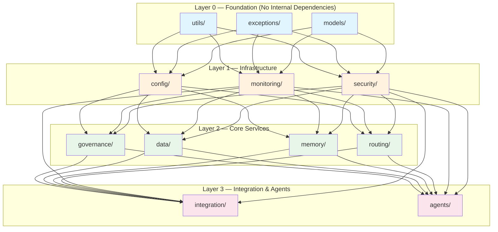

### 12.2 Dependency Rules

| Rule | Description |
|------|-------------|
| **No upward dependencies** | Lower layers must never import from higher layers |
| **No circular dependencies** | Enforced by `import-linter` in CI |
| **Layer 0 purity** | `utils/`, `exceptions/`, `models/` must not import from any other internal module |
| **Layer 1 isolation** | `config/`, `monitoring/`, `security/` may only import from Layer 0 |
| **Layer 2 composition** | `governance/`, `data/`, `memory/`, `routing/` may import from Layers 0–1 |
| **Layer 3 integration** | `integration/`, `agents/` may import from all layers |
| **Public API stability** | Only `__init__.py` exports are part of the public API |
| **Internal APIs** | Modules may change internal APIs without major version bump |

### 12.3 Import Linter Configuration

```python
# .importlinter

[importlinter]
root_package = grc_marketing_core

[importlinter:contract:1]
name = Layer 0 purity
type = forbidden
source_modules = grc_marketing_core.utils, grc_marketing_core.exceptions, grc_marketing_core.models
forbidden_modules = grc_marketing_core.config, grc_marketing_core.monitoring, grc_marketing_core.security, grc_marketing_core.governance, grc_marketing_core.data, grc_marketing_core.memory, grc_marketing_core.routing, grc_marketing_core.integration, grc_marketing_core.agents

[importlinter:contract:2]
name = Layer 1 isolation
type = forbidden
source_modules = grc_marketing_core.config, grc_marketing_core.monitoring, grc_marketing_core.security
forbidden_modules = grc_marketing_core.governance, grc_marketing_core.data, grc_marketing_core.memory, grc_marketing_core.routing, grc_marketing_core.integration, grc_marketing_core.agents

[importlinter:contract:3]
name = Layer 2 composition
type = forbidden
source_modules = grc_marketing_core.governance, grc_marketing_core.data, grc_marketing_core.memory, grc_marketing_core.routing
forbidden_modules = grc_marketing_core.integration, grc_marketing_core.agents

[importlinter:contract:4]
name = No circular dependencies
type = independence
modules = grc_marketing_core.*
```

---

## 13. Data Flow Diagrams

### 13.1 Agent Execution Flow

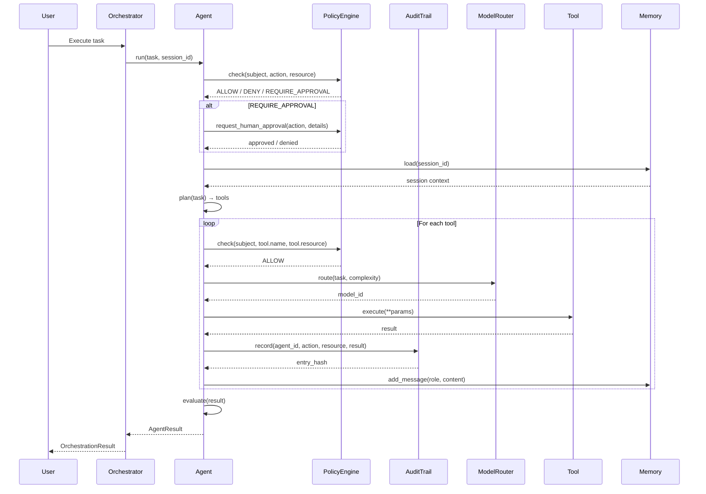

### 13.2 Governance Decision Flow

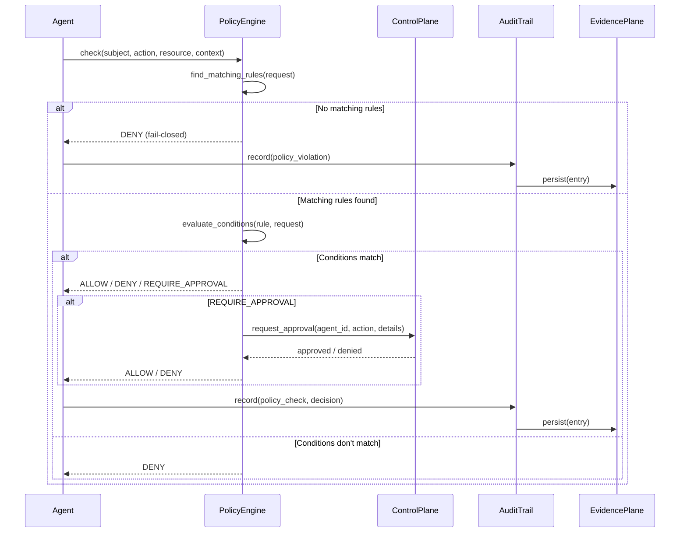

### 13.3 Model Routing Flow

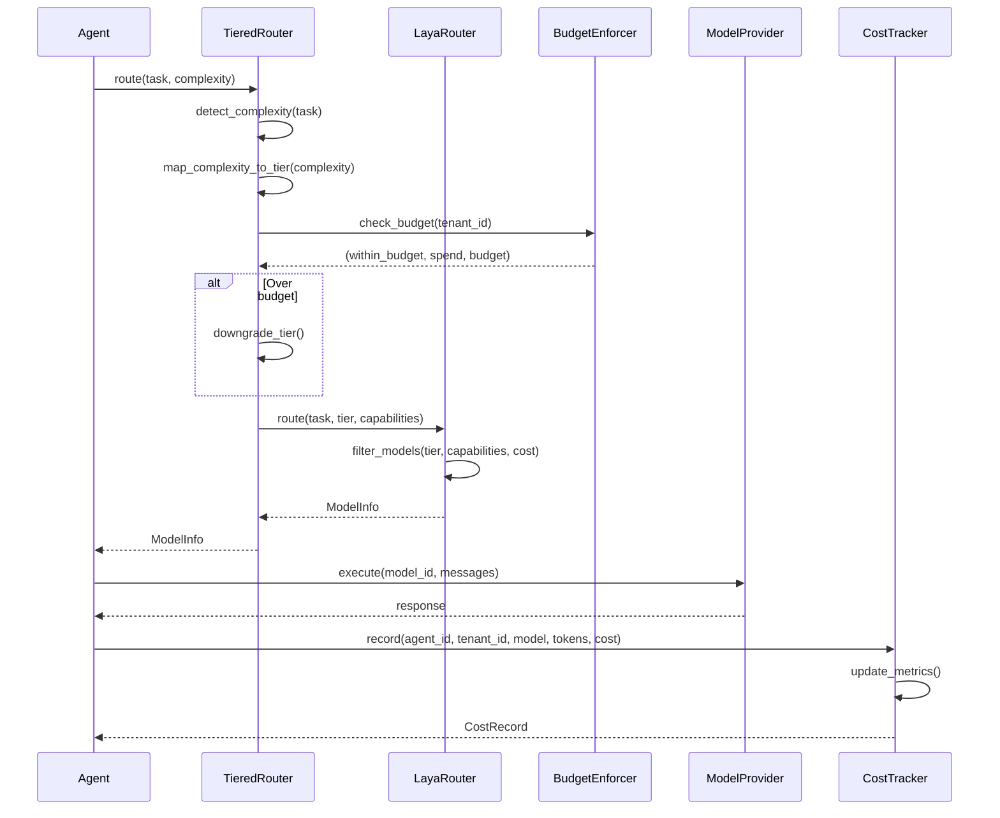

### 13.4 Event Streaming Flow

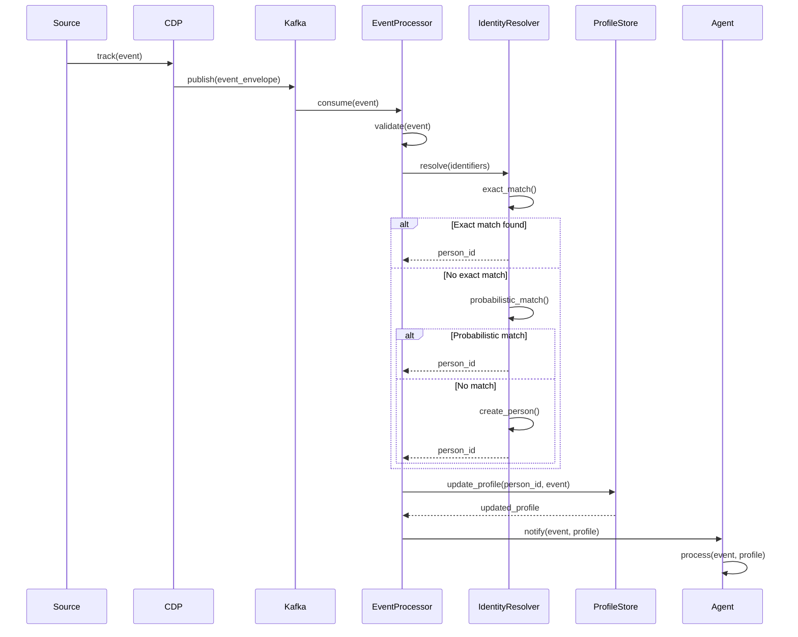

### 13.5 Integration Hub Flow

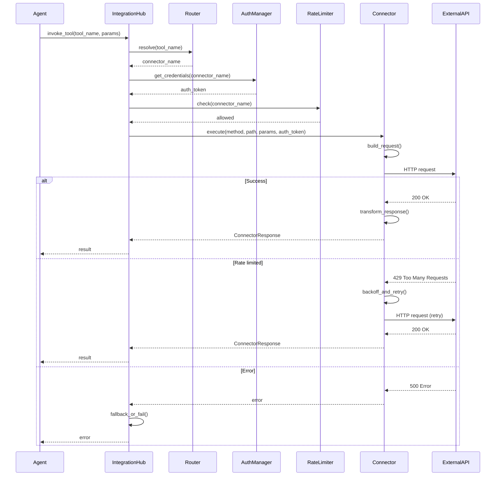

---

## 14. Implementation Roadmap

### 14.1 Phase 1: Foundation (Weeks 1–4)

| Week | Deliverable | Modules |
|------|-------------|---------|
| 1 | Project scaffolding, CI/CD, linting | — |
| 2 | `utils/`, `exceptions/`, `models/` | Layer 0 |
| 3 | `config/`, `monitoring/` (basic) | Layer 1 |
| 4 | `security/` (basic auth, secrets) | Layer 1 |

### 14.2 Phase 2: Core Services (Weeks 5–10)

| Week | Deliverable | Modules |
|------|-------------|---------|
| 5–6 | `governance/` (policy engine, audit) | Layer 2 |
| 7–8 | `data/` (CDP, identity, events) | Layer 2 |
| 9 | `memory/` (Cognee, session, context) | Layer 2 |
| 10 | `routing/` (Laya, tiered, budget) | Layer 2 |

### 14.3 Phase 3: Integration & Agents (Weeks 11–16)

| Week | Deliverable | Modules |
|------|-------------|---------|
| 11–12 | `integration/` (connectors, MCP, gateway) | Layer 3 |
| 13–14 | `agents/` (BaseAgent, Orchestrator, Tool) | Layer 3 |
| 15 | End-to-end integration testing | All |
| 16 | Performance tuning, documentation | All |

### 14.4 Phase 4: Production Hardening (Weeks 17–20)

| Week | Deliverable |
|------|-------------|
| 17 | Security audit, penetration testing |
| 18 | Load testing, chaos engineering |
| 19 | Observability dashboards, runbooks |
| 20 | Production deployment, monitoring |

---

## 15. Appendices

### 15.1 Exception Hierarchy

```python
# src/grc_marketing_core/exceptions/errors.py

class GRCMarketingCoreError(Exception):
    """Base exception for all grc-marketing-core errors."""
    pass

# Agent errors
class AgentError(GRCMarketingCoreError): pass
class AgentExecutionError(AgentError): pass
class AgentTimeoutError(AgentError): pass
class AgentStateError(AgentError): pass

# Governance errors
class GovernanceError(GRCMarketingCoreError): pass
class PolicyViolationError(GovernanceError): pass
class PolicyEngineError(GovernanceError): pass
class IdentityError(GovernanceError): pass
class AuditError(GovernanceError): pass
class ComplianceViolationError(GovernanceError): pass

# Monitoring errors
class MonitoringError(GRCMarketingCoreError): pass
class MetricsError(MonitoringError): pass
class TracingError(MonitoringError): pass
class HealthCheckError(MonitoringError): pass

# Security errors
class SecurityError(GRCMarketingCoreError): pass
class AuthenticationError(SecurityError): pass
class AuthorizationError(SecurityError): pass
class EncryptionError(SecurityError): pass
class SecretsError(SecurityError): pass

# Data errors
class DataError(GRCMarketingCoreError): pass
class CDPError(DataError): pass
class IdentityResolutionError(DataError): pass
class EventStreamingError(DataError): pass
class ConsentError(DataError): pass

# Integration errors
class IntegrationError(GRCMarketingCoreError): pass
class ConnectorError(IntegrationError): pass
class MCPError(IntegrationError): pass
class GatewayError(IntegrationError): pass
class RateLimitError(IntegrationError): pass

# Memory errors
class MemoryError(GRCMarketingCoreError): pass
class CogneeError(MemoryError): pass
class SessionError(MemoryError): pass
class ContextWindowError(MemoryError): pass

# Routing errors
class RoutingError(GRCMarketingCoreError): pass
class LayaError(RoutingError): pass
class BudgetExceededError(RoutingError): pass
class ModelNotAvailableError(RoutingError): pass

# Config errors
class ConfigError(GRCMarketingCoreError): pass
class FeatureFlagError(ConfigError): pass
class EnvironmentConfigError(ConfigError): pass
```

### 15.2 Glossary

| Term | Definition |
|------|-----------|
| **Agent** | An autonomous AI entity that plans, executes, and evaluates marketing tasks |
| **Orchestrator** | A coordinator that manages multiple agents working on a composite task |
| **Tool** | An atomic unit of agent execution with a defined schema |
| **Governance** | The system of policies, controls, and audit that ensures compliant agent behavior |
| **DID** | Decentralized Identifier — a W3C standard for verifiable digital identity |
| **CDP** | Customer Data Platform — unified customer profile and event management |
| **MCP** | Model Context Protocol — standard for LLM-tool integration |
| **PBAC** | Policy-Based Access Control — authorization using policies |
| **RBAC** | Role-Based Access Control — authorization using roles |
| **HITL** | Human-in-the-Loop — requiring human approval for sensitive actions |
| **Laya** | Model routing and cost optimization service |
| **Cognee** | Knowledge graph and memory management system |
| **GRC_Claw** | The overarching governance, risk, and compliance platform |

### 15.3 Technology Stack

| Concern | Technology | Version |
|---------|-----------|---------|
| Language | Python | 3.12+ |
| Type Validation | Pydantic | v2 |
| Settings | pydantic-settings | v2 |
| Tracing | OpenTelemetry | latest |
| Metrics | Prometheus Client | latest |
| Event Streaming | Kafka / Redpanda | latest |
| Graph Database | Neo4j | 5.x |
| Vector Store | Qdrant | latest |
| Cache | Redis | 7.x |
| Secrets | HashiCorp Vault | 1.15+ |
| Memory | Cognee | latest |
| Model Routing | Laya | latest |
| Testing | pytest | 8.x |
| Linting | ruff | latest |
| Type Checking | mypy | latest |
| Documentation | MkDocs | latest |

### 15.4 Versioning Strategy

- **Semantic Versioning** (`MAJOR.MINOR.PATCH`)
- **MAJOR**: Breaking changes to public API
- **MINOR**: New features, backward compatible
- **PATCH**: Bug fixes, backward compatible
- **Deprecation policy**: Features deprecated for 2 releases before removal
- **Compatibility**: N-2 version support for all consumers

### 15.5 Testing Strategy

| Level | Scope | Tools | Coverage Target |
|-------|-------|-------|-----------------|
| Unit | Individual functions/classes | pytest | 90%+ |
| Integration | Module interactions | pytest + testcontainers | 80%+ |
| E2E | Full agent workflows | pytest + docker-compose | 70%+ |
| Performance | Load and latency | locust | — |
| Security | Vulnerability scanning | bandit, safety | — |
| Contract | API compatibility | pact | — |

### 15.6 Security Considerations

| Concern | Mitigation |
|---------|-----------|
| Secret leakage | All secrets via `SecretStr`, never logged |
| PII exposure | Field-level encryption, redaction in logs |
| Prompt injection | Input validation, system prompt isolation |
| Privilege escalation | Least-privilege policies, capability delegation |
| Audit tampering | Merkle-chain integrity, immutable storage |
| Model poisoning | Input validation, output filtering |
| Rate limiting | Token bucket per tenant/agent |
| Circuit breaking | Automatic failover on repeated failures |

---

**End of Specification**</longcat_think>
