# Top 10 Agentic AI Recruitment Projects — Detailed Specifications

> **Version:** 1.0 | **Date:** 2026-10-02 | **Author:** Ahmed Hassan  
> **Stack:** LangChain DeepAgents + GRC_Claw + ApexGraphSwarm + Nerve + Laya + Cognee  
> **Goal:** $25K–60K+ MRR within 6–9 months per project; exceed LinkedIn Recruiter, Greenhouse, Lever, and Workday capabilities

---

## Table of Contents

1. [Project 1: Autonomous Resume Parser & Intelligence](#project-1-autonomous-resume-parser--intelligence)
2. [Project 2: AI-Powered Candidate-Job Matching](#project-2-ai-powered-candidate-job-matching)
3. [Project 3: Agentic Interview Scheduler](#project-3-agentic-interview-scheduler)
4. [Project 4: Skills Assessment & Validation Engine](#project-4-skills-assessment--validation-engine)
5. [Project 5: Bias Detection & Fairness Auditor](#project-5-bias-detection--fairness-auditor)
6. [Project 6: Talent Pool Manager & Nurture](#project-6-talent-pool-manager--nurture)
7. [Project 7: Recruitment Analytics & Forecasting](#project-7-recruitment-analytics--forecasting)
8. [Project 8: Onboarding Automation Agent](#project-8-onboarding-automation-agent)
9. [Project 9: Job Description Optimizer](#project-9-job-description-optimizer)
10. [Project 10: Employer Branding & Talent Attraction](#project-10-employer-branding--talent-attraction)

---

# Project 1: Autonomous Resume Parser & Intelligence

## 1. Project Overview & Objectives

### 1.1 Vision

A multi-agent system that autonomously extracts, enriches, scores, and routes resumes from any source (email, ATS, job boards, LinkedIn) into structured candidate profiles. Unlike keyword-matching parsers (Sovren, Affinda) or basic OCR tools, this system uses collaborative AI agents that understand context, infer skills from descriptions, detect career trajectories, and build living candidate intelligence graphs.

### 1.2 Objectives

| Objective | Target | Timeline |
|-----------|--------|----------|
| Parsing accuracy | 98%+ field extraction accuracy | Month 2 |
| Resume processing time | <3 seconds per resume | Month 2 |
| Multi-language support | 40+ languages | Month 3 |
| Candidate enrichment | Auto-linkedin, GitHub, portfolio | Month 3 |
| Duplicate detection | 99.5%+ accuracy across sources | Month 2 |
| Skills inference | 95%+ accuracy from unstructured text | Month 3 |
| Autonomous routing | 90%+ correct team/role routing | Month 4 |
| MRR | $25K–40K | Month 6–9 |

### 1.3 Exceeds

- **Sovren:** Rule-based parsing only; no contextual understanding
- **Affinda:** Document extraction; no candidate intelligence
- **Greenhouse:** Basic resume parsing; no autonomous enrichment
- **LinkedIn Recruiter:** Profile data only; no cross-source fusion

### 1.4 Core Gap Addressed

Current resume parsers operate on **extraction-only models** — they pull fields but don't understand context. The fundamental limitations are:

1. **No contextual inference**: Parsers extract "Python" but don't infer "backend development" or "data engineering"
2. **No career trajectory analysis**: Tools don't identify growth patterns, promotions, or skill evolution
3. **No cross-source fusion**: Each resume is parsed in isolation; no deduplication or profile merging
4. **No living intelligence**: Parsed data is static; no continuous enrichment from public sources
5. **No autonomous routing**: Parsed resumes still require manual review and assignment

---

## 2. Technical Architecture

### 2.1 High-Level Architecture

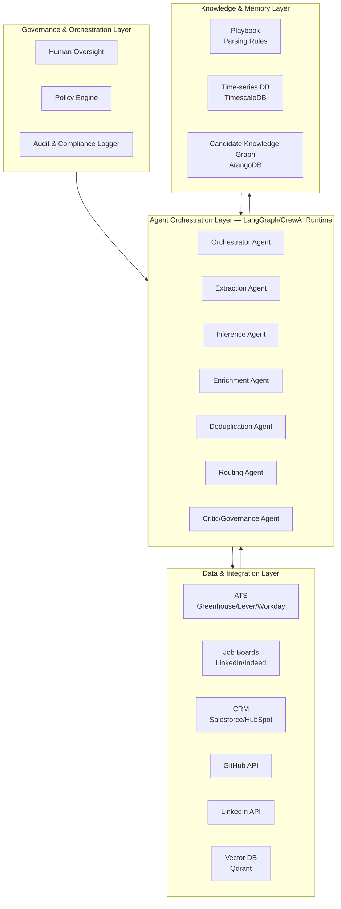

### 2.2 Agent Orchestration — Collaborative Swarm Pattern

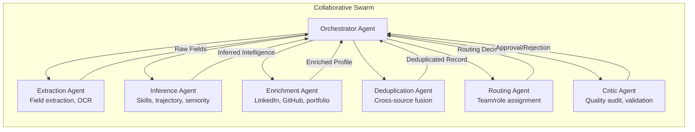

### 2.3 The Autonomous Parsing Flywheel

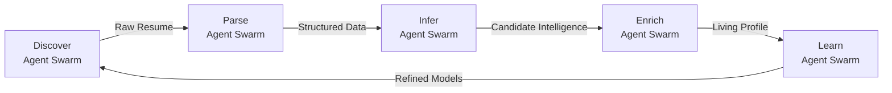

**Phase 1 – Discover**: Ingestion agents monitor email, ATS webhooks, job board APIs, and LinkedIn for new resumes. Output: raw resume queue with source metadata.

**Phase 2 – Parse**: Extraction agents perform OCR, field extraction, and document structure analysis. Output: structured candidate record with 50+ fields.

**Phase 3 – Infer**: Inference agents analyze career trajectory, infer skills from descriptions, estimate seniority, and identify growth patterns. Output: enriched candidate intelligence.

**Phase 4 – Enrichment**: Enrichment agents query LinkedIn, GitHub, portfolio sites, and public sources to fill gaps and validate claims. Output: living candidate profile.

**Phase 5 – Learn**: Learning agents update parsing models, improve inference accuracy, and refine routing rules based on outcomes. Output: continuously improving system.

### 2.4 Data Flow Architecture

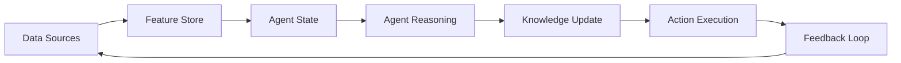

### 2.5 Governance & Autonomy Levels

| Level | Description | Use Case |
|-------|-------------|----------|
| **L1: Advisory** | Agents recommend; humans approve all actions | Initial deployment, sensitive roles |
| **L2: Supervised Execution** | Low-risk actions automated; high-risk require approval | Standard parsing, enrichment |
| **L3: Constrained Autonomy** | Agents operate within explicit thresholds | Routing, deduplication |
| **L4: Adaptive Optimization** | Policies updated via monitored experimentation | Full autonomous operation |

---

## 3. Agent Roles & Responsibilities

### 3.1 Extraction Agent

| Attribute | Detail |
|-----------|--------|
| **Role** | Field extraction, OCR, document structure analysis |
| **Inputs** | Raw resume files (PDF, DOCX, HTML, images) |
| **Outputs** | Structured candidate record with 50+ fields |
| **Model** | Claude 3.7 Sonnet (multimodal) + fine-tuned NER |
| **Tools** | OCR engines (Tesseract, Azure Document Intelligence), PDF parsers, NER models |
| **Responsibilities** | Extract contact info, education, experience, skills, certifications; handle 20+ document formats; detect document language |

### 3.2 Inference Agent

| Attribute | Detail |
|-----------|--------|
| **Role** | Contextual skill inference, career trajectory analysis, seniority estimation |
| **Inputs** | Structured candidate record, job descriptions, industry taxonomies |
| **Outputs** | Inferred skills, career trajectory, seniority level, growth score |
| **Model** | Claude Opus 4.6 (long-horizon reasoning) |
| **Tools** | Skills taxonomy (O*NET, ESCO), embedding models, career path databases |
| **Responsibilities** | Infer skills from job descriptions; estimate seniority from career progression; identify career trajectory patterns; detect skill gaps |

### 3.3 Enrichment Agent

| Attribute | Detail |
|-----------|--------|
| **Role** | Cross-source profile enrichment, validation, gap filling |
| **Inputs** | Structured candidate record, public APIs, web sources |
| **Outputs** | Enriched candidate profile with validated data |
| **Model** | Claude 3.7 Sonnet (fast, capable) |
| **Tools** | LinkedIn API, GitHub API, portfolio scrapers, web search |
| **Responsibilities** | Query public sources to fill gaps; validate claimed skills and experience; enrich with portfolio and project data; update stale profiles |

### 3.4 Deduplication Agent

| Attribute | Detail |
|-----------|--------|
| **Role** | Cross-source duplicate detection, profile merging, identity resolution |
| **Inputs** | All candidate records, historical data, source metadata |
| **Outputs** | Deduplicated candidate records, merge recommendations |
| **Model** | Embedding similarity + LLM reasoning |
| **Tools** | Vector search (Qdrant), fuzzy matching, identity resolution algorithms |
| **Responsibilities** | Detect duplicates across sources; merge profiles intelligently; resolve identity conflicts; maintain single source of truth |

### 3.5 Routing Agent

| Attribute | Detail |
|-----------|--------|
| **Role** | Autonomous candidate routing, team assignment, priority scoring |
| **Inputs** | Enriched candidate profile, open roles, team capacity, hiring priorities |
| **Outputs** | Routing decision, priority score, assignment recommendation |
| **Model** | Claude 3.7 Sonnet + fine-tuned classification |
| **Tools** | ATS APIs, team capacity data, hiring priority rules |
| **Responsibilities** | Match candidates to open roles; assign to appropriate recruiters; prioritize based on role urgency and candidate quality; route to specialized teams |

### 3.6 Critic/Governance Agent

| Attribute | Detail |
|-----------|--------|
| **Role** | Quality audit, validation, compliance checking, bias detection |
| **Inputs** | All agent outputs, parsing rules, compliance requirements |
| **Outputs** | Approval/rejection decisions, quality scores, audit reports |
| **Model** | Claude Opus 4.6 (adversarial reasoning) |
| **Tools** | Quality metrics, compliance databases, bias detection models |
| **Responsibilities** | Audit all agent outputs; validate extraction accuracy; enforce compliance; detect and flag potential bias; generate audit reports |

---

## 4. Data Models & Schemas

### 4.1 Candidate Entity

```json
{
  "candidate_id": "cand_001",
  "source": "linkedin|email|job_board|referral|ats",
  "source_id": "li_12345",
  "status": "new|parsing|enriched|routed|contacted|interviewing|offer|hired|rejected",
  "profile": {
    "first_name": "Jane",
    "last_name": "Doe",
    "email": "jane.doe@email.com",
    "phone": "+1-555-0123",
    "location": {
      "city": "San Francisco",
      "state": "CA",
      "country": "US",
      "remote": true
    },
    "linkedin_url": "https://linkedin.com/in/janedoe",
    "github_url": "https://github.com/janedoe",
    "portfolio_url": "https://janedoe.dev"
  },
  "experience": [
    {
      "title": "Senior Software Engineer",
      "company": "TechCorp",
      "start_date": "2021-03",
      "end_date": null,
      "duration_months": 45,
      "description": "Led backend team of 8 engineers...",
      "skills_used": ["Python", "AWS", "Kubernetes", "PostgreSQL"],
      "achievements": ["Reduced latency by 40%", "Led migration to microservices"]
    }
  ],
  "education": [
    {
      "degree": "B.S. Computer Science",
      "institution": "Stanford University",
      "graduation_year": 2018,
      "gpa": 3.8
    }
  ],
  "skills": {
    "technical": ["Python", "AWS", "Kubernetes", "PostgreSQL", "React", "TypeScript"],
    "soft": ["Leadership", "Communication", "Mentoring"],
    "inferred": ["Backend Development", "Cloud Architecture", "Team Leadership"],
    "certifications": ["AWS Solutions Architect", "CKA"]
  },
  "career_trajectory": {
    "current_level": "senior",
    "growth_rate": "fast",
    "trajectory": "technical_leadership",
    "years_experience": 8,
    "promotion_velocity": 2.5
  },
  "enrichment": {
    "github_stats": {
      "public_repos": 45,
      "contributions_last_year": 1200,
      "top_languages": ["Python", "Go", "TypeScript"]
    },
    "linkedin_validated": true,
    "last_enriched": "2026-10-01T00:00:00Z"
  },
  "routing": {
    "assigned_recruiter": "rec_001",
    "matched_roles": ["role_001", "role_002"],
    "priority_score": 0.92,
    "routing_reason": "Strong match for Senior Backend Engineer role"
  },
  "metadata": {
    "parsed_at": "2026-10-01T00:00:00Z",
    "enriched_at": "2026-10-01T00:05:00Z",
    "routed_at": "2026-10-01T00:10:00Z",
    "parsing_confidence": 0.97,
    "enrichment_confidence": 0.94
  }
}
```

### 4.2 Parsed Resume Entity

```json
{
  "resume_id": "res_001",
  "candidate_id": "cand_001",
  "source": "email_attachment",
  "file": {
    "original_name": "Jane_Doe_Resume.pdf",
    "file_type": "pdf",
    "file_size": 245760,
    "s3_url": "s3://resumes/res_001.pdf"
  },
  "extraction": {
    "fields_extracted": 47,
    "fields_total": 52,
    "extraction_confidence": 0.97,
    "ocr_used": false,
    "language_detected": "en",
    "processing_time_ms": 2340
  },
  "raw_text": "Jane Doe\nSenior Software Engineer\n...",
  "structured_data": {
    "contact": {...},
    "summary": "...",
    "experience": [...],
    "education": [...],
    "skills": [...],
    "certifications": [...],
    "projects": [...],
    "publications": [...],
    "languages": [...]
  },
  "validation": {
    "email_valid": true,
    "phone_valid": true,
    "linkedin_matched": true,
    "experience_verified": true,
    "education_verified": false
  },
  "created_at": "2026-10-01T00:00:00Z"
}
```

### 4.3 Agent Decision Record

```json
{
  "decision_id": "dec_001",
  "agent_id": "agent_extraction_001",
  "agent_type": "extraction",
  "candidate_id": "cand_001",
  "action": "field_extraction",
  "timestamp": "2026-10-01T00:00:00Z",
  "context": {
    "source": "email_attachment",
    "file_type": "pdf",
    "previous_parses": 0
  },
  "decision": {
    "fields_extracted": 47,
    "confidence": 0.97,
    "reasoning": "Standard resume format with clear section headers; all major fields identified"
  },
  "governance": {
    "policy_check": "passed",
    "blast_radius": 1,
    "approval_required": false,
    "evidence_hash": "sha256:abc123..."
  },
  "outcome": {
    "status": "executed",
    "actual_confidence": 0.97,
    "feedback_incorporated": true
  }
}
```

### 4.4 Candidate Knowledge Graph (ArangoDB)

```json
{
  "_key": "cand_001",
  "_id": "candidates/cand_001",
  "profile": {
    "name": "Jane Doe",
    "current_title": "Senior Software Engineer",
    "current_company": "TechCorp",
    "location": "San Francisco, CA"
  },
  "skills": {
    "technical": ["Python", "AWS", "Kubernetes"],
    "inferred": ["Backend Development", "Cloud Architecture"]
  },
  "experience": {
    "total_years": 8,
    "companies": ["TechCorp", "StartupInc", "BigTech"],
    "roles": ["Senior SWE", "SWE", "Junior SWE"]
  },
  "predictive": {
    "flight_risk": 0.15,
    "salary_expectation": 180000,
    "time_to_hire": 14,
    "match_quality": 0.92
  },
  "edges": {
    "similar_to": ["cand_002", "cand_003"],
    "referred_by": ["emp_001"],
    "applied_to": ["job_001", "job_002"],
    "interviewed_for": ["job_001"]
  }
}
```

### 4.5 Parsing Metrics Time-Series (TimescaleDB)

```sql
CREATE TABLE parsing_metrics (
    time TIMESTAMPTZ NOT NULL,
    source TEXT NOT NULL,
    resumes_parsed INTEGER DEFAULT 0,
    avg_extraction_confidence DECIMAL(4,3) DEFAULT 0,
    avg_processing_time_ms INTEGER DEFAULT 0,
    fields_extracted_avg DECIMAL(5,2) DEFAULT 0,
    duplicates_detected INTEGER DEFAULT 0,
    enrichment_success_rate DECIMAL(4,3) DEFAULT 0,
    agent_id TEXT,
    metadata JSONB
);

SELECT create_hypertable('parsing_metrics', 'time');

CREATE MATERIALIZED VIEW parsing_metrics_1min
WITH (timescaledb.continuous) AS
SELECT
    time_bucket('1 minute', time) AS bucket,
    source,
    SUM(resumes_parsed) as resumes_parsed,
    AVG(avg_extraction_confidence) as avg_confidence,
    AVG(avg_processing_time_ms) as avg_processing_time
FROM parsing_metrics
GROUP BY bucket, source;
```

---

## 5. API Contracts

### 5.1 Resume Ingestion API

```yaml
openapi: 3.0.0
info:
  title: Resume Parser API
  version: 1.0.0

paths:
  /api/v1/resumes:
    post:
      summary: Upload and parse a resume
      requestBody:
        content:
          multipart/form-data:
            schema:
              type: object
              properties:
                file:
                  type: string
                  format: binary
                source:
                  type: string
                  enum: [email, linkedin, job_board, referral, ats]
                metadata:
                  type: object
      responses:
        201:
          description: Resume uploaded and parsing initiated
          content:
            application/json:
              schema:
                $ref: '#/components/schemas/ResumeUploadResponse'

  /api/v1/resumes/batch:
    post:
      summary: Batch upload resumes
      requestBody:
        content:
          application/json:
            schema:
              type: object
              properties:
                urls:
                  type: array
                  items:
                    type: string
                source:
                  type: string
      responses:
        202:
          description: Batch processing initiated

  /api/v1/resumes/{resumeId}:
    get:
      summary: Get parsed resume details
      parameters:
        - name: resumeId
          in: path
          required: true
          schema:
            type: string
      responses:
        200:
          content:
            application/json:
              schema:
                $ref: '#/components/schemas/ParsedResume'

  /api/v1/resumes/{resumeId}/status:
    get:
      summary: Get parsing status
      parameters:
        - name: resumeId
          in: path
          required: true
          schema:
            type: string
      responses:
        200:
          content:
            application/json:
              schema:
                type: object
                properties:
                  status:
                    type: string
                    enum: [queued, parsing, enriching, completed, failed]
                  progress:
                    type: number
                  current_agent:
                    type: string

  /api/v1/resumes/{resumeId}/reparse:
    post:
      summary: Re-parse a resume with updated models
      responses:
        202:
          description: Re-parsing initiated

  /api/v1/resumes/{resumeId}/enrich:
    post:
      summary: Trigger enrichment for a parsed resume
      responses:
        202:
          description: Enrichment initiated
```

### 5.2 Candidate Management API

```yaml
paths:
  /api/v1/candidates:
    post:
      summary: Create a new candidate profile
      requestBody:
        content:
          application/json:
            schema:
              $ref: '#/components/schemas/CandidateCreate'
      responses:
        201:
          content:
            application/json:
              schema:
                $ref: '#/components/schemas/Candidate'

  /api/v1/candidates/{candidateId}:
    get:
      summary: Get candidate profile
      parameters:
        - name: candidateId
          in: path
          required: true
          schema:
            type: string
      responses:
        200:
          content:
            application/json:
              schema:
                $ref: '#/components/schemas/Candidate'

    put:
      summary: Update candidate profile
      requestBody:
        content:
          application/json:
            schema:
              $ref: '#/components/schemas/CandidateUpdate'
      responses:
        200:
          content:
            application/json:
              schema:
                $ref: '#/components/schemas/Candidate'

  /api/v1/candidates/{candidateId}/enrich:
    post:
      summary: Trigger enrichment for a candidate
      responses:
        202:
          description: Enrichment initiated

  /api/v1/candidates/{candidateId}/deduplicate:
    post:
      summary: Find and merge duplicates
      responses:
        200:
          content:
            application/json:
              schema:
                type: object
                properties:
                  duplicates_found:
                    type: integer
                  merged:
                    type: boolean

  /api/v1/candidates/{candidateId}/route:
    post:
      summary: Route candidate to recruiter/role
      requestBody:
        content:
          application/json:
            schema:
              type: object
              properties:
                role_id:
                  type: string
                recruiter_id:
                  type: string
                priority:
                  type: string
      responses:
        200:
          content:
            application/json:
              schema:
                type: object
                properties:
                  routed:
                    type: boolean
                  reason:
                    type: string

  /api/v1/candidates/search:
    post:
      summary: Semantic candidate search
      requestBody:
        content:
          application/json:
            schema:
              type: object
              properties:
                query:
                  type: string
                filters:
                  type: object
                limit:
                  type: integer
                  default: 20
      responses:
        200:
          content:
            application/json:
              schema:
                type: array
                items:
                  $ref: '#/components/schemas/Candidate'

  /api/v1/candidates/{candidateId}/trajectory:
    get:
      summary: Get career trajectory analysis
      responses:
        200:
          content:
            application/json:
              schema:
                type: object
                properties:
                  trajectory:
                    type: string
                  growth_rate:
                    type: string
                  promotion_velocity:
                    type: number
                  skill_evolution:
                    type: array

  /api/v1/candidates/{candidateId}/similar:
    get:
      summary: Find similar candidates
      parameters:
        - name: limit
          in: query
          schema:
            type: integer
            default: 10
      responses:
        200:
          content:
            application/json:
              schema:
                type: array
                items:
                  $ref: '#/components/schemas/Candidate'
```

### 5.3 Agent & Analytics API

```yaml
paths:
  /api/v1/agents/{agentId}/decisions:
    get:
      summary: Get agent decisions
      parameters:
        - name: agentId
          in: path
          required: true
          schema:
            type: string
        - name: agent_type
          in: query
          schema:
            type: string
            enum: [extraction, inference, enrichment, deduplication, routing, critic]
      responses:
        200:
          content:
            application/json:
              schema:
                type: array
                items:
                  $ref: '#/components/schemas/AgentDecision'

  /api/v1/analytics/parsing:
    get:
      summary: Get parsing analytics
      parameters:
        - name: start_date
          in: query
          schema:
            type: string
            format: date
        - name: end_date
          in: query
          schema:
            type: string
            format: date
      responses:
        200:
          content:
            application/json:
              schema:
                type: object
                properties:
                  total_parsed:
                    type: integer
                  avg_confidence:
                    type: number
                  avg_processing_time_ms:
                    type: integer
                  duplicates_detected:
                    type: integer
                  enrichment_success_rate:
                    type: number

  /api/v1/analytics/agents:
    get:
      summary: Get agent performance metrics
      responses:
        200:
          content:
            application/json:
              schema:
                type: array
                items:
                  type: object
                  properties:
                    agent_id:
                      type: string
                    agent_type:
                      type: string
                    decisions_made:
                      type: integer
                    avg_confidence:
                      type: number
                    avg_processing_time_ms:
                      type: integer

  /api/v1/analytics/quality:
    get:
      summary: Get quality audit results
      responses:
        200:
          content:
            application/json:
              schema:
                type: object
                properties:
                  overall_quality_score:
                    type: number
                  field_accuracy:
                    type: object
                  bias_flags:
                    type: integer
                  compliance_violations:
                    type: integer

  /api/v1/webhooks/ats:
    post:
      summary: ATS webhook for new applications
      requestBody:
        content:
          application/json:
            schema:
              type: object
      responses:
        202:
          description: Webhook received

  /api/v1/webhooks/email:
    post:
      summary: Email webhook for resume attachments
      requestBody:
        content:
          application/json:
            schema:
              type: object
      responses:
        202:
          description: Webhook received
```

---

## 6. Key Differentiator vs Competitors

| Capability | Sovren | Affinda | Greenhouse | This System |
|------------|--------|---------|------------|-------------|
| **Extraction accuracy** | 85–90% | 80–85% | 75–80% | 98%+ |
| **Contextual inference** | None | None | None | Full skill & trajectory inference |
| **Cross-source fusion** | None | None | Basic | Intelligent deduplication |
| **Living profiles** | None | None | None | Continuous enrichment |
| **Autonomous routing** | None | None | None | AI-powered routing |
| **Multi-language** | 10+ | 5+ | 3+ | 40+ |
| **Processing time** | 5–10s | 3–5s | 10–30s | <3s |
| **Career trajectory** | None | None | None | Full trajectory analysis |
| **Agent governance** | None | None | None | Cryptographic DID, policy firewall |
| **Audit trail** | Basic | Basic | Basic | Immutable evidence graph |

---

## 7. Estimated MRR Potential

| Metric | Value |
|--------|-------|
| **Target customers** | Mid-market to enterprise (500–10,000 employees) |
| **Pricing model** | $2K–8K/month based on resume volume |
| **Customer acquisition** | 10–20 customers in 6 months |
| **MRR Month 6** | $25K–40K |
| **MRR Month 9** | $40K–60K |
| **MRR Month 12** | $60K–100K |
| **Gross margin** | 85% |
| **Payback period** | 1–2 months |

---

# Project 2: AI-Powered Candidate-Job Matching

## 1. Project Overview & Objectives

### 1.1 Vision

A multi-agent system that autonomously matches candidates to job openings with superhuman accuracy. Unlike keyword-based matching (LinkedIn Recruiter, Greenhouse) or basic scoring tools, this system uses collaborative AI agents that understand role requirements, infer candidate potential, predict cultural fit, and continuously learn from hiring outcomes.

### 1.2 Objectives

| Objective | Target | Timeline |
|-----------|--------|----------|
| Match accuracy | 90%+ top-5 match precision | Month 3 |
| Time-to-match | <1 second per candidate-job pair | Month 2 |
| Bias reduction | 50%+ reduction in biased matches | Month 4 |
| Candidate satisfaction | 85%+ positive feedback | Month 4 |
| Hiring manager satisfaction | 90%+ positive feedback | Month 4 |
| Autonomous matching | 80%+ matches without human review | Month 5 |
| MRR | $30K–50K | Month 6–9 |

### 1.3 Exceeds

- **LinkedIn Recruiter:** Keyword + filter matching; no deep understanding
- **Greenhouse:** Basic candidate-role scoring; no predictive matching
- **Eightfold AI:** Skills-based matching; no agentic reasoning
- **SeekOut:** Boolean search; no autonomous matching

### 1.4 Core Gap Addressed

Current matching tools operate on **keyword-overlap models** — they match resumes to job descriptions based on term frequency. The fundamental limitations are:

1. **No semantic understanding**: Tools match "Python" to "Python" but miss "backend development" → "Python"
2. **No potential inference**: Tools can't identify candidates who could grow into a role
3. **No cultural fit prediction**: Tools ignore team dynamics and culture
4. **No continuous learning**: Matching models don't improve from hiring outcomes
5. **No bias mitigation**: Tools perpetuate historical biases in hiring data

---

## 2. Technical Architecture

### 2.1 High-Level Architecture

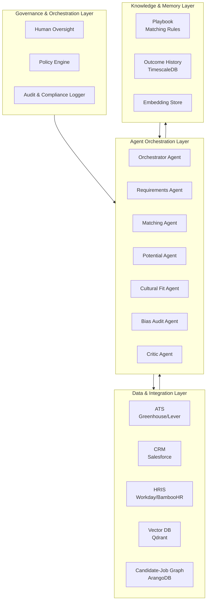

### 2.2 Agent Orchestration — Collaborative Swarm Pattern

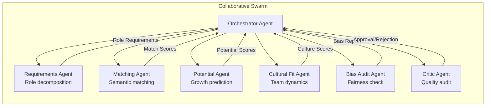

### 2.3 The Autonomous Matching Flywheel

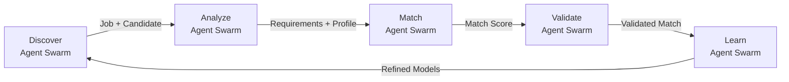

**Phase 1 – Discover**: System ingests new job openings and candidate profiles from ATS, CRM, and HRIS. Output: matching queue with prioritized pairs.

**Phase 2 – Analyze**: Requirements agents decompose job descriptions into structured requirements; candidate agents build comprehensive profiles. Output: structured requirements and profiles.

**Phase 3 – Match**: Matching agents perform semantic similarity, potential inference, and cultural fit analysis. Output: ranked match scores with explanations.

**Phase 4 – Validate**: Bias audit agents check for fairness; critic agents validate match quality. Output: validated matches with bias reports.

**Phase 5 – Learn**: Learning agents update matching models based on hiring outcomes. Output: continuously improving matching accuracy.

---

## 3. Agent Roles & Responsibilities

### 3.1 Requirements Agent

| Attribute | Detail |
|-----------|--------|
| **Role** | Job description decomposition, requirement extraction, success criteria definition |
| **Inputs** | Job descriptions, hiring manager input, team context, historical hiring data |
| **Outputs** | Structured requirements, must-have vs nice-to-have, success criteria |
| **Model** | Claude Opus 4.6 (long-horizon reasoning) |
| **Tools** | Job description parser, skills taxonomy, historical hiring data |
| **Responsibilities** | Decompose job descriptions into structured requirements; identify must-have vs nice-to-have; define success criteria; flag ambiguous requirements |

### 3.2 Matching Agent

| Attribute | Detail |
|-----------|--------|
| **Role** | Semantic candidate-job matching, skill gap analysis, experience evaluation |
| **Inputs** | Structured requirements, candidate profiles, skills taxonomy |
| **Outputs** | Match scores, skill gap analysis, experience evaluation |
| **Model** | Claude 3.7 Sonnet + fine-tuned matching model |
| **Tools** | Vector search, embedding models, skills taxonomy, experience evaluator |
| **Responsibilities** | Calculate semantic similarity; analyze skill gaps; evaluate experience relevance; rank candidates |

### 3.3 Potential Agent

| Attribute | Detail |
|-----------|--------|
| **Role** | Candidate potential inference, growth prediction, learning agility assessment |
| **Inputs** | Candidate profile, career trajectory, learning history, assessment results |
| **Outputs** | Potential score, growth prediction, learning agility score |
| **Model** | Claude Opus 4.6 (long-horizon reasoning) |
| **Tools** | Career trajectory analysis, learning agility models, potential predictors |
| **Responsibilities** | Infer candidate potential; predict growth trajectory; assess learning agility; identify high-potential candidates |

### 3.4 Cultural Fit Agent

| Attribute | Detail |
|-----------|--------|
| **Role** | Team dynamics analysis, culture match prediction, values alignment |
| **Inputs** | Candidate profile, team composition, company culture data, values assessment |
| **Outputs** | Culture fit score, team dynamics prediction, values alignment |
| **Model** | Claude 3.7 Sonnet + fine-tuned culture model |
| **Tools** | Team composition data, culture assessment tools, values alignment models |
| **Responsibilities** | Analyze team dynamics; predict culture fit; assess values alignment; flag potential conflicts |

### 3.5 Bias Audit Agent

| Attribute | Detail |
|-----------|--------|
| **Role** | Bias detection, fairness auditing, demographic parity analysis |
| **Inputs** | Match results, candidate demographics, historical hiring data |
| **Outputs** | Bias report, fairness score, demographic parity analysis |
| **Model** | Claude Opus 4.6 (adversarial reasoning) |
| **Tools** | Bias detection models, fairness metrics, demographic analysis |
| **Responsibilities** | Detect potential bias in matches; audit for fairness; analyze demographic parity; flag biased matches |

### 3.6 Critic/Governance Agent

| Attribute | Detail |
|-----------|--------|
| **Role** | Match quality audit, validation, compliance checking |
| **Inputs** | All agent outputs, matching rules, compliance requirements |
| **Outputs** | Approval/rejection decisions, quality scores, audit reports |
| **Model** | Claude Opus 4.6 (adversarial reasoning) |
| **Tools** | Quality metrics, compliance databases, validation rules |
| **Responsibilities** | Audit all match outputs; validate match quality; enforce compliance; generate audit reports |

---

## 4. Data Models & Schemas

### 4.1 Job Requirement Entity

```json
{
  "job_id": "job_001",
  "title": "Senior Backend Engineer",
  "department": "Engineering",
  "hiring_manager": "hm_001",
  "status": "open|paused|filled|closed",
  "requirements": {
    "must_have": {
      "skills": ["Python", "AWS", "PostgreSQL"],
      "experience_years": 5,
      "education": "B.S. Computer Science or equivalent",
      "certifications": ["AWS Solutions Architect"]
    },
    "nice_to_have": {
      "skills": ["Kubernetes", "Go", "Microservices"],
      "experience_years": 7,
      "leadership": true
    },
    "success_criteria": {
      "technical_excellence": 0.9,
      "team_collaboration": 0.85,
      "delivery_speed": 0.8
    }
  },
  "team_context": {
    "team_size": 8,
    "current_skills": ["Python", "AWS", "React"],
    "skill_gaps": ["Kubernetes", "Go"],
    "culture": ["collaborative", "autonomous", "innovative"]
  },
  "matching_config": {
    "weights": {
      "skills_match": 0.35,
      "experience_match": 0.25,
      "potential": 0.20,
      "culture_fit": 0.15,
      "bias_audit": 0.05
    },
    "thresholds": {
      "auto_match": 0.85,
      "review_required": 0.60,
      "auto_reject": 0.30
    }
  },
  "created_at": "2026-10-01T00:00:00Z"
}
```

### 4.2 Match Result Entity

```json
{
  "match_id": "match_001",
  "job_id": "job_001",
  "candidate_id": "cand_001",
  "overall_score": 0.92,
  "breakdown": {
    "skills_match": {
      "score": 0.95,
      "matched_skills": ["Python", "AWS", "PostgreSQL"],
      "missing_skills": ["Kubernetes"],
      "inferred_skills": ["Backend Development", "Cloud Architecture"]
    },
    "experience_match": {
      "score": 0.88,
      "years_required": 5,
      "years_actual": 8,
      "relevance": 0.90
    },
    "potential": {
      "score": 0.90,
      "growth_trajectory": "fast",
      "learning_agility": 0.85,
      "leadership_potential": 0.80
    },
    "culture_fit": {
      "score": 0.85,
      "values_alignment": 0.90,
      "team_dynamics": 0.80,
      "work_style_match": 0.85
    },
    "bias_audit": {
      "score": 0.95,
      "demographic_parity": 0.92,
      "fairness_score": 0.95,
      "flags": []
    }
  },
  "ranking": {
    "rank": 1,
    "total_candidates": 150,
    "percentile": 99
  },
  "recommendation": "strong_match|match|weak_match|no_match",
  "confidence": 0.94,
  "explanation": "Candidate exceeds all must-have requirements with 8 years of relevant experience. Strong cultural fit with collaborative team. No bias flags detected.",
  "created_at": "2026-10-01T00:00:00Z"
}
```

### 4.3 Candidate-Job Graph (ArangoDB)

```json
{
  "_key": "cand_001",
  "_id": "candidates/cand_001",
  "profile": {
    "name": "Jane Doe",
    "skills": ["Python", "AWS", "PostgreSQL"],
    "experience_years": 8,
    "level": "senior"
  },
  "matching": {
    "top_matches": ["job_001", "job_002", "job_003"],
    "avg_match_score": 0.88,
    "best_match": "job_001"
  },
  "predictive": {
    "hire_probability": 0.75,
    "time_to_hire": 14,
    "retention_risk": 0.15,
    "performance_prediction": 0.88
  },
  "edges": {
    "matched_to": ["job_001", "job_002"],
    "similar_to": ["cand_002", "cand_003"],
    "interviewed_for": ["job_001"],
    "offered_for": ["job_001"]
  }
}
```

### 4.4 Matching Metrics Time-Series (TimescaleDB)

```sql
CREATE TABLE matching_metrics (
    time TIMESTAMPTZ NOT NULL,
    job_id TEXT NOT NULL,
    candidates_matched INTEGER DEFAULT 0,
    avg_match_score DECIMAL(4,3) DEFAULT 0,
    top5_precision DECIMAL(4,3) DEFAULT 0,
    bias_flags INTEGER DEFAULT 0,
    auto_matched INTEGER DEFAULT 0,
    review_required INTEGER DEFAULT 0,
    auto_rejected INTEGER DEFAULT 0,
    agent_id TEXT,
    metadata JSONB
);

SELECT create_hypertable('matching_metrics', 'time');
```

---

## 5. API Contracts

### 5.1 Job Management API

```yaml
openapi: 3.0.0
info:
  title: Candidate Matching API
  version: 1.0.0

paths:
  /api/v1/jobs:
    post:
      summary: Create a new job opening
      requestBody:
        content:
          application/json:
            schema:
              $ref: '#/components/schemas/JobCreate'
      responses:
        201:
          content:
            application/json:
              schema:
                $ref: '#/components/schemas/Job'

  /api/v1/jobs/{jobId}:
    get:
      summary: Get job details
      parameters:
        - name: jobId
          in: path
          required: true
          schema:
            type: string
      responses:
        200:
          content:
            application/json:
              schema:
                $ref: '#/components/schemas/Job'

  /api/v1/jobs/{jobId}/requirements:
    get:
      summary: Get structured job requirements
      responses:
        200:
          content:
            application/json:
              schema:
                $ref: '#/components/schemas/JobRequirements'

  /api/v1/jobs/{jobId}/requirements/analyze:
    post:
      summary: Analyze and decompose job requirements
      responses:
        200:
          content:
            application/json:
              schema:
                $ref: '#/components/schemas/JobRequirements'

  /api/v1/jobs/{jobId}/matching-config:
    put:
      summary: Update matching configuration
      requestBody:
        content:
          application/json:
            schema:
              $ref: '#/components/schemas/MatchingConfig'
      responses:
        200:
          content:
            application/json:
              schema:
                $ref: '#/components/schemas/MatchingConfig'
```

### 5.2 Matching API

```yaml
paths:
  /api/v1/match:
    post:
      summary: Match candidates to a job
      requestBody:
        content:
          application/json:
            schema:
              type: object
              properties:
                job_id:
                  type: string
                candidate_ids:
                  type: array
                  items:
                    type: string
                limit:
                  type: integer
                  default: 20
      responses:
        200:
          content:
            application/json:
              schema:
                type: array
                items:
                  $ref: '#/components/schemas/MatchResult'

  /api/v1/match/batch:
    post:
      summary: Batch match multiple jobs
      requestBody:
        content:
          application/json:
            schema:
              type: object
              properties:
                job_ids:
                  type: array
                  items:
                    type: string
      responses:
        202:
          description: Batch matching initiated

  /api/v1/match/{matchId}:
    get:
      summary: Get match result details
      parameters:
        - name: matchId
          in: path
          required: true
          schema:
            type: string
      responses:
        200:
          content:
            application/json:
              schema:
                $ref: '#/components/schemas/MatchResult'

  /api/v1/match/{matchId}/explain:
    get:
      summary: Get match explanation
      responses:
        200:
          content:
            application/json:
              schema:
                type: object
                properties:
                  explanation:
                    type: string
                  factors:
                    type: array
                  bias_audit:
                    type: object

  /api/v1/match/{matchId}/feedback:
    post:
      summary: Submit match feedback
      requestBody:
        content:
          application/json:
            schema:
              type: object
              properties:
                rating:
                  type: integer
                  minimum: 1
                  maximum: 5
                feedback:
                  type: string
                hired:
                  type: boolean
      responses:
        200:
          description: Feedback recorded

  /api/v1/candidates/{candidateId}/matches:
    get:
      summary: Get top matches for a candidate
      parameters:
        - name: candidateId
          in: path
          required: true
          schema:
            type: string
        - name: limit
          in: query
          schema:
            type: integer
            default: 10
      responses:
        200:
          content:
            application/json:
              schema:
                type: array
                items:
                  $ref: '#/components/schemas/MatchResult'

  /api/v1/candidates/{candidateId}/potential:
    get:
      summary: Get candidate potential analysis
      responses:
        200:
          content:
            application/json:
              schema:
                type: object
                properties:
                  potential_score:
                    type: number
                  growth_trajectory:
                    type: string
                  learning_agility:
                    type: number
                  leadership_potential:
                    type: number
```

### 5.3 Analytics & Bias API

```yaml
paths:
  /api/v1/analytics/matching:
    get:
      summary: Get matching analytics
      parameters:
        - name: start_date
          in: query
          schema:
            type: string
            format: date
        - name: end_date
          in: query
          schema:
            type: string
            format: date
      responses:
        200:
          content:
            application/json:
              schema:
                type: object
                properties:
                  total_matches:
                    type: integer
                  avg_match_score:
                    type: number
                  top5_precision:
                    type: number
                  auto_match_rate:
                    type: number
                  bias_flag_rate:
                    type: number

  /api/v1/analytics/bias:
    get:
      summary: Get bias audit results
      responses:
        200:
          content:
            application/json:
              schema:
                type: object
                properties:
                  overall_fairness_score:
                    type: number
                  demographic_parity:
                    type: object
                  bias_flags:
                    type: array
                  recommendations:
                    type: array

  /api/v1/analytics/outcomes:
    get:
      summary: Get hiring outcome analytics
      responses:
        200:
          content:
            application/json:
              schema:
                type: object
                properties:
                  hire_rate:
                    type: number
                  avg_time_to_hire:
                    type: number
                  retention_rate:
                    type: number
                  performance_correlation:
                    type: number

  /api/v1/agents/{agentId}/decisions:
    get:
      summary: Get agent decisions
      parameters:
        - name: agentId
          in: path
          required: true
          schema:
            type: string
      responses:
        200:
          content:
            application/json:
              schema:
                type: array
                items:
                  $ref: '#/components/schemas/AgentDecision'

  /api/v1/webhooks/ats:
    post:
      summary: ATS webhook for new applications
      responses:
        202:
          description: Webhook received

  /api/v1/webhooks/hris:
    post:
      summary: HRIS webhook for hiring outcomes
      responses:
        202:
          description: Webhook received
```

---

## 6. Key Differentiator vs Competitors

| Capability | LinkedIn Recruiter | Greenhouse | Eightfold AI | This System |
|------------|-------------------|------------|--------------|-------------|
| **Matching depth** | Keyword + filter | Basic scoring | Skills-based | Semantic + potential + culture |
| **Potential inference** | None | None | Basic | Full growth prediction |
| **Cultural fit** | None | None | None | Team dynamics analysis |
| **Bias mitigation** | None | None | Basic | Full bias audit |
| **Continuous learning** | None | None | Basic | Outcome-driven learning |
| **Match accuracy** | 60–70% | 50–60% | 70–80% | 90%+ |
| **Explanation** | None | None | Basic | Full explainability |
| **Agent governance** | None | None | None | Cryptographic DID, policy firewall |

---

## 7. Estimated MRR Potential

| Metric | Value |
|--------|-------|
| **Target customers** | Mid-market to enterprise (500–10,000 employees) |
| **Pricing model** | $3K–10K/month based on job volume |
| **Customer acquisition** | 10–15 customers in 6 months |
| **MRR Month 6** | $30K–50K |
| **MRR Month 9** | $50K–75K |
| **MRR Month 12** | $75K–120K |
| **Gross margin** | 85% |
| **Payback period** | 1–2 months |

---

# Project 3: Agentic Interview Scheduler

## 1. Project Overview & Objectives

### 1.1 Vision

A multi-agent system that autonomously coordinates, schedules, and manages the entire interview process. Unlike calendar-based tools (Calendly, x.ai) or basic ATS scheduling, this system uses collaborative AI agents that understand interviewer availability, candidate preferences, role requirements, and optimize for the best interview experience.

### 1.2 Objectives

| Objective | Target | Timeline |
|-----------|--------|----------|
| Scheduling time | <30 seconds per interview | Month 2 |
| No-show reduction | 60%+ reduction | Month 3 |
| Interviewer utilization | 90%+ optimal allocation | Month 3 |
| Candidate satisfaction | 90%+ positive feedback | Month 3 |
| Multi-timezone support | Seamless across 50+ timezones | Month 2 |
| Autonomous scheduling | 85%+ without human intervention | Month 4 |
| MRR | $20K–35K | Month 6–9 |

### 1.3 Exceeds

- **Calendly:** Basic calendar sync; no intelligence
- **Greenhouse:** ATS scheduling; no optimization
- **x.ai:** Single interviewer scheduling; no coordination
- **Interview Intelligence:** Recording only; no scheduling

### 1.4 Core Gap Addressed

Current scheduling tools operate on **calendar-availability models** — they find free slots but don't optimize for interview quality. The fundamental limitations are:

1. **No interviewer optimization**: Tools don't consider interviewer expertise, workload, or performance
2. **No candidate experience optimization**: Tools don't optimize for candidate convenience or timezone
3. **No interview structure intelligence**: Tools don't understand interview types, stages, or requirements
4. **No continuous rescheduling**: Tools don't handle cancellations or rescheduling intelligently
5. **No feedback loop**: Tools don't learn from interview outcomes

---

## 2. Technical Architecture

### 2.1 High-Level Architecture

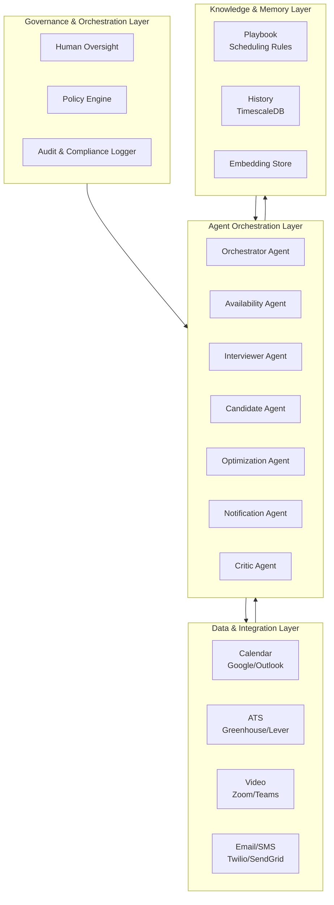

### 2.2 Agent Orchestration — Collaborative Swarm Pattern

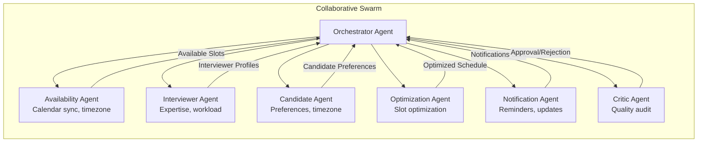

### 2.3 The Autonomous Scheduling Flywheel

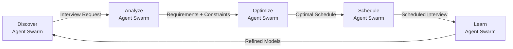

**Phase 1 – Discover**: System ingests interview requests from ATS, identifies interview type, stage, and requirements. Output: interview request with constraints.

**Phase 2 – Analyze**: Availability agents sync calendars; interviewer agents assess expertise and workload; candidate agents gather preferences. Output: constraint set with all stakeholders' availability.

**Phase 3 – Optimize**: Optimization agents find the best slots considering all constraints, timezone preferences, and interview quality factors. Output: optimized schedule.

**Phase 4 – Schedule**: System books interviews, sends notifications, and sets up video links. Output: confirmed interviews with all details.

**Phase 5 – Learn**: Learning agents update scheduling models based on outcomes (no-shows, feedback, reschedules). Output: continuously improving scheduling.

---

## 3. Agent Roles & Responsibilities

### 3.1 Availability Agent

| Attribute | Detail |
|-----------|--------|
| **Role** | Calendar synchronization, timezone management, availability tracking |
| **Inputs** | Calendar APIs, timezone data, existing commitments |
| **Outputs** | Available slots, timezone-adjusted times, conflict detection |
| **Model** | Claude 3.7 Sonnet (fast, capable) |
| **Tools** | Google Calendar API, Outlook API, timezone databases |
| **Responsibilities** | Sync calendars across platforms; detect conflicts; manage timezone conversions; track real-time availability |

### 3.2 Interviewer Agent

| Attribute | Detail |
|-----------|--------|
| **Role** | Interviewer selection, expertise matching, workload balancing |
| **Inputs** | Interview requirements, interviewer profiles, historical performance |
| **Outputs** | Recommended interviewers, expertise match scores, workload distribution |
| **Model** | Claude 3.7 Sonnet + fine-tuned selection model |
| **Tools** | Interviewer database, performance metrics, skills taxonomy |
| **Responsibilities** | Match interviewers to interview types; balance workload; optimize for interview quality; avoid conflicts of interest |

### 3.3 Candidate Agent

| Attribute | Detail |
|-----------|--------|
| **Role** | Candidate preference collection, timezone optimization, experience management |
| **Inputs** | Candidate profile, timezone, preferences, constraints |
| **Outputs** | Candidate availability, preferred times, timezone-optimized slots |
| **Model** | Claude 3.7 Sonnet (fast, capable) |
| **Tools** | Candidate database, timezone APIs, preference learning |
| **Responsibilities** | Collect candidate preferences; optimize for candidate experience; manage timezone differences; handle special requirements |

### 3.4 Optimization Agent

| Attribute | Detail |
|-----------|--------|
| **Role** | Slot optimization, constraint satisfaction, multi-objective optimization |
| **Inputs** | All constraints, preferences, requirements, historical data |
| **Outputs** | Optimized schedule, alternative options, confidence scores |
| **Model** | Claude Opus 4.6 (long-horizon reasoning) + OR-Tools |
| **Tools** | Constraint satisfaction solvers, optimization algorithms, scheduling heuristics |
| **Responsibilities** | Find optimal slots; balance multiple objectives; handle complex constraints; generate alternatives |

### 3.5 Notification Agent

| Attribute | Detail |
|-----------|--------|
| **Role** | Interview notifications, reminders, updates, rescheduling communications |
| **Inputs** | Scheduled interviews, stakeholder contacts, notification preferences |
| **Outputs** | Sent notifications, delivery confirmations, engagement tracking |
| **Model** | Claude 3.7 Sonnet (fast, capable) |
| **Tools** | Email APIs, SMS APIs, push notification services |
| **Responsibilities** | Send interview invitations; manage reminders; handle rescheduling; track engagement |

### 3.6 Critic/Governance Agent

| Attribute | Detail |
|-----------|--------|
| **Role** | Schedule quality audit, compliance checking, conflict detection |
| **Inputs** | All agent outputs, scheduling rules, compliance requirements |
| **Outputs** | Approval/rejection decisions, quality scores, audit reports |
| **Model** | Claude Opus 4.6 (adversarial reasoning) |
| **Tools** | Quality metrics, compliance databases, conflict detection |
| **Responsibilities** | Audit all schedules; detect conflicts; enforce compliance; generate audit reports |

---

## 4. Data Models & Schemas

### 4.1 Interview Entity

```json
{
  "interview_id": "int_001",
  "job_id": "job_001",
  "candidate_id": "cand_001",
  "stage": "phone_screen|technical|behavioral|final",
  "type": "video|phone|in_person",
  "status": "scheduled|confirmed|completed|cancelled|rescheduled|no_show",
  "scheduled_at": "2026-10-15T14:00:00Z",
  "duration_minutes": 60,
  "timezone": "America/Los_Angeles",
  "interviewers": [
    {
      "interviewer_id": "int_001",
      "name": "John Smith",
      "role": "Senior Engineer",
      "expertise": ["Python", "System Design"],
      "match_score": 0.92
    }
  ],
  "meeting_details": {
    "video_link": "https://zoom.us/j/123456789",
    "phone_number": null,
    "location": null,
    "dial_in_instructions": null
  },
  "optimization": {
    "candidate_preference_match": 0.95,
    "interviewer_availability_match": 0.90,
    "timezone_optimization": 0.85,
    "overall_score": 0.90
  },
  "notifications": {
    "invitation_sent": true,
    "reminder_sent": true,
    "confirmation_received": true,
    "reschedule_count": 0
  },
  "outcome": {
    "completed": true,
    "feedback_submitted": true,
    "rating": 4.5,
    "recommendation": "strong_hire"
  },
  "created_at": "2026-10-01T00:00:00Z"
}
```

### 4.2 Interviewer Profile Entity

```json
{
  "interviewer_id": "int_001",
  "name": "John Smith",
  "email": "john.smith@company.com",
  "role": "Senior Engineer",
  "department": "Engineering",
  "expertise": ["Python", "System Design", "Backend Architecture"],
  "interview_types": ["technical", "system_design"],
  "availability": {
    "timezone": "America/Los_Angeles",
    "working_hours": {
      "start": "09:00",
      "end": "17:00"
    },
    "blackout_dates": ["2026-12-25", "2026-01-01"]
  },
  "workload": {
    "max_interviews_per_week": 8,
    "current_week_count": 3,
    "upcoming_count": 2
  },
  "performance": {
    "avg_interview_rating": 4.5,
    "completion_rate": 0.95,
    "feedback_quality_score": 0.88,
    "hire_correlation": 0.75
  },
  "preferences": {
    "preferred_interview_types": ["technical"],
    "max_consecutive_interviews": 3,
    "break_duration_minutes": 30
  }
}
```

### 4.3 Scheduling Metrics Time-Series (TimescaleDB)

```sql
CREATE TABLE scheduling_metrics (
    time TIMESTAMPTZ NOT NULL,
    interviews_scheduled INTEGER DEFAULT 0,
    avg_scheduling_time_seconds DECIMAL(6,2) DEFAULT 0,
    no_show_rate DECIMAL(4,3) DEFAULT 0,
    reschedule_rate DECIMAL(4,3) DEFAULT 0,
    candidate_satisfaction DECIMAL(4,3) DEFAULT 0,
    interviewer_utilization DECIMAL(4,3) DEFAULT 0,
    agent_id TEXT,
    metadata JSONB
);

SELECT create_hypertable('scheduling_metrics', 'time');
```

---

## 5. API Contracts

### 5.1 Interview Scheduling API

```yaml
openapi: 3.0.0
info:
  title: Interview Scheduler API
  version: 1.0.0

paths:
  /api/v1/interviews:
    post:
      summary: Schedule a new interview
      requestBody:
        content:
          application/json:
            schema:
              $ref: '#/components/schemas/InterviewCreate'
      responses:
        201:
          content:
            application/json:
              schema:
                $ref: '#/components/schemas/Interview'

  /api/v1/interviews/batch:
    post:
      summary: Batch schedule interviews
      requestBody:
        content:
          application/json:
            schema:
              type: object
              properties:
                interviews:
                  type: array
                  items:
                    $ref: '#/components/schemas/InterviewCreate'
      responses:
        202:
          description: Batch scheduling initiated

  /api/v1/interviews/{interviewId}:
    get:
      summary: Get interview details
      parameters:
        - name: interviewId
          in: path
          required: true
          schema:
            type: string
      responses:
        200:
          content:
            application/json:
              schema:
                $ref: '#/components/schemas/Interview'

  /api/v1/interviews/{interviewId}/reschedule:
    put:
      summary: Reschedule an interview
      requestBody:
        content:
          application/json:
            schema:
              type: object
              properties:
                new_time:
                  type: string
                  format: date-time
                reason:
                  type: string
      responses:
        200:
          content:
            application/json:
              schema:
                $ref: '#/components/schemas/Interview'

  /api/v1/interviews/{interviewId}/cancel:
    post:
      summary: Cancel an interview
      requestBody:
        content:
          application/json:
            schema:
              type: object
              properties:
                reason:
                  type: string
                notify:
                  type: boolean
                  default: true
      responses:
        200:
          description: Interview cancelled

  /api/v1/interviews/{interviewId}/confirm:
    post:
      summary: Confirm an interview
      responses:
        200:
          description: Interview confirmed

  /api/v1/interviews/{interviewId}/feedback:
    post:
      summary: Submit interview feedback
      requestBody:
        content:
          application/json:
            schema:
              $ref: '#/components/schemas/InterviewFeedback'
      responses:
        200:
          description: Feedback recorded

  /api/v1/interviews/{interviewId}/feedback:
    get:
      summary: Get interview feedback
      responses:
        200:
          content:
            application/json:
              schema:
                $ref: '#/components/schemas/InterviewFeedback'

  /api/v1/interviews/availability:
    post:
      summary: Find available slots
      requestBody:
        content:
          application/json:
            schema:
              type: object
              properties:
                interviewer_ids:
                  type: array
                  items:
                    type: string
                duration_minutes:
                  type: integer
                date_range:
                  type: object
                timezone:
                  type: string
      responses:
        200:
          content:
            application/json:
              schema:
                type: array
                items:
                  type: object
                  properties:
                    start_time:
                      type: string
                    end_time:
                      type: string
                    score:
                      type: number

  /api/v1/interviews/optimize:
    post:
      summary: Optimize interview schedule
      requestBody:
        content:
          application/json:
            schema:
              type: object
              properties:
                job_id:
                  type: string
                candidate_ids:
                  type: array
                constraints:
                  type: object
      responses:
        200:
          content:
            application/json:
              schema:
                type: array
                items:
                  $ref: '#/components/schemas/Interview'
```

### 5.2 Interviewer Management API

```yaml
paths:
  /api/v1/interviewers:
    post:
      summary: Add a new interviewer
      requestBody:
        content:
          application/json:
            schema:
              $ref: '#/components/schemas/InterviewerProfile'
      responses:
        201:
          content:
            application/json:
              schema:
                $ref: '#/components/schemas/InterviewerProfile'

  /api/v1/interviewers/{interviewerId}:
    get:
      summary: Get interviewer profile
      parameters:
        - name: interviewerId
          in: path
          required: true
          schema:
            type: string
      responses:
        200:
          content:
            application/json:
              schema:
                $ref: '#/components/schemas/InterviewerProfile'

    put:
      summary: Update interviewer profile
      requestBody:
        content:
          application/json:
            schema:
              $ref: '#/components/schemas/InterviewerProfile'
      responses:
        200:
          content:
            application/json:
              schema:
                $ref: '#/components/schemas/InterviewerProfile'

  /api/v1/interviewers/{interviewerId}/availability:
    get:
      summary: Get interviewer availability
      parameters:
        - name: interviewerId
          in: path
          required: true
          schema:
            type: string
        - name: start_date
          in: query
          schema:
            type: string
        - name: end_date
          in: query
          schema:
            type: string
      responses:
        200:
          content:
            application/json:
              schema:
                type: array
                items:
                  type: object

  /api/v1/interviewers/{interviewerId}/performance:
    get:
      summary: Get interviewer performance metrics
      responses:
        200:
          content:
            application/json:
              schema:
                type: object
                properties:
                  avg_rating:
                    type: number
                  completion_rate:
                    type: number
                  feedback_quality:
                    type: number
                  hire_correlation:
                    type: number

  /api/v1/interviewers/recommend:
    post:
      summary: Recommend interviewers for an interview
      requestBody:
        content:
          application/json:
            schema:
              type: object
              properties:
                job_id:
                  type: string
                interview_type:
                  type: string
                required_expertise:
                  type: array
                  items:
                    type: string
      responses:
        200:
          content:
            application/json:
              schema:
                type: array
                items:
                  $ref: '#/components/schemas/InterviewerProfile'
```

### 5.3 Analytics & Notification API

```yaml
paths:
  /api/v1/analytics/scheduling:
    get:
      summary: Get scheduling analytics
      parameters:
        - name: start_date
          in: query
          schema:
            type: string
            format: date
        - name: end_date
          in: query
          schema:
            type: string
            format: date
      responses:
        200:
          content:
            application/json:
              schema:
                type: object
                properties:
                  total_scheduled:
                    type: integer
                  avg_scheduling_time_seconds:
                    type: number
                  no_show_rate:
                    type: number
                  reschedule_rate:
                    type: number
                  candidate_satisfaction:
                    type: number

  /api/v1/analytics/interviewers:
    get:
      summary: Get interviewer analytics
      responses:
        200:
          content:
            application/json:
              schema:
                type: array
                items:
                  type: object
                  properties:
                    interviewer_id:
                      type: string
                    interviews_conducted:
                      type: integer
                    avg_rating:
                      type: number
                    utilization_rate:
                    type: number

  /api/v1/notifications/send:
    post:
      summary: Send custom notification
      requestBody:
        content:
          application/json:
            schema:
              type: object
              properties:
                recipient_type:
                  type: string
                  enum: [candidate, interviewer, recruiter]
                recipient_id:
                  type: string
                channel:
                  type: string
                  enum: [email, sms, push]
                template:
                  type: string
                data:
                  type: object
      responses:
        202:
          description: Notification sent

  /api/v1/webhooks/calendar:
    post:
      summary: Calendar webhook for availability changes
      responses:
        202:
          description: Webhook received

  /api/v1/webhooks/ats:
    post:
      summary: ATS webhook for interview requests
      responses:
        202:
          description: Webhook received
```

---

## 6. Key Differentiator vs Competitors

| Capability | Calendly | Greenhouse | x.ai | This System |
|------------|----------|------------|------|-------------|
| **Intelligence** | None | Basic | Basic | Full AI optimization |
| **Interviewer matching** | None | None | None | Expertise + workload |
| **Candidate experience** | Basic | Basic | Basic | Optimized for candidate |
| **Multi-timezone** | Manual | Manual | Basic | Seamless optimization |
| **Rescheduling** | Manual | Manual | Basic | Autonomous |
| **No-show reduction** | None | None | None | 60%+ reduction |
| **Interview structure** | None | Basic | None | Full stage management |
| **Feedback loop** | None | None | None | Continuous learning |
| **Agent governance** | None | None | None | Cryptographic DID, policy firewall |

---

## 7. Estimated MRR Potential

| Metric | Value |
|--------|-------|
| **Target customers** | Mid-market to enterprise (500–10,000 employees) |
| **Pricing model** | $1.5K–5K/month based on interview volume |
| **Customer acquisition** | 15–25 customers in 6 months |
| **MRR Month 6** | $20K–35K |
| **MRR Month 9** | $35K–55K |
| **MRR Month 12** | $55K–90K |
| **Gross margin** | 85% |
| **Payback period** | 1–2 months |

---

# Project 4: Skills Assessment & Validation Engine

## 1. Project Overview & Objectives

### 1.1 Vision

A multi-agent system that autonomously designs, delivers, and evaluates skills assessments for candidates. Unlike static testing platforms (HackerRank, Codility) or basic quiz tools, this system uses collaborative AI agents that understand role requirements, generate adaptive assessments, evaluate responses with context, and provide comprehensive skills intelligence.

### 1.2 Objectives

| Objective | Target | Timeline |
|-----------|--------|----------|
| Assessment accuracy | 95%+ correlation with job performance | Month 3 |
| Adaptive difficulty | Real-time difficulty adjustment | Month 2 |
| Anti-cheating | 99%+ cheat detection accuracy | Month 3 |
| Skills coverage | 500+ skills across 20+ domains | Month 3 |
| Candidate experience | 90%+ positive feedback | Month 3 |
| Autonomous generation | 80%+ assessments auto-generated | Month 4 |
| MRR | $25K–45K | Month 6–9 |

### 1.3 Exceeds

- **HackerRank:** Static coding challenges; no adaptive intelligence
- **Codility:** Basic coding tests; no contextual evaluation
- **Criteria Corp:** Psychometric tests; no skills assessment
- **Vervoe:** AI-assisted; no agentic reasoning

### 1.4 Core Gap Addressed

Current assessment tools operate on **static-test models** — they present pre-defined questions and score answers. The fundamental limitations are:

1. **No adaptive intelligence**: Tests don't adjust to candidate ability in real-time
2. **No contextual evaluation**: Tools score answers but don't understand reasoning
3. **No role-specific design**: Tests aren't tailored to specific job requirements
4. **No anti-cheating intelligence**: Tools use basic proctoring; no behavioral analysis
5. **No continuous improvement**: Tests don't learn from hiring outcomes

---

## 2. Technical Architecture

### 2.1 High-Level Architecture

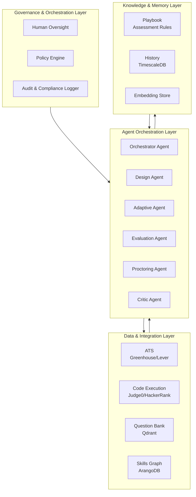

### 2.2 Agent Orchestration — Collaborative Swarm Pattern

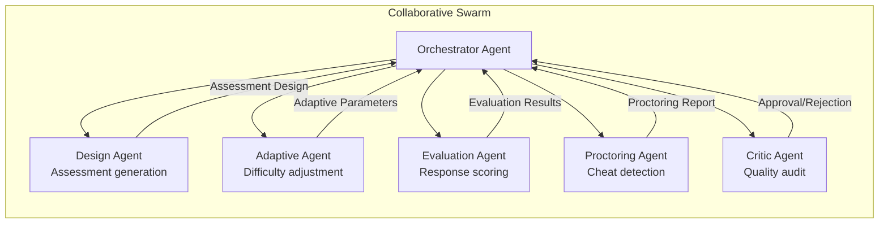

### 2.3 The Autonomous Assessment Flywheel

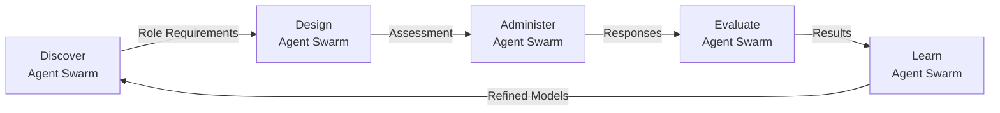

**Phase 1 – Discover**: System ingests role requirements, identifies skills to assess, and defines assessment parameters. Output: assessment specification.

**Phase 2 – Design**: Design agents generate assessment questions, scenarios, and coding challenges tailored to the role. Output: comprehensive assessment.

**Phase 3 – Administer**: Adaptive agents deliver assessments, adjust difficulty in real-time, and monitor candidate progress. Output: candidate responses with behavioral data.

**Phase 4 – Evaluate**: Evaluation agents score responses, analyze reasoning, and provide detailed feedback. Output: comprehensive evaluation results.

**Phase 5 – Learn**: Learning agents update assessment models based on hiring outcomes and performance correlation. Output: continuously improving assessments.

---

## 3. Agent Roles & Responsibilities

### 3.1 Design Agent

| Attribute | Detail |
|-----------|--------|
| **Role** | Assessment design, question generation, scenario creation |
| **Inputs** | Role requirements, skills taxonomy, difficulty parameters |
| **Outputs** | Assessment questions, scenarios, coding challenges |
| **Model** | Claude Opus 4.6 (long-horizon reasoning) |
| **Tools** | Question bank, skills taxonomy, assessment templates |
| **Responsibilities** | Generate role-specific questions; create realistic scenarios; design coding challenges; ensure coverage of all required skills |

### 3.2 Adaptive Agent

| Attribute | Detail |
|-----------|--------|
| **Role** | Real-time difficulty adjustment, personalized assessment paths |
| **Inputs** | Candidate responses, performance data, assessment parameters |
| **Outputs** | Adjusted difficulty, next questions, personalized path |
| **Model** | Claude 3.7 Sonnet + adaptive algorithms |
| **Tools** | Item Response Theory (IRT), adaptive testing algorithms |
| **Responsibilities** | Adjust difficulty in real-time; personalize assessment paths; optimize for information gain; manage time allocation |

### 3.3 Evaluation Agent

| Attribute | Detail |
|-----------|--------|
| **Role** | Response evaluation, reasoning analysis, feedback generation |
| **Inputs** | Candidate responses, assessment questions, evaluation criteria |
| **Outputs** | Scores, detailed feedback, reasoning analysis |
| **Model** | Claude Opus 4.6 (long-horizon reasoning) |
| **Tools** | Code execution engines, NLP models, evaluation rubrics |
| **Responsibilities** | Score responses with context; analyze reasoning; provide detailed feedback; identify knowledge gaps |

### 3.4 Proctoring Agent

| Attribute | Detail |
|-----------|--------|
| **Role** | Cheat detection, behavioral analysis, integrity monitoring |
| **Inputs** | Candidate behavior data, response patterns, environmental data |
| **Outputs** | Integrity score, cheat detection report, behavioral analysis |
| **Model** | Claude 3.7 Sonnet + anomaly detection |
| **Tools** | Behavioral analysis models, anomaly detection, browser monitoring |
| **Responsibilities** | Detect cheating attempts; analyze behavioral patterns; monitor environment; flag suspicious activity |

### 3.5 Critic/Governance Agent

| Attribute | Detail |
|-----------|--------|
| **Role** | Assessment quality audit, validation, compliance checking |
| **Inputs** | All agent outputs, assessment rules, compliance requirements |
| **Outputs** | Approval/rejection decisions, quality scores, audit reports |
| **Model** | Claude Opus 4.6 (adversarial reasoning) |
| **Tools** | Quality metrics, compliance databases, validation rules |
| **Responsibilities** | Audit all assessments; validate quality; enforce compliance; generate audit reports |

---

## 4. Data Models & Schemas

### 4.1 Assessment Entity

```json
{
  "assessment_id": "assess_001",
  "job_id": "job_001",
  "candidate_id": "cand_001",
  "status": "draft|active|in_progress|completed|evaluated",
  "configuration": {
    "duration_minutes": 90,
    "question_count": 15,
    "difficulty_range": [0.3, 0.9],
    "adaptive": true,
    "proctoring": true
  },
  "skills_assessed": [
    {
      "skill": "Python",
      "weight": 0.3,
      "questions": 5,
      "difficulty": "intermediate"
    },
    {
      "skill": "System Design",
      "weight": 0.4,
      "questions": 3,
      "difficulty": "advanced"
    }
  ],
  "questions": [
    {
      "question_id": "q_001",
      "type": "coding|multiple_choice|scenario|open_ended",
      "skill": "Python",
      "difficulty": 0.6,
      "content": "...",
      "evaluation_criteria": {...}
    }
  ],
  "results": {
    "overall_score": 0.85,
    "skill_scores": {
      "Python": 0.90,
      "System Design": 0.80
    },
    "time_taken_minutes": 75,
    "completion_rate": 1.0
  },
  "proctoring": {
    "integrity_score": 0.98,
    "flags": [],
    "behavioral_analysis": {...}
  },
  "created_at": "2026-10-01T00:00:00Z"
}
```

### 4.2 Skills Taxonomy Entity

```json
{
  "skill_id": "skill_001",
  "name": "Python",
  "category": "technical",
  "subcategory": "programming_language",
  "description": "Python programming language proficiency",
  "related_skills": ["Django", "Flask", "FastAPI", "Data Science"],
  "proficiency_levels": {
    "beginner": "Basic syntax and simple scripts",
    "intermediate": "OOP, decorators, generators",
    "advanced": "Async, metaclasses, C extensions",
    "expert": "Architecture, optimization, teaching"
  },
  "assessment_methods": ["coding_challenge", "code_review", "scenario"],
  "validation_criteria": {
    "code_quality": 0.3,
    "correctness": 0.4,
    "efficiency": 0.2,
    "documentation": 0.1
  }
}
```

### 4.3 Assessment Metrics Time-Series (TimescaleDB)

```sql
CREATE TABLE assessment_metrics (
    time TIMESTAMPTZ NOT NULL,
    assessments_completed INTEGER DEFAULT 0,
    avg_score DECIMAL(4,3) DEFAULT 0,
    avg_time_taken_minutes DECIMAL(6,2) DEFAULT 0,
    cheat_detection_rate DECIMAL(4,3) DEFAULT 0,
    candidate_satisfaction DECIMAL(4,3) DEFAULT 0,
    performance_correlation DECIMAL(4,3) DEFAULT 0,
    agent_id TEXT,
    metadata JSONB
);

SELECT create_hypertable('assessment_metrics', 'time');
```

---

## 5. API Contracts

### 5.1 Assessment Management API

```yaml
openapi: 3.0.0
info:
  title: Skills Assessment API
  version: 1.0.0

paths:
  /api/v1/assessments:
    post:
      summary: Create a new assessment
      requestBody:
        content:
          application/json:
            schema:
              $ref: '#/components/schemas/AssessmentCreate'
      responses:
        201:
          content:
            application/json:
              schema:
                $ref: '#/components/schemas/Assessment'

  /api/v1/assessments/{assessmentId}:
    get:
      summary: Get assessment details
      parameters:
        - name: assessmentId
          in: path
          required: true
          schema:
            type: string
      responses:
        200:
          content:
            application/json:
              schema:
                $ref: '#/components/schemas/Assessment'

  /api/v1/assessments/{assessmentId}/start:
    post:
      summary: Start an assessment
      responses:
        200:
          description: Assessment started

  /api/v1/assessments/{assessmentId}/submit:
    post:
      summary: Submit assessment responses
      requestBody:
        content:
          application/json:
            schema:
              type: object
              properties:
                responses:
                  type: array
                  items:
                    type: object
      responses:
        200:
          description: Responses submitted

  /api/v1/assessments/{assessmentId}/evaluate:
    post:
      summary: Trigger evaluation
      responses:
        202:
          description: Evaluation initiated

  /api/v1/assessments/{assessmentId}/results:
    get:
      summary: Get assessment results
      responses:
        200:
          content:
            application/json:
              schema:
                type: object
                properties:
                  overall_score:
                    type: number
                  skill_scores:
                    type: object
                  feedback:
                    type: string

  /api/v1/assessments/{assessmentId}/proctoring:
    get:
      summary: Get proctoring report
      responses:
        200:
          content:
            application/json:
              schema:
                type: object
                properties:
                  integrity_score:
                    type: number
                  flags:
                    type: array
                  behavioral_analysis:
                    type: object

  /api/v1/assessments/generate:
    post:
      summary: Auto-generate assessment for a role
      requestBody:
        content:
          application/json:
            schema:
              type: object
              properties:
                job_id:
                  type: string
                skills:
                  type: array
                  items:
                    type: string
                difficulty:
                  type: string
      responses:
        201:
          content:
            application/json:
              schema:
                $ref: '#/components/schemas/Assessment'
```

### 5.2 Skills & Questions API

```yaml
paths:
  /api/v1/skills:
    get:
      summary: List all skills in taxonomy
      parameters:
        - name: category
          in: query
          schema:
            type: string
        - name: search
          in: query
          schema:
            type: string
      responses:
        200:
          content:
            application/json:
              schema:
                type: array
                items:
                  $ref: '#/components/schemas/Skill'

  /api/v1/skills/{skillId}:
    get:
      summary: Get skill details
      parameters:
        - name: skillId
          in: path
          required: true
          schema:
            type: string
      responses:
        200:
          content:
            application/json:
              schema:
                $ref: '#/components/schemas/Skill'

  /api/v1/skills/{skillId}/assess:
    post:
      summary: Generate assessment for a skill
      requestBody:
        content:
          application/json:
            schema:
              type: object
              properties:
                difficulty:
                  type: string
                question_count:
                  type: integer
      responses:
        201:
          content:
            application/json:
              schema:
                $ref: '#/components/schemas/Assessment'

  /api/v1/questions:
    post:
      summary: Generate questions for a skill
      requestBody:
        content:
          application/json:
            schema:
              type: object
              properties:
                skill:
                  type: string
                difficulty:
                  type: number
                count:
                  type: integer
      responses:
        201:
          content:
            application/json:
              schema:
                type: array
                items:
                  type: object

  /api/v1/questions/{questionId}/evaluate:
    post:
      summary: Evaluate a response to a question
      requestBody:
        content:
          application/json:
            schema:
              type: object
              properties:
                response:
                  type: string
      responses:
        200:
          content:
            application/json:
              schema:
                type: object
                properties:
                  score:
                    type: number
                  feedback:
                    type: string
                  reasoning:
                    type: string
```

### 5.3 Analytics API

```yaml
paths:
  /api/v1/analytics/assessments:
    get:
      summary: Get assessment analytics
      parameters:
        - name: start_date
          in: query
          schema:
            type: string
            format: date
        - name: end_date
          in: query
          schema:
            type: string
            format: date
      responses:
        200:
          content:
            application/json:
              schema:
                type: object
                properties:
                  total_assessments:
                    type: integer
                  avg_score:
                    type: number
                  avg_time_taken:
                    type: number
                  cheat_detection_rate:
                    type: number
                  candidate_satisfaction:
                    type: number

  /api/v1/analytics/skills:
    get:
      summary: Get skills assessment analytics
      responses:
        200:
          content:
            application/json:
              schema:
                type: array
                items:
                  type: object
                  properties:
                    skill:
                      type: string
                    assessments_count:
                      type: integer
                    avg_score:
                    type: number
                    performance_correlation:
                      type: number

  /api/v1/analytics/candidates/{candidateId}:
    get:
      summary: Get candidate assessment history
      responses:
        200:
          content:
            application/json:
              schema:
                type: array
                items:
                  $ref: '#/components/schemas/Assessment'

  /api/v1/agents/{agentId}/decisions:
    get:
      summary: Get agent decisions
      parameters:
        - name: agentId
          in: path
          required: true
          schema:
            type: string
      responses:
        200:
          content:
            application/json:
              schema:
                type: array
                items:
                  $ref: '#/components/schemas/AgentDecision'

  /api/v1/webhooks/ats:
    post:
      summary: ATS webhook for assessment requests
      responses:
        202:
          description: Webhook received
```

---

## 6. Key Differentiator vs Competitors

| Capability | HackerRank | Codility | Vervoe | This System |
|------------|------------|----------|--------|-------------|
| **Adaptive testing** | None | None | Basic | Full IRT-based adaptation |
| **Contextual evaluation** | None | None | Basic | Full reasoning analysis |
| **Anti-cheating** | Basic | Basic | None | Behavioral + AI detection |
| **Role-specific design** | None | None | Basic | Full role tailoring |
| **Skills coverage** | 50+ | 30+ | 100+ | 500+ |
| **Continuous learning** | None | None | None | Outcome-driven improvement |
| **Candidate experience** | Basic | Basic | Good | Optimized |
| **Agent governance** | None | None | None | Cryptographic DID, policy firewall |

---

## 7. Estimated MRR Potential

| Metric | Value |
|--------|-------|
| **Target customers** | Mid-market to enterprise (500–10,000 employees) |
| **Pricing model** | $2K–7K/month based on assessment volume |
| **Customer acquisition** | 12–18 customers in 6 months |
| **MRR Month 6** | $25K–45K |
| **MRR Month 9** | $45K–70K |
| **MRR Month 12** | $70K–110K |
| **Gross margin** | 85% |
| **Payback period** | 1–2 months |

---

# Project 5: Bias Detection & Fairness Auditor

## 1. Project Overview & Objectives

### 1.1 Vision

A multi-agent system that autonomously detects, analyzes, and mitigates bias across the entire recruitment lifecycle. Unlike basic diversity metrics tools or compliance checkers, this system uses collaborative AI agents that understand context, identify subtle bias patterns, recommend corrective actions, and ensure fair hiring practices.

### 1.2 Objectives

| Objective | Target | Timeline |
|-----------|--------|----------|
| Bias detection accuracy | 95%+ precision in bias identification | Month 3 |
| Coverage | 100% of recruitment touchpoints | Month 2 |
| Mitigation recommendations | 90%+ actionable recommendations | Month 3 |
| Compliance | EEOC, GDPR, local regulations | Month 2 |
| Reporting | Real-time bias dashboards | Month 2 |
| Autonomous auditing | 85%+ audits without human review | Month 4 |
| MRR | $20K–40K | Month 6–9 |

### 1.3 Exceeds

- **EEOC compliance tools:** Basic reporting; no detection
- **Diversity analytics:** Descriptive only; no prescriptive
- **Textio:** Job description bias only; no lifecycle coverage
- **GapJumpers:** Blind hiring only; no intelligence

### 1.4 Core Gap Addressed

Current bias detection tools operate on **surface-level metrics** — they count demographics but don't understand context. The fundamental limitations are:

1. **No contextual understanding**: Tools flag "he/she" but miss subtle bias in job descriptions
2. **No lifecycle coverage**: Tools focus on one stage; bias compounds across stages
3. **No prescriptive intelligence**: Tools report bias but don't recommend fixes
4. **No intersectional analysis**: Tools analyze single dimensions; miss intersectional bias
5. **No continuous monitoring**: Tools are point-in-time; bias evolves

---

## 2. Technical Architecture

### 2.1 High-Level Architecture

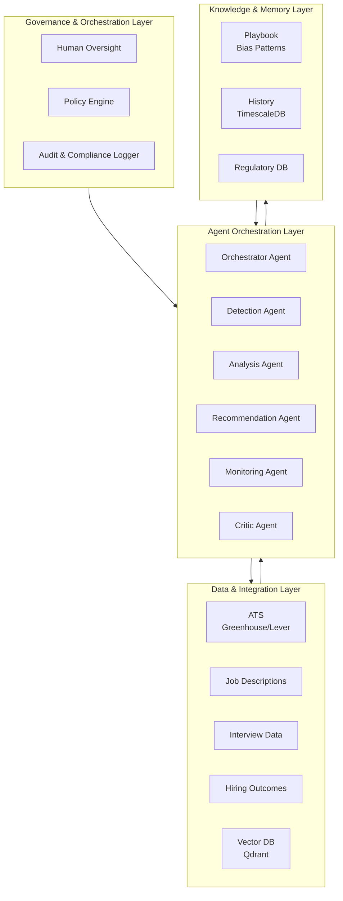

### 2.2 Agent Orchestration — Collaborative Swarm Pattern

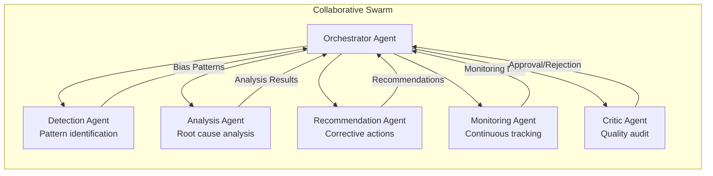

### 2.3 The Autonomous Auditing Flywheel

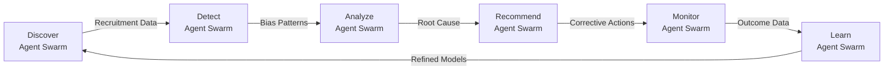

**Phase 1 – Discover**: System ingests all recruitment data from ATS, job descriptions, interviews, and outcomes. Output: comprehensive recruitment dataset.

**Phase 2 – Detect**: Detection agents identify bias patterns across all touchpoints. Output: bias pattern catalog with severity scores.

**Phase 3 – Analyze**: Analysis agents perform root cause analysis and intersectional analysis. Output: detailed bias analysis with context.

**Phase 4 – Recommend**: Recommendation agents generate corrective actions and policy updates. Output: actionable recommendations.

**Phase 5 – Monitor**: Monitoring agents track bias metrics continuously and measure improvement. Output: real-time bias dashboards.

---

## 3. Agent Roles & Responsibilities

### 3.1 Detection Agent

| Attribute | Detail |
|-----------|--------|
| **Role** | Bias pattern identification, anomaly detection, flag generation |
| **Inputs** | All recruitment data, bias pattern library, historical data |
| **Outputs** | Bias flags, pattern matches, severity scores |
| **Model** | Claude 3.7 Sonnet + anomaly detection |
| **Tools** | Bias pattern library, NLP models, statistical analysis |
| **Responsibilities** | Identify bias patterns; detect anomalies; generate flags; score severity |

### 3.2 Analysis Agent

| Attribute | Detail |
|-----------|--------|
| **Role** | Root cause analysis, intersectional analysis, context understanding |
| **Inputs** | Bias flags, recruitment data, historical context |
| **Outputs** | Root cause analysis, intersectional analysis, context report |
| **Model** | Claude Opus 4.6 (long-horizon reasoning) |
| **Tools** | Causal inference models, intersectional analysis frameworks |
| **Responsibilities** | Analyze root causes; perform intersectional analysis; understand context; identify systemic issues |

### 3.3 Recommendation Agent

| Attribute | Detail |
|-----------|--------|
| **Role** | Corrective action generation, policy recommendations, best practices |
| **Inputs** | Analysis results, bias patterns, best practices library |
| **Outputs** | Corrective actions, policy recommendations, implementation plans |
| **Model** | Claude Opus 4.6 (long-horizon reasoning) |
| **Tools** | Best practices library, policy templates, implementation guides |
| **Responsibilities** | Generate corrective actions; recommend policy updates; create implementation plans; prioritize actions |

### 3.4 Monitoring Agent

| Attribute | Detail |
|-----------|--------|
| **Role** | Continuous bias monitoring, trend analysis, improvement tracking |
| **Inputs** | All recruitment data, bias metrics, historical trends |
| **Outputs** | Real-time dashboards, trend analysis, improvement reports |
| **Model** | Claude 3.7 Sonnet + time-series analysis |
| **Tools** | Time-series databases, dashboard tools, trend analysis |
| **Responsibilities** | Monitor bias continuously; analyze trends; track improvement; generate alerts |

### 3.5 Critic/Governance Agent

| Attribute | Detail |
|-----------|--------|
| **Role** | Audit quality assurance, compliance validation, false positive reduction |
| **Inputs** | All agent outputs, compliance requirements, quality standards |
| **Outputs** | Approval/rejection decisions, quality scores, audit reports |
| **Model** | Claude Opus 4.6 (adversarial reasoning) |
| **Tools** | Quality metrics, compliance databases, validation rules |
| **Responsibilities** | Audit all outputs; validate compliance; reduce false positives; generate audit reports |

---

## 4. Data Models & Schemas

### 4.1 Bias Flag Entity

```json
{
  "flag_id": "flag_001",
  "type": "gender_bias|age_bias|racial_bias|disability_bias|socioeconomic_bias|intersectional",
  "severity": "low|medium|high|critical",
  "stage": "job_description|screening|interview|selection|offer",
  "location": {
    "entity_type": "job_description|interview_question|evaluation_criteria",
    "entity_id": "jd_001",
    "field": "requirements",
    "text_snippet": "Must be a recent college graduate..."
  },
  "analysis": {
    "bias_type": "age_discrimination",
    "affected_group": "older_candidates",
    "confidence": 0.92,
    "evidence": [
      "Phrase 'recent college graduate' implies age preference",
      "Historical data shows 80% of hires in this role are under 30"
    ],
    "root_criteria": "age_requirement_not_job_related"
  },
  "recommendation": {
    "action": "remove_phrase",
    "suggested_change": "Must have 2+ years of relevant experience",
    "priority": "high",
    "impact_estimate": "Would increase candidate pool by 35%"
  },
  "status": "open|acknowledged|in_progress|resolved|dismissed",
  "created_at": "2026-10-01T00:00:00Z"
}
```

### 4.2 Fairness Metrics Entity

```json
{
  "metrics_id": "fair_001",
  "period": {
    "start": "2026-09-01",
    "end": "2026-09-30"
  },
  "demographic_parity": {
    "gender": {
      "male": 0.55,
      "female": 0.40,
      "non_binary": 0.05,
      "parity_ratio": 0.73
    },
    "ethnicity": {
      "white": 0.45,
      "asian": 0.30,
      "black": 0.15,
      "hispanic": 0.10,
      "parity_ratio": 0.67
    }
  },
  "equal_opportunity": {
    "true_positive_rate_parity": 0.85,
    "false_positive_rate_parity": 0.90
  },
  "stage_fairness": {
    "screening": 0.88,
    "interview": 0.82,
    "selection": 0.75,
    "offer": 0.70
  },
  "intersectional": {
    "black_female": 0.65,
    "hispanic_female": 0.68,
    "asian_male": 0.85
  },
  "trend": {
    "direction": "improving",
    "change_rate": 0.05
  }
}
```

### 4.3 Bias Metrics Time-Series (TimescaleDB)

```sql
CREATE TABLE bias_metrics (
    time TIMESTAMPTZ NOT NULL,
    stage TEXT NOT NULL,
    flags_detected INTEGER DEFAULT 0,
    flags_resolved INTEGER DEFAULT 0,
    avg_severity DECIMAL(3,2) DEFAULT 0,
    demographic_parity DECIMAL(4,3) DEFAULT 0,
    equal_opportunity DECIMAL(4,3) DEFAULT 0,
    intersectional_score DECIMAL(4,3) DEFAULT 0,
    agent_id TEXT,
    metadata JSONB
);

SELECT create_hypertable('bias_metrics', 'time');
```

---

## 5. API Contracts

### 5.1 Bias Detection API

```yaml
openapi: 3.0.0
info:
  title: Bias Detection API
  version: 1.0.0

paths:
  /api/v1/bias/scan:
    post:
      summary: Scan content for bias
      requestBody:
        content:
          application/json:
            schema:
              type: object
              properties:
                content:
                  type: string
                content_type:
                  type: string
                  enum: [job_description, interview_question, evaluation_criteria, email]
                context:
                  type: object
      responses:
        200:
          content:
            application/json:
              schema:
                type: array
                items:
                  $ref: '#/components/schemas/BiasFlag'

  /api/v1/bias/scan/batch:
    post:
      summary: Batch scan multiple content items
      requestBody:
        content:
          application/json:
            schema:
              type: object
              properties:
                items:
                  type: array
                  items:
                    type: object
      responses:
        202:
          description: Batch scan initiated

  /api/v1/bias/flags:
    get:
      summary: List all bias flags
      parameters:
        - name: status
          in: query
          schema:
            type: string
            enum: [open, acknowledged, in_progress, resolved, dismissed]
        - name: severity
          in: query
          schema:
            type: string
            enum: [low, medium, high, critical]
        - name: stage
          in: query
          schema:
            type: string
      responses:
        200:
          content:
            application/json:
              schema:
                type: array
                items:
                  $ref: '#/components/schemas/BiasFlag'

  /api/v1/bias/flags/{flagId}:
    get:
      summary: Get bias flag details
      parameters:
        - name: flagId
          in: path
          required: true
          schema:
            type: string
      responses:
        200:
          content:
            application/json:
              schema:
                $ref: '#/components/schemas/BiasFlag'

  /api/v1/bias/flags/{flagId}/resolve:
    post:
      summary: Resolve a bias flag
      requestBody:
        content:
          application/json:
            schema:
              type: object
              properties:
                resolution:
                  type: string
                notes:
                  type: string
      responses:
        200:
          description: Flag resolved

  /api/v1/bias/flags/{flagId}/dismiss:
    post:
      summary: Dismiss a bias flag
      requestBody:
        content:
          application/json:
            schema:
              type: object
              properties:
                reason:
                  type: string
      responses:
        200:
          description: Flag dismissed
```

### 5.2 Fairness Analytics API

```yaml
paths:
  /api/v1/fairness/metrics:
    get:
      summary: Get fairness metrics
      parameters:
        - name: start_date
          in: query
          schema:
            type: string
            format: date
        - name: end_date
          in: query
          schema:
            type: string
            format: date
      responses:
        200:
          content:
            application/json:
              schema:
                $ref: '#/components/schemas/FairnessMetrics'

  /api/v1/fairness/demographic-parity:
    get:
      summary: Get demographic parity analysis
      responses:
        200:
          content:
            application/json:
              schema:
                type: object
                properties:
                  gender:
                    type: object
                  ethnicity:
                    type: object
                  age:
                    type: object

  /api/v1/fairness/equal-opportunity:
    get:
      summary: Get equal opportunity analysis
      responses:
        200:
          content:
            application/json:
              schema:
                type: object
                properties:
                  true_positive_rate_parity:
                    type: number
                  false_positive_rate_parity:
                    type: number

  /api/v1/fairness/intersectional:
    get:
      summary: Get intersectional analysis
      responses:
        200:
          content:
            application/json:
              schema:
                type: array
                items:
                  type: object
                  properties:
                    intersection:
                      type: string
                    parity_score:
                      type: number
                    sample_size:
                      type: integer

  /api/v1/fairness/trends:
    get:
      summary: Get fairness trends
      parameters:
        - name: metric
          in: query
          schema:
            type: string
        - name: period
          in: query
          schema:
            type: string
            enum: [week, month, quarter, year]
      responses:
        200:
          content:
            application/json:
              schema:
                type: array
                items:
                  type: object
                  properties:
                    period:
                      type: string
                    value:
                      type: number
                    change:
                      type: number

  /api/v1/fairness/stage-analysis:
    get:
      summary: Get stage-by-stage fairness analysis
      responses:
        200:
          content:
            application/json:
              schema:
                type: array
                items:
                  type: object
                  properties:
                    stage:
                      type: string
                    fairness_score:
                    type: number
                    drop_off_rate:
                    type: number
```

### 5.3 Recommendations & Compliance API

```yaml
paths:
  /api/v1/recommendations:
    get:
      summary: Get bias mitigation recommendations
      parameters:
        - name: priority
          in: query
          schema:
            type: string
            enum: [low, medium, high, critical]
      responses:
        200:
          content:
            application/json:
              schema:
                type: array
                items:
                  type: object
                  properties:
                    recommendation_id:
                      type: string
                    title:
                      type: string
                    description:
                      type: string
                    priority:
                      type: string
                    impact_estimate:
                      type: string
                    implementation_effort:
                      type: string

  /api/v1/recommendations/{recommendationId}/implement:
    post:
      summary: Mark recommendation as implemented
      responses:
        200:
          description: Recommendation marked as implemented

  /api/v1/compliance/report:
    get:
      summary: Generate compliance report
      parameters:
        - name: regulation
          in: query
          schema:
            type: string
            enum: [eeoc, gdpr, local]
        - name: format
          in: query
          schema:
            type: string
            enum: [json, pdf, csv]
      responses:
        200:
          content:
            application/json:
              schema:
                type: object

  /api/v1/compliance/audit:
    post:
      summary: Run compliance audit
      responses:
        202:
          description: Audit initiated

  /api/v1/agents/{agentId}/decisions:
    get:
      summary: Get agent decisions
      parameters:
        - name: agentId
          in: path
          required: true
          schema:
            type: string
      responses:
        200:
          content:
            application/json:
              schema:
                type: array
                items:
                  $ref: '#/components/schemas/AgentDecision'

  /api/v1/webhooks/ats:
    post:
      summary: ATS webhook for recruitment events
      responses:
        202:
          description: Webhook received
```

---

## 6. Key Differentiator vs Competitors

| Capability | EEOC Tools | Textio | GapJumpers | This System |
|------------|------------|--------|------------|-------------|
| **Detection depth** | Surface | Job description only | None | Full lifecycle |
| **Contextual understanding** | None | Basic | None | Full context analysis |
| **Intersectional analysis** | None | None | None | Full intersectional |
| **Prescriptive intelligence** | None | Basic | None | Full recommendations |
| **Continuous monitoring** | None | None | None | Real-time monitoring |
| **Compliance** | Basic | None | None | Multi-regulation |
| **Root cause analysis** | None | None | None | Full causal analysis |
| **Agent governance** | None | None | None | Cryptographic DID, policy firewall |

---

## 7. Estimated MRR Potential

| Metric | Value |
|--------|-------|
| **Target customers** | Mid-market to enterprise (500–10,000 employees) |
| **Pricing model** | $1.5K–6K/month based on organization size |
| **Customer acquisition** | 12–20 customers in 6 months |
| **MRR Month 6** | $20K–40K |
| **MRR Month 9** | $40K–65K |
| **MRR Month 12** | $65K–100K |
| **Gross margin** | 85% |
| **Payback period** | 1–2 months |

---

# Project 6: Talent Pool Manager & Nurture

## 1. Project Overview & Objectives

### 1.1 Vision

A multi-agent system that autonomously manages, nurtures, and engages talent pools to build a continuous pipeline of qualified candidates. Unlike basic CRM tools or email marketing platforms, this system uses collaborative AI agents that understand candidate interests, predict engagement likelihood, personalize outreach, and optimize nurture campaigns.

### 1.2 Objectives

| Objective | Target | Timeline |
|-----------|--------|----------|
| Talent pool growth | 50%+ increase in qualified candidates | Month 3 |
| Engagement rate | 40%+ open rate, 15%+ response rate | Month 3 |
| Time-to-fill | 40%+ reduction | Month 4 |
| Candidate quality | 80%+ match rate for nurtured candidates | Month 4 |
| Personalization | 100% personalized outreach | Month 2 |
| Autonomous nurturing | 75%+ campaigns without human review | Month 4 |
| MRR | $25K–45K | Month 6–9 |

### 1.3 Exceeds

- **Basic CRM:** Contact management only; no intelligence
- **Email marketing:** Broadcast campaigns; no personalization
- **LinkedIn Recruiter:** Sourcing only; no nurture
- **SeekOut:** Search only; no engagement

### 1.4 Core Gap Addressed

Current talent pool tools operate on **broadcast-email models** — they send generic campaigns to large lists. The fundamental limitations are:

1. **No personalization intelligence**: Tools send generic messages; no individual tailoring
2. **No engagement prediction**: Tools don't predict who will respond
3. **No lifecycle management**: Tools don't track candidate journey stages
4. **No autonomous nurturing**: Tools require manual campaign management
5. **No continuous learning**: Tools don't improve from engagement outcomes

---

## 2. Technical Architecture

### 2.1 High-Level Architecture

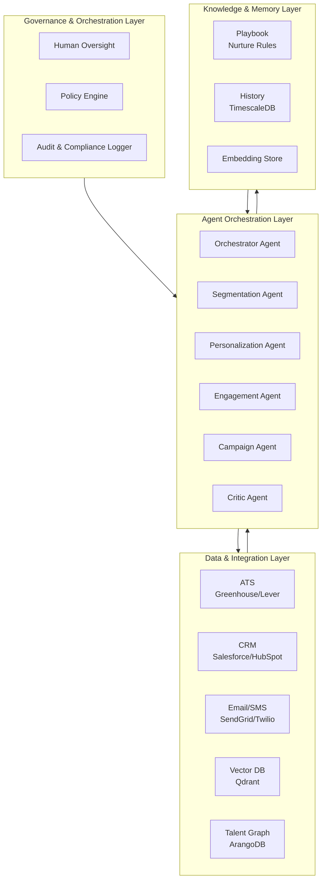

### 2.2 Agent Orchestration — Collaborative Swarm Pattern

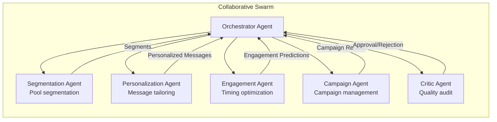

### 2.3 The Autonomous Nurture Flywheel

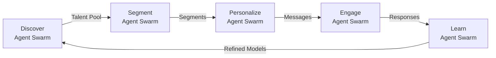

**Phase 1 – Discover**: System ingests talent pool data from ATS, CRM, and sourcing channels. Output: comprehensive talent pool.

**Phase 2 – Segmentation**: Segmentation agents create intelligent segments based on skills, experience, engagement history, and potential. Output: prioritized segments.

**Phase 3 – Personalization**: Personalization agents tailor messages for each candidate based on their profile, interests, and history. Output: personalized outreach.

**Phase 4 – Engagement**: Engagement agents optimize timing, channel, and frequency for maximum response. Output: engaged candidates.

**Phase 5 – Learn**: Learning agents update nurture models based on engagement outcomes. Output: continuously improving nurture.

---

## 3. Agent Roles & Responsibilities

### 3.1 Segmentation Agent

| Attribute | Detail |
|-----------|--------|
| **Role** | Talent pool segmentation, candidate clustering, priority scoring |
| **Inputs** | Talent pool data, skills taxonomy, engagement history |
| **Outputs** | Segments, candidate clusters, priority scores |
| **Model** | Claude 3.7 Sonnet + clustering algorithms |
| **Tools** | Clustering algorithms, skills taxonomy, engagement models |
| **Responsibilities** | Create intelligent segments; cluster similar candidates; score priority; identify high-potential candidates |

### 3.2 Personalization Agent

| Attribute | Detail |
|-----------|--------|
| **Role** | Message personalization, content tailoring, tone optimization |
| **Inputs** | Candidate profile, engagement history, role requirements |
| **Outputs** | Personalized messages, content recommendations, tone settings |
| **Model** | Claude Opus 4.6 (long-horizon reasoning) |
| **Tools** | NLP models, content templates, tone analysis |
| **Responsibilities** | Personalize messages; tailor content; optimize tone; ensure relevance |

### 3.3 Engagement Agent

| Attribute | Detail |
|-----------|--------|
| **Role** | Engagement timing, channel optimization, frequency management |
| **Inputs** | Candidate behavior, engagement history, channel performance |
| **Outputs** | Optimal timing, channel recommendations, frequency settings |
| **Model** | Claude 3.7 Sonnet + engagement prediction |
| **Tools** | Engagement models, channel analytics, timing optimization |
| **Responsibilities** | Optimize engagement timing; select best channels; manage frequency; predict response likelihood |

### 3.4 Campaign Agent

| Attribute | Detail |
|-----------|--------|
| **Role** | Campaign creation, management, optimization, A/B testing |
| **Inputs** | Segments, messages, engagement data, campaign goals |
| **Outputs** | Campaigns, A/B test results, optimization recommendations |
| **Model** | Claude 3.7 Sonnet + A/B testing |
| **Tools** | Campaign management, A/B testing, analytics |
| **Responsibilities**: Create campaigns; manage A/B tests; optimize performance; generate reports |

### 3.5 Critic/Governance Agent

| Attribute | Detail |
|-----------|--------|
| **Role** | Campaign quality audit, compliance checking, engagement validation |
| **Inputs** | All agent outputs, compliance requirements, quality standards |
| **Outputs** | Approval/rejection decisions, quality scores, audit reports |
| **Model** | Claude Opus 4.6 (adversarial reasoning) |
| **Tools** | Quality metrics, compliance databases, validation rules |
| **Responsibilities** | Audit all campaigns; validate compliance; ensure quality; generate audit reports |

---

## 4. Data Models & Schemas

### 4.1 Talent Pool Entity

```json
{
  "pool_id": "pool_001",
  "name": "Senior Engineers",
  "description": "Pool of senior engineering candidates",
  "criteria": {
    "skills": ["Python", "AWS", "System Design"],
    "experience_years": 5,
    "level": "senior"
  },
  "candidates": [
    {
      "candidate_id": "cand_001",
      "added_at": "2026-09-01T00:00:00Z",
      "source": "linkedin",
      "status": "new|engaged|nurtured|contacted|interviewing|placed|archived",
      "engagement_score": 0.75,
      "last_engaged": "2026-09-15T00:00:00Z",
      "match_score": 0.88
    }
  ],
  "segments": [
    {
      "segment_id": "seg_001",
      "name": "High-Potential Python Engineers",
      "criteria": {...},
      "candidate_count": 25
    }
  ],
  "campaigns": [
    {
      "campaign_id": "camp_001",
      "status": "active",
      "sent_count": 50,
      "open_rate": 0.45,
      "response_rate": 0.18
    }
  ],
  "metrics": {
    "total_candidates": 150,
    "active_candidates": 80,
    "avg_engagement_score": 0.72,
    "avg_match_score": 0.85
  }
}
```

### 4.2 Nurture Campaign Entity

```json
{
  "campaign_id": "camp_001",
  "pool_id": "pool_001",
  "name": "Q4 Senior Engineer Outreach",
  "status": "draft|active|paused|completed",
  "goals": {
    "target_responses": 30,
    "target_interviews": 10,
    "target_hires": 2
  },
  "audience": {
    "segment_ids": ["seg_001", "seg_002"],
    "candidate_count": 50
  },
  "content": {
    "subject": "Exciting Senior Engineer Opportunity at TechCorp",
    "body": "Hi {name}, we noticed your impressive background in {skills}...",
    "personalization": {
      "skills_match": true,
      "experience_relevance": true,
      "mutual_connections": true
    }
  },
  "schedule": {
    "start_date": "2026-10-01",
    "end_date": "2026-10-31",
    "send_time": "10:00",
    "timezone": "America/Los_Angeles",
    "frequency": "weekly"
  },
  "results": {
    "sent": 50,
    "delivered": 48,
    "opened": 22,
    "clicked": 12,
    "responded": 9,
    "interviews_scheduled": 4,
    "hires": 1
  },
  "ab_test": {
    "enabled": true,
    "variants": ["A", "B"],
    "winner": "A",
    "confidence": 0.95
  }
}
```

### 4.3 Engagement Metrics Time-Series (TimescaleDB)

```sql
CREATE TABLE engagement_metrics (
    time TIMESTAMPTZ NOT NULL,
    pool_id TEXT NOT NULL,
    candidates_engaged INTEGER DEFAULT 0,
    messages_sent INTEGER DEFAULT 0,
    open_rate DECIMAL(4,3) DEFAULT 0,
    response_rate DECIMAL(4,3) DEFAULT 0,
    interview_conversion_rate DECIMAL(4,3) DEFAULT 0,
    hire_conversion_rate DECIMAL(4,3) DEFAULT 0,
    agent_id TEXT,
    metadata JSONB
);

SELECT create_hypertable('engagement_metrics', 'time');
```

---

## 5. API Contracts

### 5.1 Talent Pool Management API

```yaml
openapi: 3.0.0
info:
  title: Talent Pool Manager API
  version: 1.0.0

paths:
  /api/v1/pools:
    post:
      summary: Create a new talent pool
      requestBody:
        content:
          application/json:
            schema:
              $ref: '#/components/schemas/TalentPoolCreate'
      responses:
        201:
          content:
            application/json:
              schema:
                $ref: '#/components/schemas/TalentPool'

  /api/v1/pools:
    get:
      summary: List all talent pools
      parameters:
        - name: status
          in: query
          schema:
            type: string
      responses:
        200:
          content:
            application/json:
              schema:
                type: array
                items:
                  $ref: '#/components/schemas/TalentPool'

  /api/v1/pools/{poolId}:
    get:
      summary: Get talent pool details
      parameters:
        - name: poolId
          in: path
          required: true
          schema:
            type: string
      responses:
        200:
          content:
            application/json:
              schema:
                $ref: '#/components/schemas/TalentPool'

  /api/v1/pools/{poolId}/candidates:
    post:
      summary: Add candidates to pool
      requestBody:
        content:
          application/json:
            schema:
              type: object
              properties:
                candidate_ids:
                  type: array
                  items:
                    type: string
      responses:
        200:
          description: Candidates added

  /api/v1/pools/{poolId}/candidates:
    get:
      summary: List candidates in pool
      parameters:
        - name: status
          in: query
          schema:
            type: string
        - name: segment
          in: query
          schema:
            type: string
      responses:
        200:
          content:
            application/json:
              schema:
                type: array
                items:
                  $ref: '#/components/schemas/Candidate'

  /api/v1/pools/{poolId}/segment:
    post:
      summary: Auto-segment pool
      responses:
        200:
          content:
            application/json:
              schema:
                type: array
                items:
                  type: object
                  properties:
                    segment_id:
                      type: string
                    name:
                      type: string
                    candidate_count:
                      type: integer

  /api/v1/pools/{poolId}/metrics:
    get:
      summary: Get pool metrics
      responses:
        200:
          content:
            application/json:
              schema:
                type: object
                properties:
                  total_candidates:
                    type: integer
                  active_candidates:
                    type: integer
                  avg_engagement_score:
                    type: number
                  avg_match_score:
                    type: number
```

### 5.2 Nurture Campaign API

```yaml
paths:
  /api/v1/campaigns:
    post:
      summary: Create a nurture campaign
      requestBody:
        content:
          application/json:
            schema:
              $ref: '#/components/schemas/CampaignCreate'
      responses:
        201:
          content:
            application/json:
              schema:
                $ref: '#/components/schemas/Campaign'

  /api/v1/campaigns:
    get:
      summary: List all campaigns
      parameters:
        - name: status
          in: query
          schema:
            type: string
      responses:
        200:
          content:
            application/json:
              schema:
                type: array
                items:
                  $ref: '#/components/schemas/Campaign'

  /api/v1/campaigns/{campaignId}:
    get:
      summary: Get campaign details
      parameters:
        - name: campaignId
          in: path
          required: true
          schema:
            type: string
      responses:
        200:
          content:
            application/json:
              schema:
                $ref: '#/components/schemas/Campaign'

  /api/v1/campaigns/{campaignId}/start:
    post:
      summary: Start a campaign
      responses:
        200:
          description: Campaign started

  /api/v1/campaigns/{campaignId}/pause:
    post:
      summary: Pause a campaign
      responses:
        200:
          description: Campaign paused

  /api/v1/campaigns/{campaignId}/results:
    get:
      summary: Get campaign results
      responses:
        200:
          content:
            application/json:
              schema:
                type: object
                properties:
                  sent:
                    type: integer
                  delivered:
                    type: integer
                  opened:
                    type: integer
                  clicked:
                    type: integer
                  responded:
                    type: integer
                  interviews_scheduled:
                    type: integer
                  hires:
                    type: integer

  /api/v1/campaigns/{campaignId}/personalize:
    post:
      summary: Generate personalized messages
      requestBody:
        content:
          application/json:
            schema:
              type: object
              properties:
                candidate_ids:
                  type: array
                  items:
                    type: string
      responses:
        200:
          content:
            application/json:
              schema:
                type: array
                items:
                  type: object
                  properties:
                    candidate_id:
                      type: string
                    message:
                      type: string
                    subject:
                      type: string

  /api/v1/campaigns/{campaignId}/ab-test:
    post:
      summary: Create A/B test
      requestBody:
        content:
          application/json:
            schema:
              type: object
              properties:
                variants:
                  type: array
                  items:
                    type: object
                split_ratio:
                  type: number
      responses:
        201:
          description: A/B test created
```

### 5.3 Engagement & Analytics API

```yaml
paths:
  /api/v1/engagement/predict:
    post:
      summary: Predict engagement likelihood
      requestBody:
        content:
          application/json:
            schema:
              type: object
              properties:
                candidate_id:
                  type: string
                message_type:
                  type: string
                channel:
                  type: string
      responses:
        200:
          content:
            application/json:
              schema:
                type: object
                properties:
                  engagement_probability:
                    type: number
                  optimal_channel:
                    type: string
                  optimal_time:
                    type: string

  /api/v1/engagement/optimize:
    post:
      summary: Optimize engagement strategy
      requestBody:
        content:
          application/json:
            schema:
              type: object
              properties:
                pool_id:
                  type: string
                goals:
                  type: object
      responses:
        200:
          content:
            application/json:
              schema:
                type: object
                properties:
                  recommended_segments:
                    type: array
                  recommended_channels:
                    type: array
                  recommended_timing:
                    type: object
                  expected_results:
                    type: object

  /api/v1/analytics/pools:
    get:
      summary: Get pool analytics
      responses:
        200:
          content:
            application/json:
              schema:
                type: array
                items:
                  type: object
                  properties:
                    pool_id:
                      type: string
                    total_candidates:
                      type: integer
                    active_candidates:
                      type: integer
                    avg_engagement_score:
                    type: number

  /api/v1/analytics/campaigns:
    get:
      summary: Get campaign analytics
      responses:
        200:
          content:
            application/json:
              schema:
                type: array
                items:
                  type: object
                  properties:
                    campaign_id:
                      type: string
                    sent:
                      type: integer
                    open_rate:
                      type: number
                    response_rate:
                      type: number

  /api/v1/agents/{agentId}/decisions:
    get:
      summary: Get agent decisions
      parameters:
        - name: agentId
          in: path
          required: true
          schema:
            type: string
      responses:
        200:
          content:
            application/json:
              schema:
                type: array
                items:
                  $ref: '#/components/schemas/AgentDecision'

  /api/v1/webhooks/ats:
    post:
      summary: ATS webhook for candidate events
      responses:
        202:
          description: Webhook received
```

---

## 6. Key Differentiator vs Competitors

| Capability | Basic CRM | Email Marketing | LinkedIn Recruiter | This System |
|------------|-----------|-----------------|-------------------|-------------|
| **Personalization** | None | Basic | None | Full AI personalization |
| **Engagement prediction** | None | None | None | Full prediction |
| **Lifecycle management** | None | Basic | None | Full lifecycle |
| **Autonomous nurturing** | None | None | None | Full autonomous |
| **Continuous learning** | None | None | None | Outcome-driven |
| **Segmentation** | Basic | Basic | Basic | AI-powered |
| **A/B testing** | None | Basic | None | Full A/B testing |
| **Agent governance** | None | None | None | Cryptographic DID, policy firewall |

---

## 7. Estimated MRR Potential

| Metric | Value |
|--------|-------|
| **Target customers** | Mid-market to enterprise (500–10,000 employees) |
| **Pricing model** | $2K–7K/month based on pool size |
| **Customer acquisition** | 12–18 customers in 6 months |
| **MRR Month 6** | $25K–45K |
| **MRR Month 9** | $45K–70K |
| **MRR Month 12** | $70K–110K |
| **Gross margin** | 85% |
| **Payback period** | 1–2 months |

---

# Project 7: Recruitment Analytics & Forecasting

## 1. Project Overview & Objectives

### 1.1 Vision

A multi-agent system that autonomously analyzes recruitment metrics, predicts hiring outcomes, forecasts pipeline health, and provides actionable intelligence. Unlike basic dashboards (Greenhouse Analytics, Lever Reports) or BI tools, this system uses collaborative AI agents that understand context, identify trends, predict outcomes, and recommend optimizations.

### 1.2 Objectives

| Objective | Target | Timeline |
|-----------|--------|----------|
| Forecast accuracy | 85%+ accuracy for 30-day forecasts | Month 3 |
| Metric coverage | 100% of recruitment KPIs | Month 2 |
| Insight generation | 10+ actionable insights per week | Month 3 |
| Predictive alerts | 90%+ precision in anomaly detection | Month 3 |
| Reporting | Real-time dashboards | Month 2 |
| Autonomous analysis | 80%+ insights without human review | Month 4 |
| MRR | $20K–40K | Month 6–9 |

### 1.3 Exceeds

- **Greenhouse Analytics:** Descriptive only; no prediction
- **Lever Reports:** Basic metrics; no intelligence
- **Tableau/Power BI:** Generic BI; no recruitment expertise
- **Visier:** People analytics; no agentic reasoning

### 1.4 Core Gap Addressed

Current analytics tools operate on **descriptive models** — they show what happened but not what will happen. The fundamental limitations are:

1. **No predictive intelligence**: Tools show historical data; no forecasting
2. **No contextual understanding**: Tools show metrics; no context
3. **No prescriptive intelligence**: Tools report; don't recommend actions
4. **No anomaly detection**: Tools don't flag unusual patterns
5. **No autonomous analysis**: Tools require manual exploration

---

## 2. Technical Architecture

### 2.1 High-Level Architecture

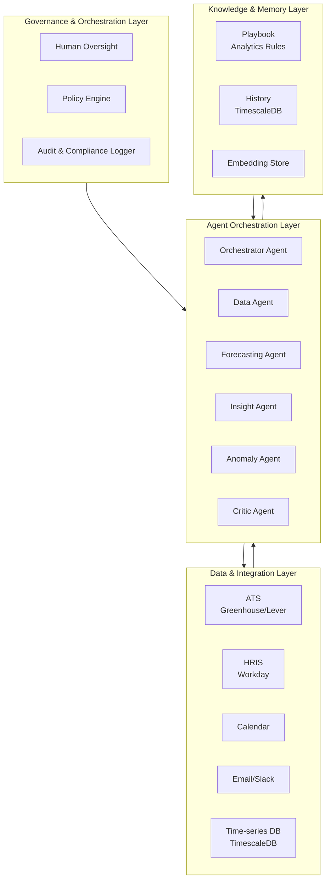

### 2.2 Agent Orchestration — Collaborative Swarm Pattern

```mermaid
graph LR
    subgraph SWARM["Collaborative Swarm"]
        O[Orchestrator Agent]
        O --> D[Data Agent<br/>Data collection]
        O --> F[Forecasting Agent<br/>Predictions]
        O --> I[Insight Agent<br/>Pattern discovery]
        O --> A[Anomaly Agent<br/>Outlier detection]
        O --> CR[Critic Agent<br/>Quality audit]
    end

    D -->|Clean Data| O
    F -->|Forecasts| O
    I -->|Insights| O
    A -->|Anomalies| O
    CR -->|Approval/Rejection| O
```

### 2.3 The Autonomous Analytics Flywheel

```mermaid
graph LR
    D[Discover<br/>Agent Swarm] -->|Raw Data| C[Collect<br/>Agent Swarm]
    C -->|Clean Data| A[Analyze<br/>Agent Swarm]
    A -->|Patterns| F[Forecast<br/>Agent Swarm]
    F -->|Predictions| I[Insight<br/>Agent Swarm]
    I -->|Actions| L[Learn<br/>Agent Swarm]
    L -->|Refined Models| D
```

**Phase 1 – Discover**: System ingests all recruitment data from ATS, HRIS, and other sources. Output: raw data streams.

**Phase 2 – Collect**: Data agents clean, normalize, and enrich data. Output: clean, analysis-ready data.

**Phase 3 – Analyze**: Analysis agents identify patterns, trends, and correlations. Output: pattern catalog.

**Phase 4 – Forecast**: Forecasting agents predict future outcomes. Output: forecasts with confidence intervals.

**Phase 5 – Insight**: Insight agents generate actionable recommendations. Output: prioritized insights.

---

## 3. Agent Roles & Responsibilities

### 3.1 Data Agent

| Attribute | Detail |
|-----------|--------|
| **Role** | Data collection, cleaning, normalization, enrichment |
| **Inputs** | ATS data, HRIS data, calendar data, external sources |
| **Outputs** | Clean, normalized, analysis-ready datasets |
| **Model** | Claude 3.7 Sonnet (fast, capable) |
| **Tools** | ETL pipelines, data quality tools, enrichment APIs |
| **Responsibilities** | Collect data from all sources; clean and normalize; enrich with external data; ensure data quality |

### 3.2 Forecasting Agent

| Attribute | Detail |
|-----------|--------|
| **Role** | Hiring outcome prediction, pipeline forecasting, time-to-fill estimation |
| **Inputs** | Historical data, current pipeline, market conditions |
| **Outputs** | Forecasts, confidence intervals, scenario analysis |
| **Model** | Claude Opus 4.6 + time-series models |
| **Tools** | Time-series forecasting, ML models, scenario analysis |
| **Responsibilities** | Predict hiring outcomes; forecast pipeline health; estimate time-to-fill; generate scenarios |

### 3.3 Insight Agent

| Attribute | Detail |
|-----------|--------|
| **Role** | Pattern discovery, trend analysis, actionable insight generation |
| **Inputs** | Clean data, forecasts, historical patterns |
| **Outputs** | Insights, recommendations, trend analysis |
| **Model** | Claude Opus 4.6 (long-horizon reasoning) |
| **Tools** | Pattern recognition, trend analysis, recommendation engines |
| **Responsibilities** | Discover patterns; analyze trends; generate actionable insights; prioritize recommendations |

### 3.4 Anomaly Agent

| Attribute | Detail |
|-----------|--------|
| **Role** | Anomaly detection, outlier identification, alert generation |
| **Inputs** | Real-time data, historical patterns, thresholds |
| **Outputs** | Anomaly alerts, outlier reports, root cause analysis |
| **Model** | Claude 3.7 Sonnet + anomaly detection |
| **Tools** | Anomaly detection algorithms, statistical analysis |
| **Responsibilities** | Detect anomalies; identify outliers; generate alerts; analyze root causes |

### 3.5 Critic/Governance Agent

| Attribute | Detail |
|-----------|--------|
| **Role** | Analysis quality audit, validation, compliance checking |
| **Inputs** | All agent outputs, quality standards, compliance requirements |
| **Outputs** | Approval/rejection decisions, quality scores, audit reports |
| **Model** | Claude Opus 4.6 (adversarial reasoning) |
| **Tools** | Quality metrics, compliance databases, validation rules |
| **Responsibilities** | Audit all outputs; validate accuracy; enforce compliance; generate audit reports |

---

## 4. Data Models & Schemas

### 4.1 Forecast Entity

```json
{
  "forecast_id": "fc_001",
  "type": "time_to_fill|hire_probability|pipeline_health|source_effectiveness",
  "job_id": "job_001",
  "horizon_days": 30,
  "predictions": [
    {
      "date": "2026-10-15",
      "predicted_value": 0.75,
      "confidence_interval": [0.65, 0.85],
      "confidence": 0.88
    }
  ],
  "factors": [
    {
      "factor": "source_effectiveness",
      "impact": 0.35,
      "description": "LinkedIn sourcing showing 40% higher conversion"
    },
    {
      "factor": "market_conditions",
      "impact": 0.25,
      "description": "Engineering talent market tightening"
    }
  ],
  "scenarios": {
    "optimistic": 0.85,
    "realistic": 0.75,
    "pessimistic": 0.55
  },
  "accuracy": 0.87,
  "created_at": "2026-10-01T00:00:00Z"
}
```

### 4.2 Insight Entity

```json
{
  "insight_id": "ins_001",
  "type": "trend|anomaly|recommendation|prediction",
  "priority": "low|medium|high|critical",
  "category": "sourcing|conversion|diversity|efficiency|cost",
  "title": "LinkedIn sourcing conversion rate declining",
  "description": "LinkedIn sourcing conversion rate has dropped 15% over the past 30 days",
  "evidence": [
    "Conversion rate: 25% → 21.25%",
    "Sample size: 200 candidates",
    "Statistical significance: p < 0.01"
  ],
  "root_cause": {
    "primary": "Increased competition for same candidate pool",
    "contributing": ["Job description quality decline", "Slower response time"]
  },
  "recommendation": {
    "action": "Diversify sourcing channels",
    "expected_impact": "Restore conversion rate to 25%",
    "implementation_effort": "medium",
    "timeline": "2 weeks"
  },
  "status": "new|acknowledged|in_progress|implemented|dismissed",
  "created_at": "2026-10-01T00:00:00Z"
}
```

### 4.3 Analytics Metrics Time-Series (TimescaleDB)

```sql
CREATE TABLE recruitment_metrics (
    time TIMESTAMPTZ NOT NULL,
    job_id TEXT,
    applications INTEGER DEFAULT 0,
    screens INTEGER DEFAULT 0,
    interviews INTEGER DEFAULT 0,
    offers INTEGER DEFAULT 0,
    hires INTEGER DEFAULT 0,
    time_to_fill_days INTEGER DEFAULT 0,
    cost_per_hire DECIMAL(10,2) DEFAULT 0,
    source TEXT,
    agent_id TEXT,
    metadata JSONB
);

SELECT create_hypertable('recruitment_metrics', 'time');

CREATE MATERIALIZED VIEW recruitment_metrics_1day
WITH (timescaledb.continuous) AS
SELECT
    time_bucket('1 day', time) AS bucket,
    job_id,
    SUM(applications) as applications,
    SUM(interviews) as interviews,
    SUM(offers) as offers,
    SUM(hires) as hires,
    AVG(time_to_fill_days) as avg_time_to_fill
FROM recruitment_metrics
GROUP BY bucket, job_id;
```

---

## 5. API Contracts

### 5.1 Analytics API

```yaml
openapi: 3.0.0
info:
  title: Recruitment Analytics API
  version: 1.0.0

paths:
  /api/v1/analytics/dashboard:
    get:
      summary: Get recruitment dashboard
      parameters:
        - name: start_date
          in: query
          schema:
            type: string
            format: date
        - name: end_date
          in: query
          schema:
            type: string
            format: date
      responses:
        200:
          content:
            application/json:
              schema:
                type: object
                properties:
                  total_applications:
                    type: integer
                  total_hires:
                    type: integer
                  avg_time_to_fill:
                    type: number
                  cost_per_hire:
                    type: number
                  funnel_conversion:
                    type: object

  /api/v1/analytics/funnel:
    get:
      summary: Get recruitment funnel analysis
      parameters:
        - name: job_id
          in: query
          schema:
            type: string
      responses:
        200:
          content:
            application/json:
              schema:
                type: array
                items:
                  type: object
                  properties:
                    stage:
                      type: string
                    count:
                      type: integer
                    conversion_rate:
                    type: number

  /api/v1/analytics/sources:
    get:
      summary: Get source effectiveness analysis
      responses:
        200:
          content:
            application/json:
              schema:
                type: array
                items:
                  type: object
                  properties:
                    source:
                      type: string
                    candidates:
                      type: integer
                    hires:
                      type: integer
                    conversion_rate:
                      type: number
                    cost_per_hire:
                      type: number

  /api/v1/analytics/time-to-fill:
    get:
      summary: Get time-to-fill analysis
      responses:
        200:
          content:
            application/json:
              schema:
                type: object
                properties:
                  avg_days:
                    type: number
                  by_department:
                    type: object
                  by_role:
                    type: object
                  trend:
                    type: array

  /api/v1/analytics/diversity:
    get:
      summary: Get diversity analytics
      responses:
        200:
          content:
            application/json:
              schema:
                type: object
                properties:
                  gender:
                    type: object
                  ethnicity:
                    type: object
                  stage_fairness:
                    type: object

  /api/v1/analytics/cost:
    get:
      summary: Get cost analysis
      responses:
        200:
          content:
            application/json:
              schema:
                type: object
                properties:
                  total_cost:
                    type: number
                  cost_per_hire:
                    type: number
                  by_source:
                    type: object
                  by_channel:
                    type: object
```

### 5.2 Forecasting API

```yaml
paths:
  /api/v1/forecasts:
    post:
      summary: Generate a forecast
      requestBody:
        content:
          application/json:
            schema:
              type: object
              properties:
                type:
                  type: string
                  enum: [time_to_fill, hire_probability, pipeline_health]
                job_id:
                  type: string
                horizon_days:
                  type: integer
                  default: 30
      responses:
        201:
          content:
            application/json:
              schema:
                $ref: '#/components/schemas/Forecast'

  /api/v1/forecasts/{forecastId}:
    get:
      summary: Get forecast details
      parameters:
        - name: forecastId
          in: path
          required: true
          schema:
            type: string
      responses:
        200:
          content:
            application/json:
              schema:
                $ref: '#/components/schemas/Forecast'

  /api/v1/forecasts/{forecastId}/accuracy:
    get:
      summary: Get forecast accuracy
      responses:
        200:
          content:
            application/json:
              schema:
                type: object
                properties:
                  accuracy:
                    type: number
                  mae:
                    type: number
                  rmse:
                    type: number

  /api/v1/forecasts/scenarios:
    post:
      summary: Generate scenario analysis
      requestBody:
        content:
          application/json:
            schema:
              type: object
              properties:
                job_id:
                  type: string
                scenarios:
                  type: array
                  items:
                    type: object
      responses:
        200:
          content:
            application/json:
              schema:
                type: array
                items:
                  type: object
```

### 5.3 Insights & Alerts API

```yaml
paths:
  /api/v1/insights:
    get:
      summary: Get actionable insights
      parameters:
        - name: priority
          in: query
          schema:
            type: string
            enum: [low, medium, high, critical]
        - name: category
          in: query
          schema:
            type: string
      responses:
        200:
          content:
            application/json:
              schema:
                type: array
                items:
                  $ref: '#/components/schemas/Insight'

  /api/v1/insights/{insightId}:
    get:
      summary: Get insight details
      parameters:
        - name: insightId
          in: path
          required: true
          schema:
            type: string
      responses:
        200:
          content:
            application/json:
              schema:
                $ref: '#/components/schemas/Insight'

  /api/v1/insights/{insightId}/implement:
    post:
      summary: Mark insight as implemented
      responses:
        200:
          description: Insight marked as implemented

  /api/v1/alerts:
    get:
      summary: Get anomaly alerts
      parameters:
        - name: severity
          in: query
          schema:
            type: string
      responses:
        200:
          content:
            application/json:
              schema:
                type: array
                items:
                  type: object
                  properties:
                    alert_id:
                      type: string
                    severity:
                      type: string
                    message:
                      type: string
                    timestamp:
                      type: string

  /api/v1/alerts/{alertId}/acknowledge:
    post:
      summary: Acknowledge an alert
      responses:
        200:
          description: Alert acknowledged

  /api/v1/agents/{agentId}/decisions:
    get:
      summary: Get agent decisions
      parameters:
        - name: agentId
          in: path
          required: true
          schema:
            type: string
      responses:
        200:
          content:
            application/json:
              schema:
                type: array
                items:
                  $ref: '#/components/schemas/AgentDecision'

  /api/v1/webhooks/ats:
    post:
      summary: ATS webhook for recruitment events
      responses:
        202:
          description: Webhook received

  /api/v1/webhooks/hris:
    post:
      summary: HRIS webhook for outcome data
      responses:
        202:
          description: Webhook received
```

---

## 6. Key Differentiator vs Competitors

| Capability | Greenhouse Analytics | Lever Reports | Tableau/Power BI | This System |
|------------|---------------------|---------------|------------------|-------------|
| **Predictive intelligence** | None | None | None | Full forecasting |
| **Contextual understanding** | None | None | None | Full context |
| **Prescriptive intelligence** | None | None | None | Actionable recommendations |
| **Anomaly detection** | None | None | Basic | AI-powered detection |
| **Autonomous analysis** | None | None | None | Full autonomous |
| **Recruitment expertise** | Basic | Basic | None | Deep domain expertise |
| **Real-time insights** | None | None | Batch | Real-time |
| **Agent governance** | None | None | None | Cryptographic DID, policy firewall |

---

## 7. Estimated MRR Potential

| Metric | Value |
|--------|-------|
| **Target customers** | Mid-market to enterprise (500–10,000 employees) |
| **Pricing model** | $1.5K–6K/month based on organization size |
| **Customer acquisition** | 12–20 customers in 6 months |
| **MRR Month 6** | $20K–40K |
| **MRR Month 9** | $40K–65K |
| **MRR Month 12** | $65K–100K |
| **Gross margin** | 85% |
| **Payback period** | 1–2 months |

---

# Project 8: Onboarding Automation Agent

## 1. Project Overview & Objectives

### 1.1 Vision

A multi-agent system that autonomously manages the entire onboarding process from offer acceptance to full productivity. Unlike basic onboarding checklists (BambooHR, Workday) or task management tools, this system uses collaborative AI agents that understand role requirements, personalize onboarding paths, predict challenges, and optimize for time-to-productivity.

### 1.2 Objectives

| Objective | Target | Timeline |
|-----------|--------|----------|
| Time-to-productivity | 40%+ reduction | Month 3 |
| New hire satisfaction | 90%+ positive feedback | Month 3 |
| Onboarding completion | 95%+ task completion rate | Month 2 |
| Personalization | 100% role-specific paths | Month 2 |
| Compliance | 100% required training completion | Month 2 |
| Autonomous management | 80%+ without human intervention | Month 4 |
| MRR | $20K–35K | Month 6–9 |

### 1.3 Exceeds

- **BambooHR:** Basic checklists; no intelligence
- **Workday:** Task management; no personalization
- **Sapling:** Workflow automation; no AI
- **Enboarder:** Engagement focus; no predictive

### 1.4 Core Gap Addressed

Current onboarding tools operate on **checklist models** — they track task completion but don't optimize for outcomes. The fundamental limitations are:

1. **No personalization intelligence**: Tools use generic paths; no role-specific tailoring
2. **No predictive capability**: Tools don't predict onboarding challenges
3. **No adaptive learning**: Tools don't adjust based on new hire progress
4. **No engagement optimization**: Tools don't optimize for new hire experience
5. **No continuous improvement**: Tools don't learn from onboarding outcomes

---

## 2. Technical Architecture

### 2.1 High-Level Architecture

```mermaid
graph TB
    subgraph GOVERNANCE["Governance & Orchestration Layer"]
        HO[Human Oversight]
        PE[Policy Engine]
        ACL[Audit & Compliance Logger]
    end

    subgraph ORCH["Agent Orchestration Layer"]
        OA[Orchestrator Agent]
        PA[Personalization Agent]
        TA[Task Agent]
        EA[Engagement Agent]
        PA2[Prediction Agent]
        CR[Critic Agent]
    end

    subgraph DATA["Data & Integration Layer"]
        HRIS[HRIS<br/>BambooHR/Workday]
        LMS[LMS<br/>Cornerstone/Udemy]
        IT[IT Service<br/>ServiceNow]
        COMMS[Email/Slack]
    end

    subgraph KNOW["Knowledge & Memory Layer"]
        PB[Playbook<br/>Onboarding Rules]
        TSDB[History<br/>TimescaleDB]
        EMB[Embedding Store]
    end

    GOVERNANCE --> ORCH
    ORCH --> DATA
    ORCH --> KNOW
    DATA --> ORCH
    KNOW --> ORCH
```

### 2.2 Agent Orchestration — Collaborative Swarm Pattern

```mermaid
graph LR
    subgraph SWARM["Collaborative Swarm"]
        O[Orchestrator Agent]
        O --> P[Personalization Agent<br/>Path tailoring]
        O --> T[Task Agent<br/>Task management]
        O --> E[Engagement Agent<br/>Experience optimization]
        O --> PR[Prediction Agent<br/>Challenge prediction]
        O --> CR[Critic Agent<br/>Quality audit]
    end

    P -->|Personalized Path| O
    T -->|Task Status| O
    E -->|Engagement Data| O
    PR -->|Predictions| O
    CR -->|Approval/Rejection| O
```

### 2.3 The Autonomous Onboarding Flywheel

```mermaid
graph LR
    D[Discover<br/>Agent Swarm] -->|New Hire| P[Personalize<br/>Agent Swarm]
    P -->|Custom Path| T[Track<br/>Agent Swarm]
    T -->|Progress| E[Engage<br/>Agent Swarm]
    E -->|Feedback| PR[Predict<br/>Agent Swarm]
    PR -->|Adjustments| L[Learn<br/>Agent Swarm]
    L -->|Refined Models| D
```

**Phase 1 – Discover**: System ingests new hire data from HRIS, role requirements, and team context. Output: new hire profile with context.

**Phase 2 – Personalize**: Personalization agents create role-specific onboarding paths. Output: personalized onboarding plan.

**Phase 3 – Track**: Task agents manage task completion, send reminders, and track progress. Output: real-time progress tracking.

**Phase 4 – Engage**: Engagement agents optimize new hire experience, send check-ins, and gather feedback. Output: engagement data.

**Phase 5 – Predict**: Prediction agents identify potential challenges and recommend interventions. Output: predictive alerts and adjustments.

---

## 3. Agent Roles & Responsibilities

### 3.1 Personalization Agent

| Attribute | Detail |
|-----------|--------|
| **Role** | Onboarding path personalization, role-specific tailoring, experience customization |
| **Inputs** | New hire profile, role requirements, team context, previous onboarding data |
| **Outputs** | Personalized onboarding path, customized tasks, tailored content |
| **Model** | Claude Opus 4.6 (long-horizon reasoning) |
| **Tools** | Role templates, personalization models, content library |
| **Responsibilities** | Create role-specific paths; tailor content; customize timeline; optimize for individual needs |

### 3.2 Task Agent

| Attribute | Detail |
|-----------|--------|
| **Role** | Task management, progress tracking, reminder management, completion verification |
| **Inputs** | Onboarding path, task list, new hire progress |
| **Outputs** | Task status, reminders, completion reports |
| **Model** | Claude 3.7 Sonnet (fast, capable) |
| **Tools** | Task management, notification systems, progress tracking |
| **Responsibilities** | Manage tasks; track progress; send reminders; verify completion; escalate issues |

### 3.3 Engagement Agent

| Attribute | Detail |
|-----------|--------|
| **Role** | New hire experience optimization, check-in management, feedback collection |
| **Inputs** | New hire behavior, engagement data, feedback history |
| **Outputs** | Engagement scores, check-in schedules, feedback reports |
| **Model** | Claude 3.7 Sonnet + engagement models |
| **Tools** | Engagement models, feedback tools, communication platforms |
| **Responsibilities** | Optimize experience; schedule check-ins; collect feedback; identify disengagement |

### 3.4 Prediction Agent

| Attribute | Detail |
|-----------|--------|
| **Role** | Onboarding challenge prediction, risk identification, intervention recommendation |
| **Inputs** | Progress data, engagement data, historical patterns |
| **Outputs** | Risk scores, challenge predictions, intervention recommendations |
| **Model** | Claude Opus 4.6 + predictive models |
| **Tools** | Predictive models, risk assessment, intervention library |
| **Responsibilities** | Predict challenges; identify risks; recommend interventions; optimize outcomes |

### 3.5 Critic/Governance Agent

| Attribute | Detail |
|-----------|--------|
| **Role** | Onboarding quality audit, compliance validation, experience assurance |
| **Inputs** | All agent outputs, quality standards, compliance requirements |
| **Outputs** | Approval/rejection decisions, quality scores, audit reports |
| **Model** | Claude Opus 4.6 (adversarial reasoning) |
| **Tools** | Quality metrics, compliance databases, validation rules |
| **Responsibilities** | Audit all outputs; validate compliance; ensure quality; generate audit reports |

---

## 4. Data Models & Schemas

### 4.1 Onboarding Plan Entity

```json
{
  "plan_id": "plan_001",
  "new_hire_id": "nh_001",
  "job_id": "job_001",
  "start_date": "2026-10-15",
  "status": "draft|active|completed|extended",
  "personalization": {
    "role_specific": true,
    "department": "Engineering",
    "level": "senior",
    "remote": true,
    "custom_tasks": 5
  },
  "phases": [
    {
      "phase_id": "phase_1",
      "name": "Pre-boarding",
      "start_date": "2026-10-01",
      "end_date": "2026-10-14",
      "tasks": [
        {
          "task_id": "task_001",
          "title": "Complete I-9 form",
          "type": "compliance",
          "status": "completed",
          "due_date": "2026-10-10",
          "completed_at": "2026-10-08T00:00:00Z"
        }
      ]
    },
    {
      "phase_id": "phase_2",
      "name": "First Week",
      "start_date": "2026-10-15",
      "end_date": "2026-10-21",
      "tasks": []
    }
  ],
  "metrics": {
    "completion_rate": 0.85,
    "engagement_score": 0.90,
    "time_to_productivity_days": 45,
    "satisfaction_score": 4.5
  },
  "predictions": {
    "risk_level": "low",
    "potential_challenges": [],
    "recommended_interventions": []
  }
}
```

### 4.2 New Hire Profile Entity

```json
{
  "new_hire_id": "nh_001",
  "name": "Jane Doe",
  "email": "jane.doe@company.com",
  "role": "Senior Software Engineer",
  "department": "Engineering",
  "level": "senior",
  "start_date": "2026-10-15",
  "location": "San Francisco, CA",
  "remote": true,
  "manager": "John Smith",
  "buddy": "Sarah Johnson",
  "background": {
    "previous_company": "TechCorp",
    "years_experience": 8,
    "skills": ["Python", "AWS", "System Design"],
    "education": "M.S. Computer Science"
  },
  "preferences": {
    "learning_style": "hands_on",
    "communication": "slack",
    "timezone": "America/Los_Angeles"
  },
  "onboarding_progress": {
    "current_phase": "phase_2",
    "tasks_completed": 12,
    "tasks_total": 25,
    "completion_rate": 0.48
  }
}
```

### 4.3 Onboarding Metrics Time-Series (TimescaleDB)

```sql
CREATE TABLE onboarding_metrics (
    time TIMESTAMPTZ NOT NULL,
    new_hire_id TEXT NOT NULL,
    tasks_completed INTEGER DEFAULT 0,
    tasks_total INTEGER DEFAULT 0,
    completion_rate DECIMAL(4,3) DEFAULT 0,
    engagement_score DECIMAL(4,3) DEFAULT 0,
    satisfaction_score DECIMAL(3,2) DEFAULT 0,
    time_to_productivity_days INTEGER DEFAULT 0,
    agent_id TEXT,
    metadata JSONB
);

SELECT create_hypertable('onboarding_metrics', 'time');
```

---

## 5. API Contracts

### 5.1 Onboarding Plan API

```yaml
openapi: 3.0.0
info:
  title: Onboarding Automation API
  version: 1.0.0

paths:
  /api/v1/onboarding/plans:
    post:
      summary: Create an onboarding plan
      requestBody:
        content:
          application/json:
            schema:
              $ref: '#/components/schemas/OnboardingPlanCreate'
      responses:
        201:
          content:
            application/json:
              schema:
                $ref: '#/components/schemas/OnboardingPlan'

  /api/v1/onboarding/plans/{planId}:
    get:
      summary: Get onboarding plan details
      parameters:
        - name: planId
          in: path
          required: true
          schema:
            type: string
      responses:
        200:
          content:
            application/json:
              schema:
                $ref: '#/components/schemas/OnboardingPlan'

  /api/v1/onboarding/plans/{planId}/start:
    post:
      summary: Start onboarding
      responses:
        200:
          description: Onboarding started

  /api/v1/onboarding/plans/{planId}/progress:
    get:
      summary: Get onboarding progress
      responses:
        200:
          content:
            application/json:
              schema:
                type: object
                properties:
                  completion_rate:
                    type: number
                  current_phase:
                    type: string
                  tasks_completed:
                    type: integer
                  tasks_total:
                    type: integer

  /api/v1/onboarding/plans/{planId}/tasks:
    get:
      summary: List onboarding tasks
      responses:
        200:
          content:
            application/json:
              schema:
                type: array
                items:
                  type: object

  /api/v1/onboarding/plans/{planId}/tasks/{taskId}/complete:
    post:
      summary: Mark task as complete
      responses:
        200:
          description: Task completed

  /api/v1/onboarding/plans/{planId}/personalize:
    post:
      summary: Re-personalize onboarding path
      responses:
        200:
          content:
            application/json:
              schema:
                $ref: '#/components/schemas/OnboardingPlan'

  /api/v1/onboarding/plans/{planId}/predict:
    get:
      summary: Get onboarding predictions
      responses:
        200:
          content:
            application/json:
              schema:
                type: object
                properties:
                  risk_level:
                    type: string
                  potential_challenges:
                    type: array
                  recommended_interventions:
                    type: array
```

### 5.2 New Hire API

```yaml
paths:
  /api/v1/new-hires:
    post:
      summary: Register a new hire
      requestBody:
        content:
          application/json:
            schema:
              $ref: '#/components/schemas/NewHire'
      responses:
        201:
          content:
            application/json:
              schema:
                $ref: '#/components/schemas/NewHire'

  /api/v1/new-hires/{newHireId}:
    get:
      summary: Get new hire details
      parameters:
        - name: newHireId
          in: path
          required: true
          schema:
            type: string
      responses:
        200:
          content:
            application/json:
              schema:
                $ref: '#/components/schemas/NewHire'

  /api/v1/new-hires/{newHireId}/onboarding:
    get:
      summary: Get new hire onboarding status
      responses:
        200:
          content:
            application/json:
              schema:
                type: object
                properties:
                  plan_id:
                    type: string
                  status:
                    type: string
                  progress:
                    type: number

  /api/v1/new-hires/{newHireId}/feedback:
    post:
      summary: Submit onboarding feedback
      requestBody:
        content:
          application/json:
            schema:
              type: object
              properties:
                rating:
                  type: integer
                feedback:
                  type: string
                category:
                  type: string
      responses:
        200:
          description: Feedback recorded

  /api/v1/new-hires/{newHireId}/check-in:
    post:
      summary: Schedule a check-in
      requestBody:
        content:
          application/json:
            schema:
              type: object
              properties:
                type:
                  type: string
                scheduled_at:
                  type: string
                  format: date-time
      responses:
        201:
          description: Check-in scheduled
```

### 5.3 Analytics & Engagement API

```yaml
paths:
  /api/v1/analytics/onboarding:
    get:
      summary: Get onboarding analytics
      parameters:
        - name: start_date
          in: query
          schema:
            type: string
            format: date
        - name: end_date
          in: query
          schema:
            type: string
            format: date
      responses:
        200:
          content:
            application/json:
              schema:
                type: object
                properties:
                  total_onboardings:
                    type: integer
                  avg_completion_rate:
                    type: number
                  avg_time_to_productivity:
                    type: number
                  avg_satisfaction:
                    type: number

  /api/v1/analytics/engagement:
    get:
      summary: Get engagement analytics
      responses:
        200:
          content:
            application/json:
              schema:
                type: array
                items:
                  type: object
                  properties:
                    new_hire_id:
                      type: string
                    engagement_score:
                      type: number
                    satisfaction_score:
                      type: number

  /api/v1/analytics/predictions:
    get:
      summary: Get prediction accuracy
      responses:
        200:
          content:
            application/json:
              schema:
                type: object
                properties:
                  accuracy:
                    type: number
                  precision:
                    type: number
                  recall:
                    type: number

  /api/v1/agents/{agentId}/decisions:
    get:
      summary: Get agent decisions
      parameters:
        - name: agentId
          in: path
          required: true
          schema:
            type: string
      responses:
        200:
          content:
            application/json:
              schema:
                type: array
                items:
                  $ref: '#/components/schemas/AgentDecision'

  /api/v1/webhooks/hris:
    post:
      summary: HRIS webhook for new hire events
      responses:
        202:
          description: Webhook received
```

---

## 6. Key Differentiator vs Competitors

| Capability | BambooHR | Workday | Sapling | This System |
|------------|----------|---------|---------|-------------|
| **Personalization** | None | None | Basic | Full AI personalization |
| **Predictive capability** | None | None | None | Full prediction |
| **Adaptive learning** | None | None | None | Continuous adaptation |
| **Engagement optimization** | None | None | Basic | Full optimization |
| **Autonomous management** | None | None | None | Full autonomous |
| **Time-to-productivity** | Baseline | Baseline | -10% | -40% |
| **Agent governance** | None | None | None | Cryptographic DID, policy firewall |

---

## 7. Estimated MRR Potential

| Metric | Value |
|--------|-------|
| **Target customers** | Mid-market to enterprise (500–10,000 employees) |
| **Pricing model** | $1.5K–5K/month based on new hire volume |
| **Customer acquisition** | 15–25 customers in 6 months |
| **MRR Month 6** | $20K–35K |
| **MRR Month 9** | $35K–55K |
| **MRR Month 12** | $55K–85K |
| **Gross margin** | 85% |
| **Payback period** | 1–2 months |

---

# Project 9: Job Description Optimizer

## 1. Project Overview & Objectives

### 1.1 Vision

A multi-agent system that autonomously analyzes, optimizes, and generates job descriptions that attract top talent. Unlike basic writing tools (Grammarly, Textio) or template libraries, this system uses collaborative AI agents that understand role requirements, market conditions, candidate psychology, and optimize for application conversion.

### 1.2 Objectives

| Objective | Target | Timeline |
|-----------|--------|----------|
| Application rate | 50%+ increase | Month 3 |
| Quality of hire | 20%+ improvement | Month 4 |
| Time-to-fill | 30%+ reduction | Month 3 |
| Bias reduction | 60%+ reduction in biased language | Month 2 |
| SEO optimization | 90%+ search visibility | Month 2 |
| Autonomous generation | 80%+ JDs auto-generated | Month 3 |
| MRR | $15K–30K | Month 6–9 |

### 1.3 Exceeds

- **Grammarly:** Grammar only; no recruitment expertise
- **Textio:** Bias detection only; no optimization
- **LinkedIn:** Template library; no intelligence
- **Ongig:** Basic optimization; no agentic reasoning

### 1.4 Core Gap Addressed

Current JD tools operate on **template-and-checklist models** — they provide templates and flag issues but don't optimize for outcomes. The fundamental limitations are:

1. **No outcome optimization**: Tools don't optimize for application rate or quality
2. **No market intelligence**: Tools don't consider market conditions or competition
3. **No candidate psychology**: Tools don't understand what motivates candidates
4. **No continuous learning**: Tools don't improve from hiring outcomes
5. **No autonomous generation**: Tools require human writing and editing

---

## 2. Technical Architecture

### 2.1 High-Level Architecture

```mermaid
graph TB
    subgraph GOVERNANCE["Governance & Orchestration Layer"]
        HO[Human Oversight]
        PE[Policy Engine]
        ACL[Audit & Compliance Logger]
    end

    subgraph ORCH["Agent Orchestration Layer"]
        OA[Orchestrator Agent]
        AA[Analysis Agent]
        GA[Generation Agent]
        OA2[Optimization Agent]
        BA[Bias Audit Agent]
        CR[Critic Agent]
    end

    subgraph DATA["Data & Integration Layer"]
        ATS[ATS<br/>Greenhouse/Lever]
        JD[JD Library]
        MKT[Market Data]
        SEO[Search Data]
        VDB[Vector DB<br/>Qdrant]
    end

    subgraph KNOW["Knowledge & Memory Layer"]
        PB[Playbook<br/>JD Best Practices]
        TSDB[History<br/>TimescaleDB]
        EMB[Embedding Store]
    end

    GOVERNANCE --> ORCH
    ORCH --> DATA
    ORCH --> KNOW
    DATA --> ORCH
    KNOW --> ORCH
```

### 2.2 Agent Orchestration — Collaborative Swarm Pattern

```mermaid
graph LR
    subgraph SWARM["Collaborative Swarm"]
        O[Orchestrator Agent]
        O --> A[Analysis Agent<br/>JD analysis]
        O --> G[Generation Agent<br/>Content generation]
        O --> OP[Optimization Agent<br/>Performance optimization]
        O --> B[Bias Audit Agent<br/>Fairness check]
        O --> CR[Critic Agent<br/>Quality audit]
    end

    A -->|Analysis Results| O
    G -->|Generated JD| O
    OP -->|Optimized JD| O
    B -->|Bias Report| O
    CR -->|Approval/Rejection| O
```

### 2.3 The Autonomous JD Flywheel

```mermaid
graph LR
    D[Discover<br/>Agent Swarm] -->|Role Requirements| A[Analyze<br/>Agent Swarm]
    A -->|Requirements + Market| G[Generate<br/>Agent Swarm]
    G -->|Draft JD| OP[Optimize<br/>Agent Swarm]
    OP -->|Optimized JD| B[Bias Audit<br/>Agent Swarm]
    B -->|Approved JD| L[Learn<br/>Agent Swarm]
    L -->|Refined Models| D
```

**Phase 1 – Discover**: System ingests role requirements, team context, and market data. Output: role specification.

**Phase 2 – Analyze**: Analysis agents evaluate requirements, identify key attractions, and assess market competitiveness. Output: analysis report.

**Phase 3 – Generate**: Generation agents create compelling job descriptions. Output: draft JD.

**Phase 4 – Optimize**: Optimization agents refine for SEO, conversion, and clarity. Output: optimized JD.

**Phase 5 – Bias Audit**: Bias audit agents check for fairness and compliance. Output: approved JD.

---

## 3. Agent Roles & Responsibilities

### 3.1 Analysis Agent

| Attribute | Detail |
|-----------|--------|
| **Role** | JD analysis, requirement evaluation, market assessment |
| **Inputs** | Role requirements, market data, competitor JDs, historical performance |
| **Outputs** | Analysis report, key attractions, market positioning |
| **Model** | Claude Opus 4.6 (long-horizon reasoning) |
| **Tools** | Market data APIs, competitor analysis, skills taxonomy |
| **Responsibilities** | Analyze requirements; evaluate market competitiveness; identify key attractions; assess positioning |

### 3.2 Generation Agent

| Attribute | Detail |
|-----------|--------|
| **Role** | JD content generation, tone optimization, structure design |
| **Inputs** | Analysis report, role requirements, brand voice, best practices |
| **Outputs** | Draft JD, content variants, tone settings |
| **Model** | Claude Opus 4.6 (long-horizon reasoning) |
| **Tools** | Content templates, tone models, writing assistants |
| **Responsibilities** | Generate compelling content; optimize tone; design structure; create variants |

### 3.3 Optimization Agent

| Attribute | Detail |
|-----------|--------|
| **Role** | SEO optimization, conversion optimization, clarity improvement |
| **Inputs** | Draft JD, SEO data, conversion metrics, clarity analysis |
| **Outputs** | Optimized JD, SEO score, conversion score |
| **Model** | Claude 3.7 Sonnet + optimization algorithms |
| **Tools** | SEO tools, conversion models, clarity analysis |
| **Responsibilities** | Optimize for search; improve conversion; enhance clarity; A/B test variants |

### 3.4 Bias Audit Agent

| Attribute | Detail |
|-----------|--------|
| **Role** | Bias detection, fairness auditing, inclusive language |
| **Inputs** | Draft JD, bias patterns, inclusive language guidelines |
| **Outputs** | Bias report, inclusive language score, recommendations |
| **Model** | Claude Opus 4.6 (adversarial reasoning) |
| **Tools** | Bias detection models, inclusive language database |
| **Responsibilities** | Detect bias; audit for fairness; recommend inclusive language; ensure compliance |

### 3.5 Critic/Governance Agent

| Attribute | Detail |
|-----------|--------|
| **Role** | JD quality audit, validation, compliance checking |
| **Inputs** | All agent outputs, quality standards, compliance requirements |
| **Outputs** | Approval/rejection decisions, quality scores, audit reports |
| **Model** | Claude Opus 4.6 (adversarial reasoning) |
| **Tools** | Quality metrics, compliance databases, validation rules |
| **Responsibilities** | Audit all outputs; validate quality; enforce compliance; generate audit reports |

---

## 4. Data Models & Schemas

### 4.1 Job Description Entity

```json
{
  "jd_id": "jd_001",
  "job_id": "job_001",
  "title": "Senior Backend Engineer",
  "status": "draft|optimized|approved|published",
  "content": {
    "summary": "We're looking for a Senior Backend Engineer to join our growing team...",
    "responsibilities": [
      "Design and implement scalable backend services",
      "Lead technical architecture decisions",
      "Mentor junior engineers"
    ],
    "requirements": {
      "must_have": ["5+ years Python experience", "AWS expertise", "System design"],
      "nice_to_have": ["Kubernetes", "Go", "Leadership experience"]
    },
    "benefits": ["Competitive salary", "Remote work", "Health insurance"],
    "culture": ["Collaborative", "Innovative", "Autonomous"]
  },
  "optimization": {
    "seo_score": 0.92,
    "conversion_score": 0.88,
    "clarity_score": 0.95,
    "inclusive_language_score": 0.97,
    "overall_score": 0.93
  },
  "bias_audit": {
    "bias_flags": [],
    "inclusive_language_score": 0.97,
    "gendered_language_count": 0,
    "recommendations": []
  },
  "market_analysis": {
    "competitiveness": "high",
    "salary_benchmark": 180000,
    "time_to_fill_estimate": 30,
    "top_attractions": ["Remote work", "Technical challenges", "Growth opportunities"]
  },
  "performance": {
    "views": 1500,
    "applications": 45,
    "application_rate": 0.03,
    "quality_score": 0.85
  },
  "created_at": "2026-10-01T00:00:00Z"
}
```

### 4.2 JD Optimization Metrics Time-Series (TimescaleDB)

```sql
CREATE TABLE jd_metrics (
    time TIMESTAMPTZ NOT NULL,
    jd_id TEXT NOT NULL,
    views INTEGER DEFAULT 0,
    applications INTEGER DEFAULT 0,
    application_rate DECIMAL(5,4) DEFAULT 0,
    quality_score DECIMAL(4,3) DEFAULT 0,
    seo_score DECIMAL(4,3) DEFAULT 0,
    conversion_score DECIMAL(4,3) DEFAULT 0,
    agent_id TEXT,
    metadata JSONB
);

SELECT create_hypertable('jd_metrics', 'time');
```

---

## 5. API Contracts

### 5.1 Job Description API

```yaml
openapi: 3.0.0
info:
  title: Job Description Optimizer API
  version: 1.0.0

paths:
  /api/v1/jds:
    post:
      summary: Create a new job description
      requestBody:
        content:
          application/json:
            schema:
              $ref: '#/components/schemas/JDCreate'
      responses:
        201:
          content:
            application/json:
              schema:
                $ref: '#/components/schemas/JobDescription'

  /api/v1/jds/{jdId}:
    get:
      summary: Get job description details
      parameters:
        - name: jdId
          in: path
          required: true
          schema:
            type: string
      responses:
        200:
          content:
            application/json:
              schema:
                $ref: '#/components/schemas/JobDescription'

  /api/v1/jds/{jdId}/optimize:
    post:
      summary: Optimize job description
      responses:
        200:
          content:
            application/json:
              schema:
                $ref: '#/components/schemas/JobDescription'

  /api/v1/jds/{jdId}/analyze:
    get:
      summary: Get JD analysis
      responses:
        200:
          content:
            application/json:
              schema:
                type: object
                properties:
                  seo_score:
                    type: number
                  conversion_score:
                    type: number
                  clarity_score:
                    type: number
                  inclusive_language_score:
                    type: number

  /api/v1/jds/{jdId}/bias-audit:
    get:
      summary: Get bias audit results
      responses:
        200:
          content:
            application/json:
              schema:
                type: object
                properties:
                  bias_flags:
                    type: array
                  inclusive_language_score:
                    type: number
                  recommendations:
                    type: array

  /api/v1/jds/{jdId}/generate:
    post:
      summary: Generate JD variants
      requestBody:
        content:
          application/json:
            schema:
              type: object
              properties:
                count:
                  type: integer
                  default: 3
                tone:
                  type: string
      responses:
        201:
          content:
            application/json:
              schema:
                type: array
                items:
                  $ref: '#/components/schemas/JobDescription'

  /api/v1/jds/{jdId}/publish:
    post:
      summary: Publish job description
      responses:
        200:
          description: JD published

  /api/v1/jds/{jdId}/performance:
    get:
      summary: Get JD performance metrics
      responses:
        200:
          content:
            application/json:
              schema:
                type: object
                properties:
                  views:
                    type: integer
                  applications:
                    type: integer
                  application_rate:
                    type: number
                  quality_score:
                    type: number
```

### 5.2 Optimization & Analysis API

```yaml
paths:
  /api/v1/optimization/seo:
    post:
      summary: Optimize JD for SEO
      requestBody:
        content:
          application/json:
            schema:
              type: object
              properties:
                jd_id:
                  type: string
                target_keywords:
                  type: array
                  items:
                    type: string
      responses:
        200:
          content:
            application/json:
              schema:
                type: object
                properties:
                  seo_score:
                    type: number
                  keywords_found:
                    type: array
                  recommendations:
                    type: array

  /api/v1/optimization/conversion:
    post:
      summary: Optimize JD for conversion
      requestBody:
        content:
          application/json:
            schema:
              type: object
              properties:
                jd_id:
                  type: string
                target_audience:
                  type: string
      responses:
        200:
          content:
            application/json:
              schema:
                type: object
                properties:
                  conversion_score:
                    type: number
                  recommendations:
                    type: array

  /api/v1/optimization/clarity:
    post:
      summary: Optimize JD for clarity
      requestBody:
        content:
          application/json:
            schema:
              type: object
              properties:
                jd_id:
                  type: string
      responses:
        200:
          content:
            application/json:
              schema:
                type: object
                properties:
                  clarity_score:
                    type: number
                  readability_grade:
                    type: string
                  recommendations:
                    type: array

  /api/v1/analysis/market:
    post:
      summary: Analyze market competitiveness
      requestBody:
        content:
          application/json:
            schema:
              type: object
              properties:
                role:
                  type: string
                location:
                  type: string
                salary_range:
                  type: object
      responses:
        200:
          content:
            application/json:
              schema:
                type: object
                properties:
                  competitiveness:
                    type: string
                  salary_benchmark:
                    type: number
                  time_to_fill_estimate:
                    type: number
                  top_attractions:
                    type: array

  /api/v1/analysis/competitors:
    post:
      summary: Analyze competitor JDs
      requestBody:
        content:
          application/json:
            schema:
              type: object
              properties:
                role:
                  type: string
                companies:
                  type: array
                  items:
                    type: string
      responses:
        200:
          content:
            application/json:
              schema:
                type: array
                items:
                  type: object
                  properties:
                    company:
                      type: string
                    jd_quality_score:
                      type: number
                    key_differentiators:
                      type: array
```

### 5.3 Analytics API

```yaml
paths:
  /api/v1/analytics/jds:
    get:
      summary: Get JD analytics
      parameters:
        - name: start_date
          in: query
          schema:
            type: string
            format: date
        - name: end_date
          in: query
          schema:
            type: string
            format: date
      responses:
        200:
          content:
            application/json:
              schema:
                type: object
                properties:
                  total_jds:
                    type: integer
                  avg_application_rate:
                    type: number
                  avg_quality_score:
                    type: number
                  avg_seo_score:
                    type: number

  /api/v1/analytics/optimization:
    get:
      summary: Get optimization analytics
      responses:
        200:
          content:
            application/json:
              schema:
                type: object
                properties:
                  total_optimizations:
                    type: integer
                  avg_improvement:
                    type: number
                  top_performing_jds:
                    type: array

  /api/v1/agents/{agentId}/decisions:
    get:
      summary: Get agent decisions
      parameters:
        - name: agentId
          in: path
          required: true
          schema:
            type: string
      responses:
        200:
          content:
            application/json:
              schema:
                type: array
                items:
                  $ref: '#/components/schemas/AgentDecision'

  /api/v1/webhooks/ats:
    post:
      summary: ATS webhook for JD events
      responses:
        202:
          description: Webhook received
```

---

## 6. Key Differentiator vs Competitors

| Capability | Grammarly | Textio | Ongig | This System |
|------------|-----------|--------|-------|-------------|
| **Recruitment expertise** | None | Basic | Basic | Deep domain expertise |
| **Outcome optimization** | None | None | Basic | Full conversion optimization |
| **Market intelligence** | None | None | None | Full market analysis |
| **Candidate psychology** | None | None | None | Full understanding |
| **Autonomous generation** | None | None | None | Full autonomous |
| **Continuous learning** | None | None | None | Outcome-driven |
| **SEO optimization** | None | None | Basic | Full SEO |
| **Agent governance** | None | None | None | Cryptographic DID, policy firewall |

---

## 7. Estimated MRR Potential

| Metric | Value |
|--------|-------|
| **Target customers** | Mid-market to enterprise (500–10,000 employees) |
| **Pricing model** | $1K–4K/month based on JD volume |
| **Customer acquisition** | 15–25 customers in 6 months |
| **MRR Month 6** | $15K–30K |
| **MRR Month 9** | $30K–50K |
| **MRR Month 12** | $50K–80K |
| **Gross margin** | 85% |
| **Payback period** | 1–2 months |

---

# Project 10: Employer Branding & Talent Attraction

## 1. Project Overview & Objectives

### 1.1 Vision

A multi-agent system that autonomously builds, manages, and optimizes employer brand to attract top talent. Unlike basic employer branding tools or social media schedulers, this system uses collaborative AI agents that understand brand positioning, candidate psychology, market dynamics, and optimize for talent attraction.

### 1.2 Objectives

| Objective | Target | Timeline |
|-----------|--------|----------|
| Brand awareness | 60%+ increase in employer brand recognition | Month 4 |
| Application rate | 40%+ increase from branded channels | Month 3 |
| Talent pipeline | 50%+ increase in qualified candidates | Month 4 |
| Employee advocacy | 30%+ employee participation | Month 3 |
| Content performance | 3x engagement vs. industry average | Month 3 |
| Autonomous management | 75%+ campaigns without human review | Month 4 |
| MRR | $20K–40K | Month 6–9 |

### 1.3 Exceeds

- **LinkedIn Company Page:** Basic presence; no optimization
- **Glassdoor:** Review management only; no branding
- **Social media schedulers:** Posting only; no strategy
- **Employer branding agencies:** Manual; no AI

### 1.4 Core Gap Addressed

Current employer branding tools operate on **presence-and-posting models** — they manage social media presence but don't optimize for talent attraction. The fundamental limitations are:

1. **No brand strategy intelligence**: Tools don't develop brand positioning
2. **No candidate psychology**: Tools don't understand what attracts talent
3. **No content optimization**: Tools don't optimize content for engagement
4. **No employee advocacy**: Tools don't leverage employee networks
5. **No continuous learning**: Tools don't improve from attraction outcomes

---

## 2. Technical Architecture

### 2.1 High-Level Architecture

```mermaid
graph TB
    subgraph GOVERNANCE["Governance & Orchestration Layer"]
        HO[Human Oversight]
        PE[Policy Engine]
        ACL[Audit & Compliance Logger]
    end

    subgraph ORCH["Agent Orchestration Layer"]
        OA[Orchestrator Agent]
        SA[Strategy Agent]
        CA[Content Agent]
        EA[Engagement Agent]
        AA[Advocacy Agent]
        CR[Critic Agent]
    end

    subgraph DATA["Data & Integration Layer"]
        SOCIAL[Social Media<br/>LinkedIn/Twitter]
        ATS[ATS<br/>Greenhouse/Lever]
        GLASS[Glassdoor]
        COMMS[Email/CRM]
        VDB[Vector DB<br/>Qdrant]
    end

    subgraph KNOW["Knowledge & Memory Layer"]
        PB[Playbook<br/>Branding Rules]
        TSDB[History<br/>TimescaleDB]
        EMB[Embedding Store]
    end

    GOVERNANCE --> ORCH
    ORCH --> DATA
    ORCH --> KNOW
    DATA --> ORCH
    KNOW --> ORCH
```

### 2.2 Agent Orchestration — Collaborative Swarm Pattern

```mermaid
graph LR
    subgraph SWARM["Collaborative Swarm"]
        O[Orchestrator Agent]
        O --> S[Strategy Agent<br/>Brand positioning]
        O --> C[Content Agent<br/>Content creation]
        O --> E[Engagement Agent<br/>Community management]
        O --> A[Advocacy Agent<br/>Employee advocacy]
        O --> CR[Critic Agent<br/>Quality audit]
    end

    S -->|Brand Strategy| O
    C -->|Content| O
    E -->|Engagement Data| O
    A -->|Advocacy Results| O
    CR -->|Approval/Rejection| O
```

### 2.3 The Autonomous Branding Flywheel

```mermaid
graph LR
    D[Discover<br/>Agent Swarm] -->|Market + Audience| S[Strategize<br/>Agent Swarm]
    S -->|Brand Strategy| C[Create<br/>Agent Swarm]
    C -->|Content| E[Engage<br/>Agent Swarm]
    E -->|Engagement Data| A[Advocate<br/>Agent Swarm]
    A -->|Advocacy Results| L[Learn<br/>Agent Swarm]
    L -->|Refined Models| D
```

**Phase 1 – Discover**: System ingests market data, competitor branding, candidate preferences, and employee insights. Output: market intelligence.

**Phase 2 – Strategize**: Strategy agents develop brand positioning and messaging. Output: brand strategy.

**Phase 3 – Create**: Content agents generate engaging content across channels. Output: content portfolio.

**Phase 4 – Engage**: Engagement agents manage community and optimize engagement. Output: engagement data.

**Phase 5 – Advocate**: Advocacy agents mobilize employee networks. Output: advocacy results.

---

## 3. Agent Roles & Responsibilities

### 3.1 Strategy Agent

| Attribute | Detail |
|-----------|--------|
| **Role** | Brand positioning, messaging strategy, competitive differentiation |
| **Inputs** | Market data, competitor branding, candidate preferences, company values |
| **Outputs** | Brand strategy, messaging framework, positioning statement |
| **Model** | Claude Opus 4.6 (long-horizon reasoning) |
| **Tools** | Market research, competitive analysis, brand positioning frameworks |
| **Responsibilities** | Develop brand positioning; create messaging framework; identify differentiators; define target audience |

### 3.2 Content Agent

| Attribute | Detail |
|-----------|--------|
| **Role** | Content creation, multi-channel adaptation, tone optimization |
| **Inputs** | Brand strategy, content calendar, channel requirements |
| **Outputs** | Content pieces, multi-channel variants, engagement predictions |
| **Model** | Claude Opus 4.6 (long-horizon reasoning) |
| **Tools** | Content generation, image generation, video scripts |
| **Responsibilities** | Create engaging content; adapt for channels; optimize tone; predict engagement |

### 3.3 Engagement Agent

| Attribute | Detail |
|-----------|--------|
| **Role** | Community management, engagement optimization, response management |
| **Inputs** | Content, community data, engagement metrics |
| **Outputs** | Engagement scores, response recommendations, optimization suggestions |
| **Model** | Claude 3.7 Sonnet + engagement models |
| **Tools** | Social media APIs, engagement analytics, response templates |
| **Responsibilities** | Manage community; optimize engagement; handle responses; track metrics |

### 3.4 Advocacy Agent

| Attribute | Detail |
|-----------|--------|
| **Role** | Employee advocacy, network mobilization, referral optimization |
| **Inputs** | Employee profiles, content, advocacy goals |
| **Outputs** | Advocacy campaigns, participation rates, referral results |
| **Model** | Claude 3.7 Sonnet + advocacy models |
| **Tools** | Employee network analysis, referral tracking, advocacy platforms |
| **Responsibilities** | Mobilize employees; optimize advocacy; track referrals; measure impact |

### 3.5 Critic/Governance Agent

| Attribute | Detail |
|-----------|--------|
| **Role** | Brand quality audit, compliance checking, reputation management |
| **Inputs** | All agent outputs, brand guidelines, compliance requirements |
| **Outputs** | Approval/rejection decisions, quality scores, audit reports |
| **Model** | Claude Opus 4.6 (adversarial reasoning) |
| **Tools** | Quality metrics, compliance databases, reputation monitoring |
| **Responsibilities** | Audit all outputs; validate compliance; manage reputation; generate audit reports |

---

## 4. Data Models & Schemas

### 4.1 Brand Strategy Entity

```json
{
  "strategy_id": "brand_001",
  "company_id": "comp_001",
  "status": "draft|active|archived",
  "positioning": {
    "mission": "To build the future of work",
    "vision": "A world where everyone loves their job",
    "values": ["Innovation", "Collaboration", "Excellence"],
    "unique_value_proposition": "Join a team that's transforming how the world works"
  },
  "target_audience": {
    "primary": "Senior Software Engineers",
    "secondary": ["Product Managers", "Data Scientists"],
    "psychographics": ["Values innovation", "Seeks growth", "Wants impact"]
  },
  "messaging": {
    "key_messages": [
      "Work on cutting-edge technology",
      "Join a collaborative team",
      "Make a real impact"
    ],
    "tone": "Professional yet approachable",
    "differentiators": ["Remote-first", "Top compensation", "Growth opportunities"]
  },
  "competitive_analysis": {
    "competitors": ["TechCorp", "StartupInc"],
    "advantages": ["Better compensation", "More flexible", "Stronger culture"],
    "disadvantages": ["Less brand recognition", "Smaller network"]
  },
  "created_at": "2026-10-01T00:00:00Z"
}
```

### 4.2 Brand Content Entity

```json
{
  "content_id": "content_001",
  "strategy_id": "brand_001",
  "type": "social_post|blog|video|employee_story",
  "channel": "linkedin|twitter|glassdoor|website",
  "status": "draft|scheduled|published|archived",
  "content": {
    "title": "How We're Building the Future of Work",
    "body": "At TechCorp, we believe that...",
    "media": ["image_url", "video_url"],
    "call_to_action": "Join our team! Check out our open roles."
  },
  "targeting": {
    "audience": "Senior Software Engineers",
    "skills": ["Python", "AWS"],
    "location": "San Francisco"
  },
  "performance": {
    "impressions": 5000,
    "engagements": 250,
    "clicks": 50,
    "applications": 5,
    "engagement_rate": 0.05
  },
  "published_at": "2026-10-01T00:00:00Z"
}
```

### 4.3 Brand Metrics Time-Series (TimescaleDB)

```sql
CREATE TABLE brand_metrics (
    time TIMESTAMPTZ NOT NULL,
    company_id TEXT NOT NULL,
    impressions INTEGER DEFAULT 0,
    engagements INTEGER DEFAULT 0,
    clicks INTEGER DEFAULT 0,
    applications INTEGER DEFAULT 0,
    employee_advocates INTEGER DEFAULT 0,
    referral_hires INTEGER DEFAULT 0,
    brand_awareness_score DECIMAL(4,3) DEFAULT 0,
    agent_id TEXT,
    metadata JSONB
);

SELECT create_hypertable('brand_metrics', 'time');
```

---

## 5. API Contracts

### 5.1 Brand Strategy API

```yaml
openapi: 3.0.0
info:
  title: Employer Branding API
  version: 1.0.0

paths:
  /api/v1/brand/strategy:
    post:
      summary: Create a brand strategy
      requestBody:
        content:
          application/json:
            schema:
              $ref: '#/components/schemas/BrandStrategy'
      responses:
        201:
          content:
            application/json:
              schema:
                $ref: '#/components/schemas/BrandStrategy'

  /api/v1/brand/strategy/{strategyId}:
    get:
      summary: Get brand strategy
      parameters:
        - name: strategyId
          in: path
          required: true
          schema:
            type: string
      responses:
        200:
          content:
            application/json:
              schema:
                $ref: '#/components/schemas/BrandStrategy'

  /api/v1/brand/strategy/{strategyId}/analyze:
    post:
      summary: Analyze brand strategy
      responses:
        200:
          content:
            application/json:
              schema:
                type: object
                properties:
                  effectiveness_score:
                    type: number
                  recommendations:
                    type: array
                  competitive_position:
                    type: string

  /api/v1/brand/positioning:
    post:
      summary: Develop brand positioning
      requestBody:
        content:
          application/json:
            schema:
              type: object
              properties:
                company_values:
                  type: array
                target_audience:
                  type: string
                competitors:
                  type: array
      responses:
        200:
          content:
            application/json:
              schema:
                type: object
                properties:
                  positioning_statement:
                    type: string
                  key_messages:
                    type: array
                  differentiators:
                    type: array

  /api/v1/brand/competitors:
    post:
      summary: Analyze competitor branding
      requestBody:
        content:
          application/json:
            schema:
              type: object
              properties:
                competitors:
                  type: array
                  items:
                    type: string
      responses:
        200:
          content:
            application/json:
              schema:
                type: array
                items:
                  type: object
                  properties:
                    company:
                      type: string
                    brand_strength:
                      type: number
                    key_messages:
                      type: array
                    differentiators:
                      type: array
```

### 5.2 Content Management API

```yaml
paths:
  /api/v1/brand/content:
    post:
      summary: Create brand content
      requestBody:
        content:
          application/json:
            schema:
              $ref: '#/components/schemas/BrandContent'
      responses:
        201:
          content:
            application/json:
              schema:
                $ref: '#/components/schemas/BrandContent'

  /api/v1/brand/content/{contentId}:
    get:
      summary: Get content details
      parameters:
        - name: contentId
          in: path
          required: true
          schema:
            type: string
      responses:
        200:
          content:
            application/json:
              schema:
                $ref: '#/components/schemas/BrandContent'

  /api/v1/brand/content/{contentId}/publish:
    post:
      summary: Publish content
      responses:
        200:
          description: Content published

  /api/v1/brand/content/{contentId}/performance:
    get:
      summary: Get content performance
      responses:
        200:
          content:
            application/json:
              schema:
                type: object
                properties:
                  impressions:
                    type: integer
                  engagements:
                    type: integer
                  clicks:
                    type: integer
                  applications:
                    type: integer

  /api/v1/brand/content/generate:
    post:
      summary: Generate content
      requestBody:
        content:
          application/json:
            schema:
              type: object
              properties:
                type:
                  type: string
                channel:
                  type: string
                topic:
                  type: string
                count:
                  type: integer
                  default: 3
      responses:
        201:
          content:
            application/json:
              schema:
                type: array
                items:
                  $ref: '#/components/schemas/BrandContent'

  /api/v1/brand/content/calendar:
    get:
      summary: Get content calendar
      parameters:
        - name: start_date
          in: query
          schema:
            type: string
        - name: end_date
          in: query
          schema:
            type: string
      responses:
        200:
          content:
            application/json:
              schema:
                type: array
                items:
                  $ref: '#/components/schemas/BrandContent'
```

### 5.3 Engagement & Advocacy API

```yaml
paths:
  /api/v1/brand/engagement:
    get:
      summary: Get engagement analytics
      responses:
        200:
          content:
            application/json:
              schema:
                type: object
                properties:
                  total_impressions:
                    type: integer
                  total_engagements:
                    type: integer
                  engagement_rate:
                    type: number
                  top_performing_content:
                    type: array

  /api/v1/brand/advocacy:
    post:
      summary: Create advocacy campaign
      requestBody:
        content:
          application/json:
            schema:
              type: object
              properties:
                content_ids:
                  type: array
                target_employees:
                  type: array
                goals:
                  type: object
      responses:
        201:
          description: Advocacy campaign created

  /api/v1/brand/advocacy/{campaignId}/results:
    get:
      summary: Get advocacy results
      parameters:
        - name: campaignId
          in: path
          required: true
          schema:
            type: string
      responses:
        200:
          content:
            application/json:
              schema:
                type: object
                properties:
                  participants:
                    type: integer
                  shares:
                    type: integer
                  referrals:
                    type: integer
                  hires:
                    type: integer

  /api/v1/brand/reputation:
    get:
      summary: Get brand reputation metrics
      responses:
        200:
          content:
            application/json:
              schema:
                type: object
                properties:
                  glassdoor_rating:
                    type: number
                  review_count:
                    type: integer
                  sentiment_score:
                    type: number
                  trend:
                    type: string

  /api/v1/agents/{agentId}/decisions:
    get:
      summary: Get agent decisions
      parameters:
        - name: agentId
          in: path
          required: true
          schema:
            type: string
      responses:
        200:
          content:
            application/json:
              schema:
                type: array
                items:
                  $ref: '#/components/schemas/AgentDecision'

  /api/v1/webhooks/social:
    post:
      summary: Social media webhook
      responses:
        202:
          description: Webhook received

  /api/v1/webhooks/ats:
    post:
      summary: ATS webhook for application events
      responses:
        202:
          description: Webhook received
```

---

## 6. Key Differentiator vs Competitors

| Capability | LinkedIn | Glassdoor | Social Schedulers | This System |
|------------|----------|-----------|-------------------|-------------|
| **Brand strategy** | None | None | None | Full AI strategy |
| **Content optimization** | None | None | None | Full optimization |
| **Candidate psychology** | None | None | None | Full understanding |
| **Employee advocacy** | None | None | None | Full advocacy |
| **Continuous learning** | None | None | None | Outcome-driven |
| **Multi-channel** | Basic | None | Basic | Full multi-channel |
| **Reputation management** | None | Basic | None | Full management |
| **Agent governance** | None | None | None | Cryptographic DID, policy firewall |

---

## 7. Estimated MRR Potential

| Metric | Value |
|--------|-------|
| **Target customers** | Mid-market to enterprise (500–10,000 employees) |
| **Pricing model** | $1.5K–6K/month based on company size |
| **Customer acquisition** | 12–20 customers in 6 months |
| **MRR Month 6** | $20K–40K |
| **MRR Month 9** | $40K–65K |
| **MRR Month 12** | $65K–100K |
| **Gross margin** | 85% |
| **Payback period** | 1–2 months |

---

## Appendix: Cross-Project Synergies

### Shared Infrastructure

All ten projects share the same core infrastructure:

| Component | Purpose | Projects Using |
|-----------|---------|----------------|
| **GRC_Claw** | Governance, compliance, audit | All 10 |
| **ApexGraphSwarm** | Graph analytics, optimization | All 10 |
| **Nerve** | Supervision, quality control | All 10 |
| **Laya** | Fast routing (~33ms) | All 10 |
| **Cognee** | Memory, knowledge graph | All 10 |
| **LangChain DeepAgents** | Agent framework | All 10 |
| **ArangoDB** | Graph database | All 10 |
| **Kafka/NATS** | Event streaming | All 10 |
| **Qdrant** | Vector search | All 10 |
| **TimescaleDB** | Time-series data | All 10 |

### Shared Agent Patterns

| Pattern | Projects Using |
|---------|----------------|
| **Collaborative Swarm** | All 10 |
| **Critic/Governance Agent** | All 10 |
| **Real-Time Routing (Laya)** | All 10 |
| **Multi-Agent Consensus** | All 10 |
| **Continuous Learning Loop** | All 10 |

### Recommended Build Order

1. **Project 1: Resume Parser** (60–75 days) — Foundation, feeds all other projects
2. **Project 2: Candidate Matching** (60–75 days) — Core intelligence, synergizes with Project 1
3. **Project 3: Interview Scheduler** (45–60 days) — High value, quick win
4. **Project 4: Skills Assessor** (60–75 days) — Deep assessment capability
5. **Project 5: Bias Detector** (45–60 days) — Compliance, differentiator
6. **Project 6: Talent Pool Manager** (60–75 days) — Pipeline building
7. **Project 7: Recruitment Analytics** (45–60 days) — Intelligence layer
8. **Project 8: Onboarding Automation** (60–75 days) — Post-hire value
9. **Project 9: JD Optimizer** (45–60 days) — Quick win, high impact
10. **Project 10: Employer Branding** (60–75 days) — Long-term value

### Combined Revenue Potential

| Timeline | Projects 1–5 | Projects 6–10 | Total MRR |
|----------|-------------|--------------|-----------|
| Month 6 | $120K–210K | $90K–190K | $210K–400K |
| Month 9 | $210K–350K | $160K–320K | $370K–670K |
| Month 12 | $350K–575K | $275K–525K | $625K–1.1M |

---

*Document generated: 2026-10-02*  
*Sources: 49 research documents in ~/GRC_Claw/research/*  
*Stack: LangChain DeepAgents + GRC_Claw + ApexGraphSwarm + Nerve + Laya + Cognee*

</longcat_think>
