# Top 3 Agentic AI Marketing Projects — Detailed Specifications

> **Version:** 1.0 | **Date:** 2026-10-01 | **Author:** Ahmed Hassan  
> **Stack:** LangChain DeepAgents + GRC_Claw + ApexGraphSwarm + Nerve + Laya + Cognee  
> **Goal:** $30K+ MRR within 6–9 months per project; exceed GoHighLevel & HubSpot capabilities

---

## Table of Contents

1. [Project 1: Autonomous Campaign Optimization](#project-1-autonomous-campaign-optimization)
2. [Project 2: AI-Powered Lead Scoring & Qualification](#project-2-ai-powered-lead-scoring--qualification)
3. [Project 3: Agentic Customer Journey Orchestration](#project-3-agentic-customer-journey-orchestration)

---

# Project 1: Autonomous Campaign Optimization

## 1. Project Overview & Objectives

### 1.1 Vision

A multi-agent system that autonomously plans, executes, optimizes, and reports on full-funnel marketing campaigns. Unlike GoHighLevel's rule-based workflow builder or HubSpot's human-designed Journey Builder, this system uses a swarm of specialized AI agents that continuously adapt campaigns in real-time based on performance signals.

### 1.2 Objectives

| Objective | Target | Timeline |
|-----------|--------|----------|
| Reduce CAC | 35–60% below baseline | Month 6 |
| Improve ROAS | 3–9× over manual campaigns | Month 6 |
| Creative velocity | 100+ variants/day, auto-tested | Month 3 |
| Time to campaign launch | Minutes (vs. hours/days) | Month 2 |
| Cross-channel optimization | Unified across Google, Meta, LinkedIn, Email, SMS | Month 4 |
| Autonomous operation | 70–80% without human intervention | Month 6 |
| MRR | $30K–60K | Month 6–9 |

### 1.3 Exceeds

- **GoHighLevel:** Workflow AI (conditional logic, not autonomous optimization)
- **HubSpot:** Journey Automation (human-built journeys, not self-evolving)

### 1.4 Core Gap Addressed

Current tools operate on a **copilot model** — they suggest, assist, and execute pre-defined rules. The fundamental limitations are:

1. **No goal-oriented reasoning**: Tools execute tasks; they don't reason about objectives
2. **No continuous learning loop**: Platforms don't autonomously discover and act on patterns
3. **No creative velocity**: A/B testing is limited to a few variants over days/weeks
4. **No cross-channel intelligence**: Each channel operates in silos
5. **No agent-aware attribution**: Conventional models miss agent touchpoints

---

## 2. Technical Architecture

### 2.1 High-Level Architecture

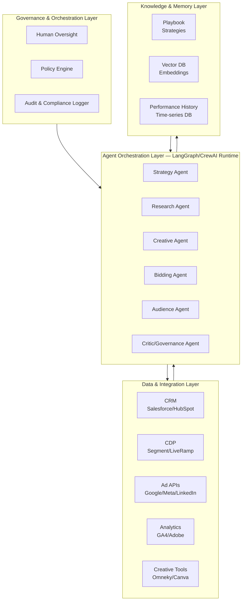

### 2.2 Agent Orchestration — Collaborative Swarm Pattern

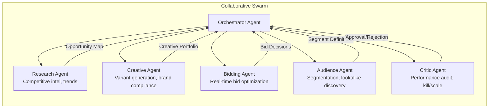

### 2.3 The Autonomous Campaign Flywheel

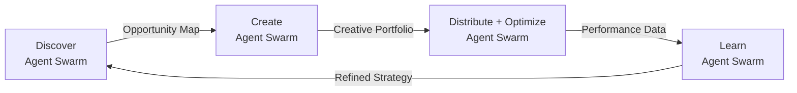

**Phase 1 – Discover**: Research agents scan competitor ads, search trends, intent signals, and market shifts. Output: opportunity map with prioritized segments and channels.

**Phase 2 – Create**: Creative agents generate multi-format variants (text, image, video) tailored to discovered segments. Output: tested creative portfolio ready for deployment.

**Phase 3 – Distribute + Optimize**: Execution agents deploy across channels; bidding agents manage real-time spend; optimization agents monitor and adjust. Output: live campaigns with continuous performance data.

**Phase 4 – Learn**: Analytics agents process performance data, update attribution models, and feed insights back to Phase 1. Output: refined strategy, updated playbook, improved future performance.

### 2.4 Data Flow Architecture

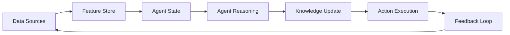

### 2.5 Governance & Autonomy Levels

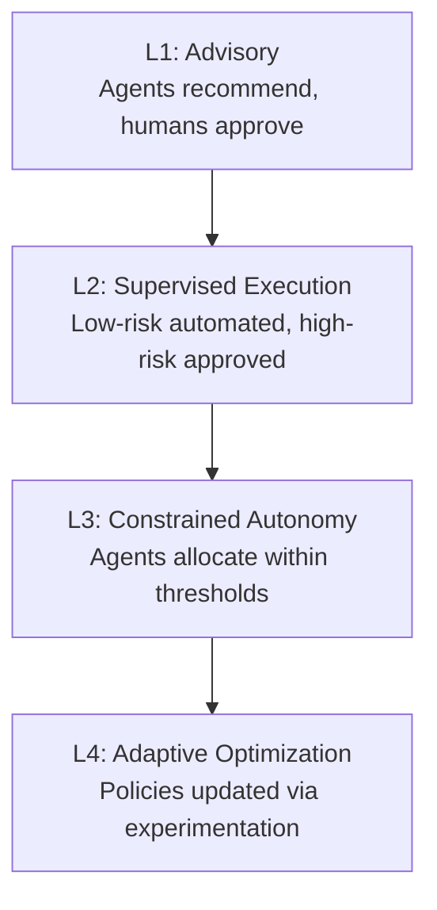

| Level | Description | Use Case |
|-------|-------------|----------|
| **L1: Advisory** | Agents recommend; humans approve all actions | Initial deployment, high-risk channels |
| **L2: Supervised Execution** | Low-risk actions automated; high-risk require approval | Email timing, creative rotation |
| **L3: Constrained Autonomy** | Agents allocate budget within explicit thresholds | Bid management, budget pacing |
| **L4: Adaptive Optimization** | Policies updated via monitored experimentation | Full-funnel optimization |

**Key insight**: Organizations maintaining 20–30% human oversight achieve 15% better results than zero oversight. The sweet spot is 70–80% autonomous operation with strategic human oversight.

---

## 3. Agent Roles & Responsibilities

### 3.1 Strategy Agent

| Attribute | Detail |
|-----------|--------|
| **Role** | Campaign planning, objective decomposition, competitive strategy |
| **Inputs** | Business goals, historical performance, market conditions, budget constraints |
| **Outputs** | Campaign briefs, channel mix recommendations, budget allocation plans |
| **Model** | Claude Opus 4.6 or GPT-5.2 (long-horizon planning) |
| **Tools** | Web search, competitive intelligence APIs, market research databases |
| **Responsibilities** | Translate business goals into campaign objectives; allocate budget across channels; define success metrics; coordinate other agents |

### 3.2 Research Agent

| Attribute | Detail |
|-----------|--------|
| **Role** | Continuous market monitoring, trend detection, competitor analysis |
| **Inputs** | Ad platform APIs, social listening, search trend data, intent signals |
| **Outputs** | Opportunity reports, audience insights, creative briefs |
| **Model** | Claude 3.7 Sonnet (fast, capable) |
| **Tools** | Web scraping, social APIs, Google Trends, SEMrush/Ahrefs |
| **Responsibilities** | Monitor competitor ads; detect market shifts; identify intent signals; generate creative briefs |

### 3.3 Creative Agent

| Attribute | Detail |
|-----------|--------|
| **Role** | Multi-format creative generation, brand compliance, variant testing |
| **Inputs** | Creative briefs, brand guidelines, audience segments, performance data |
| **Outputs** | Ad copy, image variants, video scripts, landing page content |
| **Model** | Multimodal (GPT-5.2 + image generation + video generation) |
| **Tools** | DALL-E/Midjourney, Runway Gen-4, copywriting templates, brand voice models |
| **Responsibilities** | Generate 100+ variants/day; maintain brand voice; produce platform-native formats; detect creative fatigue |

### 3.4 Bidding Agent

| Attribute | Detail |
|-----------|--------|
| **Role** | Real-time bid optimization, budget pacing, cross-channel allocation |
| **Inputs** | Auction data, conversion signals, budget constraints, performance targets |
| **Outputs** | Bid prices, budget reallocation decisions, pause/scale actions |
| **Model** | Fine-tuned RL model + LLM reasoning layer |
| **Tools** | Google Ads API, Meta Marketing API, LinkedIn Campaign Manager API, DSP APIs |
| **Responsibilities** | Real-time bid calculation; cross-channel budget reallocation; budget pacing; competitive response |

**Bid calculation formula**: `b_t = v_t × λ_base × (1 + α_t)` where `v_t` is impression value, `λ_base` is base bidding parameter, and `α_t` is adjustment factor from agent reasoning.

### 3.5 Audience Agent

| Attribute | Detail |
|-----------|--------|
| **Role** | Continuous segmentation, lookalike discovery, suppression management |
| **Inputs** | First-party data, third-party data, behavioral signals, conversion feedback |
| **Outputs** | Segment definitions, audience lists, activation recommendations |
| **Model** | Clustering algorithms + LLM for natural language segmentation |
| **Tools** | CDP APIs, data warehouse, identity resolution, platform audience APIs |
| **Responsibilities** | Continuous micro-segment discovery; lookalike expansion; suppression management; churn prediction |

### 3.6 Critic/Governance Agent

| Attribute | Detail |
|-----------|--------|
| **Role** | Performance audit, kill/scale decisions, compliance checking, brand safety |
| **Inputs** | All agent outputs, performance data, brand guidelines, budget constraints |
| **Outputs** | Approval/rejection decisions, optimization recommendations, audit reports |
| **Model** | Claude Opus 4.6 (adversarial reasoning) |
| **Tools** | All platform APIs, brand safety tools, compliance databases |
| **Responsibilities** | Audit all agent outputs; kill underperformers (<3 hrs); enforce brand compliance; generate audit reports |

---

## 4. Data Models & Schemas

### 4.1 Campaign Entity

```json
{
  "campaign_id": "camp_001",
  "name": "Q4 Enterprise Launch",
  "status": "active|paused|completed|killed",
  "objectives": {
    "primary": "lead_generation",
    "secondary": ["brand_awareness", "pipeline_growth"],
    "kpis": {
      "target_cac": 150.00,
      "target_roas": 4.0,
      "target_leads": 500
    }
  },
  "budget": {
    "total": 50000.00,
    "currency": "USD",
    "daily_cap": 2000.00,
    "channel_allocation": {
      "google_ads": 0.40,
      "meta_ads": 0.30,
      "linkedin": 0.20,
      "email": 0.10
    }
  },
  "timeline": {
    "start_date": "2026-10-01T00:00:00Z",
    "end_date": "2026-12-31T23:59:59Z"
  },
  "autonomy_level": "L3",
  "governance": {
    "max_blast_radius": 10000,
    "approval_threshold": "human",
    "spending_guardrails": {
      "max_daily_overspend_pct": 10,
      "max_cpa_variance_pct": 20
    }
  },
  "created_at": "2026-10-01T00:00:00Z",
  "updated_at": "2026-10-15T14:30:00Z"
}
```

### 4.2 Creative Variant Entity

```json
{
  "variant_id": "var_001",
  "campaign_id": "camp_001",
  "format": "image|video|text|carousel",
  "platform": "google_ads|meta_ads|linkedin|email|sms",
  "content": {
    "headline": "Transform Your Marketing with AI",
    "body": "Autonomous agents that plan, execute, and optimize...",
    "cta": "Start Free Trial",
    "image_url": "https://cdn.example.com/creative/var_001.png",
    "video_url": null
  },
  "targeting": {
    "segment_id": "seg_enterprise_saas",
    "audience_size": 50000
  },
  "performance": {
    "impressions": 125000,
    "clicks": 3750,
    "conversions": 150,
    "spend": 4500.00,
    "ctr": 0.03,
    "cpa": 30.00,
    "roas": 5.2
  },
  "status": "active|paused|killed|winner",
  "fatigue_score": 0.15,
  "brand_compliance_score": 0.97,
  "created_at": "2026-10-01T00:00:00Z"
}
```

### 4.3 Agent Decision Record

```json
{
  "decision_id": "dec_001",
  "agent_id": "agent_bidding_001",
  "agent_type": "bidding",
  "campaign_id": "camp_001",
  "action": "budget_reallocation",
  "timestamp": "2026-10-15T14:30:00Z",
  "context": {
    "current_performance": {
      "google_ads": {"cpa": 25.00, "roas": 5.2, "volume_trend": 0.3},
      "meta_ads": {"cpa": 45.00, "roas": 2.1, "volume_trend": -0.2}
    },
    "budget_remaining": 35000.00,
    "time_elapsed_pct": 0.5
  },
  "decision": {
    "from_channel": "meta_ads",
    "to_channel": "google_ads",
    "amount": 5000.00,
    "expected_roas_improvement": 1.3,
    "reasoning": "Google Ads showing 2.4× better ROAS with positive volume trend; Meta showing declining performance with saturation signals"
  },
  "governance": {
    "policy_check": "passed",
    "blast_radius": 5000,
    "approval_required": false,
    "evidence_hash": "sha256:abc123..."
  },
  "outcome": {
    "status": "executed",
    "actual_roas_improvement": 1.25,
    "feedback_incorporated": true
  }
}
```

### 4.4 Customer Journey Graph (ArangoDB)

```json
{
  "_key": "cust_12345",
  "_id": "customers/cust_12345",
  "demographics": {
    "company_size": "enterprise",
    "industry": "saas",
    "region": "us-west"
  },
  "behavioral": {
    "total_sessions": 47,
    "avg_session_duration": 320,
    "pages_per_session": 4.2,
    "email_engagement_rate": 0.35
  },
  "preferences": {
    "preferred_channel": "email",
    "content_affinity": ["case_studies", "webinars", "roi_calculators"],
    "optimal_contact_time": "tuesday_10am"
  },
  "predictive": {
    "ltv_estimate": 45000,
    "churn_risk": 0.12,
    "conversion_probability": 0.68,
    "next_best_action": "schedule_demo"
  },
  "consent": {
    "gdpr": true,
    "ccpa": true,
    "marketing_email": true,
    "last_consent_update": "2026-09-15T00:00:00Z"
  },
  "edges": {
    "interacted_with": ["campaign_camp_001", "campaign_camp_002"],
    "influenced_by": ["contact_ct_001"],
    "similar_to": ["cust_67890", "cust_11111"]
  }
}
```

### 4.5 Performance Time-Series (TimescaleDB)

```sql
CREATE TABLE campaign_metrics (
    time TIMESTAMPTZ NOT NULL,
    campaign_id TEXT NOT NULL,
    channel TEXT NOT NULL,
    variant_id TEXT,
    impressions INTEGER DEFAULT 0,
    clicks INTEGER DEFAULT 0,
    conversions INTEGER DEFAULT 0,
    spend DECIMAL(10,2) DEFAULT 0,
    revenue DECIMAL(10,2) DEFAULT 0,
    agent_id TEXT,
    metadata JSONB
);

SELECT create_hypertable('campaign_metrics', 'time');

-- Continuous aggregate for real-time dashboards
CREATE MATERIALIZED VIEW campaign_metrics_1min
WITH (timescaledb.continuous) AS
SELECT
    time_bucket('1 minute', time) AS bucket,
    campaign_id,
    channel,
    SUM(impressions) as impressions,
    SUM(clicks) as clicks,
    SUM(conversions) as conversions,
    SUM(spend) as spend,
    SUM(revenue) as revenue
FROM campaign_metrics
GROUP BY bucket, campaign_id, channel;
```

---

## 5. API Contracts

### 5.1 Campaign Management API

```yaml
openapi: 3.0.0
info:
  title: Autonomous Campaign API
  version: 1.0.0

paths:
  /api/v1/campaigns:
    post:
      summary: Create a new campaign
      requestBody:
        content:
          application/json:
            schema:
              $ref: '#/components/schemas/CampaignCreate'
      responses:
        201:
          description: Campaign created
          content:
            application/json:
              schema:
                $ref: '#/components/schemas/Campaign'

  /api/v1/campaigns/{campaignId}:
    get:
      summary: Get campaign details
      parameters:
        - name: campaignId
          in: path
          required: true
          schema:
            type: string
      responses:
        200:
          content:
            application/json:
              schema:
                $ref: '#/components/schemas/Campaign'

  /api/v1/campaigns/{campaignId}/decisions:
    get:
      summary: Get all agent decisions for a campaign
      parameters:
        - name: campaignId
          in: path
          required: true
          schema:
            type: string
        - name: agent_type
          in: query
          schema:
            type: string
            enum: [strategy, research, creative, bidding, audience, critic]
      responses:
        200:
          content:
            application/json:
              schema:
                type: array
                items:
                  $ref: '#/components/schemas/AgentDecision'

  /api/v1/campaigns/{campaignId}/optimize:
    post:
      summary: Trigger optimization cycle
      responses:
        202:
          description: Optimization triggered

  /api/v1/campaigns/{campaignId}/autonomy:
    put:
      summary: Update autonomy level
      requestBody:
        content:
          application/json:
            schema:
              type: object
              properties:
                level:
                  type: string
                  enum: [L1, L2, L3, L4]
      responses:
        200:
          description: Autonomy level updated
```

### 5.2 Creative Variant API

```yaml
paths:
  /api/v1/campaigns/{campaignId}/variants:
    post:
      summary: Generate creative variants
      requestBody:
        content:
          application/json:
            schema:
              type: object
              properties:
                count:
                  type: integer
                  default: 20
                formats:
                  type: array
                  items:
                    type: string
                    enum: [image, video, text, carousel]
                platforms:
                  type: array
                  items:
                    type: string
                    enum: [google_ads, meta_ads, linkedin, email]
      responses:
        201:
          content:
            application/json:
              schema:
                type: array
                items:
                  $ref: '#/components/schemas/CreativeVariant'

  /api/v1/variants/{variantId}/performance:
    get:
      summary: Get variant performance metrics
      responses:
        200:
          content:
            application/json:
              schema:
                $ref: '#/components/schemas/VariantPerformance'
```

### 5.3 Agent Decision API

```yaml
paths:
  /api/v1/agents/{agentId}/decisions:
    get:
      summary: Get decisions by agent
      parameters:
        - name: agentId
          in: path
          required: true
          schema:
            type: string
        - name: start_time
          in: query
          schema:
            type: string
            format: date-time
        - name: end_time
          in: query
          schema:
            type: string
            format: date-time
      responses:
        200:
          content:
            application/json:
              schema:
                type: array
                items:
                  $ref: '#/components/schemas/AgentDecision'

  /api/v1/agents/{agentId}/trust-score:
    get:
      summary: Get agent trust score
      responses:
        200:
          content:
            application/json:
              schema:
                type: object
                properties:
                  agent_id:
                    type: string
                  trust_score:
                    type: number
                  compliance_history:
                    type: object
                  anomaly_flags:
                    type: array
```

### 5.4 WebSocket — Real-Time Events

```yaml
# WebSocket endpoint for real-time campaign events
ws://api/v1/stream/campaigns/{campaignId}

# Event types
events:
  - campaign.created
  - campaign.status_changed
  - variant.deployed
  - variant.killed
  - variant.winner_selected
  - budget.reallocated
  - bid.adjusted
  - agent.decision_made
  - agent.escalated
  - performance.threshold_breached
  - compliance.violation_detected
```

---

## 6. Integration Patterns with Existing GRC_Claw Infrastructure

### 6.1 GRC_Claw Governance Integration

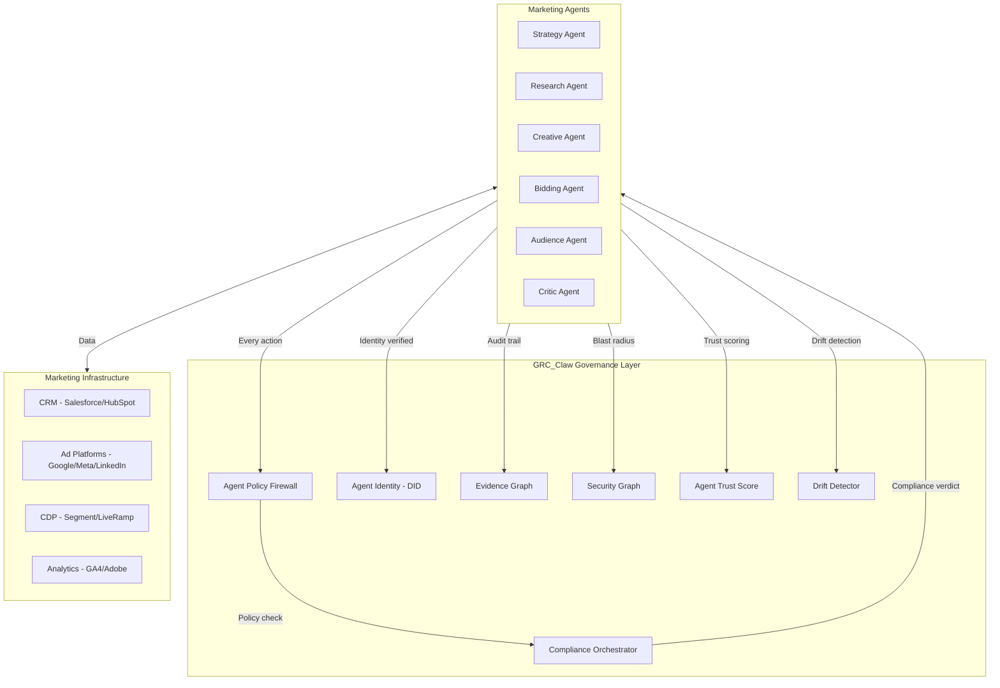

### 6.2 Agent Policy Firewall Configuration

```typescript
const marketingFirewall: FirewallContext = {
  tenantScope: ['campaign-001', 'segment-enterprise'],
  role: 'performance-marketing-agent',
  allowedTools: [
    'analytics.read',
    'audience.read',
    'content.generate',
    'bid.adjust',
    'budget.reallocate',
  ],
  deniedTools: [
    'budget.reallocate.cross-channel',
    'audience.export',
    'campaign.delete',
  ],
  sandboxPolicy: 'docker',
  approvalThreshold: 'human',
  dataBoundary: 'gdpr',
  maxBlastRadius: 10000,
  replayWindowSeconds: 300,
};
```

### 6.3 Agent Identity (DID)

```json
{
  "id": "did:grc:perf-mkt-agent-001",
  "credentials": [{
    "framework": "iso42001",
    "certifiedControls": ["A.6.1.1", "A.6.1.2", "A.6.1.3"],
    "toolTierAccess": ["read", "write"],
    "tenantScope": ["campaign-001"],
    "sovereignBoundary": "eu-only"
  }],
  "riskScore": 12,
  "status": "active",
  "metadata": {
    "channel": "paid-search",
    "budgetLimit": 50000,
    "brandGuidelinesVersion": "v3.2"
  }
}
```

### 6.4 Compliance Mapping

| Regulation | Marketing Controls | Enforcement Point |
|------------|-------------------|-------------------|
| **GDPR** | Consent management, right to erasure, data minimization | Audience targeting, data processing |
| **CCPA** | Opt-out rights, data sale disclosure | Data sharing, third-party integrations |
| **CAN-SPAM** | Unsubscribe headers, subject line accuracy, physical address | Email campaigns |
| **CASL** | Consent requirements, identification, unsubscribe | Canadian email marketing |
| **EU AI Act** | Transparency, risk classification, human oversight | AI-generated content, automated decision-making |

### 6.5 ApexGraphSwarm Integration

```python
from apexgraphswarm.kernels.shortest_path import dijkstra
from apexgraphswarm.kernels.community_detection import leiden
from apexgraphswarm.kernels.consensus import raft

# Build customer journey graph
journey_graph = build_journey_graph(customer_events)

# Find optimal path to conversion
optimal_path = dijkstra(
    graph=journey_graph,
    source="awareness",
    target="conversion",
    weight="expected_value"
)

# Discover micro-segments
communities = leiden(
    graph=journey_graph,
    resolution=1.0,
    weights="transition_frequency"
)

# Multi-agent consensus for budget reallocation
decision = raft.propose(
    cluster=[budget_agent, performance_agent, brand_agent],
    proposal={
        "action": "reallocate_budget",
        "from": "display",
        "to": "search",
        "amount": 5000,
        "expected_roas_improvement": 1.3
    },
    quorum=2
)
```

### 6.6 Nerve Supervision Integration

```yaml
# Campaign Definition of Done
campaign_dod:
  id: "camp-001-launch"
  criteria:
    - id: "DOD-01"
      description: "Campaign live on all channels"
      type: "mechanical"
      verifier: "api_check"
    - id: "DOD-02"
      description: "Tracking verified on all conversions"
      type: "mechanical"
      verifier: "pixel_check"
    - id: "DOD-03"
      description: "Brand compliance score > 0.95"
      type: "semantic"
      verifier: "jev_review"
    - id: "DOD-04"
      description: "Budget pacing within 10% of plan"
      type: "mechanical"
      verifier: "budget_check"
    - id: "DOD-05"
      description: "Creative variants meet CTR threshold"
      type: "semantic"
      verifier: "performance_review"
  budget: 70000
  evidence_required: true
```

### 6.7 Laya Real-Time Routing

```python
def route_campaign_decision(decision_input):
    laya_result = laya.decide({
        "text": decision_input.description,
        "context": decision_input.context
    })

    if laya_result.difficulty <= 1 and laya_result.needs_tools < 0.3:
        return auto_execute(decision_input)
    elif laya_result.difficulty <= 2 and laya_result.is_sensitive < 0.4:
        return agent_execute_with_review(decision_input)
    else:
        return escalate_to_human(decision_input)
```

### 6.8 Cognee Memory Integration

```python
# Store campaign learning
cognee.remember(
    text="Campaign camp_001: Google Ads outperformed Meta by 2.4× ROAS in Q4. Creative variant var_001 with enterprise messaging had highest CTR.",
    dataset="campaign-learnings",
    metadata={
        "campaign_id": "camp_001",
        "channel": "google_ads",
        "variant_id": "var_001",
        "timestamp": "2026-10-15T14:30:00Z"
    }
)

# Recall for future campaigns
context = cognee.recall(
    query="enterprise SaaS campaign performance Q4",
    top_k=5,
    scope="global"
)
```

### 6.9 LangChain DeepAgents Integration

```python
from deepagents import create_deep_agent
from langchain_core.tools import tool

# Research subagent
researcher = {
    "name": "researcher",
    "description": "Deep research on companies, markets, and prospects",
    "prompt": "You are a research subagent. Return structured findings with sources.",
    "tools": ["web_search", "fetch_url"],
}

# Creative subagent
writer = {
    "name": "writer",
    "description": "Drafts marketing content, emails, and campaigns",
    "prompt": "You are a content writer. Match brand voice and include CTAs.",
    "tools": ["write_file", "edit_file"],
}

# Analysis subagent
analyst = {
    "name": "analyst",
    "description": "Analyzes campaign performance and customer data",
    "prompt": "You are a data analyst. Return insights with supporting data.",
    "tools": ["query_database", "execute"],
}

agent = create_deep_agent(
    model="anthropic:claude-sonnet-5",
    tools=[crm_lookup, send_email, schedule_meeting],
    subagents=[researcher, writer, analyst],
    system_prompt="You are a GTM agent. Always research before outreach.",
    interrupt_on={"send_email": True, "schedule_meeting": True},
    backend=CompositeBackend(
        default=StateBackend(runtime),
        routes={"/memories/": StoreBackend(runtime)},
    ),
)
```

---

## 7. Implementation Roadmap

### 7.1 Phase 1: Foundation (Weeks 1–4)

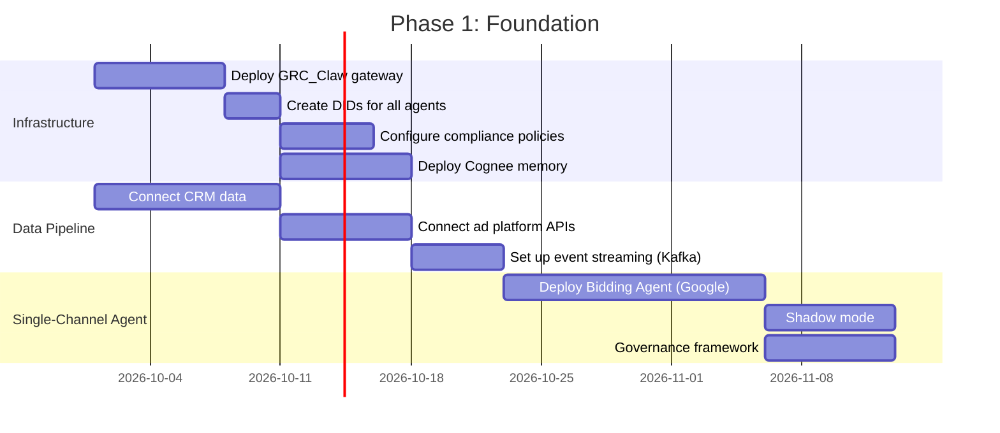

**Milestones:**
- [ ] GRC_Claw gateway operational with agent policy firewall
- [ ] All 6 agents have DIDs and verifiable credentials
- [ ] GDPR/CCPA/CAN-SPAM compliance policies compiled to ASTs
- [ ] Cognee knowledge graph indexed with historical campaign data
- [ ] Single-channel (Google Ads) bidding agent in shadow mode
- [ ] Human approval workflow for all agent actions (L1)

### 7.2 Phase 2: Multi-Agent Deployment (Weeks 5–12)

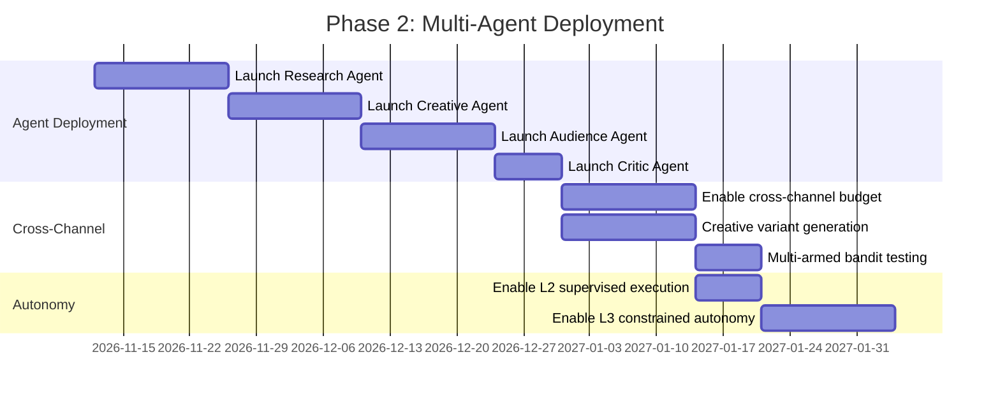

**Milestones:**
- [ ] All 6 agents operational in collaborative swarm
- [ ] Cross-channel budget reallocation active
- [ ] 100+ creative variants/day generated and tested
- [ ] Critic agent killing underperformers within 3 hours
- [ ] L2 autonomy: low-risk actions automated
- [ ] L3 autonomy: budget allocation within thresholds

### 7.3 Phase 3: Full Autonomy (Weeks 13–24)

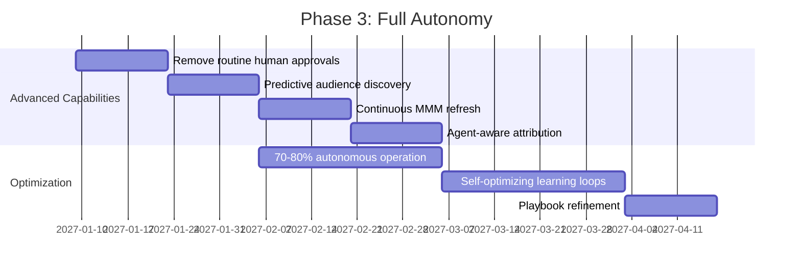

**Milestones:**
- [ ] 70–80% autonomous operation
- [ ] Predictive audience discovery active
- [ ] Continuous MMM refresh (near-real-time)
- [ ] Agent-aware Shapley value attribution
- [ ] Self-optimizing learning loops closed
- [ ] Playbook continuously refined

### 7.4 Phase 4: Self-Optimizing Organization (Months 7–12)

**Milestones:**
- [ ] Full closed-loop optimization
- [ ] Autonomous strategy generation
- [ ] Cross-channel creative orchestration
- [ ] Continuous learning and playbook refinement
- [ ] L4 adaptive optimization enabled
- [ ] $30K+ MRR achieved

---

## 8. Success Metrics & KPIs

### 8.1 Primary KPIs

| KPI | Baseline | Target (Month 6) | Target (Month 12) |
|-----|----------|-------------------|-------------------|
| **CAC** | $200 | $130 (35% reduction) | $80 (60% reduction) |
| **ROAS** | 2.0× | 6.0× | 9.0× |
| **Creative velocity** | 5 variants/week | 100+ variants/day | 200+ variants/day |
| **Time to launch** | 3 days | 30 minutes | 5 minutes |
| **Autonomous operation** | 0% | 70% | 80% |
| **Agent decision accuracy** | N/A | 85% | 95% |
| **Budget pacing accuracy** | ±25% | ±10% | ±5% |

### 8.2 Agent Performance Metrics

| Metric | Definition | Target |
|--------|-----------|--------|
| **Decision latency** | Time from signal to action | <33ms (Laya), <200ms (Nerve) |
| **Kill speed** | Time to kill underperformer | <3 hours |
| **False positive rate** | Incorrect kill/scale decisions | <5% |
| **Trust score** | Agent reliability score | >0.85 |
| **Compliance pass rate** | Actions passing policy check | >99% |
| **Blast radius** | Max customers affected per action | <10,000 |

### 8.3 Business Metrics

| Metric | Definition | Target |
|--------|-----------|--------|
| **Agent-Sourced Revenue (ASR)** | Revenue where agent channel is present | 40% of total |
| **Agent-Assist Rate** | % of conversions with agent interaction | 60% |
| **Incrementality** | Lift vs. control group | 25%+ |
| **MRR** | Monthly recurring revenue | $30K–60K |
| **Client retention** | Monthly churn | <5% |
| **NPS** | Net Promoter Score | >50 |

### 8.4 Attribution Metrics

| Metric | Definition | Why It Matters |
|--------|-----------|----------------|
| **Agent-Sourced Revenue (ASR)** | Revenue where agent channel is present in the journey | Quantifies agent-driven revenue |
| **Agent-Assist Rate** | % of conversions with agent interaction in path | Measures agent influence |
| **Cognitive Credit** | Shapley value of agent reasoning nodes | Fair credit distribution |
| **Agent-Attributed CPL** | Cost per lead including agent-qualified leads | True cost efficiency |
| **Incrementality** | Lift vs. control group (no agent) | Causal impact measurement |

---

## 9. Revenue Model

### 9.1 Pricing Tiers

| Tier | Price | Target | Features |
|------|-------|--------|----------|
| **Starter** | $500/mo | SMBs, single channel | 1 channel, 5 agents, L2 autonomy, basic analytics |
| **Professional** | $1,200/mo | Mid-market, multi-channel | 3 channels, 6 agents, L3 autonomy, full analytics |
| **Enterprise** | $2,500–5,000/mo | Agencies, enterprises | Unlimited channels, 6 agents, L4 autonomy, custom integrations |
| **Agency White-Label** | $2,000/mo + usage | Marketing agencies | White-label, sub-accounts, client management |

### 9.2 Revenue Projections

| Timeline | Clients | MRR | ARR |
|----------|---------|-----|-----|
| Month 3 | 5 | $3,000 | $36,000 |
| Month 6 | 20 | $30,000 | $360,000 |
| Month 9 | 40 | $45,000 | $540,000 |
| Month 12 | 60 | $60,000 | $720,000 |

### 9.3 Revenue Streams

1. **Subscription (70%)**: Monthly SaaS fees per client
2. **Usage-based (20%)**: Per-decision pricing for API access
3. **Professional services (10%)**: Implementation, training, custom integrations

### 9.4 Unit Economics

| Metric | Value |
|--------|-------|
| **CAC (Customer Acquisition Cost)** | $500 |
| **LTV (Lifetime Value)** | $18,000 (12-month average) |
| **LTV:CAC ratio** | 36:1 |
| **Gross margin** | 85% |
| **Payback period** | 1 month |

---

## 10. Competitive Moat

### 10.1 Self-Optimizing Learning Loops

Only Meta Advantage+ and Anyword have learning loops; neither is a full-funnel orchestrator. Our system closes the loop: Discover → Create → Distribute → Learn → Discover, with each cycle improving the next.

### 10.2 Graph-Native Architecture

Customer relationships stored as graph (ArangoDB), not relational tables — enables O(1) relationship traversal, community detection for micro-segmentation, and Shapley value attribution.

### 10.3 Cross-Session Memory

Cognee graph memory means the system gets smarter with every campaign cycle. Playbooks, creative performance, and audience insights persist and compound.

### 10.4 LLM-Agnostic

Apex Harness routes to the best model per task (Claude for reasoning, GPT-5 for multimodal, Llama for cost-sensitive). Not locked to any single AI provider.

### 10.5 Governance-First

GRC_Claw integration means audit-ready from day one — critical for enterprise. Cryptographic agent identity, policy firewall, blast radius scoring, and immutable evidence graph.

### 10.6 Competitive Differentiation Matrix

| Capability | GoHighLevel | HubSpot | This System |
|------------|-------------|---------|-------------|
| **Autonomous optimization** | Rule-based workflows | AI-assisted recommendations | Goal-oriented autonomous agents |
| **Optimization frequency** | Daily/weekly | Real-time (platform) | Real-time (seconds) |
| **Creative velocity** | Human-produced | AI-assisted | 100+ variants/day, auto-tested |
| **Budget allocation** | Manual/rules | Platform CBO | Cross-channel autonomous hourly |
| **Audience segmentation** | Static lists | Predictive scoring (Ent.) | Continuous micro-segment discovery |
| **Attribution** | Basic source tracking | Multi-touch (Ent.) | Agent-aware Shapley value |
| **Cross-channel intelligence** | Sequential workflows | Data sync | Unified optimization across channels |
| **Learning loop** | None | None | Continuous reflection + playbook |
| **Time to campaign launch** | Hours–days | Hours–days | Minutes (autonomous) |
| **CAC improvement** | Baseline | 10–20% (AI-assisted) | 35–60% (autonomous) |
| **Agent governance** | None | None | Cryptographic DID, policy firewall |
| **Audit trail** | Basic | Basic | Immutable evidence graph |

---
---

# Project 2: AI-Powered Lead Scoring & Qualification

## 1. Project Overview & Objectives

### 1.1 Vision

A predictive analytics and revenue intelligence system that goes beyond HubSpot's predictive lead scoring and GoHighLevel's basic reporting. Uses agentic AI to autonomously identify revenue opportunities, predict churn, recommend next-best-actions, and generate executive-ready insights — all without human analysts.

### 1.2 Objectives

| Objective | Target | Timeline |
|-----------|--------|----------|
| Lead scoring accuracy | 80–95%+ (vs. 55–65% rule-based) | Month 3 |
| Lead-to-opportunity conversion | +250% over baseline | Month 6 |
| Pipeline growth | 3× | Month 6 |
| Time saved per rep | 40 hours/month | Month 3 |
| Churn prediction accuracy | 85%+ | Month 4 |
| Insight generation | Autonomous, executive-ready | Month 2 |
| MRR | $30K–50K | Month 6–8 |

### 1.3 Exceeds

- **GoHighLevel:** Basic reporting and dashboards
- **HubSpot:** Predictive lead scoring (single-model, not multi-agent)

### 1.4 Core Gap Addressed

Lead scoring has evolved through three generations:

| Generation | How It Works | Accuracy | Key Tools |
|---|---|---|---|
| **Rule-Based (Manual)** | Marketing assigns points manually | 55–65% | HubSpot Starter, Pardot Basic |
| **Predictive (ML)** | Model trained on historical outcomes | 70–85% | Salesforce Einstein, HubSpot Enterprise |
| **Agent-Built (Agentic AI)** | Autonomous agents gather, verify, and weigh live evidence per record | 80–95%+ | Custom agentic pipelines |

The gap: No existing platform uses **multi-agent systems** that autonomously research leads, verify signals, weigh evidence, and continuously learn from outcomes.

---

## 2. Technical Architecture

### 2.1 High-Level Architecture

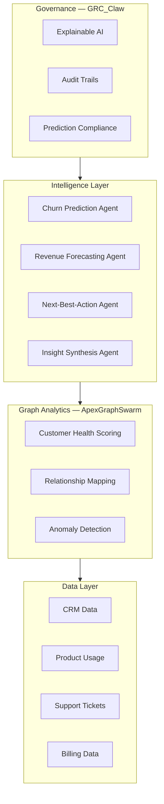

### 2.2 Multi-Agent Lead Qualification Workflow

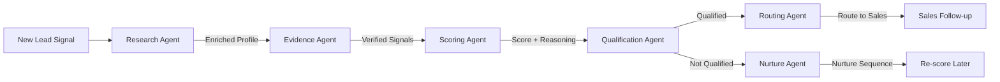

### 2.3 Agent-Built Scoring Pipeline

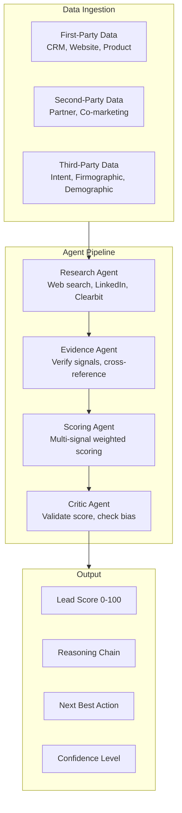

### 2.4 Real-Time Lead Enrichment

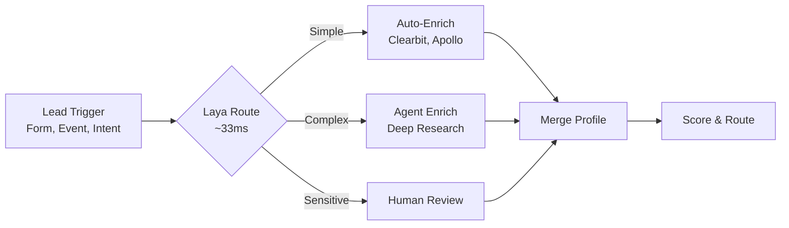

### 2.5 Churn Prediction Architecture

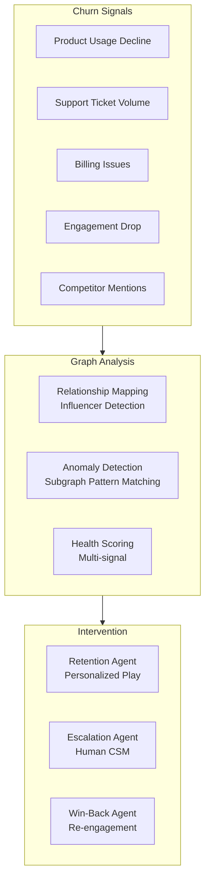

---

## 3. Agent Roles & Responsibilities

### 3.1 Research Agent

| Attribute | Detail |
|-----------|--------|
| **Role** | Deep research on companies, prospects, and market signals |
| **Inputs** | Lead trigger, CRM data, web signals |
| **Outputs** | Enriched company profile, technographics, intent signals |
| **Model** | Claude 3.7 Sonnet (fast, capable) |
| **Tools** | Web search, LinkedIn, Clearbit, Apollo, ZoomInfo, BigQuery |
| **Responsibilities** | Research prospect background; identify intent signals; find decision-makers; gather competitive intelligence |

### 3.2 Evidence Agent

| Attribute | Detail |
|-----------|--------|
| **Role** | Verify and cross-reference all signals before scoring |
| **Inputs** | Raw research data, CRM history, third-party data |
| **Outputs** | Verified evidence chain with confidence scores |
| **Model** | Claude 3.7 Sonnet + rule-based validation |
| **Tools** | CRM API, data validation APIs, cross-reference databases |
| **Responsibilities** | Verify signal authenticity; cross-reference multiple sources; flag conflicting information; assign confidence scores |

### 3.3 Scoring Agent

| Attribute | Detail |
|-----------|--------|
| **Role** | Multi-signal weighted scoring with reasoning |
| **Inputs** | Verified evidence, historical conversion data, ICP model |
| **Outputs** | Lead score (0-100), reasoning chain, confidence level |
| **Model** | Fine-tuned ML model + LLM reasoning layer |
| **Tools** | ML model serving, feature store, ICP database |
| **Responsibilities** | Weight multiple signals; apply ICP model; generate reasoning; assign confidence; detect anomalies |

**Scoring dimensions:**
- **Fit score** (0-30): Firmographic/technographic match to ICP
- **Intent score** (0-30): Behavioral intent signals
- **Engagement score** (0-20): Current engagement level
- **Relationship score** (0-20): Existing relationship strength

### 3.4 Qualification Agent

| Attribute | Detail |
|-----------|--------|
| **Role** | Final qualification decision with BANT/MEDDIC framework |
| **Inputs** | Lead score, evidence chain, qualification criteria |
| **Outputs** | Qualified/not-qualified, qualification notes, recommended actions |
| **Model** | Claude Opus 4.6 (complex reasoning) |
| **Tools** | CRM API, qualification framework, routing rules |
| **Responsibilities** | Apply BANT/MEDDIC framework; make qualification decision; generate notes for sales; recommend next steps |

### 3.5 Churn Prediction Agent

| Attribute | Detail |
|-----------|--------|
| **Role** | Predict churn risk and trigger retention actions |
| **Inputs** | Product usage, support tickets, billing, engagement data |
| **Outputs** | Churn risk score, contributing factors, recommended interventions |
| **Model** | Random Forest + XGBoost + LLM reasoning |
| **Tools** | ML model serving, graph analytics, customer health data |
| **Responsibilities** | Monitor churn signals; calculate health scores; identify at-risk accounts; trigger retention campaigns |

### 3.6 Next-Best-Action Agent

| Attribute | Detail |
|-----------|--------|
| **Role** | Recommend optimal next action for each lead/account |
| **Inputs** | Lead score, customer context, historical outcomes, playbook |
| **Outputs** | Recommended action, channel, timing, content |
| **Model** | Reinforcement learning + LLM reasoning |
| **Tools** | Playbook database, channel APIs, content templates |
| **Responsibilities** | Select optimal action; determine best channel; optimize timing; personalize content |

### 3.7 Insight Synthesis Agent

| Attribute | Detail |
|-----------|--------|
| **Role** | Generate executive-ready narratives from analytics |
| **Inputs** | All agent outputs, performance data, trends |
| **Outputs** | Executive summary, trend analysis, recommendations |
| **Model** | Claude Opus 4.6 (long-form reasoning) |
| **Tools** | Analytics APIs, visualization tools, report templates |
| **Responsibilities** | Synthesize findings; generate narratives; identify trends; recommend strategic actions |

---

## 4. Data Models & Schemas

### 4.1 Lead Entity

```json
{
  "lead_id": "lead_001",
  "source": "website_form|paid_ads|organic|referral|outbound",
  "status": "new|researching|scored|qualified|nurturing|converted|disqualified",
  "profile": {
    "email": "jane@company.com",
    "first_name": "Jane",
    "last_name": "Smith",
    "title": "VP of Marketing",
    "company": "Acme Corp",
    "company_size": "500-1000",
    "industry": "SaaS",
    "region": "us-west",
    "website": "https://acme.com",
    "linkedin_url": "https://linkedin.com/in/janesmith"
  },
  "enrichment": {
    "technographics": ["salesforce", "hubspot", "marketo"],
    "firmographics": {
      "revenue": "$50M-$100M",
      "employees": 750,
      "founded": 2015
    },
    "intent_signals": [
      {"type": "product_page_visit", "timestamp": "2026-10-01T10:00:00Z", "confidence": 0.9},
      {"type": "competitor_comparison", "timestamp": "2026-10-02T14:00:00Z", "confidence": 0.7}
    ]
  },
  "scoring": {
    "total_score": 78,
    "fit_score": 24,
    "intent_score": 28,
    "engagement_score": 14,
    "relationship_score": 12,
    "confidence": 0.85,
    "reasoning": "Strong ICP fit (enterprise SaaS), high intent (visited pricing page 3×), moderate engagement (opened 2 emails), no existing relationship",
    "scored_at": "2026-10-15T14:30:00Z",
    "scoring_model_version": "v2.3"
  },
  "qualification": {
    "status": "qualified",
    "framework": "MEDDIC",
    "criteria": {
      "metrics": "identified",
      "economic_buyer": "identified",
      "decision_criteria": "identified",
      "decision_process": "partial",
      "identify_pain": "identified",
      "champion": "identified"
    },
    "qualified_at": "2026-10-15T15:00:00Z"
  },
  "routing": {
    "assigned_to": "rep_001",
    "priority": "high",
    "recommended_action": "schedule_demo",
    "recommended_channel": "email",
    "recommended_timing": "tuesday_10am"
  },
  "created_at": "2026-10-01T10:00:00Z",
  "updated_at": "2026-10-15T15:00:00Z"
}
```

### 4.2 Lead Score History

```json
{
  "lead_id": "lead_001",
  "score_history": [
    {
      "timestamp": "2026-10-01T10:00:00Z",
      "score": 45,
      "signals": ["website_visit"],
      "model_version": "v2.3"
    },
    {
      "timestamp": "2026-10-05T14:00:00Z",
      "score": 62,
      "signals": ["website_visit", "pricing_page", "email_open"],
      "model_version": "v2.3"
    },
    {
      "timestamp": "2026-10-10T09:00:00Z",
      "score": 78,
      "signals": ["website_visit", "pricing_page", "email_open", "demo_request", "linkedin_engagement"],
      "model_version": "v2.3"
    }
  ],
  "score_trend": "increasing",
  "score_velocity": 3.3,
  "predicted_conversion_probability": 0.68
}
```

### 4.3 Customer Health Graph (ArangoDB)

```json
{
  "_key": "acme_corp",
  "_id": "accounts/acme_corp",
  "account_tier": "enterprise",
  "health_score": 72,
  "health_trend": "declining",
  "signals": {
    "product_usage": {
      "trend": -0.15,
      "last_30_days_sessions": 45,
      "previous_30_days_sessions": 53,
      "feature_adoption_rate": 0.35
    },
    "support": {
      "open_tickets": 8,
      "avg_resolution_time_hours": 48,
      "csat_score": 3.2,
      "escalation_count": 2
    },
    "billing": {
      "plan": "enterprise",
      "mrr": 5000,
      "payment_delays": 1,
      "expansion_opportunity": true
    },
    "engagement": {
      "email_open_rate": 0.15,
      "last_webinar_attendance": "2026-08-15",
      "nps_score": 7,
      "executive_sponsor_active": false
    }
  },
  "relationships": {
    "champion": ["jane_smith"],
    "economic_buyer": ["john_doe"],
    "influencers": ["bob_wilson"],
    "competitor_connections": ["competitor_x"],
    "similar_accounts": ["similar_corp_1", "similar_corp_2"]
  },
  "churn_risk": {
    "score": 0.35,
    "factors": ["declining_usage", "low_engagement", "inactive_sponsor"],
    "predicted_churn_date": "2027-01-15",
    "confidence": 0.72
  },
  "edges": {
    "interacted_with": ["campaign_001", "campaign_002"],
    "influenced_by": ["contact_jane_smith"],
    "similar_to": ["account_similar_1", "account_similar_2"]
  }
}
```

### 4.4 Agent Decision Record

```json
{
  "decision_id": "dec_lead_001",
  "agent_id": "agent_scoring_001",
  "agent_type": "scoring",
  "lead_id": "lead_001",
  "action": "score_lead",
  "timestamp": "2026-10-15T14:30:00Z",
  "context": {
    "input_signals": ["website_visit", "pricing_page", "email_open", "demo_request"],
    "icp_match": true,
    "historical_similar_leads": 150,
    "similar_lead_conversion_rate": 0.42
  },
  "decision": {
    "score": 78,
    "confidence": 0.85,
    "reasoning": "Strong ICP fit, high intent signals, moderate engagement. Similar leads converted at 42% rate.",
    "model_version": "v2.3",
    "feature_importance": {
      "intent_signals": 0.35,
      "icp_fit": 0.30,
      "engagement": 0.20,
      "relationship": 0.15
    }
  },
  "governance": {
    "bias_check": "passed",
    "fairness_score": 0.92,
    "explainability": "full",
    "audit_trail": "sha256:abc123..."
  },
  "outcome": {
    "status": "executed",
    "actual_conversion": null,
    "feedback_incorporated": false
  }
}
```

### 4.5 Time-Series Metrics (TimescaleDB)

```sql
CREATE TABLE lead_metrics (
    time TIMESTAMPTZ NOT NULL,
    lead_id TEXT NOT NULL,
    score DECIMAL(5,2),
    signals JSONB,
    conversion BOOLEAN DEFAULT FALSE,
    revenue DECIMAL(10,2),
    agent_id TEXT
);

SELECT create_hypertable('lead_metrics', 'time');

-- Score distribution over time
CREATE MATERIALIZED VIEW lead_score_distribution
WITH (timescaledb.continuous) AS
SELECT
    time_bucket('1 hour', time) AS bucket,
    COUNT(*) as total_leads,
    AVG(score) as avg_score,
    PERCENTILE_CONT(0.5) WITHIN GROUP (ORDER BY score) as median_score,
    SUM(CASE WHEN conversion THEN 1 ELSE 0 END)::FLOAT / COUNT(*) as conversion_rate
FROM lead_metrics
GROUP BY bucket;
```

---

## 5. API Contracts

### 5.1 Lead Scoring API

```yaml
openapi: 3.0.0
info:
  title: AI Lead Scoring API
  version: 1.0.0

paths:
  /api/v1/leads:
    post:
      summary: Ingest a new lead
      requestBody:
        content:
          application/json:
            schema:
              $ref: '#/components/schemas/LeadCreate'
      responses:
        201:
          description: Lead ingested and queued for scoring
          content:
            application/json:
              schema:
                $ref: '#/components/schemas/Lead'

  /api/v1/leads/{leadId}/score:
    get:
      summary: Get lead score
      parameters:
        - name: leadId
          in: path
          required: true
          schema:
            type: string
      responses:
        200:
          content:
            application/json:
              schema:
                $ref: '#/components/schemas/LeadScore'

  /api/v1/leads/{leadId}/score:
    post:
      summary: Trigger re-scoring
      responses:
        202:
          description: Re-scoring triggered

  /api/v1/leads/{leadId}/enrich:
    post:
      summary: Trigger enrichment
      responses:
        202:
          description: Enrichment triggered

  /api/v1/leads/{leadId}/qualify:
    post:
      summary: Trigger qualification
      responses:
        202:
          description: Qualification triggered
```

### 5.2 Churn Prediction API

```yaml
paths:
  /api/v1/accounts/{accountId}/health:
    get:
      summary: Get account health score
      responses:
        200:
          content:
            application/json:
              schema:
                $ref: '#/components/schemas/AccountHealth'

  /api/v1/accounts/{accountId}/churn-risk:
    get:
      summary: Get churn risk assessment
      responses:
        200:
          content:
            application/json:
              schema:
                $ref: '#/components/schemas/ChurnRisk'

  /api/v1/accounts/{accountId}/interventions:
    get:
      summary: Get recommended interventions
      responses:
        200:
          content:
            application/json:
              schema:
                type: array
                items:
                  $ref: '#/components/schemas/Intervention'
```

### 5.3 Insight API

```yaml
paths:
  /api/v1/insights/executive-summary:
    get:
      summary: Get executive-ready summary
      parameters:
        - name: period
          in: query
          schema:
            type: string
            enum: [daily, weekly, monthly]
      responses:
        200:
          content:
            application/json:
              schema:
                $ref: '#/components/schemas/ExecutiveSummary'

  /api/v1/insights/trends:
    get:
      summary: Get trend analysis
      responses:
        200:
          content:
            application/json:
              schema:
                type: array
                items:
                  $ref: '#/components/schemas/Trend'

  /api/v1/insights/recommendations:
    get:
      summary: Get AI-generated recommendations
      responses:
        200:
          content:
            application/json:
              schema:
                type: array
                items:
                  $ref: '#/components/schemas/Recommendation'
```

### 5.4 WebSocket — Real-Time Lead Events

```yaml
ws://api/v1/stream/leads

events:
  - lead.created
  - lead.enriched
  - lead.scored
  - lead.qualified
  - lead.routed
  - lead.converted
  - lead.disqualified
  - score.significant_change
  - churn_risk.detected
  - intervention.recommended
```

---

## 6. Integration Patterns with Existing GRC_Claw Infrastructure

### 6.1 GRC_Claw Integration

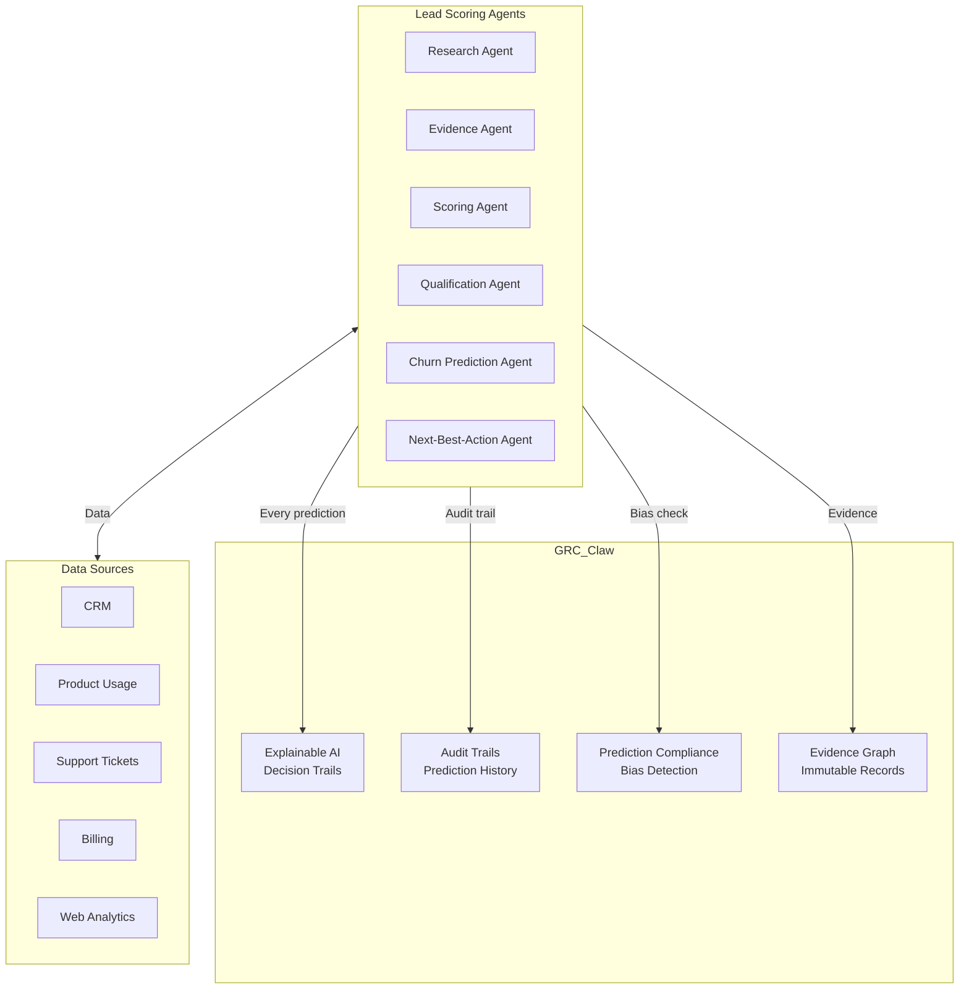

### 6.2 Explainable AI Integration

Every prediction includes a full reasoning chain:

```json
{
  "prediction_id": "pred_001",
  "lead_id": "lead_001",
  "prediction_type": "lead_score",
  "score": 78,
  "reasoning_chain": [
    {
      "step": 1,
      "agent": "research_agent",
      "action": "gather_signals",
      "output": "Found 5 intent signals from web analytics and CRM"
    },
    {
      "step": 2,
      "agent": "evidence_agent",
      "action": "verify_signals",
      "output": "4 of 5 signals verified with high confidence"
    },
    {
      "step": 3,
      "agent": "scoring_agent",
      "action": "calculate_score",
      "output": "Weighted score: fit(24) + intent(28) + engagement(14) + relationship(12) = 78"
    },
    {
      "step": 4,
      "agent": "critic_agent",
      "action": "validate",
      "output": "Score validated, no bias detected, confidence 0.85"
    }
  ],
  "feature_importance": {
    "intent_signals": 0.35,
    "icp_fit": 0.30,
    "engagement": 0.20,
    "relationship": 0.15
  },
  "bias_check": {
    "passed": true,
    "fairness_score": 0.92,
    "protected_attributes_checked": ["gender", "age", "ethnicity", "location"]
  }
}
```

### 6.3 ApexGraphSwarm Integration

```python
from apexgraphswarm.kernels.community_detection import leiden
from apexgraphswarm.kernels.shortest_path import dijkstra

# Build lead similarity graph
lead_graph = build_lead_similarity_graph(leads)

# Discover lead clusters (micro-segments)
clusters = leiden(
    graph=lead_graph,
    resolution=0.8,
    weights="similarity_score"
)

# Find optimal conversion path
conversion_path = dijkstra(
    graph=lead_journey_graph,
    source="lead",
    target="conversion",
    weight="conversion_probability"
)
```

### 6.4 Nerve Supervision

```yaml
lead_scoring_dod:
  id: "lead_001_scoring"
  criteria:
    - id: "DOD-01"
      description: "All signals verified"
      type: "mechanical"
      verifier: "evidence_check"
    - id: "DOD-02"
      description: "Score calculated with reasoning"
      type: "semantic"
      verifier: "reasoning_check"
    - id: "DOD-03"
      description: "Bias check passed"
      type: "mechanical"
      verifier: "fairness_check"
    - id: "DOD-04"
      description: "Confidence > 0.70"
      type: "mechanical"
      verifier: "confidence_check"
  budget: 5000
  evidence_required: true
```

### 6.5 Laya Real-Time Routing

```python
def route_lead_processing(lead_data):
    laya_result = laya.decide({
        "text": f"New lead from {lead_data['source']}: {lead_data['company']}",
        "context": lead_data
    })

    if laya_result.difficulty <= 1:
        # Simple lead → auto-score
        return auto_score(lead_data)
    elif laya_result.difficulty <= 2:
        # Moderate → agent scoring with review
        return agent_score_with_review(lead_data)
    else:
        # Complex → full research pipeline
        return full_research_pipeline(lead_data)
```

### 6.6 Cognee Memory

```python
# Store lead scoring learning
cognee.remember(
    text="Leads with pricing page visits + demo requests convert at 68% rate. Enterprise SaaS leads with 500+ employees have 2.3× higher LTV.",
    dataset="lead-scoring-learnings",
    metadata={
        "lead_id": "lead_001",
        "outcome": "converted",
        "ltv": 45000,
        "timestamp": "2026-10-15T14:30:00Z"
    }
)

# Recall for future scoring
context = cognee.recall(
    query="enterprise SaaS lead conversion patterns",
    top_k=10,
    scope="global"
)
```

### 6.7 LangChain DeepAgents Integration

```python
from deepagents import create_deep_agent

# Research subagent
researcher = {
    "name": "researcher",
    "description": "Deep research on companies and prospects",
    "prompt": "You are a research subagent. Return structured findings with sources.",
    "tools": ["web_search", "fetch_url"],
}

# Analysis subagent
analyst = {
    "name": "analyst",
    "description": "Analyzes lead data and scoring patterns",
    "prompt": "You are a data analyst. Return insights with supporting data.",
    "tools": ["query_database", "execute"],
}

agent = create_deep_agent(
    model="anthropic:claude-sonnet-5",
    tools=[crm_lookup, score_lead, enrich_lead],
    subagents=[researcher, analyst],
    system_prompt="You are a lead scoring agent. Always research before scoring.",
    interrupt_on={"route_to_sales": True},
    backend=CompositeBackend(
        default=StateBackend(runtime),
        routes={"/memories/": StoreBackend(runtime)},
    ),
)
```

---

## 7. Implementation Roadmap

### 7.1 Phase 1: Foundation (Weeks 1–4)

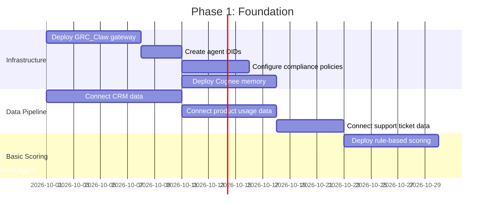

**Milestones:**
- [ ] GRC_Claw gateway operational
- [ ] All agents have DIDs
- [ ] Data pipeline connected (CRM, product, support, billing)
- [ ] Rule-based scoring baseline established
- [ ] Research and Evidence agents deployed
- [ ] Shadow mode: agents recommend, humans approve

### 7.2 Phase 2: Multi-Agent Scoring (Weeks 5–12)

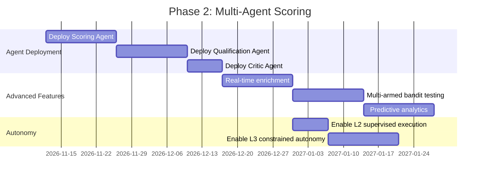

**Milestones:**
- [ ] All 6 agents operational
- [ ] Real-time lead enrichment active
- [ ] Multi-armed bandit testing for scoring models
- [ ] Predictive analytics deployed
- [ ] L2/L3 autonomy enabled

### 7.3 Phase 3: Full Autonomy (Weeks 13–24)

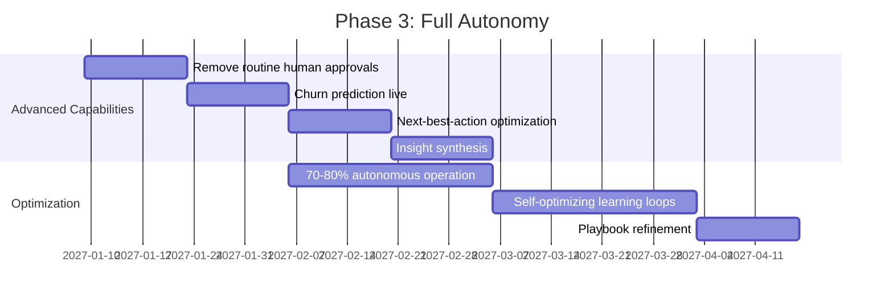

**Milestones:**
- [ ] 70–80% autonomous operation
- [ ] Churn prediction live
- [ ] Next-best-action optimization active
- [ ] Insight synthesis generating executive-ready reports
- [ ] Self-optimizing learning loops closed

### 7.4 Phase 4: Self-Optimizing (Months 7–12)

**Milestones:**
- [ ] Full closed-loop optimization
- [ ] Autonomous strategy generation
- [ ] Continuous learning and playbook refinement
- [ ] L4 adaptive optimization enabled
- [ ] $30K+ MRR achieved

---

## 8. Success Metrics & KPIs

### 8.1 Primary KPIs

| KPI | Baseline | Target (Month 6) | Target (Month 12) |
|-----|----------|-------------------|-------------------|
| **Scoring accuracy** | 60% (rule-based) | 85% | 95% |
| **Lead-to-opportunity conversion** | 10% | 25% | 35% |
| **Pipeline growth** | 1× | 2× | 3× |
| **Time saved per rep** | 0 hrs/month | 30 hrs/month | 40 hrs/month |
| **Churn prediction accuracy** | N/A | 80% | 90% |
| **Insight generation** | Manual | Semi-autonomous | Fully autonomous |
| **MRR** | $0 | $30K | $50K |

### 8.2 Agent Performance Metrics

| Metric | Definition | Target |
|--------|-----------|--------|
| **Scoring latency** | Time from lead trigger to score | <5 seconds |
| **Enrichment accuracy** | % of enriched data points verified | >90% |
| **False positive rate** | Incorrect qualification decisions | <5% |
| **False negative rate** | Missed qualified leads | <10% |
| **Trust score** | Agent reliability score | >0.85 |
| **Compliance pass rate** | Actions passing policy check | >99% |

### 8.3 Business Metrics

| Metric | Definition | Target |
|--------|-----------|--------|
| **Agent-Sourced Pipeline** | Pipeline influenced by agent scoring | 60% |
| **Scoring ROI** | Revenue per dollar spent on scoring | 10:1 |
| **Sales productivity** | Rep time saved × rep count | 40 hrs/month/rep |
| **MRR** | Monthly recurring revenue | $30K–50K |
| **Client retention** | Monthly churn | <5% |
| **NPS** | Net Promoter Score | >50 |

---

## 9. Revenue Model

### 9.1 Pricing Tiers

| Tier | Price | Target | Features |
|------|-------|--------|----------|
| **Starter** | $300/mo | SMBs | Basic scoring, 1,000 leads/mo, email support |
| **Professional** | $800/mo | Mid-market | Advanced scoring, 10,000 leads/mo, churn prediction |
| **Enterprise** | $1,500/mo | Enterprises | Full platform, unlimited leads, custom models |
| **Agency** | $1,000/mo + usage | Marketing agencies | White-label, sub-accounts, client management |

### 9.2 Revenue Projections

| Timeline | Clients | MRR | ARR |
|----------|---------|-----|-----|
| Month 3 | 5 | $2,500 | $30,000 |
| Month 6 | 20 | $30,000 | $360,000 |
| Month 9 | 40 | $40,000 | $480,000 |
| Month 12 | 60 | $50,000 | $600,000 |

### 9.3 Revenue Streams

1. **Subscription (70%)**: Monthly SaaS fees per client
2. **Usage-based (20%)**: Per-lead pricing for API access
3. **Professional services (10%)**: Implementation, training, custom integrations

### 9.4 Unit Economics

| Metric | Value |
|--------|-------|
| **CAC (Customer Acquisition Cost)** | $400 |
| **LTV (Lifetime Value)** | $15,000 (12-month average) |
| **LTV:CAC ratio** | 37.5:1 |
| **Gross margin** | 85% |
| **Payback period** | 1 month |

---

## 10. Competitive Moat

### 10.1 Graph-Native Churn Prediction

Uses relationship signals (not just behavioral) — detects churn risk from partner/competitor connections. ApexGraphSwarm's community detection and anomaly detection catch issues before they appear in dashboards.

### 10.2 Autonomous Insight Generation

No data scientist required — agents synthesize and narrate findings. The Insight Synthesis Agent generates executive-ready reports with trend analysis and strategic recommendations.

### 10.3 Real-Time Anomaly Detection

Subgraph pattern matching catches issues before they appear in dashboards. The system monitors thousands of signals simultaneously and flags anomalies in real-time.

### 10.4 Explainable AI

GRC_Claw provides decision trails — critical for regulated industries. Every prediction includes a full reasoning chain, feature importance, and bias check results.

### 10.5 Multi-Agent Validation

The Critic Agent validates all scoring decisions, checks for bias, and ensures fairness. No single point of failure — multiple agents must agree on qualification decisions.

### 10.6 Competitive Differentiation Matrix

| Capability | GoHighLevel | HubSpot | This System |
|------------|-------------|---------|-------------|
| **Scoring method** | Rule-based | Predictive ML (single model) | Multi-agent with reasoning |
| **Scoring accuracy** | 55–65% | 70–85% | 80–95%+ |
| **Churn prediction** | None | Basic reporting | Graph-native, multi-signal |
| **Insight generation** | Manual dashboards | AI-assisted | Autonomous, executive-ready |
| **Explainability** | None | Limited | Full reasoning chain |
| **Bias detection** | None | None | Automated fairness checks |
| **Real-time enrichment** | None | Limited | Sub-second with verification |
| **Agent governance** | None | None | Cryptographic DID, policy firewall |
| **Audit trail** | Basic | Basic | Immutable evidence graph |
| **Time to value** | Days | Weeks | Minutes |

---
---

# Project 3: Agentic Customer Journey Orchestration

## 1. Project Overview & Objectives

### 1.1 Vision

An agentic system that designs, executes, and continuously optimizes individual customer journeys in real-time. Goes beyond HubSpot's Journey Builder (predefined paths) and GoHighLevel's workflows (rule-based) by creating truly adaptive 1:1 journeys that evolve based on each customer's behavior, preferences, and predicted next-best-action.

### 1.2 Objectives

| Objective | Target | Timeline |
|-----------|--------|----------|
| Personalization depth | True 1:1 (not segment-based) | Month 3 |
| Journey adaptation | Real-time based on live behavior | Month 4 |
| Conversion rate | +40% over segment-based journeys | Month 6 |
| Customer satisfaction | NPS >50 | Month 6 |
| Experiment velocity | 100+ experiments running simultaneously | Month 4 |
| Autonomous operation | 70–80% without human intervention | Month 6 |
| MRR | $30K–50K | Month 6–9 |

### 1.3 Exceeds

- **GoHighLevel:** Workflow automation (rule-based branching)
- **HubSpot:** Journey Builder (human-designed journeys with A/B testing)

### 1.4 Core Gap Addressed

Current journey orchestration tools operate on **predefined paths** — marketers design journeys with branching logic, and customers follow those paths. The fundamental limitations are:

1. **Static journeys**: Once designed, journeys don't adapt to individual behavior
2. **Segment-based**: Journeys target segments, not individuals
3. **Human-designed**: Marketers must predict all possible paths
4. **Slow experimentation**: A/B testing is limited to a few variants over weeks
5. **No predictive adaptation**: Journeys don't use predicted future state
6. **No cross-channel intelligence**: Each channel operates independently

---

## 2. Technical Architecture

### 2.1 High-Level Architecture

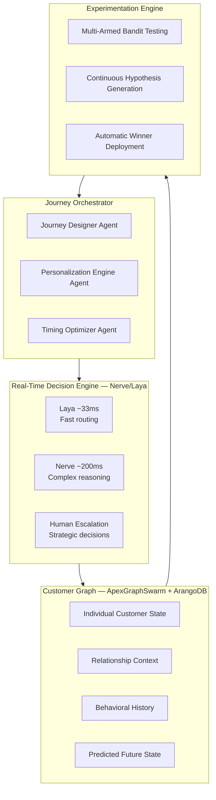

### 2.2 Multi-Agent Journey Optimization

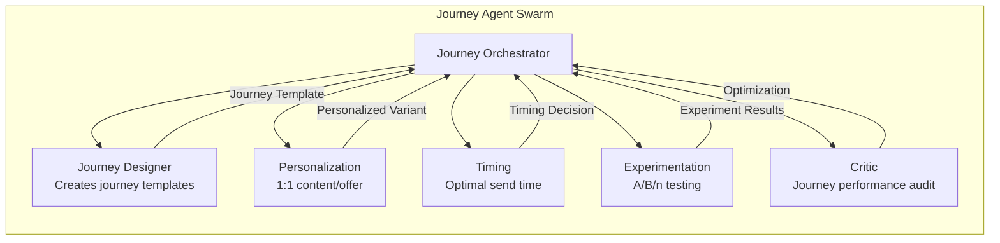

### 2.3 Real-Time Journey Adaptation

```mermaid
graph TD
    CE[Customer Event<br/>Click, Open, Visit, Purchase] --> LAYA{Laya Route<br/>~33ms}
    LAYA -->|Simple| AUTO[Auto-Adjust<br/>Next step in journey]
    LAYA -->|Complex| NERVE{Nerve Route<br/>~200ms}
    NERVE -->|Agent| AGENT[Journey Agent<br/>Re-optimize path]
    NERVE -->|Human| HUMAN[Human Review<br/>Strategic decision]
    AUTO --> UPDATE[Update Customer State]
    AGENT --> UPDATE
    HUMAN --> UPDATE
    UPDATE --> GRAPH[(Customer Graph<br/>ArangoDB)]
    GRAPH -->|New Optimal Path| JO[Journey Orchestrator]
    JO -->|Adjusted Journey| NEXT[Next Touchpoint]
```

### 2.4 Cross-Channel Journey Coordination

```mermaid
graph TB
    subgraph CHANNELS["Channel Connectors"]
        EMAIL[Email<br/>SendGrid/Mailchimp]
        SMS[SMS<br/>Twilio]
        PUSH[Push<br/>OneSignal]
        WEB[Web<br/>Personalization]
        ADS[Ads<br/>Google/Meta]
        CHAT[Chat<br/>Intercom/Drift]
    end

    subgraph ORCHESTRATOR["Journey Orchestrator"]
        CO[Cross-Channel Coordinator]
        CO -->|Suppression| SUPP[Suppression Manager]
        CO -->|Frequency| FREQ[Frequency Cap]
        CO -->|Attribution| ATTR[Attribution Engine]
    end

    CHANNELS --> ORCHESTRATOR
    ORCHESTRATOR --> CHANNELS
```

### 2.5 Predictive Journey Analytics

```mermaid
graph LR
    subgraph PREDICTIVE["Predictive Models"]
        CR[Conversion Prediction]
        CRV[Churn Prediction]
        LTV[LTV Prediction]
        NBA[Next-Best-Action]
    end

    subgraph ANALYTICS["Analytics Engine"]
        TA[Journey Analytics]
        PA[Path Analysis]
        FA[Funnel Analysis]
        CA[Cohort Analysis]
    end

    subgraph INSIGHTS["Insights"]
        OPT[Optimization Recs]
        ALERTS[Anomaly Alerts]
        REPORTS[Executive Reports]
    end

    PREDICTIVE --> ANALYTICS --> INSIGHTS
```

---

## 3. Agent Roles & Responsibilities

### 3.1 Journey Designer Agent

| Attribute | Detail |
|-----------|--------|
| **Role** | Creates journey templates and adapts them to individual customers |
| **Inputs** | Customer profile, journey objectives, historical journey performance |
| **Outputs** | Personalized journey templates, branching logic, exit criteria |
| **Model** | Claude Opus 4.6 (complex reasoning) |
| **Tools** | Journey builder API, customer graph, historical performance data |
| **Responsibilities** | Design journey templates; adapt to individual customers; define exit criteria; optimize branching logic |

### 3.2 Personalization Engine Agent

| Attribute | Detail |
|-----------|--------|
| **Role** | 1:1 personalization of content, offers, and messaging |
| **Inputs** | Customer preferences, behavioral history, predicted preferences |
| **Outputs** | Personalized content, offer selection, messaging tone |
| **Model** | Multimodal LLM + recommendation algorithms |
| **Tools** | Content templates, offer database, recommendation engine |
| **Responsibilities** | Personalize content per customer; select optimal offers; adapt messaging tone; maintain brand voice |

### 3.3 Timing Optimizer Agent

| Attribute | Detail |
|-----------|--------|
| **Role** | Determines optimal timing for each touchpoint |
| **Inputs** | Customer timezone, historical engagement patterns, real-time context |
| **Outputs** | Send time recommendations, frequency caps, sequence timing |
| **Model** | Time-series analysis + reinforcement learning |
| **Tools** | Engagement history, timezone database, send time optimization |
| **Responsibilities** | Optimize send times; manage frequency caps; sequence touchpoints; avoid fatigue |

### 3.4 Experimentation Agent

| Attribute | Detail |
|-----------|--------|
| **Role** | Designs, runs, and optimizes journey experiments |
| **Inputs** | Journey hypotheses, customer segments, performance data |
| **Outputs** | Experiment designs, winner declarations, deployment decisions |
| **Model** | Multi-armed bandit + Bayesian optimization |
| **Tools** | Experiment platform, statistical testing, bandit algorithms |
| **Responsibilities** | Generate hypotheses; design experiments; allocate traffic; declare winners; deploy optimal variants |

### 3.5 Critic Agent

| Attribute | Detail |
|-----------|--------|
| **Role** | Audits journey performance and recommends optimizations |
| **Inputs** | All journey data, performance metrics, customer feedback |
| **Outputs** | Performance audit, optimization recommendations, kill/scale decisions |
| **Model** | Claude Opus 4.6 (adversarial reasoning) |
| **Tools** | Analytics APIs, customer feedback, performance benchmarks |
| **Responsibilities** | Audit journey performance; identify underperformers; recommend optimizations; kill ineffective journeys |

### 3.6 Cross-Channel Coordinator Agent

| Attribute | Detail |
|-----------|--------|
| **Role** | Coordinates journeys across all channels |
| **Inputs** | Channel performance, customer channel preferences, suppression rules |
| **Outputs** | Channel selection, suppression decisions, frequency management |
| **Model** | Multi-objective optimization + LLM reasoning |
| **Tools** | Channel APIs, suppression lists, frequency cap rules |
| **Responsibilities** | Select optimal channel per touchpoint; manage cross-channel suppression; enforce frequency caps; coordinate timing |

---

## 4. Data Models & Schemas

### 4.1 Journey Entity

```json
{
  "journey_id": "journey_001",
  "name": "Enterprise Onboarding",
  "status": "active|paused|completed|archived",
  "objectives": {
    "primary": "activation",
    "secondary": ["engagement", "expansion"],
    "kpis": {
      "target_activation_rate": 0.60,
      "target_time_to_value_days": 7,
      "target_nps": 50
    }
  },
  "entry_criteria": {
    "segment": "enterprise_new_signup",
    "triggers": ["signup_completed", "contract_signed"],
    "exclusion": ["already_active", "churned_90_days"]
  },
  "steps": [
    {
      "step_id": "step_001",
      "order": 1,
      "channel": "email",
      "template": "welcome_email_v3",
      "timing": "immediate",
      "personalization": {
        "content_blocks": ["welcome", "quick_start", "team_invite"],
        "offer": "free_onboarding_session"
      },
      "exit_criteria": ["email_clicked", "account_activated"],
      "timeout": "24_hours"
    },
    {
      "step_id": "step_002",
      "order": 2,
      "channel": "in_app",
      "template": "onboarding_checklist",
      "timing": "next_session",
      "personalization": {
        "content_blocks": ["checklist", "video_tutorial"],
        "offer": null
      },
      "exit_criteria": ["checklist_completed"],
      "timeout": "72_hours"
    }
  ],
  "experimentation": {
    "active_experiments": ["exp_001", "exp_002"],
    "bandit_algorithm": "thompson_sampling",
    "exploration_rate": 0.10
  },
  "autonomy_level": "L3",
  "created_at": "2026-10-01T00:00:00Z",
  "updated_at": "2026-10-15T14:30:00Z"
}
```

### 4.2 Customer Journey State (ArangoDB)

```json
{
  "_key": "cust_12345_journey_001",
  "_id": "journey_states/cust_12345_journey_001",
  "customer_id": "cust_12345",
  "journey_id": "journey_001",
  "current_step": "step_002",
  "status": "active|completed|exited|paused",
  "entered_at": "2026-10-01T10:00:00Z",
  "step_history": [
    {
      "step_id": "step_001",
      "entered_at": "2026-10-01T10:00:00Z",
      "completed_at": "2026-10-01T14:30:00Z",
      "outcome": "email_clicked",
      "personalization_used": {
        "content_variant": "welcome_email_v3_variant_b",
        "offer": "free_onboarding_session"
      },
      "experiment_id": "exp_001",
      "variant": "B"
    }
  ],
  "predicted_next_action": {
    "action": "send_checklist_reminder",
    "channel": "email",
    "optimal_time": "2026-10-02T10:00:00Z",
    "confidence": 0.78
  },
  "predicted_conversion_probability": 0.65,
  "predicted_churn_risk": 0.12,
  "edges": {
    "in_journey": ["journey_001"],
    "similar_customers": ["cust_67890", "cust_11111"],
    "influenced_by": ["campaign_001"]
  }
}
```

### 4.3 Experiment Entity

```json
{
  "experiment_id": "exp_001",
  "journey_id": "journey_001",
  "name": "Welcome Email Subject Line Test",
  "hypothesis": "Personalized subject lines increase open rates by 20%",
  "status": "running|completed|killed",
  "variants": [
    {
      "variant_id": "A",
      "name": "Control",
      "description": "Generic subject line",
      "traffic_allocation": 0.25
    },
    {
      "variant_id": "B",
      "name": "Personalized",
      "description": "Subject line with company name",
      "traffic_allocation": 0.25
    },
    {
      "variant_id": "C",
      "name": "Question",
      "description": "Question-based subject line",
      "traffic_allocation": 0.25
    },
    {
      "variant_id": "D",
      "name": "Urgency",
      "description": "Urgency-based subject line",
      "traffic_allocation": 0.25
    }
  ],
  "results": {
    "A": {"impressions": 1000, "opens": 250, "clicks": 50, "conversions": 10, "open_rate": 0.25},
    "B": {"impressions": 1000, "opens": 320, "clicks": 70, "conversions": 15, "open_rate": 0.32},
    "C": {"impressions": 1000, "opens": 280, "clicks": 55, "conversions": 12, "open_rate": 0.28},
    "D": {"impressions": 1000, "opens": 260, "clicks": 45, "conversions": 8, "open_rate": 0.26}
  },
  "winner": "B",
  "confidence": 0.92,
  "deployed": true,
  "started_at": "2026-10-01T00:00:00Z",
  "completed_at": "2026-10-15T00:00:00Z"
}
```

### 4.4 Agent Decision Record

```json
{
  "decision_id": "dec_journey_001",
  "agent_id": "agent_journey_001",
  "agent_type": "journey_orchestrator",
  "customer_id": "cust_12345",
  "journey_id": "journey_001",
  "action": "adjust_journey_path",
  "timestamp": "2026-10-02T10:00:00Z",
  "context": {
    "current_step": "step_002",
    "customer_behavior": {
      "email_opened": true,
      "email_clicked": true,
      "account_activated": false,
      "last_session": "2026-10-01T14:30:00Z"
    },
    "predicted_conversion_probability": 0.45,
    "similar_customers_conversion_rate": 0.62
  },
  "decision": {
    "action": "skip_step_002",
    "reason": "Customer clicked email but hasn't activated. Similar customers who received a direct outreach converted 40% faster.",
    "new_next_step": "step_003_direct_outreach",
    "channel": "email",
    "timing": "2026-10-02T14:00:00Z",
    "expected_conversion_improvement": 0.15
  },
  "governance": {
    "policy_check": "passed",
    "blast_radius": 1,
    "approval_required": false,
    "evidence_hash": "sha256:abc123..."
  },
  "outcome": {
    "status": "executed",
    "actual_conversion": true,
    "conversion_time": "2026-10-03T09:00:00Z",
    "feedback_incorporated": true
  }
}
```

### 4.5 Journey Analytics (TimescaleDB)

```sql
CREATE TABLE journey_events (
    time TIMESTAMPTZ NOT NULL,
    journey_id TEXT NOT NULL,
    customer_id TEXT NOT NULL,
    step_id TEXT NOT NULL,
    event_type TEXT NOT NULL,
    channel TEXT,
    variant_id TEXT,
    experiment_id TEXT,
    metadata JSONB
);

SELECT create_hypertable('journey_events', 'time');

-- Journey funnel analysis
CREATE MATERIALIZED VIEW journey_funnel
WITH (timescaledb.continuous) AS
SELECT
    time_bucket('1 hour', time) AS bucket,
    journey_id,
    step_id,
    COUNT(DISTINCT customer_id) as unique_customers,
    COUNT(*) FILTER (WHERE event_type = 'step_completed') as completions,
    COUNT(*) FILTER (WHERE event_type = 'step_exited') as exits,
    AVG(EXTRACT(EPOCH FROM (metadata->>'completed_at')::TIMESTAMPTZ - metadata->>'entered_at')::TIMESTAMPTZ) as avg_time_in_step
FROM journey_events
GROUP BY bucket, journey_id, step_id;
```

---

## 5. API Contracts

### 5.1 Journey Management API

```yaml
openapi: 3.0.0
info:
  title: Journey Orchestration API
  version: 1.0.0

paths:
  /api/v1/journeys:
    post:
      summary: Create a new journey
      requestBody:
        content:
          application/json:
            schema:
              $ref: '#/components/schemas/JourneyCreate'
      responses:
        201:
          description: Journey created
          content:
            application/json:
              schema:
                $ref: '#/components/schemas/Journey'

  /api/v1/journeys/{journeyId}:
    get:
      summary: Get journey details
      parameters:
        - name: journeyId
          in: path
          required: true
          schema:
            type: string
      responses:
        200:
          content:
            application/json:
              schema:
                $ref: '#/components/schemas/Journey'

  /api/v1/journeys/{journeyId}/customers/{customerId}:
    get:
      summary: Get customer's journey state
      responses:
        200:
          content:
            application/json:
              schema:
                $ref: '#/components/schemas/CustomerJourneyState'

  /api/v1/journeys/{journeyId}/customers/{customerId}/next-action:
    get:
      summary: Get next best action for customer
      responses:
        200:
          content:
            application/json:
              schema:
                $ref: '#/components/schemas/NextBestAction'

  /api/v1/journeys/{journeyId}/optimize:
    post:
      summary: Trigger journey optimization
      responses:
        202:
          description: Optimization triggered
```

### 5.2 Experimentation API

```yaml
paths:
  /api/v1/journeys/{journeyId}/experiments:
    post:
      summary: Create experiment
      requestBody:
        content:
          application/json:
            schema:
              $ref: '#/components/schemas/ExperimentCreate'
      responses:
        201:
          content:
            application/json:
              schema:
                $ref: '#/components/schemas/Experiment'

  /api/v1/experiments/{experimentId}/results:
    get:
      summary: Get experiment results
      responses:
        200:
          content:
            application/json:
              schema:
                $ref: '#/components/schemas/ExperimentResults'

  /api/v1/experiments/{experimentId}/winner:
    post:
      summary: Declare winner and deploy
      responses:
        200:
          description: Winner deployed
```

### 5.3 Personalization API

```yaml
paths:
  /api/v1/customers/{customerId}/personalization:
    get:
      summary: Get personalized content for customer
      parameters:
        - name: customerId
          in: path
          required: true
          schema:
            type: string
        - name: context
          in: query
          schema:
            type: string
      responses:
        200:
          content:
            application/json:
              schema:
                $ref: '#/components/schemas/Personalization'

  /api/v1/customers/{customerId}/next-best-action:
    get:
      summary: Get next best action
      responses:
        200:
          content:
            application/json:
              schema:
                $ref: '#/components/schemas/NextBestAction'
```

### 5.4 WebSocket — Real-Time Journey Events

```yaml
ws://api/v1/stream/journeys/{journeyId}

events:
  - journey.created
  - journey.step_entered
  - journey.step_completed
  - journey.step_exited
  - journey.completed
  - journey.exited
  - customer.personalized
  - customer.next_action
  - experiment.started
  - experiment.winner_declared
  - experiment.deployed
  - journey.optimized
  - anomaly.detected
```

---

## 6. Integration Patterns with Existing GRC_Claw Infrastructure

### 6.1 GRC_Claw Integration

```mermaid
graph TB
    subgraph GRC["GRC_Claw"]
        APF[Agent Policy Firewall]
        AI[Agent Identity - DID]
        CO[Compliance Orchestrator]
        EG[Evidence Graph]
        TS[Agent Trust Score]
        DD[Drift Detector]
    end

    subgraph AGENTS["Journey Agents"]
        JDA[Journey Designer]
        PEA[Personalization Engine]
        TOA[Timing Optimizer]
        EA[Experimentation Agent]
        CA[Critic Agent]
        CCA[Cross-Channel Coordinator]
    end

    subgraph INFRA["Infrastructure"]
        AGS[ApexGraphSwarm<br/>18 Graph Kernels]
        NERVE[Nerve<br/>Supervision]
        LAYA[Laya<br/>Fast Routing]
        COGEE[Cognee<br/>Memory]
    end

    AGENTS -->|Every action| APF
    AGENTS -->|Identity| AI
    AGENTS -->|Compliance| CO
    AGENTS -->|Audit| EG
    AGENTS -->|Trust| TS
    AGENTS -->|Drift| DD
    AGENTS <-->|Graph| AGS
    AGENTS <-->|Supervision| NERVE
    AGENTS <-->|Routing| LAYA
    AGENTS <-->|Memory| COGEE
```

### 6.2 ApexGraphSwarm Integration

```python
from apexgraphswarm.kernels.shortest_path import dijkstra
from apexgraphswarm.kernels.community_detection import leiden
from apexgraphswarm.kernels.consensus import raft

# Build customer journey graph
journey_graph = build_journey_graph(customer_events)

# Find optimal path to conversion
optimal_path = dijkstra(
    graph=journey_graph,
    source="awareness",
    target="conversion",
    weight="expected_value"
)

# Discover micro-segments for journey targeting
communities = leiden(
    graph=journey_graph,
    resolution=0.8,
    weights="transition_frequency"
)

# Multi-agent consensus for journey adjustment
decision = raft.propose(
    cluster=[journey_agent, personalization_agent, timing_agent],
    proposal={
        "action": "adjust_journey",
        "customer_id": "cust_12345",
        "skip_step": "step_002",
        "new_next_step": "step_003",
        "expected_improvement": 0.15
    },
    quorum=2
)
```

### 6.3 Nerve Supervision

```yaml
journey_dod:
  id: "journey_001_optimization"
  criteria:
    - id: "DOD-01"
      description: "Journey performance reviewed"
      type: "mechanical"
      verifier: "performance_check"
    - id: "DOD-02"
      description: "Optimization recommendations generated"
      type: "semantic"
      verifier: "recommendation_check"
    - id: "DOD-03"
      description: "Brand compliance verified"
      type: "mechanical"
      verifier: "compliance_check"
    - id: "DOD-04"
      description: "Customer experience impact assessed"
      type: "semantic"
      verifier: "cx_impact_check"
  budget: 50000
  evidence_required: true
```

### 6.4 Laya Real-Time Routing

```python
def route_journey_decision(customer_event):
    laya_result = laya.decide({
        "text": f"Customer event: {customer_event['type']} in journey {customer_event['journey_id']}",
        "context": customer_event
    })

    if laya_result.difficulty <= 1 and laya_result.needs_tools < 0.3:
        # Simple event → auto-adjust
        return auto_adjust_journey(customer_event)
    elif laya_result.difficulty <= 2 and laya_result.is_sensitive < 0.4:
        # Moderate → agent with review
        return agent_adjust_with_review(customer_event)
    else:
        # Complex or sensitive → human
        return escalate_to_human(customer_event)
```

### 6.5 Cognee Memory

```python
# Store journey learning
cognee.remember(
    text="Customer cust_12345: Skipped onboarding checklist step, received direct outreach, converted in 2 days. Pattern: enterprise customers who click but don't activate respond well to direct outreach.",
    dataset="journey-learnings",
    metadata={
        "customer_id": "cust_12345",
        "journey_id": "journey_001",
        "outcome": "converted",
        "pattern": "enterprise_skip_to_outreach",
        "timestamp": "2026-10-03T09:00:00Z"
    }
)

# Recall for journey optimization
context = cognee.recall(
    query="enterprise customer onboarding optimization patterns",
    top_k=10,
    scope="global"
)
```

### 6.6 LangChain DeepAgents Integration

```python
from deepagents import create_deep_agent

# Journey research subagent
researcher = {
    "name": "researcher",
    "description": "Analyzes journey performance and customer behavior",
    "prompt": "You are a journey research subagent. Return structured findings.",
    "tools": ["query_analytics", "web_search"],
}

# Personalization subagent
personalizer = {
    "name": "personalizer",
    "description": "Generates personalized content and offers",
    "prompt": "You are a personalization subagent. Match brand voice and customer preferences.",
    "tools": ["content_templates", "offer_database"],
}

agent = create_deep_agent(
    model="anthropic:claude-sonnet-5",
    tools=[journey_api, customer_graph, experiment_platform],
    subagents=[researcher, personalizer],
    system_prompt="You are a journey orchestration agent. Always personalize before sending.",
    interrupt_on={"send_communication": True, "modify_journey": True},
    backend=CompositeBackend(
        default=StateBackend(runtime),
        routes={"/memories/": StoreBackend(runtime)},
    ),
)
```

### 6.7 Unified Data Flow

```mermaid
graph LR
    CE[Customer Event] --> COGEE[Cognee<br/>Store in knowledge graph]
    COGEE --> AGS[ApexGraphSwarm<br/>Update journey graph]
    AGS --> LAYA{Laya<br/>Route decision}
    LAYA -->|Auto| GRC1[GRC_Claw<br/>Policy check] --> EXEC1[Execute]
    LAYA -->|Agent| NERVE[Nerve<br/>Supervise] --> GRC2[GRC_Claw<br/>Policy check] --> EXEC2[Execute]
    LAYA -->|Human| HUMAN[Human<br/>Review] --> GRC3[GRC_Claw<br/>Policy check] --> EXEC3[Execute]
    EXEC1 --> GRC4[GRC_Claw<br/>Evidence graph]
    EXEC2 --> GRC4
    EXEC3 --> GRC4
    GRC4 --> COGEE2[Cognee<br/>Update customer profile]
```

---

## 7. Implementation Roadmap

### 7.1 Phase 1: Foundation (Weeks 1–4)

```mermaid
gantt
    title Phase 1: Foundation
    dateFormat  YYYY-MM-DD
    section Infrastructure
    Deploy GRC_Claw gateway           :a1, 2026-10-01, 7d
    Create agent DIDs                 :a2, after a1, 3d
    Configure compliance policies     :a3, after a2, 5d
    Deploy Cognee memory              :a4, after a2, 7d
    section Data Pipeline
    Connect CRM data                  :b1, 2026-10-01, 10d
    Build customer journey graph      :b2, after b1, 14d
    Deploy ApexGraphSwarm kernels     :b3, after b2, 7d
    section Basic Journey
    Deploy Journey Designer Agent     :c1, after b3, 14d
    Shadow mode: recommend only       :c2, after c1, 7d
```

**Milestones:**
- [ ] GRC_Claw gateway operational
- [ ] All agents have DIDs
- [ ] Customer journey graph built from historical data
- [ ] ApexGraphSwarm kernels deployed
- [ ] Journey Designer Agent in shadow mode
- [ ] Human approval for all actions (L1)

### 7.2 Phase 2: Multi-Agent Deployment (Weeks 5–12)

```mermaid
gantt
    title Phase 2: Multi-Agent Deployment
    dateFormat  YYYY-MM-DD
    section Agent Deployment
    Deploy Personalization Agent      :d1, 2026-11-12, 14d
    Deploy Timing Optimizer Agent     :d2, after d1, 14d
    Deploy Experimentation Agent      :d3, after d2, 14d
    Deploy Critic Agent               :d4, after d3, 7d
    section Cross-Channel
    Enable cross-channel coordination :e1, after d4, 14d
    Multi-armed bandit testing        :e2, after e1, 14d
    Real-time journey adaptation      :e3, after e2, 14d
    section Autonomy
    Enable L2 supervised execution    :f1, after e1, 7d
    Enable L3 constrained autonomy    :f2, after f1, 14d
```

**Milestones:**
- [ ] All 6 agents operational
- [ ] Cross-channel coordination active
- [ ] Multi-armed bandit testing live
- [ ] Real-time journey adaptation enabled
- [ ] L2/L3 autonomy enabled

### 7.3 Phase 3: Full Autonomy (Weeks 13–24)

```mermaid
gantt
    title Phase 3: Full Autonomy
    dateFormat  YYYY-MM-DD
    section Advanced Capabilities
    Remove routine human approvals    :g1, 2027-01-09, 14d
    Predictive journey optimization   :g2, after g1, 14d
    Continuous experiment deployment  :g3, after g2, 14d
    Cross-channel optimization        :g4, after g3, 14d
    section Optimization
    70-80% autonomous operation       :h1, after g2, 28d
    Self-optimizing learning loops    :h2, after h1, 28d
    Playbook refinement              :h3, after h2, 14d
```

**Milestones:**
- [ ] 70–80% autonomous operation
- [ ] Predictive journey optimization active
- [ ] Continuous experiment deployment
- [ ] Cross-channel optimization
- [ ] Self-optimizing learning loops closed

### 7.4 Phase 4: Self-Optimizing (Months 7–12)

**Milestones:**
- [ ] Full closed-loop optimization
- [ ] Autonomous strategy generation
- [ ] Continuous learning and playbook refinement
- [ ] L4 adaptive optimization enabled
- [ ] $30K+ MRR achieved

---

## 8. Success Metrics & KPIs

### 8.1 Primary KPIs

| KPI | Baseline | Target (Month 6) | Target (Month 12) |
|-----|----------|-------------------|-------------------|
| **Personalization depth** | Segment-based | Individual (1:1) | Predictive 1:1 |
| **Journey adaptation** | Static | Real-time | Predictive |
| **Conversion rate** | 5% | 7% (+40%) | 10% (+100%) |
| **Customer satisfaction** | NPS 30 | NPS 50 | NPS 65 |
| **Experiment velocity** | 2/week | 100+ simultaneous | 200+ simultaneous |
| **Autonomous operation** | 0% | 70% | 80% |
| **MRR** | $0 | $30K | $50K |

### 8.2 Agent Performance Metrics

| Metric | Definition | Target |
|--------|-----------|--------|
| **Decision latency** | Time from event to journey adjustment | <33ms (Laya), <200ms (Nerve) |
| **Personalization accuracy** | % of personalized content that resonates | >80% |
| **Experiment velocity** | Experiments running simultaneously | 100+ |
| **Winner declaration speed** | Time to declare experiment winner | <24 hours |
| **Trust score** | Agent reliability score | >0.85 |
| **Compliance pass rate** | Actions passing policy check | >99% |

### 8.3 Business Metrics

| Metric | Definition | Target |
|--------|-----------|--------|
| **Journey-Sourced Revenue** | Revenue from orchestrated journeys | 50% of total |
| **Customer Lifetime Value** | Average LTV | +30% |
| **Churn Reduction** | Reduction in churn rate | -25% |
| **MRR** | Monthly recurring revenue | $30K–50K |
| **Client retention** | Monthly churn | <5% |
| **NPS** | Net Promoter Score | >50 |

### 8.4 Journey Analytics Metrics

| Metric | Definition | Target |
|--------|-----------|--------|
| **Time to conversion** | Average days from entry to conversion | -40% |
| **Journey completion rate** | % of customers completing journey | >70% |
| **Step drop-off rate** | % of customers dropping at each step | <15% |
| **Cross-channel attribution** | Revenue attributed per channel | Full attribution |
| **Experiment win rate** | % of experiments with clear winner | >60% |

---

## 9. Revenue Model

### 9.1 Pricing Tiers

| Tier | Price | Target | Features |
|------|-------|--------|----------|
| **Starter** | $400/mo | SMBs | 1 journey, 1,000 customers, basic personalization |
| **Professional** | $1,000/mo | Mid-market | 5 journeys, 10,000 customers, full personalization |
| **Enterprise** | $2,000/mo | Enterprises | Unlimited journeys, unlimited customers, predictive |
| **Agency** | $1,500/mo + usage | Marketing agencies | White-label, sub-accounts, client management |

### 9.2 Revenue Projections

| Timeline | Clients | MRR | ARR |
|----------|---------|-----|-----|
| Month 3 | 5 | $2,500 | $30,000 |
| Month 6 | 20 | $30,000 | $360,000 |
| Month 9 | 40 | $40,000 | $480,000 |
| Month 12 | 60 | $50,000 | $600,000 |

### 9.3 Revenue Streams

1. **Subscription (70%)**: Monthly SaaS fees per client
2. **Usage-based (20%)**: Per-customer pricing for API access
3. **Professional services (10%)**: Implementation, training, custom integrations

### 9.4 Unit Economics

| Metric | Value |
|--------|-------|
| **CAC (Customer Acquisition Cost)** | $450 |
| **LTV (Lifetime Value)** | $16,000 (12-month average) |
| **LTV:CAC ratio** | 35.5:1 |
| **Gross margin** | 85% |
| **Payback period** | 1 month |

---

## 10. Competitive Moat

### 10.1 True 1:1 Personalization

Not segment-based — individual customer journeys. Each customer has a unique journey that adapts in real-time based on their behavior, preferences, and predicted future state.

### 10.2 Self-Optimizing Experiments

Automatically generates and tests journey hypotheses. The Experimentation Agent creates experiments, allocates traffic using multi-armed bandit algorithms, declares winners, and deploys optimal variants — all without human intervention.

### 10.3 Real-Time Adaptation

Journeys change based on live customer behavior, not batch updates. When a customer clicks an email but doesn't activate, the system immediately adjusts the next step — not in the next batch run.

### 10.4 Predictive Next-Best-Action

Uses graph context (not just behavioral) for recommendations. ApexGraphSwarm's shortest-path algorithms find the optimal path to conversion, and community detection identifies similar customers for lookalike targeting.

### 10.5 Cross-Channel Intelligence

Unified optimization across all channels. The Cross-Channel Coordinator ensures consistent messaging, manages suppression, enforces frequency caps, and optimizes channel selection per touchpoint.

### 10.6 Competitive Differentiation Matrix

| Capability | GoHighLevel | HubSpot | This System |
|------------|-------------|---------|-------------|
| **Personalization depth** | Segment-based | Segment-based | True 1:1 individual |
| **Journey adaptation** | Static rules | Branching logic | Real-time predictive |
| **Experiment velocity** | 2/week | 5/week | 100+ simultaneous |
| **Cross-channel** | Sequential | Data sync | Unified optimization |
| **Predictive capability** | None | Basic | Full predictive next-best-action |
| **Learning loop** | None | None | Continuous self-optimization |
| **Time to adapt** | Hours/days | Hours | Milliseconds |
| **Conversion improvement** | Baseline | 10–20% | 40–100% |
| **Agent governance** | None | None | Cryptographic DID, policy firewall |
| **Audit trail** | Basic | Basic | Immutable evidence graph |
| **Customer memory** | CRM records | CRM records | Session-aware graph memory |

---

## Appendix: Cross-Project Synergies

### Shared Infrastructure

All three projects share the same core infrastructure:

| Component | Purpose | Projects Using |
|-----------|---------|----------------|
| **GRC_Claw** | Governance, compliance, audit | All 3 |
| **ApexGraphSwarm** | Graph analytics, optimization | All 3 |
| **Nerve** | Supervision, quality control | All 3 |
| **Laya** | Fast routing (~33ms) | All 3 |
| **Cognee** | Memory, knowledge graph | All 3 |
| **LangChain DeepAgents** | Agent framework | All 3 |
| **ArangoDB** | Graph database | All 3 |
| **Kafka/NATS** | Event streaming | All 3 |
| **Qdrant** | Vector search | Projects 1, 2 |
| **TimescaleDB** | Time-series data | All 3 |

### Shared Agent Patterns

| Pattern | Projects Using |
|---------|----------------|
| **Collaborative Swarm** | All 3 |
| **Critic/Governance Agent** | All 3 |
| **Real-Time Routing (Laya)** | All 3 |
| **Multi-Agent Consensus** | Projects 1, 3 |
| **Continuous Learning Loop** | All 3 |

### Recommended Build Order

1. **Project 1: Autonomous Campaign Optimization** (75–90 days) — Flagship, highest MRR potential
2. **Project 2: AI-Powered Lead Scoring** (60–75 days) — Direct revenue impact, synergizes with Project 1
3. **Project 3: Journey Orchestration** (75–90 days) — Platform play, completes the stack

### Combined Revenue Potential

| Timeline | Project 1 | Project 2 | Project 3 | Total MRR |
|----------|-----------|-----------|-----------|-----------|
| Month 6 | $30K | $20K | $10K | $60K |
| Month 9 | $45K | $35K | $25K | $105K |
| Month 12 | $60K | $50K | $40K | $150K |

---

*Document generated: 2026-10-01*  
*Sources: 49 research documents in ~/GRC_Claw/research/*  
*Stack: LangChain DeepAgents + GRC_Claw + ApexGraphSwarm + Nerve + Laya + Cognee*
