# UGC Marketplace — System Architecture

> **Version:** 1.0 | **Date:** 2026-10-02 | **Status:** Architecture Reference  
> **Author:** Ahmed Hassan | **Stack:** FastAPI + LangChain DeepAgents + GRC_Claw + ApexGraphSwarm + Kafka + PostgreSQL  
> **References:** [Grand Unified Architecture](grand-unified-architecture.md) · [Core Agent Framework](core-agent-framework.md) · [Integration Hub](integration-hub.md) · [Governance Layer](governance-layer.md) · [Security & Access](security-access.md) · [Deployment Infrastructure](deployment-infrastructure.md) · [Monitoring & Observability](monitoring-observability.md)

---

## Table of Contents

1. [System Overview](#1-system-overview)
2. [Agent Architecture](#2-agent-architecture)
3. [API Design](#3-api-design)
4. [Data Models](#4-data-models)
5. [Integration Patterns with GRC_Claw](#5-integration-patterns-with-grc_claw)
6. [Deployment Architecture](#6-deployment-architecture)
7. [Security & Compliance](#7-security--compliance)
8. [Implementation Roadmap](#8-implementation-roadmap)

---

## 1. System Overview

### 1.1 Vision

A production-grade **User-Generated Content (UGC) Marketplace** that enables creators to publish, monetize, and license digital content (images, videos, audio, 3D models, templates) while providing enterprise buyers with AI-powered discovery, rights management, and compliance enforcement. The platform operates as a governed agentic system within the GRC_Claw ecosystem.

### 1.2 Design Principles

| Principle | Rationale |
|-----------|-----------|
| **Creator-First Economics** | 85/15 revenue split favoring creators; instant micropayments via Stripe Connect |
| **AI-Native Moderation** | Multi-agent pipeline for content safety, quality scoring, and fraud detection — not just rule-based filters |
| **Rights Management by Default** | Every content piece has an enforceable license from minting to transaction |
| **Event-Driven Architecture** | Kafka backbone for real-time moderation, recommendations, and transaction processing |
| **Governance by Default** | Every agent action is policy-checked, audit-logged, and explainable via GRC_Claw |
| **Multi-Tenant Isolation** | Tenant data isolated at database, cache, and event-stream level |
| **LLM-Agnostic** | Apex Harness routes to best model per task; no single-provider lock-in |
| **Cost-Aware** | Every component tracks token usage and cost; budgets enforced at agent level |

### 1.3 High-Level Architecture

```mermaid
graph TB
    subgraph CLIENTS["Client Layer"]
        WEB[Web Dashboard<br/>React/Next.js]
        API[REST API<br/>FastAPI]
        WS[WebSocket Stream<br/>Real-time]
        MOB[Mobile App<br/>React Native]
    end

    subgraph EDGE["Edge Layer"]
        GW[API Gateway<br/>Kong / AWS API Gateway]
        AUTH[Auth Service<br/>OAuth 2.1 + OIDC]
        RATE[Rate Limiter<br/>Redis-backed]
        CDN[CDN<br/>CloudFront / Cloudflare]
    end

    subgraph MARKETPLACE["UGC Marketplace Core"]
        CAT[Catalog Service<br/>Content Discovery]
        SEARCH[Search Service<br/>Elasticsearch + Vector]
        TXN[Transaction Service<br/>Stripe Connect]
        NOTIF[Notification Service<br/>Email + Push + WebSocket]
    end

    subgraph AGENTS["Agent Layer — LangChain DeepAgents"]
        CM[Content Moderator<br/>Safety + Compliance]
        QS[Quality Scorer<br/>Aesthetic + Engagement]
        FD[Fraud Detector<br/>Pattern + Anomaly]
        RE[Recommendation Engine<br/>Personalization]
        RM[Rights Manager<br/>License + IP]
    end

    subgraph CORE["Shared Core Library — @grc/core"]
        AF[Agent Framework<br/>LangChain DeepAgents]
        GOV[Governance Layer<br/>GRC_Claw]
        MON[Monitoring<br/>OpenTelemetry]
        SEC[Security<br/>DID + Policy Firewall]
        DATA[Data Layer<br/>PostgreSQL + Snowflake]
        INT[Integration Hub<br/>MCP + A2A]
        MEM[Memory Layer<br/>Cognee + Vector DB]
        SUP[Supervision<br/>Nerve]
        RTE[Real-Time Engine<br/>Laya]
        GRAPH[Graph Engine<br/>ApexGraphSwarm]
    end

    subgraph INFRA["Shared Infrastructure"]
        KAFKA[Apache Kafka<br/>Event Backbone]
        REDIS[Redis Cluster<br/>Cache + Feature Store]
        PG[PostgreSQL 16<br/>Transactional DB]
        S3[S3 / GCS<br/>Artifact Storage]
        K8S[Kubernetes<br/>EKS / GKE]
        VEC[Vector DB<br/>Pinecone / Weaviate]
    end

    subgraph EXTERNAL["External Systems"]
        LLM[LLM Providers<br/>Anthropic / OpenAI / Local]
        STRIPE[Stripe Connect<br/>Payments]
        EMAIL[Email Provider<br/>SendGrid / SES]
        STOCK[Stock APIs<br/>Shutterstock / Getty]
        DMCA[DMCA / Legal<br/>Takedown Services]
    end

    CLIENTS --> EDGE
    EDGE --> MARKETPLACE
    MARKETPLACE --> AGENTS
    AGENTS --> CORE
    CORE --> INFRA
    CORE --> EXTERNAL
```

### 1.4 System Context Diagram

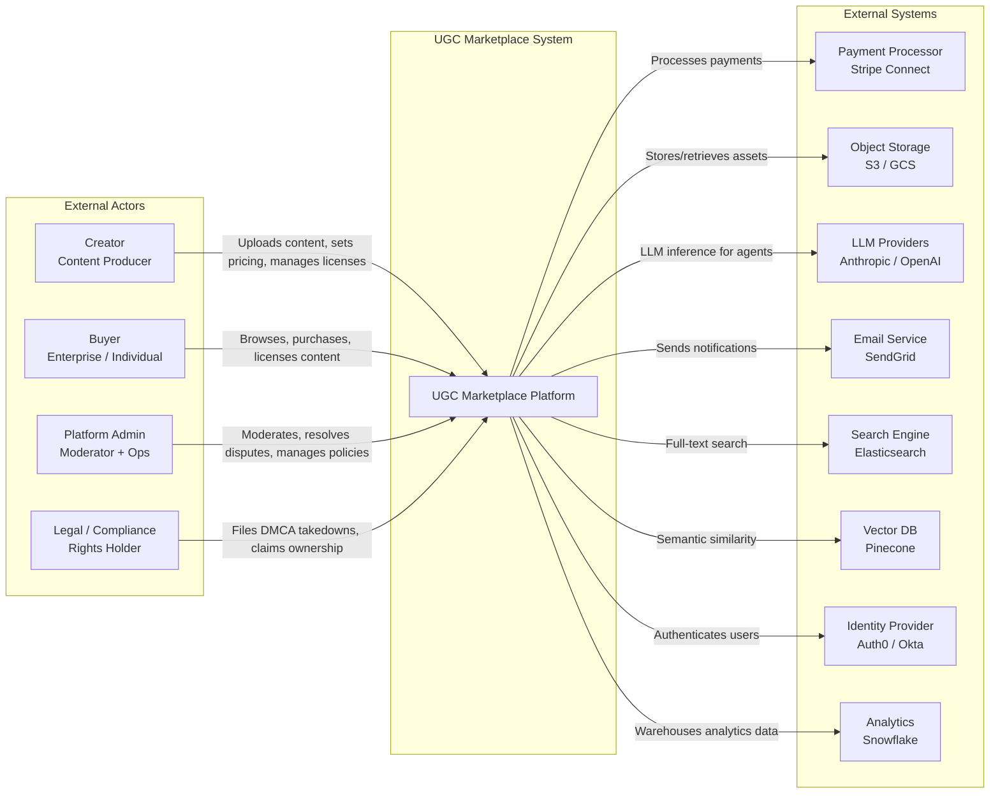

---

## 2. Agent Architecture

### 2.1 Agent Overview

The UGC Marketplace employs five specialized agents orchestrated through the LangChain DeepAgents harness, each with distinct responsibilities, tool access, and governance policies.

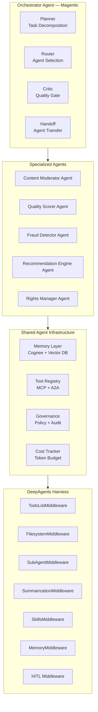

### 2.2 Content Moderator Agent

**Purpose:** Automated content safety, policy compliance, and brand-safety enforcement for all UGC submissions.

**Architecture:**

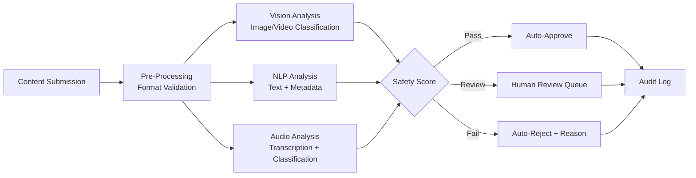

**Responsibilities:**
- Image/video classification (NSFW, violence, hate symbols, copyright watermarks)
- Text analysis (hate speech, spam, misleading claims, PII detection)
- Audio analysis (copyrighted music, explicit content, transcription)
- Metadata validation (title, description, tags for policy violations)
- Duplicate detection (perceptual hashing for image/video)
- Regional compliance (GDPR, local content laws)

**Tools:**
- `vision_classifier` — AWS Rekognition / Google Vision API
- `text_moderator` — Perspective API / OpenAI Moderation
- `audio_analyzer` — Whisper transcription + audio classification
- `duplicate_detector` — pHash / dHash perceptual matching
- `policy_engine` — GRC_Claw policy evaluation

**Governance:**
- All moderation decisions logged with Merkle-chain audit trail
- Confidence threshold: >0.95 auto-approve, 0.70–0.95 human review, <0.70 auto-reject
- Human-in-the-loop for all rejections with appeal workflow
- Bias testing: monthly fairness audits across demographic categories

### 2.3 Quality Scorer Agent

**Purpose:** Aesthetic and engagement quality scoring to surface high-quality content and guide creator improvement.

**Architecture:**

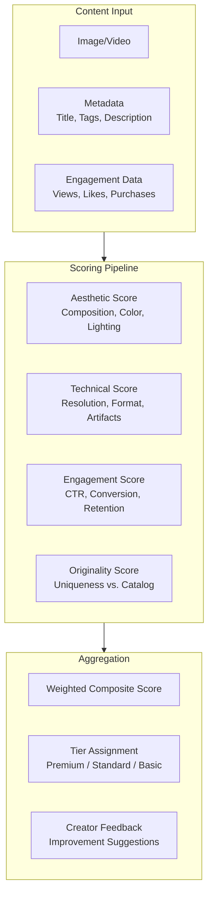

**Scoring Dimensions:**

| Dimension | Weight | Model | Description |
|-----------|--------|-------|-------------|
| Aesthetic Quality | 30% | CLIP + Custom CNN | Composition, color harmony, visual appeal |
| Technical Quality | 20% | Rule-based + ML | Resolution, format compliance, artifacts |
| Engagement Potential | 25% | Gradient Boosting | Historical CTR, conversion, retention |
| Originality | 15% | Vector Similarity | Uniqueness against existing catalog |
| Metadata Quality | 10% | NLP Classifier | Title/description/tag completeness and accuracy |

**Output:**
- Composite score (0–100) with per-dimension breakdown
- Tier assignment: Premium (85+), Standard (70–84), Basic (<70)
- Actionable creator feedback for improvement
- Quality trend tracking over time

### 2.4 Fraud Detector Agent

**Purpose:** Real-time fraud detection for transactions, fake engagement, content theft, and account abuse.

**Architecture:**

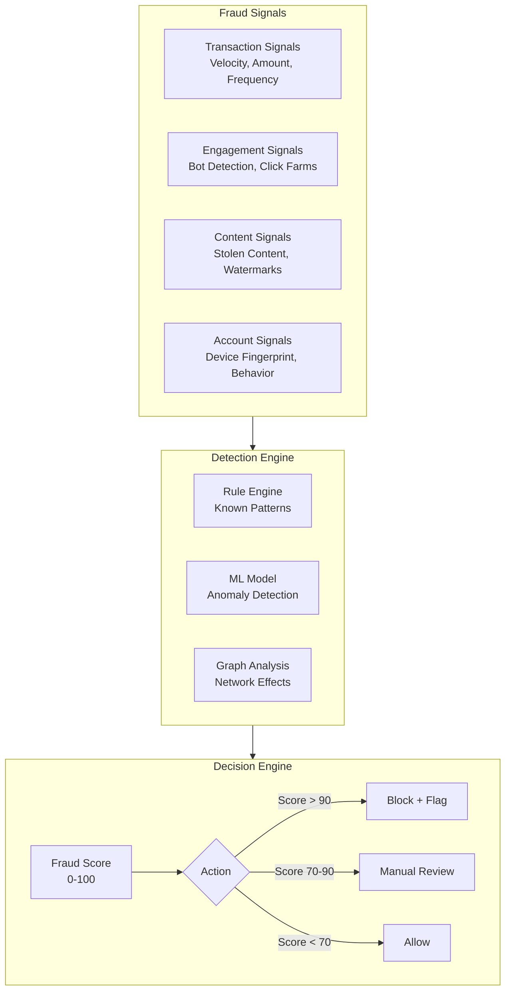

**Fraud Categories:**

| Category | Detection Method | Response |
|----------|-----------------|----------|
| Payment Fraud | Stripe Radar + custom rules | Block transaction, flag account |
| Content Theft | Perceptual hash + reverse image search | Takedown, notify rights holder |
| Fake Engagement | Bot detection (behavioral + ML) | Remove engagement, warn creator |
| Account Takeover | Device fingerprint + behavior anomaly | Step-up auth, freeze account |
| Money Laundering | Transaction graph analysis | SAR filing, account suspension |
| Review Bombing | Sentiment + pattern analysis | Remove reviews, flag for review |

**ML Models:**
- **Anomaly Detection:** Isolation Forest for transaction anomalies
- **Bot Detection:** LSTM-based behavioral sequence model
- **Graph Neural Network:** Network analysis for fraud ring detection
- **Content Theft:** Perceptual hashing + CLIP similarity

### 2.5 Recommendation Engine Agent

**Purpose:** Personalized content discovery and recommendation for buyers, with real-time behavioral adaptation.

**Architecture:**

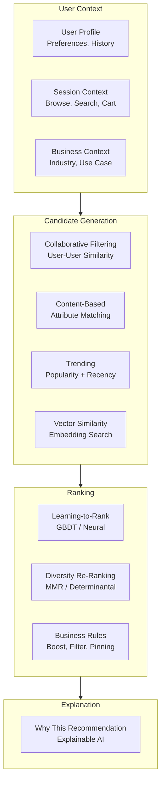

**Recommendation Strategies:**

| Strategy | Algorithm | Use Case |
|----------|-----------|----------|
| Collaborative Filtering | Matrix Factorization (ALS) | "Users like you also bought" |
| Content-Based | TF-IDID + Attribute Matching | "Similar to what you viewed" |
| Semantic Search | Vector Similarity (CLIP) | "Visually similar content" |
| Trending | Time-Decayed Popularity | "Trending now" |
| Personalized | Learning-to-Rank (LightGBM) | "Recommended for you" |
| Contextual | Multi-Armed Bandit | Real-time exploration/exploitation |

**Cold Start Handling:**
- New users: Onboarding quiz → preference inference → trending fallback
- New content: Content-based similarity → creator reputation → exploration budget
- New creators: Quality score boost → curated placement → performance-based promotion

### 2.6 Rights Manager Agent

**Purpose:** Automated license generation, rights verification, royalty distribution, and IP dispute resolution.

**Architecture:**

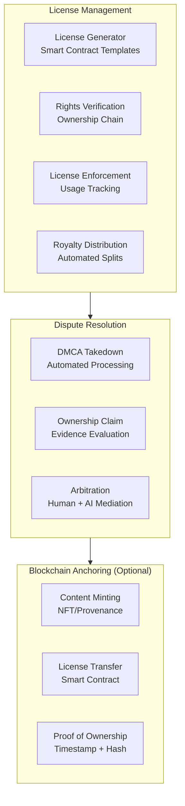

**License Types:**

| License | Description | Price Multiplier | Usage Rights |
|---------|-------------|-----------------|--------------|
| Personal | Single user, personal projects | 1x | No commercial use, no redistribution |
| Commercial | Business use, up to 10 users | 5x | Commercial use, no redistribution |
| Extended | Unlimited users, resale rights | 25x | Full commercial, redistribution allowed |
| Exclusive | Full transfer of rights | 100x+ | Exclusive use, all rights transferred |
| Editorial | News, commentary, education | 2x | Editorial use only, no advertising |

**Royalty Distribution:**
- Creator: 85% (default, configurable)
- Platform: 15% (default, configurable)
- Referrer: 5% (if applicable, from platform share)
- Contributor: Variable (for collaborative content)

### 2.7 Agent Orchestration Patterns

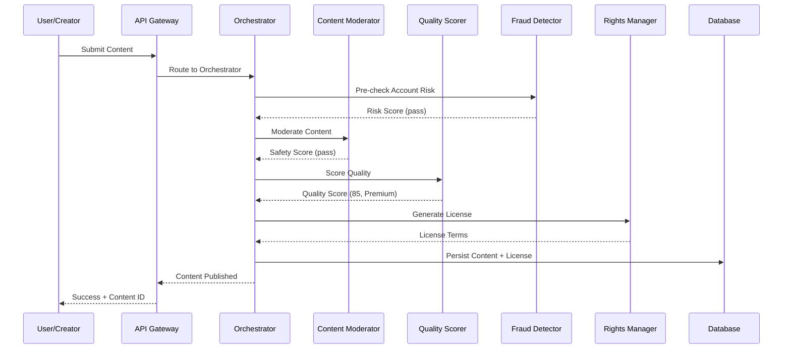

---

## 3. API Design

### 3.1 API Architecture

```mermaid
graph TB
    subgraph CLIENTS["Clients"]
        WEB[Web App]
        MOB[Mobile App]
        PARTNER[Partner API]
    end

    subgraph GATEWAY["API Gateway — Kong"]
        AUTH[Auth Plugin<br/>JWT + OAuth2]
        RATE[Rate Limit Plugin<br/>Redis-backed]
        TRANSFORM[Transform Plugin<br/>Request/Response]
        LOG[Logging Plugin<br/>Audit Trail]
    end

    subgraph SERVICES["Microservices"]
        CONTENT_SVC[Content Service<br/>CRUD + Discovery]
        CREATOR_SVC[Creator Service<br/>Profile + Portfolio]
        LISTING_SVC[Listing Service<br/>Pricing + Inventory]
        TXN_SVC[Transaction Service<br/>Purchase + License]
        LICENSE_SVC[License Service<br/>Terms + Enforcement]
        MODERATION_SVC[Moderation Service<br/>Review + Appeals]
        SEARCH_SVC[Search Service<br/>Full-text + Vector]
        REC_SVC[Recommendation Service<br/>Personalization]
        ANALYTICS_SVC[Analytics Service<br/>Metrics + Reports]
        NOTIF_SVC[Notification Service<br/>Email + Push + WS]
    end

    subgraph AGENTS["Agent Layer"]
        CM[Content Moderator]
        QS[Quality Scorer]
        FD[Fraud Detector]
        RE[Recommendation Engine]
        RM[Rights Manager]
    end

    CLIENTS --> GATEWAY
    GATEWAY --> SERVICES
    SERVICES --> AGENTS
```

### 3.2 REST API Endpoints

#### Content Management (8 endpoints)

| Method | Endpoint | Description | Auth | Rate Limit |
|--------|----------|-------------|------|------------|
| `POST` | `/api/v1/content` | Upload new content (multipart) | Creator | 10/min |
| `GET` | `/api/v1/content/{content_id}` | Get content by ID | Public | 100/min |
| `PUT` | `/api/v1/content/{content_id}` | Update content metadata | Owner | 30/min |
| `DELETE` | `/api/v1/content/{content_id}` | Delete content (soft) | Owner | 10/min |
| `GET` | `/api/v1/content/{content_id}/download` | Download content asset | Licensed | 50/min |
| `POST` | `/api/v1/content/{content_id}/version` | Create new version | Owner | 10/min |
| `GET` | `/api/v1/content/{content_id}/versions` | List content versions | Owner | 30/min |
| `POST` | `/api/v1/content/{content_id}/report` | Report content violation | Authenticated | 5/min |

#### Creator Management (6 endpoints)

| Method | Endpoint | Description | Auth | Rate Limit |
|--------|----------|-------------|------|------------|
| `POST` | `/api/v1/creators` | Register as creator | Authenticated | 5/day |
| `GET` | `/api/v1/creators/{creator_id}` | Get creator profile | Public | 100/min |
| `PUT` | `/api/v1/creators/{creator_id}` | Update creator profile | Owner | 30/min |
| `GET` | `/api/v1/creators/{creator_id}/portfolio` | Get creator portfolio | Public | 100/min |
| `GET` | `/api/v1/creators/{creator_id}/earnings` | Get earnings dashboard | Owner | 30/min |
| `POST` | `/api/v1/creators/{creator_id}/payout` | Request payout | Owner | 5/day |

#### Listing & Pricing (6 endpoints)

| Method | Endpoint | Description | Auth | Rate Limit |
|--------|----------|-------------|------|------------|
| `POST` | `/api/v1/listings` | Create listing (content + price + license) | Creator | 20/min |
| `GET` | `/api/v1/listings/{listing_id}` | Get listing details | Public | 100/min |
| `PUT` | `/api/v1/listings/{listing_id}` | Update listing (price, license, status) | Owner | 30/min |
| `DELETE` | `/api/v1/listings/{listing_id}` | Delist content | Owner | 10/min |
| `GET` | `/api/v1/listings` | Search/filter listings | Public | 100/min |
| `POST` | `/api/v1/listings/{listing_id}/bulk-price` | Bulk pricing tiers | Owner | 10/min |

#### Transaction & Licensing (8 endpoints)

| Method | Endpoint | Description | Auth | Rate Limit |
|--------|----------|-------------|------|------------|
| `POST` | `/api/v1/transactions` | Purchase content (create transaction) | Buyer | 10/min |
| `GET` | `/api/v1/transactions/{transaction_id}` | Get transaction status | Party | 50/min |
| `POST` | `/api/v1/transactions/{transaction_id}/confirm` | Confirm payment (webhook) | System | 100/min |
| `POST` | `/api/v1/transactions/{transaction_id}/refund` | Request refund | Party | 5/day |
| `GET` | `/api/v1/licenses/{license_id}` | Get license details | Licensed | 50/min |
| `POST` | `/api/v1/licenses/{license_id}/verify` | Verify license validity | Public | 100/min |
| `POST` | `/api/v1/licenses/{license_id}/transfer` | Transfer license | Owner | 5/day |
| `GET` | `/api/v1/licenses/{license_id}/usage` | Get usage tracking | Owner | 30/min |

#### Moderation & Governance (6 endpoints)

| Method | Endpoint | Description | Auth | Rate Limit |
|--------|----------|-------------|------|------------|
| `GET` | `/api/v1/moderation/queue` | Get moderation queue | Moderator | 50/min |
| `POST` | `/api/v1/moderation/{content_id}/decision` | Submit moderation decision | Moderator | 30/min |
| `POST` | `/api/v1/moderation/{content_id}/appeal` | Appeal moderation decision | Owner | 3/day |
| `GET` | `/api/v1/moderation/{content_id}/history` | Get moderation history | Moderator | 30/min |
| `GET` | `/api/v1/moderation/policies` | Get active policies | Moderator | 10/min |
| `PUT` | `/api/v1/moderation/policies/{policy_id}` | Update policy | Admin | 10/min |

#### Search & Discovery (4 endpoints)

| Method | Endpoint | Description | Auth | Rate Limit |
|--------|----------|-------------|------|------------|
| `GET` | `/api/v1/search` | Full-text search (Elasticsearch) | Public | 100/min |
| `POST` | `/api/v1/search/semantic` | Semantic/vector search | Public | 50/min |
| `POST` | `/api/v1/search/visual` | Reverse image search | Public | 20/min |
| `GET` | `/api/v1/search/suggestions` | Search autocomplete | Public | 100/min |

#### Recommendation (4 endpoints)

| Method | Endpoint | Description | Auth | Rate Limit |
|--------|----------|-------------|------|------------|
| `GET` | `/api/v1/recommendations/personalized` | Personalized recommendations | Authenticated | 50/min |
| `GET` | `/api/v1/recommendations/trending` | Trending content | Public | 100/min |
| `GET` | `/api/v1/recommendations/similar/{content_id}` | Similar content | Public | 50/min |
| `GET` | `/api/v1/recommendations/creator/{creator_id}` | More from creator | Public | 50/min |

#### Analytics & Reporting (4 endpoints)

| Method | Endpoint | Description | Auth | Rate Limit |
|--------|----------|-------------|------|------------|
| `GET` | `/api/v1/analytics/creator/{creator_id}/overview` | Creator analytics dashboard | Owner | 30/min |
| `GET` | `/api/v1/analytics/creator/{creator_id}/content` | Per-content performance | Owner | 30/min |
| `GET` | `/api/v1/analytics/platform/overview` | Platform-wide metrics | Admin | 10/min |
| `GET` | `/api/v1/analytics/fraud/report` | Fraud detection report | Admin | 10/min |

#### Notification (3 endpoints)

| Method | Endpoint | Description | Auth | Rate Limit |
|--------|----------|-------------|------|------------|
| `GET` | `/api/v1/notifications` | Get user notifications | Authenticated | 50/min |
| `PUT` | `/api/v1/notifications/{notification_id}/read` | Mark as read | Owner | 30/min |
| `POST` | `/api/v1/notifications/preferences` | Update notification prefs | Authenticated | 10/min |

**Total: 49 endpoints**

### 3.3 WebSocket Events

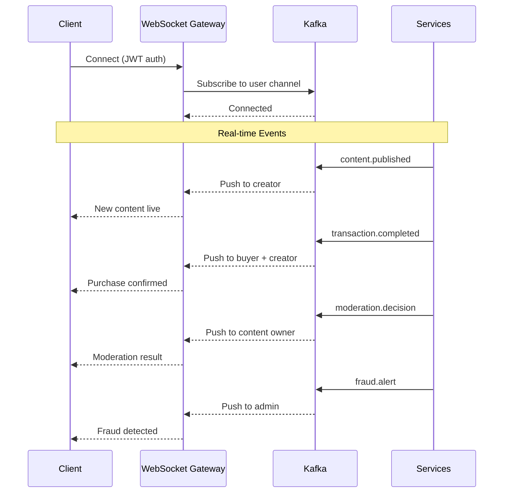

**WebSocket Event Types:**

| Event | Channel | Description |
|-------|---------|-------------|
| `content.published` | `user:{creator_id}` | Content successfully published |
| `content.moderated` | `user:{creator_id}` | Moderation decision made |
| `transaction.completed` | `user:{buyer_id}`, `user:{creator_id}` | Purchase completed |
| `transaction.refunded` | `user:{buyer_id}`, `user:{creator_id}` | Refund processed |
| `fraud.alert` | `admin:fraud` | Fraud detection alert |
| `license.expiring` | `user:{licensee_id}` | License expiration warning |
| `payout.processed` | `user:{creator_id}` | Payout completed |
| `recommendation.ready` | `user:{user_id}` | New recommendations available |

### 3.4 Webhook Endpoints (Inbound)

| Endpoint | Description | Source |
|----------|-------------|--------|
| `POST /webhooks/stripe` | Stripe payment events | Stripe |
| `POST /webhooks/dmca` | DMCA takedown notices | Legal providers |
| `POST /webhooks/identity` | Identity verification | Auth0 / Okta |
| `POST /webhooks/storage` | Asset processing complete | S3 / Lambda |

---

## 4. Data Models

### 4.1 Entity Relationship Diagram

```mermaid
erDiagram
    CREATOR ||--o{ CONTENT : creates
    CREATOR ||--o{ LISTING : publishes
    CREATOR ||--o{ TRANSACTION : receives
    CREATOR ||--o{ PAYOUT : receives
    CREATOR ||--o{ CREATOR_PAYOUT_ACCOUNT : has

    CONTENT ||--o{ LISTING : listed_as
    CONTENT ||--o{ CONTENT_VERSION : has
    CONTENT ||--o{ CONTENT_ASSET : contains
    CONTENT ||--o{ MODERATION_ACTION : moderated_by
    CONTENT ||--o{ CONTENT_TAG : tagged_with
    CONTENT ||--o{ CONTENT_CATEGORY : categorized_as
    CONTENT ||--o{ CONTENT_ENGAGEMENT : tracks

    LISTING ||--o{ TRANSACTION : purchased_via
    LISTING ||--o{ LISTING_PRICING_TIER : offers
    LISTING ||--o{ LISTING_INVENTORY : tracks

    TRANSACTION ||--o{ LICENSE : generates
    TRANSACTION ||--o{ TRANSACTION_ITEM : contains
    TRANSACTION ||--o{ TRANSACTION_REFUND : refunded_by
    TRANSACTION ||--o{ FRAUD_CHECK : screened_by

    LICENSE ||--o{ LICENSE_USAGE : tracks
    LICENSE ||--o{ LICENSE_TRANSFER : transferred_via

    MODERATION_ACTION ||--o{ MODERATION_APPEAL : appealed_via
    MODERATION_ACTION ||--o{ MODERATION_EVIDENCE : supported_by

    CREATOR {
        uuid id PK
        string user_id FK
        string display_name
        string bio
        string avatar_url
        string website_url
        string stripe_connect_id
        jsonb social_links
        jsonb verification_status
        decimal lifetime_earnings
        decimal available_balance
        decimal pending_balance
        string tier
        timestamp created_at
        timestamp updated_at
    }

    CONTENT {
        uuid id PK
        uuid creator_id FK
        string title
        string text description
        string content_type
        string status
        string visibility
        jsonb metadata
        jsonb ai_analysis
        decimal quality_score
        string quality_tier
        jsonb moderation_result
        string license_default
        timestamp published_at
        timestamp created_at
        timestamp updated_at
    }

    LISTING {
        uuid id PK
        uuid content_id FK
        uuid creator_id FK
        string status
        decimal base_price
        string currency
        jsonb license_terms
        jsonb pricing_tiers
        integer inventory_limit
        integer inventory_sold
        boolean exclusive_available
        timestamp created_at
        timestamp updated_at
    }

    TRANSACTION {
        uuid id PK
        uuid buyer_id FK
        uuid creator_id FK
        uuid listing_id FK
        decimal subtotal
        decimal platform_fee
        decimal creator_payout
        decimal tax_amount
        decimal total_amount
        string currency
        string status
        string payment_provider
        string payment_provider_txn_id
        jsonb fraud_score
        jsonb metadata
        timestamp created_at
        timestamp updated_at
    }

    LICENSE {
        uuid id PK
        uuid transaction_id FK
        uuid content_id FK
        uuid licensee_id FK
        string license_type
        jsonb terms
        string status
        timestamp valid_from
        timestamp valid_until
        jsonb usage_restrictions
        jsonb transfer_history
        timestamp created_at
        timestamp updated_at
    }

    MODERATION_ACTION {
        uuid id PK
        uuid content_id FK
        uuid moderator_id FK
        string action_type
        string reason_code
        text reason_description
        jsonb evidence
        string status
        decimal confidence_score
        string agent_version
        timestamp created_at
        timestamp updated_at
    }
```

### 4.2 Core Model Schemas

#### Creator

```python
class Creator(BaseModel):
    """Creator profile and account information."""
    id: uuid.UUID
    user_id: uuid.UUID  # FK to auth service
    display_name: str = Field(..., min_length=1, max_length=100)
    bio: str = Field(default="", max_length=2000)
    avatar_url: str | None = None
    website_url: str | None = None
    social_links: dict[str, str] = Field(default_factory=dict)
    verification_status: Literal["unverified", "pending", "verified", "rejected"] = "unverified"
    stripe_connect_id: str | None = None
    lifetime_earnings: Decimal = Decimal("0.00")
    available_balance: Decimal = Decimal("0.00")
    pending_balance: Decimal = Decimal("0.00")
    tier: Literal["new", "established", "premium", "enterprise"] = "new"
    payout_schedule: Literal["daily", "weekly", "monthly"] = "weekly"
    created_at: datetime
    updated_at: datetime
```

#### Content

```python
class Content(BaseModel):
    """UGC content entity with AI analysis and moderation results."""
    id: uuid.UUID
    creator_id: uuid.UUID
    title: str = Field(..., min_length=1, max_length=200)
    description: str = Field(default="", max_length=5000)
    content_type: Literal["image", "video", "audio", "3d_model", "template", "document"]
    status: Literal["draft", "pending_moderation", "published", "rejected", "removed", "archived"]
    visibility: Literal["public", "unlisted", "private"] = "public"
    metadata: dict[str, Any] = Field(default_factory=dict)  # EXIF, dimensions, format, etc.
    ai_analysis: dict[str, Any] = Field(default_factory=dict)  # CLIP embeddings, quality scores
    quality_score: float = Field(default=0.0, ge=0.0, le=100.0)
    quality_tier: Literal["basic", "standard", "premium"] = "basic"
    moderation_result: dict[str, Any] = Field(default_factory=dict)
    license_default: str = "commercial"
    tags: list[str] = Field(default_factory=list)
    categories: list[str] = Field(default_factory=list)
    published_at: datetime | None = None
    created_at: datetime
    updated_at: datetime
```

#### Listing

```python
class Listing(BaseModel):
    """Content listing with pricing and license configuration."""
    id: uuid.UUID
    content_id: uuid.UUID
    creator_id: uuid.UUID
    status: Literal["draft", "active", "paused", "sold_out", "delisted"] = "draft"
    base_price: Decimal = Field(..., gt=0)
    currency: str = Field(default="USD", pattern="^[A-Z]{3}$")
    license_terms: dict[str, Any] = Field(default_factory=dict)
    pricing_tiers: list[PricingTier] = Field(default_factory=list)
    inventory_limit: int | None = None  # None = unlimited
    inventory_sold: int = 0
    exclusive_available: bool = False
    created_at: datetime
    updated_at: datetime

class PricingTier(BaseModel):
    """Volume pricing tier for bulk purchases."""
    min_quantity: int
    max_quantity: int | None = None
    unit_price: Decimal
    discount_percent: float = Field(default=0.0, ge=0.0, le=100.0)
```

#### Transaction

```python
class Transaction(BaseModel):
    """Purchase transaction with fraud screening and payout tracking."""
    id: uuid.UUID
    buyer_id: uuid.UUID
    creator_id: uuid.UUID
    listing_id: uuid.UUID
    items: list[TransactionItem] = Field(default_factory=list)
    subtotal: Decimal
    platform_fee: Decimal
    creator_payout: Decimal
    tax_amount: Decimal
    total_amount: Decimal
    currency: str = "USD"
    status: Literal["pending", "processing", "completed", "failed", "refunded", "disputed", "chargeback"]
    payment_provider: Literal["stripe", "paypal", "crypto"] = "stripe"
    payment_provider_txn_id: str | None = None
    fraud_score: float = Field(default=0.0, ge=0.0, le=100.0)
    fraud_status: Literal["clear", "review", "block"] = "clear"
    metadata: dict[str, Any] = Field(default_factory=dict)
    created_at: datetime
    updated_at: datetime

class TransactionItem(BaseModel):
    """Individual item within a transaction."""
    listing_id: uuid.UUID
    content_id: uuid.UUID
    license_type: str
    quantity: int = 1
    unit_price: Decimal
    total_price: Decimal
```

#### License

```python
class License(BaseModel):
    """Content license with usage tracking and transfer history."""
    id: uuid.UUID
    transaction_id: uuid.UUID
    content_id: uuid.UUID
    licensee_id: uuid.UUID
    license_type: Literal["personal", "commercial", "extended", "exclusive", "editorial"]
    terms: dict[str, Any] = Field(default_factory=dict)
    status: Literal["active", "expired", "revoked", "transferred", "suspended"]
    valid_from: datetime
    valid_until: datetime | None = None  # None = perpetual
    usage_restrictions: dict[str, Any] = Field(default_factory=dict)
    transfer_history: list[LicenseTransfer] = Field(default_factory=list)
    created_at: datetime
    updated_at: datetime

class LicenseUsage(BaseModel):
    """Usage tracking for licensed content."""
    id: uuid.UUID
    license_id: uuid.UUID
    usage_type: Literal["download", "view", "embed", "print", "modify", "resell"]
    usage_context: dict[str, Any] = Field(default_factory=dict)
    timestamp: datetime
```

#### ModerationAction

```python
class ModerationAction(BaseModel):
    """Moderation decision with evidence and appeal tracking."""
    id: uuid.UUID
    content_id: uuid.UUID
    moderator_id: uuid.UUID | None = None  # None = automated
    action_type: Literal["approve", "reject", "flag", "escalate", "takedown", "restrict"]
    reason_code: str  # e.g., "nsfw", "copyright", "hate_speech", "spam"
    reason_description: str
    evidence: dict[str, Any] = Field(default_factory=dict)  # Model outputs, matched patterns
    status: Literal["pending", "confirmed", "appealed", "overturned", "upheld"]
    confidence_score: float = Field(default=0.0, ge=0.0, le=1.0)
    agent_version: str  # e.g., "content-moderator-v2.3"
    created_at: datetime
    updated_at: datetime

class ModerationAppeal(BaseModel):
    """Appeal against a moderation decision."""
    id: uuid.UUID
    moderation_action_id: uuid.UUID
    appellant_id: uuid.UUID
    reason: str
    evidence: dict[str, Any] = Field(default_factory=dict)
    status: Literal["pending", "reviewing", "upheld", "overturned"]
    reviewer_id: uuid.UUID | None = None
    resolution_notes: str | None = None
    created_at: datetime
    resolved_at: datetime | None = None
```

### 4.3 Database Schema (PostgreSQL)

```sql
-- Core tables with partitioning and indexing strategy

CREATE TABLE creators (
    id UUID PRIMARY KEY DEFAULT gen_random_uuid(),
    user_id UUID NOT NULL UNIQUE,
    display_name VARCHAR(100) NOT NULL,
    bio TEXT DEFAULT '',
    avatar_url TEXT,
    website_url TEXT,
    social_links JSONB DEFAULT '{}',
    verification_status VARCHAR(20) DEFAULT 'unverified',
    stripe_connect_id VARCHAR(255),
    lifetime_earnings DECIMAL(12,2) DEFAULT 0.00,
    available_balance DECIMAL(12,2) DEFAULT 0.00,
    pending_balance DECIMAL(12,2) DEFAULT 0.00,
    tier VARCHAR(20) DEFAULT 'new',
    payout_schedule VARCHAR(20) DEFAULT 'weekly',
    created_at TIMESTAMPTZ DEFAULT NOW(),
    updated_at TIMESTAMPTZ DEFAULT NOW()
);

CREATE TABLE content (
    id UUID PRIMARY KEY DEFAULT gen_random_uuid(),
    creator_id UUID NOT NULL REFERENCES creators(id),
    title VARCHAR(200) NOT NULL,
    description TEXT DEFAULT '',
    content_type VARCHAR(20) NOT NULL,
    status VARCHAR(30) DEFAULT 'draft',
    visibility VARCHAR(20) DEFAULT 'public',
    metadata JSONB DEFAULT '{}',
    ai_analysis JSONB DEFAULT '{}',
    quality_score DECIMAL(5,2) DEFAULT 0.00,
    quality_tier VARCHAR(20) DEFAULT 'basic',
    moderation_result JSONB DEFAULT '{}',
    license_default VARCHAR(50) DEFAULT 'commercial',
    tags TEXT[] DEFAULT '{}',
    categories TEXT[] DEFAULT '{}',
    published_at TIMESTAMPTZ,
    created_at TIMESTAMPTZ DEFAULT NOW(),
    updated_at TIMESTAMPTZ DEFAULT NOW()
) PARTITION BY RANGE (created_at);

-- Monthly partitions for content table
CREATE TABLE content_2026_10 PARTITION OF content
    FOR VALUES FROM ('2026-10-01') TO ('2026-11-01');

CREATE TABLE listings (
    id UUID PRIMARY KEY DEFAULT gen_random_uuid(),
    content_id UUID NOT NULL REFERENCES content(id),
    creator_id UUID NOT NULL REFERENCES creators(id),
    status VARCHAR(20) DEFAULT 'draft',
    base_price DECIMAL(10,2) NOT NULL,
    currency VARCHAR(3) DEFAULT 'USD',
    license_terms JSONB DEFAULT '{}',
    pricing_tiers JSONB DEFAULT '[]',
    inventory_limit INTEGER,
    inventory_sold INTEGER DEFAULT 0,
    exclusive_available BOOLEAN DEFAULT FALSE,
    created_at TIMESTAMPTZ DEFAULT NOW(),
    updated_at TIMESTAMPTZ DEFAULT NOW()
);

CREATE TABLE transactions (
    id UUID PRIMARY KEY DEFAULT gen_random_uuid(),
    buyer_id UUID NOT NULL,
    creator_id UUID NOT NULL REFERENCES creators(id),
    listing_id UUID NOT NULL REFERENCES listings(id),
    items JSONB DEFAULT '[]',
    subtotal DECIMAL(12,2) NOT NULL,
    platform_fee DECIMAL(12,2) NOT NULL,
    creator_payout DECIMAL(12,2) NOT NULL,
    tax_amount DECIMAL(12,2) DEFAULT 0.00,
    total_amount DECIMAL(12,2) NOT NULL,
    currency VARCHAR(3) DEFAULT 'USD',
    status VARCHAR(20) DEFAULT 'pending',
    payment_provider VARCHAR(20) DEFAULT 'stripe',
    payment_provider_txn_id VARCHAR(255),
    fraud_score DECIMAL(5,2) DEFAULT 0.00,
    fraud_status VARCHAR(20) DEFAULT 'clear',
    metadata JSONB DEFAULT '{}',
    created_at TIMESTAMPTZ DEFAULT NOW(),
    updated_at TIMESTAMPTZ DEFAULT NOW()
) PARTITION BY RANGE (created_at);

CREATE TABLE licenses (
    id UUID PRIMARY KEY DEFAULT gen_random_uuid(),
    transaction_id UUID NOT NULL REFERENCES transactions(id),
    content_id UUID NOT NULL REFERENCES content(id),
    licensee_id UUID NOT NULL,
    license_type VARCHAR(20) NOT NULL,
    terms JSONB DEFAULT '{}',
    status VARCHAR(20) DEFAULT 'active',
    valid_from TIMESTAMPTZ DEFAULT NOW(),
    valid_until TIMESTAMPTZ,
    usage_restrictions JSONB DEFAULT '{}',
    transfer_history JSONB DEFAULT '[]',
    created_at TIMESTAMPTZ DEFAULT NOW(),
    updated_at TIMESTAMPTZ DEFAULT NOW()
);

CREATE TABLE moderation_actions (
    id UUID PRIMARY KEY DEFAULT gen_random_uuid(),
    content_id UUID NOT NULL REFERENCES content(id),
    moderator_id UUID,
    action_type VARCHAR(20) NOT NULL,
    reason_code VARCHAR(50) NOT NULL,
    reason_description TEXT,
    evidence JSONB DEFAULT '{}',
    status VARCHAR(20) DEFAULT 'pending',
    confidence_score DECIMAL(5,2) DEFAULT 0.00,
    agent_version VARCHAR(50),
    created_at TIMESTAMPTZ DEFAULT NOW(),
    updated_at TIMESTAMPTZ DEFAULT NOW()
);

-- Indexes for common query patterns
CREATE INDEX idx_content_creator ON content(creator_id);
CREATE INDEX idx_content_status ON content(status) WHERE status = 'published';
CREATE INDEX idx_content_type ON content(content_type);
CREATE INDEX idx_content_quality ON content(quality_score DESC);
CREATE INDEX idx_content_tags ON content USING GIN(tags);
CREATE INDEX idx_content_search ON content USING GIN(to_tsvector('english', title || ' ' || COALESCE(description, '')));
CREATE INDEX idx_listings_status ON listings(status) WHERE status = 'active';
CREATE INDEX idx_listings_creator ON listings(creator_id);
CREATE INDEX idx_transactions_buyer ON transactions(buyer_id);
CREATE INDEX idx_transactions_creator ON transactions(creator_id);
CREATE INDEX idx_transactions_status ON transactions(status);
CREATE INDEX idx_licenses_licensee ON licenses(licensee_id);
CREATE INDEX idx_licenses_status ON licenses(status);
CREATE INDEX idx_moderation_content ON moderation_actions(content_id);
CREATE INDEX idx_moderation_status ON moderation_actions(status);
```

### 4.4 Event Schema (Kafka)

```mermaid
graph LR
    subgraph PRODUCERS["Producers"]
        CONTENT_SVC[Content Service]
        TXN_SVC[Transaction Service]
        MOD_SVC[Moderation Service]
        AGENT_SVC[Agent Service]
    end

    subgraph TOPICS["Kafka Topics"]
        CONTENT_EVT[content.events]
        TXN_EVT[transaction.events]
        MOD_EVT[moderation.events]
        AGENT_EVT[agent.events]
        NOTIF_EVT[notification.events]
        ANALYTICS_EVT[analytics.events]
    end

    subgraph CONSUMERS["Consumers"]
        SEARCH_IDX[Search Indexer]
        REC_ENGINE[Recommendation Engine]
        NOTIF_SVC[Notification Service]
        ANALYTICS_PIPE[Analytics Pipeline]
        AUDIT_LOG[Audit Logger]
    end

    PRODUCERS --> TOPICS
    TOPICS --> CONSUMERS
```

**Event Types:**

| Topic | Event | Schema |
|-------|-------|--------|
| `content.events` | `content.created` | `{content_id, creator_id, content_type, timestamp}` |
| `content.events` | `content.published` | `{content_id, creator_id, quality_score, quality_tier, timestamp}` |
| `content.events` | `content.moderated` | `{content_id, action, reason_code, confidence, timestamp}` |
| `content.events` | `content.updated` | `{content_id, changes, timestamp}` |
| `content.events` | `content.deleted` | `{content_id, creator_id, reason, timestamp}` |
| `transaction.events` | `transaction.created` | `{transaction_id, buyer_id, creator_id, amount, timestamp}` |
| `transaction.events` | `transaction.completed` | `{transaction_id, amount, creator_payout, timestamp}` |
| `transaction.events` | `transaction.refunded` | `{transaction_id, amount, reason, timestamp}` |
| `transaction.events` | `transaction.disputed` | `{transaction_id, reason, timestamp}` |
| `moderation.events` | `moderation.decision` | `{content_id, action, moderator_id, timestamp}` |
| `moderation.events` | `moderation.appealed` | `{content_id, appeal_id, appellant_id, timestamp}` |
| `agent.events` | `agent.action` | `{agent_id, action_type, target_id, result, timestamp}` |
| `agent.events` | `agent.error` | `{agent_id, error_type, context, timestamp}` |
| `notification.events` | `notification.send` | `{user_id, channel, template, data, timestamp}` |
| `analytics.events` | `analytics.track` | `{event_type, user_id, properties, timestamp}` |

---

## 5. Integration Patterns with GRC_Claw

### 5.1 Integration Architecture

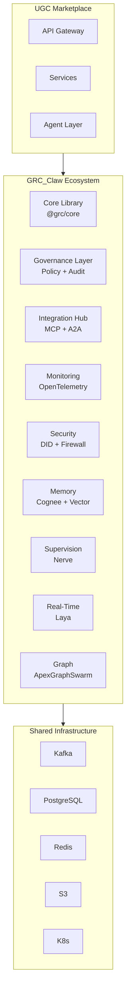

### 5.2 Governance Integration

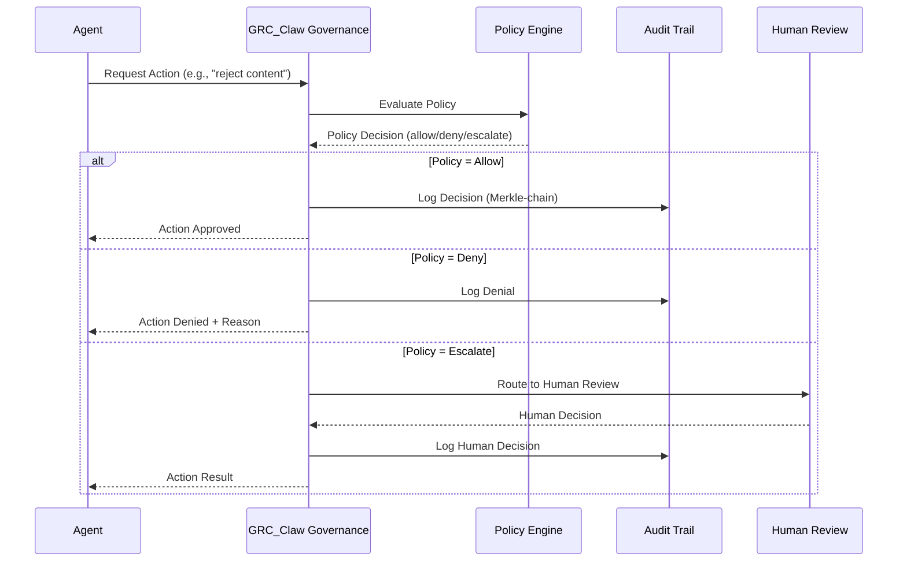

**Governance Policies:**

| Policy ID | Name | Scope | Action |
|-----------|------|-------|--------|
| `UGC-POL-001` | Content Safety Threshold | Content Moderation | Auto-reject if confidence > 0.95 |
| `UGC-POL-002` | Human Review Threshold | Content Moderation | Escalate if 0.70 < confidence < 0.95 |
| `UGC-POL-003` | Fraud Block Threshold | Fraud Detection | Block if fraud score > 90 |
| `UGC-POL-004` | Fraud Review Threshold | Fraud Detection | Review if 70 < fraud score < 90 |
| `UGC-POL-005` | Payout Minimum | Transactions | Require $50 minimum for payout |
| `UGC-POL-006` | Refund Window | Transactions | Allow refund within 30 days |
| `UGC-POL-007` | License Transfer Limit | Licensing | Max 3 transfers per license |
| `UGC-POL-008` | Creator Verification | Creators | Require ID verification for payout |
| `UGC-POL-009` | Content Quality Floor | Listings | Minimum quality score 50 to list |
| `UGC-POL-010` | Rate Limiting | API | 100 req/min per user |

### 5.3 Agent Framework Integration

```python
# agents/ugc_marketplace/moderator.py
from grc_core.agents import BaseAgent, AgentConfig
from grc_core.governance import PolicyEngine, AuditLogger
from grc_core.memory import MemoryStore
from grc_core.tools import ToolRegistry

class ContentModeratorAgent(BaseAgent):
    """Content moderation agent integrated with GRC_Claw governance."""
    
    def __init__(self, config: AgentConfig):
        super().__init__(config)
        self.policy_engine = PolicyEngine()
        self.audit_logger = AuditLogger()
        self.memory = MemoryStore()
        self.tools = ToolRegistry()
        
        # Register tools
        self.tools.register("vision_classifier", VisionClassifierTool())
        self.tools.register("text_moderator", TextModeratorTool())
        self.tools.register("duplicate_detector", DuplicateDetectorTool())
    
    async def moderate(self, content: Content) -> ModerationResult:
        """Moderate content with governance enforcement."""
        
        # Step 1: Pre-check governance policy
        policy_check = await self.policy_engine.evaluate(
            policy_id="UGC-POL-001",
            context={"content_type": content.content_type, "creator_id": content.creator_id}
        )
        
        if not policy_check.allowed:
            return ModerationResult(
                action="reject",
                reason="Policy violation: " + policy_check.reason,
                confidence=1.0
            )
        
        # Step 2: Run moderation pipeline
        vision_result = await self.tools.call("vision_classifier", content.assets)
        text_result = await self.tools.call("text_moderator", content.title + " " + content.description)
        duplicate_result = await self.tools.call("duplicate_detector", content.assets)
        
        # Step 3: Aggregate scores
        safety_score = self._aggregate_safety(vision_result, text_result)
        
        # Step 4: Apply governance thresholds
        if safety_score < 0.70:
            action = "reject"
        elif safety_score < 0.95:
            action = "escalate"
        else:
            action = "approve"
        
        # Step 5: Audit log
        await self.audit_logger.log(
            agent_id=self.id,
            action="moderate",
            target_id=content.id,
            result={"action": action, "safety_score": safety_score},
            policy_version=policy_check.version
        )
        
        return ModerationResult(
            action=action,
            safety_score=safety_score,
            details={"vision": vision_result, "text": text_result, "duplicate": duplicate_result}
        )
```

### 5.4 Integration Hub Connectors

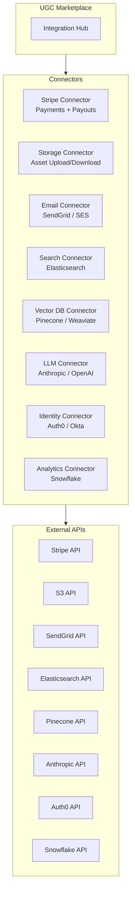

### 5.5 Monitoring & Observability Integration

```mermaid
graph LR
    subgraph COLLECTION["Collection Layer"]
        OTEL[OpenTelemetry<br/>Traces + Metrics]
        PROM[Prometheus<br/>Metrics]
        LOKI[Loki<br/>Logs]
        TEMPO[Tempo<br/>Traces]
    end

    subgraph PROCESSING["Processing Layer"]
        GRAFANA[Grafana<br/>Dashboards]
        ALERT[AlertManager<br/>Alerting]
        ML_ANOMALY[ML Anomaly<br/>Detection]
    end

    subgraph BUSINESS["Business Metrics"]
        GMV[GMV<br/>Gross Merchandise Value]
        TAKE[Take Rate<br/>Platform Revenue]
        LTV[Creator LTV<br/>Lifetime Value]
        CHURN[Churn Rate<br/>Creator Retention]
    end

    COLLECTION --> PROCESSING
    PROCESSING --> BUSINESS
```

**Key Metrics:**

| Category | Metric | Source | Alert Threshold |
|----------|--------|--------|-----------------|
| **Content** | Upload success rate | Content Service | < 95% |
| **Content** | Moderation latency | Agent Layer | > 30s p99 |
| **Content** | Quality score distribution | Quality Scorer | Skew < 0.3 |
| **Transaction** | Payment success rate | Transaction Service | < 98% |
| **Transaction** | Fraud rate | Fraud Detector | > 1% |
| **Transaction** | Refund rate | Transaction Service | > 5% |
| **License** | License verification latency | License Service | > 100ms |
| **License** | License dispute rate | License Service | > 0.5% |
| **Agent** | Agent error rate | Agent Layer | > 5% |
| **Agent** | Agent cost per action | Cost Tracker | > $0.50 |
| **Platform** | API latency p99 | API Gateway | > 500ms |
| **Platform** | WebSocket connections | WS Gateway | > 10K |

### 5.6 Security Integration

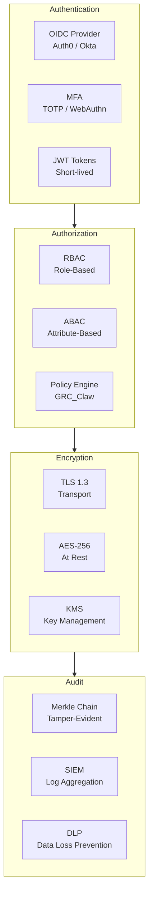

**Security Controls:**

| Control | Implementation | Standard |
|---------|---------------|----------|
| Authentication | OAuth 2.1 + OIDC + MFA | NIST 800-63B |
| Authorization | RBAC + ABAC + Policy Engine | NIST 800-178 |
| Encryption in Transit | TLS 1.3, mTLS for service-to-service | NIST 800-52 |
| Encryption at Rest | AES-256-GCM, envelope encryption | NIST 800-111 |
| Key Management | AWS KMS / HashiCorp Vault | NIST 800-57 |
| Audit Logging | Merkle-chain, tamper-evident | NIST 800-92 |
| DLP | Field-level redaction, PII detection | GDPR Art. 32 |
| Rate Limiting | Redis-backed token bucket | OWASP API Security |
| Input Validation | Pydantic + JSON Schema | OWASP ASVS |
| Secrets Management | Vault, 30-day rotation | NIST 800-57 |

---

## 6. Deployment Architecture

### 6.1 Kubernetes Deployment

```mermaid
graph TB
    subgraph INGRESS["Ingress Layer"]
        NGINX[NGINX Ingress<br/>SSL Termination]
        TRAEFIK[Traefik<br/>WebSocket Router]
    end

    subgraph SERVICES["Service Layer — Kubernetes"]
        API_GW[API Gateway<br/>Kong / 3 replicas]
        CONTENT_SVC[Content Service<br/>3 replicas]
        CREATOR_SVC[Creator Service<br/>2 replicas]
        TXN_SVC[Transaction Service<br/>3 replicas]
        LICENSE_SVC[License Service<br/>2 replicas]
        MODERATION_SVC[Moderation Service<br/>2 replicas]
        SEARCH_SVC[Search Service<br/>2 replicas]
        REC_SVC[Recommendation Service<br/>2 replicas]
        NOTIF_SVC[Notification Service<br/>2 replicas]
    end

    subgraph AGENT_LAYER["Agent Layer — Kubernetes"]
        ORCHESTRATOR[Orchestrator<br/>2 replicas]
        CM_AGENT[Content Moderator<br/>3 replicas]
        QS_AGENT[Quality Scorer<br/>2 replicas]
        FD_AGENT[Fraud Detector<br/>2 replicas]
        RE_AGENT[Recommendation Engine<br/>2 replicas]
        RM_AGENT[Rights Manager<br/>2 replicas]
    end

    subgraph DATA["Data Layer"]
        PG[(PostgreSQL 16<br/>Primary + 2 Replicas)]
        REDIS[(Redis Cluster<br/>6 nodes)]
        KAFKA[Kafka<br/>3 brokers)]
        ES[(Elasticsearch<br/>3 nodes)]
        VEC[(Vector DB<br/>Pinecone)]
        S3[(S3<br/>Asset Storage)]
    end

    INGRESS --> SERVICES
    SERVICES --> AGENT_LAYER
    AGENT_LAYER --> DATA
    SERVICES --> DATA
```

### 6.2 CI/CD Pipeline

```mermaid
graph LR
    subgraph SOURCE["Source Control"]
        GIT[GitHub<br/>Main Branch]
        PR[Pull Request<br/>Code Review]
    end

    subgraph CI["Continuous Integration"]
        LINT[Lint + Format<br/>Ruff + Black]
        TEST[Unit Tests<br/>pytest]
        INT_TEST[Integration Tests<br/>pytest + TestContainers]
        SEC_SCAN[Security Scan<br/>Bandit + Safety]
        BUILD[Build<br/>Docker Image]
    end

    subgraph CD["Continuous Deployment"]
        STAGING[Staging<br/>EKS Staging]
        E2E[E2E Tests<br/>Playwright]
        CANARY[Canary<br/>5% Traffic]
        PROD[Production<br/>EKS Production]
    end

    subgraph MONITOR["Monitoring"]
        OBS[Observability<br/>Prometheus + Grafana]
        ROLLBACK[Auto-Rollback<br/>Error Rate > 5%]
    end

    SOURCE --> CI
    CI --> CD
    CD --> MONITOR
```

### 6.3 Infrastructure as Code

```yaml
# infrastructure/terraform/modules/ugc-marketplace/main.tf

module "eks_cluster" {
  source          = "terraform-aws-modules/eks/aws"
  cluster_name    = "ugc-marketplace-${var.environment}"
  cluster_version = "1.29"
  
  vpc_id     = module.vpc.vpc_id
  subnet_ids = module.vpc.private_subnets
  
  eks_managed_node_groups = {
    general = {
      desired_size = 3
      min_size     = 2
      max_size     = 10
      instance_types = ["m6i.xlarge"]
    }
    agents = {
      desired_size = 2
      min_size     = 1
      max_size     = 20
      instance_types = ["g6i.xlarge"]  # GPU nodes for LLM inference
    }
  }
}

module "rds_postgresql" {
  source          = "terraform-aws-modules/rds/aws"
  engine          = "postgres"
  engine_version  = "16.3"
  instance_class  = "db.r6g.xlarge"
  
  multi_az               = true
  backup_retention_period = 30
  
  database_name = "ugc_marketplace"
  username      = "ugc_admin"
}

module "msk_kafka" {
  source          = "terraform-aws-modules/msk/aws"
  cluster_name    = "ugc-marketplace-events"
  kafka_version   = "3.6.0"
  number_of_broker_nodes = 3
}
```

---

## 7. Security & Compliance

### 7.1 Threat Model

```mermaid
graph TB
    subgraph THREATS["Threat Categories"]
        INJECTION[Injection Attacks<br/>SQL, NoSQL, Command]
        AUTH_BREACH[Authentication Bypass<br/>Token Theft, Session Hijack]
        DATA_LEAK[Data Leakage<br/>PII Exposure, Content Theft]
        FRAUD_ABUSE[Fraud & Abuse<br/>Payment Fraud, Content Theft]
        AVAILABILITY[Availability<br/>DDoS, Resource Exhaustion]
        INSIDER[Insider Threats<br/>Admin Abuse, Data Misuse]
    end

    subgraph MITIGATIONS["Mitigations"]
        WAF[WAF<br/>OWASP Rules]
        PARAM[Parameterized Queries<br/>SQLAlchemy]
        OAUTH[OAuth 2.1 + MFA<br/>Short-lived Tokens]
        ENC[Encryption<br/>TLS 1.3 + AES-256]
        RATE[Rate Limiting<br/>Redis Token Bucket]
        AUDIT[Audit Logging<br/>Merkle Chain]
        RBAC[RBAC + ABAC<br/>Least Privilege]
        DLP[DLP<br/>PII Redaction]
    end

    THREATS --> MITIGATIONS
```

### 7.2 Compliance Matrix

| Regulation | Requirement | Implementation |
|------------|-------------|----------------|
| **GDPR** | Right to erasure | Soft delete + 30-day purge + audit trail |
| **GDPR** | Data portability | Export API (JSON/CSV) for all user data |
| **GDPR** | Consent management | Granular consent tracking + withdrawal |
| **GDPR** | DPIA | Automated DPIA for new features |
| **CCPA** | Opt-out of sale | "Do Not Sell" flag + enforcement |
| **CCPA** | Disclosure | Privacy policy + data inventory |
| **DMCA** | Takedown process | Automated DMCA processing + counter-notice |
| **COPPA** | Age verification | 13+ age gate + parental consent |
| **PCI DSS** | Payment security | Stripe Elements (SAQ A) |
| **SOC 2** | Access controls | RBAC + MFA + audit logging |

---

## 8. Implementation Roadmap

### 8.1 Phase 1: Foundation (Weeks 1–4)

| Week | Deliverable | Dependencies |
|------|-------------|--------------|
| 1 | Project scaffold + CI/CD pipeline | GRC_Claw core library |
| 1 | Database schema + migrations | PostgreSQL 16 |
| 2 | Auth service + Creator management | Auth0 integration |
| 2 | Content upload + storage | S3 + CloudFront |
| 3 | Content CRUD API + basic search | Elasticsearch |
| 3 | Content Moderator Agent v1 | LangChain DeepAgents |
| 4 | Transaction service + Stripe Connect | Stripe account |
| 4 | License generation + verification | Smart contract templates |

### 8.2 Phase 2: Intelligence (Weeks 5–8)

| Week | Deliverable | Dependencies |
|------|-------------|--------------|
| 5 | Quality Scorer Agent | CLIP + custom CNN |
| 5 | Recommendation Engine v1 | Vector DB + LightGBM |
| 6 | Fraud Detector Agent | Stripe Radar + custom ML |
| 6 | Rights Manager Agent | License templates + blockchain |
| 7 | Advanced search (semantic + visual) | CLIP embeddings |
| 7 | Analytics dashboard | Snowflake + Grafana |
| 8 | Notification service | SendGrid + WebSocket |

### 8.3 Phase 3: Scale (Weeks 9–12)

| Week | Deliverable | Dependencies |
|------|-------------|--------------|
| 9 | Multi-region deployment | EKS multi-region |
| 9 | Performance optimization | Caching + CDN |
| 10 | Advanced fraud detection | Graph neural network |
| 10 | Creator analytics + insights | Snowflake + ML |
| 11 | Partner API + webhooks | API Gateway |
| 11 | Mobile app (React Native) | React Native + API |
| 12 | Load testing + chaos engineering | k6 + Litmus |

### 8.4 Phase 4: Optimization (Weeks 13–16)

| Week | Deliverable | Dependencies |
|------|-------------|--------------|
| 13 | Cost optimization | Spot instances + caching |
| 13 | Agent fine-tuning | Custom LLM fine-tuning |
| 14 | Advanced personalization | Multi-armed bandit |
| 14 | Content creator tools | Analytics + feedback |
| 15 | Enterprise features | SSO + audit + SLA |
| 15 | Marketplace expansion | New content types |
| 16 | Production readiness review | Security + compliance audit |

---

## Appendix A: Technology Stack

| Layer | Technology | Version | Purpose |
|-------|-----------|---------|---------|
| **API Framework** | FastAPI | 0.110+ | REST API |
| **Agent Framework** | LangChain DeepAgents | Latest | Agent orchestration |
| **Database** | PostgreSQL | 16 | Transactional data |
| **Cache** | Redis | 7 | Cache + feature store |
| **Search** | Elasticsearch | 8 | Full-text search |
| **Vector DB** | Pinecone / Weaviate | Latest | Semantic search |
| **Event Streaming** | Kafka | 3.6 | Event backbone |
| **Object Storage** | S3 / GCS | Latest | Asset storage |
| **Container** | Docker + Kubernetes | 1.29 | Orchestration |
| **Monitoring** | Prometheus + Grafana | Latest | Observability |
| **CI/CD** | GitHub Actions | Latest | Automation |
| **LLM** | Anthropic Claude / OpenAI | Latest | Agent inference |
| **Payments** | Stripe Connect | Latest | Payment processing |
| **Auth** | Auth0 / Okta | Latest | Identity provider |

## Appendix B: Glossary

| Term | Definition |
|------|-----------|
| **UGC** | User-Generated Content |
| **GMV** | Gross Merchandise Value |
| **LTV** | Lifetime Value |
| **MCP** | Model Context Protocol |
| **A2A** | Agent-to-Agent protocol |
| **DID** | Decentralized Identifier |
| **SVID** | SPIFFE Verifiable Identity Document |
| **HITL** | Human-in-the-Loop |
| **MMR** | Maximal Marginal Relevance |
| **LTR** | Learning-to-Rank |
| **DLP** | Data Loss Prevention |
| **DPIA** | Data Protection Impact Assessment |

---

*End of document.*
