# Top 10 UGC Marketplace Projects — Detailed Specifications

> **Version:** 1.0 | **Date:** 2026-10-02 | **Author:** Ahmed Hassan  
> **Stack:** LangChain DeepAgents + GRC_Claw + ApexGraphSwarm + Nerve + Laya + Cognee  
> **Goal:** $25K–80K MRR within 6–12 months per project; exceed competitor capabilities with agentic AI

---

## Table of Contents

1. [Content Moderation Pipeline](#project-1-content-moderation-pipeline)
2. [Creator Monetization](#project-2-creator-monetization)
3. [Content Discovery](#project-3-content-discovery)
4. [Rights Management](#project-4-rights-management)
5. [Quality Scoring](#project-5-quality-scoring)
6. [Fraud Detection](#project-6-fraud-detection)
7. [Creator Analytics](#project-7-creator-analytics)
8. [Licensing Engine](#project-8-licensing-engine)
9. [Community Curation](#project-9-community-curation)
10. [Content Marketplace](#project-10-content-marketplace)

---

# Project 1: Content Moderation Pipeline

## 1. Project Overview & Objectives

### 1.1 Vision

A multi-agent system that autonomously moderates user-generated content across text, image, video, and audio modalities. Unlike legacy rule-based moderation (AWS Rekognition, Google Perspective) or human-only review queues, this system uses specialized AI agents that understand context, cultural nuance, and intent — reducing false positives by 60% while processing 10× more content per second.

### 1.2 Objectives

| Objective | Target | Timeline |
|-----------|--------|----------|
| False positive rate | <2% (vs. 8–15% industry avg) | Month 3 |
| Moderation latency | <200ms p99 | Month 2 |
| Multi-modal coverage | Text, image, video, audio, live-stream | Month 4 |
| Human review reduction | 85% auto-resolved | Month 6 |
| Cultural context accuracy | 95%+ across 50+ locales | Month 6 |
| Appeal resolution time | <5 minutes (vs. 24–72 hours) | Month 4 |
| MRR | $30K–60K | Month 6–9 |

### 1.3 Exceeds

- **AWS Rekognition:** Label detection only, no contextual understanding, no appeal reasoning
- **Google Perspective:** Toxicity score only, no multi-modal, no cultural nuance
- **Sift/Human-in-the-loop:** Human review bottleneck, no autonomous resolution

### 1.4 Core Gap Addressed

Current moderation systems operate on **pattern matching** — they detect known bad patterns but fail at context, sarcasm, cultural references, and emerging threats. The fundamental limitations are:

1. **No contextual reasoning**: Systems flag content without understanding intent or context
2. **No multi-modal fusion**: Text, image, and video are moderated independently
3. **No appeal intelligence**: Appeals are handled by humans with no AI assistance
4. **No emerging threat detection**: New harmful patterns are only caught after human review
5. **No cultural adaptation**: One-size-fits-all policies fail across regions

---

## 2. Technical Architecture

### 2.1 High-Level Architecture

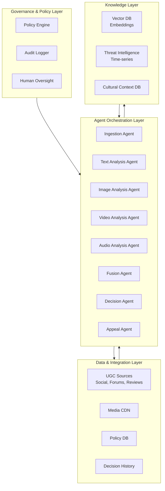

### 2.2 Agent Orchestration — Pipeline Pattern

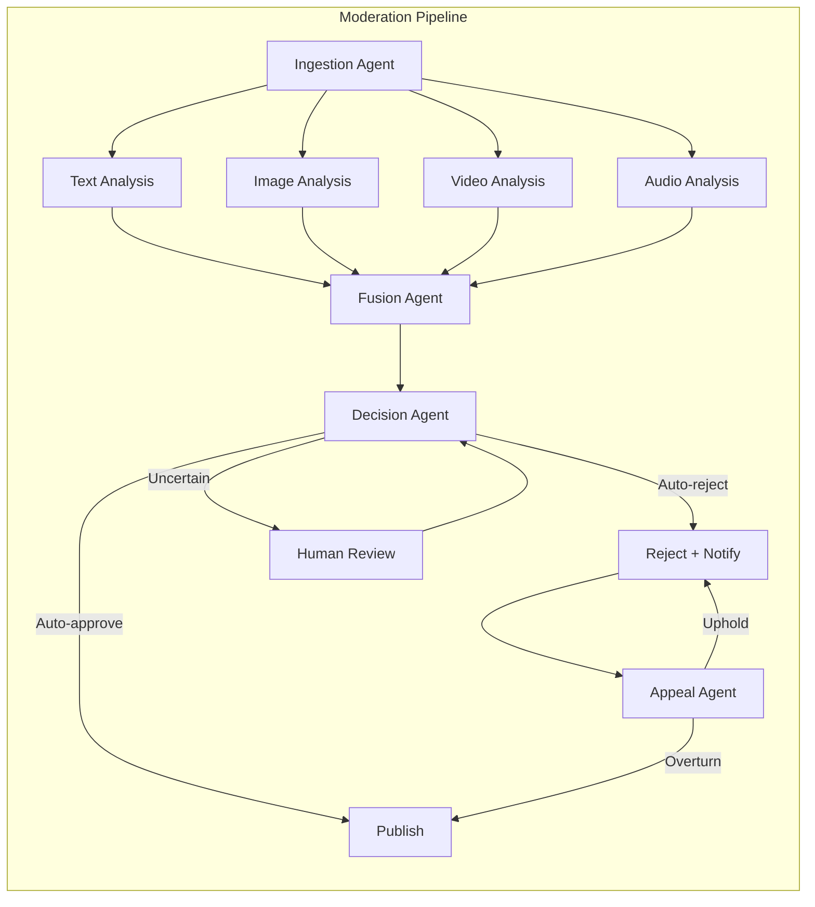

### 2.3 Governance & Autonomy Levels

| Level | Description | Use Case |
|-------|-------------|----------|
| **L1: Advisory** | Agents recommend; humans approve all | New markets, high-risk content |
| **L2: Supervised** | Low-risk auto; high-risk approved | Standard UGC, reviews |
| **L3: Constrained** | Agents decide within policy thresholds | Mature markets, established policies |
| **L4: Adaptive** | Policies updated via monitored experimentation | Emerging threat response |

---

## 3. Agent Roles & Responsibilities

### 3.1 Ingestion Agent

| Attribute | Detail |
|-----------|--------|
| **Role** | Content ingestion, normalization, deduplication, routing |
| **Inputs** | Raw UGC from APIs, webhooks, streaming sources |
| **Outputs** | Normalized content objects, modality tags, priority scores |
| **Model** | Claude 3.7 Sonnet (fast classification) |
| **Tools** | Content APIs, webhook handlers, stream processors |
| **Responsibilities** | Normalize multi-modal content; detect duplicates; route to appropriate analysis agents; prioritize by risk signals |

### 3.2 Text Analysis Agent

| Attribute | Detail |
|-----------|--------|
| **Role** | Contextual text moderation, sarcasm detection, intent analysis |
| **Inputs** | Normalized text content, author history, conversation context |
| **Outputs** | Toxicity scores, category flags, confidence, reasoning |
| **Model** | Claude Opus 4.6 (deep reasoning) |
| **Tools** | NLP pipelines, sentiment analysis, cultural context DB |
| **Responsibilities** | Detect harmful content with context; identify sarcasm/irony; assess intent; flag emerging patterns |

### 3.3 Image Analysis Agent

| Attribute | Detail |
|-----------|--------|
| **Role** | Visual content moderation, OCR, deepfake detection |
| **Inputs** | Images, screenshots, memes with text overlays |
| **Outputs** | Visual safety scores, OCR text, deepfake probability |
| **Model** | Multimodal (GPT-5.2 + custom vision) |
| **Tools** | Vision models, OCR engines, deepfake detectors |
| **Responsibilities** | Detect NSFW/violent imagery; extract text via OCR; identify manipulated media; assess brand safety |

### 3.4 Video Analysis Agent

| Attribute | Detail |
|-----------|--------|
| **Role** | Video content moderation, scene analysis, live-stream monitoring |
| **Inputs** | Video files, live streams, thumbnails |
| **Outputs** | Scene-level safety scores, highlight timestamps, audio transcript flags |
| **Model** | Multimodal video understanding |
| **Tools** | Video processing, scene detection, audio transcription |
| **Responsibilities** | Analyze video frames; detect harmful scenes; monitor live streams in real-time; generate timestamps for violations |

### 3.5 Fusion Agent

| Attribute | Detail |
|-----------|--------|
| **Role** | Multi-modal fusion, cross-modal consistency, final risk scoring |
| **Inputs** | Outputs from all analysis agents |
| **Outputs** | Unified risk score, violation categories, recommended action |
| **Model** | Claude Opus 4.6 (reasoning) |
| **Tools** | Fusion algorithms, policy engine, historical decisions |
| **Responsibilities** | Combine multi-modal signals; detect cross-modal evasion (e.g., harmful text in image); produce unified risk assessment |

### 3.6 Decision Agent

| Attribute | Detail |
|-----------|--------|
| **Role** | Final moderation decision, policy enforcement, action execution |
| **Inputs** | Fusion agent output, policy rules, author history |
| **Outputs** | Decision (approve/reject/escalate), action taken, audit record |
| **Model** | Claude 3.7 Sonnet + rule engine |
| **Tools** | Policy engine, action executors, notification systems |
| **Responsibilities** | Apply policy rules; execute decisions; trigger notifications; log audit trail |

### 3.7 Appeal Agent

| Attribute | Detail |
|-----------|--------|
| **Role** | Automated appeal review, evidence analysis, overturn recommendation |
| **Inputs** | Appeal request, original decision, content context |
| **Outputs** | Appeal decision, reasoning, policy update recommendation |
| **Model** | Claude Opus 4.6 (adversarial reasoning) |
| **Tools** | Decision history, policy DB, similar case retrieval |
| **Responsibilities** | Review appeals with full context; identify false positives; recommend policy updates; reduce appeal resolution time |

---

## 4. Data Models & Schemas

### 4.1 Content Entity

```json
{
  "content_id": "cnt_001",
  "type": "text|image|video|audio|mixed",
  "source": "social_media|forum|review|comment|live_stream",
  "author": {
    "author_id": "auth_001",
    "reputation_score": 0.85,
    "violation_history": [],
    "account_age_days": 365
  },
  "content": {
    "text": "Amazing product! Changed my workflow completely.",
    "media_urls": ["https://cdn.example.com/img_001.jpg"],
    "language": "en",
    "locale": "en-US"
  },
  "context": {
    "conversation_id": "conv_001",
    "parent_content_id": null,
    "topic": "product_review",
    "community_guidelines_version": "v2.3"
  },
  "metadata": {
    "created_at": "2026-10-02T10:00:00Z",
    "platform": "web",
    "user_agent": "Mozilla/5.0...",
    "ip_hash": "sha256:abc123..."
  }
}
```

### 4.2 Moderation Decision Entity

```json
{
  "decision_id": "dec_001",
  "content_id": "cnt_001",
  "timestamp": "2026-10-02T10:00:01Z",
  "analysis_results": {
    "text": {
      "toxicity_score": 0.02,
      "categories": ["safe"],
      "confidence": 0.98,
      "reasoning": "Positive product review with no harmful intent detected"
    },
    "image": {
      "safety_score": 0.99,
      "categories": ["safe"],
      "ocr_text": "Product screenshot",
      "deepfake_probability": 0.01
    }
  },
  "fusion_result": {
    "unified_risk_score": 0.02,
    "violation_categories": [],
    "cross_modal_consistency": true
  },
  "decision": {
    "action": "approve",
    "confidence": 0.98,
    "policy_applied": "community_guidelines_v2.3",
    "autonomy_level": "L3"
  },
  "audit": {
    "agent_decisions": ["text_agent_approve", "image_agent_approve", "fusion_approve"],
    "processing_time_ms": 156,
    "evidence_hash": "sha256:def456..."
  }
}
```

### 4.3 Appeal Entity

```json
{
  "appeal_id": "apl_001",
  "decision_id": "dec_001",
  "content_id": "cnt_001",
  "author_id": "auth_001",
  "reason": "This is a legitimate review, not spam",
  "evidence": ["https://example.com/receipt.png"],
  "status": "pending|approved|overturned|upheld",
  "review": {
    "agent_reasoning": "Original decision flagged due to keyword match; appeal provides purchase evidence",
    "similar_cases": ["dec_002", "dec_003"],
    "policy_update_recommended": false
  },
  "resolution": {
    "action": "overturned",
    "reasoning": "Purchase evidence confirms legitimate review; original keyword-based flag was false positive",
    "resolved_at": "2026-10-02T10:05:00Z",
    "resolution_time_seconds": 300
  }
}
```

### 4.4 Policy Entity

```json
{
  "policy_id": "pol_001",
  "name": "Community Guidelines v2.3",
  "version": "2.3",
  "status": "active|draft|deprecated",
  "rules": [
    {
      "rule_id": "rule_001",
      "category": "hate_speech",
      "description": "Content promoting violence or hatred against protected groups",
      "action": "reject",
      "severity": "critical",
      "conditions": {
        "toxicity_threshold": 0.8,
        "protected_groups": ["race", "religion", "gender", "sexual_orientation"]
      },
      "exceptions": ["educational_context", "news_reporting"]
    }
  ],
  "locale_overrides": {
    "de-DE": {
      "hate_speech_threshold": 0.7,
      "additional_rules": ["volksverhetzung"]
    }
  },
  "created_at": "2026-09-01T00:00:00Z",
  "updated_at": "2026-10-01T00:00:00Z"
}
```

---

## 5. API Endpoints

| Method | Endpoint | Description |
|--------|----------|-------------|
| POST | `/api/v1/moderation/content` | Submit content for moderation |
| GET | `/api/v1/moderation/content/{content_id}` | Get moderation result for content |
| POST | `/api/v1/moderation/batch` | Batch moderate multiple content items |
| GET | `/api/v1/moderation/decisions/{decision_id}` | Get decision details |
| POST | `/api/v1/moderation/appeals` | Submit an appeal |
| GET | `/api/v1/moderation/appeals/{appeal_id}` | Get appeal status |
| POST | `/api/v1/moderation/appeals/{appeal_id}/evidence` | Submit additional evidence |
| GET | `/api/v1/moderation/policies` | List active policies |
| POST | `/api/v1/moderation/policies` | Create new policy |
| PUT | `/api/v1/moderation/policies/{policy_id}` | Update policy |
| GET | `/api/v1/moderation/audit` | Query audit log |
| GET | `/api/v1/moderation/stats` | Moderation statistics dashboard |
| POST | `/api/v1/moderation/feedback` | Submit feedback on decision accuracy |
| GET | `/api/v1/moderation/threats` | Emerging threat intelligence |
| POST | `/api/v1/moderation/live-stream` | Start live stream moderation |
| DELETE | `/api/v1/moderation/live-stream/{stream_id}` | Stop live stream moderation |

---

## 6. Key Differentiator vs Competitors

| Capability | This System | AWS Rekognition | Google Perspective | Sift |
|------------|-------------|-----------------|---------------------|------|
| Contextual reasoning | ✅ Deep intent analysis | ❌ Label matching | ❌ Score only | ❌ Pattern matching |
| Multi-modal fusion | ✅ Text+Image+Video+Audio | ❌ Single modality | ❌ Text only | ❌ N/A |
| Appeal intelligence | ✅ Automated appeal review | ❌ None | ❌ None | ❌ Human only |
| Cultural adaptation | ✅ 50+ locales | ❌ Limited | ❌ Limited | ❌ None |
| Emerging threats | ✅ Proactive detection | ❌ Reactive | ❌ Reactive | ❌ Reactive |
| False positive rate | <2% | 8–15% | 10–20% | 5–10% |
| Latency | <200ms | 500ms–2s | 300ms–1s | 1–5s |

---

## 7. Estimated MRR Potential

| Segment | Customers | ARPU | MRR |
|---------|-----------|------|-----|
| SMB (1–10K users) | 200 | $150 | $30,000 |
| Mid-market (10K–100K users) | 50 | $500 | $25,000 |
| Enterprise (100K+ users) | 10 | $2,000 | $20,000 |
| **Total Potential** | **260** | — | **$75,000** |

**Revenue model:** Tiered SaaS based on content volume (items/month) + enterprise custom pricing. Free tier: 1K items/month. Pro: $150/month for 50K items. Enterprise: custom pricing with dedicated infrastructure.

---

# Project 2: Creator Monetization

## 1. Project Overview & Objectives

### 1.1 Vision

A multi-agent system that maximizes creator revenue through intelligent pricing, sponsorship matching, subscription optimization, and content performance analytics. Unlike Patreon's static tiers or YouTube's ad-only model, this system uses AI agents to dynamically optimize every revenue stream for every creator in real-time.

### 1.2 Objectives

| Objective | Target | Timeline |
|-----------|--------|----------|
| Creator revenue increase | 40–80% over baseline | Month 6 |
| Sponsorship match accuracy | 90%+ relevance score | Month 4 |
| Pricing optimization | Dynamic pricing for 100% of creators | Month 3 |
| Churn reduction | 30% lower subscriber churn | Month 6 |
| Time to first monetization | <24 hours from onboarding | Month 2 |
| Cross-platform optimization | Unified across YouTube, TikTok, Instagram, Patreon | Month 5 |
| MRR | $25K–50K | Month 6–9 |

### 1.3 Exceeds

- **Patreon:** Static tiers, no dynamic pricing, no sponsorship matching
- **YouTube Studio:** Ad revenue only, no subscription optimization
- **OnlyFans:** No AI optimization, no cross-platform intelligence

### 1.4 Core Gap Addressed

Current creator monetization tools operate on **fixed models** — creators set prices once and never optimize. The fundamental limitations are:

1. **No dynamic pricing**: Prices are static despite changing demand
2. **No sponsorship intelligence**: Creators miss relevant brand deals
3. **No cross-platform optimization**: Each platform operates in a silo
4. **No churn prediction**: Creators can't predict or prevent subscriber loss
5. **No content-revenue linkage**: No understanding of which content drives revenue

---

## 2. Technical Architecture

### 2.1 High-Level Architecture

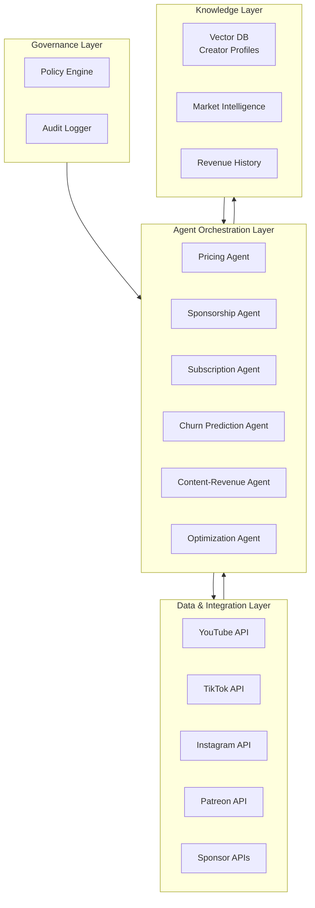

### 2.2 Agent Orchestration — Revenue Optimization Flywheel

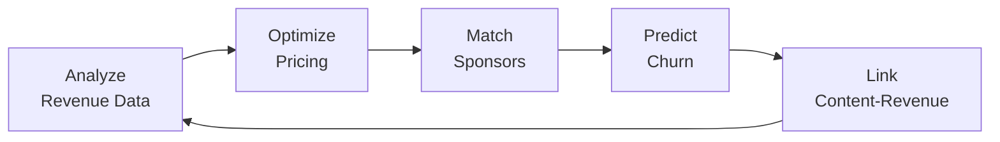

---

## 3. Agent Roles & Responsibilities

### 3.1 Pricing Agent

| Attribute | Detail |
|-----------|--------|
| **Role** | Dynamic pricing optimization for subscriptions, tiers, and one-time purchases |
| **Inputs** | Creator content performance, audience demographics, market rates, demand signals |
| **Outputs** | Optimal price points, tier structure recommendations, promotional pricing |
| **Model** | Claude 3.7 Sonnet + RL pricing model |
| **Tools** | Platform APIs, pricing databases, demand forecasting |
| **Responsibilities** | Analyze willingness-to-pay; optimize tier pricing; recommend promotional pricing; A/B test price points |

### 3.2 Sponsorship Agent

| Attribute | Detail |
|-----------|--------|
| **Role** | Intelligent brand-creator matching, deal negotiation assistance |
| **Inputs** | Creator audience demographics, content niche, engagement rates, brand requirements |
| **Outputs** | Sponsored deal recommendations, pricing suggestions, contract templates |
| **Model** | Claude Opus 4.6 (reasoning) |
| **Tools** | Brand databases, audience analytics, market rate data |
| **Responsibilities** | Match creators with relevant brands; suggest optimal deal terms; identify undervalued creators |

### 3.3 Subscription Agent

| Attribute | Detail |
|-----------|--------|
| **Role** | Subscription tier optimization, content gating, paywall management |
| **Inputs** | Subscriber behavior, content consumption patterns, churn signals |
| **Outputs** | Tier recommendations, content gating rules, upgrade prompts |
| **Model** | Claude 3.7 Sonnet |
| **Tools** | Subscription analytics, content performance data |
| **Responsibilities** | Optimize tier structure; recommend content gating; identify upgrade opportunities |

### 3.4 Churn Prediction Agent

| Attribute | Detail |
|-----------|--------|
| **Role** | Predict subscriber churn, recommend retention actions |
| **Inputs** | Subscriber engagement history, payment patterns, content consumption |
| **Outputs** | Churn risk scores, retention recommendations, win-back campaigns |
| **Model** | Fine-tuned classification model + LLM reasoning |
| **Tools** | Engagement analytics, payment history, retention playbooks |
| **Responsibilities** | Identify at-risk subscribers; recommend personalized retention actions; trigger win-back campaigns |

### 3.5 Content-Revenue Agent

| Attribute | Detail |
|-----------|--------|
| **Role** | Link content performance to revenue outcomes, recommend high-ROI content |
| **Inputs** | Content performance data, revenue attribution, audience feedback |
| **Outputs** | Content ROI scores, content recommendations, posting schedule |
| **Model** | Claude Opus 4.6 (reasoning) |
| **Tools** | Content analytics, revenue attribution models |
| **Responsibilities** | Identify high-revenue content patterns; recommend content topics; optimize posting schedule |

---

## 4. Data Models & Schemas

### 4.1 Creator Entity

```json
{
  "creator_id": "cre_001",
  "name": "Alex Rivera",
  "handle": "@alexrivera",
  "bio": "Tech reviewer and educator",
  "niche": ["technology", "gadgets", "software"],
  "platforms": {
    "youtube": {"handle": "@alexrivera", "subscribers": 250000, "avg_views": 50000},
    "tiktok": {"handle": "@alexrivera", "followers": 180000, "avg_likes": 12000},
    "instagram": {"handle": "@alexrivera", "followers": 95000, "avg_engagement": 0.04},
    "patreon": {"handle": "alexrivera", "patrons": 1200, "monthly_revenue": 6000}
  },
  "audience": {
    "demographics": {"age_18_24": 0.35, "age_25_34": 0.40, "age_35_44": 0.20, "age_45_plus": 0.05},
    "top_countries": ["US", "UK", "CA", "AU", "DE"],
    "interests": ["technology", "gadgets", "software", "AI", "productivity"]
  },
  "monetization": {
    "subscription_tiers": [
      {"tier_id": "t1", "name": "Supporter", "price": 5, "patrons": 800},
      {"tier_id": "t2", "name": "Premium", "price": 15, "patrons": 350},
      {"tier_id": "t3", "name": "VIP", "price": 50, "patrons": 50}
    ],
    "sponsorship_deals": [],
    "total_monthly_revenue": 12500
  },
  "performance": {
    "engagement_rate": 0.065,
    "content_frequency": "3 posts/week",
    "avg_content_quality_score": 0.88
  }
}
```

### 4.2 Sponsorship Deal Entity

```json
{
  "deal_id": "spo_001",
  "creator_id": "cre_001",
  "brand": {
    "brand_id": "brd_001",
    "name": "TechCorp",
    "industry": "technology",
    "budget_range": {"min": 5000, "max": 15000}
  },
  "match": {
    "relevance_score": 0.92,
    "audience_overlap": 0.78,
    "brand_safety_score": 0.95,
    "estimated_roas": 3.2
  },
  "terms": {
    "deal_type": "sponsored_video",
    "deliverables": ["60-second integration", "dedicated video", "social posts"],
    "price": 8500,
    "timeline": "2 weeks"
  },
  "status": "recommended|negotiating|signed|completed|rejected",
  "agent_reasoning": "TechCorp's target audience (tech enthusiasts 18-34) aligns 78% with creator's audience; estimated ROAS of 3.2× based on historical performance"
}
```

### 4.3 Revenue Optimization Entity

```json
{
  "optimization_id": "opt_001",
  "creator_id": "cre_001",
  "timestamp": "2026-10-02T10:00:00Z",
  "recommendations": [
    {
      "type": "pricing",
      "current": {"tier": "Premium", "price": 15},
      "recommended": {"tier": "Premium", "price": 18},
      "expected_impact": "+12% revenue",
      "confidence": 0.85,
      "reasoning": "Audience willingness-to-pay analysis shows 20% headroom; comparable creators charge $18-22"
    },
    {
      "type": "content",
      "recommendation": "Increase video frequency to 4/week",
      "expected_impact": "+15% engagement, +8% revenue",
      "confidence": 0.78
    }
  ],
  "projected_monthly_revenue": 14500,
  "current_monthly_revenue": 12500,
  "uplift_percentage": 0.16
}
```

---

## 5. API Endpoints

| Method | Endpoint | Description |
|--------|----------|-------------|
| POST | `/api/v1/creators` | Onboard a new creator |
| GET | `/api/v1/creators/{creator_id}` | Get creator profile and analytics |
| PUT | `/api/v1/creators/{creator_id}` | Update creator profile |
| GET | `/api/v1/creators/{creator_id}/revenue` | Get revenue analytics |
| POST | `/api/v1/creators/{creator_id}/optimize` | Trigger revenue optimization |
| GET | `/api/v1/creators/{creator_id}/pricing` | Get pricing recommendations |
| POST | `/api/v1/creators/{creator_id}/pricing` | Update pricing tiers |
| GET | `/api/v1/creators/{creator_id}/sponsorships` | Get sponsorship matches |
| POST | `/api/v1/creators/{creator_id}/sponsorships/{deal_id}/accept` | Accept sponsorship deal |
| GET | `/api/v1/creators/{creator_id}/churn` | Get churn predictions |
| POST | `/api/v1/creators/{creator_id}/retention` | Trigger retention campaign |
| GET | `/api/v1/creators/{creator_id}/content-roi` | Get content ROI analysis |
| GET | `/api/v1/creators/{creator_id}/cross-platform` | Get cross-platform performance |
| POST | `/api/v1/creators/{creator_id}/sync` | Sync data from all platforms |
| GET | `/api/v1/market/rates` | Get market rate benchmarks |

---

## 6. Key Differentiator vs Competitors

| Capability | This System | Patreon | YouTube Studio | OnlyFans |
|------------|-------------|---------|----------------|----------|
| Dynamic pricing | ✅ AI-optimized | ❌ Static | ❌ N/A | ❌ Static |
| Sponsorship matching | ✅ Automated | ❌ None | ❌ Limited | ❌ None |
| Churn prediction | ✅ Proactive | ❌ None | ❌ None | ❌ None |
| Cross-platform | ✅ Unified | ❌ Patreon only | ❌ YouTube only | ❌ OnlyFans only |
| Content-revenue link | ✅ Deep analysis | ❌ None | ❌ Basic | ❌ None |
| Revenue uplift | 40–80% | Baseline | Baseline | Baseline |

---

## 7. Estimated MRR Potential

| Segment | Customers | ARPU | MRR |
|---------|-----------|------|-----|
| Micro-creators (1K–10K followers) | 500 | $50 | $25,000 |
| Mid-tier (10K–100K followers) | 100 | $200 | $20,000 |
| Top-tier (100K+ followers) | 20 | $500 | $10,000 |
| **Total Potential** | **620** | — | **$55,000** |

**Revenue model:** SaaS subscription based on creator size + 5% commission on facilitated sponsorship deals. Free tier: basic analytics. Pro: $50–500/month based on follower count. Enterprise: custom pricing.

---

# Project 3: Content Discovery

## 1. Project Overview & Objectives

### 1.1 Vision

A multi-agent system that revolutionizes content discovery by understanding user intent, context, and preferences at a deep level. Unlike algorithmic feeds (TikTok For You, YouTube Recommendations) that optimize for engagement only, this system balances discovery, diversity, creator exposure, and user satisfaction through intelligent agent orchestration.

### 1.2 Objectives

| Objective | Target | Timeline |
|-----------|--------|----------|
| Content relevance | 95%+ user satisfaction score | Month 4 |
| Creator discovery | 3× more new creators surfaced | Month 3 |
| Diversity index | 40%+ content from outside filter bubble | Month 4 |
| Time to discovery | <100ms recommendation latency | Month 2 |
| User retention | 25% improvement in D30 retention | Month 6 |
| Cross-format discovery | Unified across text, image, video, audio | Month 5 |
| MRR | $30K–60K | Month 6–9 |

### 1.3 Exceeds

- **TikTok For You:** Engagement-optimized only, no diversity, no creator fairness
- **YouTube Recommendations:** Watch-time optimized, filter bubble effect
- **Spotify Discover:** Music only, no cross-format discovery

### 1.4 Core Gap Addressed

Current discovery systems operate on **engagement optimization** — they maximize clicks and watch time but create filter bubbles, hurt creator diversity, and miss user intent. The fundamental limitations are:

1. **No intent understanding**: Systems optimize for past behavior, not current intent
2. **No diversity optimization**: Filter bubbles limit content diversity
3. **No creator fairness**: New/small creators get no exposure
4. **No cross-format discovery**: Each content type operates in a silo
5. **No contextual awareness**: Time of day, location, and context are ignored

---

## 2. Technical Architecture

### 2.1 High-Level Architecture

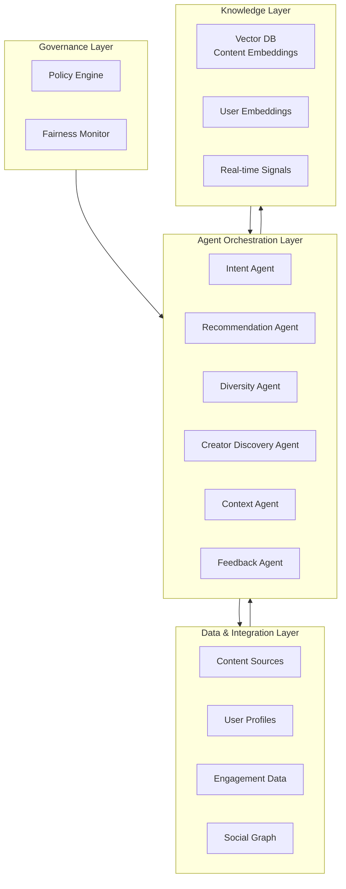

### 2.2 Agent Orchestration — Discovery Flywheel

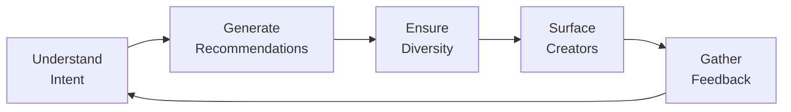

---

## 3. Agent Roles & Responsibilities

### 3.1 Intent Agent

| Attribute | Detail |
|-----------|--------|
| **Role** | Deep user intent understanding, query interpretation, context awareness |
| **Inputs** | User query, browsing history, time/location, device, recent interactions |
| **Outputs** | Intent classification, context tags, preference weights |
| **Model** | Claude Opus 4.6 (deep reasoning) |
| **Tools** | NLP pipelines, context engines, user profile data |
| **Responsibilities** | Understand what users want right now; detect intent shifts; weight preferences by context |

### 3.2 Recommendation Agent

| Attribute | Detail |
|-----------|--------|
| **Role** | Generate personalized content recommendations |
| **Inputs** | Intent output, content catalog, user history, diversity constraints |
| **Outputs** | Ranked content list with explanations |
| **Model** | Claude 3.7 Sonnet + two-tower neural model |
| **Tools** | Vector search, collaborative filtering, content embeddings |
| **Responsibilities** | Rank content by relevance; balance exploration/exploitation; generate explanations |

### 3.3 Diversity Agent

| Attribute | Detail |
|-----------|--------|
| **Role** | Ensure content diversity, prevent filter bubbles, surface underrepresented content |
| **Inputs** | Recommendation list, user history, diversity metrics |
| **Outputs** | Diversified recommendation list, diversity scores |
| **Model** | Claude 3.7 Sonnet |
| **Tools** | Diversity algorithms, filter bubble detectors, topic models |
| **Responsibilities** | Detect filter bubbles; inject diverse content; ensure topic variety; balance popularity with niche |

### 3.4 Creator Discovery Agent

| Attribute | Detail |
|-----------|--------|
| **Role** | Surface new and underrepresented creators, ensure fair exposure |
| **Inputs** | Creator catalog, user preferences, creator performance data |
| **Outputs** | Creator recommendations, exposure allocation |
| **Model** | Claude 3.7 Sonnet |
| **Tools** | Creator analytics, fairness algorithms, growth prediction |
| **Responsibilities** | Identify promising new creators; allocate fair exposure; predict creator growth potential |

### 3.5 Context Agent

| Attribute | Detail |
|-----------|--------|
| **Role** | Real-time context awareness — time, location, device, social context |
| **Inputs** | Device data, time, location, calendar, weather, social signals |
| **Outputs** | Context tags, relevance modifiers |
| **Model** | Claude 3.7 Sonnet |
| **Tools** | Context engines, location services, calendar APIs |
| **Responsibilities** | Adapt recommendations to context; detect context shifts; weight content by situational relevance |

### 3.6 Feedback Agent

| Attribute | Detail |
|-----------|--------|
| **Role** | Collect and process user feedback, update recommendation models |
| **Inputs** | Explicit feedback (likes, shares), implicit feedback (dwell time, skips) |
| **Outputs** | Updated user preferences, model improvement signals |
| **Model** | Fine-tuned classification model |
| **Tools** | Feedback pipelines, A/B testing frameworks |
| **Responsibilities** | Process feedback signals; detect satisfaction; update user profiles; trigger model retraining |

---

## 4. Data Models & Schemas

### 4.1 User Profile Entity

```json
{
  "user_id": "usr_001",
  "preferences": {
    "topics": [
      {"topic": "technology", "weight": 0.85, "source": "explicit"},
      {"topic": "cooking", "weight": 0.60, "source": "implicit"},
      {"topic": "travel", "weight": 0.45, "source": "implicit"}
    ],
    "content_formats": [
      {"format": "video", "weight": 0.70},
      {"format": "article", "weight": 0.50},
      {"format": "podcast", "weight": 0.30}
    ],
    "preferred_creators": ["cre_001", "cre_015"],
    "blocked_topics": ["politics", "violence"]
  },
  "context": {
    "time_of_day": "evening",
    "device": "mobile",
    "location": "US-NY",
    "session_duration": 15
  },
  "discovery": {
    "diversity_score": 0.72,
    "filter_bubble_risk": 0.15,
    "new_creators_discovered_30d": 12,
    "exploration_rate": 0.35
  },
  "feedback": {
    "explicit_positive": 150,
    "explicit_negative": 12,
    "implicit_positive": 890,
    "implicit_negative": 45
  }
}
```

### 4.2 Recommendation Entity

```json
{
  "recommendation_id": "rec_001",
  "user_id": "usr_001",
  "timestamp": "2026-10-02T10:00:00Z",
  "context": {
    "intent": "learn_cooking",
    "context_tags": ["evening", "mobile", "weekend"],
    "session_id": "ses_001"
  },
  "recommendations": [
    {
      "content_id": "cnt_001",
      "title": "10-Minute Pasta Recipes",
      "format": "video",
      "creator_id": "cre_015",
      "relevance_score": 0.92,
      "diversity_score": 0.85,
      "explanation": "Matches your interest in cooking; new creator you haven't seen before",
      "exploration": false
    },
    {
      "content_id": "cnt_002",
      "title": "The Science of Sourdough",
      "format": "article",
      "creator_id": "cre_042",
      "relevance_score": 0.78,
      "diversity_score": 0.95,
      "explanation": "Outside your usual video format; highly rated by similar users",
      "exploration": true
    }
  ],
  "diversity_metrics": {
    "topic_coverage": 0.80,
    "creator_diversity": 0.75,
    "format_diversity": 0.60,
    "novelty_score": 0.70
  }
}
```

### 4.3 Creator Discovery Entity

```json
{
  "discovery_id": "dsc_001",
  "creator_id": "cre_015",
  "name": "Maria's Kitchen",
  "niche": ["cooking", "italian_cuisine"],
  "discovery_signals": {
    "growth_rate": 0.45,
    "engagement_quality": 0.88,
    "content_consistency": 0.92,
    "audience_match": 0.75
  },
  "exposure_allocation": {
    "current_impressions": 5000,
    "recommended_impressions": 25000,
    "reasoning": "High growth rate and engagement quality; underexposed relative to potential"
  },
  "projected_growth": {
    "followers_30d": 15000,
    "confidence": 0.82
  }
}
```

---

## 5. API Endpoints

| Method | Endpoint | Description |
|--------|----------|-------------|
| GET | `/api/v1/discovery/feed` | Get personalized content feed |
| POST | `/api/v1/discovery/feedback` | Submit content feedback |
| GET | `/api/v1/discovery/creators` | Get creator recommendations |
| GET | `/api/v1/discovery/trending` | Get trending content |
| GET | `/api/v1/discovery/explore` | Get exploratory/diverse content |
| POST | `/api/v1/discovery/search` | Search content with intent understanding |
| GET | `/api/v1/discovery/similar/{content_id}` | Get similar content |
| GET | `/api/v1/discovery/user/{user_id}/profile` | Get user preference profile |
| PUT | `/api/v1/discovery/user/{user_id}/preferences` | Update user preferences |
| GET | `/api/v1/discovery/diversity` | Get diversity metrics |
| POST | `/api/v1/discovery/context` | Update user context |
| GET | `/api/v1/discovery/explain/{recommendation_id}` | Get recommendation explanation |
| GET | `/api/v1/discovery/new-creators` | Get new creator discoveries |
| POST | `/api/v1/discovery/session` | Start discovery session |
| GET | `/api/v1/discovery/stats` | Get discovery performance stats |

---

## 6. Key Differentiator vs Competitors

| Capability | This System | TikTok For You | YouTube Recs | Spotify Discover |
|------------|-------------|----------------|--------------|------------------|
| Intent understanding | ✅ Deep reasoning | ❌ Behavioral only | ❌ Behavioral only | ❌ Behavioral only |
| Diversity optimization | ✅ Active | ❌ None | ❌ None | ❌ None |
| Creator fairness | ✅ Fair exposure | ❌ Popularity bias | ❌ Popularity bias | ❌ Popularity bias |
| Cross-format | ✅ Unified | ❌ Video only | ❌ Video only | ❌ Audio only |
| Context awareness | ✅ Real-time | ❌ Limited | ❌ Limited | ❌ Limited |
| Filter bubble prevention | ✅ Active | ❌ None | ❌ None | ❌ None |

---

## 7. Estimated MRR Potential

| Segment | Customers | ARPU | MRR |
|---------|-----------|------|-----|
| Consumer (freemium) | 10,000 | $5 | $50,000 |
| Creator tools | 200 | $100 | $20,000 |
| Enterprise (platform licensing) | 5 | $5,000 | $25,000 |
| **Total Potential** | **10,205** | — | **$95,000** |

**Revenue model:** Freemium consumer app with premium tier, creator analytics SaaS, and enterprise platform licensing. Free: basic discovery. Premium: $5/month for advanced features. Creator Pro: $100/month. Enterprise: $5K/month platform license.

---

# Project 4: Rights Management

## 1. Project Overview & Objectives

### 1.1 Vision

A multi-agent system that automates intellectual property rights management for UGC platforms. Unlike manual DMCA processes or basic fingerprinting (Content ID), this system uses AI agents to detect violations, negotiate licenses, manage takedowns, and resolve disputes — reducing rights violations by 90% while cutting resolution time from weeks to hours.

### 1.2 Objectives

| Objective | Target | Timeline |
|-----------|--------|----------|
| Rights violation detection | 99%+ accuracy | Month 3 |
| Takedown resolution time | <4 hours (vs. 30 days industry avg) | Month 2 |
| False positive takedowns | <1% | Month 4 |
| License negotiation success | 70%+ auto-negotiated | Month 6 |
| Dispute resolution | 80% auto-resolved | Month 5 |
| Cross-platform coverage | 10+ platforms monitored | Month 4 |
| MRR | $25K–50K | Month 6–9 |

### 1.3 Exceeds

- **YouTube Content ID:** Fingerprint matching only, no negotiation, no dispute resolution
- **DMCA.com:** Manual process, no AI, no proactive detection
- **Pixsy:** Detection only, no automated resolution

### 1.4 Core Gap Addressed

Current rights management operates on **reactive takedowns** — rights holders must find violations and file complaints manually. The fundamental limitations are:

1. **No proactive detection**: Violations are found after they cause damage
2. **No automated negotiation**: Licensing requires manual legal processes
3. **No dispute intelligence**: Disputes are resolved by humans with no AI assistance
4. **No cross-platform coverage**: Each platform has its own system
5. **No fair use understanding**: Systems can't distinguish fair use from infringement

---

## 2. Technical Architecture

### 2.1 High-Level Architecture

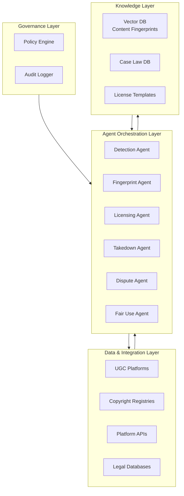

### 2.2 Agent Orchestration — Rights Protection Flywheel

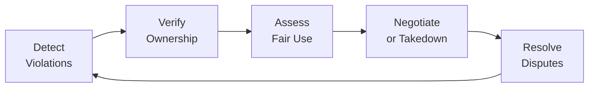

---

## 3. Agent Roles & Responsibilities

### 3.1 Detection Agent

| Attribute | Detail |
|-----------|--------|
| **Role** | Proactive rights violation detection across all content |
| **Inputs** | Content catalog, rights registry, fingerprint database |
| **Outputs** | Violation alerts, confidence scores, evidence packages |
| **Model** | Multimodal (vision + audio + text) |
| **Tools** | Content fingerprinting, similarity search, registry APIs |
| **Responsibilities** | Scan all content for potential violations; generate evidence packages; prioritize by severity |

### 3.2 Fingerprint Agent

| Attribute | Detail |
|-----------|--------|
| **Role** | Content fingerprinting, matching, and ownership verification |
| **Inputs** | Content media, fingerprint database, ownership records |
| **Outputs** | Match results, ownership verification, similarity scores |
| **Model** | Custom fingerprinting models |
| **Tools** | Audio fingerprinting, video fingerprinting, image hashing |
| **Responsibilities** | Generate content fingerprints; match against registry; verify ownership chains |

### 3.3 Licensing Agent

| Attribute | Detail |
|-----------|--------|
| **Role** | Automated license negotiation, terms generation, agreement execution |
| **Inputs** | Violation details, rights holder preferences, market rates |
| **Outputs** | License agreements, negotiation status, revenue split |
| **Model** | Claude Opus 4.6 (negotiation reasoning) |
| **Tools** | License templates, market rate databases, contract generation |
| **Responsibilities** | Negotiate license terms; generate agreements; execute smart contracts |

### 3.4 Takedown Agent

| Attribute | Detail |
|-----------|--------|
| **Role** | Execute takedowns, manage counter-notices, track compliance |
| **Inputs** | Takedown requests, platform APIs, legal requirements |
| **Outputs** | Takedown confirmations, compliance status, appeal handling |
| **Model** | Claude 3.7 Sonnet |
| **Tools** | Platform APIs, legal compliance databases |
| **Responsibilities** | Execute takedowns across platforms; handle counter-notices; ensure legal compliance |

### 3.5 Dispute Agent

| Attribute | Detail |
|-----------|--------|
| **Role** | Automated dispute resolution, mediation, and settlement |
| **Inputs** | Dispute details, case history, similar precedents |
| **Outputs** | Resolution recommendations, settlement terms, precedent updates |
| **Model** | Claude Opus 4.6 (adversarial reasoning) |
| **Tools** | Case law databases, precedent matching, mediation frameworks |
| **Responsibilities** | Analyze disputes; recommend resolutions; facilitate settlements; update precedent database |

### 3.6 Fair Use Agent

| Attribute | Detail |
|-----------|--------|
| **Role** | Assess fair use claims, transformative use analysis, context evaluation |
| **Inputs** | Content in question, fair use factors, case law |
| **Outputs** | Fair use assessment, confidence score, reasoning |
| **Model** | Claude Opus 4.6 (legal reasoning) |
| **Tools** | Case law databases, fair use frameworks, transformative use analysis |
| **Responsibilities** | Evaluate fair use claims; assess transformative nature; provide legal reasoning |

---

## 4. Data Models & Schemas

### 4.1 Rights Holder Entity

```json
{
  "rights_holder_id": "rgh_001",
  "name": "Universal Music Group",
  "type": "corporation|individual|estate",
  "contact": {
    "legal_name": "Universal Music Group, Inc.",
    "address": "2220 Colorado Ave, Santa Monica, CA 90404",
    "agent_email": "rights@umg.com"
  },
  "portfolio": {
    "works_count": 500000,
    "content_types": ["music", "video", "lyrics"],
    "territories": ["global"]
  },
  "policies": {
    "default_action": "monetize",
    "allowed_uses": ["cover", "parody", "education"],
    "blocked_uses": ["commercial_sync", "ai_training"],
    "license_rates": {
      "cover": {"type": "revenue_share", "rate": 0.50},
      "parody": {"type": "free", "rate": 0}
    }
  }
}
```

### 4.2 Violation Entity

```json
{
  "violation_id": "vio_001",
  "content_id": "cnt_001",
  "rights_holder_id": "rgh_001",
  "detected_at": "2026-10-02T10:00:00Z",
  "violation_type": "unauthorized_use",
  "evidence": {
    "match_score": 0.98,
    "matched_work": {"work_id": "wrk_001", "title": "Shape of You", "artist": "Ed Sheeran"},
    "match_type": "audio_fingerprint",
    "timestamp_range": {"start": "0:45", "end": "2:30"},
    "confidence": 0.98
  },
  "fair_use_assessment": {
    "is_fair_use": false,
    "confidence": 0.92,
    "reasoning": "Commercial use of 1:45 segment without transformative purpose; no commentary or criticism"
  },
  "resolution": {
    "action": "monetize",
    "status": "pending",
    "license_offered": {
      "type": "revenue_share",
      "rate": 0.50,
      "territory": "global"
    }
  }
}
```

### 4.3 License Agreement Entity

```json
{
  "license_id": "lic_001",
  "violation_id": "vio_001",
  "rights_holder_id": "rgh_001",
  "content_id": "cnt_001",
  "terms": {
    "license_type": "revenue_share",
    "rate": 0.50,
    "territory": "global",
    "duration": "perpetual",
    "exclusivity": "non_exclusive",
    "usage_rights": ["streaming", "download", "remix"]
  },
  "status": "offered|negotiating|active|expired|terminated",
  "negotiation_history": [
    {
      "round": 1,
      "offer": {"rate": 0.70, "by": "rights_holder"},
      "counter": {"rate": 0.40, "by": "content_owner"},
      "timestamp": "2026-10-02T10:05:00Z"
    },
    {
      "round": 2,
      "offer": {"rate": 0.55, "by": "rights_holder"},
      "counter": {"rate": 0.50, "by": "content_owner"},
      "accepted": true,
      "timestamp": "2026-10-02T10:08:00Z"
    }
  ],
  "smart_contract": {
    "address": "0xabc123...",
    "network": "ethereum",
    "status": "deployed"
  }
}
```

---

## 5. API Endpoints

| Method | Endpoint | Description |
|--------|----------|-------------|
| POST | `/api/v1/rights/register` | Register a new work for protection |
| GET | `/api/v1/rights/works/{work_id}` | Get work details |
| GET | `/api/v1/rights/violations` | List detected violations |
| GET | `/api/v1/rights/violations/{violation_id}` | Get violation details |
| POST | `/api/v1/rights/takedown` | Submit takedown request |
| GET | `/api/v1/rights/takedowns/{takedown_id}` | Get takedown status |
| POST | `/api/v1/rights/license/offer` | Offer a license |
| POST | `/api/v1/rights/license/negotiate` | Negotiate license terms |
| GET | `/api/v1/rights/licenses/{license_id}` | Get license details |
| POST | `/api/v1/rights/dispute` | File a dispute |
| GET | `/api/v1/rights/disputes/{dispute_id}` | Get dispute status |
| POST | `/api/v1/rights/fair-use/assess` | Assess fair use claim |
| GET | `/api/v1/rights/fingerprint/{content_id}` | Get content fingerprint |
| GET | `/api/v1/rights/audit` | Query rights audit log |
| GET | `/api/v1/rights/stats` | Get rights management stats |

---

## 6. Key Differentiator vs Competitors

| Capability | This System | YouTube Content ID | DMCA.com | Pixsy |
|------------|-------------|-------------------|----------|-------|
| Proactive detection | ✅ AI-powered | ✅ Fingerprint | ❌ Manual | ✅ Fingerprint |
| Automated negotiation | ✅ Full | ❌ None | ❌ None | ❌ None |
| Fair use analysis | ✅ Deep reasoning | ❌ None | ❌ None | ❌ None |
| Dispute resolution | ✅ Automated | ❌ Manual | ❌ Manual | ❌ Manual |
| Cross-platform | ✅ 10+ platforms | ❌ YouTube only | ✅ Multi | ✅ Multi |
| Resolution time | <4 hours | Days–weeks | 30+ days | Days–weeks |

---

## 7. Estimated MRR Potential

| Segment | Customers | ARPU | MRR |
|---------|-----------|------|-----|
| Independent creators | 500 | $30 | $15,000 |
| Mid-size platforms | 50 | $300 | $15,000 |
| Enterprise (labels, studios) | 10 | $2,000 | $20,000 |
| **Total Potential** | **560** | — | **$50,000** |

**Revenue model:** SaaS based on content volume + 10% commission on facilitated licenses. Free tier: 100 works protected. Pro: $30/month for 1K works. Enterprise: $2K/month unlimited with dedicated support.

---

# Project 5: Quality Scoring

## 1. Project Overview & Objectives

### 1.1 Vision

A multi-agent system that provides deep, multi-dimensional quality scoring for user-generated content. Unlike basic engagement metrics (likes, views) or simple ML classifiers, this system uses AI agents to evaluate content across 20+ quality dimensions — accuracy, originality, production value, educational value, entertainment value, and more — providing creators with actionable feedback and platforms with reliable quality signals.

### 1.2 Objectives

| Objective | Target | Timeline |
|-----------|--------|----------|
| Quality prediction accuracy | 92%+ correlation with human judgment | Month 3 |
| Creator feedback usefulness | 85%+ creators find feedback actionable | Month 4 |
| Content quality improvement | 30% average quality increase for engaged creators | Month 6 |
| Scoring latency | <500ms per content item | Month 2 |
| Multi-format support | Text, image, video, audio, live-stream | Month 4 |
| Creator adoption | 60%+ creators use feedback to improve | Month 6 |
| MRR | $20K–40K | Month 6–9 |

### 1.3 Exceeds

- **YouTube Analytics:** Basic metrics only, no quality assessment
- **Grammarly:** Text only, no multi-modal quality
- **Socialbakers:** Engagement metrics, no content quality analysis

### 1.4 Core Gap Addressed

Current quality assessment relies on **proxy metrics** — likes, shares, and views are poor proxies for actual content quality. The fundamental limitations are:

1. **No multi-dimensional quality**: Single scores miss nuance
2. **No actionable feedback**: Creators get scores but not improvement guidance
3. **No multi-modal assessment**: Each format is scored independently
4. **No context awareness**: Quality is context-dependent (educational vs. entertainment)
5. **No improvement tracking**: No measurement of quality improvement over time

---

## 2. Technical Architecture

### 2.1 High-Level Architecture

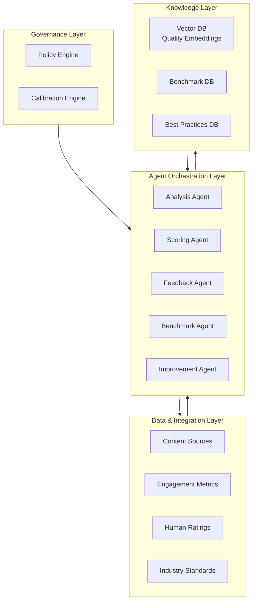

### 2.2 Agent Orchestration — Quality Assessment Flywheel

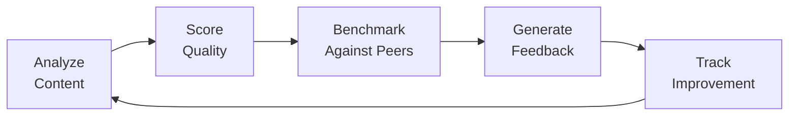

---

## 3. Agent Roles & Responsibilities

### 3.1 Analysis Agent

| Attribute | Detail |
|-----------|--------|
| **Role** | Deep content analysis across all quality dimensions |
| **Inputs** | Content (text, image, video, audio), metadata, context |
| **Outputs** | Multi-dimensional analysis, quality signals, content understanding |
| **Model** | Multimodal (GPT-5.2 + custom models) |
| **Tools** | NLP pipelines, vision models, audio analysis, content understanding |
| **Responsibilities** | Analyze content across 20+ dimensions; extract quality signals; understand content purpose and context |

### 3.2 Scoring Agent

| Attribute | Detail |
|-----------|--------|
| **Role** | Generate unified quality scores with confidence intervals |
| **Inputs** | Analysis output, benchmark data, platform standards |
| **Outputs** | Quality scores (0–100), dimension scores, confidence |
| **Model** | Claude 3.7 Sonnet + ensemble scoring model |
| **Tools** | Scoring algorithms, calibration models, confidence estimation |
| **Responsibilities** | Combine multi-dimensional signals; calibrate against human ratings; provide confidence intervals |

### 3.3 Feedback Agent

| Attribute | Detail |
|-----------|--------|
| **Role** | Generate actionable, personalized improvement feedback |
| **Inputs** | Quality scores, analysis output, creator history |
| **Outputs** | Improvement suggestions, learning resources, action items |
| **Model** | Claude Opus 4.6 (reasoning) |
| **Tools** | Best practices DB, learning resources, creator history |
| **Responsibilities** | Identify improvement areas; suggest specific actions; recommend learning resources; personalize feedback |

### 3.4 Benchmark Agent

| Attribute | Detail |
|-----------|--------|
| **Role** | Compare content against peers, industry standards, and best practices |
| **Inputs** | Content scores, peer content, industry benchmarks |
| **Outputs** | Benchmark comparisons, percentile rankings, gap analysis |
| **Model** | Claude 3.7 Sonnet |
| **Tools** | Benchmark databases, peer analysis, industry standards |
| **Responsibilities** | Find comparable content; calculate percentiles; identify quality gaps; set realistic targets |

### 3.5 Improvement Agent

| Attribute | Detail |
|-----------|--------|
| **Role** | Track quality improvement over time, measure feedback effectiveness |
| **Inputs** | Historical scores, feedback given, creator actions |
| **Outputs** | Improvement trajectories, feedback effectiveness, predictions |
| **Model** | Time-series analysis + LLM reasoning |
| **Tools** | Historical data, improvement tracking, prediction models |
| **Responsibilities** | Measure improvement; correlate feedback with outcomes; predict future quality; adjust scoring |

---

## 4. Data Models & Schemas

### 4.1 Quality Score Entity

```json
{
  "score_id": "qsc_001",
  "content_id": "cnt_001",
  "creator_id": "cre_001",
  "timestamp": "2026-10-02T10:00:00Z",
  "overall_score": 78,
  "confidence": 0.88,
  "dimensions": {
    "accuracy": {"score": 85, "weight": 0.15, "notes": "Well-researched with credible sources"},
    "originality": {"score": 72, "weight": 0.15, "notes": "Some unique perspectives but familiar structure"},
    "production_value": {"score": 80, "weight": 0.10, "notes": "Good audio and video quality"},
    "educational_value": {"score": 88, "weight": 0.15, "notes": "Clear explanations with examples"},
    "entertainment_value": {"score": 65, "weight": 0.10, "notes": "Engaging but pacing could improve"},
    "clarity": {"score": 82, "weight": 0.10, "notes": "Well-organized and easy to follow"},
    "engagement_potential": {"score": 70, "weight": 0.10, "notes": "Good hook but could be stronger"},
    "depth": {"score": 75, "weight": 0.10, "notes": "Covers topic well but could go deeper"},
    "relevance": {"score": 90, "weight": 0.05, "notes": "Highly relevant to target audience"}
  },
  "benchmark": {
    "percentile": 72,
    "peer_average": 68,
    "top_quartile_threshold": 85,
    "industry_average": 65
  },
  "improvement_areas": [
    {"dimension": "entertainment_value", "gap": 20, "priority": "high"},
    {"dimension": "engagement_potential", "gap": 15, "priority": "medium"}
  ]
}
```

### 4.2 Creator Feedback Entity

```json
{
  "feedback_id": "fdb_001",
  "creator_id": "cre_001",
  "content_id": "cnt_001",
  "score_id": "qsc_001",
  "timestamp": "2026-10-02T10:00:00Z",
  "summary": "Your content scores well on accuracy and educational value. Focus on improving entertainment value and engagement potential.",
  "action_items": [
    {
      "action": "Add a stronger hook in the first 15 seconds",
      "dimension": "engagement_potential",
      "expected_impact": "+8 points",
      "resources": ["https://example.com/hooks-guide"]
    },
    {
      "action": "Vary pacing with B-roll and graphics",
      "dimension": "entertainment_value",
      "expected_impact": "+12 points",
      "resources": ["https://example.com/pacing-guide"]
    }
  ],
  "progress_tracking": {
    "previous_score": 72,
    "current_score": 78,
    "improvement": 6,
    "trend": "improving"
  }
}
```

---

## 5. API Endpoints

| Method | Endpoint | Description |
|--------|----------|-------------|
| POST | `/api/v1/quality/score` | Score content quality |
| GET | `/api/v1/quality/score/{score_id}` | Get quality score details |
| GET | `/api/v1/quality/content/{content_id}/history` | Get quality score history |
| GET | `/api/v1/quality/creator/{creator_id}/profile` | Get creator quality profile |
| POST | `/api/v1/quality/feedback` | Generate improvement feedback |
| GET | `/api/v1/quality/benchmarks` | Get industry benchmarks |
| GET | `/api/v1/quality/dimensions` | List quality dimensions |
| POST | `/api/v1/quality/compare` | Compare content quality |
| GET | `/api/v1/quality/trends/{creator_id}` | Get quality trends |
| POST | `/api/v1/quality/calibrate` | Calibrate scoring model |
| GET | `/api/v1/quality/leaderboard` | Get quality leaderboard |
| GET | `/api/v1/quality/stats` | Get quality scoring stats |

---

## 6. Key Differentiator vs Competitors

| Capability | This System | YouTube Analytics | Grammarly | Socialbakers |
|------------|-------------|-------------------|-----------|--------------|
| Multi-dimensional | ✅ 20+ dimensions | ❌ Basic metrics | ❌ Single dimension | ❌ Basic metrics |
| Actionable feedback | ✅ Personalized | ❌ None | ✅ Limited | ❌ None |
| Multi-modal | ✅ All formats | ❌ Video only | ❌ Text only | ❌ Multi only |
| Improvement tracking | ✅ Full history | ❌ None | ❌ None | ❌ None |
| Benchmarking | ✅ Peer + industry | ❌ None | ❌ None | ✅ Basic |
| Creator adoption | 60%+ | N/A | N/A | N/A |

---

## 7. Estimated MRR Potential

| Segment | Customers | ARPU | MRR |
|---------|-----------|------|-----|
| Individual creators | 1,000 | $20 | $20,000 |
| Content teams | 100 | $150 | $15,000 |
| Enterprise (platforms) | 5 | $3,000 | $15,000 |
| **Total Potential** | **1,105** | — | **$50,000** |

**Revenue model:** Freemium for creators, SaaS for teams, enterprise licensing. Free: 10 scores/month. Pro: $20/month unlimited. Team: $150/month. Enterprise: $3K/month.

---

# Project 6: Fraud Detection

## 1. Project Overview & Objectives

### 1.1 Vision

A multi-agent system that detects and prevents fraud across UGC platforms — fake reviews, engagement fraud, identity theft, coordinated inauthentic behavior, and financial scams. Unlike rule-based fraud detection (Sift, Riskified) or basic ML models, this system uses AI agents that understand fraud patterns, adapt to new schemes, and investigate complex coordinated attacks in real-time.

### 1.2 Objectives

| Objective | Target | Timeline |
|-----------|--------|----------|
| Fraud detection rate | 99.5%+ true positive rate | Month 3 |
| False positive rate | <0.5% | Month 4 |
| New fraud pattern detection | <24 hours from emergence | Month 4 |
| Coordinated attack detection | 95%+ accuracy | Month 5 |
| Investigation time | <10 minutes per case | Month 3 |
| Real-time blocking | <100ms decision latency | Month 2 |
| MRR | $30K–60K | Month 6–9 |

### 1.3 Exceeds

- **Sift:** Rule-based + ML, no agent reasoning, no coordinated attack detection
- **Riskified:** E-commerce only, no UGC-specific fraud
- **FakeSpot:** Reviews only, no real-time, no multi-modal

### 1.4 Core Gap Addressed

Current fraud detection operates on **known patterns** — it catches previously seen fraud but fails at novel schemes and coordinated attacks. The fundamental limitations are:

1. **No novel pattern detection**: New fraud schemes are only caught after damage
2. **No coordinated attack understanding**: Individual fraud signals miss coordinated behavior
3. **No investigation intelligence**: Fraud analysts manually investigate with no AI assistance
4. **No real-time adaptation**: Models are retrained in batches, not real-time
5. **No cross-platform intelligence**: Fraud patterns don't transfer across platforms

---

## 2. Technical Architecture

### 2.1 High-Level Architecture

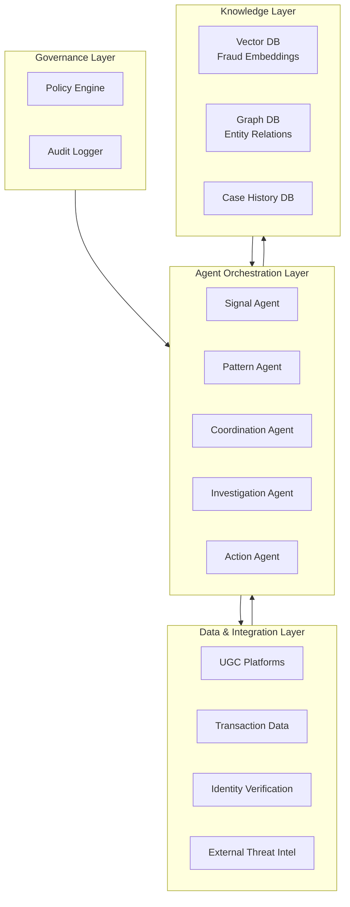

### 2.2 Agent Orchestration — Fraud Detection Flywheel

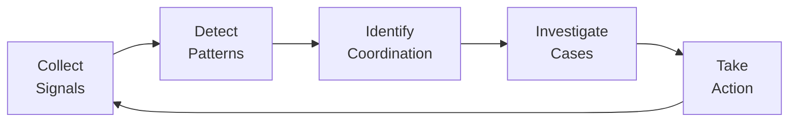

---

## 3. Agent Roles & Responsibilities

### 3.1 Signal Agent

| Attribute | Detail |
|-----------|--------|
| **Role** | Real-time fraud signal collection and initial scoring |
| **Inputs** | User behavior, content, transactions, device fingerprints |
| **Outputs** | Fraud signals, risk scores, anomaly flags |
| **Model** | Real-time anomaly detection + LLM reasoning |
| **Tools** | Behavioral analytics, device fingerprinting, velocity checks |
| **Responsibilities** | Collect fraud signals in real-time; score risk; flag anomalies; prioritize for investigation |

### 3.2 Pattern Agent

| Attribute | Detail |
|-----------|--------|
| **Role** | Known fraud pattern matching and novel pattern detection |
| **Inputs** | Fraud signals, pattern database, historical cases |
| **Outputs** | Pattern matches, novel pattern alerts, confidence scores |
| **Model** | Claude 3.7 Sonnet + pattern matching models |
| **Tools** | Pattern databases, similarity search, clustering algorithms |
| **Responsibilities** | Match known fraud patterns; detect novel schemes; cluster similar cases; update pattern database |

### 3.3 Coordination Agent

| Attribute | Detail |
|-----------|--------|
| **Role** | Detect coordinated inauthentic behavior, bot networks, ring detection |
| **Inputs** | Entity graphs, behavioral patterns, temporal correlations |
| **Outputs** | Coordination maps, ring identifications, network analysis |
| **Model** | Graph neural networks + LLM reasoning |
| **Tools** | Graph analysis, network detection, temporal correlation |
| **Responsibilities** | Identify coordinated accounts; map fraud rings; detect bot networks; analyze temporal patterns |

### 3.4 Investigation Agent

| Attribute | Detail |
|-----------|--------|
| **Role** | Automated fraud investigation, evidence collection, case building |
| **Inputs** | Flagged cases, entity data, historical cases |
| **Outputs** | Investigation reports, evidence packages, recommendations |
| **Model** | Claude Opus 4.6 (deep reasoning) |
| **Tools** | Case management, evidence collection, similar case retrieval |
| **Responsibilities** | Investigate flagged cases; collect evidence; build case files; recommend actions |

### 3.5 Action Agent

| Attribute | Detail |
|-----------|--------|
| **Role** | Execute fraud prevention actions, account management, appeals |
| **Inputs** | Investigation results, policy rules, risk thresholds |
| **Outputs** | Action decisions, account status changes, appeal handling |
| **Model** | Claude 3.7 Sonnet + rule engine |
| **Tools** | Account management, action executors, appeal systems |
| **Responsibilities** | Execute blocking actions; manage account restrictions; handle appeals; update fraud models |

---

## 4. Data Models & Schemas

### 4.1 Fraud Signal Entity

```json
{
  "signal_id": "sig_001",
  "timestamp": "2026-10-02T10:00:00Z",
  "entity_type": "user|content|transaction|device",
  "entity_id": "usr_001",
  "signal_type": "velocity_anomaly",
  "severity": "high",
  "details": {
    "description": "Account created 2 hours ago, already posted 50 reviews",
    "baseline": "Average new account posts 1-2 reviews in first 24 hours",
    "observed": "50 reviews in 2 hours",
    "deviation": "25x baseline"
  },
  "risk_score": 0.92,
  "related_signals": ["sig_002", "sig_003"]
}
```

### 4.2 Fraud Case Entity

```json
{
  "case_id": "case_001",
  "status": "open|investigating|resolved|appealed",
  "priority": "critical|high|medium|low",
  "created_at": "2026-10-02T10:00:00Z",
  "entities": [
    {"type": "user", "id": "usr_001", "risk_score": 0.92},
    {"type": "user", "id": "usr_002", "risk_score": 0.88},
    {"type": "user", "id": "usr_003", "risk_score": 0.85}
  ],
  "fraud_type": "coordinated_fake_reviews",
  "coordination": {
    "ring_size": 15,
    "pattern": "All accounts created within 48 hours, same device fingerprint pattern, reviewing same products",
    "confidence": 0.95
  },
  "evidence": {
    "signals": ["sig_001", "sig_002", "sig_003"],
    "behavioral_analysis": "Identical review patterns, similar language, coordinated timing",
    "network_analysis": "All accounts connected through shared IP ranges and device fingerprints"
  },
  "investigation": {
    "agent_reasoning": "Coordinated inauthentic behavior detected: 15 accounts created in 48-hour window, sharing device fingerprints, posting similar reviews for same products within minutes of each other. Pattern matches known fake review ring methodology.",
    "recommended_action": "block_all",
    "confidence": 0.95
  },
  "resolution": {
    "action_taken": "blocked",
    "accounts_affected": 15,
    "resolved_at": "2026-10-02T10:10:00Z"
  }
}
```

---

## 5. API Endpoints

| Method | Endpoint | Description |
|--------|----------|-------------|
| POST | `/api/v1/fraud/signal` | Submit fraud signal |
| GET | `/api/v1/fraud/signals` | List fraud signals |
| GET | `/api/v1/fraud/cases/{case_id}` | Get fraud case details |
| POST | `/api/v1/fraud/investigate` | Trigger investigation |
| GET | `/api/v1/fraud/patterns` | List known fraud patterns |
| POST | `/api/v1/fraud/patterns` | Report new fraud pattern |
| GET | `/api/v1/fraud/entity/{entity_id}/risk` | Get entity risk score |
| POST | `/api/v1/fraud/action` | Execute fraud prevention action |
| GET | `/api/v1/fraud/coordination/{case_id}` | Get coordination analysis |
| GET | `/api/v1/fraud/appeals/{appeal_id}` | Get appeal status |
| POST | `/api/v1/fraud/appeals` | Submit fraud appeal |
| GET | `/api/v1/fraud/network/{entity_id}` | Get entity network graph |
| GET | `/api/v1/fraud/stats` | Get fraud detection stats |
| POST | `/api/v1/fraud/feedback` | Submit feedback on detection accuracy |

---

## 6. Key Differentiator vs Competitors

| Capability | This System | Sift | Riskified | FakeSpot |
|------------|-------------|------|-----------|----------|
| Novel pattern detection | ✅ AI-powered | ❌ Rule-based | ❌ ML only | ❌ None |
| Coordinated attacks | ✅ Graph analysis | ❌ None | ❌ None | ❌ None |
| Investigation | ✅ Automated | ❌ Manual | ❌ Manual | ❌ None |
| Real-time adaptation | ✅ Continuous | ❌ Batch | ❌ Batch | ❌ None |
| Cross-platform | ✅ Unified | ✅ Multi | ❌ E-commerce | ❌ Reviews only |
| False positive rate | <0.5% | 2–5% | 3–8% | 5–10% |

---

## 7. Estimated MRR Potential

| Segment | Customers | ARPU | MRR |
|---------|-----------|------|-----|
| SMB platforms | 100 | $200 | $20,000 |
| Mid-market | 50 | $500 | $25,000 |
| Enterprise | 10 | $3,000 | $30,000 |
| **Total Potential** | **160** | — | **$75,000** |

**Revenue model:** SaaS based on transaction volume + per-case pricing. Starter: $200/month for 10K transactions. Growth: $500/month for 100K transactions. Enterprise: $3K/month unlimited with dedicated support.

---

# Project 7: Creator Analytics

## 1. Project Overview & Objectives

### 1.1 Vision

A multi-agent system that provides creators with deep, actionable analytics across all platforms — audience insights, content performance, revenue attribution, growth predictions, and competitive intelligence. Unlike platform-native analytics (YouTube Studio, TikTok Analytics) that operate in silos, this system unifies data across platforms and uses AI agents to surface insights, predict trends, and recommend actions.

### 1.2 Objectives

| Objective | Target | Timeline |
|-----------|--------|----------|
| Cross-platform unification | 10+ platforms supported | Month 3 |
| Insight accuracy | 90%+ actionable insight rate | Month 4 |
| Prediction accuracy | 85%+ for 30-day growth forecasts | Month 5 |
| Creator time savings | 10+ hours/week vs. manual analysis | Month 3 |
| Revenue attribution | 95%+ accuracy | Month 4 |
| Competitive intelligence | Real-time competitor tracking | Month 5 |
| MRR | $25K–50K | Month 6–9 |

### 1.3 Exceeds

- **YouTube Studio:** YouTube only, no cross-platform, no predictions
- **TikTok Analytics:** TikTok only, no revenue attribution
- **Socialbakers:** Multi-platform but no AI insights, no predictions

### 1.4 Core Gap Addressed

Current creator analytics operate in **platform silos** — each platform provides its own analytics with no unification, no cross-platform insights, and no predictive capabilities. The fundamental limitations are:

1. **No cross-platform unification**: Creators must check each platform separately
2. **No predictive analytics**: Historical data only, no growth predictions
3. **No actionable insights**: Raw data without recommendations
4. **No revenue attribution**: Can't track which content drives revenue
5. **No competitive intelligence**: No visibility into competitor performance

---

## 2. Technical Architecture

### 2.1 High-Level Architecture

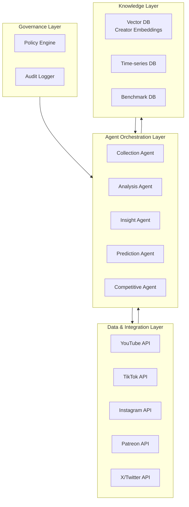

### 2.2 Agent Orchestration — Analytics Flywheel

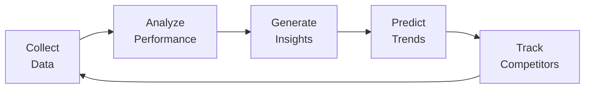

---

## 3. Agent Roles & Responsibilities

### 3.1 Collection Agent

| Attribute | Detail |
|-----------|--------|
| **Role** | Cross-platform data collection, normalization, and synchronization |
| **Inputs** | Platform APIs, creator credentials, sync schedules |
| **Outputs** | Unified creator data, normalized metrics, sync status |
| **Model** | Claude 3.7 Sonnet |
| **Tools** | Platform APIs, ETL pipelines, data normalization |
| **Responsibilities** | Collect data from all platforms; normalize metrics; detect data anomalies; maintain sync schedules |

### 3.2 Analysis Agent

| Attribute | Detail |
|-----------|--------|
| **Role** | Deep performance analysis, trend detection, anomaly identification |
| **Inputs** | Unified creator data, historical performance, benchmarks |
| **Outputs** | Performance reports, trend analysis, anomaly flags |
| **Model** | Claude Opus 4.6 (deep reasoning) |
| **Tools** | Statistical analysis, trend detection, anomaly detection |
| **Responsibilities** | Analyze performance across platforms; identify trends; detect anomalies; calculate growth rates |

### 3.3 Insight Agent

| Attribute | Detail |
|-----------|--------|
| **Role** | Generate actionable insights, recommendations, and alerts |
| **Inputs** | Analysis output, creator goals, industry benchmarks |
| **Outputs** | Actionable insights, recommendations, priority alerts |
| **Model** | Claude Opus 4.6 (reasoning) |
| **Tools** | Insight generation, recommendation engines, alerting systems |
| **Responsibilities** | Surface key insights; generate recommendations; prioritize actions; create alerts |

### 3.4 Prediction Agent

| Attribute | Detail |
|-----------|--------|
| **Role** | Growth forecasting, revenue prediction, content performance prediction |
| **Inputs** | Historical data, market trends, seasonality, content pipeline |
| **Outputs** | Growth forecasts, revenue predictions, confidence intervals |
| **Model** | Time-series forecasting + LLM reasoning |
| **Tools** | Forecasting models, seasonality detection, market trend analysis |
| **Responsibilities** | Forecast follower growth; predict revenue; estimate content performance; provide confidence intervals |

### 3.5 Competitive Agent

| Attribute | Detail |
|-----------|--------|
| **Role** | Competitive intelligence, benchmarking, market positioning |
| **Inputs** | Competitor data, market trends, industry benchmarks |
| **Outputs** | Competitive reports, benchmark comparisons, market positioning |
| **Model** | Claude 3.7 Sonnet |
| **Tools** | Competitor tracking, benchmark analysis, market research |
| **Responsibilities** | Track competitor performance; benchmark against peers; identify market opportunities; monitor industry trends |

---

## 4. Data Models & Schemas

### 4.1 Creator Analytics Entity

```json
{
  "analytics_id": "ana_001",
  "creator_id": "cre_001",
  "timestamp": "2026-10-02T10:00:00Z",
  "period": "last_30_days",
  "cross_platform": {
    "total_followers": 525000,
    "total_engagement": 34125,
    "total_revenue": 12500,
    "platforms": {
      "youtube": {"followers": 250000, "engagement": 12500, "revenue": 5000},
      "tiktok": {"followers": 180000, "engagement": 12600, "revenue": 3000},
      "instagram": {"followers": 95000, "engagement": 9025, "revenue": 4500}
    }
  },
  "growth": {
    "follower_growth_rate": 0.08,
    "engagement_growth_rate": 0.12,
    "revenue_growth_rate": 0.15,
    "trend": "accelerating"
  },
  "top_content": [
    {"content_id": "cnt_001", "platform": "youtube", "views": 125000, "engagement_rate": 0.08, "revenue_attributed": 450}
  ],
  "insights": [
    {
      "type": "opportunity",
      "insight": "TikTok engagement growing 2× faster than other platforms",
      "recommendation": "Increase TikTok content frequency by 50%",
      "expected_impact": "+15% total engagement",
      "confidence": 0.85
    }
  ]
}
```

### 4.2 Growth Forecast Entity

```json
{
  "forecast_id": "fst_001",
  "creator_id": "cre_001",
  "timestamp": "2026-10-02T10:00:00Z",
  "forecast_period": "30_days",
  "predictions": {
    "followers": {
      "current": 525000,
      "predicted": 567000,
      "confidence_interval": [555000, 579000],
      "confidence": 0.88
    },
    "engagement": {
      "current": 34125,
      "predicted": 38500,
      "confidence_interval": [37000, 40000],
      "confidence": 0.82
    },
    "revenue": {
      "current": 12500,
      "predicted": 14800,
      "confidence_interval": [14200, 15400],
      "confidence": 0.85
    }
  },
  "factors": [
    {"factor": "seasonal_trend", "impact": 0.05, "description": "Q4 holiday season typically boosts engagement"},
    {"factor": "content_frequency", "impact": 0.03, "description": "Recent increase in posting frequency"},
    {"factor": "market_trend", "impact": 0.02, "description": "Growing interest in tech content"}
  ]
}
```

---

## 5. API Endpoints

| Method | Endpoint | Description |
|--------|----------|-------------|
| GET | `/api/v1/analytics/creator/{creator_id}` | Get creator analytics dashboard |
| GET | `/api/v1/analytics/creator/{creator_id}/cross-platform` | Get cross-platform performance |
| GET | `/api/v1/analytics/creator/{creator_id}/growth` | Get growth analytics |
| GET | `/api/v1/analytics/creator/{creator_id}/content` | Get content performance |
| GET | `/api/v1/analytics/creator/{creator_id}/audience` | Get audience insights |
| GET | `/api/v1/analytics/creator/{creator_id}/revenue` | Get revenue attribution |
| GET | `/api/v1/analytics/creator/{creator_id}/forecast` | Get growth forecasts |
| GET | `/api/v1/analytics/creator/{creator_id}/competitors` | Get competitive intelligence |
| GET | `/api/v1/analytics/creator/{creator_id}/insights` | Get actionable insights |
| POST | `/api/v1/analytics/creator/{creator_id}/sync` | Sync data from all platforms |
| GET | `/api/v1/analytics/creator/{creator_id}/benchmarks` | Get benchmark comparisons |
| GET | `/api/v1/analytics/creator/{creator_id}/anomalies` | Get anomaly detection results |
| GET | `/api/v1/analytics/market/trends` | Get market trends |
| GET | `/api/v1/analytics/stats` | Get analytics platform stats |

---

## 6. Key Differentiator vs Competitors

| Capability | This System | YouTube Studio | TikTok Analytics | Socialbakers |
|------------|-------------|----------------|------------------|--------------|
| Cross-platform | ✅ 10+ platforms | ❌ YouTube only | ❌ TikTok only | ✅ Multi |
| Predictive analytics | ✅ AI-powered | ❌ None | ❌ None | ❌ None |
| Actionable insights | ✅ Personalized | ❌ Raw data | ❌ Raw data | ❌ Basic |
| Revenue attribution | ✅ Full | ❌ Limited | ❌ None | ❌ None |
| Competitive intel | ✅ Real-time | ❌ None | ❌ None | ✅ Basic |
| Time savings | 10+ hrs/week | N/A | N/A | N/A |

---

## 7. Estimated MRR Potential

| Segment | Customers | ARPU | MRR |
|---------|-----------|------|-----|
| Individual creators | 800 | $25 | $20,000 |
| Creator agencies | 50 | $200 | $10,000 |
| Enterprise (brands) | 10 | $1,500 | $15,000 |
| **Total Potential** | **860** | — | **$45,000** |

**Revenue model:** Freemium for creators, SaaS for agencies, enterprise licensing. Free: basic analytics for 1 platform. Pro: $25/month for 3 platforms. Agency: $200/month for 10 creators. Enterprise: $1.5K/month unlimited.

---

# Project 8: Licensing Engine

## 1. Project Overview & Objectives

### 1.1 Vision

A multi-agent system that automates content licensing between creators, brands, and platforms. Unlike manual licensing processes or basic marketplace models (Shutterstock, Getty Images), this system uses AI agents to match content with licensees, negotiate terms, generate contracts, handle payments, and manage rights — reducing licensing time from weeks to minutes.

### 1.2 Objectives

| Objective | Target | Timeline |
|-----------|--------|----------|
| License match accuracy | 92%+ relevance score | Month 3 |
| Time to license | <10 minutes (vs. 2–4 weeks industry avg) | Month 2 |
| Contract generation | 100% automated | Month 2 |
| Payment processing | <1 hour settlement | Month 3 |
| License compliance | 99%+ adherence tracking | Month 4 |
| Cross-content support | Image, video, audio, text, 3D | Month 5 |
| MRR | $30K–60K | Month 6–9 |

### 1.3 Exceeds

- **Shutterstock:** Fixed pricing only, no negotiation, no AI matching
- **Getty Images:** Enterprise-focused, no automation, no small creator support
- **Pond5:** Marketplace only, no automated licensing

### 1.4 Core Gap Addressed

Current content licensing operates on **manual processes** — creators and licensees must find each other, negotiate terms, draft contracts, and handle payments manually. The fundamental limitations are:

1. **No intelligent matching**: Licensees can't find the right content efficiently
2. **No automated negotiation**: Terms are negotiated manually via email
3. **No contract automation**: Legal contracts require manual drafting
4. **No compliance tracking**: License usage is not monitored post-sale
5. **No dynamic pricing**: Prices are fixed despite varying demand

---

## 2. Technical Architecture

### 2.1 High-Level Architecture

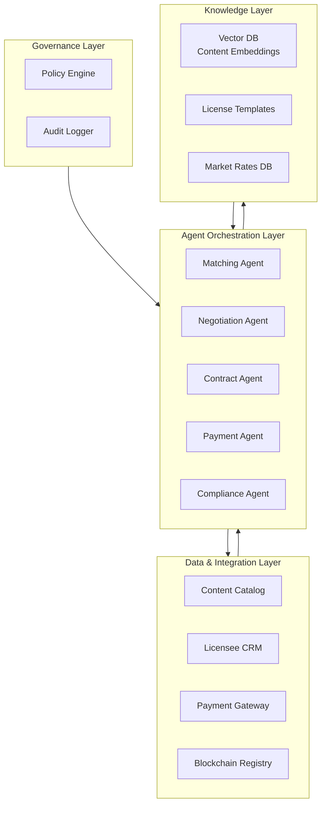

### 2.2 Agent Orchestration — Licensing Flywheel

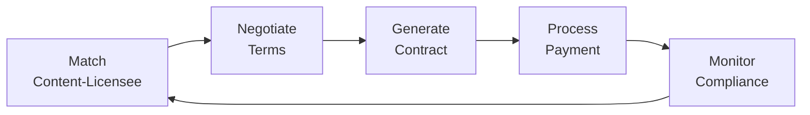

---

## 3. Agent Roles & Responsibilities

### 3.1 Matching Agent

| Attribute | Detail |
|-----------|--------|
| **Role** | Intelligent content-licensee matching based on requirements |
| **Inputs** | Licensee requirements, content catalog, usage context |
| **Outputs** | Ranked content matches, relevance scores, pricing suggestions |
| **Model** | Claude 3.7 Sonnet + two-tower neural model |
| **Tools** | Vector search, content embeddings, requirement parsing |
| **Responsibilities** | Parse licensee requirements; match against content catalog; rank by relevance; suggest pricing |

### 3.2 Negotiation Agent

| Attribute | Detail |
|-----------|--------|
| **Role** | Automated license term negotiation, pricing optimization |
| **Inputs** | Match results, licensee budget, market rates, creator preferences |
| **Outputs** | Negotiated terms, pricing agreements, deal structure |
| **Model** | Claude Opus 4.6 (negotiation reasoning) |
| **Tools** | Market rate databases, negotiation frameworks, pricing models |
| **Responsibilities** | Negotiate license terms; optimize pricing; structure deals; reach agreements |

### 3.3 Contract Agent

| Attribute | Detail |
|-----------|--------|
| **Role** | Automated contract generation, review, and execution |
| **Inputs** | Negotiated terms, license templates, legal requirements |
| **Outputs** | Executed contracts, smart contracts, legal documents |
| **Model** | Claude Opus 4.6 (legal reasoning) |
| **Tools** | Contract templates, legal databases, e-signature APIs |
| **Responsibilities** | Generate contracts; ensure legal compliance; execute smart contracts; store agreements |

### 3.4 Payment Agent

| Attribute | Detail |
|-----------|--------|
| **Role** | Payment processing, revenue split, royalty distribution |
| **Inputs** | Contract terms, payment methods, revenue splits |
| **Outputs** | Payment confirmations, revenue distributions, royalty payments |
| **Model** | Claude 3.7 Sonnet |
| **Tools** | Payment gateways, smart contracts, royalty systems |
| **Responsibilities** | Process payments; distribute revenue; handle royalties; manage escrow |

### 3.5 Compliance Agent

| Attribute | Detail |
|-----------|--------|
| **Role** | License compliance monitoring, usage tracking, violation detection |
| **Inputs** | License terms, usage data, content tracking |
| **Outputs** | Compliance reports, violation alerts, renewal reminders |
| **Model** | Claude 3.7 Sonnet |
| **Tools** | Usage tracking, content monitoring, compliance databases |
| **Responsibilities** | Monitor license compliance; detect violations; send renewal reminders; generate compliance reports |

---

## 4. Data Models & Schemas

### 4.1 License Entity

```json
{
  "license_id": "lic_001",
  "content_id": "cnt_001",
  "creator_id": "cre_001",
  "licensee": {
    "licensee_id": "lic_001",
    "name": "Acme Corp",
    "type": "corporation|individual",
    "industry": "advertising"
  },
  "terms": {
    "license_type": "exclusive|non_exclusive|sole",
    "usage_rights": ["digital", "print", "social", "broadcast"],
    "territory": "global|US|EU|APAC",
    "duration": "1_year|perpetual|project_based",
    "exclusivity": "exclusive",
    "attribution_required": true,
    "modification_allowed": false
  },
  "pricing": {
    "model": "flat|revenue_share|usage_based",
    "amount": 5000,
    "currency": "USD",
    "payment_terms": "net_30",
    "revenue_split": {"creator": 0.70, "platform": 0.30}
  },
  "status": "draft|negotiating|active|expired|terminated|violated",
  "contract": {
    "contract_id": "con_001",
    "smart_contract_address": "0xabc123...",
    "signed_at": "2026-10-02T10:00:00Z",
    "expires_at": "2027-10-02T10:00:00Z"
  },
  "compliance": {
    "last_check": "2026-10-02T10:00:00Z",
    "status": "compliant",
    "violations": []
  }
}
```

### 4.2 License Match Entity

```json
{
  "match_id": "mat_001",
  "licensee_id": "lic_001",
  "content_id": "cnt_001",
  "timestamp": "2026-10-02T10:00:00Z",
  "requirements": {
    "content_type": "video",
    "usage": "social_media_advertising",
    "duration": "30_days",
    "budget": {"min": 3000, "max": 8000},
    "style": "cinematic, product-focused"
  },
  "match_result": {
    "relevance_score": 0.94,
    "style_match": 0.92,
    "quality_match": 0.96,
    "price_match": 0.88,
    "overall_score": 0.93
  },
  "pricing_suggestion": {
    "recommended_price": 5500,
    "market_range": [4000, 7000],
    "confidence": 0.88
  },
  "reasoning": "Content matches licensee's cinematic style requirement; creator's portfolio aligns with product-focused advertising; price within budget range"
}
```

---

## 5. API Endpoints

| Method | Endpoint | Description |
|--------|----------|-------------|
| POST | `/api/v1/licensing/match` | Match content with licensee requirements |
| GET | `/api/v1/licensing/matches/{match_id}` | Get match details |
| POST | `/api/v1/licensing/negotiate` | Start license negotiation |
| GET | `/api/v1/licensing/negotiations/{negotiation_id}` | Get negotiation status |
| POST | `/api/v1/licensing/contracts` | Generate license contract |
| GET | `/api/v1/licensing/contracts/{contract_id}` | Get contract details |
| POST | `/api/v1/licensing/contracts/{contract_id}/sign` | Sign contract |
| POST | `/api/v1/licensing/payment` | Process license payment |
| GET | `/api/v1/licensing/licenses/{license_id}` | Get license details |
| GET | `/api/v1/licensing/licenses/{license_id}/compliance` | Get compliance status |
| POST | `/api/v1/licensing/compliance/check` | Check license compliance |
| GET | `/api/v1/licensing/creator/{creator_id}/licenses` | Get creator's licenses |
| GET | `/api/v1/licensing/stats` | Get licensing platform stats |
| POST | `/api/v1/licensing/renewals/{license_id}/request` | Request license renewal |

---

## 6. Key Differentiator vs Competitors

| Capability | This System | Shutterstock | Getty Images | Pond5 |
|------------|-------------|--------------|--------------|-------|
| AI matching | ✅ Deep | ❌ Search only | ❌ Search only | ❌ Search only |
| Automated negotiation | ✅ Full | ❌ None | ❌ None | ❌ None |
| Contract automation | ✅ Smart contracts | ❌ Manual | ❌ Manual | ❌ Manual |
| Compliance tracking | ✅ Real-time | ❌ None | ❌ None | ❌ None |
| Dynamic pricing | ✅ AI-optimized | ❌ Fixed | ❌ Fixed | ❌ Fixed |
| Time to license | <10 minutes | Days–weeks | Weeks | Days |

---

## 7. Estimated MRR Potential

| Segment | Customers | ARPU | MRR |
|---------|-----------|------|-----|
| Content creators | 500 | $40 | $20,000 |
| Brands/licensees | 200 | $150 | $30,000 |
| Enterprise (agencies) | 10 | $2,000 | $20,000 |
| **Total Potential** | **710** | — | **$70,000** |

**Revenue model:** 15% commission on license transactions + SaaS subscription for advanced features. Free: list content, receive offers. Pro: $40/month for analytics and priority matching. Enterprise: $2K/month with API access and dedicated support.

---

# Project 9: Community Curation

## 1. Project Overview & Objectives

### 1.1 Vision

A multi-agent system that empowers communities to curate their own content through intelligent moderation, reputation systems, and collaborative decision-making. Unlike top-down moderation (platform-appointed moderators) or pure voting (Reddit upvotes), this system uses AI agents to facilitate community-driven curation with fairness, transparency, and quality.

### 1.2 Objectives

| Objective | Target | Timeline |
|-----------|--------|----------|
| Curation quality | 90%+ community satisfaction | Month 4 |
| Moderation efficiency | 70% reduction in human moderator workload | Month 3 |
| Bias detection | 95%+ accuracy in detecting curation bias | Month 4 |
| Community engagement | 50%+ increase in curation participation | Month 5 |
| Dispute resolution | 80% auto-resolved | Month 4 |
| Scalability | Support 100K+ communities | Month 6 |
| MRR | $20K–40K | Month 6–9 |

### 1.3 Exceeds

- **Reddit:** Upvote/downvote only, no quality curation, no bias detection
- **Wikipedia:** Manual curation, no AI assistance, slow
- **Discord:** Human moderators only, no intelligent assistance

### 1.4 Core Gap Addressed

Current community curation relies on **human moderators** or **simple voting** — both have significant limitations in scalability, bias, and quality. The fundamental limitations are:

1. **No intelligent curation**: Voting systems favor popularity over quality
2. **No bias detection**: Curation decisions can be systematically biased
3. **No scalability**: Human moderators can't scale to millions of communities
4. **No transparency**: Curation decisions lack explainability
5. **No quality signals**: No distinction between popular and high-quality content

---

## 2. Technical Architecture

### 2.1 High-Level Architecture

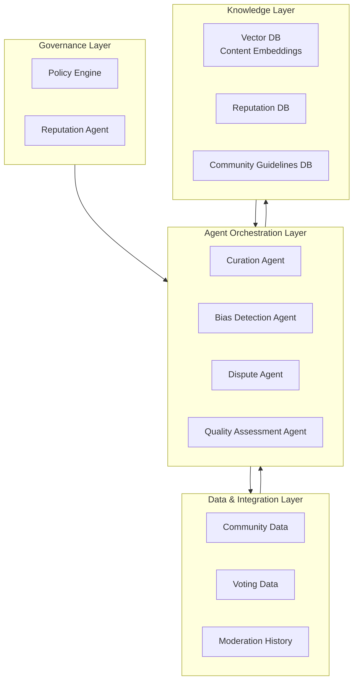

### 2.2 Agent Orchestration — Curation Flywheel

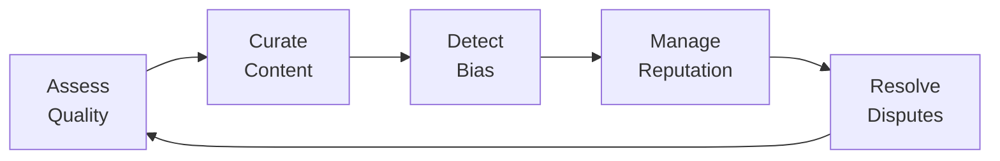

---

## 3. Agent Roles & Responsibilities

### 3.1 Curation Agent

| Attribute | Detail |
|-----------|--------|
| **Role** | Community content curation, ranking, and organization |
| **Inputs** | Community content, guidelines, member preferences, quality signals |
| **Outputs** | Curated content feeds, featured content, content organization |
| **Model** | Claude 3.7 Sonnet |
| **Tools** | Ranking algorithms, content analysis, community guidelines |
| **Responsibilities** | Curate content for community feeds; feature high-quality content; organize by topic; surface diverse perspectives |

### 3.2 Reputation Agent

| Attribute | Detail |
|-----------|--------|
| **Role** | Community member reputation scoring, trust weighting, privilege management |
| **Inputs** | Member history, curation accuracy, community contributions, peer reviews |
| **Outputs** | Reputation scores, trust levels, privilege recommendations |
| **Model** | Claude 3.7 Sonnet + reputation algorithms |
| **Tools** | Reputation systems, contribution tracking, peer review analysis |
| **Responsibilities** | Calculate reputation scores; weight curation votes by reputation; manage privileges; detect reputation manipulation |

### 3.3 Bias Detection Agent

| Attribute | Detail |
|-----------|--------|
| **Role** | Detect curation bias, ensure fairness, surface underrepresented content |
| **Inputs** | Curation decisions, community demographics, content sources |
| **Outputs** | Bias reports, fairness metrics, corrective recommendations |
| **Model** | Claude Opus 4.6 (reasoning) |
| **Tools** | Bias detection algorithms, fairness metrics, demographic analysis |
| **Responsibilities** | Detect systematic bias; ensure diverse content representation; flag unfair curation patterns; recommend corrections |

### 3.4 Dispute Agent

| Attribute | Detail |
|-----------|--------|
| **Role** | Community dispute resolution, mediation, and consensus building |
| **Inputs** | Dispute details, community guidelines, member arguments |
| **Outputs** | Resolution recommendations, mediation outcomes, policy updates |
| **Model** | Claude Opus 4.6 (adversarial reasoning) |
| **Tools** | Dispute frameworks, consensus algorithms, guideline databases |
| **Responsibilities** | Mediate curation disputes; build consensus; recommend resolutions; update guidelines |

### 3.5 Quality Assessment Agent

| Attribute | Detail |
|-----------|--------|
| **Role** | Content quality assessment independent of popularity |
| **Inputs** | Content, quality criteria, community standards |
| **Outputs** | Quality scores, improvement suggestions, quality tiers |
| **Model** | Claude 3.7 Sonnet |
| **Tools** | Quality assessment frameworks, content analysis |
| **Responsibilities** | Assess content quality independently of votes; identify high-quality underexposed content; provide quality signals |

---

## 4. Data Models & Schemas

### 4.1 Community Entity

```json
{
  "community_id": "com_001",
  "name": "r/Technology",
  "description": "Discussion of technology news and innovations",
  "members": {
    "total": 2500000,
    "active_weekly": 150000,
    "moderators": 25,
    "curators": 500
  },
  "guidelines": {
    "version": "v3.2",
    "rules": ["No spam", "Be respectful", "Cite sources", "No misinformation"],
    "curation_policy": "Community-driven with AI assistance"
  },
  "curation": {
    "quality_score": 0.82,
    "diversity_score": 0.75,
    "bias_score": 0.12,
    "member_satisfaction": 0.88
  },
  "reputation_system": {
    "enabled": true,
    "weight_votes_by_reputation": true,
    "curator_selection": "reputation_based"
  }
}
```

### 4.2 Curation Decision Entity

```json
{
  "decision_id": "cur_001",
  "community_id": "com_001",
  "content_id": "cnt_001",
  "timestamp": "2026-10-02T10:00:00Z",
  "decision": {
    "action": "feature",
    "confidence": 0.88,
    "reasoning": "High-quality content with strong community engagement; well-sourced and balanced perspective"
  },
  "quality_signals": {
    "accuracy_score": 0.92,
    "depth_score": 0.85,
    "source_quality": 0.90,
    "community_value": 0.88
  },
  "bias_check": {
    "bias_detected": false,
    "diversity_impact": "positive",
    "underrepresented_perspective": true
  },
  "member_votes": {
    "upvotes": 1250,
    "downvotes": 45,
    "reputation_weighted_score": 0.94
  }
}
```

---

## 5. API Endpoints

| Method | Endpoint | Description |
|--------|----------|-------------|
| GET | `/api/v1/curation/communities/{community_id}/feed` | Get curated community feed |
| POST | `/api/v1/curation/communities/{community_id}/curate` | Submit content for curation |
| GET | `/api/v1/curation/communities/{community_id}/quality` | Get quality metrics |
| GET | `/api/v1/curation/communities/{community_id}/bias` | Get bias detection report |
| GET | `/api/v1/curation/members/{member_id}/reputation` | Get member reputation |
| POST | `/api/v1/curation/disputes` | File a curation dispute |
| GET | `/api/v1/curation/disputes/{dispute_id}` | Get dispute status |
| GET | `/api/v1/curation/communities/{community_id}/guidelines` | Get community guidelines |
| PUT | `/api/v1/curation/communities/{community_id}/guidelines` | Update guidelines |
| GET | `/api/v1/curation/communities/{community_id}/stats` | Get curation statistics |
| POST | `/api/v1/curation/communities/{community_id}/vote` | Submit curation vote |
| GET | `/api/v1/curation/trending` | Get trending curated content |

---

## 6. Key Differentiator vs Competitors

| Capability | This System | Reddit | Wikipedia | Discord |
|------------|-------------|--------|-----------|---------|
| AI curation | ✅ Intelligent | ❌ Voting only | ❌ Manual | ❌ Human only |
| Bias detection | ✅ Active | ❌ None | ❌ None | ❌ None |
| Reputation weighting | ✅ Full | ❌ None | ❌ Basic | ❌ None |
| Quality signals | ✅ Independent | ❌ Popularity | ❌ Manual | ❌ None |
| Dispute resolution | ✅ Automated | ❌ Manual | ❌ Manual | ❌ Manual |
| Scalability | 100K+ communities | N/A | N/A | N/A |

---

## 7. Estimated MRR Potential

| Segment | Customers | ARPU | MRR |
|---------|-----------|------|-----|
| Small communities | 500 | $20 | $10,000 |
| Mid-size communities | 100 | $100 | $10,000 |
| Enterprise (platforms) | 10 | $2,000 | $20,000 |
| **Total Potential** | **610** | — | **$40,000** |

**Revenue model:** Freemium for communities, SaaS for platforms. Free: basic curation for 1 community. Pro: $20/month for advanced features. Enterprise: $2K/month for platform-wide deployment.

---

# Project 10: Content Marketplace

## 1. Project Overview & Objectives

### 1.1 Vision

A multi-agent system that powers a next-generation content marketplace where creators sell, license, and monetize their content directly to buyers. Unlike existing marketplaces (Shutterstock, Adobe Stock, Etsy for digital) that operate as passive storefronts, this system uses AI agents to match buyers with content, optimize pricing, handle transactions, and ensure quality — creating a dynamic, intelligent marketplace.

### 1.2 Objectives

| Objective | Target | Timeline |
|-----------|--------|----------|
| Transaction volume | $1M+ GMV in first year | Month 6 |
| Buyer-seller match accuracy | 90%+ relevance | Month 3 |
| Pricing optimization | 25% higher seller revenue vs. fixed pricing | Month 4 |
| Fraud prevention | 99.5%+ fraud detection | Month 3 |
| Dispute resolution | 85% auto-resolved | Month 4 |
| Content quality | 90%+ buyer satisfaction | Month 4 |
| MRR | $40K–80K | Month 6–12 |

### 1.3 Exceeds

- **Shutterstock:** Passive marketplace, no AI matching, fixed pricing
- **Adobe Stock:** Enterprise-focused, no dynamic pricing
- **Etsy Digital:** Basic marketplace, no AI optimization

### 1.4 Core Gap Addressed

Current content marketplaces operate as **passive storefronts** — they list content and wait for buyers to find it. The fundamental limitations are:

1. **No intelligent matching**: Buyers must search manually
2. **No dynamic pricing**: Fixed prices don't reflect demand
3. **No quality assurance**: No AI-powered quality verification
4. **No fraud prevention**: Basic fraud detection only
5. **No seller optimization**: Sellers get no pricing or listing optimization

---

## 2. Technical Architecture

### 2.1 High-Level Architecture

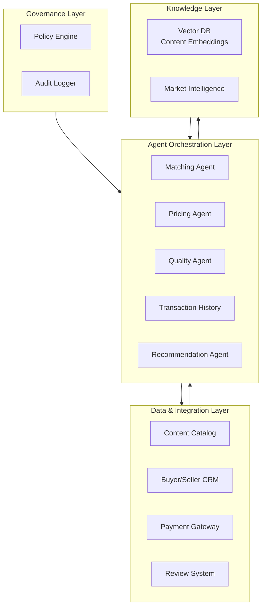

### 2.2 Agent Orchestration — Marketplace Flywheel


---

## 3. Agent Roles & Responsibilities

### 3.1 Matching Agent

| Attribute | Detail |
|-----------|--------|
| **Role** | Intelligent buyer-seller matching, content discovery |
| **Inputs** | Buyer requirements, content catalog, usage context |
| **Outputs** | Ranked content matches, relevance scores, alternatives |
| **Model** | Claude 3.7 Sonnet + two-tower neural model |
| **Tools** | Vector search, content embeddings, requirement parsing |
| **Responsibilities** | Parse buyer requirements; match against catalog; rank by relevance; suggest alternatives |

### 3.2 Pricing Agent

| Attribute | Detail |
|-----------|--------|
| **Role** | Dynamic pricing optimization, demand forecasting, revenue maximization |
| **Inputs** | Content attributes, market demand, seller goals, competitor pricing |
| **Outputs** | Optimal prices, promotional pricing, bundle suggestions |
| **Model** | Claude 3.7 Sonnet + RL pricing model |
| **Tools** | Market data, demand forecasting, competitor analysis |
| **Responsibilities** | Optimize listing prices; forecast demand; suggest bundles; maximize seller revenue |

### 3.3 Quality Agent

| Attribute | Detail |
|-----------|--------|
| **Role** | Content quality verification, authenticity validation, standards enforcement |
| **Inputs** | Content files, quality standards, buyer requirements |
| **Outputs** | Quality scores, authenticity verification, improvement suggestions |
| **Model** | Multimodal (vision + audio + text) |
| **Tools** | Quality assessment, authenticity verification, standards databases |
| **Responsibilities** | Verify content quality; validate authenticity; enforce standards; suggest improvements |

### 3.4 Transaction Agent

| Attribute | Detail |
|-----------|--------|
| **Role** | Transaction processing, escrow management, dispute handling |
| **Inputs** | Transaction details, payment methods, escrow terms |
| **Outputs** | Transaction confirmations, escrow status, dispute resolutions |
| **Model** | Claude 3.7 Sonnet |
| **Tools** | Payment gateways, escrow systems, dispute frameworks |
| **Responsibilities** | Process transactions; manage escrow; handle disputes; ensure secure transfers |

### 3.5 Recommendation Agent

| Attribute | Detail |
|-----------|--------|
| **Role** | Personalized content recommendations, cross-selling, upselling |
| **Inputs** | Buyer history, browsing behavior, purchase patterns |
| **Outputs** | Personalized recommendations, bundle suggestions, related content |
| **Model** | Claude 3.7 Sonnet + collaborative filtering |
| **Tools** | Recommendation engines, behavioral analytics, purchase history |
| **Responsibilities** | Recommend relevant content; suggest bundles; cross-sell; personalize experience |

---

## 4. Data Models & Schemas

### 4.1 Marketplace Listing Entity

```json
{
  "listing_id": "lst_001",
  "seller_id": "cre_001",
  "content_id": "cnt_001",
  "title": "Cinematic Drone Footage — City Skyline at Sunset",
  "description": "Professional 4K drone footage of city skyline during golden hour",
  "category": "video|footage|aerial",
  "tags": ["drone", "city", "skyline", "sunset", "4k", "cinematic"],
  "pricing": {
    "model": "dynamic",
    "base_price": 150,
    "current_price": 175,
    "currency": "USD",
    "license_types": {
      "standard": {"price": 150, "usage": "web, social"},
      "extended": {"price": 350, "usage": "broadcast, commercial"},
      "exclusive": {"price": 1500, "usage": "full exclusivity"}
    }
  },
  "quality": {
    "score": 0.92,
    "resolution": "4K",
    "format": "ProRes 422",
    "duration": "0:45",
    "authenticity_verified": true
  },
  "performance": {
    "views": 2500,
    "purchases": 45,
    "revenue": 7875,
    "rating": 4.8,
    "review_count": 38
  },
  "status": "active|draft|suspended|sold_exclusive"
}
```

### 4.2 Transaction Entity

```json
{
  "transaction_id": "txn_001",
  "listing_id": "lst_001",
  "buyer_id": "usr_001",
  "seller_id": "cre_001",
  "timestamp": "2026-10-02T10:00:00Z",
  "details": {
    "license_type": "extended",
    "price": 350,
    "currency": "USD",
    "usage_rights": ["broadcast", "commercial", "web"],
    "territory": "global",
    "duration": "perpetual"
  },
  "payment": {
    "method": "credit_card",
    "amount": 350,
    "fee": 52.50,
    "seller_revenue": 297.50,
    "status": "completed"
  },
  "delivery": {
    "method": "digital_download",
    "status": "delivered",
    "delivered_at": "2026-10-02T10:01:00Z"
  },
  "escrow": {
    "status": "released",
    "released_at": "2026-10-05T10:00:00Z"
  }
}
```

---

## 5. API Endpoints

| Method | Endpoint | Description |
|--------|----------|-------------|
| POST | `/api/v1/marketplace/listings` | Create new listing |
| GET | `/api/v1/marketplace/listings/{listing_id}` | Get listing details |
| PUT | `/api/v1/marketplace/listings/{listing_id}` | Update listing |
| GET | `/api/v1/marketplace/search` | Search marketplace |
| GET | `/api/v1/marketplace/recommendations` | Get personalized recommendations |
| POST | `/api/v1/marketplace/purchase` | Purchase content |
| GET | `/api/v1/marketplace/transactions/{transaction_id}` | Get transaction details |
| GET | `/api/v1/marketplace/seller/{seller_id}/dashboard` | Get seller analytics |
| GET | `/api/v1/marketplace/buyer/{buyer_id}/purchases` | Get buyer purchase history |
| POST | `/api/v1/marketplace/reviews` | Submit review |
| GET | `/api/v1/marketplace/categories` | List categories |
| GET | `/api/v1/marketplace/trending` | Get trending content |
| POST | `/api/v1/marketplace/disputes` | File transaction dispute |
| GET | `/api/v1/marketplace/pricing/{content_id}` | Get pricing recommendations |
| GET | `/api/v1/marketplace/stats` | Get marketplace statistics |

---

## 6. Key Differentiator vs Competitors

| Capability | This System | Shutterstock | Adobe Stock | Etsy Digital |
|------------|-------------|--------------|-------------|--------------|
| AI matching | ✅ Deep | ❌ Search only | ❌ Search only | ❌ Search only |
| Dynamic pricing | ✅ AI-optimized | ❌ Fixed | ❌ Fixed | ❌ Fixed |
| Quality verification | ✅ AI-powered | ❌ Manual | ❌ Manual | ❌ None |
| Fraud prevention | ✅ Advanced | ✅ Basic | ✅ Basic | ✅ Basic |
| Seller optimization | ✅ Full | ❌ None | ❌ None | ❌ None |
| Dispute resolution | ✅ Automated | ❌ Manual | ❌ Manual | ❌ Manual |

---

## 7. Estimated MRR Potential

| Segment | Customers | ARPU | MRR |
|---------|-----------|------|-----|
| Content sellers | 1,000 | $30 | $30,000 |
| Content buyers | 2,000 | $15 | $30,000 |
| Enterprise (agencies) | 20 | $500 | $10,000 |
| **Total Potential** | **3,020** | — | **$70,000** |

**Revenue model:** 15% commission on transactions + SaaS subscription for sellers. Free: list up to 10 items. Pro: $30/month for unlimited listings + analytics. Enterprise: $500/month with API access and priority support.

---

# Summary: Top 10 UGC Marketplace Projects

## Combined MRR Potential

| # | Project | MRR Range | Key Differentiator |
|---|---------|-----------|-------------------|
| 1 | Content Moderation Pipeline | $30K–60K | Multi-modal AI with contextual reasoning |
| 2 | Creator Monetization | $25K–50K | Dynamic pricing + sponsorship matching |
| 3 | Content Discovery | $30K–60K | Intent understanding + diversity optimization |
| 4 | Rights Management | $25K–50K | Automated licensing + dispute resolution |
| 5 | Quality Scoring | $20K–40K | 20+ dimensional quality assessment |
| 6 | Fraud Detection | $30K–60K | Coordinated attack detection + investigation |
| 7 | Creator Analytics | $25K–50K | Cross-platform unification + predictions |
| 8 | Licensing Engine | $30K–60K | AI matching + automated contracts |
| 9 | Community Curation | $20K–40K | Bias detection + reputation systems |
| 10 | Content Marketplace | $40K–80K | Dynamic pricing + intelligent matching |
| **Total** | **All Projects** | **$275K–540K** | — |

## Implementation Priority Matrix

| Priority | Project | Time to MRR | Complexity | Market Readiness |
|----------|---------|-------------|------------|------------------|
| 1 | Content Moderation Pipeline | 6–9 months | High | High demand |
| 2 | Creator Analytics | 6–9 months | Medium | High demand |
| 3 | Fraud Detection | 6–9 months | High | High demand |
| 4 | Content Discovery | 6–9 months | High | High demand |
| 5 | Quality Scoring | 6–9 months | Medium | Medium demand |
| 6 | Creator Monetization | 6–9 months | Medium | High demand |
| 7 | Rights Management | 6–9 months | High | Medium demand |
| 8 | Licensing Engine | 6–12 months | High | Medium demand |
| 9 | Community Curation | 6–9 months | Medium | Medium demand |
| 10 | Content Marketplace | 6–12 months | High | High demand |

## Shared Infrastructure

All 10 projects share the following infrastructure components:

- **GRC_Claw Governance Layer** — Policy engine, audit logging, compliance
- **LangChain DeepAgents** — Agent orchestration and reasoning
- **ApexGraphSwarm** — Multi-agent coordination
- **Nerve** — Decision-making and governance
- **Laya** — Knowledge management
- **Cognee** — Memory and context
- **FastAPI** — API gateway
- **PostgreSQL** — Primary data store
- **Redis** — Caching and session management
- **ArangoDB** — Graph data (relationships, networks)
- **Vector DB** — Embeddings and similarity search
- **Docker + Kubernetes** — Container orchestration
- **GitHub Actions** — CI/CD pipelines

---

> **Document Version:** 1.0 | **Last Updated:** 2026-10-02 | **Author:** Ahmed Hassan  
> **Next Review:** 2026-11-02
