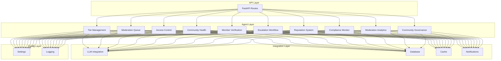

# Gated Communities - Unified Platform

A production-grade, modular gated community management platform consolidating 10 independent services into a single standalone application.

## Architecture



## Modules

| Module | Description | Agents |
|--------|-------------|--------|
| **Tier Management** | Member tier evaluation, benefits, upgrades | 6 agents |
| **Moderation Queue** | Auto-moderation, queue optimization, escalation | 7 agents |
| **Access Control** | Permission evaluation, role management, policy enforcement | 6 agents |
| **Community Health Scorer** | Toxicity detection, engagement metrics | 2 agents |
| **Member Verification** | Identity verification, fraud prevention, trust scoring | 6 agents |
| **Escalation Workflow** | Auto-resolution, SLA tracking, priority routing | 6 agents |
| **Reputation System** | Reputation scoring, badges, trust tiers | 6 agents |
| **Compliance Monitor** | Policy tracking, violation detection, audits | 6 agents |
| **Moderation Analytics** | Trend analysis, predictor, performance metrics | 6 agents |
| **Community Governance** | Dispute resolution, rule enforcement, policy management | 6 agents |

**Total: 57 agents across 10 modules**

## Quick Start

### Docker Compose (Recommended)

```bash
docker-compose up -d
```

### Local Development

```bash
# Create virtual environment
python -m venv .venv
source .venv/bin/activate

# Install dependencies
pip install -e ".[dev]"

# Run tests
pytest

# Start server
uvicorn gated_communities.main:app --reload
```

### Kubernetes

```bash
kubectl apply -f k8s/
```

## API Documentation

- Swagger UI: http://localhost:8000/docs
- ReDoc: http://localhost:8000/redoc
- OpenAPI: http://localhost:8000/openapi.json

## Project Structure

```
gated-communities/
├── src/gated_communities/
│   ├── agents/           # 57 AI agents across 10 modules
│   ├── api/              # FastAPI routes
│   ├── integrations/     # External service integrations
│   ├── config/           # Settings and logging
│   ├── models/           # Pydantic schemas
│   └── tests/            # Test suite
├── k8s/                  # Kubernetes manifests
├── .github/workflows/    # CI/CD pipeline
├── Dockerfile
├── docker-compose.yml
├── pyproject.toml
└── README.md
```

## Environment Variables

| Variable | Default | Description |
|----------|---------|-------------|
| `DATABASE_URL` | - | PostgreSQL connection string |
| `REDIS_URL` | - | Redis connection string |
| `LLM_API_KEY` | - | OpenAI API key |
| `LOG_LEVEL` | INFO | Logging level |
| `ENVIRONMENT` | production | Deployment environment |

## License

MIT
