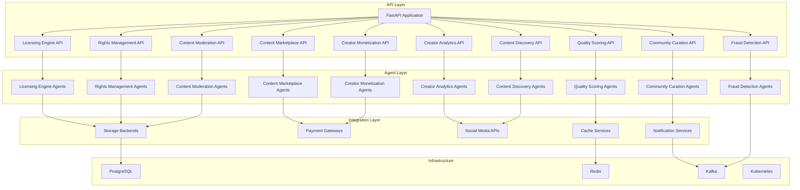

# UGC Marketplace

Unified agentic AI platform for content marketplace operations. Consolidates 10 separate UGC marketplace projects into a single, standalone, modularized Python project.

## Architecture



## Modules

### Content Moderation Pipeline
- Text, image, and video moderation agents
- Policy enforcement with regex/keyword matching
- Appeal handling workflow
- Batch moderation support

### Creator Monetization
- Revenue analytics and reporting
- Payout management
- Subscription management
- Tier recommendation engine
- Stripe, PayPal, and Patreon integrations

### Content Discovery
- Semantic search with vector embeddings
- Personalized recommendations
- Trend detection
- Search explanation

### Rights Management
- Copyright infringement detection
- License detection and validation
- Usage tracking
- Takedown request processing

### Quality Scoring
- Readability analysis (Flesch-Kincaid)
- Originality scoring
- Engagement potential scoring
- SEO optimization scoring
- Improvement suggestions

### Fraud Detection
- Anomaly detection
- Pattern matching
- Risk scoring
- Account analysis
- Real-time transaction monitoring

### Creator Analytics
- Audience analysis
- Content performance tracking
- Engagement analysis
- Growth prediction
- Revenue tracking
- YouTube, Twitter, Instagram, TikTok integrations

### Licensing Engine
- License agreement generation
- Terms negotiation
- Compliance tracking
- Royalty calculation
- Contract analysis

### Community Curation
- Content ranking
- Quality filtering
- Topic clustering
- Trend surfacing
- Curation explanation

### Content Marketplace
- Listing management
- Pricing optimization
- Transaction processing
- Trust scoring
- Marketplace analytics

## Quick Start

### Docker

```bash
docker-compose up -d
```

### Local Development

```bash
pip install -e ".[dev]"
uvicorn ugc_marketplace.main:app --reload
```

### Kubernetes

```bash
kubectl apply -k k8s/overlays/development/
```

## API Documentation

Once running, visit:
- Swagger UI: http://localhost:8000/docs
- ReDoc: http://localhost:8000/redoc
- OpenAPI: http://localhost:8000/openapi.json

## Configuration

All settings are configurable via environment variables or `.env` file:

| Variable | Default | Description |
|----------|---------|-------------|
| `APP_ENV` | `development` | Environment (development/production) |
| `LOG_LEVEL` | `INFO` | Logging level |
| `DATABASE_URL` | `postgresql+asyncpg://...` | PostgreSQL connection |
| `REDIS_URL` | `redis://localhost:6379/0` | Redis connection |
| `KAFKA_BOOTSTRAP_SERVERS` | `localhost:9092` | Kafka brokers |
| `OPENAI_API_KEY` | - | OpenAI API key |
| `SECRET_KEY` | `change-me-in-production` | Application secret |

## Testing

```bash
pytest --cov=src/ugc_marketplace --cov-report=term-missing
```

## License

MIT
